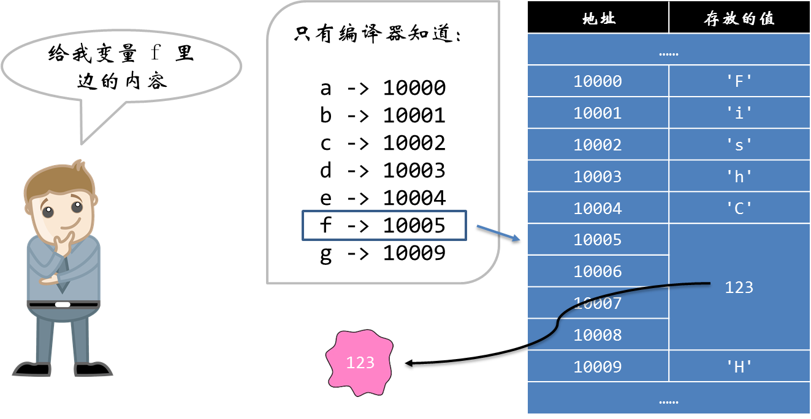

## 编译

**使用 GCC 编译程序：gcc 源代码 -o 可执行文件。**

成功编译后是不显示任何东西的。如果哗啦啦地显示一丢丢文字，那肯定是你的代码哪里出了问题：


单行注释：//注释内容

​	以//的单行注释，以换行符结束

多行注释：/* 注释内容 */

 这种注释可以跨越多行

## 标识符

- C语言变量名只能是英文字母（A-Z，a-z）和数字（0-9）或者下划线（_）组成，其他特殊字母不行。下横线通常用于连接一个比较长的变量名，比如i_love_fishC
- 第一个字母必须是由英文字母或者下划线开头，也就是不能用数字开头。
- 变量名区分大小写。因为C语言是大小写敏感的编程语言，也就是大写的FISHC跟小写的fishc会被认为是不同的两个名字。在传统的命名习惯中，我们用小写字母来命名变量，用大写字母来表示符号常量名。
- 不能使用关键字来命名变量。

​	标识符区分大小写。

## 数据类型


char 字符型，占用一个字节
int 整型，通常反映了所用机器中整数的最自然长度
float 单精度浮点型
double 双精度浮点型 

这里 C 语言并没有限制 int 的坑具体要挖多大，short int 或 long int 的坑又要挖多大。标准只是要求：short int <= int <= long int <= long long int。

sizeof 运算符

sizeof 用于获得数据类型或表达式的长度，它有三种使用方式：

- sizeof(type_name); //sizeof(类型);
- sizeof(object); //sizeof(对象);
- sizeof object; //sizeof 对象;

signed 和 unsigned

还有一对类型限定符是 signed 和 unsigned，它们用于限定 char 类型和任何整型变量的取值范围。

signed 表示该变量是带符号位的，而 unsigned 表示该变量是不带符号位的。带符号位的变量可以表示负数，而不带符号位的变量只能表示正数，它的存储空间也就相应扩大一倍。默认所有的整型变量都是 signed 的，也就是带符号位的。

因此加上 signed 和 unsigned 限定符，四种整型就变成了八种：

- [signed] short [int]
- unsigned short [int]
- [signed] int
- unsigned int
- [signed] long [int]
- unsigned long [int]
- [signed] long long [int]
- unsigned long long [int]

## 常量

```c
#define URL "http://www.iappsasia.com"
#define YEAR 2022
```

其中这个 #define 是一条预处理命令（预处理命令都以"#"开头），我们也称为宏定义命令。它的功能就是把程序中所有出现的标识符都替换为随后的常量。

`#` 预处理命令

字符串常量

C 语言用一个特殊的转义字符来表示字符串的结束位置。这样当操作系统读取到这个转移字符的时候，就知道该字符串到此为止了。

这个转义字符就是空字符：'\0'


### define宏定义

以#号开头的都是编译预处理指令，而它们不是C语言的成分。
#define用来定义一个宏，程序在预处理阶段将用define定义的来将内容进行了替换。
不带参数的宏：#define< 名字 >< 值 >
带参数的宏： 像函数的宏 「#define 宏名」（形参表）字符串

**定义量个宏，分别叫 S(r) 和 C(r)，通过它可以计算得到半径为 r 的圆的面积和周长。**

```c
#include <stdio.h>

#define PI 3.14159
#define S(r) PI * r * r
#define C(R) 2 * PI * r

int main()
{
        int r = 5;

        printf("半径为%d的圆，面积是：%.2f，周长是：%.2f\n", r, S(r), C(r));

        return 0;
}
```

返回数组元素的个数

```c
#define ARR_SIZE( a ) ( sizeof( (a) ) / sizeof( (a[0]) ) )
```


## 取值范围

 **符号位**

存放 signed 类型的存储单元中，左边第一位表示符号位。如果该位为 0，表示该整数是一个正数；如果该位为 1，表示该整数是一个负数。

一个 32 位的整型变量，除去左边第一位符号位，剩下表示值的只有 31 个比特位。

**补码**

计算机是用补码的形式来存放整数的值。

正数的补码是该数的二进制形式。

负数的补码需要通过以下几步获得：

- 先取得该数的绝对值的二进制形式

- 再将第1步的值按位取反

- 最后将第2步的值加1

- 

  

  【扩展阅读】[使用补码的好处](https://fishc.com.cn/thread-67124-1-1.html)

二进制表示最大值和最小值


**基本数据类型的取值范围**


## 字符串

**字符类型事实上是一个特殊的整数类型**
字符类型事实上是一个特殊的整型，因此它也有取值范围，signed char 的取值范围是 -128 ~ 127；unsigned char 的取值范围是 0 ~ 255。

字符类型与普通整数类型的不同之处
C 标准规定普通整数类型默认使用 signed 修饰符，但没有规定 char 的默认修饰符。因此，使用 signed 或 unsigned 修饰符，是由编译系统自行决定。


存放在字符类型中的变量，都可以被解释为 ASCII 字符表中的对应字符  , ASCII 字符表 -> [传送门](https://fishc.com.cn/thread-67427-1-1.html)

标准 ASCII 字符表使用7位二进制数来表示所有的大写和小写字母，数字 0 到 9、标点符号， 以及在美式英语中使用的特殊控制字符。
其中，ASCII 字符表上的数字 0 ~ 31 以及 127（共 33 个）分配给了控制字符，用于控制像打印机等一些外围设备。这些是看不到的。数字 32 ~ 126 分配给了能在键盘上找到的字符，这些是所见即所得的。


字符串

C 语言没有专门为存储字符串设计一个单独的类型，因为没必要。我们之前已经说过，字符串事实上就是一串字符。所以只需要在内存中找一块空间，然后存放一串字符类型的变量即可。

声明字符串的语法：

```c
char 变量名[数量];
```

对其进行赋值，事实上就是对这一块空间里边的每一个字符变量进行赋值。我们通过索引号来获得每个字符变量的空间。

```c
变量名[索引号] = 字符;
```

比如：

```c
char name[6];

name[0] = 'F';
name[1] = 'i';
name[2] = 's';
name[3] = 'h';
name[4] = 'C',
name[5] = '\0';
当然，我们可以把声明和定义写在一块，语法是这样的：
```

```c
char name[6] = {'F', 'i', 's', 'h', 'C', '\0'};
其实，中括号（[]）里边的数量咱可以不写，编译器会自动帮你计算的。
```

```c
char a[] = {'F', 'i', 's', 'h', 'C', '\0'};
事实上可以直接在大括号写上字符串常量，字符串常量用双引号括起来，还记得吧：
```

```c
char a[] = {"FishC"};
```


使用字符串常量有个好处，那就是你不必亲自在末尾添加 '\0'，它会自动帮你加上。最后，如果使用字符串常量的话，这个大括号也是可以省掉的：

```c
char a[] = "FishC";
```

从标准输入流中取一个值到指定变量 `scanf()`

```c
#include <stdio.h>

int main()
{
	int a;
	printf("请输入一个整数:");
	scanf("%d",&a);
	printf("您输入的是: %d",a);
	return 0;
}
```

**1. 赋值运算符**

赋值运算符是 C 语言中用得最多的一个运算符，我们每天都在用它。因此它的设计简便与否直接影响到了 C 语言的开发效率。语法很简单，就是将右边的值放到左边的变量里边，因为它的执行方向是自右向左。

```c
int a;
a = 5;
```


需要注意的是赋值运算符的左边必须是一个 lvalue，变量名就是 lvalue，但常数就不是了，所以你把 5 写在赋值号的左边就会出错：

```c
5 = a;
```

编译系统会提示类似于“error: lvalue required as left operand of assignment”的错误。
lvalue 不建立理解为“left value of the赋值运算符”，这里我写了篇文章，大家可以参考下 ->[什么是 lvalue，什么是 rvalue？](https://fishc.com.cn/thread-69833-1-1.html)


**2. 复合的赋值运算符**

由于赋值运算符的使用度非常高，所以 C 语言的作者也想出了一些编辑的方案。

比如：

```c
a = a + 1;
```


这样写太费劲，你完全可以写成：

```c
a += 1;
```

同理还有：

```c
a -= 2;
a += 3;
a /= 4;
a %= 5;
```

**3. 自增自减运算符**

当我们需要对一个变量加一或减一并赋值给自己的时候，我们可以写成 i++、i— 或 ++i、--i 的形式。

它们也被称为增量减量运算符，或 ++、-- 运算符。

它们的区别是：

- i++ 是先使用变量 i 中保存的值，再对自身进行 ++ 运算；
- ++i 是先对自身进行 ++ 运算，再使用变量 i 的值（这时候变量i的值已经加 1 了）。

另外，自增、自减运算符只能作用于变量，而不能作用于常量或表示。


**4. 逗号运算符**

逗号表达式的语法是：表达式1，表达式2，表达式3，...... ，表达式n

- 逗号表达式的运算过程为：从左往右逐个计算表达式；
- 逗号表达式作为一个整体，它的值为最后一个表达式（也即表达式n）的值。


不过，逗号运算符在C语言的所有运算符中，是最没有地位的那个。

因为连赋值运算符的优先级都比逗号运算符要高，所以……

```c
a = 3, 5
```


相当于

```c
a = 3;
5;
```


注意：在 C 语言中看到的逗号，不一定就都是逗号运算符，因为在有些地方，逗号仅仅是被用作分隔符而已。

比如：

```c
int a, b, c;

scanf("%d%d%d", &a, &b, &c);
```

这里逗号都是作为分隔符使用，而不是运算符。
**5. 条件运算符**

有一个操作数的运算符称为单目运算符，有两个两个操作数称为双目运算符，然而 C 语言还有唯一的一个三目运算符，它的作用是提供一种简写的方式来表示 if-else 语句。

语法：exp1 ? exp2 : exp3;

exp1 是条件表达式，如果结果为真，返回 exp2，如果为假，返回 exp3。

所以：

```c
if (a > b)
{
    max = a;
}
else
{
    max = b;
}
```


可以直接写成：

```c
max = a > b ? a : b;
```

**6. goto 语句**

goto 语句可以说是一个历史遗留，因为早的编程语言都留有很多汇编语言的痕迹，比如 goto 语句就是其中之一。

goto 语句的作用就是直接跳转到指定标签的位置。

语法：goto 标签;

其中标签需要被定位于某个语句的前边，比如：

```c
#include <stdio.h>

int main()
{
        int i = 5;

        while (i++)
        {
                if (i > 10)
                {
                        goto Label;
                }
        }

Label:  printf("Here, i = %d\n", i);

        return 0;
}
```

**重要：开发中要尽量避免使用 goto 语句。其实就连 C 语言的作者也觉得 goto 语句非常容易被滥用，并且建议一定要谨慎使用，甚至根本不用它。**

但在一种情况下使用 goto 语句是情有可原的，那就是当面临要跳出多层循环的时候，使用 goto 语句要比多个 break 语句好使。


**7. 注释**

C 语言的注释有两种方式，一种是大家常用的，将注释写在两个连续斜杠的后边：

```c
// 这是注释，编译器不会理会
```


这样每一行注释的开头都需要有两个斜杠，有时候你可能需要写多行注释，那你可以使用 /* 注释的内容 */ 来实现：

```c
/* 这是一个跨越多行的注释
   这是注释，编译器不会理会
   这是注释，编译器不会理会
   这是注释，编译器不会理会
   这是一个跨越多行的注释 */
```


## 算术运算符

C 语言通过提供大量的运算符来支持我们对数据进行处理，前边我们将一个值存放到变量中，使用的是赋值运算符，就是等于号（=），上节课对字符串中的某个字符进行索引，使用方括号（[]）作为下标运算符实现。

这一节我们谈的是 C 语言中最常用的运算符——算数运算符。


这里有几点要跟大家说一下：

- 因为键盘上没有乘号和除号两个按键，所以用星号（*）和斜杠（/）代替，这几乎是潜规则了。
- **对于整数间的除法是采取直接舍弃小数部分的方式，而不是什么四舍五入噢**。
- 对于浮点数间的除法则能获得一个相对逼近结果的值（如果除不尽或位数特别多的话）。
- 百分号（%）在这里是表示求余数的意思，但求余运算符要求两边的操作数都要是整数，其结果也是整数。

**2. 何谓“目”？**

大家可能看到有些运算符后边写双目，有些写单目，那么什么是目呢？

我们把被运算符作用的运算对象称之为操作数，比如 1 + 2，那么 1 和 2 就是被加法运算符（+）作用的两个操作数。我们说一个运算符是双目运算符还是单目运算符，就是看它有多少个操作数。
**3. 表达式**

用运算符和括号将操作数连接起来的式子，我们称之为表达式。

```c
1 + 1
'a' + 'b'
a + b
a + 'b' + pow(a, b) * 3 / 4 + 5
```

**4. 运算符的优先级和结合性**

请参考：https://fishc.com.cn/thread-67664-1-1.html
**5. 类型转换**

当一个运算符的几个操作数类型不同时，编译器需要将它们转换为共同的某种数据类型，才能进行运算。

通常情况下，编译器会将占用坑位比较小的操作数，先转换为与坑位较大的操作数的相同类型，然后再进行运算。这样做的目的就是为了确保计算的精确度。

除了编译器帮你自动转换不同类型的操作数之外，C 语言还允许你强制转换操作数的数据类型。做法就是在操作数的前边用小括号将目标数据类型括起来。

是一个合法的运算表达式。在进行运算时，不同类型的数据要先转换成同一类型，然后再进行运算。C语言数据类型转换可以归纳成三种转换方式：自动转换，赋值转换和强制转换。

一、类型自动转换
在进行运算时，不同类型的数据要转换成同一类型。自动转换的规则如图

转换方法为：

float型数据自动转换成double型；
char与short型数据自动转换成int型；
int型与double型数据运算，直接将int型转换成double型
int型与unsigned型数据、直接将int型转换成unsigned型；
int型与long型数据，直接将int型转换成long型。
如此等等，总之是由低级向高级型转换。对于图中列出的自动类型转换，不要错误地理解为先将char型或short型转换成int型，再转换成unsigned型，再转换成long型，直至double型。例如，有如下定义：

```c
char ch='a’
int i=13:
float x=3.65;
double y=7.528e-6;
```

若表达式为

```c
i+ch+x*y
```

则表达式的类型转换是这样进行的：

先将ch转换成int型，计算i+ch，由于ch=‘a’，而‘a’的ASCH码值为97，故计算结果为110，类型为int型。再将x转换成double型，计算x*y，结果为double类型。最后将i+ch的值110转换成double型，表达式的值最后为double类型。

二、赋值转换
如果赋值运算符两侧的类型不一致，但都是数值型或字符型时，在赋值时要进行类型转换。转换的基本原则如下。

将整型数据赋给单、双精度变量时，数值不变，但以浮点数形式存储到变量中
将实型数据(包括单、双精度)赋给整型变量时，舍弃实数的小数部分。如x为整型变量，执行“x=4.25”时，取值为x=4。
同类型的短数据赋值给长变量，自动转换是正确的，例如，char和short型数据给int型变量赋值。
同类型的长数据给短变量赋值可能出错。例如，当unsigned int型的值超过了int变量的取值范围，赋值会出错
例如：unsigned int 变量给int变量赋值出错

```c
#include <stdio.h>
#include<windows.h>
void main()
{
	unsigned int l= 4294967295 ;/*将最大的无符号整型数赋给变量1*/
	int a;
	a=l;/*将l的值赋给变量a*/
	printf("%12d\n",a);/*输出变量a的值*/
	system("pause");
}

```

输出结果为：-1

“l= 4294967295 ”赋值给int型变量a，a的值却是-1。这是因为a是有符号数，最高位是符号位，为1表示该数是负数。
无符号整型数4294967295的32位二进制位都是1，而有符号int型-1用32位全1的二进制位表示。

```c
#include<stdio.h>
#include<windows.h>
#include<math.h>
void main(){
	char ch='A';//定义字符型变量，并赋初值‘A’
	int a,b=3,c;//定义整型变量，并给变量b赋初值3
	float x1,x2=2.5;//定义单精度浮点型变量
	a=ch;//将字符型变量ch的值'A'赋给整型变量a
	x1=a;
	c=x2;//x2的值2.5赋给整型变量c 
	printf("%4c,%4d,%6.2f,%4d\n", ch,a,x1,c);//输出变量ch、a、x1和c的值getchar();
}

```

输出结果为：

A 65 65.00 2

第一个输出数据是字符变量ch的值字符’A’；第二个输出数据是整型变量a的值65，字符’A’的ASCII码转换成32位的整型数据；第三个输出数据是实型变量xl的值65.00，由int型变量a的值65自动转换成float类型；第四个数据是整型变量c的值，由实型变量x2的值2.5自动转换成整型数2。

三、强制类型转换
可以利用强制类型转换运算符将一个表达式转换成所需类型。如：

```c
(double)x/*将x转换成double型*/ 
(int)(a+b)/*强制将a+b的值转换成整型*/
(float)(10%3)/*将10%3的值转换成float型*/ 

```

强制类型转换的一般形式为：
（类型名）（表达式）
例如：

```c
int a=7,b=2;
float y1,y2;
float y1=a/b;/*y1的值a/b为3.0*/
y2=(float)a/b;/*y2的值为3.5，float将a进行强制转换为实型，b也随之自动转换为实型*/

```

(int)(x+y)和(int)x+y强制类型转换的对象是不同的。(int)(x+y)是对x+y进行强制类型转换；而(int)x+y则只对x进行强制类型转换。


## 关系运算符

在 C 语言中，使用关系运算符来比较两个数的大小关系。


关系运算符都是双目运算符，其结合性均为左到右。另外，关系运算符的优先级低于算术运算符，高于赋值运算符。


**2. 关系表达式**

用关系运算符将两边的变量、数据或表达式连接起来，称之为关系表达式：

```c
1 < 2
a > b
a <= 1 + b
'a' + 'b' <= 'c'
(a = 3) > (b = 5)
```


关系表达式得到的值是一个逻辑值，即判断结果为“真”或“假”，如果结果为“真”，关系表达式的值为 1，如果为“假”，关系表达式的值则为 0。


**3. 逻辑运算符**

C 语言总共提供了三种逻辑运算符：


**4. 逻辑表达式**

用逻辑运算符将两边的变量、数据或表达式连接起来，称之为逻辑表达式：

```c
3 > 1 && 1 < 2
3 + 1 || 2 == 0
!(a + b)
!0 + 1 < 1 || !(3 + 4)
'a' - 'b' && 'c'
```


注：关系表达式和逻辑表达式得到的值都是一个逻辑值，也就是表示真的 1 和表示假的 0。但是用于判断一个值是否为真时，以 0 表示假，以任何非 0 的数表示真。一个是编译系统告诉我们的结果，一个是我们让编译系统去判断的，两者方向不同。


**5. 短路求值**

短路求值又称最小化求值，是一种逻辑运算符的求值策略。只有当第一个运算数的值无法确定逻辑运算的结果时，才对第二个运算数进行求值。

C 语言对于逻辑与和逻辑或采用短路求值的方式。

```c
#include <stdio.h>

int main()
{

	int a = 3, b = 3;

	(a = 0) && (b = 5);
	printf("a = %d, b = %d\n", a, b);

	(a = 1) || (b = 5);
	printf("a = %d, b = %d\n", a, b);

	return 0;
}
```


## if语句

那么光有关系表达式和逻辑表达式还不足以实现分支结构，还需要学习一个新的语句——if 语句。

if 语句的实现有好几种形式，我们逐一给大家介绍一下。

**第一种：**

```c
…… // 其它语句
if (表达式)
{
    …… // 逻辑值为真所执行的语句、程序块
}
…… // 其它语句
```


第一种是最简单的，if 后边小括号内填写返回逻辑值的表达式，当然你可以直接填入一个逻辑值，当你填入这个值为非 0 的时候，编译系统就会认为这个逻辑值是真；只有当你填入 0 的时候，才被认为是假的。

**第二种：**

```c
…… // 其它语句
if (表达式)
{
    …… // 表达式的逻辑值为真所执行的语句、程序块
}
else
{
    …… // 表达式的逻辑值为假所执行的语句、程序块
}
…… // 其它语句
```


**第三种：**

```c
…… // 其它语句
if (表达式1) 
{
    …… // 表达式 1 的逻辑值为真所执行的语句、程序块
}
else if (表达式2)
{
    …… // 表达式 2 的逻辑值为真所执行的语句、程序块
}
else if (表达式3)
{
    …… // 表达式 3 的逻辑值为真所执行的语句、程序块
}
  .
  .
  .
else if (表达式n)
{
    …… // 表达式 n 的逻辑值为真所执行的语句、程序块
}
else
{
    …… // 上面所有表达式的逻辑值均为假所执行的语句、程序块
}
…… // 其它语句
```


## switch语句和分支嵌套

**处理多分支结构，可以考虑使用语法更简便的 switch 语句**

```c
…… // 其它语句
switch (表达式)
{
        case 常量表达式 1: 语句或程序块;
        case 常量表达式 2: 语句或程序块;
        ……
        case 常量表达式 n：语句或程序块;
        default: 语句或程序块;
}
…… // 其它语句
```

- 这里每个 case 后边的常量是匹配 switch 后边表达式的值
- case 后边必须跟一个常量值，而不能是一个范围
- 如果所有的 case 均没有匹配的，那么执行 default 的内容
- default 是可选的，如果没有 default，并且所有的 case 均不匹配，那么 switch 语句不执行任何动作


**2. 使用 break 语句跳出**

switch 语句中的 case 和 default 事实上都是“标签”，用来标志一个位置而已。当 switch 跳到某个位置之后，就会一直往下执行，所以我们这里还需要配合一个 break 语句，让代码在适当的位置跳出 switch。

事实上 break 语句在循环中能发挥更大的作用(⊙o⊙)哦！


**3. 分支结构的嵌套**

如果在一个 if 语句中包含另一个 if 语句，我们就称之为 if 语句的嵌套，也叫分支结构的嵌套。


**4. 悬挂 else**

这个问题虽然已经为人熟知，而且也并非 C 语言所独有。但即使是有多年经验的 C 程序员，也常常在此失误过！

考虑下面的代码片段：

```c
……
if (x == 0)
    if (y == 0)
        error();
else
    z = x + y;
……
```


这段代码中编程者的本意是应该有两种主要情况，x 等于 0 以及 x 不等于 0。对于 x 等于 0 的情形，除非 y 也等于 0（此时调用 error 函数），否则程序不作任何处理；对于 x 不等于 0 的情形，程序将 x 与 y 之和赋值给 z。

然而，这段代码实际上所做的却与编程者的意图相去甚远。

原因在于 C 语言中有这样的规则，else 始终与同一对括号内最近的未匹配的 if 结合。如果我们按照上面这段程序实际上被执行的逻辑来调整代码缩进，大致是这个样子：

```c
……
if (x == 0)
    if (y == 0)
        error();
    else
        z = x + y;
……
```


也就是说，如果 x 不等于 0，程序将不会做任何处理。如果要得到原来的例子中由代码缩进体现的编程者本意的结果，应该这样写：

```c
……
if (x == 0)
{
    if (y == 0)
    {
        error();
    }
}
else
{
    z = x + y;
}
……
```

现在，else 与第一个 if 结合，即使它离第二个 if 更近也是如此，因为此时第二个 if 已经被括号“封装”起来了。


**5. 等于号带来的问题**

在 C 语言中使用等号（=）作为赋值运算，使用连续两个等号（==）作为比较运算。一般而言，赋值运算相对于比较运算出现得更频繁，因此字符较少的 = 就被赋予了更常用的含义——赋值操作。此外，在 C 语言中赋值符号被作为一种操作符对待，因而重复进行赋值操作（如 a = b = c）可以很容易地书写，并且赋值操作还可以被嵌入到更大的表达式中。

但是，这种使用上的便利性可能导致一个潜在的问题：当程序员本意是在作比较运算时，却可能无意中误写成赋值运算。

比如下例，该语句本意似乎是要检查 x 是否等于 y ：

```c
if (x = y)
		break;
```


而实际上是将 y 的值赋给了 x ，然后检查该值是否为零。

再来看看下面的例子：

```c
if (c = ' ' || c == '\t' || c == '\n')
    space = space + 1;
```

该程序的本意是计算空白字符（空格符、制表符和换行符）的数量，但是由于程序员在比较字符 ' ' 和变量 c 时，误将比较运算符 == 写成了赋值运算符 = 。因为赋值运算符 = 的优先级要低于逻辑运算符 || ，因此实际上是将以下表达式的值赋给了 c ：

```c
' ' || c == '\t' || c == '\n'
```


因为空格（' '）不等于零（空格的 ASCII 码值为32），那么无论变量 c 此前为何值，上述表达式的值都是 1。


## while语句和do...while语句

**循环结构**

什么是循环结构？我们为什么需要它呢？

在现实生活中，如果重复很多次做同一件事情，往往会让人感觉很懊恼。

在编程中我们大可不必如此——当我们需要重复执行同一段代码很多次的时候，就可以使用循环结构来解决。


**2. while 语句**

```c
while (表达式)
        循环体
```


while 语句的语法非常简单，只要表达式的值为真，那么就会不断执行循环体里边的语句或程序块。

执行过程画成流程图如下：


**3. do…while 语句**

除了通过 while 语句实现循环，C 语言中还有一个叫 do…while 的语句，也是用于实现循环。

```c
do
    循环体
while (表达式);
```

如果我们把 while 语句比喻为一个谨慎的小伙子的话，那么 do…while 语句就是一个莽撞的汉子。

因为 while 是先判断表达式，如果表达式结果为真，才执行循环体里边的内容；

而 do…while 则相反，不管三七二十一，先执行循环体的内容再判断表达式是否为真。

注意：do…while 语句在 while 后边一定要用分号（;）表示语句结束。


**4. [getchar](https://fishc.com.cn/thread-68661-1-1.html) -- 从标准输入流中获取字符**


## for语句和循环嵌套

**1. 入口条件循环和出口条件循环**


**2. 循环的基本结构**


通常一个循环都将涉及到三个动作：


- 初始化计数器
- 判断循环条件是否满足
- 更新计数器


**3. for 语句**

对于 while 语句，这些动作是分散在三个不同的地方。那如果能够把它们都集中到一块，那么对于后期无论是调试也好修改也罢，无疑就便捷了许多。没错，当年 C 语言作者也是跟我们想到一块去了，所以 for 语句就这么应运而生。


for (表达式1; 表达式2; 表达式3)

​     循环体


三个表达式用分号隔开，其中：

- 表达式1是循环初始化表达式
- 表达式2是循环条件表达式
- 表达式3是循环调整表达式


这样一来，for 语句将初始化计数器、循环条件判断、更新计数器三个动作组织到了在一起，那么以后如果要修改循环的次数，每次递进的跨度，或者循环结束条件，只需要在 for 语句后边的小括号内统一修改即可。


**4. 灵活的 for 语句**

for 语句的表达式1，表达式2和表达式3都可以按照需要进行省略（但分号不能省）：

- for ( ; 表达式2; 表达式3)
- for (表达式1; 表达式2; )
- for (表达式1; ; )
- for ( ; ; )
- ……\
- 注意：如果目的不是特别明确，建议不要这么做，因为程序的可读性会因此而降低！


**5. 最后提一下 C99 的新标准：C99 允许在 for 语句的表达式1中定义变量。**

```c
#include <stdio.h>

int main()
{
        for (int i=0, int j=10; i < j; i++, j--)
        {
                printf("%d\n", i);
        }

        return 0;
}
```

注意：在编译时需要加上–std=c99，否则可能会出错。

```c
[fishc@localhost s1e14]$ gcc –std=c99 test.c && ./a.out
0
1
2
3
4
```


增加这个新特性的原因主要是考虑到循环通常需要一个计数器，而这个计数器出了循环就没什么用了。所以在表达式1的位置定义的变量，活动范围仅限于循环中，出了循环，它就无效了。


**6. 循环嵌套**

循环结构跟分支结构一样，都可以实现嵌套。

对于嵌套的循环结构，执行顺序是从内到外：先执行内层循环，再执行外层循环。

## break语句和continue语句

**1. break 语句**

那么在循环体中，如果我们想要让程序在中途跳出循环，那么我们同样可以使用 break 语句来实现。

执行 break 语句，直接跳出循环体。

有一点需要注意的是，对于嵌套循环来说，break 语句只负责跳出所在的那一层循环，要跳出外层循环则需要再布置一个 break 语句才行。


**2. continue 语句**

当满足某个条件的时候，跳过本轮循环的内容，直接开始下一轮循环。这时候我们应该使用 continue 语句。

当执行到 continue 语句的时候，循环体的剩余部分将被忽略，直接进入下一轮循环。

对于嵌套循环来说，continue 语句跟 break 语句是一样的：它们都只能作用于一层循环体。


**3. for 语句和 while 语句执行过程的区别**

for 语句和 while 语句执行过程是有区别的，它们的区别在于出现 continue 语句时。

在 for 语句中，continue 语句跳过循环的剩余部分，直接回到调整部分。

在 while 语句中，调整部分是循环体的一部分，因此 continue 语句会把它也跳过。


## 数组

**1. 数组的含义**

一言以蔽之，数组就是存储一批同类型数据的地方。


**2. 定义数组**

类型 数组名[常量表达式]

```c
int a[6]; // 定义一个整型数组，总共存放 6 个元素
char b[24]; // 定义一个字符型数组，总共存放 24 个元素
double c[3]; // 定义一个双精度浮点型数组，总共存放 3 个元素
```


在定义数组时，需要在数组名后边紧跟着一对方括号，其中用常量表达式来指定数组中元素的个数。因为只有告诉编译器元素的个数，编译器才能申请对应大小的内存给它存放。

**3. 访问数组**

数组名[下标]
```c
a[0]; // 访问 a 数组中的第 1 个元素
b[1]; // 访问 b 数组中的第 2 个元素
c[5]; // 访问 c 数组中的第 6 个元素

// 注意：

int a[5]; // 创建一个具有 5 个元素的数组
a[0]; // 访问第 1 个元素的下标是 0，不是 1
a[5]; // 报错，因为第 5 个元素的下标是 a[4]
```

**4. 数组的初始化**

在定义数组的同时对其各个元素进行赋值，称之为数组的初始化。

数组的初始化方式有很多，下边逐个给大家介绍！

A. 将数组中所有元素统一初始化为某个值，可以这么写：

```c
int a[10] = {0}; // 将数组中所有元素初始化为 0
```

B. 如果是赋予不同的值，那么用逗号分隔开即可：

```c
int a[10] = {1, 2, 3, 4, 5, 6, 7, 8, 9, 0};
```

C. 你还可以只给一部分元素赋值，未被赋值的元素自动初始化为 0：

```c
int a[10] = {1, 2, 3, 4, 5, 6}; // 表示为前边 6 个元素赋值，后边 4 个元素系统自动初始化为 0
```

D. 有时候还可以偷懒，可以只给出各个元素的值，而不指定数组的长度（因为编译器会根据值的个数自动判断数组的长度）：

```c
int a[] = {1, 2, 3, 4, 5, 6, 7, 8, 9, 0};
```

E. C99 增加了一种新特性——指定初始化的元素。这样就可以只对数组中的某些指定元素进行初始化赋值，而未被赋值的元素自动初始化为 0：
```c
int a[10] = {[3] = 3, [5] = 5, [8] = [8]}; // 编译的时候记得加上 –std=c99 选项
```


**5. 变长数组（VLA，variable length array）**

C99 标准新增变长数组（VLA，variable length array）的概念，这里的变长指的是数组的长度是在运行时才能决定，但一旦决定在数组的生命周期内就不会再变。

即下边代码是合法的：

```c
#include <stdio.h>

int main()
{
        int n, i;

        printf("请输入字符的个数：");
        scanf("%d", &n);

        char a[n+1]; 

        printf("请开始输入字符：");
        getchar(); // 将标准输入流中剩下的 '\n' 扔掉
        for (i = 0; i < n; i++)
        {
                scanf("%c", &a[i]);
        }
        a[n] = '\0';
        printf("你输入的字符串是：%s\n", a);

        return 0;
}
```


## 字符串处理函数

**1. 字符数组**

C 语言是没有字符串类型的。那它是如何存放和表示字符串的呢？两种方式——字符串常量以及字符类型的数组。

字符串常量："FishC"，"小甲鱼"，"鱼C工作室"

字符数组：

可以先定义指定长度的字符数组，然后再给每个元素单独赋值：

```c
int main
{
    char str[10];

    str[0] = 'F';
    str[1] = 'i';
    str[2] = 's';
    str[3] = 'h';
    str[4] = 'C';
    str[5] = '\0';

    ……
}
```

还可以直接在定义的时候对字符数组进行初始化，这样会方便很多：
```c
int main
{
    // 初始化字符数组的每个元素
    char str1[10] = {'F', 'i', 's', 'h', 'C', '\0'};
    
    // 可以不写元素的个数，因为编译器会自动计算
    char str3[] = {'F', 'i', 's', 'h', 'C', '\0'};
    
    // 使用字符串常量初始化字符数组
    char str4[] = {"FishC"};
    
    // 使用字符串常量初始化，可以省略大括号
    char str5[] = "FishC";
}
```


**2. 字符串处理函数**

在实际开发中，你经常会听到大牛说“避免重新造轮子”。如果能用得上官方提供的现成的函数，尽量不要自己去写，这样除了能够大幅度提供工作效率外，也会使你的程序更加稳定和快速。

为了方便大家平时查阅，我这里帮大家做了一个分类和归纳： [C 语言标准函数库分类](https://fishc.com.cn/thread-70614-1-1.html)

获取字符串的长度：[strlen](https://fishc.com.cn/thread-68741-1-1.html) 函数

拷贝字符串：[strcpy](https://fishc.com.cn/thread-70518-1-1.html) 函数和 [strncpy](https://fishc.com.cn/thread-70568-1-1.html) 函数

连接字符串：[strcat](https://fishc.com.cn/thread-70566-1-1.html) 函数和 [strncat](https://fishc.com.cn/thread-70569-1-1.html) 函数

比较字符串：[strcmp](https://fishc.com.cn/thread-70567-1-1.html) 函数和 [strncmp](https://fishc.com.cn/thread-70575-1-1.html) 函数


## 二维数组

**1. 二维数组的定义**

定义二维数组的方法跟一位数组相似，使用方括号指定每个维度的元素个数：

类型 数组名[常量表达式]
```c
int a[6][6]; // 6 * 6，6 行 6 列
char b[4][5]; // 4 * 5，4 行 5 列
double c[6][3]; // 6 * 3，6 行 3 列
```


注意：这里需要强调的是几行几列我们是从概念模型上来看的，也就是说，这样来看待二维数组，我们可以更容易理解。但从物理模型上看，无论是二维数组还是更多维的数组，在内存中仍然是以线性的方式存储的。

```c
int b[4][5];
```


从图中我们不难看出，二维数组事实上就是在一维数组的基础上，每个元素存放一个数组。同样道理，三维数组，四维数组都是以同样的方式实现。


**2. 二维数组的访问**

数组名[下标]
```C
a[0][0]; // 访问 a 数组中第 1 行第 1 列的元素
b[1][3]; // 访问 b 数组中第 2 行第 4 列的元素
c[3][3]; // 访问 c 数组中第 4 行第 4 列的元素
```


跟访问一位数组相似，同样是使用下标访问数组中的元素。同样需要注意下标的取值范围，以防止数组的越界访问。

比如 int a[3][4]，其“行下标”的取值范围是 0~2，“列下标”的取值范围是 0~3，超出任何一个下标的访问都会造成越界。


**3. 二维数组的初始化**

\1. 由于二维数组在内存中是线性存放的，因此可以将所有的数据写在一个花括号内：

```c
int a[3][4] = {1, 2, 3, 4, 5, 6, 7, 8, 9, 10, 11, 12};
```

这样就是先将第 1 行 4 个元素初始化，再初始化第2行的元素。

\2. 为了更直观地表示元素的分布，可以用大括号将每一行的元素括起来：

```c
int a[3][4] = {{1, 2, 3, 4}, {5, 6, 7, 8}, {9, 10, 11, 12}};
```

这样写的话表示会更加清晰：

```c
int a[3][4] = {
        {1, 2, 3, 4},
        {5, 6, 7, 8},
        {9, 10, 11, 12}
};
```

\3. 二维数组也可以仅对部分元素赋初值：

```c
int a[3][4] = {{1}, {5}, {9}};
```

这样写是只对各行的第 1 列元素赋初值，其余元素初始化为 0。

\4. 如果希望整个二维数组初始化为 0，那么直接在大括号里写一个 0 即可：

```c
int a[3][4] = {0};
```

\5. C99 同样增加了一种新特性：指定初始化的元素。这样就可以只对数组中的某些指定元素进行初始化赋值，而未被赋值的元素自动初始化为 0：

```c
int a[3][4] = {[0][0] = 1, [1][1] = 2, [2][2] = 3};
```

\6. 二维数组的初始化也能偷懒，让编译器根据元素的数量计算数组的长度。但只有第 1 维的元素个数可以不写，其他维度必须写上：
```c
int a[][4] = {{1, 2, 3, 4}, {5, 6, 7, 8}, {9, 10, 11, 12}};
```

```c
#include <stdio.h>

int main()
{
    int a[3][3] = {
			10
		};
  
		for (int i = 0; i<3; i++){
			for (int j = 0; j<3; j++){
				printf("i=%d j=%d value=%d \n",i,j,a[i][j]);
			}
		}
    return 0;
}
```


## 指针

**1. 内存是如何存放变量的？**

通过变量名对变量进行访问和存储是为了方便程序员而设计的，其实在内存中完全没有存储变量名的必要。

因为编译器知道具体每一个变量名对应的存放地址，所以当你读取某个变量的时候，编译器就会找到变量名所在的地址，并根据变量的类型读取相应范围的数据。





**2. 指针和指针变量**

通常我们所说的**指针，就是地址的意思**。C 语言中有专门的指针变量用于存放指针，跟普通变量不同，**指针变量存储的是一个地址**。

指针变量也有类型，它的类型就是存放的地址指向的数据类型。


看图，上边我们又定义了两个指针变量：pa 和 pb，因为它们是指针变量，所以它们在内存中存放的是地址。这里我们分别存放了变量 a 和 f 的地址。

在我们的编译系统中，指针变量是占 4 个字节的空间，也就是说一个地址是占 4 个字节的空间。


**3. 定义指针变量**

定义指针变量跟普通变量十分相似，只是中间多了一个星号（*）。

```c
char *pa;
int *pb;
```

左侧的数据类型表示指针变量中存放的地址指向的内存单元的数据类型。

比如刚才的图中，指针变量 pa 中存放字符变量 a 的地址，所以 pa 应该定义为字符型指针；而指针变量 pb 中存放的是整型变量 f 的地址，所以 pb 就定义为整型指针。

这点一定要注意，因为不同数据类型所占的内存空间不同，如果指定错误了，那么在访问指针变量指向的数据时就会出错。


**4. 取地址运算符和取值运算符**

如果需要获取某个变量的地址，可以使用取地址运算符（&）：

```c
char *pa = &a;
int *pb = &f;
```

如果需要访问指针变量指向的数据，可以使用取值运算符（*）：

```c
printf("%c, %d\n", *pa, *pb);
```

这里要注意的是取值运算符跟定义指针用的都是星号（*），这属于符号的重用，在不同的地方有不同的意义：在定义时表示定义一个指针变量；在其他位置表示获取指针变量指向的变量的值。

直接通过变量名来访问变量的值，我们称之为直接访问；通过指针变量这样的形式来访问变量的值，我们称之为间接访问，所以取值运算符有时候也叫间接运算符。


**5. 避免访问未初始化的指针**

```c
#include <stdio.h>

int main()
{
    int *a;

    *a = 123;

    return 0;
}
```

类似于上边这样的代码是很危险的，因为指针变量 a 到底指向哪里，我们没办法知道。这个道理就跟访问未初始化的变量一样，它的值是随机的。

这在指针变量里会很危险，因为后边代码对一个未知地址进行赋值，那么你可能会覆盖到系统的一些关键代码。不过你也别高兴得太早，因为系统通常都不会允许你这么干，程序这时候会被终止并报错。

更危险的是，偶尔这个指针变量里随机存放的是一个合法的地址，那么接下来的赋值就会导致那个位置的值莫名其妙地被修改。**这种类型的 Bug 是非常难以排查的**。

所以，在对指针进行间接访问时，必须确保它们已经被正确地初始化。


## 指针和数组

**1. 核心概念：虽然数组和指针关系密切，好基友，但数组绝不是指针，它们只是哥俩好而已。**


**2. 数组名是数组第一个元素的地址，也是数组的首地址。**


**3. 指向数组的指针**

```c
int a[] = {1, 2, 3, 4, 5};
int *p;
p = a; // 语句1
p = &a[0]; // 语句2
```

因为数组名即数组第一个元素的地址，所以语句 1 和语句 2 是等价的，都是将数组 a 的首地址存放到指针变量 p 中。


**4. 指针的运算**

当指针指向数组元素的时候，我们可以对指针变量进行加减运算，这样做的意义相当于指向距离指针所在位置向前或向后第 n 个元素。

比如 p+1 表示指向 p 指针指向的元素的下一个元素；p-1 则表示指向上一个元素。

需要郑重强调的是：p+1 并不是简单地将地址加 1，而是指向数组的下一个元素。

```c
#include <stdio.h>

int main()
{

	char arr[] = "rdg";
	
	int count;

	char *p = arr;
	
	printf("a= %s\n",arr);

	while(*p++ != '\0')
	{
		count++;
	}

	printf("长度= %d\n",count);

	return 0;
}
```

**5. 数组和指针哪里像？**

请看视频的栗子 !

```c
#include <stdio.h>

int main()
{
	char arr[] = {"r","d","g"};
	printf("数组名变量是一个指针型,地址为: %p",arr);
	printf("数组的第一个元素, 地址为: %p\n",&arr[0]);

	return 0;	
}
//数组名变量是一个指针型,地址为: 0xbfds123432
//数组的第一个元素, 地址为:     0xbfds123432
```


## 指针的数组和数组的指针

**1. 指针和数组的区别**

- 指针是左值（[什么是 lvalue，什么是 rvalue？](https://fishc.com.cn/thread-69833-1-1.html)）；
- 而**数组名只是一个地址常量，它不可以被修改**，所以数组名不是左值。

**2. 指针数组**

```c
int *p1[5];
```

上边是一个指针数组，我们可以从运算符的优先级和结合性进行分析：

> 数组下标的优先级要比取值运算符的优先级高，所以先入为主，p1 被定义为具有 5 个元素的数组。那么数组元素的类型呢？是整型吗？显然不是，因为还有一个星号，所以它们应该是指向整型变量的指针。
> 如下图所示：


结论：指针数组是一个数组，每个数组元素存放一个指针变量。

**指针数组演示：**

```c
#include <stdio.h>

int main()
{
        char *p1[5] = {
                "让编程改变世界 -- 鱼C工作室",
                "Just do it -- NIKE",
                "一切皆有可能 -- 李宁",
                "永不止步 -- 安踏",
                "One more thing... -- 苹果"
        };
        int i;

        for (i = 0; i < 5; i++)
        {
                printf("%s\n", p1[i]);
        }

        return 0;
}

[fishc@localhost s1e23]$ gcc test3.c && ./a.out
```


**3. 数组指针**

```c
int (*p2)[5];
```


上边是一个数组指针，我们同样可以从运算符的优先级和结合性进行分析：

> 因为圆括号和数组下标位于同一个优先级队列，所以我们就要看先来后到的问题了。由于它们的结合性都是从左到右，所以 p2 先被定义为一个指针变量。那么它指向谁？还能有谁？后边还紧跟着一个具有 5 个元素的数组，p2 指向的就是它。由于指针变量的类型事实上就是它所指向的元素的类型，所以这个 int 就是定义数组元素的类型为整型。
> 如下图所示：


结论：数组指针是一个指针，它指向的是一个数组。

**数组指针演示：**

```c
#include <stdio.h>

int main()
{
        int temp[5] = {1, 2, 3, 4, 5};
  			//应该用整个数组的指针取赋值,而不是用数组的首元素地址取负值 
 			  // int (*p2)[5] = temp; 错误示范;
        int (*p2)[5] = &temp;
        int i;

        for (i = 0; i < 5; i++)
        {
                printf("%d\n", *(*p2 + i));
        }

        return 0;
}

[fishc@localhost s1e23]$ gcc test4.c && ./a.out
1
2
3
4
5
```


## 指针和二维数组

**1. C 语言没有真正意义上的二维数组**

在 C 语言中，二维数组的实现，只是简单地通过“线性扩展”的方式进行。

如图所示，`int b[4][5]`; 就是定义 4 个元素，每个元素都是一个包含 5 个整型变量的一维数组。它在内存中依然是以线性的形式存储。


**2. 弄清楚下边三个问题：**

假设我们定义了二维数组 `int array[4][5]`：


- `array `表示的是什么？     `array[0][0]`
- `*(array + 1) `表示的是什么？  `array[1][0]`
- `*(*(array+1)+3)`表示的是什么？  `array[1][3]`

**3. 数组指针和二维数组**

要用指针来指向二维数组，需要使用数组指针的形式。

（PS：在 S1E26 会再次探讨该知识点）

见代码：

```c
#include <stdio.h>

int main()
{
        int array[2][3] = {{0, 1, 2}, {3, 4, 5}};
        int (*p)[3] = array;

        printf("**(p+1): %d\n", **(p+1));
        printf("**(array+1): %d\n", **(array+1));
        printf("array[1][0]: %d\n", array[1][0]);
        printf("*(*(p+1)+2): %d\n", *(*(p+1)+2));
        printf("*(*(array+1)+2): %d\n", *(*(array+1)+2));
        printf("array[1][2]: %d\n", array[1][2]);

        return 0;
}
```


## void指针和NULL指针

**1. void 类型**

void 即的字面意思是“无类型”，定义变量的时候，我们通过类型来决定该变量所占的内存空间。

比如在我们的系统中，char 类型占 1 个字节，int 类型占 4 个字节，double 类型占 8 个字节等。

那 void 既然是无类型，我们就不应该用它来定义一个变量，如果你一定要这么做，那么程序就会给你报错！


**2. void 指针**

void 指针我们把它称之为通用指针，就是可以指向任意类型的数据。也就是说，任何类型的指针都可以赋值给 void 指针。

提示：

- 不要直接对 void 指针进行解引用，因为编译器不知道它所指向的数据类型
- 使用 void 指针一定要小心，**由于 void 指针可以包罗万象的特性，间接使得不同类型的指针转换变为合法**

**3. NULL 指针**

在 C 语言中，如果一个指针不指向任何数据，我们就称之为空指针，用 NULL 表示。

NULL 其实是一个宏定义：

```c
#define NULL ((void *)0)
```

把地址0变成一个 void 指针

因为在大部分系统中，地址 0 通常是一个不被使用的地址。所以，如果一个指针指向 NULL，那么就意味着该指针不指向任何东西。

一个良好的编程习惯是：当你还不清楚要将指针初始化为什么地址时，请将它初始化 NULL；在对指针进行解引用时，先检查该指针是否为 NULL。这种策略可以为你今后编写大型程序节省大量的调试时间。


**4. NULL 不是 NUL**

你也许在 ASCII 字符表中看到 NUL 的字符，但要注意，它们不是我们今天讲的 NULL。NUL 是 ASCII 字符的缩写，表示的是字符串结束符 '\0'。虽然它的值也是 0，但两者的目的和用途是完全不同的。

**NULL 用于指针和对象，表示指向一个不被使用的地址**。而 '\0' 我们非常熟悉了，它表示字符串的结尾。所以两者的概念是不同的，为了更好地进行编程，请大家严肃地进行区分。


## 指向指针的指针

**1. 指向指针的指针**

只要你懂得了指针的概念，那么指向指针的指针也就没什么了不起了。

举个栗子：

```c
#include <stdio.h>

int main()
{
        int num = 520;
        int *p = &num;
        int **pp = &p;

        ……

        return 0;
}
```

上边代码中，p 定义的是指向整型的指针，也就是说指针变量 p 里边存放的是整型变量 num 的地址。

所以，*p 就是对指针进行解引用，得到了 num 的值。

而 pp 就是指向指针的指针，pp 存放的是指针变量 p 的地址。

所以，对 pp 进行一层解引用`（*pp）`得到的是 p 的值（num 的地址），对 pp 进行两层解引用`（**pp）`相当于对 p 进行一层解引用`（*p）`，得到整型变量 num 的值。


**2. 指针数组和指向指针的指针**

使用指向指针的指针来指向数组指针，至少有两个优势：

- 避免重复分配内存（虽然我们进行了多个分类，但每本书的书名只占据一个存储位置，没有浪费）
- 只需要进行一处修改（如果其中一个书名需要修改，我们只需要修改一个地方即可）


这样，代码的灵活性和安全性都有了显著地提高。


**3. 再讲数组指针和二维数组**

如何利用指针来指向二维数组呢？

答：需要使用数组指针。

```c
#include <stdio.h>

int main()
{
        int array[3][4] = {
                {0, 1, 2, 3},
                {4, 5, 6, 7},
                {8, 9, 10, 11}};
        int (*p)[4];
        int i, j;

        p = array;
        for (i = 0; i < 3; i++)
        {
                for (j = 0; j < 4; j++)
                {
                        printf("%2d ", *(*(p+i)+j));
                }
                printf("\n");
        }

        return 0;
}
```

程序实现如下：


**分析：**

p 是一个指向数组的指针，这个数组包含了 4 个元素，所以 p的跨度是 4 * sizeof(int)，然后把二维数组第一个元素的地址赋值给 p。这时，p+1 恰好是二维数组一行的跨度。对 p+1 进行解引用，得到的就是二维数组第二行第一个元素的首地址。所以我们可以通过数组指针的方式来访问二维数组。

大家发现，随着我们课程的深入，对指针的剖析也是越发的惊心动魄，所以可能有时候大家学着学着觉得懵圈了，这很正常，你需要摸着自己的胸部，然后问一下自己：每节课学完之后有没有认真总结思考，有没有按时完成课后作业，还是说只是为了看视频而看视频？我总感觉一天看五六节课的童鞋，会错过很多思考和练习的机会。

**记住，欲速则不达！C语言是一门值得你深入探讨的优秀编程语言，它不是快餐。**


## 常量和指针

**1. const 关键字**

在 C 语言中，有一种能力可以将变量变成具有常量一样的特性。这就是 —— const 关键字。

在它的修饰下，变量就会失去可修改的特性，也就是变成只读的属性。
```c
const int price = 520;
const char a = 'a';
const float pi = 3.14;
```


**2. 指向常量的指针**

万能的指针当然也可以指向被 const 修饰过的变量，这就意味着不能通过指针来修改它所引用的值。

这时候，如果尝试修改指针引用的值，那么我们将被告知程序无法通过编译；但如果只是修改指针的指向，那么编译器并不会阻止你这么做。

```c
#include <stdio.h>

int main()
{
        int num = 520;
        const int cnum = 880;
        const int *pc = &cnum;

        printf("cnum: %d, &cnum: %p\n", cnum, &cnum);
        printf("*pc: %d\n, pc: %p", *pc, pc);

        *pc = 1024;  // 尝试修改 *pc 的值，报错
        printf("*pc: %d\n", *pc);

        return 0;
}
```

总结：

- 指针可以修改为指向不同的常量
- 指针可以修改为指向不同的变量
- 可以通过解引用来读取指针指向的数据
- 不可以通过解引用修改指针指向的数据

**指向非常量的常量指针**

指向常量的指针，不能改变的是指针指向的值，但指针本身是可以被修改的。如果要让指针也不可变，那么可以使用常量指针。

同样是使用 const 关键字修饰即可，只是位置稍微发生了变化：

```c
#include <stdio.h>

int main()
{
        int num = 520;
        const int cnum = 880;
        int *const p = &num;

        *p = 1024; // 这是可以的
        printf("*p: %d\n", *p);

        p = &cnum; // 这是禁止的
        printf("*p: %d\n", *p);

        return 0;
}
```

它有如下特性：

- 指针自身不可以被修改
- 指针指向的值可以被修改

**指向常量的常量指针**

就是在刚才的基础上进一步限制，让常量指针指向的值也是常量：

```c
#include <stdio.h>

int main()
{
        int num = 520;
        const int cnum = 880;
        const int *const p = &cnum;

        *p = 1024;
        printf("*p: %d\n", *p);

        p = &cnum;
        printf("*p: %d\n", *p);

        return 0;
}
```

这样指针自身不能被改变，它所指向的数据也不能通过对指针进行解引用来修改。其实这种霸气十足的限制在平时很少派上用场啦。并且我们发现——如果初始化时，指向的对象不是 const 修饰的变量，那么我们仍然可以通过变量名直接修改它的值：

```c
#include <stdio.h>

int main()
{
        int num = 520;
        const int cnum = 880;
        const int *const p = &num;

        printf("*p: %d\n", *p);

        num = 1024;
        printf("*p: %d\n", *p);

        /*
        *p = 1024;
        printf("*p: %d\n", *p);

        p = &cnum;
        printf("*p: %d\n", *p);
        */

        return 0;
}
```

总结：

- 指针自身不可以被修改
- 指针指向的值也不可以被修改

**指向“指向常量的常量指针”的指针**

标题看起来似乎挺恐怖的，但其实你只要仔细思考，就不难发现：关于指针的那点事儿，永远都是换汤不换药的把戏。

```c
#include <stdio.h>

int main()
{
        int num = 520;
        const int cnum = 880;
        const int *const p = &cnum;
        const int *const *pp = &p;

        printf("pp: %p, &p: %p\n", pp, &p);
        printf("*pp: %p, p: %p, &cnum: %p\n", *pp, p, &cnum);
        printf("**pp: %d, *p: %d, cnum: %d\n", **pp, *p, cnum);

        return 0;
}
```


## 函数初体验

**1. 为什么要自己定义函数？**

因为随着程序规模的变大，都免不了会遇到下面这些问题：

- main 函数变得相当冗杂，程序可读性差
- 程序复杂度不断提高，编程变成了头脑风暴
- 代码前后关联度高，修改代码往往牵一发而动全身
- 变量的命名都成了问题（因为简单的名字都用完了啊，小明，小红，旺财，阿福，隔壁家老王这些名字都用过了，为了不重复命名，只能小明2号，小红3号这样……）
- 为了在程序中多次实现某功能，不得不重复多次写相同的代码
- ……

**2. 标准库函数**

C 语言的标准库中还为我们提供了很多实现各种功能的函数，有处理字符串的，有数学计算的，有输出输入的，有进程管理的，有信号、接口处理的……

看这里，都给你整理好了 -> [传送门](https://fishc.com.cn/thread-70614-1-1.html)

有了这些函数，我们就不用去关注内部的实现细节，只需要将注意力放在程序的实现逻辑上即可。

比如要打印字符串到屏幕上，我们只需要知道调用 [printf](https://fishc.com.cn/thread-66471-1-1.html) 函数并给它传递要打印的内容即可，至于它内部是怎么做到的，我们不需要理会。


**3. 函数的定义**

C 语言要求函数必须“先定义，再调用”，定义函数的格式如下：


> 类型名 函数名(参数列表)
> {
>      函数体
> }


- 类型名就是函数的返回值，**如果这个函数不准备返回任何数据，那么需要写上 void**（void 就是无类型，表示没有返回值）。
- 函数名就是函数的名字，一般我们根据函数实现的功能来命名，比如 print_C 就是“打印C”的意思，一目了然。
- 参数列表指定了参数的类型和名字，如果这个函数没有参数，那么这个位置直接写上小括号即可（()）。
- 函数体就是指定函数的具体实现过程，是函数中最重要的部分。


**4. 函数的声明**

所谓声明（Declaration），就是告诉编译器我要使用这个函数，你现在没有找到它的定义不要紧，请不要报错，稍后我会把定义补上。

有时候，你可能会发现及时不写函数的声明，程序也是可以正常执行的。但如果你把函数的定义写在调用之后，那么编译器可能就会找不着北了：
```c
#include <stdio.h>

int main(void)
{
        print_C();

        return 0;
}

void print_C(void)
{
        printf(" ###### \n");
        printf("##    ##\n");
        printf("##      \n");
        printf("##      \n");
        printf("##      \n");
        printf("##    ##\n");
        printf(" ###### \n");
}
```


程序执行后会弹出提醒（一些比较旧的编译器甚至会报错）：


这是因为程序的编译时从上到下执行的，所以从原则上来说，函数必须“先定义，再调用”。向上边例子反其道而行就会出问题。但在实际开发中，经常会在函数定义之前使用它们，这个时候就需要提前声明。

声明函数的格式非常简单，只需要去掉函数定义中的函数体再加上分号（;）即可：

```c
#include <stdio.h>

void print_C(void);

int main(void)
{
        print_C();

        return 0;
}

void print_C(void)
{
        printf(" ###### \n");
        printf("##    ##\n");
        printf("##      \n");
        printf("##      \n");
        printf("##      \n");
        printf("##    ##\n");
        printf(" ###### \n");
}
```

作为一个良好的编程习惯，建议大家还是无论如何都把函数的声明写上比较合适。


**5. 函数的参数和返回值**

有时候，函数需要接收用户传入的数据，那么就需要使用函数的参数。根据需求，函数的参数数量可以有多个，类型也可以各不相同。

而函数的返回值通常是反馈了函数的计算结果，也可以是函数的执行结果（比如成功或失败）。

请参考以下两个例子：

a. 编写一个函数 sum，由用户输入参数 n，计算 1+2+3+...+(n-1)+n 的结果并返回。
```c
#include <stdio.h>

int sum(int n);

int sum(int n)
{
        int result = 0;

        do
        {
                result += n;
        } while(n-- > 0);

        return result;
}

int main(void)
{
        int n;

        printf("请输入n的值：");
        scanf("%d", &n);

        printf("1+2+3+...+(n-1)+n的结果是：%d\n", sum(n));

        return 0;
}
```


b. 编写一个函数 max，接收两个整型参数，并返回它们中的较大的值。

```c
#include <stdio.h>

int max(int, int); // 声明可以只写参数的类型，不写名字

int max(int x, int y)
{
        if (x > y)
                return x; // 程序一旦执行return语句，表明函数返回，后边的代码不会继续执行。
        else
                return y;
}

int main(void)
{
        int x, y, z;

        printf("请输入两个整数：");
        scanf("%d%d", &x, &y);

        z = max(x, y);

        printf("它们中较大的值是：%d\n", z);

        return 0;
}
```


**6. 补充：如果函数不需要参数，建议定义时在函数名后边的小括号中写上 void，明确表示该函数无参数。**

呃，这一点小甲鱼自己也疏忽了。

其实，就是让大家养成一个好习惯啦~

## 参数和指针

**1. 参数和返回值**

```c
类型名  函数名(参数列表)
{
        函数体
}
```

函数在定义的时候通过参数列表来指定参数的数量和类型，参数使得函数变得更加的灵活，传入不同的参数可以让函数实现更为丰富的功能。如果你的函数确实不需要参数，建议使用 void 进行强调。

函数的类型名事实上就是指定函数的返回值。你一个函数，实现了一个功能，经常是要反馈结果的，比如我传给你两个数字 1 和 2，你将它们进行复杂的计算之后把结果 3 返回给我。当然，在现实开发中也并不是所有的函数都有计算结果可以返回，比如你调用一个函数用于在窗口中绘制一个矩形，那么它就没有什么所谓的计算结果需要返回了，所以通常这些函数会通过返回值来说明该函数是否调用成功。最后，如果你的函数确实不需要返回值，那么就用 void 表示不返回。


**2. 形参和实参**

形参就是形式参数，函数定义的时候写的参数就叫形参，因为那时候它只是作为一个占位符而已。而实参就是你在真正调用这个函数的时候，传进去的数值。

形参和实参的功能说白了就是用作数据传送。当发生函数调用时，实参的值会传送给形参，并且这种传输具有单向性（也就是不能把形参的值回传给实参）。另外，形参变量只有在函数被调用时才会分配内存，调用结束后，立刻释放内存，所以形参变量只有在函数内部有效，不能在函数外部使用。


**3. 传值和传址**

指针也是一个变量，所以它可以通过参数传递给函数。

无论是传值还是传址，都只是将实参的值拷贝给形参。


**4. 传数组**

其实并不存在将整个数组作为参数传递的方式，你虽然这么写了，但对方接收到的只是一个地址（相当于传递数组的第一个元素的地址）而已。


**5. 可变参数**

实现可变参数，需要包含一个头文件叫：<stdarg.h>。

这个头文件中有三个宏和一个类型是我们需要用到的，一个类型是 va_list，三个宏，一个是 va_start，一个是 va_arg，还有一个是 va_end。这里的 va就是 variable-argument（可变参数）的缩写。

**注：va_start() 的第二个参数是函数的最后一个参数名，而不是参数的数量哦。详见下面代码注释。**

举例例子大家就知道怎么使用了：

```c
#include <stdio.h>
#include <stdarg.h>

int sum(int n, ...);

int sum(int n, ...) // 三个小点是占位符，表示参数个数不确定
{
        int i, sum = 0;
        va_list vap; // 定义参数列表

        va_start(vap, n); // 初始化参数列表，如果是 int sum(int gg, ...); 则这里应该是 va_start(vap, gg);
        for (i = 0; i < n; i++)
        {
                sum += va_arg(vap, int); // 获取参数值
        }
        va_end(vap); // 首尾工作，关闭参数列表

        return sum;
}

int main()
{
        int result;

        result = sum(3, 1, 2, 3);

        printf("result = %d\n", result);

        return 0;
}
```

Result = 6

事实上 va_start、va_arg 还有 va_end 都是宏定义来着，并不是什么神奇的宝贝，它们的背后仍然是通过指针来实现的。这个我们后边在讲解别名的和宏定义的时候再给大家深入剖析。现在我们知道怎么定义一个支持可变参数的函数即可。

## 指针函数和函数指针

**1. 指针函数**

我们说函数的类型，事实上指的就是函数的返回值。根据需求，一个函数可以返回字符型、整型和浮点型这些类型的数据，当然，它还可以返回指针类型的数据。定义的时候只需要跟定义指针变量一样，在类型后边加一个星号即可。

所以，用指针变量作为函数的返回值就是指针函数。


**2. 不要返回局部变量的指针**

为啥不能返回局部变量的地址呢？大家还记得前几节课我们说过的，函数内部定义的变量我们称之为局部变量，局部变量的作用域（就是它的有效范围）仅限于函数内部，出了函数它就什么都不是了。关于这一点我们在随后的“作用域和生存期”章节会有详细的介绍。

大家一定要注意，跟我一起读：**不要返回局部变量的指针**。


**3. 函数指针**

相信经过数组那一个章节的洗礼，大家应该都掌握了这其中的命名套路了。指针函数，它是个函数；函数指针，就应该是个指针。没错，从名字我们不难发现真相：它就是一个指向函数的指针。

指针函数 ->` int *p()`;

函数指针 -> `int (*p)()`;

注：本质上，函数表示法就是指针表示法，因为函数的名字经过求值会变成函数的地址。所以在定义了函数指针后，给它传递一个已经被定义的函数名，即可通过该指针进行调用。


**4. 函数指针作为参数**

函数指针也可以作为参数进行传递，举个例子：

```c
#include <stdio.h>

int add(int, int);
int sub(int, int);
int calc(int (*fp)(int, int), int, int);

int add(int num1, int num2)
{
        return num1 + num2;
}

int sub(int num1, int num2)
{
        return num1 - num2;
}

int calc(int (*fp)(int, int), int num1, int num2)
{
        return (*fp)(num1, num2);
}

int main()
{
        printf("3 + 5 = %d\n", calc(add, 3, 5));
        printf("3 - 5 = %d\n", calc(sub, 3, 5));

        return 0;
}
```

程序实现如下：


**5. 函数指针作为返回值**

我们举个例子：现在让用户输入一个表达式，然后程序根据用户输入的运算符来决定调用 add 还是 sub 函数进行运算。

```c
#include <stdio.h>

int add(int, int);
int sub(int, int);
int calc(int (*fp)(int, int), int, int);
int (*select(char op))(int, int);

int add(int num1, int num2)
{
        return num1 + num2;
}

int sub(int num1, int num2)
{
        return num1 - num2;
}

int calc(int (*fp)(int, int), int num1, int num2)
{
        return (*fp)(num1, num2);
}

int (*select(char op))(int, int)
{
        switch(op)
        {
                case '+': return add;
                case '-': return sub;
        }
}

int main()
{
        int num1, num2;
        char op;
        int (*fp)(int, int);

        printf("请输入一个式子(如：1+2)：");
        scanf("%d%c%d", &num1, &op, &num2);

        fp = select(op);
        printf("%d %c %d = %d\n", num1, op, num2, calc(fp, num1, num2));

        return 0;
}
```

程序实现如下：


详细解释请看视频讲解哈 


## 局部变量和全局变量

**1. 局部变量**

在开始讲解函数之前，我们所理解的变量就是在内存中开辟一个存储数据的位置，并给它起个名字。因为那时候只有一个 main 函数，所以那时我们对它的作用范围一无所知，觉得定义了变量就随时随地可以使用它……直到我们学习函数才发现，不同函数之间定义的变量，它们是无法相互进行访问的。


**2. C99 新标准**

C99 标准允许在 for 语句的第一个表达式部分声明变量，它的作用范围仅限于复合语句的内部。


值得一提的是，这里 for 语句因为定义了同名的i变量，所以它屏蔽了第一个定义的i变量。换句话说，在 for 语句的循环体中，无法直接访问到外边的i变量。

**3. C 语言允许在程序的任意位置声明变量**

允许变量在需要时才声明是一件非常棒的事情，因为如果当你的函数体非常庞大的时候，你总不会愿意往前翻好几个屏幕去看某个变量 i、j、k 是什么意思吧。

有些朋友可能会有所担心：“要是到处定义变量，那一不小心重复定义了怎么办？”，其实这是编译器应该关心的问题（编译器会找出重复定义的变量并报错），你放心使用就可以了。
**4. 全局变量**

在函数里边定义的，我们叫局部变量；在函数外边定义的，我们叫外部变量，也叫全局变量。有时候，我们可能需要在多个函数中使用共同的一个变量，那么就会用到全局变量。因为全局变量可以被本程序中其他函数所共用的。

**5. 全局变量初始化**

与局部变量不同，如果不对全局变量进行初始化，那么它会自动初始化为 0。


**6. 当局部变量和全局变量同名时**

如果在函数的内部存在一个与全局变量同名的局部变量，编译器并不会报错，而是再函数中屏蔽全局变量（也就是说在这个函数中，全局变量不起作用）。


**7. 如果一个全局变量在使用之后才被定义**

那么你可以在对该全局变量进行访问之前，使用 extern 关键字对该变量名进行修饰。这样就相当于告诉编译器：这个变量我在后边定义了，你先别急着报错。

## 作用域和链接属性

**1. 作用域**

上一讲我们是从变量的作用域角度将变量划分为局部变量和全局变量，这是从空间的角度来分析的。我们发现当变量被定义在程序的不同位置时，它的作用范围是不一样的。这个作用范围就是我们所说的作用域。

那么 C 语言编译器可以确认 4 种不同类型的作用域：代码块作用域、文件作用域、原型作用域和函数作用域。


**1.1 代码块作用域（block scope）**

最常见的就是代码块作用域。所谓代码块，就是位于一对花括号之间的所有语句。


**1.2 文件作用域（file scope）**

任何在代码块之外声明的标识符都具有文件作用域，作用范围是从它们的声明位置开始，到文件的结尾处都是可以访问的。另外，函数名也具有文件作用域，因为函数名本身也是在代码块之外。


**1.3 原型作用域（prototype scope）**

原型作用域只适用于那些在函数原型中声明的参数名。我们知道函数在声明的时候可以不写参数的名字（但参数类型是必须要写上的），其实多尝试你还可以发现，函数原型的参数名还可以随便写一个名字，不必与形式参数相匹配（当然，这样做毫无意义）。允许你这么做，只是因为原型作用域起了作用。


**1.4 函数作用域（function scope）**

函数作用域只适用于 goto 语句的标签，作用将 goto 语句的标签限制在同一个函数内部，以及防止出现重名标签。


**2. 定义和声明**

当一个变量被定义的时候，编译器为变量申请内存空间并填充一些值。当一个变量被声明的时候，编译器就知道该变量被定义在其他地方。声明通知编译器该变量名及相关的类型已存在，不需要再为此申请内存空间。


**3. 链接属性**

简单的来说，编译器将你的源文件变成可执行程序需要经过两个步骤：编译和链接。编译过程主要是将你写的源代码生成机器码格式的目标文件，而链接过程则是将相关的库文件添加进来（比如你在源文件中调用了 stdio 库的 printf 函数，那么在这个过程中，就把 printf 函数的代码添加进来），然后整合成一个可执行程序。


当然，这是最简单的介绍，大家有兴趣可以看一下这篇扩展阅读：[编译器的工作流程](http://bbs.fishc.com/thread-78063-1-1.html)，这里说这个，主要是我们要引入一个新的知识，叫做链接属性。


链接属性是个什么东西呢？

我们知道大型的程序都有好些个源文件构成，那么在不同文件中的同名标识符，编译器是如何处理的呢？这就要看链接属性了。


在 C 语言中，链接属性一共有三种：


- external（外部的）-- 多个文件中声明的同名标识符表示同一个实体
- internal（内部的）-- 单个文件中声明的同名标识符表示同一个实体
- none（无）-- 声明的同名标识符被当作独立不同的实体（比如函数的局部变量，因为它们被当作独立不同的实体，所以不同函数间同名的局部变量并不会发生冲突）


默认情况下，具备文件作用域的标识符拥有 external 属性。也就是说该标识符允许跨文件访问。对于 external 属性的标识符，无论在不同文件中声明多少次，表示的都是同一个实体。

使用 static 关键字可以使得原先拥有 external 属性的标识符变为 internal 属性。这里有两点需要注意：


- 使用 static 关键字修改链接属性，只对具有文件作用域的标识符生效（对于拥有其他作用域的标识符是另一种功能）
- 链接属性只能修改一次，也就是说一旦将标识符的链接属性变为 internal，就无法变回 external 了

## 生存期和存储类型

**1. 生存期**

C 语言的变量拥有两种生存期，分别是静态存储期（static storage duration）和自动存储期（automatic storage duration）。

具有文件作用域的变量具有静态存储期（比如全局变量），函数名也拥有静态存储期。具有静态存储期的变量在程序执行期间将一直占据存储空间，直到程序关闭才释放；具有代码块作用域的变量一般情况下具有自动存储期（比如局部变量和形式参数），具有自动存储期的变量在代码块结束时将自动释放存储空间。


**2. 存储类型**

前边我们分别介绍了 C 语言变量的作用域、链接属性和生存期，总得来说，这些都是由变量的存储类型来定义的。变量的存储类型其实是指存储变量值的内存类型，C 语言提供了 5 种不同的存储类型，分别是：auto、register、static、extern 还有 typedef。


**2.1 自动变量（auto）**

在代码块中声明的变量默认的存储类型就是自动变量，使用关键字 auto 来描述。所以函数中的形参、局部变量，包括复合语句的中定义的局部变量都具有自动变量。自动变量拥有代码块作用域，自动存储期和空连接属性。


**2.2 寄存器变量（register）**

寄存器是存在于 CPU 的内部的，CPU 对寄存器的读取和存储可以说是几乎没有任何延迟。

将一个变量声明为寄存器变量，那么该变量就有可能被存放于CPU的寄存器中。为什么我这里说有可能呢？因为CPU的寄存器空间是十分有限，所以编译器并不会让你将所有声明为register的变量都放到寄存器中。事实上，有可能所有的register关键字都被忽略，因为编译器有自己的一套优化方法，会权衡哪些才是最常用的变量。在编译器看来，它觉得它比你更了解程序。而那些被忽略的register变量，它们会变成普通的自动变量。

所以寄存器变量和自动变量在很多方面的是一样的，它们都拥有代码块作用域，自动存储期和空链接属性。


**2.3 静态局部变量（static）**

static 用于描述具有文件作用域的变量或函数时，表示将其链接属性从 external 修改为 internal，它的作用范围就变成了仅当前源文件可以访问。

但如果将 static 用于描述局部变量，那么效果又会不一样了。默认情况下，局部变量是 auto 的，具有自动存储期的变量。如果使用 static 来声明局部变量，那么就可以将局部变量指定为静态局部变量。static 使得局部变量具有静态存储期，所以它的生存期与全局变量一样，直到程序结束才释放。


**2.4 static 和 extern**

作用于文件作用域的 static 和 extern，我们上一节已经讲过了，static 关键字使得默认具有 external 链接属性的标识符变成 internal 链接属性，而 extern 关键字是用于告诉编译器这个变量或函数在别的地方已经定义过了，先去别的地方找找，不要急着报错。

## 递归

**1. 递归的案例**

汉诺塔


谢尔斯宾基三角形


目录树


女神的自拍


**2. 递归的实质**

递归从原理上来说就是函数调用自身这么一个行为。


**3. 编写递归程序需要注意的地方**

递归程序需要正确设置结束条件，否则递归程序会一直走下去，直到崩溃。


**4. 递归的优势和劣势**

优势：递归的思考角度跟通常的迭代（你可以理解为 for 循环之类的）迥然不同，所以有时候使用迭代思维解决不了的问题，使用递归思维则一下子迎刃而解。

劣势：递归的执行效率通常比迭代低很多，所以递归程序要更消耗时间；由于递归函数是不断调用函数本身，在最底层的函数开始返回之前，程序都是一致在消耗栈空间的，所以递归程序要“吃”更多的内存空间；递归的结束条件设置非常重要，因为一旦设置错误，就容易导致程序万劫不复（崩溃）。

