## 汉诺塔

原始状态下的汉诺塔如下：


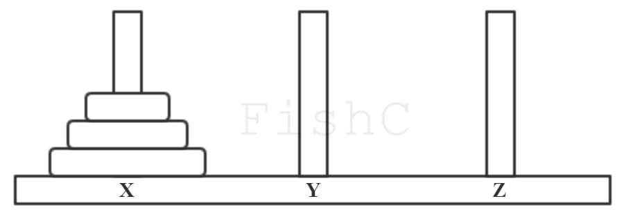


Step1 X->Z：


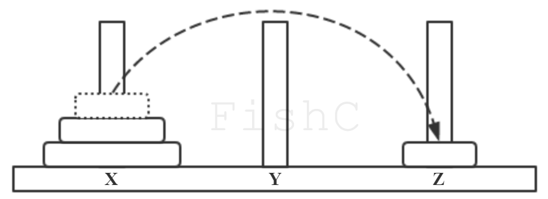


Step2 X->Y：


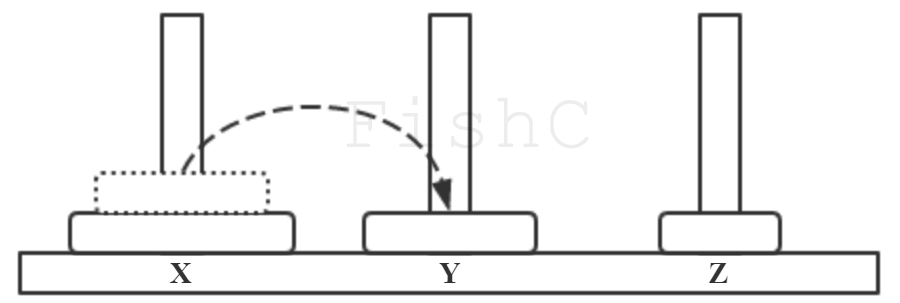


Step3 Z->Y：


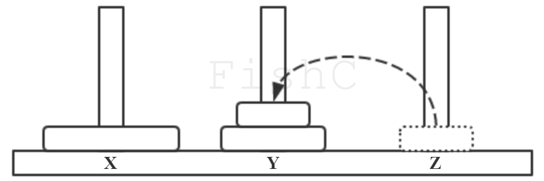


Step4 X->Z：


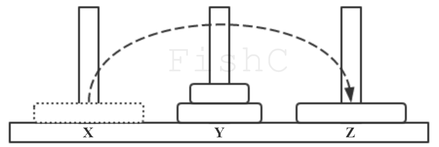


Step5 Y->X：


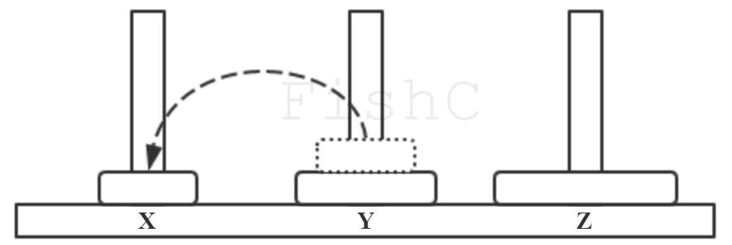


Step6 Y->Z：


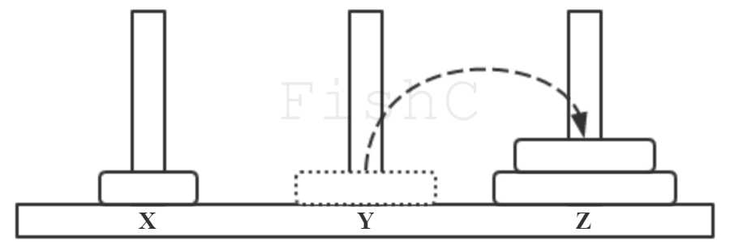


Step7 X->Z：


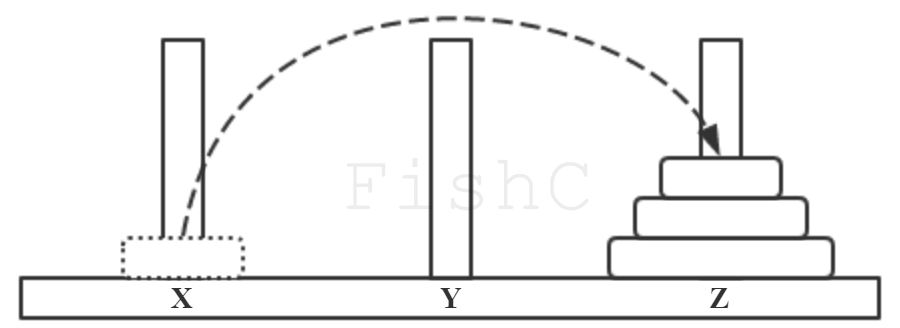


对于上述游戏的玩法，可以简单分解为三个步骤：


- 将前 63 个盘子从 X 移动到 Y上，确保大盘在小盘下。
- 将最底下的第 64 个盘子从 X 移动到 Z 上。
- 将 Y 上的 63 个盘子移动到 Z 上。


在游戏中，由于每次只能移动一个圆盘，所以在移动的过程中显然要借助另外一根针才可以实施。也就是说，步骤 1 将 1~63 个盘子移到 Y 上，需要借助 Z；步骤 3 将 Y 针上的 63 个盘子移到 Z 针上，需要借助 X。

所以我们把新的思路聚集为以下两个问题：


- 问题一：如何将 X 上的 63 个盘子借助 Z 移到 Y 上？
- 问题二：如何将 Y 上的 63 个盘子借助 X 移到 Z 上？


解决这两个问题的方法跟解决“如何将 X 上的 64 个盘子借助 Y 移动到 Z 上？”这个问题是一样的，都是可以拆解成 1、2、3 三个步骤来实现。

问题一（“如何将 X 上的 63 个盘子借助 Z 移到 Y 上？”）拆解为：


- 将前 62 个盘子从 X 移动到Z上，确保大盘在小盘下。
- 将最底下的第 63 个盘子移动到 Y 上。
- 将 Z 上的 62 个盘子移动到 Y 上。


问题二（“如何将 Y 上的 63 个盘子借助 X 移到 Z 上？”）拆解为：

- 将前 62 个盘子从 Y 移动到 X 上，确保大盘在小盘下。
- 将最底下的第 63 个盘子移动到 Z 上。
- 将 X 上的 62 个盘子移动到 Y 上。


没错，汉诺塔的拆解过程刚好满足递归算法的定义，因此，对于如此难题，使用递归来解决，问题就变得相当简单了！


## 快速排序

所谓排序就是将一对零零散散的数据重新整理成从大到小或从小到大的序列。

排序算法在日常生活中应用很广，比如说期末考试，老师要给所有同学的成绩进行排序；或者打开招聘网站，经常是优先考虑待遇高的职位，那么你应该让薪酬从高到低进行排序；又或者去网上购买一件化妆品孝敬老婆大人，但不知道哪一款合适，所以你点击按销量进行排序……

排序的算法有很多，比如大家耳熟能详的冒泡排序、插入排序、希尔排序、选择排序等等。其中名声最大的当属快速排序，你看这名字起得这么嚣张，恐怕效率也不会差到哪里去。没错，它可是二十世纪十大算法之一，是由图灵奖得主东尼·霍尔提出的排序算法。

快速排序算法的基本思想是：通过一趟排序将待排序数据分割成独立的两部分，其中一部分的所有元素均比另一部分的元素小，然后分别对这两部分继续进行排序，重复上述步骤直到排序完成。


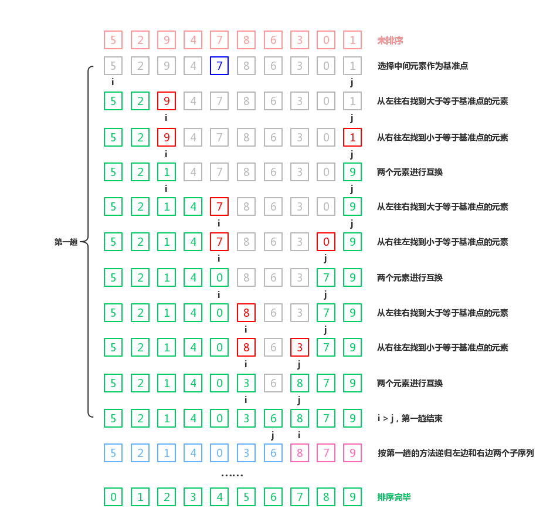
（点击图片查看大图)

## 动态内存管理（上）

**1. 动态内存管理的几个函数**


- [malloc](http://bbs.fishc.com/thread-78842-1-1.html) -- 申请动态内存空间
- [free](http://bbs.fishc.com/thread-78843-1-1.html) -- 释放动态内存空间
- [calloc](http://bbs.fishc.com/thread-78844-1-1.html) -- 申请并初始化一系列内存空间
- [realloc](http://bbs.fishc.com/thread-78845-1-1.html) -- 重新分配内存空间


**2. 内存泄漏**

导致内存泄漏主要有两种情况：


- 隐式内存泄漏（即用完内存块没有及时使用free函数释放）
- 丢失内存块地址

## 动态内存管理（下）

**1. malloc 可以申请一块任意尺寸的内存空间**

malloc 不仅可以申请存储基本数据类型的空间，事实上它还可以申请一块任意尺寸的内存空间。对于后者，由于申请得到的空间是连续的，所以我们经常用数组来进行索引即可：

```c
#include <stdio.h>
#include <stdlib.h>

int main(void)
{
        int *ptr = NULL;
        int num, i;

        printf("请输入待录入整数的个数：");
        scanf("%d", &num);

        ptr = (int *)malloc(num * sizeof(int));

        for (i = 0; i < num; i++)
        {
                printf("请录入第%d个整数：", i+1);
                scanf("%d", &ptr[i]);
        }

        printf("你录入的整数是：");
        for (i = 0; i < num; i++)
        {
                printf("%d ", ptr[i]);
        }

        putchar('\n');
        free(ptr);

        return 0;
}
```

程序实现如下：


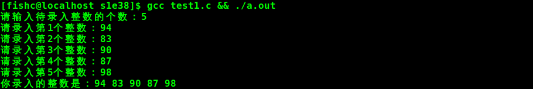


**2. 初始化内存空间**

由于 malloc 并不会帮你初始化申请的内存空间，所以你需要自己进行初始化。

当然你可以写一个循环来做这件事儿，但我不建议你这么做，因为标准库提供了更加高效的函数：[memset](https://fishc.com.cn/thread-80241-1-1.html)。


**3. calloc**

calloc 函数在内存中动态地申请 nmemb 个长度为 size 的连续内存空间（即申请的总空间尺寸为 nmemb * size），这些内存空间全部被初始化为 0。

calloc 函数与 malloc 函数的一个重要区别是：


- calloc 函数在申请完内存后，自动初始化该内存空间为零
- malloc 函数不进行初始化操作，里边数据是随机的


calloc 函数详细文档 -> [传送门](https://fishc.com.cn/thread-78844-1-1.html)


**4. realloc**

以下几点是需要注意的：


- realloc 函数修改 ptr 指向的内存空间大小为 size 字节
- 如果新分配的内存空间比原来的大，则旧内存块的数据不会发生改变；如果新的内存空间大小小于旧的内存空间，可能会导致数据丢失，慎用！
- 该函数将移动内存空间的数据并返回新的指针
- 如果 ptr 参数为 NULL，那么调用该函数就相当于调用 malloc(size)
- 如果 size 参数为 0，并且 ptr 参数不为 NULL，那么调用该函数就相当于调用 free(ptr)
- 除非 ptr 参数为 NULL，否则 ptr 的值必须由先前调用 malloc、calloc 或 realloc 函数返回


realloc 函数详细文档 -> [传送门](https://fishc.com.cn/thread-78845-1-1.html)

## C语言的内存布局

**1. C 语言的内存布局规律**


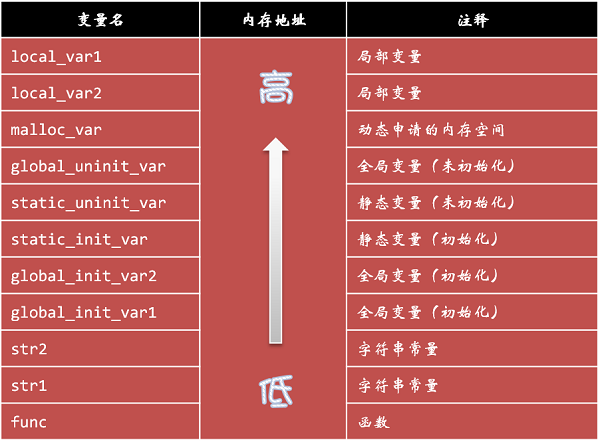


可以看到局部变量的地址是占据高地，接着是 malloc 函数申请的动态内存空间，然后是全局变量和静态局部变量。

不过这两者都需要区分是否已经初始化，已经初始化的放一块，未初始化的放一块，并且未初始化的地址要比已经初始化的要更高一些。接着下来是字符串常量，最后是函数的地址。


**2. 典型 C 语言程序的内存空间划分**


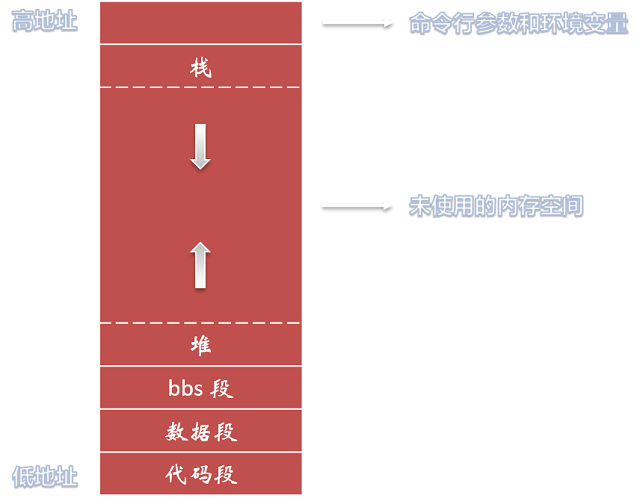


根据内存地址从低到高分别划分为：


- 代码段（Text segment）
- 数据段（Initialized data segment）
- BSS段（Bss segment/Uninitialized data segment）
- 栈（Stack）
- 堆（Heap）


**3. 代码段（Text segment）**

代码段通常是指用来存放程序执行代码的一块内存区域。

这部分区域的大小在程序运行前就已经确定，并且内存区域通常属于只读。

在代码段中，也有可能包含一些只读的常数变量，例如字符串常量等。


**4. 数据段（Initialized data segment）**

数据段通常用来存放已经初始化的全局变量和局部静态变量。


**5. BSS段（Bss segment/Uninitialized data segment）**

BSS 段通常是指用来存放程序中未初始化的全局变量的一块内存区域。

BSS 是英文 Block Started by Symbol 的简称，这个区段中的数据在程序运行前将被自动初始化为数字 0。


**6. 堆**

前边我们学习了动态内存管理函数，使用它们申请的内存空间就是分配在这个堆里边。

所以，堆是用于存放进程运行中被动态分配的内存段，它的大小并不固定，可动态扩展或缩小。

当进程调用 malloc 等函数分配内存时，新分配的内存就被动态添加到堆上；当利用 free 等函数释放内存时，被释放的内存从堆中被剔除。


**7. 栈**

大家平时可能经常听到堆栈这个词，一般指的就是这个栈。

栈是函数执行的内存区域，通常和堆共享同一片区域。


**8. 堆和栈的对比**

堆和栈则是 C 语言运行时最重要的元素，下面我们将两者进行对比。

申请方式：


- 堆由程序员手动申请
- 栈由系统自动分配


释放方式：


- 堆由程序员手动释放
- 栈由系统自动释放


生存周期：


- 堆的生存周期由动态申请到程序员主动释放为止，不同函数之间均可自由访问
- 栈的生存周期由函数调用开始到函数返回时结束，函数之间的局部变量不能互相访问


发展方向：


- 堆和其它区段一样，都是从低地址向高地址发展
- 栈则相反，是由高地址向低地址发展

## 高级宏定义

**1. 宏定义的实质**

再牛逼的宏定义，说到底也是机械替换。


**2. C 语言三大预处理功能**

宏定义；文件包含；条件编译。


**3. 不带参数的宏定义**

宏定义分为带参数和不带参数两种情况，不带参数的情况就是我们熟悉的直接替换操作。

例如：

```c
#define PI 3.14
```


这个宏定义的作用是把程序中出现的 PI 在预处理阶段全部替换成 3.14。


**4. 带参数的宏定义**

C 语言允许宏定义带有参数，在宏定义中的参数称为形式参数，在宏调用中的参数称为实际参数，这点和函数有些类似。

例如：

```c
#define MAX(x, y) (((x) > (y)) ? (x) : (y))
```

这个宏定义的作用是求出 x 和 y 两个参数中比较大的那一个。


## 内联函数和一些鲜为人知的技巧

**1. 内联函数**

普通函数调用是酱紫的：


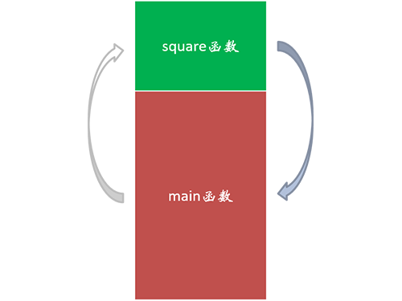


内联函数调用是酱紫的：


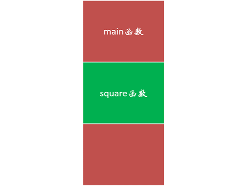


不过内联函数也不是万能的，内联函数虽然节省了函数调用的时间消耗，但由于每一个函数出现的地方都要进行替换，因此增加了代码编译的时间。

另外，并不是所有的函数都能够变成内联函数。现在的编译器也很聪明，就算你不写 inline，它也会自动将一些函数优化成内联函数。


**2. # 和 ##**

\# 和 ## 是两个预处理运算符。

在带参数的宏定义中，# 运算符后面应该跟一个参数，预处理器会把这个参数转换为一个字符串。

\## 运算符被称为记号连接运算符，可以使用它来连接多个参数。


**3. 可变参数**

之前我们学习了如何让函数支持可变参数，带参数的宏定义也是使用可变参数的：

```c
#define SHOWLIST(…) printf(#__VA_ARGS__)
```

其中 ... 表示使用可变参数，__VA_ARGS__ 在预处理中被实际的参数集所替换。

```c
#include <stdio.h>

#define SHOWLIST(...) printf(# __VA_ARGS__)

int main(void)
{
        SHOWLIST(FishC, 520, 3.14\n);

        return 0;
}
```

程序实现如下：


可变参数是允许空参数的（如果可变参数是空参数，## 会将 format 后面的逗号“吃掉”，从而避免参数数量不一致的错误）：

```c
#include <stdio.h>

#define PRINT(format, ...) printf(#format, ##__VA_ARGS__)

int main(void)
{
        PRINT(num = %d\n, 520);
        PRINT(Hello FishC!\n);

        return 0;
}
程序实现如下：
```


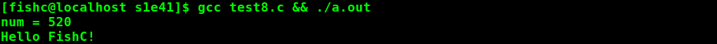

## 结构体

**1. 结构体声明**

在 C 语言中，可以使用结构体（structure）来组织不同类型的数据。

结构体声明（structure declaration）是描述结构体组合的主要方法，语法如下：

```c
struct 结构体名称
{
        结构体成员 1;
        结构体成员 2;
        结构体成员 3;
};

```

其中，结构体成员既可以是任何一种基本的数据类型，也可以是另一个结构体（相当于结构体的嵌套）。
注意：结构体声明你即可以放在所有函数的外面，也可以单独在一个函数里面声明。如果是后者，则该结构体只能在该函数中被定义。


**2. 定义结构体类型变量**

结构体声明只是进行一个框架的描绘，它并不会在内存中分配空间存储数据，直到你定义一个结构体类型的变量。

定义结构体变量的语法如下：

```c
struct 结构体名称 结构体变量名;
```


注意：这里的 struct 关键字不能丢。


**3. 访问结构体成员**

要访问结构体成员，我们需要引入一个新的运算符——点号（.）运算符。

比如 book.title 就是引用 book 结构体的 title 成员；而 book.price 则是引用 book 结构体的 price 成员。


**4. 初始化结构体**

可以在定义结构体变量的时候同时为其初始化：

```c
struct Book book = {
        "《带你学C带你飞》",
        "小甲鱼",
        48.8,
        20171111,
        "清华大学出版社"
};
```

C99 增加了一种新特性：支持初始结构体的指定成员值。

其语法和数组指定初始化元素类似，只不过结构体指定初始化成员使用点号（.）运算符和成员名（数组则是用方括号和下标索引值）。

比如我们可以让程序只初始化 Book 的 price 成员：

```c
struct Book book = {.price = 48.8};
```

利用该特性，还可以不按结构体声明的成员顺序进行初始化：

```c
struct Book book = {
        .publisher = "清华大学出版社",
        .price = 48.8,
        .date = 20171111
};
```

注意：其它未初始化的数值型成员也将被自动初始化，其中数值型成员初始化为 0，字符型成员初始化为 '\0'。


\5. 推荐阅读：失传的 C 结构体打包技艺 -> [传送门](https://fishc.com.cn/thread-83418-1-1.html)


## 结构体数组和结构体指针

**1. 结构体嵌套**

结构体可以进行嵌套声明，比如：

```c
struct Date
{
        int year;
        int month;
        int day;
};

struct Book
{
        char title[128];
        char author[40];
        float price;
        struct Date date;
        char publisher[40];
};
```

要访问其结构体成员的话，就需要使用两层点号（.）运算符来进行操作。

因此，试图用 book.date 访问日期的做法是错误的，你只能通过 book.date.year，book.date.month 和 book.date.day 依次打印出年月日。


**2. 结构体数组**

结构体数组跟之前我们学习过数组概念一致，只不过是每个数组元素不再是简单的基础类型，而是一个结构体类型的数据。

定义结构体数组和定义一个结构体变量的语法类似。

第一种方法是在声明结构体的时候进行定义：

```c
struct 结构体名称
{
        结构体成员;
} 数组名[长度];
```

第二种方法是先声明一个结构体类型（比如上面 Book），再用此类型定义一个结构体数组：

```c
struct 结构体名称
{
        结构体成员;
};

struct 结构体名称 数组名[长度];
```

**3. 结构体指针**

指向结构体变量的指针我们称之为结构体指针：

```c
struct Book * pt;
```

这里声明的就是一个指向 Book 结构体类型的指针变量 pt。

我们知道数组名其实是指向这个数组第一个元素的地址，所以我们可以将数组名直接赋值给指针变量。

但注意，结构体变量不一样，结构体的变量名并不是指向该结构体的地址，所以要使用取地址运算符（&）才能获取其地址：

```c
pt = &book;
```

通过结构体指针访问结构体成员有两种方法：

- (*结构体指针).成员名
- 结构体指针->成员名


第一种方法由于点号运算符（.）比指针的取值运算符（*）优先级要高，所以要使用小括号先对指针进行解引用，让它先变成该结构体变量，再用点运算符去访问其成员。

相比之下，第二种方法更加方便和直观。不知道大家有没有发现，第二种方法使用的成员选择运算符（->）自身的形状就是一个箭头，箭头具有指向性，所以我们一下子就把它跟指针联系起来。

需要注意的是，两种方法在实现上是完全等价的，所以无论你习惯使用哪一种方法都可以访问到结构体的成员。

但切记，点号（.）只能用于结构体，而箭头（->）只能用于结构体指针，这两个就不能混淆。


## 传递结构体变量和结构体指针

**1. 传递结构体变量**

两个相同结构体类型的变量可以直接进行赋值：

```c
...
        struct Test
        {
                int x;
                int y;
        }t1, t2;

        t1.x = 3;
        t1.y = 4;

        t2 = t1;
...
```

可以看到 t2 = t1; 语句将 t1 这个结构体变量所有成员的值都成功地赋值给了 t2。

那么同样的道理，结构体变量也是可以作为函数参数进行传递的：

```c
#include <stdio.h>

struct Date
{
        int year;
        int month;
        int day;
};

struct Book
{
        char title[128];
        char author[40];
        float price;
        struct Date date;  
        char publisher[40];
};

struct Book getInput(struct Book book);
void printBook(struct Book book);

struct Book getInput(struct Book book)
{
        printf("请输入书名：");
        scanf("%s", book.title);
        printf("请输入作者：");
        scanf("%s", book.author);
        printf("请输入售价：");
        scanf("%f", &book.price);
        printf("请输入出版日期：");
        scanf("%d-%d-%d", &book.date.year, &book.date.month, &book.date.day);
        printf("请输入出版社：");
        scanf("%s", book.publisher);

        return book;
}

void printBook(struct Book book)
{
        printf("书名：%s\n", book.title);
        printf("作者：%s\n", book.author);
        printf("售价：%.2f\n", book.price);
        printf("出版日期：%d-%d-%d\n", book.date.year, book.date.month, book.date.day);
        printf("出版社：%s\n", book.publisher);
}

int main(void)
{
        struct Book b1, b2;

        printf("请录入第一本书的信息...\n");
        b1 = getInput(b1);
        putchar('\n');
        printf("请录入第二本书的信息...\n");
        b2 = getInput(b2);

        printf("\n\n录入完毕，现在开始打印验证...\n\n");
        printf("打印第一本书的信息...\n");
        printBook(b1);
        putchar('\n');
        printf("打印第二本书的信息...\n");
        printBook(b2);

        return 0;
}
```

**2. 传递指向结构体变量的指针**

在最开始的时候，C语言是不允许直接将结构体作为参数传递给函数的。

当初有这么一个限制主要是出于对程序执行效率上的考虑。

因为结构体变量的尺寸可以是很大的，那么在函数调用的过程中将会导致空间和时间上的开销也相对是巨大的。

既然传递结构体变量可能导致程序的开销变大，那么应该如何做才好呢？

没错，使用万能的指针！

```c
#include <stdio.h>

struct Date
{
        int year;
        int month;
        int day;
};

struct Book
{
        char title[128];
        char author[40];
        float price;
        struct Date date;  
        char publisher[40];
};

struct Book getInput(struct Book book);
void printBook(struct Book book);

void getInput(struct Book *book)
{
        printf("请输入书名：");
        scanf("%s", book->title);
        printf("请输入作者：");
        scanf("%s", book->author);
        printf("请输入售价：");
        scanf("%f", &book->price);
        printf("请输入出版日期：");
        scanf("%d-%d-%d", &book->date.year, &book->date.month, &book->date.day);
        printf("请输入出版社：");
        scanf("%s", book->publisher);
}

void printBook(struct Book *book)
{
        printf("书名：%s\n", book->title);
        printf("作者：%s\n", book->author);
        printf("售价：%.2f\n", book->price);
        printf("出版日期：%d-%d-%d\n", book->date.year, book->date.month, book->date.day);
        printf("出版社：%s\n", book->publisher);
}

int main(void)
{
        struct Book b1, b2;

        printf("请录入第一本书的信息...\n");
        getInput(&b1);
        putchar('\n');
        printf("请录入第二本书的信息...\n");
        getInput(&b2);

        printf("\n\n录入完毕，现在开始打印验证...\n\n");
        printf("打印第一本书的信息...\n");
        printBook(&b1);
        putchar('\n');
        printf("打印第二本书的信息...\n");
        printBook(&b2);

        return 0;
}
```

这次我们传递过去的就是一个指针，而不是整个庞大的结构体。

注意：这里由于传进来的实参是一个指针，所以要使用箭头（->）来访问结构体变量的成员。


**3. 动态申请结构体**

还可以动态地在堆里面给结构体分配存储空间：

```c
int main(void)
{
        struct Book *b1, *b2;

        b1 = (struct Book *)malloc(sizeof(struct Book));
        b2 = (struct Book *)malloc(sizeof(struct Book));
        if (b1 == NULL || b2 == NULL)
        {
                printf("内存分配失败！\n");
                exit(1);
        }

        printf("请录入第一本书的信息...\n");
        getInput(b1);
        putchar('\n');
        printf("请录入第二本书的信息...\n");
        getInput(b2);

        printf("\n\n录入完毕，现在开始打印验证...\n\n"); 
        printf("打印第一本书的信息...\n");
        printBook(b1);
        putchar('\n');
        printf("打印第二本书的信息...\n");
        printBook(b2);

        free(b1);
        free(b2);

        return 0;
}
```


**4. 构建图书馆**

现在要求大家来构建一个图书馆，然后让用户将书籍的信息都录入到里面。

提示：“图书馆” 其实就是存放 Book 结构体变量的指针数组，每个数组元素存放的是指向一个动态申请的 Book 结构体变量的指针。

关系大概是这样子：


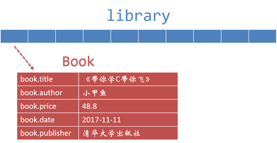


代码清单：

```c
#include <stdio.h>
#include <stdlib.h>

#define MAX_SIZE 100

struct Date
{
        int year;
        int month;
        int day;
};

struct Book
{
        char title[128];
        char author[40];
        float price;
        struct Date date;  
        char publisher[40];
};

void getInput(struct Book *book);
void printBook(struct Book *book);
void initLibrary(struct Book *library[]);
void printLibrary(struct Book *library[]);
void releaseLibrary(struct Book *library[]);

void getInput(struct Book *book)
{
        printf("请输入书名：");
        scanf("%s", book->title);
        printf("请输入作者：");
        scanf("%s", book->author);
        printf("请输入售价：");
        scanf("%f", &book->price);
        printf("请输入出版日期：");
        scanf("%d-%d-%d", &book->date.year, &book->date.month, &book->date.day);
        printf("请输入出版社：");
        scanf("%s", book->publisher);
}

void printBook(struct Book *book)
{
        printf("书名：%s\n", book->title);
        printf("作者：%s\n", book->author);
        printf("售价：%.2f\n", book->price);
        printf("出版日期：%d-%d-%d\n", book->date.year, book->date.month, book->date.day);
        printf("出版社：%s\n", book->publisher);
}

void initLibrary(struct Book *library[])
{
        int i;

        for (i = 0; i < MAX_SIZE; i++)
        {
                library[i] = NULL;
        }
}

void printLibrary(struct Book *library[])
{
        int i;

        for (i = 0; i < MAX_SIZE; i++)
        {
                if (library[i] != NULL)
                {
                        printBook(library[i]);
                        putchar('\n');
                }
        }

}

void releaseLibrary(struct Book *library[])
{
        int i;

        for (i = 0; i < MAX_SIZE; i++)
        {
                if (library[i] != NULL)
                {
                        free(library[i]);
                }
        }
}

int main(void)
{
        struct Book *library[MAX_SIZE];
        struct Book *ptr = NULL;
        int ch, index = 0;

        initLibrary(library);

        while (1)
        {
                printf("请问是否需要录入图书信息(Y/N)：");
                do
                {
                        ch = getchar();
                } while (ch != 'Y' && ch != 'N');

                if (ch == 'Y')
                {
                        if (index < MAX_SIZE)
                        {
                                ptr = (struct Book *)malloc(sizeof(struct Book));
                                getInput(ptr);
                                library[index] = ptr;
                                index++;
                                putchar('\n');
                        }
                        else
                        {
                                printf("该图书馆已满，无法录入新数据！\n");
                                break;
                        }
                }
                else
                {
                        break;
                }
        }

        printf("\n\n录入完毕，现在开始打印验证...\n\n");

        printLibrary(library);

        releaseLibrary(library);

        return 0;
}
```


## 单链表

**1. 声明一个指向自身的结构体**

不能这样写：

```c
struct Test
{
        int x;
        int y;
        struct Test test;
};
```

要这样写：

```c
struct Test
{
        int x;
        int y;
        struct Test *test;
};
```


**2. 单链表**

单链表是最简单的一种链表实现方式，它包含两个域，一个信息域和一个指针域：


真正的单链表它还需要一个头指针，用于存放指向链表第一个节点的地址（这样你才能知道到它）：


对于 Book 结构体来说，要把它变成链表的其中一个元素，我们只需要为其添加一个指向自身的成员即可：

```c
...
struct Book
{
        char title[128];
        char author[40];
        float price;
        struct Date date;
        char publisher[40];
        struct Book *next;
};
...
```


**3. 在单链表中插入元素（头插法）**

在单链表中插入元素，事实上只需要修改指针的指向即可：


将书籍添加到单链表的代码我们这么可以写：
```c
...
void addBook(struct Book **library)
{
        struct Book *book, *temp;

        book = (struct Book *)malloc(sizeof(struct Book));
        if (book == NULL)
        {
                printf("内存分配失败！\n");
                exit(1);
        }

        getInput(book);

        if (*library != NULL)
        {
                temp = *library;
                *library = book;
                book->next = temp;
        }
        else
        {
                *library = book;
                book->next = NULL;
        }
}
...
```


## 单链表2

**1. 尾插法**

上一节课我们演示了单链表的头插法，就是将数据插入到单链表的头部位置。

那么相对应的还有另一个种方法：尾插法 —— 将数据插入到单链表的尾部位置。


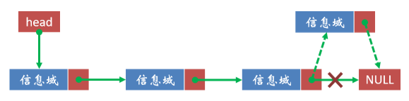

```c
...
void addBook(struct Book **library)
{
        struct Book *book;
        static struct Book *tail;

        book = (struct Book *)malloc(sizeof(struct Book));
        if (book == NULL)
        {
                printf("内存分配失败！\n");
                exit(1);
        }

        getInput(book);

        if (*library != NULL)
        {
                tail->next = book;
                book->next = NULL;
        }
        else
        {
                *library = book;
                book->next = NULL;
        }

        tail = book;
}
...
```


**2. 搜索单链表**

有时候我们可能会对单链表进行搜索操作，比如输入这个书名或者作者的名字，可以找到相关的节点数据。
```c
struct Book *searchBook(struct Book *library, char *target)
{
        struct Book *book;

        book = library;
        while (book != NULL)
        {
                if (!strcmp(book->title, target) || !strcmp(book->author, target))
                {
                        break;
                }
                book = book->next;
        }

        return book;
}

void printBook(struct Book *book)
{
        printf("书名：%s\n", book->title);
        printf("作者：%s\n", book->author);
}
...
int main(void)
{
        ...
        printf("\n请输入书名或作者：");
        scanf("%s", input);

        book = searchBook(library, input);
        if (book == NULL)
        {
                printf("很抱歉，没能找到！\n");
        }
        else
        {
                do
                {
                        printf("已找到符合条件的书籍...\n");
                        printBook(book);
                } while ((book = searchBook(book->next, input)) != NULL);
        }

        releaseLibrary(&library);

        return 0;
}
```

## 单链表3

**1. 插入节点到指定的位置**

我们之前说单链表和数组相比较的话，最大的优势就是插入元素到指定位置的效率。

对于数组来说，插入一个元素到指定的位置，需要将其后面所有的元素都挨个儿移动一次，效率之低下可想而知。

相比之下，单链表的效率就要高很多了。因为对于单链表来说，只需要轻轻地改动一下指针即可。


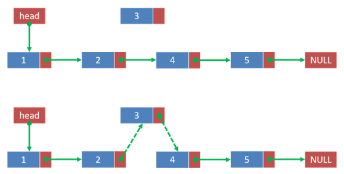


代码实现如下：

```c
#include <stdio.h>
#include <stdlib.h>

struct Node
{
        int value;
        struct Node *next;
};

void insertNode(struct Node **head, int value)
{
        struct Node *previous;
        struct Node *current;
        struct Node *new;

        current = *head;
        previous = NULL;

        while (current != NULL && current->value < value)
        {
                previous = current;
                current = current->next;
        }

        new = (struct Node *)malloc(sizeof(struct Node));
        if (new == NULL)
        {
                printf("内存分配失败！\n");
                exit(1);
        }
        new->value = value;
        new->next = current;

        if (previous == NULL)
        {
                *head = new;
        }
        else
        {
                previous->next = new;
        }
}

void printNode(struct Node *head)
{
        struct Node *current;

        current = head;
        while (current != NULL)
        {
                printf("%d ", current->value);
                current = current->next;
        }

        putchar('\n');
}

int main(void)
{
        struct Node *head = NULL;
        int input;

        printf("开始测试插入整数...\n");
        while (1)
        {
                printf("请输入一个整数(输入-1表示结束)：");
                scanf("%d", &input);
                if (input == -1)
                {
                        break;
                }
                insertNode(&head, input);
                printNode(head);
        }
        
        return 0;
}
```

程序实现如下：

```c
[fishc@localhost s1e47]$ gcc test1.c && ./a.out
开始测试插入整数...
请输入一个整数(输入-1表示结束)：5
5 
请输入一个整数(输入-1表示结束)：3
3 5 
请输入一个整数(输入-1表示结束)：8
3 5 8 
请输入一个整数(输入-1表示结束)：9
3 5 8 9 
请输入一个整数(输入-1表示结束)：1
1 3 5 8 9 
请输入一个整数(输入-1表示结束)：0
0 1 3 5 8 9 
请输入一个整数(输入-1表示结束)：2
0 1 2 3 5 8 9 
请输入一个整数(输入-1表示结束)：4
0 1 2 3 4 5 8 9 
请输入一个整数(输入-1表示结束)：7
0 1 2 3 4 5 7 8 9 
请输入一个整数(输入-1表示结束)：-1
```

我们重点分析一下这个 insertNode 函数：

```c
while (current != NULL && current->value < value)
{
        previous = current;
        current = current->next;
}
```

while 函数用于找到符合条件的链表节点，也就是在有序的链表中找到比传入的value更大的值，然后停下来；如果没有，则在链表的尾部位置停止（current == NULL 时结束循环）。

由于单链表一旦指向下一个节点，就没办法回头了，所以我们使用 previous 变量来记录 current 节点的上一个节点。


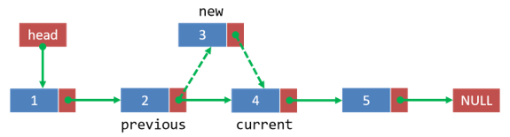


最后判断一下 previous 变量，如果为 NULL 的话，说明 while 循环它压根儿就没进去过，有两种情况，要么是这是一个空链表（current == NULL），或者该值比当前链表中所有的节点的 value 成员都小，无论是哪一种情况，我们都将该值插入为单链表的第一个节点即可。


**2. 在单链表中删除元素**

我们的单链表应该支持删除某一个节点的数据。

删除某个节点的数据，其实也是修改指针的事儿，两个步骤搞定：


- 修改待删除节点的上一个节点的指针，将其指向待删除节点的下一个节点
- 释放待删除节点的内存空间


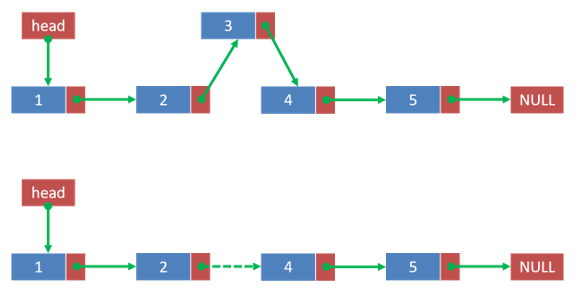


代码实现如下：

```c
...
void deleteNode(struct Node **head, int value)
{
        struct Node *previous;
        struct Node *current;

        current = *head;
        previous = NULL;

        while (current != NULL && current->value != value)
        {
                previous = current;
                current = current->next;
        }

        if (current == NULL)
        {
                printf("找不到匹配的节点！\n");
                return ;
        }
        else
        {
                if (previous == NULL)
                {
                        *head = current->next;
                }
                else
                {
                        previous->next = current->next;
                }
                free(current);
        }
}
...
```

程序实现如下：

```c\
[fishc@localhost s1e47]$ gcc test2.c && ./a.out
开始测试插入整数...
请输入一个整数(输入-1表示结束)：5
5 
请输入一个整数(输入-1表示结束)：3
3 5 
请输入一个整数(输入-1表示结束)：1
1 3 5 
请输入一个整数(输入-1表示结束)：9
1 3 5 9 
请输入一个整数(输入-1表示结束)：8 
1 3 5 8 9 
请输入一个整数(输入-1表示结束)：7
1 3 5 7 8 9 
请输入一个整数(输入-1表示结束)：0
0 1 3 5 7 8 9 
请输入一个整数(输入-1表示结束)：-1
开始测试删除整数...
请输入一个整数(输入-1表示结束)：0
1 3 5 7 8 9 
请输入一个整数(输入-1表示结束)：9
1 3 5 7 8 
请输入一个整数(输入-1表示结束)：7
1 3 5 8 
请输入一个整数(输入-1表示结束)：8
1 3 5 
请输入一个整数(输入-1表示结束)：-1
```

简单分析一下实现代码，当 current 指向 NULL 的情况有两种，要么这是一个空链表，要么在单链表的所有节点的 value 成员中找不到对应的数值，所以统一跟用户说找不到即可。

如果 current 不为 NULL，我们还要预防 previous 是否为 NULL，有一种情况会导致这种局面的发生，那就是当要删除的节点是单链表的第一个节点的时候，在这种情况下需要特殊处理：要将 head 指针指向该节点。

这个链表的知识，说白了就是考核你对结构体和指针的理解程度。

在编程学习的初期阶段，你不可避免会遇到比如“自己思前想后毫无头绪，但一看到代码思路立马就清晰了！”类似这样的体验，总的来说，就是你看得多，练得少导致的。

学习编程总的来说就是一个量变引发质变的过程，不要怕出错，不要吝啬于练习，你打的代码越多，你的功力就越深厚。

## 内存池

