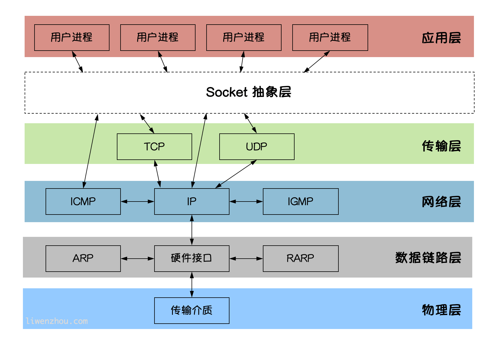

# 笔记

Q1mi 

## 概论

硬件制造商正在为处理器添加越来越多的内核以提高性能。所有数据中心都在这些处理器上运行，更重要的是，今天的应用程序使用多个微服务来维护数据库连接，消息队列和维护缓存。因此，开发的软件和编程语言应该可以轻松地支持并发性，并且应该能够随着CPU核心数量的增加而可扩展。

但是，大多数现代编程语言（如Java，Python等）都来自90年代的单线程环境。虽然一些编程语言的框架在不断地提高多核资源使用效率，例如 Java 的 Netty 等，但仍然需要开发人员花费大量的时间和精力搞懂这些框架的运行原理后才能熟练掌握。

Go于2009年发布，当时多核处理器已经上市。Go语言在多核并发上拥有原生的设计优势，Go语言从底层原生支持并发，无须第三方库、开发者的编程技巧和开发经验。很多公司，特别是中国的互联网公司，即将或者已经完成了使用 Go 语言改造旧系统的过程。经过 Go 语言重构的系统能使用更少的硬件资源获得更高的并发和I/O吞吐表现。充分挖掘硬件设备的潜力也满足当前精细化运营的市场大环境。

Go语言的并发是基于 goroutine 的，goroutine 类似于线程，但并非线程。可以将 goroutine 理解为一种虚拟线程。Go 语言运行时会参与调度 goroutine，并将 goroutine 合理地分配到每个 CPU 中，最大限度地使用CPU性能。开启一个goroutine的消耗非常小（大约2KB的内存），你可以轻松创建数百万个goroutine。

`goroutine`的特点：

1. `goroutine`具有可增长的分段堆栈。这意味着它们只在需要时才会使用更多内存。
2. `goroutine`的启动时间比线程快。
3. `goroutine`原生支持利用channel安全地进行通信。
4. `goroutine`共享数据结构时无需使用互斥锁。

与其他现代高级语言（如Java/Python）相比，使用C，C++的最大好处是它们的性能。因为C/ C++是编译型语言而不是解释的语言。 处理器只能理解二进制文件，Java和Python这种高级语言在运行的时候需要先将人类可读的代码翻译成字节码，然后由专门的解释器再转变成处理器可以理解的二进制文件。


同C,C++一样，Go语言也是编译型的语言，它直接将人类可读的代码编译成了处理器可以直接运行的二进制文件，执行效率更高，性能更好。


可以看出，Go 语言在性能上更接近于 Java 语言，虽然在某些测试用例上不如经过多年优化的 Java 语言，但毕竟 Java 语言已经经历了多年的积累和优化。Go 语言在未来的版本中会通过不断的版本优化提高单核运行性能。

Nsq：Nsq 是由Go语言开发的高性能、高可用消息队列系统，性能非常高，每天能处理数十亿条的消息；

docker ， kubernetes 等都是是用go语言开发的


推荐《The Go Programming Language》，如果看中文更顺眼的话，《Go 程序设计语言》吧。

解决vscode 依赖安装失败
go env -w GOPROXY=https://goproxy.cn

解决vscode 报错 go: go.mod file not found in current directory
go go env -w GO111MODULE=off

Go 在语法上有着类 C 的感觉。如果你希望将两个（或更多）语句放在一行书写，它们必须用分号 (’;’) 分隔。一般情况下，你不需要分号。
Go 同其他语言不同的地方在于变量的类型在变量名的后面。不是：int a，而是 a int。


Go语言中函数是一等公民 , 结构体和接口灵活的实现了面向对象特性

---


## 总览性论述:

Go 语言不需要用;表示语句结束,回车换行就了 .
Go 语言没有代码缩进要求 , (python 强制要求四个空格的缩进)

```shell
#fmt 命令可以帮助调整文件格式
go fmt main.go
```

编辑器也可以自动的帮助调用 go fmt

变量声明了没有使用, 也会发生编译错误

函数传参都是值拷贝 , 所以大多情况需要传递指针

Go 语言同 Java 一样也有泛型

Go 语言提供了, channel 通信通道 , 可以保障goroutine协程之间间通信(妙哉妙哉)

Go 语言提供了, 互斥锁和读写锁 , 可以保障goroutine协程运行安全 (数据竟态问题)

Go 语言提供了, 可直接使用的协程安全的 map , 和 Java (HasMap 线程安全版)类似 , 而基本类型（int32、uint32、int64、uint64）,提供了原子操作

go 语言中,map 时一个使用 make 创建的数据结构的引用


### channel

Go 语言中,实现  goroutine 之间的channel 通信,实际上通信内容是存放在共享内存中吗?如果不是的话, 是存放在哪里?

ChatGPT

在 Go 语言中，`channel` 是 goroutine 之间通信的主要工具。实际上，`channel` 的通信内容确实存放在共享内存中。以下是详细解释：

1. `channel` 的数据存储

`channel` 在 Go 中的底层实现使用了共享内存来存储通信内容。具体来说，当你创建一个 `channel` 时，会分配一块内存用于存储该 `channel` 的数据。这块内存区域可以是一个固定大小的缓冲区（对于有缓冲的 `channel`）或仅用于直接传递数据（对于无缓冲的 `channel`）。

#### 有缓冲的 `channel`

对于有缓冲的 `channel`，数据存储在一个环形缓冲区中。每当一个 goroutine 向 `channel` 发送数据时，该数据会被写入缓冲区。如果缓冲区已满，发送 goroutine 会被阻塞，直到有接收 goroutine 从 `channel` 中读取数据并腾出空间。

#### 无缓冲的 `channel`

对于无缓冲的 `channel`，数据不会存储在缓冲区中，而是直接在发送 goroutine 和接收 goroutine 之间传递。如果没有接收 goroutine 等待，发送 goroutine 会被阻塞，直到有接收 goroutine 出现为止。


操作系统中,进程间通信的方式:

1,pipes 管道

2,共享内存

3,消息队列

4,信号

5,信号量

6,文件

7,socket网络通信


#### any接口

空接口在类型参数列表中很常见，在Go 1.18引入了一个新的预声明标识符，作为空接口类型的别名。

```go
// src/builtin/builtin.go

type any = interface{}
```

由此，我们可以使用如下代码：

```go
func foo[S ~[]E, E any]() {
	// ...
}
```

##### 结构体字段的可见性

结构体中字段大写开头表示可公开访问，小写表示私有（仅在定义当前结构体的包中可访问）。


## 基本语法篇:


### 格式化占位符

在 Go 语言的 `fmt.Printf` 中，格式化占位符（如 `%d`、`%s`）的设计**直接继承自 C 语言的 `printf` 函数**，这些简写的命名规则源于早期编程语言的历史约定。以下是具体解释：

------

##### **一、核心简写的词源**

| 占位符 | 全称/来源                 | 示例                    | 设计逻辑                  |
| ------ | ------------------------- | ----------------------- | ------------------------- |
| `%d`   | **D**ecimal integer       | `%d` → 十进制整数       | "decimal" 的首字母 `d`    |
| `%s`   | **S**tring                | `%s` → 字符串           | "string" 的首字母 `s`     |
| `%f`   | **F**loating-point        | `%f` → 浮点数           | "float" 的首字母 `f`      |
| `%o`   | **O**ctal integer         | `%o` → 八进制整数       | "octal" 的首字母 `o`      |
| `%x`   | He**x**adecimal integer   | `%x` → 十六进制         | "hex" 的末尾字母 `x`      |
| `%c`   | **C**haracter             | `%c` → 单个字符         | "char" 的首字母 `c`       |
| `%p`   | **P**ointer address       | `%p` → 指针地址         | "pointer" 的首字母 `p`    |
| `%t`   | **T**ruth value (boolean) | `%t` → 布尔值           | "truth" 的首字母 `t`      |
| `%e`   | **E**xponential notation  | `%e` → 科学计数法       | "exponent" 的首字母 `e`   |
| `%g`   | **G**eneral float         | `%g` → 自动选择浮点格式 | 可能是 "general" 的首字母 |

##### **二、历史背景**

1. **C 语言的遗产**
   Go 的格式化占位符体系直接沿用了 C 语言 `printf` 的规范，目的是**降低学习成本**并保持与旧系统的兼容性。
   - 例如：`%d` 在 1972 年的 C 语言规范中就已存在，用于表示十进制整数。

##### **三、Go 特有的扩展**

| 占位符 | 功能           | 词源              |
| ------ | -------------- | ----------------- |
| `%v`   | 值的默认格式   | **V**alue         |
| `%T`   | 类型名称       | **T**ype          |
| `%b`   | 二进制格式     | **B**inary        |
| `%q`   | 带引号的字符串 | **Q**uoted string |
| `%U`   | Unicode 格式   | **U**nicode       |


### 变量和常量

Go语言中有丰富的数据类型，除了基本的 整型、浮点型、布尔型、字符串外，还有**数组、切片、结构体、函数、map、通道（channel）**等。Go 语言的基本类型和其他语言大同小异。

#### 整型:

int8    int16    int32    int64
uint8  uint16  uint32  uint64

1个字节  到  8 个字节

#### 浮点型:

float32    float64

绝大多数情况下使用float64 , float32 只有 十进制的6 位有效数字,并且会迅速积累误差


#### **GO的数组是基本类型，不是引用类型**；

#### 标准声明变量

Go语言的变量声明格式为：

```go
var 变量名 变量类型
```

变量声明以关键字`var`开头，变量类型放在变量的后面，行尾无需分号。 举个例子：

```go
var name string
var age int
var isOk bool
```

#### 变量的初始化

**Go语言在声明变量的时候，会自动对变量对应的内存区域进行初始化操作**。每个变量会被初始化成其类型的默认值，例如： 整型和浮点型变量的默认值为`0`。 字符串变量的默认值为`空字符串`。 布尔型变量默认为`false`。 切片、函数、指针变量的默认为`nil`。

当然我们也可在声明变量的时候为其指定初始值。变量初始化的标准格式如下：：

```go
var 变量名 类型 = 表达式
```

举个例子：

```go
var name string = "Q1mi"
var age int = 18
```

或者一次初始化多个变量

```go
var name, age = "Q1mi", 20
```

#### 类型推导

有时候我们会将变量的类型省略，这个时候编译器会根据等号右边的值来推导变量的类型完成初始化。

```go
var name = "Q1mi"
var age = 18
```

#### 短变量声明

在函数内部，可以使用更简略的 `:=` 方式声明并初始化变量。

```go
package main

import (
	"fmt"
)
// 全局变量m
var m = 100

func main() {
	n := 10
	m := 200 // 此处声明局部变量m
	fmt.Println(m, n)
}
```

#### 匿名变量

在使用多重赋值时，如果想要忽略某个值，可以使用`匿名变量（anonymous variable）`。 匿名变量用一个下划线`_`表示，例如：

```go
func foo() (int, string) {
	return 10, "Q1mi"
}
func main() {
	x, _ := foo()
	_, y := foo()
	fmt.Println("x=", x)
	fmt.Println("y=", y)
}
```

匿名变量不占用命名空间，不会分配内存，所以匿名变量之间不存在重复声明。 (在`Lua`等编程语言里，匿名变量也被叫做哑元变量。)

注意事项：

1. 函数外的每个语句都必须以关键字开始（var、const、func等）
2. **`:=`不能使用在函数外**。
3. **`_`多用于占位，表示忽略值**。


#### 常量

相对于变量，常量是恒定不变的值，多用于定义程序运行期间不会改变的那些值。 常量的声明和变量声明非常类似，只是把`var`换成了`const`，常量在定义的时候必须赋值。


`iota`是go语言的常量计数器，只能在常量的表达式中使用。

`iota`在const关键字出现时将被重置为0。const中每新增一行常量声明将使`iota`计数一次(iota可理解为const语句块中的行索引)。 使用iota能简化定义，在定义枚举时很有用。

举个例子：

```go
const (
		n1 = iota //0
		n2        //1
		n3        //2
		n4        //3
	)
```

#### 几个常见的`iota`示例:

使用`_`跳过某些值

```go
const (
		n1 = iota //0
		n2        //1
		_
		n4        //3
	)
```

`iota`声明中间插队

```go
const (
		n1 = iota //0
		n2 = 100  //100
		n3 = iota //2
		n4        //3
	)
	const n5 = iota //0
```

定义数量级 （这里的`<<`表示左移操作，`1<<10`表示将1的二进制表示向左移10位，也就是由`1`变成了`10000000000`，也就是十进制的1024。同理`2<<2`表示将2的二进制表示向左移2位，也就是由`10`变成了`1000`，也就是十进制的8。）

```go
const (
		_  = iota
		KB = 1 << (10 * iota)
		MB = 1 << (10 * iota)
		GB = 1 << (10 * iota)
		TB = 1 << (10 * iota)
		PB = 1 << (10 * iota)
	)
```

多个`iota`定义在一行

```go
const (
		a, b = iota + 1, iota + 2 //1,2
		c, d                      //2,3
		e, f                      //3,4
	)
```

---

### 基本类型

Go语言中有丰富的数据类型，除了基本的整型、浮点型、布尔型、字符串外，还有数组、切片、结构体、函数、map、通道（channel）等。Go 语言的基本类型和其他语言大同小异。

GO的数组是基本类型，不是引用类型；

#### 字符串


##### 字符串字面量


##### 原生的字符串字面量


##### Unicode

#### rune


UTF-8 编码是谁发明的?GO 语言又是谁发明的?

Chatgpt:

UTF-8 编码由肯·汤普逊（Ken Thompson）和罗布·派克（Rob Pike）于 1992 年发明。UTF-8 是一种针对 Unicode 的可变长度字符编码，旨在向后兼容 ASCII 并有效地编码多字节字符。

Go 语言（也称为 Golang）是由谷歌（Google）开发的，主要设计者是罗布·派克（Rob Pike）、肯·汤普逊（Ken Thompson）和罗伯特·格里斯莫（Robert Griesemer）。Go 语言的设计工作始于 2007 年，首次发布于 2009 年。


#### byte和rune类型

组成每个字符串的元素叫做“字符”，可以通过遍历或者单个获取字符串元素获得字符。 字符用单引号（’）包裹起来，如：

```go
var a = '中'
var b = 'x'
```

Go 语言的字符有以下两种：

1. `uint8`类型，或者叫 byte 型，代表一个`ASCII码`字符。
2. `rune`类型，代表一个 `UTF-8字符`。

当需要处理中文、日文或者其他复合字符时，则需要用到`rune`类型。`rune`类型实际是一个`int32`。

Go 使用了特殊的 rune 类型来处理 Unicode，让基于 Unicode 的文本处理更为方便，也可以使用 byte 型进行默认字符串处理，性能和扩展性都有照顾。

```go
// 遍历字符串
func traversalString() {
	s := "hello沙河"
	for i := 0; i < len(s); i++ { //byte
		fmt.Printf("%v(%c) ", s[i], s[i])
	}
	fmt.Println()
	for _, r := range s { //rune
		fmt.Printf("%v(%c) ", r, r)
	}
	fmt.Println()
}
```

输出：

```bash
104(h) 101(e) 108(l) 108(l) 111(o) 230(æ) 178(²) 153() 230(æ) 178(²) 179(³) 
104(h) 101(e) 108(l) 108(l) 111(o) 27801(沙) 27827(河) 
```

因为UTF8编码下一个中文汉字由3~4个字节组成，所以我们不能简单的按照字节去遍历一个包含中文的字符串，否则就会出现上面输出中第一行的结果。

字符串底层是一个byte数组，所以可以和`[]byte`类型相互转换。字符串是不能修改的 字符串是由byte字节组成，所以字符串的长度是byte字节的长度。 rune类型用来表示utf8字符，一个rune字符由一个或多个byte组成。

底层:

```go
// rune is an alias for int32 and is equivalent to int32 in all ways. It is
// used, by convention, to distinguish character values from integer values.
type rune = int32
```


#### 修改字符串

要修改字符串，需要先将其转换成`[]rune`或`[]byte`，完成后再转换为`string`。无论哪种转换，都会重新分配内存，并复制字节数组。

```go
func changeString() {
	s1 := "big"
	// 强制类型转换
	byteS1 := []byte(s1)
	byteS1[0] = 'p'
	fmt.Println(string(byteS1))

	s2 := "白萝卜"
	runeS2 := []rune(s2)
	runeS2[0] = '红'
	fmt.Println(string(runeS2))
}
```


#### 类型的声明:


##### 要比较两个变量 , 需要它俩都是相同的底层类型, 

命名类型 与 非命名类型比较 需要底层是相同的数据类型

命名类型 与 命名类型比较 智能相同的命名类型之间比较, 即使是底层数据类型相同也会编译报错: 类型不匹配 


---

### 运算符

#### 位运算符

位运算符对整数在内存中的二进制位进行操作。

| 运算符 |                             描述                             |
| :----: | :----------------------------------------------------------: |
|   &    |    参与运算的两数各对应的二进位相与。 （两位均为1才为1）     |
|   \|   |  参与运算的两数各对应的二进位相或。 （两位有一个为1就为1）   |
|   ^    | 参与运算的两数各对应的二进位相异或，当两对应的二进位相异时，结果为1。 （两位不一样则为1） |
|   <<   | 左移n位就是乘以2的n次方。 “a<<b”是把a的各二进位全部左移b位，高位丢弃，低位补0。 |
|   >>   | 右移n位就是除以2的n次方。 “a>>b”是把a的各二进位全部右移b位。 |

#### 赋值运算符

| 运算符 |                      描述                      |
| :----: | :--------------------------------------------: |
|   =    | 简单的赋值运算符，将一个表达式的值赋给一个左值 |
|   +=   |                  相加后再赋值                  |
|   -=   |                  相减后再赋值                  |
|   *=   |                  相乘后再赋值                  |
|   /=   |                  相除后再赋值                  |
|   %=   |                  求余后再赋值                  |
|  <<=   |                   左移后赋值                   |
|  >>=   |                   右移后赋值                   |
|   &=   |                  按位与后赋值                  |
|  \|=   |                  按位或后赋值                  |
|   ^=   |                 按位异或后赋值                 |

---

### 流程控制

#### for range(键值循环)

Go语言中可以使用`for range`遍历数组、切片、字符串、map 及通道（channel）。 通过`for range`遍历的返回值有以下规律：

1. 数组、切片、字符串返回索引和值。
2. map返回键和值。
3. 通道（channel）只返回通道内的值。

Go 语言中的所有循环类型均可以使用`for`关键字来完成。

for循环的基本格式如下：

```bash
for 初始语句;条件表达式;结束语句{
    循环体语句
}
```

条件表达式返回`true`时循环体不停地进行循环，直到条件表达式返回`false`时自动退出循环。

```go
func forDemo() {
	for i := 0; i < 10; i++ {
		fmt.Println(i)
	}
}
```

for循环的初始语句可以被忽略，但是初始语句后的分号必须要写，例如：

```go
func forDemo2() {
	i := 0
	for ; i < 10; i++ {
		fmt.Println(i)
	}
}
```

for循环的初始语句和结束语句都可以省略，例如：

```go
func forDemo3() {
	i := 0
	for i < 10 {
		fmt.Println(i)
		i++
	}
}
```

这种写法类似于其他编程语言中的`while`，在`while`后添加一个条件表达式，满足条件表达式时持续循环，否则结束循环。

#### 无限循环

```go
for {
    循环体语句
}
```

for循环可以通过`break`、`goto`、`return`、`panic`语句强制退出循环。

#### for range(键值循环)

Go语言中可以使用`for range`遍历数组、切片、字符串、map 及通道（channel）。 通过`for range`遍历的返回值有以下规律：

1. 数组、切片、字符串返回索引和值。
2. map返回键和值。
3. 通道（channel）只返回通道内的值。

Go1.22版本开始支持 for range 整数。👉 [Go 1.22 Release Notes](https://go.dev/doc/go1.22)。

```go
for i := range 5 {
	fmt.Println(i)
}

for range 2 {
	fmt.Println("《Go语言之路》上市啦！")
}
```

输出：

```bash
0
1
2
3
4
《Go语言之路》上市啦！
《Go语言之路》上市啦！
```

#### switch case

使用`switch`语句可方便地对大量的值进行条件判断。

```go
func switchDemo1() {
	finger := 3
	switch finger {
	case 1:
		fmt.Println("大拇指")
	case 2:
		fmt.Println("食指")
	case 3:
		fmt.Println("中指")
	case 4:
		fmt.Println("无名指")
	case 5:
		fmt.Println("小拇指")
	default:
		fmt.Println("无效的输入！")
	}
}
```

Go语言规定每个`switch`只能有一个`default`分支。

一个分支可以有多个值，多个case值中间使用英文逗号分隔。

```go
func testSwitch3() {
	switch n := 7; n {
	case 1, 3, 5, 7, 9:
		fmt.Println("奇数")
	case 2, 4, 6, 8:
		fmt.Println("偶数")
	default:
		fmt.Println(n)
	}
}
```

分支还可以使用表达式，这时候switch语句后面不需要再跟判断变量。例如：

```go
func switchDemo4() {
	age := 30
	switch {
	case age < 25:
		fmt.Println("好好学习吧")
	case age > 25 && age < 35:
		fmt.Println("好好工作吧")
	case age > 60:
		fmt.Println("好好享受吧")
	default:
		fmt.Println("活着真好")
	}
}
```

`fallthrough`语法可以执行满足条件的case的下一个case，是为了兼容C语言中的case设计的。

```go
func switchDemo5() {
	s := "a"
	switch {
	case s == "a":
		fmt.Println("a")
		fallthrough
	case s == "b":
		fmt.Println("b")
	case s == "c":
		fmt.Println("c")
	default:
		fmt.Println("...")
	}
}
```

输出：

```bash
a
b
```

#### goto(跳转到指定标签)

`goto`语句通过标签进行代码间的无条件跳转。`goto`语句可以在快速跳出循环、避免重复退出上有一定的帮助。Go语言中使用`goto`语句能简化一些代码的实现过程。 例如双层嵌套的for循环要退出时：

```go
func gotoDemo1() {
	var breakFlag bool
	for i := 0; i < 10; i++ {
		for j := 0; j < 10; j++ {
			if j == 2 {
				// 设置退出标签
				breakFlag = true
				break
			}
			fmt.Printf("%v-%v\n", i, j)
		}
		// 外层for循环判断
		if breakFlag {
			break
		}
	}
}
```

使用`goto`语句能简化代码：

```go
func gotoDemo2() {
	for i := 0; i < 10; i++ {
		for j := 0; j < 10; j++ {
			if j == 2 {
				// 设置退出标签
				goto breakTag
			}
			fmt.Printf("%v-%v\n", i, j)
		}
	}
	return
	// 标签
breakTag:
	fmt.Println("结束for循环")
}
```

#### break(跳出循环)

`break`语句可以结束`for`、`switch`和`select`的代码块。

`break`语句还可以在语句后面添加标签，表示退出某个标签对应的代码块，标签要求必须定义在对应的`for`、`switch`和 `select`的代码块上。 举个例子：

```go
func breakDemo1() {
BREAKDEMO1:
	for i := 0; i < 10; i++ {
		for j := 0; j < 10; j++ {
			if j == 2 {
				break BREAKDEMO1
			}
			fmt.Printf("%v-%v\n", i, j)
		}
	}
	fmt.Println("...")
}
```

#### continue(继续下次循环)

`continue`语句可以结束当前循环，开始下一次的循环迭代过程，仅限在`for`循环内使用。

在 `continue`语句后添加标签时，表示开始标签对应的循环。例如：

```go
func continueDemo() {
forloop1:
	for i := 0; i < 5; i++ {
		// forloop2:
		for j := 0; j < 5; j++ {
			if i == 2 && j == 2 {
				continue forloop1
			}
			fmt.Printf("%v-%v\n", i, j)
		}
	}
}
```

---

### 数组

数组是同一种数据类型元素的集合。 在Go语言中，数组从声明时就确定，使用时可以修改数组成员，但是数组大小不可变化。

#### **数组的定义**

比如：`var a [5]int`， 数组的长度必须是常量，并且长度是数组类型的一部分。一旦定义，长度不能变。 `[5]int`和`[10]int`是不同的类型。

#### **声明数组和声明切片要注意**：

```go
//声明切片，无需指定长度
var s []int
//声明数组，必须指明长度
var a [3]int 
fmt.Printf("%T",s)
fmt.Println("")
fmt.Printf("%T",a)
```

```go
var a [3]int
fmt.println(a)
```

***

### 切片（Slice）

切片是一个拥有相同类型元素的可变长度的序列。它是基于数组类型做的一层封装。它非常灵活，支持自动扩容。
切片是一个引用类型，它的内部结构包含`地址`、`长度`和`容量`。切片一般用于快速地操作一块数据集合。


#### 切片的赋值拷贝

下面的代码中演示了拷贝前后两个变量共享底层数组，对一个切片的修改会影响另一个切片的内容，这点需要特别注意。

```go
func main() {
	s1 := make([]int, 3) //[0 0 0]
	s2 := s1             //将s1直接赋值给s2，s1和s2共用一个底层数组
	s2[0] = 100
	fmt.Println(s1) //[100 0 0]
	fmt.Println(s2) //[100 0 0]
}
```

#### 切片的扩容策略

可以通过查看`$GOROOT/src/runtime/slice.go`源码，其中扩容相关代码如下：

```go
newcap := old.cap
doublecap := newcap + newcap
if cap > doublecap {
	newcap = cap
} else {
	if old.len < 1024 {
		newcap = doublecap
	} else {
		// Check 0 < newcap to detect overflow
		// and prevent an infinite loop.
		for 0 < newcap && newcap < cap {
			newcap += newcap / 4
		}
		// Set newcap to the requested cap when
		// the newcap calculation overflowed.
		if newcap <= 0 {
			newcap = cap
		}
	}
}
```

从上面的代码可以看出以下内容：

- 首先判断，如果新申请容量（cap）大于2倍的旧容量（old.cap），最终容量（newcap）就是新申请的容量（cap）。
- 否则判断，如果旧切片的长度小于1024，则最终容量(newcap)就是旧容量(old.cap)的两倍，即（newcap=doublecap），
- 否则判断，如果旧切片长度大于等于1024，则最终容量（newcap）从旧容量（old.cap）开始循环增加原来的1/4，即（newcap=old.cap,for {newcap += newcap/4}）直到最终容量（newcap）大于等于新申请的容量(cap)，即（newcap >= cap）
- 如果最终容量（cap）计算值溢出，则最终容量（cap）就是新申请容量（cap）。

需要注意的是，切片扩容还会根据切片中元素的类型不同而做不同的处理，比如`int`和`string`类型的处理方式就不一样。使用copy()函数复制切片

首先我们来看一个问题：

```go
func main() {
	a := []int{1, 2, 3, 4, 5}
	b := a
	fmt.Println(a) //[1 2 3 4 5]
	fmt.Println(b) //[1 2 3 4 5]
	b[0] = 1000
	fmt.Println(a) //[1000 2 3 4 5]
	fmt.Println(b) //[1000 2 3 4 5]
}
```

由于切片是引用类型，所以a和b其实都指向了同一块内存地址。修改b的同时a的值也会发生变化。

Go语言内建的`copy()`函数可以迅速地将一个切片的数据复制到另外一个切片空间中，`copy()`函数的使用格式如下：

```bash
copy(destSlice, srcSlice []T)
```

其中：

- srcSlice: 数据来源切片
- destSlice: 目标切片

举个例子：

```go
func main() {
	// copy()复制切片
	a := []int{1, 2, 3, 4, 5}
	c := make([]int, 5, 5)
	copy(c, a)     //使用copy()函数将切片a中的元素复制到切片c
	fmt.Println(a) //[1 2 3 4 5]
	fmt.Println(c) //[1 2 3 4 5]
	c[0] = 1000
	fmt.Println(a) //[1 2 3 4 5]
	fmt.Println(c) //[1000 2 3 4 5]
}
```

---

### map

map是一种无序的基于`key-value`的数据结构，Go语言中的map是引用类型，必须初始化才能使用。
map类型的变量默认初始值为nil，需要使用make()函数来分配内存。语法为：

```go
make(map[KeyType]ValueType, [cap])
```

#### 判断某个键是否存在

Go语言中有个判断map中键是否存在的特殊写法，格式如下:

```go
value, ok := map[key]
```

举个例子：

```go
func main() {
	scoreMap := make(map[string]int)
	scoreMap["张三"] = 90
	scoreMap["小明"] = 100
	// 如果key存在ok为true,v为对应的值；不存在ok为false,v为值类型的零值
	v, ok := scoreMap["张三"]
	if ok {
		fmt.Println(v)
	} else {
		fmt.Println("查无此人")
	}
}
```

---

### 函数

Go语言中支持函数、匿名函数和闭包，并且函数在Go语言中属于“一等公民”。

**defer**  延迟执行
go语言函数的return，分为两个步骤1，将返回值付给ret ； 2，return ret 。defer 执行的实际是在1和2之间

**函数类型**：根据入参和返回值分为不同的类型

**匿名函数**

#### **闭包**

闭包指的是一个函数和与其相关的引用环境组合而成的实体。简单来说，`闭包=函数+引用环境`。 首先我们来看一个例子：

```go
func adder() func(int) int {
	var x int
	return func(y int) int {
		x += y
		return x
	}
}
func main() {
	var f = adder()
	fmt.Println(f(10)) //10
	fmt.Println(f(20)) //30
	fmt.Println(f(30)) //60

	f1 := adder()
	fmt.Println(f1(40)) //40
	fmt.Println(f1(50)) //90
}
```

变量`f`是一个函数并且它引用了其外部作用域中的`x`变量，此时`f`就是一个闭包。 在`f`的生命周期内，变量`x`也一直有效。 闭包进阶示例1：

```go
func adder2(x int) func(int) int {
	return func(y int) int {
		x += y
		return x
	}
}
func main() {
	var f = adder2(10)
	fmt.Println(f(10)) //20
	fmt.Println(f(20)) //40
	fmt.Println(f(30)) //70	

	f1 := adder2(20)
	fmt.Println(f1(40)) //60
	fmt.Println(f1(50)) //110
}
```


---

### 结构体

Go语言中没有“类”的概念，也不支持“类”的继承等面向对象的概念。Go语言中通过结构体的内嵌再配合接口比面向对象具有更高的扩展性和灵活性。

#### 自定义类型

在Go语言中有一些基本的数据类型，如`string`、`整型`、`浮点型`、`布尔`等数据类型， Go语言中可以使用`type`关键字来定义自定义类型。

自定义类型是定义了一个全新的类型。我们可以基于内置的基本类型定义，也可以通过struct定义。例如：

```go
//将MyInt定义为int类型
type MyInt int
```

通过`type`关键字的定义，`MyInt`就是一种新的类型，它具有`int`的特性。

#### 类型定义和类型别名的区别

类型别名与类型定义表面上看只有一个等号的差异，我们通过下面的这段代码来理解它们之间的区别。

```go
//类型定义
type NewInt int

//类型别名
type MyInt = int

func main() {
	var a NewInt
	var b MyInt
	
	fmt.Printf("type of a:%T\n", a) //type of a:main.NewInt
	fmt.Printf("type of b:%T\n", b) //type of b:int
}
```

结果显示a的类型是`main.NewInt`，表示main包下定义的`NewInt`类型。b的类型是`int`。`MyInt`类型只会在代码中存在，编译完成时并不会有`MyInt`类型。

#### 结构体

Go语言中的基础数据类型可以表示一些事物的基本属性，但是当我们想表达一个事物的全部或部分属性时，这时候再用单一的基本数据类型明显就无法满足需求了，Go语言提供了一种自定义数据类型，可以封装多个基本数据类型，这种数据类型叫结构体，英文名称`struct`。 也就是我们可以通过`struct`来定义自己的类型了。

Go语言中通过`struct`来实现面向对象。

#### 结构体的定义

使用`type`和`struct`关键字来定义结构体，具体代码格式如下：

```go
type 类型名 struct {
    字段名 字段类型
    字段名 字段类型
    …
}
```

其中：

- 类型名：标识自定义结构体的名称，在同一个包内不能重复。
- 字段名：表示结构体字段名。结构体中的字段名必须唯一。
- 字段类型：表示结构体字段的具体类型。

举个例子，我们定义一个`Person`（人）结构体，代码如下：

```go
type person struct {
	name string
	city string
	age  int8
}
```

同样类型的字段也可以写在一行，

```go
type person1 struct {
	name, city string
	age        int8
}
```

#### 创建指针类型结构体

我们还可以通过使用`new`关键字对结构体进行实例化，得到的是结构体的地址。 格式如下：

```go
var p2 = new(person)
fmt.Printf("%T\n", p2)     //*main.person
fmt.Printf("p2=%#v\n", p2) //p2=&main.person{name:"", city:"", age:0}
```

从打印的结果中我们可以看出`p2`是一个结构体指针。

#### 方法和接收者

Go语言中的`方法（Method）`是一种作用于特定类型变量的函数。这种特定类型变量叫做`接收者（Receiver）`。接收者的概念就类似于其他语言中的`this`或者 `self`。

方法的定义格式如下：

```go
func (接收者变量 接收者类型) 方法名(参数列表) (返回参数) {
    函数体
}
```

其中，

- 接收者变量：接收者中的参数变量名在命名时，官方建议使用接收者类型名称首字母的小写，而不是`self`、`this`之类的命名。例如，`Person`类型的接收者变量应该命名为 `p`，`Connector`类型的接收者变量应该命名为`c`等。
- 接收者类型：接收者类型和参数类似，可以是指针类型和非指针类型。
- 方法名、参数列表、返回参数：具体格式与函数定义相同。

举个例子：

```go
//Person 结构体
type Person struct {
	name string
	age  int8
}

//NewPerson 构造函数
func NewPerson(name string, age int8) *Person {
	return &Person{
		name: name,
		age:  age,
	}
}

//Dream Person做梦的方法
func (p Person) Dream() {
	fmt.Printf("%s的梦想是学好Go语言！\n", p.name)
}

func main() {
	p1 := NewPerson("小王子", 25)
	p1.Dream()
}
```

方法与函数的区别是，函数不属于任何类型，方法属于特定的类型。

#### 指针类型的接收者

指针类型的接收者由一个结构体的指针组成，由于指针的特性，调用方法时修改接收者指针的任意成员变量，在方法结束后，修改都是有效的。这种方式就十分接近于其他语言中面向对象中的`this`或者`self`。 例如我们为`Person`添加一个`SetAge`方法，来修改实例变量的年龄。

```go
// SetAge 设置p的年龄
// 使用指针接收者
func (p *Person) SetAge(newAge int8) {
	p.age = newAge
}
```

调用该方法：

```go
func main() {
	p1 := NewPerson("小王子", 25)
	fmt.Println(p1.age) // 25
	p1.SetAge(30)
	fmt.Println(p1.age) // 30
}
```

#### 值类型的接收者

当方法作用于值类型接收者时，Go语言会在代码运行时将接收者的值复制一份。在值类型接收者的方法中可以获取接收者的成员值，但修改操作只是针对副本，无法修改接收者变量本身。

```go
// SetAge2 设置p的年龄
// 使用值接收者
func (p Person) SetAge2(newAge int8) {
	p.age = newAge
}

func main() {
	p1 := NewPerson("小王子", 25)
	p1.Dream()
	fmt.Println(p1.age) // 25
	p1.SetAge2(30) // (*p1).SetAge2(30)
	fmt.Println(p1.age) // 25
}
```

#### 什么时候应该使用指针类型接收者

1. 需要修改接收者中的值
2. 接收者是拷贝代价比较大的大对象
3. 保证一致性，如果有某个方法使用了指针接收者，那么其他的方法也应该使用指针接收者。

#### 任意类型添加方法

在Go语言中，接收者的类型可以是任何类型，不仅仅是结构体，任何类型都可以拥有方法。 举个例子，我们基于内置的`int`类型使用type关键字可以定义新的自定义类型，然后为我们的自定义类型添加方法。

```go
//MyInt 将int定义为自定义MyInt类型
type MyInt int

//SayHello 为MyInt添加一个SayHello的方法
func (m MyInt) SayHello() {
	fmt.Println("Hello, 我是一个int。")
}
func main() {
	var m1 MyInt
	m1.SayHello() //Hello, 我是一个int。
	m1 = 100
	fmt.Printf("%#v  %T\n", m1, m1) //100  main.MyInt
}
```

**注意事项：** 非本地类型不能定义方法，也就是说我们不能给别的包的类型定义方法。

#### 嵌套结构体

一个结构体中可以嵌套包含另一个结构体或结构体指针，就像下面的示例代码那样。

```go
//Address 地址结构体
type Address struct {
	Province string
	City     string
}

//User 用户结构体
type User struct {
	Name    string
	Gender  string
	Address Address
}

func main() {
	user1 := User{
		Name:   "小王子",
		Gender: "男",
		Address: Address{
			Province: "山东",
			City:     "威海",
		},
	}
	fmt.Printf("user1=%#v\n", user1)//user1=main.User{Name:"小王子", Gender:"男", Address:main.Address{Province:"山东", City:"威海"}}
}
```

#### 嵌套匿名字段

上面user结构体中嵌套的`Address`结构体也可以采用匿名字段的方式，例如：

```go
//Address 地址结构体
type Address struct {
	Province string
	City     string
}

//User 用户结构体
type User struct {
	Name    string
	Gender  string
	Address //匿名字段
}

func main() {
	var user2 User
	user2.Name = "小王子"
	user2.Gender = "男"
	user2.Address.Province = "山东"    // 匿名字段默认使用类型名作为字段名
	user2.City = "威海"                // 匿名字段可以省略
	fmt.Printf("user2=%#v\n", user2) //user2=main.User{Name:"小王子", Gender:"男", Address:main.Address{Province:"山东", City:"威海"}}
}
```

#### 结构体的“继承”

Go语言中使用结构体也可以实现其他编程语言中面向对象的继承。

```go
//Animal 动物
type Animal struct {
	name string
}

func (a *Animal) move() {
	fmt.Printf("%s会动！\n", a.name)
}

//Dog 狗
type Dog struct {
	Feet    int8
	*Animal //通过嵌套匿名结构体实现继承
}

func (d *Dog) wang() {
	fmt.Printf("%s会汪汪汪~\n", d.name)
}

func main() {
	d1 := &Dog{
		Feet: 4,
		Animal: &Animal{ //注意嵌套的是结构体指针
			name: "乐乐",
		},
	}
	d1.wang() //乐乐会汪汪汪~
	d1.move() //乐乐会动！
}
```

#### 结构体字段的可见性

**结构体中字段大写开头表示可公开访问，小写表示私有（仅在定义当前结构体的包中可访问）。**

---

### **指针**

指针本身是一个变量，它也有自己用于存放值的内存地址，而它的值为指向目标的内存地址值

区别于C/C++中的指针，Go语言中的指针不能进行偏移和运算，是安全指针。
要搞明白Go语言中的指针需要先知道3个概念：指针地址、指针类型和指针取值。


```go
func main() {
   var a int
   a = 100
   b := &a
   fmt.Printf("type a:%T type b:%T\n", a, b)
   // 将a的十六进制内存地址打印出来
   fmt.Printf("%p\n", &a)
   fmt.Printf("%p\n", b) // b的值
   fmt.Printf("%v\n", b)
   fmt.Printf("%p\n", &b) // b的内存地址
}
```

#### go语言中函数传参数永远传的是拷贝

```go
//go语言中函数传参数永远传的是拷贝
func f(x person) {
	x.gender = "女" // 修改的是副本的gender
}
func f2(x *person) {
	// (*x).gender = "女" // 根据内存地址找到那个原变量,修改的就是原来的变量
	x.gender = "女" // 语法糖,自动根据指针找对应的变量
}
func main() {
	var p person
	p.name = "周林"
	p.gender = "男"
	f(p)
	fmt.Println(p.gender) // 男
	f2(&p)                // ox1241ac3
	fmt.Println(p.gender) // 女
}
```


#### new

new是一个内置的函数，它的函数签名如下：

```go
func new(Type) *Type
```

其中，

- Type表示类型，new函数只接受一个参数，这个参数是一个类型
- *Type表示类型指针，new函数返回一个指向该类型内存地址的指针。

new函数不太常用，使用new函数得到的是一个类型的指针，并且该指针对应的值为该类型的零值。举个例子：

```go
func main() {
	a := new(int)
	b := new(bool)
	fmt.Printf("%T\n", a) // *int
	fmt.Printf("%T\n", b) // *bool
	fmt.Println(*a)       // 0
	fmt.Println(*b)       // false
}	
```

本节开始的示例代码中`var a *int`只是声明了一个指针变量a但是没有初始化，指针作为引用类型需要初始化后才会拥有内存空间，才可以给它赋值。应该按照如下方式使用内置的new函数对a进行初始化之后就可以正常对其赋值了：

```go
func main() {
	var a *int
	a = new(int)
	*a = 10
	fmt.Println(*a)
}
```

#### make

make也是用于内存分配的，区别于new，它只用于slice、map以及channel的内存创建，而且它返回的类型就是这三个类型本身，而不是他们的指针类型，因为这三种类型就是引用类型，所以就没有必要返回他们的指针了。make函数的函数签名如下：

```go
func make(t Type, size ...IntegerType) Type
```

make函数是无可替代的，我们在使用slice、map以及channel的时候，都需要使用make进行初始化，然后才可以对它们进行操作。这个我们在上一章中都有说明，关于channel我们会在后续的章节详细说明。

本节开始的示例中`var b map[string]int`只是声明变量b是一个map类型的变量，需要像下面的示例代码一样使用make函数进行初始化操作之后，才能对其进行键值对赋值：

```go
func main() {
	var b map[string]int
	b = make(map[string]int, 10)
	b["沙河娜扎"] = 100
	fmt.Println(b)
}
```

#### new与make的区别

1. 二者都是用来做内存分配的。
2. make只用于slice切片、map以及channel的初始化，返回的还是这三个引用类型本身；
3. 而new用于类型的内存分配，并且内存对应的值为类型零值，返回的是指向类型的指针。

---

### 接口

接口（interface）定义了一个对象的行为规范，只定义规范不实现，由具体的对象来实现规范的细节。

#### 接口组合

接口与接口之间可以通过互相嵌套形成新的接口类型，例如Go标准库`io`源码中就有很多接口之间互相组合的示例。

```go
// src/io/io.go

type Reader interface {
	Read(p []byte) (n int, err error)
}

type Writer interface {
	Write(p []byte) (n int, err error)
}

type Closer interface {
	Close() error
}

// ReadWriter 是组合Reader接口和Writer接口形成的新接口类型
type ReadWriter interface {
	Reader
	Writer
}

// ReadCloser 是组合Reader接口和Closer接口形成的新接口类型
type ReadCloser interface {
	Reader
	Closer
}

// WriteCloser 是组合Writer接口和Closer接口形成的新接口类型
type WriteCloser interface {
	Writer
	Closer
}
```

对于这种由多个接口类型组合形成的新接口类型，同样只需要实现新接口类型中规定的所有方法就算实现了该接口类型。

#### 面向接口编程

PHP、Java等语言中也有接口的概念，不过在PHP和Java语言中需要显式声明一个类实现了哪些接口，在Go语言中使用隐式声明的方式实现接口。只要一个类型实现了接口中规定的所有方法，那么它就实现了这个接口。

​       由于接口类型的值可以是任意一个实现了该接口的类型值，所以接口值除了需要记录具体**值**之外，还需要记录这个值属于的**类型**。也就是说接口值由“类型”和“值”组成，鉴于这两部分会根据存入值的不同而发生变化，我们称之为接口的`动态类型`和`动态值`。

```go

// 定义接口
type speaker interface {
	speak() 
}
func main(){
  var ss speaker // 定义一个接口类型:speaker 的变量:ss
	fmt.Println(ss)  // <nil>
	fmt.Printf("%T",ss)   // <nil>
}
```

让我们来看一种特例：(*interface{})(nil)。将 nil 转成 interface 类型的指针，其实得到的结果仅仅是空接口类型指针并且它指向无效的地址。注意是空接口类型指针而不是空指针，这两者的区别蛮大的，学过 C 的童鞋都知道空指针是什么概念。

#### 空接口

**空接口的定义**

空接口是指没有定义任何方法的接口类型。因此任何类型都可以视为实现了空接口。也正是因为空接口类型的这个特性，空接口类型的变量可以存储任意类型的值。

#### 接口值

由于接口类型的值可以是任意一个实现了该接口的类型值，所以接口值除了需要记录具体**值**之外，还需要记录这个值属于的**类型**。也就是说接口值由“类型”和“值”组成，鉴于这两部分会根据存入值的不同而发生变化，我们称之为接口的`动态类型`和`动态值`。

我们接下来通过一个示例来加深对接口值的理解。

下面的示例代码中，定义了一个`Mover`接口类型和两个实现了该接口的`Dog`和`Car`结构体类型。

```go
type Mover interface {
	Move()
}

type Dog struct {
	Name string
}

func (d *Dog) Move() {
	fmt.Println("狗在跑~")
}

type Car struct {
	Brand string
}

func (c *Car) Move() {
	fmt.Println("汽车在跑~")
}
```

首先，我们创建一个`Mover`接口类型的变量`m`。

```go
var m Mover
```

此时，接口变量`m`是接口类型的零值，也就是它的类型和值部分都是`nil`，就如下图所示。

我们可以使用`m == nil`来判断此时的接口值是否为空。

```go
fmt.Println(m == nil)  // true
```

**注意：**我们不能对一个空接口值调用任何方法，否则会产生panic。

```go
m.Move() // panic: runtime error: invalid memory address or nil pointer dereference
```

接下来，我们将一个`*Dog`结构体指针赋值给变量`m`。

```go
m = &Dog{Name: "旺财"}
```

此时，接口值`m`的动态类型会被设置为`*Dog`，动态值为结构体变量的拷贝。

然后，我们给接口变量`m`赋值为一个`*Car`类型的值。

```go
var c *Car
m = c
```

这一次，接口值`m`的动态类型为`*Car`，动态值为`nil`。

**注意：**此时接口变量`m`与`nil`并不相等，因为它只是动态值的部分为`nil`，而动态类型部分保存着对应值的类型。

```go
fmt.Println(m == nil) // false
```

接口值是支持相互比较的，当且仅当接口值的动态类型和动态值都相等时才相等。

```go
var (
	x Mover = new(Dog)
	y Mover = new(Car)
)
fmt.Println(x == y) // false
```

但是有一种特殊情况需要特别注意，如果接口值保存的动态类型相同，但是这个动态类型不支持互相比较（比如切片），那么对它们相互比较时就会引发panic。

```go
var z interface{} = []int{1, 2, 3}
fmt.Println(z == z) // panic: runtime error: comparing uncomparable type []int
```

#### 类型断言

接口值可能赋值为任意类型的值，那我们如何从接口值获取其存储的具体数据呢？

我们可以借助标准库`fmt`包的格式化打印获取到接口值的动态类型。

```go
var m Mover

m = &Dog{Name: "旺财"}
fmt.Printf("%T\n", m) // *main.Dog

m = new(Car)
fmt.Printf("%T\n", m) // *main.Car
```

而`fmt`包内部其实是使用反射的机制在程序运行时获取到动态类型的名称。关于反射的内容我们会在后续章节详细介绍。

而想要从接口值中获取到对应的实际值需要使用类型断言，其语法格式如下。

```go
x.(T)
```

其中：

- x：表示接口类型的变量
- T：表示断言`x`可能是的类型。

该语法返回两个参数，第一个参数是`x`转化为`T`类型后的变量，第二个值是一个布尔值，若为`true`则表示断言成功，为`false`则表示断言失败。

举个例子：

```go
var n Mover = &Dog{Name: "旺财"}
v, ok := n.(*Dog)
if ok {
	fmt.Println("类型断言成功")
	v.Name = "富贵" // 变量v是*Dog类型
} else {
	fmt.Println("类型断言失败")
}
```

如果对一个接口值有多个实际类型需要判断，推荐使用`switch`语句来实现。

```go
// justifyType 对传入的空接口类型变量x进行类型断言
func justifyType(x interface{}) {
	switch v := x.(type) {
	case string:
		fmt.Printf("x is a string，value is %v\n", v)
	case int:
		fmt.Printf("x is a int is %v\n", v)
	case bool:
		fmt.Printf("x is a bool is %v\n", v)
	default:
		fmt.Println("unsupport type！")
	}
}
```

由于接口类型变量能够动态存储不同类型值的特点，所以很多初学者会滥用接口类型（特别是空接口）来实现编码过程中的便捷。只有当有两个或两个以上的具体类型必须以相同的方式进行处理时才需要定义接口。切记不要为了使用接口类型而增加不必要的抽象，导致不必要的运行时损耗。

在 Go 语言中接口是一个非常重要的概念和特性，使用接口类型能够实现代码的抽象和解耦，也可以隐藏某个功能的内部实现，但是缺点就是在查看源码的时候，不太方便查找到具体实现接口的类型。

相信很多读者在刚接触到接口类型时都会有很多疑惑，请牢记接口是一种类型，一种抽象的类型。区别于我们在之前章节提到的那些具体类型（整型、数组、结构体类型等），它是一个只要求实现特定方法的抽象类型。

**小技巧：** 下面的代码可以在程序编译阶段验证某一结构体是否满足特定的接口类型。

```go
// 摘自gin框架routergroup.go
type IRouter interface{ ... }

type RouterGroup struct { ... }

var _ IRouter = &RouterGroup{}  // 确保RouterGroup实现了接口IRouter
```

上面的代码中也可以使用`var _ IRouter = (*RouterGroup)(nil)`进行验证。


---

#### error接口

Go 语言中把错误当成一种特殊的值来处理，不支持其他语言中使用`try/catch`捕获异常的方式。

##### error 接口

Go 语言中使用一个名为 `error` 接口来表示错误类型。

```go
type error interface {
    Error() string
}
```

`error` 接口只包含一个方法——`Error`，这个函数需要返回一个描述错误信息的字符串。

当一个函数或方法需要返回错误时，我们通常是把错误作为最后一个返回值。例如下面标准库 os 中打开文件的函数。

```go
func Open(name string) (*File, error) {
	return OpenFile(name, O_RDONLY, 0)
}
```

由于 error 是一个接口类型，默认零值为`nil`。所以我们通常将调用函数返回的错误与`nil`进行比较，以此来判断函数是否返回错误。例如你会经常看到类似下面的错误判断代码。

```go
file, err := os.Open("./xx.go")
if err != nil {
	fmt.Println("打开文件失败,err:", err)
	return
}
```

##### **注意**

当我们使用`fmt`包打印错误时会自动调用 error 类型的 Error 方法，也就是会打印出错误的描述信息。

##### 创建错误

我们可以根据需求自定义 error，最简单的方式是使用`errors` 包提供的`New`函数创建一个错误。

##### errors.New

函数签名如下，

```go
func New(text string) error
```

它接收一个字符串参数返回包含该字符串的错误。我们可以在函数返回时快速创建一个错误。

```go
func queryById(id int64) (*Info, error) {
	if id <= 0 {
		return nil, errors.New("无效的id")
	}

	// ...
}
```

或者用来定义一个错误变量，例如标准库`io.EOF`错误定义如下。

```go
var EOF = errors.New("EOF")
```

##### fmt.Errorf

当我们需要传入格式化的错误描述信息时，使用`fmt.Errorf`是个更好的选择。

```go
fmt.Errorf("查询数据库失败，err:%v", err)
```

但是上面的方式会丢失原有的错误类型，只拿到错误描述的文本信息。

为了不丢失函数调用的错误链，使用`fmt.Errorf`时搭配使用特殊的格式化动词`%w`，可以实现基于已有的错误再包装得到一个新的错误。

```go
fmt.Errorf("查询数据库失败，err:%w", err)
```

对于这种二次包装的错误，`errors`包中提供了以下三个方法。

```go
func Unwrap(err error) error                 // 获得err包含下一层错误
func Is(err, target error) bool              // 判断err是否包含target
func As(err error, target interface{}) bool  // 判断err是否为target类型
```

##### 错误结构体类型

此外我们还可以自己定义结构体类型，实现``error`接口。

```go
// OpError 自定义结构体类型
type OpError struct {
	Op string
}

// Error OpError 类型实现error接口
func (e *OpError) Error() string {
	return fmt.Sprintf("无权执行%s操作", e.Op)
}
```

---

### goroutine协程

并发编程在当前软件领域是一个非常重要的概念，随着CPU等硬件的发展，我们无一例外的想让我们的程序运行的快一点、再快一点。Go语言在语言层面天生支持并发，充分利用现代CPU的多核优势，这也是Go语言能够大范围流行的一个很重要的原因。

#### 串行、并发与并行

串行：我们都是先读小学，小学毕业后再读初中，读完初中再读高中。

并发：同一时间段内执行多个任务（你在用微信和a,b聊天）。

并行：同一时刻执行多个任务（你和你朋友都在用微信和a聊天）。

#### 进程、线程和协程

进程（process）：程序在操作系统中的一次执行过程，系统进行资源分配和调度的一个独立单位。

线程（thread）：操作系统基于进程开启的轻量级进程，是操作系统调度执行的最小单位。

协程（coroutine）：非操作系统提供而是由用户自行创建和控制的用户态‘线程’，比线程更轻量级。

#### goroutine

Goroutine 是 Go 语言支持并发的核心，在一个Go程序中同时创建成百上千个goroutine是非常普遍的，一个goroutine会以一个很小的栈开始其生命周期，一般只需要2KB。区别于操作系统线程由系统内核进行调度， goroutine 是由Go运行时（runtime）负责调度。例如Go运行时会智能地将 m个goroutine 合理地分配给n个操作系统线程，实现类似m:n的调度机制，不再需要Go开发者自行在代码层面维护一个线程池。

Goroutine 是 Go 程序中最基本的并发执行单元。每一个 Go 程序都至少包含一个 goroutine——main goroutine，当 Go 程序启动时它会自动创建。

在Go语言编程中你不需要去自己写进程、线程、协程，你的技能包里只有一个技能——goroutine，当你需要让某个任务并发执行的时候，你只需要把这个任务包装成一个函数，开启一个 goroutine 去执行这个函数就可以了，就是这么简单粗暴。

##### go关键字

Go语言中使用 goroutine 非常简单，只需要在函数或方法调用前加上`go`关键字就可以创建一个 goroutine ，从而让该函数或方法在新创建的 goroutine 中执行。

```go
go f()  // 创建一个新的 goroutine 运行函数f
```

匿名函数也支持使用`go`关键字创建 goroutine 去执行。

```go
go func(){
  // ...
}()
```

一个 goroutine 必定对应一个函数/方法，可以创建多个 goroutine 去执行相同的函数/方法。

#### 			GMP 

 go语言自身的goroutine调度模型

##### goroutine调度

操作系统内核在调度时会挂起当前正在执行的线程并将寄存器中的内容保存到内存中，然后选出接下来要执行的线程并从内存中恢复该线程的寄存器信息，然后恢复执行该线程的现场并开始执行线程。从一个线程切换到另一个线程需要完整的上下文切换。因为可能需要多次内存访问，索引这个切换上下文的操作开销较大，会增加运行的cpu周期。

区别于操作系统内核调度操作系统线程，goroutine 的调度是Go语言运行时（runtime）层面的实现，是完全由 Go 语言本身实现的一套调度系统——go scheduler。它的作用是按照一定的规则将所有的 goroutine 调度到操作系统线程上执行。

在经历数个版本的迭代之后，目前 Go 语言的调度器采用的是 `GPM` 调度模型。


其中：

- G：表示 goroutine，每执行一次`go f()`就创建一个 G，包含要执行的函数和上下文信息。
- 全局队列（Global Queue）：存放等待运行的 G。
- P：表示 goroutine 执行所需的资源，最多有 GOMAXPROCS 个。
- P 的本地队列：同全局队列类似，存放的也是等待运行的G，存的数量有限，不超过256个。新建 G 时，G 优先加入到 P 的本地队列，如果本地队列满了会批量移动部分 G 到全局队列。
- M：线程想运行任务就得获取 P，从 P 的本地队列获取 G，当 P 的本地队列为空时，M 也会尝试从全局队列或其他 P 的本地队列获取 G。M 运行 G，G 执行之后，M 会从 P 获取下一个 G，不断重复下去。
- Goroutine 调度器和操作系统调度器是通过 M 结合起来的，每个 M 都代表了1个内核线程，操作系统调度器负责把内核线程分配到 CPU 的核上执行。

 **goroutine 则是由Go运行时（runtime）自己的调度器调度的，完全是在用户态下完成的， 不涉及内核态与用户态之间的频繁切换**

单从线程调度讲，Go语言相比起其他语言的优势在于OS线程是由OS内核来调度的， goroutine 则是由Go运行时（runtime）自己的调度器调度的，完全是在用户态下完成的， 不涉及内核态与用户态之间的频繁切换，包括内存的分配与释放，都是在用户态维护着一块大的内存池， 不直接调用系统的malloc函数（除非内存池需要改变），成本比调度OS线程低很多。 另一方面充分利用了多核的硬件资源，近似的把若干goroutine均分在物理线程上， 再加上本身 goroutine 的超轻量级，以上种种特性保证了 goroutine 调度方面的性能。


#### GOMAXPROCS

Go运行时的调度器使用`GOMAXPROCS`参数来确定需要使用多少个 OS 线程来同时执行 Go 代码。默认值是机器上的 CPU 核心数。例如在一个 8 核心的机器上，GOMAXPROCS 默认为 8。Go语言中可以通过`runtime.GOMAXPROCS`函数设置当前程序并发时占用的 CPU逻辑核心数。（Go1.5版本之前，默认使用的是单核心执行。Go1.5 版本之后，默认使用全部的CPU 逻辑核心数。）


---


### 			channel通道

单纯地将函数并发执行是没有意义的。函数与函数间需要交换数据才能体现并发执行函数的意义。

虽然可以使用共享内存进行数据交换，但是共享内存在不同的 goroutine 中容易发生竞态问题。为了保证数据交换的正确性，很多并发模型中必须使用互斥量对内存进行加锁，这种做法势必造成性能问题。

Go语言采用的并发模型是`CSP（Communicating Sequential Processes）`，提倡**通过通信共享内存**而不是**通过共享内存而实现通信**。

如果说 goroutine 是Go程序并发的执行体，`channel`就是它们之间的连接。`channel`是可以让一个 goroutine 发送特定值到另一个 goroutine 的通信机制。

Go 语言中的通道（channel）是一种特殊的类型。通道像一个传送带或者队列，总是遵循先入先出（First In First Out）的规则，保证收发数据的顺序。每一个通道都是一个具体类型的导管，也就是声明channel的时候需要为其指定元素类型。

#### channel类型

`channel`是 Go 语言中一种特有的类型。声明通道类型变量的格式如下：

```go
var 变量名称 chan 元素类型
```

其中：

- chan：是关键字
- 元素类型：是指通道中传递元素的类型

举几个例子：

```go
var ch1 chan int   // 声明一个传递整型的通道

var ch2 chan bool  // 声明一个传递布尔型的通道

var ch3 chan []int // 声明一个传递int切片的通道
```

#### channel零值

未初始化的通道类型变量其默认零值是`nil`。

```go
var ch chan int
fmt.Println(ch) // <nil>
```

#### 初始化channel

声明的通道类型变量需要使用内置的`make`函数初始化之后才能使用。具体格式如下：

```go
make(chan 元素类型, [缓冲大小])
```

其中：

- channel的缓冲大小是可选的。

举几个例子：

```go
ch4 := make(chan int)
ch5 := make(chan bool, 1)  // 声明一个缓冲区大小为1的通道
```

#### channel操作

通道共有发送（send）、接收(receive）和关闭（close）三种操作。而发送和接收操作都使用`<-`符号。

现在我们先使用以下语句定义一个通道：

```go
ch := make(chan int)
```

##### 发送

将一个值发送到通道中。

```go
ch <- 10 // 把10发送到ch中
```

##### 接收

从一个通道中接收值。

```go
x := <- ch // 从ch中接收值并赋值给变量x
<-ch       // 从ch中接收值，忽略结果
```

##### 关闭

我们通过调用内置的`close`函数来关闭通道。

```go
close(ch)
```

**注意：**一个通道值是可以被垃圾回收掉的。通道通常由发送方执行关闭操作，并且只有在接收方明确等待通道关闭的信号时才需要执行关闭操作。它和关闭文件不一样，通常在结束操作之后关闭文件是必须要做的，但关闭通道不是必须的。

关闭后的通道有以下特点：

1. 对一个关闭的通道再发送值就会导致 panic。
2. 对一个关闭的通道进行接收会一直获取值直到通道为空。
3. 对一个关闭的并且没有值的通道执行接收操作会得到对应类型的零值。
4. 关闭一个已经关闭的通道会导致 panic。

#### 无缓冲的通道

无缓冲的通道又称为阻塞的通道。我们来看一下如下代码片段。

```go
func main() {
	ch := make(chan int)
	ch <- 10
	fmt.Println("发送成功")
}
```

上面这段代码能够通过编译，但是执行的时候会出现以下错误：

```bash
fatal error: all goroutines are asleep - deadlock!

goroutine 1 [chan send]:
main.main()
        .../main.go:8 +0x54
```

`deadlock`表示我们程序中的 goroutine 都被挂起导致程序死锁了。为什么会出现`deadlock`错误呢？

因为我们使用`ch := make(chan int)`创建的是无缓冲的通道，无缓冲的通道只有在有接收方能够接收值的时候才能发送成功，否则会一直处于等待发送的阶段。同理，如果对一个无缓冲通道执行接收操作时，没有任何向通道中发送值的操作那么也会导致接收操作阻塞。就像田径比赛中的4x100接力赛，想要完成交棒必须有一个能够接棒的运动员，否则只能等待。简单来说就是无缓冲的通道必须有至少一个接收方才能发送成功。

上面的代码会阻塞在`ch <- 10`这一行代码形成死锁，那如何解决这个问题呢？

其中一种可行的方法是创建一个 goroutine 去接收值，例如：

```go
func recv(c chan int) {
	ret := <-c
	fmt.Println("接收成功", ret)
}

func main() {
	ch := make(chan int)
	go recv(ch) // 创建一个 goroutine 从通道接收值
	ch <- 10
	fmt.Println("发送成功")
}
```

首先无缓冲通道`ch`上的发送操作会阻塞，直到另一个 goroutine 在该通道上执行接收操作，这时数字10才能发送成功，两个 goroutine 将继续执行。相反，如果接收操作先执行，接收方所在的 goroutine 将阻塞，直到 main goroutine 中向该通道发送数字10。

使用无缓冲通道进行通信将导致发送和接收的 goroutine 同步化。因此，无缓冲通道也被称为`同步通道`。

#### 有缓冲的通道

还有另外一种解决上面死锁问题的方法，那就是使用有缓冲区的通道。我们可以在使用 make 函数初始化通道时，可以为其指定通道的容量，例如：

```go
func main() {
	ch := make(chan int, 1) // 创建一个容量为1的有缓冲区通道
	ch <- 10
	fmt.Println("发送成功")
}
```

只要通道的容量大于零，那么该通道就属于有缓冲的通道，通道的容量表示通道中最大能存放的元素数量。当通道内已有元素数达到最大容量后，再向通道执行发送操作就会阻塞，除非有从通道执行接收操作。就像你小区的快递柜只有那么个多格子，格子满了就装不下了，就阻塞了，等到别人取走一个快递员就能往里面放一个。

我们可以使用内置的`len`函数获取通道内元素的数量，使用`cap`函数获取通道的容量，虽然我们很少会这么做。

#### 多返回值模式

当向通道中发送完数据时，我们可以通过`close`函数来关闭通道。当一个通道被关闭后，再往该通道发送值会引发`panic`，从该通道取值的操作会先取完通道中的值。通道内的值被接收完后再对通道执行接收操作得到的值会一直都是对应元素类型的零值。那我们如何判断一个通道是否被关闭了呢？

对一个通道执行接收操作时支持使用如下多返回值模式。

```go
value, ok := <- ch
```

其中：

- value：从通道中取出的值，如果通道被关闭则返回对应类型的零值。
- ok：通道ch关闭时返回 false，否则返回 true。

下面代码片段中的`f2`函数会循环从通道`ch`中接收所有值，直到通道被关闭后退出。

```go
func f2(ch chan int) {
	for {
		v, ok := <-ch
		if !ok {
			fmt.Println("通道已关闭")
			break
		}
		fmt.Printf("v:%#v ok:%#v\n", v, ok)
	}
}

func main() {
	ch := make(chan int, 2)
	ch <- 1
	ch <- 2
	close(ch)
	f2(ch)
}
```

#### for range接收值

通常我们会选择使用`for range`循环从通道中接收值，当通道被关闭后，会在通道内的所有值被接收完毕后会自动退出循环。上面那个示例我们使用`for range`改写后会很简洁。

```go
func f3(ch chan int) {
	for v := range ch {
		fmt.Println(v)
	}
}
```

**注意：**目前Go语言中并没有提供一个不对通道进行读取操作就能判断通道是否被关闭的方法。不能简单的通过`len(ch)`操作来判断通道是否被关闭。

#### 单向通道

在某些场景下我们可能会将通道作为参数在多个任务函数间进行传递，通常我们会选择在不同的任务函数中对通道的使用进行限制，比如限制通道在某个函数中只能执行发送或只能执行接收操作。想象一下，我们现在有`Producer`和`Consumer`两个函数，其中`Producer`函数会返回一个通道，并且会持续将符合条件的数据发送至该通道，并在发送完成后将该通道关闭。而`Consumer`函数的任务是从通道中接收值进行计算，这两个函数之间通过`Processer`函数返回的通道进行通信。完整的示例代码如下。

```go
package main

import (
	"fmt"
)

// Producer 返回一个通道
// 并持续将符合条件的数据发送至返回的通道中
// 数据发送完成后会将返回的通道关闭
func Producer() chan int {
	ch := make(chan int, 2)
	// 创建一个新的goroutine执行发送数据的任务
	go func() {
		for i := 0; i < 10; i++ {
			if i%2 == 1 {
				ch <- i
			}
		}
		close(ch) // 任务完成后关闭通道
	}()

	return ch
}

// Consumer 从通道中接收数据进行计算
func Consumer(ch chan int) int {
	sum := 0
	for v := range ch {
		sum += v
	}
	return sum
}

func main() {
	ch := Producer()

	res := Consumer(ch)
	fmt.Println(res) // 25

}
```

从上面的示例代码中可以看出正常情况下`Consumer`函数中只会对通道进行接收操作，但是这不代表不可以在`Consumer`函数中对通道进行发送操作。作为`Producer`函数的提供者，我们在返回通道的时候可能只希望调用方拿到返回的通道后只能对其进行接收操作。但是我们没有办法阻止在`Consumer`函数中对通道进行发送操作。

Go语言中提供了**单向通道**来处理这种需要限制通道只能进行某种操作的情况。

```go
<- chan int // 只接收通道，只能接收不能发送
chan <- int // 只发送通道，只能发送不能接收
```

其中，箭头`<-`和关键字`chan`的相对位置表明了当前通道允许的操作，这种限制将在编译阶段进行检测。另外对一个只接收通道执行close也是不允许的，因为默认通道的关闭操作应该由发送方来完成。

我们使用单向通道将上面的示例代码进行如下改造。

```go
// Producer2 返回一个接收通道
func Producer2() <-chan int {
	ch := make(chan int, 2)
	// 创建一个新的goroutine执行发送数据的任务
	go func() {
		for i := 0; i < 10; i++ {
			if i%2 == 1 {
				ch <- i
			}
		}
		close(ch) // 任务完成后关闭通道
	}()

	return ch
}

// Consumer2 参数为接收通道
func Consumer2(ch <-chan int) int {
	sum := 0
	for v := range ch {
		sum += v
	}
	return sum
}

func main() {
	ch2 := Producer2()
  
	res2 := Consumer2(ch2)
	fmt.Println(res2) // 25
}
```

这一次，`Producer`函数返回的是一个只接收通道，这就从代码层面限制了该函数返回的通道只能进行接收操作，保证了数据安全。很多读者看到这个示例可能会觉着这样的限制是多余的，但是试想一下如果`Producer`函数可以在其他地方被其他人调用，你该如何限制他人不对该通道执行发送操作呢？并且返回限制操作的单向通道也会让代码语义更清晰、更易读。

在函数传参及任何赋值操作中全向通道（正常通道）可以转换为单向通道，但是无法反向转换。

```go
var ch3 = make(chan int, 1)
ch3 <- 10
close(ch3)
Consumer2(ch3) // 函数传参时将ch3转为单向通道

var ch4 = make(chan int, 1)
ch4 <- 10
var ch5 <-chan int // 声明一个只接收通道ch5
ch5 = ch4          // 变量赋值时将ch4转为单向通道
<-ch5
```

#### 总结

下面的表格中总结了对不同状态下的通道执行相应操作的结果。


**注意：**对已经关闭的通道再执行 close 也会引发 panic。

#### select多路复用

在某些场景下我们可能需要同时从多个通道接收数据。通道在接收数据时，如果没有数据可以被接收那么当前 goroutine 将会发生阻塞。你也许会写出如下代码尝试使用遍历的方式来实现从多个通道中接收值。

```go
for{
    // 尝试从ch1接收值
    data, ok := <-ch1
    // 尝试从ch2接收值
    data, ok := <-ch2
    …
}
```

这种方式虽然可以实现从多个通道接收值的需求，但是程序的运行性能会差很多。Go 语言内置了`select`关键字，使用它可以同时响应多个通道的操作。

Select 的使用方式类似于之前学到的 switch 语句，它也有一系列 case 分支和一个默认的分支。每个 case 分支会对应一个通道的通信（接收或发送）过程。select 会一直等待，直到其中的某个 case 的通信操作完成时，就会执行该 case 分支对应的语句。具体格式如下：

```go
select {
case <-ch1:
	//...
case data := <-ch2:
	//...
case ch3 <- 10:
	//...
default:
	//默认操作
}
```

Select 语句具有以下特点。

- 可处理一个或多个 channel 的发送/接收操作。
- 如果多个 case 同时满足，select 会**随机**选择一个执行。
- 对于没有 case 的 select 会一直阻塞，可用于阻塞 main 函数，防止退出。

下面的示例代码能够在终端打印出10以内的奇数，我们借助这个代码片段来看一下 select 的具体使用。

```go
package main

import "fmt"

func main() {
	ch := make(chan int, 1)
	for i := 1; i <= 10; i++ {
		select {
		case x := <-ch:
			fmt.Println(x)
		case ch <- i:
		}
	}
}
```

上面的代码输出内容如下。

```bash
1
3
5
7
9
```

示例中的代码首先是创建了一个缓冲区大小为1的通道 ch，进入 for 循环后：

- 第一次循环时 i = 1，select 语句中包含两个 case 分支，此时由于通道中没有值可以接收，所以`x := <-ch` 这个 case 分支不满足，而`ch <- i`这个分支可以执行，会把1发送到通道中，结束本次 for 循环；
- 第二次 for 循环时，i = 2，由于通道缓冲区已满，所以`ch <- i`这个分支不满足，而`x := <-ch`这个分支可以执行，从通道接收值1并赋值给变量 x ，所以会在终端打印出 1；
- 后续的 for 循环以此类推会依次打印出3、5、7、9。

#### 通道误用示例

接下来，我们将展示两个因误用通道导致程序出现 bug 的代码片段，希望能够加深读者对通道操作的印象。

**示例1**

各位读者可以查看以下示例代码，尝试找出其中存在的问题。

```go
// demo1 通道误用导致的bug
func demo1() {
	wg := sync.WaitGroup{}

	ch := make(chan int, 10)
	for i := 0; i < 10; i++ {
		ch <- i
	}
	close(ch)

	wg.Add(3)
	for j := 0; j < 3; j++ {
		go func() {
			for {
				task := <-ch
				// 这里假设对接收的数据执行某些操作
				fmt.Println(task)
			}
			wg.Done()
		}()
	}
	wg.Wait()
}
```

将上述代码编译执行后，匿名函数所在的 goroutine 并不会按照预期在通道被关闭后退出。因为`task := <- ch`的接收操作在通道被关闭后会一直接收到零值，而不会退出。此处的接收操作应该使用`task, ok := <- ch`，通过判断布尔值`ok`为假时退出；或者使用select 来处理通道。

**示例2**

各位读者阅读下方代码片段，尝试找出其中存在的问题。

```go
// demo2 通道误用导致的bug
func demo2() {
	ch := make(chan string)
	go func() {
		// 这里假设执行一些耗时的操作
		time.Sleep(3 * time.Second)
		ch <- "job result"
	}()

	select {
	case result := <-ch:
		fmt.Println(result)
	case <-time.After(time.Second): // 较小的超时时间
		return
	}
}
```

上述代码片段可能导致 goroutine 泄露（goroutine 并未按预期退出并销毁）。由于 select 命中了超时逻辑，导致通道没有消费者（无接收操作），而其定义的通道为无缓冲通道，因此 goroutine 中的`ch <- "job result"`操作会一直阻塞，最终导致 goroutine 泄露。

---

### 	   并发同步和锁

#### 并发安全和锁

有时候我们的代码中可能会存在多个 goroutine 同时操作一个资源（临界区）的情况，这种情况下就会发生`竞态问题`（数据竞态）。这就好比现实生活中十字路口被各个方向的汽车竞争，还有火车上的卫生间被车厢里的人竞争。

我们用下面的代码演示一个数据竞争的示例。

```go
package main

import (
	"fmt"
	"sync"
)

var (
	x int64

	wg sync.WaitGroup // 等待组
)

// add 对全局变量x执行5000次加1操作
func add() {
	for i := 0; i < 5000; i++ {
		x = x + 1
	}
	wg.Done()
}

func main() {
	wg.Add(2)

	go add()
	go add()

	wg.Wait()
	fmt.Println(x)
}
```

我们将上面的代码编译后执行，不出意外每次执行都会输出诸如9537、5865、6527等不同的结果。这是为什么呢？

在上面的示例代码片中，我们开启了两个 goroutine 分别执行 add 函数，这两个 goroutine 在访问和修改全局的`x`变量时就会存在数据竞争，某个 goroutine 中对全局变量`x`的修改可能会覆盖掉另一个 goroutine 中的操作，所以导致最后的结果与预期不符。

#### 互斥锁

互斥锁是一种常用的控制共享资源访问的方法，它能够保证同一时间只有一个 goroutine 可以访问共享资源。Go 语言中使用`sync`包中提供的`Mutex`类型来实现互斥锁。

`sync.Mutex`提供了两个方法供我们使用。

|          方法名          |    功能    |
| :----------------------: | :--------: |
|  func (m *Mutex) Lock()  | 获取互斥锁 |
| func (m *Mutex) Unlock() | 释放互斥锁 |

我们在下面的示例代码中使用互斥锁限制每次只有一个 goroutine 才能修改全局变量`x`，从而修复上面代码中的问题。

```go
package main

import (
	"fmt"
	"sync"
)

// sync.Mutex

var (
	x int64

	wg sync.WaitGroup // 等待组

	m sync.Mutex // 互斥锁
)

// add 对全局变量x执行5000次加1操作
func add() {
	for i := 0; i < 5000; i++ {
		m.Lock() // 修改x前加锁
		x = x + 1
		m.Unlock() // 改完解锁
	}
	wg.Done()
}

func main() {
	wg.Add(2)

	go add()
	go add()

	wg.Wait()
	fmt.Println(x)
}
```

将上面的代码编译后多次执行，每一次都会得到预期中的结果——10000。

使用互斥锁能够保证同一时间有且只有一个 goroutine 进入临界区，其他的 goroutine 则在等待锁；当互斥锁释放后，等待的 goroutine 才可以获取锁进入临界区，多个 goroutine 同时等待一个锁时，唤醒的策略是随机的。

#### 读写互斥锁

互斥锁是完全互斥的，但是实际上有很多场景是读多写少的，当我们并发的去读取一个资源而不涉及资源修改的时候是没有必要加互斥锁的，这种场景下使用读写锁是更好的一种选择。读写锁在 Go 语言中使用`sync`包中的`RWMutex`类型。

`sync.RWMutex`提供了以下5个方法。

|               方法名                |              功能              |
| :---------------------------------: | :----------------------------: |
|      func (rw *RWMutex) Lock()      |            获取写锁            |
|     func (rw *RWMutex) Unlock()     |            释放写锁            |
|     func (rw *RWMutex) RLock()      |            获取读锁            |
|    func (rw *RWMutex) RUnlock()     |            释放读锁            |
| func (rw *RWMutex) RLocker() Locker | 返回一个实现Locker接口的读写锁 |

读写锁分为两种：读锁和写锁。当一个 goroutine 获取到读锁之后，其他的 goroutine 如果是获取读锁会继续获得锁，如果是获取写锁就会等待；而当一个 goroutine 获取写锁之后，其他的 goroutine 无论是获取读锁还是写锁都会等待。

下面我们使用代码构造一个读多写少的场景，然后分别使用互斥锁和读写锁查看它们的性能差异。

```go
var (
	x       int64
	wg      sync.WaitGroup
	mutex   sync.Mutex
	rwMutex sync.RWMutex
)

// writeWithLock 使用互斥锁的写操作
func writeWithLock() {
	mutex.Lock() // 加互斥锁
	x = x + 1
	time.Sleep(10 * time.Millisecond) // 假设读操作耗时10毫秒
	mutex.Unlock()                    // 解互斥锁
	wg.Done()
}

// readWithLock 使用互斥锁的读操作
func readWithLock() {
	mutex.Lock()                 // 加互斥锁
	time.Sleep(time.Millisecond) // 假设读操作耗时1毫秒
	mutex.Unlock()               // 释放互斥锁
	wg.Done()
}

// writeWithLock 使用读写互斥锁的写操作
func writeWithRWLock() {
	rwMutex.Lock() // 加写锁
	x = x + 1
	time.Sleep(10 * time.Millisecond) // 假设读操作耗时10毫秒
	rwMutex.Unlock()                  // 释放写锁
	wg.Done()
}

// readWithRWLock 使用读写互斥锁的读操作
func readWithRWLock() {
	rwMutex.RLock()              // 加读锁
	time.Sleep(time.Millisecond) // 假设读操作耗时1毫秒
	rwMutex.RUnlock()            // 释放读锁
	wg.Done()
}

func do(wf, rf func(), wc, rc int) {
	start := time.Now()
	// wc个并发写操作
	for i := 0; i < wc; i++ {
		wg.Add(1)
		go wf()
	}

	//  rc个并发读操作
	for i := 0; i < rc; i++ {
		wg.Add(1)
		go rf()
	}

	wg.Wait()
	cost := time.Since(start)
	fmt.Printf("x:%v cost:%v\n", x, cost)

}
```

我们假设每一次读操作都会耗时1ms，而每一次写操作会耗时10ms，我们分别测试使用互斥锁和读写互斥锁执行10次并发写和1000次并发读的耗时数据。

```go
// 使用互斥锁，10并发写，1000并发读
do(writeWithLock, readWithLock, 10, 1000) // x:10 cost:1.466500951s

// 使用读写互斥锁，10并发写，1000并发读
do(writeWithRWLock, readWithRWLock, 10, 1000) // x:10 cost:117.207592ms
```

从最终的执行结果可以看出，使用读写互斥锁在读多写少的场景下能够极大地提高程序的性能。不过需要注意的是如果一个程序中的读操作和写操作数量级差别不大，那么读写互斥锁的优势就发挥不出来。

#### sync.WaitGroup

在代码中生硬的使用`time.Sleep`肯定是不合适的，Go语言中可以使用`sync.WaitGroup`来实现并发任务的同步。 `sync.WaitGroup`有以下几个方法：

|                方法名                |        功能         |
| :----------------------------------: | :-----------------: |
| func (wg * WaitGroup) Add(delta int) |    计数器+delta     |
|        (wg *WaitGroup) Done()        |      计数器-1       |
|        (wg *WaitGroup) Wait()        | 阻塞直到计数器变为0 |

`sync.WaitGroup`内部维护着一个计数器，计数器的值可以增加和减少。例如当我们启动了 N 个并发任务时，就将计数器值增加N。每个任务完成时通过调用 Done 方法将计数器减1。通过调用 Wait 来等待并发任务执行完，当计数器值为 0 时，表示所有并发任务已经完成。

我们利用`sync.WaitGroup`将上面的代码优化一下：

```go
var wg sync.WaitGroup

func hello() {
	defer wg.Done()
	fmt.Println("Hello Goroutine!")
}
func main() {
	wg.Add(1)
	go hello() // 启动另外一个goroutine去执行hello函数
	fmt.Println("main goroutine done!")
	wg.Wait()
}
```

需要注意`sync.WaitGroup`是一个结构体，进行参数传递的时候要传递指针。

#### sync.Once

在某些场景下我们需要确保某些操作即使在高并发的场景下也只会被执行一次，例如只加载一次配置文件等。

Go语言中的`sync`包中提供了一个针对只执行一次场景的解决方案——`sync.Once`，`sync.Once`只有一个`Do`方法，其签名如下：

```go
func (o *Once) Do(f func())
```

**注意：**如果要执行的函数`f`需要传递参数就需要搭配闭包来使用。

#### 加载配置文件示例

延迟一个开销很大的初始化操作到真正用到它的时候再执行是一个很好的实践。因为预先初始化一个变量（比如在init函数中完成初始化）会增加程序的启动耗时，而且有可能实际执行过程中这个变量没有用上，那么这个初始化操作就不是必须要做的。我们来看一个例子：

```go
var icons map[string]image.Image

func loadIcons() {
	icons = map[string]image.Image{
		"left":  loadIcon("left.png"),
		"up":    loadIcon("up.png"),
		"right": loadIcon("right.png"),
		"down":  loadIcon("down.png"),
	}
}

// Icon 被多个goroutine调用时不是并发安全的
func Icon(name string) image.Image {
	if icons == nil {
		loadIcons()
	}
	return icons[name]
}
```

多个 goroutine 并发调用Icon函数时不是并发安全的，现代的编译器和CPU可能会在保证每个 goroutine 都满足串行一致的基础上自由地重排访问内存的顺序。loadIcons函数可能会被重排为以下结果：

```go
func loadIcons() {
	icons = make(map[string]image.Image)
	icons["left"] = loadIcon("left.png")
	icons["up"] = loadIcon("up.png")
	icons["right"] = loadIcon("right.png")
	icons["down"] = loadIcon("down.png")
}
```

在这种情况下就会出现即使判断了`icons`不是nil也不意味着变量初始化完成了。考虑到这种情况，我们能想到的办法就是添加互斥锁，保证初始化`icons`的时候不会被其他的 goroutine 操作，但是这样做又会引发性能问题。

使用`sync.Once`改造的示例代码如下：

```go
var icons map[string]image.Image

var loadIconsOnce sync.Once

func loadIcons() {
	icons = map[string]image.Image{
		"left":  loadIcon("left.png"),
		"up":    loadIcon("up.png"),
		"right": loadIcon("right.png"),
		"down":  loadIcon("down.png"),
	}
}

// Icon 是并发安全的
func Icon(name string) image.Image {
	loadIconsOnce.Do(loadIcons)
	return icons[name]
}
```

#### 并发安全的单例模式

下面是借助`sync.Once`实现的并发安全的单例模式：

```go
package singleton

import (
    "sync"
)

type singleton struct {}

var instance *singleton
var once sync.Once

func GetInstance() *singleton {
    once.Do(func() {
        instance = &singleton{}
    })
    return instance
}
```

`sync.Once`其实内部包含一个互斥锁和一个布尔值，互斥锁保证布尔值和数据的安全，而布尔值用来记录初始化是否完成。这样设计就能保证初始化操作的时候是并发安全的并且初始化操作也不会被执行多次。

#### sync.Map

Go 语言中内置的 map 不是并发安全的，请看下面这段示例代码。

```go
package main

import (
	"fmt"
	"strconv"
	"sync"
)

var m = make(map[string]int)

func get(key string) int {
	return m[key]
}

func set(key string, value int) {
	m[key] = value
}

func main() {
	wg := sync.WaitGroup{}
	for i := 0; i < 10; i++ {
		wg.Add(1)
		go func(n int) {
			key := strconv.Itoa(n)
			set(key, n)
			fmt.Printf("k=:%v,v:=%v\n", key, get(key))
			wg.Done()
		}(i)
	}
	wg.Wait()
}
```

将上面的代码编译后执行，会报出`fatal error: concurrent map writes`错误。我们不能在多个 goroutine 中并发对内置的 map 进行读写操作，否则会存在数据竞争问题。

像这种场景下就需要为 map 加锁来保证并发的安全性了，Go语言的`sync`包中提供了一个开箱即用的并发安全版 map——`sync.Map`。开箱即用表示其不用像内置的 map 一样使用 make 函数初始化就能直接使用。同时`sync.Map`内置了诸如`Store`、`Load`、`LoadOrStore`、`Delete`、`Range`等操作方法。

|                            方法名                            |              功能               |
| :----------------------------------------------------------: | :-----------------------------: |
|         func (m *Map) Store(key, value interface{})          |        存储key-value数据        |
| func (m *Map) Load(key interface{}) (value interface{}, ok bool) |       查询key对应的value        |
| func (m *Map) LoadOrStore(key, value interface{}) (actual interface{}, loaded bool) |    查询或存储key对应的value     |
| func (m *Map) LoadAndDelete(key interface{}) (value interface{}, loaded bool) |          查询并删除key          |
|            func (m *Map) Delete(key interface{})             |             删除key             |
|   func (m *Map) Range(f func(key, value interface{}) bool)   | 对map中的每个key-value依次调用f |

下面的代码示例演示了并发读写`sync.Map`。

```go
package main

import (
	"fmt"
	"strconv"
	"sync"
)

// 并发安全的map
var m = sync.Map{}

func main() {
	wg := sync.WaitGroup{}
	// 对m执行20个并发的读写操作
	for i := 0; i < 20; i++ {
		wg.Add(1)
		go func(n int) {
			key := strconv.Itoa(n)
			m.Store(key, n)         // 存储key-value
			value, _ := m.Load(key) // 根据key取值
			fmt.Printf("k=:%v,v:=%v\n", key, value)
			wg.Done()
		}(i)
	}
	wg.Wait()
}
```

#### 原子操作

针对整数数据类型（int32、uint32、int64、uint64）我们还可以使用原子操作来保证并发安全，通常直接使用原子操作比使用锁操作效率更高。Go语言中原子操作由内置的标准库`sync/atomic`提供。

##### atomic包

**示例**

我们填写一个示例来比较下互斥锁和原子操作的性能。

```go
package main

import (
	"fmt"
	"sync"
	"sync/atomic"
	"time"
)

type Counter interface {
	Inc()
	Load() int64
}

// 普通版
type CommonCounter struct {
	counter int64
}

func (c CommonCounter) Inc() {
	c.counter++
}

func (c CommonCounter) Load() int64 {
	return c.counter
}

// 互斥锁版
type MutexCounter struct {
	counter int64
	lock    sync.Mutex
}

func (m *MutexCounter) Inc() {
	m.lock.Lock()
	defer m.lock.Unlock()
	m.counter++
}

func (m *MutexCounter) Load() int64 {
	m.lock.Lock()
	defer m.lock.Unlock()
	return m.counter
}

// 原子操作版
type AtomicCounter struct {
	counter int64
}

func (a *AtomicCounter) Inc() {
	atomic.AddInt64(&a.counter, 1)
}

func (a *AtomicCounter) Load() int64 {
	return atomic.LoadInt64(&a.counter)
}

func test(c Counter) {
	var wg sync.WaitGroup
	start := time.Now()
	for i := 0; i < 1000; i++ {
		wg.Add(1)
		go func() {
			c.Inc()
			wg.Done()
		}()
	}
	wg.Wait()
	end := time.Now()
	fmt.Println(c.Load(), end.Sub(start))
}

func main() {
	c1 := CommonCounter{} // 非并发安全
	test(c1)
	c2 := MutexCounter{} // 使用互斥锁实现并发安全
	test(&c2)
	c3 := AtomicCounter{} // 并发安全且比互斥锁效率更高
	test(&c3)
}
```

`atomic`包提供了底层的原子级内存操作，对于同步算法的实现很有用。这些函数必须谨慎地保证正确使用。除了某些特殊的底层应用，使用通道或者 sync 包的函数/类型实现同步更好。

---

### 包（package）

#### 标识符可见性

在同一个包内部声明的标识符都位于同一个命名空间下，在不同的包内部声明的标识符就属于不同的命名空间。想要在包的外部使用包内部的标识符就需要添加包名前缀，例如`fmt.Println("Hello world!")`，就是指调用`fmt`包中的`Println`函数。

如果想让一个包中的标识符（如变量、常量、类型、函数等）能被外部的包使用，那么标识符必须是对外可见的（public）。在Go语言中是通过标识符的首字母大/小写来控制标识符的对外可见（public）/不可见（private）的。在一个包内部只有首字母大写的标识符才是对外可见的。

#### init初始化函数

在每一个Go源文件中，都可以定义任意个如下格式的特殊函数：

```go
func init(){
  // ...
}
```

这种特殊的函数不接收任何参数也没有任何返回值，我们也不能在代码中主动调用它。当程序启动的时候，init函数会按照它们声明的顺序自动执行。

一个包的初始化过程是按照代码中引入的顺序来进行的，所有在该包中声明的`init`函数都将被串行调用并且仅调用执行一次。每一个包初始化的时候都是先执行依赖的包中声明的`init`函数再执行当前包中声明的`init`函数。确保在程序的`main`函数开始执行时所有的依赖包都已初始化完成。

每一个包的初始化是先从初始化包级别变量开始的。例如从下面的示例中我们就可以看出包级别变量的初始化会先于`init`初始化函数。

#### go module

在Go语言的早期版本中，我们编写Go项目代码时所依赖的所有第三方包都需要保存在GOPATH这个目录下面。这样的依赖管理方式存在一个致命的缺陷，那就是不支持版本管理，同一个依赖包只能存在一个版本的代码。可是我们本地的多个项目完全可能分别依赖同一个第三方包的不同版本。

**go module介绍**

Go module 是 Go1.11 版本发布的依赖管理方案，从 Go1.14 版本开始推荐在生产环境使用，于Go1.16版本默认开启。

#### 使用go module引入包

接下来我们将通过一个示例来演示如何在开发项目时使用 go module 拉取和管理项目依赖。

**初始化项目** 我们在本地新建一个名为`holiday`项目，按如下方式创建一个名为`holiday`的文件夹并切换到该目录下：

```bash
$ mkdir holiday
$ cd holiday
```

目前我们位于`holiday`文件夹下，接下来执行下面的命令初始化项目。

```bash
$ go mod init holiday
go: creating new go.mod: module holiday
```

该命令会自动在项目目录下创建一个`go.mod`文件，其内容如下。

```go
module holiday

go 1.16
```

其中：

- module holiday：定义当前项目的导入路径
- go 1.16：标识当前项目使用的 Go 版本

`go.mod`文件会记录项目使用的第三方依赖包信息，包括包名和版本，由于我们的`holiday`项目目前还没有使用到第三方依赖包，所以`go.mod`文件暂时还没有记录任何依赖包信息，只有当前项目的一些信息。

接下来，我们在项目目录下新建一个`main.go`文件，其内容如下：

```go
// holiday/main.go

package main

import "fmt"

func main() {
	fmt.Println("现在是假期时间...")
}
```

然后，我们的`holiday`项目现在需要引入一个第三方包`github.com/q1mi/hello`来实现一些必要的功能。类似这样的场景在我们的日常开发中是很常见的。我们需要先将依赖包下载到本地同时在`go.mod`中记录依赖信息，然后才能在我们的代码中引入并使用这个包。下载依赖包主要有两种方法。

第一种方法是在项目目录下执行`go get`命令手动下载依赖的包：

```bash
holiday $ go get -u github.com/q1mi/hello
go get: added github.com/q1mi/hello v0.1.1
```

这样默认会下载最新的发布版本，你也可以指定想要下载指定的版本号的。

```bash
holiday $ go get -u github.com/q1mi/hello@v0.1.0
go: downloading github.com/q1mi/hello v0.1.0
go get: downgraded github.com/q1mi/hello v0.1.1 => v0.1.0
```

如果依赖包没有发布任何版本则会拉取最新的提交，最终`go.mod`中的依赖信息会变成类似下面这种由默认v0.0.0的版本号和最新一次commit的时间和hash组成的版本格式：

```go
require github.com/q1mi/hello v0.0.0-20210218074646-139b0bcd549d
```

如果想指定下载某个commit对应的代码，可以直接指定commit hash，不过没有必要写出完整的commit hash，一般前7位即可。例如：

```bash
holiday $ go get github.com/q1mi/hello@2ccfadd
go: downloading github.com/q1mi/hello v0.1.2-0.20210219092711-2ccfaddad6a3
go get: added github.com/q1mi/hello v0.1.2-0.20210219092711-2ccfaddad6a3
```

此时，我们打开`go.mod`文件就可以看到下载的依赖包及版本信息都已经被记录下来了。

```go
module holiday

go 1.16

require github.com/q1mi/hello v0.1.0 // indirect
```

行尾的`indirect`表示该依赖包为间接依赖，说明在当前程序中的所有 import 语句中没有发现引入这个包。

另外在执行`go get`命令下载一个新的依赖包时一般会额外添加`-u`参数，强制更新现有依赖。

第二种方式是我们直接编辑`go.mod`文件，将依赖包和版本信息写入该文件。例如我们修改`holiday/go.mod`文件内容如下：

```go
module holiday

go 1.16

require github.com/q1mi/hello latest
```

表示当前项目需要使用`github.com/q1mi/hello`库的最新版本，然后在项目目录下执行`go mod download`下载依赖包。

---

### 泛型

Go 1.18版本增加了对泛型的支持，泛型也是自 Go 语言开源以来所做的最大改变。

#### 什么是泛型

泛型允许程序员在强类型程序设计语言中编写代码时使用一些以后才指定的类型，在实例化时作为参数指明这些类型。ーー换句话说，在编写某些代码或数据结构时先不提供值的类型，而是之后再提供。

泛型是一种独立于所使用的特定类型的编写代码的方法。使用泛型可以编写出适用于一组类型中的任何一种的函数和类型。

#### 为什么需要泛型

假设我们需要实现一个反转切片的函数——`reverse`。

```go
func reverse(s []int) []int {
	l := len(s)
	r := make([]int, l)

	for i, e := range s {
		r[l-i-1] = e
	}
	return r
}

fmt.Println(reverse([]int{1, 2, 3, 4}))  // [4 3 2 1]
```

可是这个函数只能接收`[]int`类型的参数，如果我们想支持`[]float64`类型的参数，我们就需要再定义一个`reverseFloat64Slice`函数。

```go
func reverseFloat64Slice(s []float64) []float64 {
	l := len(s)
	r := make([]float64, l)

	for i, e := range s {
		r[l-i-1] = e
	}
	return r
}
```

如果要想支持`[]string`类型切片就要定义`reverseStringSlice`函数，如果想支持`[]xxx`就需要定义一个`reverseXxxSlice`…

一遍一遍地编写相同的功能是低效的，实际上这个反转切片的函数并不需要知道切片中元素的类型，但为了适用不同的类型我们把一段代码重复了很多遍。

Go1.18之前我们可以尝试使用反射去解决上述问题，但是使用反射在运行期间获取变量类型会降低代码的执行效率并且失去编译期的类型检查，同时大量的反射代码也会让程序变得晦涩难懂。

类似这样的场景就非常适合使用泛型。从Go1.18开始，使用泛型就能够编写出适用所有元素类型的“普适版”`reverse`函数。

```go
func reverseWithGenerics[T any](s []T) []T {
	l := len(s)
	r := make([]T, l)

	for i, e := range s {
		r[l-i-1] = e
	}
	return r
}
```

#### 泛型语法

泛型为Go语言添加了三个新的重要特性:

1. 函数和类型的类型参数。
2. 将接口类型定义为类型集，包括没有方法的类型。
3. 类型推断，它允许在调用函数时在许多情况下省略类型参数。

#### 类型参数

#### 类型形参和类型实参

我们之前已经知道函数定义时可以指定形参，函数调用时需要传入实参。

现在，Go语言中的函数和类型支持添加类型参数。类型参数列表看起来像普通的参数列表，只不过它使用方括号（`[]`）而不是圆括号（`()`）。

借助泛型，我们可以声明一个适用于**一组类型**的`min`函数。

```go
func min[T int | float64](a, b T) T {
	if a <= b {
		return a
	}
	return b
}
```

#### 类型实例化

这次定义的`min`函数就同时支持`int`和`float64`两种类型，也就是说当调用`min`函数时，我们既可以传入`int`类型的参数。

```go
m1 := min[int](1, 2)  // 1
```

也可以传入`float64`类型的参数。

```go
m2 := min[float64](-0.1, -0.2)  // -0.2
```

向 `min` 函数提供类型参数(在本例中为`int`和`float64`)称为实例化（ *instantiation* ）。

类型实例化分两步进行：

1. 首先，编译器在整个泛型函数或类型中将所有类型形参（type parameters）替换为它们各自的类型实参（type arguments）。
2. 其次，编译器验证每个类型参数是否满足相应的约束。

在成功实例化之后，我们将得到一个非泛型函数，它可以像任何其他函数一样被调用。例如：

```go
fmin := min[float64] // 类型实例化，编译器生成T=float64的min函数
m2 = fmin(1.2, 2.3)  // 1.2
```

`min[float64]`得到的是类似我们之前定义的`minFloat64`函数——`fmin`，我们可以在函数调用中使用它。

#### 类型参数的使用

除了函数中支持使用类型参数列表外，类型也可以使用类型参数列表。

```go
type Slice[T int | string] []T

type Map[K int | string, V float32 | float64] map[K]V

type Tree[T interface{}] struct {
	left, right *Tree[T]
	value       T
}
```

在上述泛型类型中，`T`、`K`、`V`都属于类型形参，类型形参后面是类型约束，类型实参需要满足对应的类型约束。

泛型类型可以有方法，例如为上面的`Tree`实现一个查找元素的`Lookup`方法。

```go
func (t *Tree[T]) Lookup(x T) *Tree[T] { ... }
```

要使用泛型类型，必须进行实例化。`Tree[string]`是使用类型实参`string`实例化 `Tree` 的示例。

```go
var stringTree Tree[string]
```

#### 类型约束

普通函数中的每个参数都有一个类型; 该类型定义一系列值的集合。例如，我们上面定义的非泛型函数`minFloat64`那样，声明了参数的类型为`float64`，那么在函数调用时允许传入的实际参数就必须是可以用`float64`类型表示的浮点数值。

类似于参数列表中每个参数都有对应的参数类型，类型参数列表中每个类型参数都有一个**类型约束**。类型约束定义了一个类型集——只有在这个类型集中的类型才能用作类型实参。

Go语言中的类型约束是接口类型。

就以上面提到的`min`函数为例，我们来看一下类型约束常见的两种方式。

类型约束接口可以直接在类型参数列表中使用。

```go
// 类型约束字面量，通常外层interface{}可省略
func min[T interface{ int | float64 }](a, b T) T {
	if a <= b {
		return a
	}
	return b
}
```

作为类型约束使用的接口类型可以事先定义并支持复用。

```go
// 事先定义好的类型约束类型
type Value interface {
	int | float64
}
func min[T Value](a, b T) T {
	if a <= b {
		return a
	}
	return b
}
```

在使用类型约束时，如果省略了外层的`interface{}`会引起歧义，那么就不能省略。例如：

```go
type IntPtrSlice [T *int] []T  // T*int ?

type IntPtrSlice[T *int,] []T  // 只有一个类型约束时可以添加`,`
type IntPtrSlice[T interface{ *int }] []T // 使用interface{}包裹
```

#### 类型集

**Go1.18开始接口类型的定义也发生了改变，由过去的接口类型定义方法集（method set）变成了接口类型定义类型集（type set）。**也就是说，接口类型现在可以用作值的类型，也可以用作类型约束。


把接口类型当做类型集相较于方法集有一个优势: 我们可以显式地向集合添加类型，从而以新的方式控制类型集。

Go语言扩展了接口类型的语法，让我们能够向接口中添加类型。例如

```go
type V interface {
	int | string | bool
}
```

上面的代码就定义了一个包含 `int`、 `string` 和 `bool` 类型的类型集。

从 Go 1.18 开始，一个接口不仅可以嵌入其他接口，还可以嵌入任何类型、类型的联合或共享相同底层类型的无限类型集合。

当用作类型约束时，由接口定义的类型集精确地指定允许作为相应类型参数的类型。

- `|`符号

  `T1 | T2`表示类型约束为T1和T2这两个类型的并集，例如下面的`Integer`类型表示由`Signed`和`Unsigned`组成。

  ```go
  type Integer interface {
  	Signed | Unsigned
  }
  ```

- `~`符号

  `~T`表示所以底层类型是T的类型，例如`~string`表示所有底层类型是`string`的类型集合。

  ```go
  type MyString string  // MyString的底层类型是string
  ```

  **注意：**`~`符号后面只能是基本类型。

接口作为类型集是一种强大的新机制，是使类型约束能够生效的关键。目前，使用新语法表的接口只能用作类型约束。

#### any接口

空接口在类型参数列表中很常见，在Go 1.18引入了一个新的预声明标识符，作为空接口类型的别名。

```go
// src/builtin/builtin.go

type any = interface{}
```

由此，我们可以使用如下代码：

```go
func foo[S ~[]E, E any]() {
	// ...
}
```

#### constrains

https://pkg.go.dev/golang.org/x/exp/constraints 包提供了一些常用类型。

#### 类型推断

最后一个新的主要语言特征是类型推断。从某些方面来说，这是语言中最复杂的变化，但它很重要，因为它能让人们在编写调用泛型函数的代码时更自然。

#### 函数参数类型推断

对于类型参数，需要传递类型参数，这可能导致代码冗长。回到我们通用的 `min`函数：

```go
func min[T int | float64](a, b T) T {
	if a <= b {
		return a
	}
	return b
}
```

类型形参`T`用于指定`a`和`b`的类型。我们可以使用显式类型实参调用它：

```go
var a, b, m float64
m = min[float64](a, b) // 显式指定类型实参
```

在许多情况下，编译器可以从普通参数推断 `T` 的类型实参。这使得代码更短，同时保持清晰。

```go
var a, b, m float64

m = min(a, b) // 无需指定类型实参
```

这种从实参的类型推断出函数的类型实参的推断称为函数实参类型推断。函数实参类型推断只适用于函数参数中使用的类型参数，而不适用于仅在函数结果中或仅在函数体中使用的类型参数。例如，它不适用于像 `MakeT [ T any ]() T` 这样的函数，因为它只使用 `T` 表示结果。

#### 约束类型推断

Go 语言支持另一种类型推断，即*约束类型推断*。接下来我们从下面这个缩放整数的例子开始：

```go
// Scale 返回切片中每个元素都乘c的副本切片
func Scale[E constraints.Integer](s []E, c E) []E {
    r := make([]E, len(s))
    for i, v := range s {
        r[i] = v * c
    }
    return r
}
```

这是一个泛型函数适用于任何整数类型的切片。

现在假设我们有一个多维坐标的 `Point` 类型，其中每个 `Point` 只是一个给出点坐标的整数列表。这种类型通常会实现一些业务方法，这里假设它有一个`String`方法。

```go
type Point []int32

func (p Point) String() string {
    b, _ := json.Marshal(p)
    return string(b)
}
```

由于一个`Point`其实就是一个整数切片，我们可以使用前面编写的`Scale`函数：

```go
func ScaleAndPrint(p Point) {
    r := Scale(p, 2)
    fmt.Println(r.String()) // 编译失败
}
```

不幸的是，这代码会编译失败，输出`r.String undefined (type []int32 has no field or method String`的错误。

问题是`Scale`函数返回类型为`[]E`的值，其中`E`是参数切片的元素类型。当我们使用`Point`类型的值调用`Scale`（其基础类型为[]int32）时，我们返回的是`[]int32`类型的值，而不是`Point`类型。这源于泛型代码的编写方式，但这不是我们想要的。

为了解决这个问题，我们必须更改 `Scale` 函数，以便为切片类型使用类型参数。

```go
func Scale[S ~[]E, E constraints.Integer](s S, c E) S {
    r := make(S, len(s))
    for i, v := range s {
        r[i] = v * c
    }
    return r
}
```

我们引入了一个新的类型参数`S`，它是切片参数的类型。我们对它进行了约束，使得基础类型是`S`而不是`[]E`，函数返回的结果类型现在是`S`。由于`E`被约束为整数，因此效果与之前相同：第一个参数必须是某个整数类型的切片。对函数体的唯一更改是，现在我们在调用`make`时传递`S`，而不是`[]E`。

现在这个`Scale`函数，不仅支持传入普通整数切片参数，也支持传入`Point`类型参数。

这里需要思考的是，为什么不传递显式类型参数就可以写入 `Scale` 调用？也就是说，为什么我们可以写 `Scale(p, 2)`，没有类型参数，而不是必须写 `Scale[Point, int32](p, 2)` ？

新 `Scale` 函数有两个类型参数——`S` 和 `E`。在不传递任何类型参数的 `Scale(p, 2)` 调用中，如上所述，函数参数类型推断让编译器推断 `S` 的类型参数是 `Point`。但是这个函数也有一个类型参数 `E`，它是乘法因子 `c` 的类型。相应的函数参数是`2`，因为`2`是一个非类型化的常量，函数参数类型推断不能推断出 `E` 的正确类型(最好的情况是它可以推断出`2`的默认类型是 `int`，而这是错误的，因为Point 的基础类型是`[]int32`)。相反，编译器推断 `E` 的类型参数是切片的元素类型的过程称为**约束类型推断**。

约束类型推断从类型参数约束推导类型参数。当一个类型参数具有根据另一个类型参数定义的约束时使用。当其中一个类型参数的类型参数已知时，约束用于推断另一个类型参数的类型参数。

通常的情况是，当一个约束对某种类型使用 *~type* 形式时，该类型是使用其他类型参数编写的。我们在 `Scale` 的例子中看到了这一点。`S` 是 `~[]E`，后面跟着一个用另一个类型参数写的类型`[]E`。如果我们知道了 `S` 的类型实参，我们就可以推断出`E`的类型实参。`S` 是一个切片类型，而 `E`是该切片的元素类型。

#### 总结

总之，如果你发现自己多次编写完全相同的代码，而这些代码之间的唯一区别就是使用的类型不同，这个时候你就应该考虑是否可以使用类型参数。

泛型和接口类型之间并不是替代关系，而是相辅相成的关系。泛型的引入是为了配合接口的使用，让我们能够编写更加类型安全的Go代码，并能有效地减少重复代码。


---

### 反射

#### 变量的内在机制

Go语言中的变量是分为两部分的:

- 类型信息：预先定义好的元信息。

- 值信息：程序运行过程中可动态变化的。

#### 反射介绍

反射是指在程序运行期间对程序本身进行访问和修改的能力。程序在编译时，变量被转换为内存地址，变量名不会被编译器写入到可执行部分。在运行程序时，程序无法获取自身的信息。

支持反射的语言可以在程序编译期间将变量的反射信息，如字段名称、类型信息、结构体信息等整合到可执行文件中，并给程序提供接口访问反射信息，这样就可以在程序运行期间获取类型的反射信息，并且有能力修改它们。

Go程序在运行期间使用reflect包访问程序的反射信息。

在上一篇博客中我们介绍了空接口。 空接口可以存储任意类型的变量，那我们如何知道这个空接口保存的数据是什么呢？ 反射就是在运行时动态的获取一个变量的类型信息和值信息。

#### reflect包

在Go语言的反射机制中，任何接口值都由是一个具体类型和具体类型的值两部分组成的(我们在上一篇接口的博客中有介绍相关概念)。 在Go语言中反射的相关功能由内置的reflect包提供，任意接口值在反射中都可以理解为由reflect.Type和reflect.Value两部分组成，并且reflect包提供了reflect.TypeOf和reflect.ValueOf两个函数来获取任意对象的Value和Type。

#### TypeOf

在Go语言中，使用`reflect.TypeOf()`函数可以获得任意值的类型对象（reflect.Type），程序通过类型对象可以访问任意值的类型信息。

```go
package main

import (
	"fmt"
	"reflect"
)

func reflectType(x interface{}) {
	v := reflect.TypeOf(x)
	fmt.Printf("type:%v\n", v)
}
func main() {
	var a float32 = 3.14
	reflectType(a) // type:float32
	var b int64 = 100
	reflectType(b) // type:int64
}
```

##### type name和type kind

在反射中关于类型还划分为两种：`类型（Type）`和`种类（Kind）`。因为在Go语言中我们可以使用type关键字构造很多自定义类型，而`种类（Kind）`就是指底层的类型，但在反射中，当需要区分指针、结构体等大品种的类型时，就会用到`种类（Kind）`。 举个例子，我们定义了两个指针类型和两个结构体类型，通过反射查看它们的类型和种类。

```go
package main

import (
	"fmt"
	"reflect"
)

type myInt int64

func reflectType(x interface{}) {
	t := reflect.TypeOf(x)
	fmt.Printf("type:%v kind:%v\n", t.Name(), t.Kind())
}

func main() {
	var a *float32 // 指针
	var b myInt    // 自定义类型
	var c rune     // 类型别名
	reflectType(a) // type: kind:ptr
	reflectType(b) // type:myInt kind:int64
	reflectType(c) // type:int32 kind:int32

	type person struct {
		name string
		age  int
	}
	type book struct{ title string }
	var d = person{
		name: "沙河小王子",
		age:  18,
	}
	var e = book{title: "《跟小王子学Go语言》"}
	reflectType(d) // type:person kind:struct
	reflectType(e) // type:book kind:struct
}
```

Go语言的反射中像数组、切片、Map、指针等类型的变量，它们的`.Name()`都是返回`空`。

在`reflect`包中定义的Kind类型如下：

```go
type Kind uint
const (
    Invalid Kind = iota  // 非法类型
    Bool                 // 布尔型
    Int                  // 有符号整型
    Int8                 // 有符号8位整型
    Int16                // 有符号16位整型
    Int32                // 有符号32位整型
    Int64                // 有符号64位整型
    Uint                 // 无符号整型
    Uint8                // 无符号8位整型
    Uint16               // 无符号16位整型
    Uint32               // 无符号32位整型
    Uint64               // 无符号64位整型
    Uintptr              // 指针
    Float32              // 单精度浮点数
    Float64              // 双精度浮点数
    Complex64            // 64位复数类型
    Complex128           // 128位复数类型
    Array                // 数组
    Chan                 // 通道
    Func                 // 函数
    Interface            // 接口
    Map                  // 映射
    Ptr                  // 指针
    Slice                // 切片
    String               // 字符串
    Struct               // 结构体
    UnsafePointer        // 底层指针
)
```

#### ValueOf

`reflect.ValueOf()`返回的是`reflect.Value`类型，其中包含了原始值的值信息。`reflect.Value`与原始值之间可以互相转换。

`reflect.Value`类型提供的获取原始值的方法如下：

|           方法           |                             说明                             |
| :----------------------: | :----------------------------------------------------------: |
| Interface() interface {} | 将值以 interface{} 类型返回，可以通过类型断言转换为指定类型  |
|       Int() int64        |     将值以 int 类型返回，所有有符号整型均可以此方式返回      |
|      Uint() uint64       |     将值以 uint 类型返回，所有无符号整型均可以此方式返回     |
|     Float() float64      | 将值以双精度（float64）类型返回，所有浮点数（float32、float64）均可以此方式返回 |
|       Bool() bool        |                     将值以 bool 类型返回                     |
|     Bytes() []bytes      |               将值以字节数组 []bytes 类型返回                |
|     String() string      |                     将值以字符串类型返回                     |

#### 通过反射获取值

```go
func reflectValue(x interface{}) {
	v := reflect.ValueOf(x)
	k := v.Kind()
	switch k {
	case reflect.Int64:
		// v.Int()从反射中获取整型的原始值，然后通过int64()强制类型转换
		fmt.Printf("type is int64, value is %d\n", int64(v.Int()))
	case reflect.Float32:
		// v.Float()从反射中获取浮点型的原始值，然后通过float32()强制类型转换
		fmt.Printf("type is float32, value is %f\n", float32(v.Float()))
	case reflect.Float64:
		// v.Float()从反射中获取浮点型的原始值，然后通过float64()强制类型转换
		fmt.Printf("type is float64, value is %f\n", float64(v.Float()))
	}
}
func main() {
	var a float32 = 3.14
	var b int64 = 100
	reflectValue(a) // type is float32, value is 3.140000
	reflectValue(b) // type is int64, value is 100
	// 将int类型的原始值转换为reflect.Value类型
	c := reflect.ValueOf(10)
	fmt.Printf("type c :%T\n", c) // type c :reflect.Value
}
```

#### 通过反射设置变量的值

想要在函数中通过反射修改变量的值，需要注意函数参数传递的是值拷贝，必须传递变量地址才能修改变量值。而反射中使用专有的`Elem()`方法来获取指针对应的值。

```go
package main

import (
	"fmt"
	"reflect"
)

func reflectSetValue1(x interface{}) {
	v := reflect.ValueOf(x)
	if v.Kind() == reflect.Int64 {
		v.SetInt(200) //修改的是副本，reflect包会引发panic
	}
}
func reflectSetValue2(x interface{}) {
	v := reflect.ValueOf(x)
	// 反射中使用 Elem()方法获取指针对应的值
	if v.Elem().Kind() == reflect.Int64 {
		v.Elem().SetInt(200)
	}
}
func main() {
	var a int64 = 100
	// reflectSetValue1(a) //panic: reflect: reflect.Value.SetInt using unaddressable value
	reflectSetValue2(&a)
	fmt.Println(a)
}
```

#### isNil()和isValid()

##### isNil()

```go
func (v Value) IsNil() bool
```

`IsNil()`报告v持有的值是否为nil。v持有的值的分类必须是通道、函数、接口、映射、指针、切片之一；否则IsNil函数会导致panic。

##### isValid()

```go
func (v Value) IsValid() bool
```

`IsValid()`返回v是否持有一个值。如果v是Value零值会返回假，此时v除了IsValid、String、Kind之外的方法都会导致panic。

**举个例子**

`IsNil()`常被用于判断指针是否为空；`IsValid()`常被用于判定返回值是否有效。

```go
func main() {
	// *int类型空指针
	var a *int
	fmt.Println("var a *int IsNil:", reflect.ValueOf(a).IsNil())
	// nil值
	fmt.Println("nil IsValid:", reflect.ValueOf(nil).IsValid())
	// 实例化一个匿名结构体
	b := struct{}{}
	// 尝试从结构体中查找"abc"字段
	fmt.Println("不存在的结构体成员:", reflect.ValueOf(b).FieldByName("abc").IsValid())
	// 尝试从结构体中查找"abc"方法
	fmt.Println("不存在的结构体方法:", reflect.ValueOf(b).MethodByName("abc").IsValid())
	// map
	c := map[string]int{}
	// 尝试从map中查找一个不存在的键
	fmt.Println("map中不存在的键：", reflect.ValueOf(c).MapIndex(reflect.ValueOf("娜扎")).IsValid())
}
```

#### 结构体反射

##### 与结构体相关的方法

任意值通过`reflect.TypeOf()`获得反射对象信息后，如果它的类型是结构体，可以通过反射值对象（`reflect.Type`）的`NumField()`和`Field()`方法获得结构体成员的详细信息。

`reflect.Type`中与获取结构体成员相关的的方法如下表所示。

|                            方法                             |                             说明                             |
| :---------------------------------------------------------: | :----------------------------------------------------------: |
|                  Field(i int) StructField                   |          根据索引，返回索引对应的结构体字段的信息。          |
|                       NumField() int                        |                   返回结构体成员字段数量。                   |
|        FieldByName(name string) (StructField, bool)         |       根据给定字符串返回字符串对应的结构体字段的信息。       |
|            FieldByIndex(index []int) StructField            | 多层成员访问时，根据 []int 提供的每个结构体的字段索引，返回字段的信息。 |
| FieldByNameFunc(match func(string) bool) (StructField,bool) |              根据传入的匹配函数匹配需要的字段。              |
|                       NumMethod() int                       |                返回该类型的方法集中方法的数目                |
|                     Method(int) Method                      |                返回该类型方法集中的第i个方法                 |
|             MethodByName(string)(Method, bool)              |              根据方法名返回该类型方法集中的方法              |

##### StructField类型

`StructField`类型用来描述结构体中的一个字段的信息。

`StructField`的定义如下：

```go
type StructField struct {
    // Name是字段的名字。PkgPath是非导出字段的包路径，对导出字段该字段为""。
    // 参见http://golang.org/ref/spec#Uniqueness_of_identifiers
    Name    string
    PkgPath string
    Type      Type      // 字段的类型
    Tag       StructTag // 字段的标签
    Offset    uintptr   // 字段在结构体中的字节偏移量
    Index     []int     // 用于Type.FieldByIndex时的索引切片
    Anonymous bool      // 是否匿名字段
}
```

##### 结构体反射示例

当我们使用反射得到一个结构体数据之后可以通过索引依次获取其字段信息，也可以通过字段名去获取指定的字段信息。

```go
type student struct {
	Name  string `json:"name"`
	Score int    `json:"score"`
}

func main() {
	stu1 := student{
		Name:  "小王子",
		Score: 90,
	}

	t := reflect.TypeOf(stu1)
	fmt.Println(t.Name(), t.Kind()) // student struct
	// 通过for循环遍历结构体的所有字段信息
	for i := 0; i < t.NumField(); i++ {
		field := t.Field(i)
		fmt.Printf("name:%s index:%d type:%v json tag:%v\n", field.Name, field.Index, field.Type, field.Tag.Get("json"))
	}

	// 通过字段名获取指定结构体字段信息
	if scoreField, ok := t.FieldByName("Score"); ok {
		fmt.Printf("name:%s index:%d type:%v json tag:%v\n", scoreField.Name, scoreField.Index, scoreField.Type, scoreField.Tag.Get("json"))
	}
}
```

接下来编写一个函数`printMethod(s interface{})`来遍历打印s包含的方法。

```go
// 给student添加两个方法 Study和Sleep(注意首字母大写)
func (s student) Study() string {
	msg := "好好学习，天天向上。"
	fmt.Println(msg)
	return msg
}

func (s student) Sleep() string {
	msg := "好好睡觉，快快长大。"
	fmt.Println(msg)
	return msg
}

func printMethod(x interface{}) {
	t := reflect.TypeOf(x)
	v := reflect.ValueOf(x)

	fmt.Println(t.NumMethod())
	for i := 0; i < v.NumMethod(); i++ {
		methodType := v.Method(i).Type()
		fmt.Printf("method name:%s\n", t.Method(i).Name)
		fmt.Printf("method:%s\n", methodType)
		// 通过反射调用方法传递的参数必须是 []reflect.Value 类型
		var args = []reflect.Value{}
		v.Method(i).Call(args)
	}
}
```

#### 反射是把双刃剑

反射是一个强大并富有表现力的工具，能让我们写出更灵活的代码。但是反射不应该被滥用，原因有以下三个。

1. 基于反射的代码是极其脆弱的，反射中的类型错误会在真正运行的时候才会引发panic，那很可能是在代码写完的很长时间之后。

2. 大量使用反射的代码通常难以理解。

3. 反射的性能低下，基于反射实现的代码通常比正常代码运行速度慢一到两个数量级。

   

---

### 文件读写


```go
package main

import (
	"bufio"
	"fmt"
	"io"
	"io/ioutil"
	"os"
)

// 打开文件

func readFromFile1() {
	fileObj, err := os.Open("./main.go")
	if err != nil {
		fmt.Printf("open file failed, err:%v", err)
		return
	}
	// 记得关闭文件
	defer fileObj.Close()
	// 读文件
	// var tmp = make([]byte, 128) // 指定读的长度
	var tmp [128]byte
	for {
		n, err := fileObj.Read(tmp[:])
		if err == io.EOF {
			fmt.Println("读完了")
			return
		}
		if err != nil {
			fmt.Printf("read from file failed, err:%v", err)
			return
		}
		fmt.Printf("读了%d个字节\n", n)
		fmt.Println(string(tmp[:n]))
		if n < 128 {
			return
		}
	}
}

// 利用bufio这个包读取文件
func readFromFilebyBufio() {
	fileObj, err := os.Open("./main.go")
	if err != nil {
		fmt.Printf("open file failed, err:%v", err)
		return
	}
	// 记得关闭文件
	defer fileObj.Close()
	// 创建一个用来从文件中读内容的对象
	reader := bufio.NewReader(fileObj)
	for {
		line, err := reader.ReadString('\n')
		if err == io.EOF {
			return
		}
		if err != nil {
			fmt.Printf("read line failed, err:%v", err)
			return
		}
		fmt.Print(line)
	}
}

func readFromFileByIoutil() {

	ret, err := ioutil.ReadFile("./main.go")
	if err != nil {
		fmt.Printf("read file failed, err:%v\n", err)
		return
	}
	fmt.Println(string(ret))
}
func main() {
	// readFromFile1()
	// readFromFilebyBufio()
	readFromFileByIoutil()

}
```


---

### 网络编程

#### 互联网分层模型

互联网的逻辑实现被分为好几层。每一层都有自己的功能，就像建筑物一样，每一层都靠下一层支持。用户接触到的只是最上面的那一层，根本不会感觉到下面的几层。要理解互联网就需要自下而上理解每一层的实现的功能。如上图所示，互联网按照不同的模型划分会有不用的分层，但是不论按照什么模型去划分，越往上的层越靠近用户，越往下的层越靠近硬件。在软件开发中我们使用最多的是上图中将互联网划分为五个分层的模型。


#### TCP、UDP 

##### TCP协议

TCP/IP(Transmission Control Protocol/Internet Protocol) 即传输控制协议/网间协议，是一种面向连接（连接导向）的、可靠的、基于字节流的传输层（Transport layer）通信协议，因为是面向连接的协议，数据像水流一样传输，会存在黏包问题。

##### UDP协议

UDP协议（User Datagram Protocol）中文名称是用户数据报协议，是OSI（Open System Interconnection，开放式系统互联）参考模型中一种**无连接**的传输层协议，不需要建立连接就能直接进行数据发送和接收，属于不可靠的、没有时序的通信，但是UDP协议的实时性比较好，通常用于视频直播相关领域。

Socket是BSD UNIX的进程通信机制，通常也称作”套接字”，用于描述IP地址和端口，是一个通信链的句柄。Socket可以理解为TCP/IP网络的API，它定义了许多函数或例程，程序员可以用它们来开发TCP/IP网络上的应用程序。电脑上运行的应用程序通常通过”套接字”向网络发出请求或者应答网络请求。

#### socket图解

`Socket`是应用层与TCP/IP协议族通信的中间软件抽象层。在设计模式中，`Socket`其实就是一个门面模式，它把复杂的TCP/IP协议族隐藏在`Socket`后面，对用户来说只需要调用Socket规定的相关函数，让`Socket`去组织符合指定的协议数据然后进行通信。




#### Go语言实现TCP通信

##### TCP协议

TCP/IP(Transmission Control Protocol/Internet Protocol) 即传输控制协议/网间协议，是一种面向连接（连接导向）的、可靠的、基于字节流的传输层（Transport layer）通信协议，因为是面向连接的协议，数据像水流一样传输，会存在黏包问题。

##### TCP服务端

一个TCP服务端可以同时连接很多个客户端，例如世界各地的用户使用自己电脑上的浏览器访问淘宝网。因为Go语言中创建多个goroutine实现并发非常方便和高效，所以我们可以每建立一次链接就创建一个goroutine去处理。

TCP服务端程序的处理流程：

1. 监听端口
2. 接收客户端请求建立链接
3. 创建goroutine处理链接。

我们使用Go语言的net包实现的TCP服务端代码如下：

```go
// tcp/server/main.go

// TCP server端

// 处理函数
func process(conn net.Conn) {
	defer conn.Close() // 关闭连接
	for {
		reader := bufio.NewReader(conn)
		var buf [128]byte
		n, err := reader.Read(buf[:]) // 读取数据
		if err != nil {
			fmt.Println("read from client failed, err:", err)
			break
		}
		recvStr := string(buf[:n])
		fmt.Println("收到client端发来的数据：", recvStr)
		conn.Write([]byte(recvStr)) // 发送数据
	}
}

func main() {
	listen, err := net.Listen("tcp", "127.0.0.1:20000")
	if err != nil {
		fmt.Println("listen failed, err:", err)
		return
	}
	for {
		conn, err := listen.Accept() // 建立连接
		if err != nil {
			fmt.Println("accept failed, err:", err)
			continue
		}
		go process(conn) // 启动一个goroutine处理连接
	}
}

```

客户端代码如下：

```go
// socket_stick/client/main.go

func main() {
	conn, err := net.Dial("tcp", "127.0.0.1:30000")
	if err != nil {
		fmt.Println("dial failed, err", err)
		return
	}
	defer conn.Close()
	for i := 0; i < 20; i++ {
		msg := `Hello, Hello. How are you?`
		conn.Write([]byte(msg))
	}
}
```

将上面的代码保存后，分别编译。先启动服务端再启动客户端，可以看到服务端输出结果如下：

```bash
收到client发来的数据： Hello, Hello. How are you?Hello, Hello. How are you?Hello, Hello. How are you?Hello, Hello. How are you?Hello, Hello. How are you?
收到client发来的数据： Hello, Hello. How are you?Hello, Hello. How are you?Hello, Hello. How are you?Hello, Hello. How are you?Hello, Hello. How are you?Hello, Hello. How are you?Hello, Hello. How are you?Hello, Hello. How are you?
收到client发来的数据： Hello, Hello. How are you?Hello, Hello. How are you?
收到client发来的数据： Hello, Hello. How are you?Hello, Hello. How are you?Hello, Hello. How are you?
收到client发来的数据： Hello, Hello. How are you?Hello, Hello. How are you?
```

客户端分10次发送的数据，在服务端并没有成功的输出10次，而是多条数据“粘”到了一起。

#### 为什么会出现粘包

主要原因就是tcp数据传递模式是流模式，在保持长连接的时候可以进行多次的收和发。

“粘包"可发生在发送端也可发生在接收端：

1. 由Nagle算法造成的发送端的粘包：Nagle算法是一种改善网络传输效率的算法。简单来说就是当我们提交一段数据给TCP发送时，TCP并不立刻发送此段数据，而是等待一小段时间看看在等待期间是否还有要发送的数据，若有则会一次把这两段数据发送出去。
2. 接收端接收不及时造成的接收端粘包：TCP会把接收到的数据存在自己的缓冲区中，然后通知应用层取数据。当应用层由于某些原因不能及时的把TCP的数据取出来，就会造成TCP缓冲区中存放了几段数据。

#### 解决办法

出现"粘包"的关键在于接收方不确定将要传输的数据包的大小，因此我们可以对数据包进行封包和拆包的操作。

封包：封包就是给一段数据加上包头，这样一来数据包就分为包头和包体两部分内容了(过滤非法包时封包会加入"包尾"内容)。包头部分的长度是固定的，并且它存储了包体的长度，根据包头长度固定以及包头中含有包体长度的变量就能正确的拆分出一个完整的数据包。

我们可以自己定义一个协议，比如数据包的前4个字节为包头，里面存储的是发送的数据的长度。


---

### 单元测试

#### go test工具

Go语言中的测试依赖`go test`命令。编写测试代码和编写普通的Go代码过程是类似的，并不需要学习新的语法、规则或工具。

go test命令是一个按照一定约定和组织的测试代码的驱动程序。在包目录内，所有以`_test.go`为后缀名的源代码文件都是`go test`测试的一部分，不会被`go build`编译到最终的可执行文件中。

在`*_test.go`文件中有三种类型的函数，单元测试函数、基准测试函数和示例函数。

|   类型   |         格式          |              作用              |
| :------: | :-------------------: | :----------------------------: |
| 测试函数 |   函数名前缀为Test    | 测试程序的一些逻辑行为是否正确 |
| 基准函数 | 函数名前缀为Benchmark |         测试函数的性能         |
| 示例函数 |  函数名前缀为Example  |       为文档提供示例文档       |

`go test`命令会遍历所有的`*_test.go`文件中符合上述命名规则的函数，然后生成一个临时的main包用于调用相应的测试函数，然后构建并运行、报告测试结果，最后清理测试中生成的临时文件。

#### 测试函数

##### 测试函数的格式

每个测试函数必须导入`testing`包，测试函数的基本格式（签名）如下：

```go
func TestName(t *testing.T){
    // ...
}
```

测试函数的名字必须以`Test`开头，可选的后缀名必须以大写字母开头，举几个例子：

```go
func TestAdd(t *testing.T){ ... }
func TestSum(t *testing.T){ ... }
func TestLog(t *testing.T){ ... }
```

其中参数`t`用于报告测试失败和附加的日志信息。 `testing.T`的拥有的方法如下：

```go
func (c *T) Error(args ...interface{})
func (c *T) Errorf(format string, args ...interface{})
func (c *T) Fail()
func (c *T) FailNow()
func (c *T) Failed() bool
func (c *T) Fatal(args ...interface{})
func (c *T) Fatalf(format string, args ...interface{})
func (c *T) Log(args ...interface{})
func (c *T) Logf(format string, args ...interface{})
func (c *T) Name() string
func (t *T) Parallel()
func (t *T) Run(name string, f func(t *T)) bool
func (c *T) Skip(args ...interface{})
func (c *T) SkipNow()
func (c *T) Skipf(format string, args ...interface{})
func (c *T) Skipped() bool
```

##### 测试函数示例

就像细胞是构成我们身体的基本单位，一个软件程序也是由很多单元组件构成的。单元组件可以是函数、结构体、方法和最终用户可能依赖的任意东西。总之我们需要确保这些组件是能够正常运行的。单元测试是一些利用各种方法测试单元组件的程序，它会将结果与预期输出进行比较。

接下来，我们定义一个`split`的包，包中定义了一个`Split`函数，具体实现如下：

```go
// split/split.go

package split

import "strings"

// split package with a single split function.

// Split slices s into all substrings separated by sep and
// returns a slice of the substrings between those separators.
func Split(s, sep string) (result []string) {
	i := strings.Index(s, sep)

	for i > -1 {
		result = append(result, s[:i])
		s = s[i+1:]
		i = strings.Index(s, sep)
	}
	result = append(result, s)
	return
}
```

在当前目录下，我们创建一个`split_test.go`的测试文件，并定义一个测试函数如下：

```go
// split/split_test.go

package split

import (
	"reflect"
	"testing"
)

func TestSplit(t *testing.T) { // 测试函数名必须以Test开头，必须接收一个*testing.T类型参数
	got := Split("a:b:c", ":")         // 程序输出的结果
	want := []string{"a", "b", "c"}    // 期望的结果
	if !reflect.DeepEqual(want, got) { // 因为slice不能比较直接，借助反射包中的方法比较
		t.Errorf("expected:%v, got:%v", want, got) // 测试失败输出错误提示
	}
}
```

此时`split`这个包中的文件如下：

```bash
split $ ls -l
total 16
-rw-r--r--  1 liwenzhou  staff  408  4 29 15:50 split.go
-rw-r--r--  1 liwenzhou  staff  466  4 29 16:04 split_test.go
```

在`split`包路径下，执行`go test`命令，可以看到输出结果如下：

```bash
split $ go test
PASS
ok      github.com/Q1mi/studygo/code_demo/test_demo/split       0.005s
```

一个测试用例有点单薄，我们再编写一个测试使用多个字符切割字符串的例子，在`split_test.go`中添加如下测试函数：

```go
func TestMoreSplit(t *testing.T) {
	got := Split("abcd", "bc")
	want := []string{"a", "d"}
	if !reflect.DeepEqual(want, got) {
		t.Errorf("expected:%v, got:%v", want, got)
	}
}
```

再次运行`go test`命令，输出结果如下：

```bash
split $ go test
--- FAIL: TestMultiSplit (0.00s)
    split_test.go:20: expected:[a d], got:[a cd]
FAIL
exit status 1
FAIL    github.com/Q1mi/studygo/code_demo/test_demo/split       0.006s
```

这一次，我们的测试失败了。我们可以为`go test`命令添加`-v`参数，查看测试函数名称和运行时间：

```bash
split $ go test -v
=== RUN   TestSplit
--- PASS: TestSplit (0.00s)
=== RUN   TestMoreSplit
--- FAIL: TestMoreSplit (0.00s)
    split_test.go:21: expected:[a d], got:[a cd]
FAIL
exit status 1
FAIL    github.com/Q1mi/studygo/code_demo/test_demo/split       0.005s
```

这一次我们能清楚的看到是`TestMoreSplit`这个测试没有成功。 还可以在`go test`命令后添加`-run`参数，它对应一个正则表达式，只有函数名匹配上的测试函数才会被`go test`命令执行。

```bash
split $ go test -v -run="More"
=== RUN   TestMoreSplit
--- FAIL: TestMoreSplit (0.00s)
    split_test.go:21: expected:[a d], got:[a cd]
FAIL
exit status 1
FAIL    github.com/Q1mi/studygo/code_demo/test_demo/split       0.006s
```

现在我们回过头来解决我们程序中的问题。很显然我们最初的`split`函数并没有考虑到sep为多个字符的情况，我们来修复下这个Bug：

```go
package split

import "strings"

// split package with a single split function.

// Split slices s into all substrings separated by sep and
// returns a slice of the substrings between those separators.
func Split(s, sep string) (result []string) {
	i := strings.Index(s, sep)

	for i > -1 {
		result = append(result, s[:i])
		s = s[i+len(sep):] // 这里使用len(sep)获取sep的长度
		i = strings.Index(s, sep)
	}
	result = append(result, s)
	return
}
```

这一次我们再来测试一下，我们的程序。注意，当我们修改了我们的代码之后不要仅仅执行那些失败的测试函数，我们应该完整的运行所有的测试，保证不会因为修改代码而引入了新的问题。

```bash
split $ go test -v
=== RUN   TestSplit
--- PASS: TestSplit (0.00s)
=== RUN   TestMoreSplit
--- PASS: TestMoreSplit (0.00s)
PASS
ok      github.com/Q1mi/studygo/code_demo/test_demo/split       0.006s
```

这一次我们的测试都通过了。

#### 基准测试（性能测试）

#### goprof 性能优化工具

---

### Go常用标准库

#### Mysql

##### DB

  	DB是一个数据库句柄，代表一个具有多个底层连接的数据库连接池，他可以安全的呗多个goroutine同时使用

#### [Go语言标准库之fmt与格式化占位符](https://www.liwenzhou.com/posts/Go/go_fmt/)

#### [Go语言标准库之time](https://www.liwenzhou.com/posts/Go/go-time/) →[B站视频链接](https://www.bilibili.com/video/av62611999)

#### [Go语言标准库之flag](https://www.liwenzhou.com/posts/Go/go_flag/)

#### [Go语言标准库之log](https://www.liwenzhou.com/posts/Go/go_log/)

#### [Go语言基础之文件操作](https://www.liwenzhou.com/posts/Go/go_file/)→[B站视频链接](https://www.bilibili.com/video/av62612437)

#### [Go语言标准库之strconv](https://www.liwenzhou.com/posts/Go/go_strconv/)

#### [Go语言标准库之net/http](https://www.liwenzhou.com/posts/Go/go_http/)

#### [Go语言标准库之context](https://www.liwenzhou.com/posts/Go/go_context/)

---

---

---

## gin框架

### 安装

1、下载并安装

```shell
go get -u github.com/gin-gonic/gin
```

2、在代码中导入它

```go
import "github.com/gin-gonic/gin"
```

#### 第一个Gin示例：

```golang
package main

import (
	"github.com/gin-gonic/gin"
)

func main() {
	// 创建一个默认的路由引擎
	r := gin.Default()
	// GET：请求方式；/hello：请求的路径
	// 当客户端以GET方法请求/hello路径时，会执行后面的匿名函数
	r.GET("/hello", func(c *gin.Context) {
		// c.JSON：返回JSON格式的数据
		c.JSON(200, gin.H{
			"message": "Hello world!",
		})
	})
	// 启动HTTP服务，默认在0.0.0.0:8080启动服务
	r.Run()
}
```

将上面的代码保存并编译执行，然后使用浏览器打开`127.0.0.1:8080/hello`就能看到一串JSON字符串。

### 获取参数

#### **获取querystring参数**

`querystring`指的是URL中`?`后面携带的参数，例如：`/user/search?username=小王子&address=沙河`。 获取请求的querystring参数的方法如下：

```go
func main() {
	//Default返回一个默认的路由引擎
	r := gin.Default()
	r.GET("/user/search", func(c *gin.Context) {
		username := c.DefaultQuery("username", "小王子")
		//username := c.Query("username")
		address := c.Query("address")
		//输出json结果给调用方
		c.JSON(http.StatusOK, gin.H{
			"message":  "ok",
			"username": username,
			"address":  address,
		})
	})
	r.Run()
}
```

#### 获取form参数

当前端请求的数据通过form表单提交时，例如向`/user/search`发送一个POST请求，获取请求数据的方式如下：

```go
func main() {
	//Default返回一个默认的路由引擎
	r := gin.Default()
	r.POST("/user/search", func(c *gin.Context) {
		// DefaultPostForm取不到值时会返回指定的默认值
		//username := c.DefaultPostForm("username", "小王子")
		username := c.PostForm("username")
		address := c.PostForm("address")
		//输出json结果给调用方
		c.JSON(http.StatusOK, gin.H{
			"message":  "ok",
			"username": username,
			"address":  address,
		})
	})
	r.Run(":8080")
}
```

#### 获取json参数

当前端请求的数据通过JSON提交时，例如向`/json`发送一个POST请求，则获取请求参数的方式如下：

```go
r.POST("/json", func(c *gin.Context) {
	// 注意：下面为了举例子方便，暂时忽略了错误处理
	b, _ := c.GetRawData()  // 从c.Request.Body读取请求数据
	// 定义map或结构体
	var m map[string]interface{}
	// 反序列化
	_ = json.Unmarshal(b, &m)

	c.JSON(http.StatusOK, m)
})
```

```go
func Login(c *gin.Context) {
	json := make(map[string]interface{}) //注意该结构接受的内容
	c.BindJSON(&json)
	log.Printf("%v",&json)
	c.JSON(http.StatusOK, gin.H{
		"name": json["name"],
		"password": json["password"],
	})
}
```

#### 获取path参数

请求的参数通过URL路径传递，例如：`/user/search/小王子/沙河`。 获取请求URL路径中的参数的方式如下。

```go
func main() {
	//Default返回一个默认的路由引擎
	r := gin.Default()
	r.GET("/user/search/:username/:address", func(c *gin.Context) {
		username := c.Param("username")
		address := c.Param("address")
		//输出json结果给调用方
		c.JSON(http.StatusOK, gin.H{
			"message":  "ok",
			"username": username,
			"address":  address,
		})
	})

	r.Run(":8080")
}
```

### 参数绑定

为了能够更方便的获取请求相关参数，提高开发效率，我们可以基于请求的`Content-Type`识别请求数据类型并利用反射机制自动提取请求中`QueryString`、`form表单`、`JSON`、`XML`等参数到结构体中。 下面的示例代码演示了`.ShouldBind()`强大的功能，它能够基于请求自动提取`JSON`、`form表单`和`QueryString`类型的数据，并把值绑定到指定的结构体对象。

```go
// Binding from JSON
type Login struct {
	User     string `form:"user" json:"user" binding:"required"`
	Password string `form:"password" json:"password" binding:"required"`
}

func main() {
	router := gin.Default()

	// 绑定JSON的示例 ({"user": "q1mi", "password": "123456"})
	router.POST("/loginJSON", func(c *gin.Context) {
		var login Login

		if err := c.ShouldBind(&login); err == nil {
			fmt.Printf("login info:%#v\n", login)
			c.JSON(http.StatusOK, gin.H{
				"user":     login.User,
				"password": login.Password,
			})
		} else {
			c.JSON(http.StatusBadRequest, gin.H{"error": err.Error()})
		}
	})

	// 绑定form表单示例 (user=q1mi&password=123456)
	router.POST("/loginForm", func(c *gin.Context) {
		var login Login
		// ShouldBind()会根据请求的Content-Type自行选择绑定器
		if err := c.ShouldBind(&login); err == nil {
			c.JSON(http.StatusOK, gin.H{
				"user":     login.User,
				"password": login.Password,
			})
		} else {
			c.JSON(http.StatusBadRequest, gin.H{"error": err.Error()})
		}
	})

	// 绑定QueryString示例 (/loginQuery?user=q1mi&password=123456)
	router.GET("/loginForm", func(c *gin.Context) {
		var login Login
		// ShouldBind()会根据请求的Content-Type自行选择绑定器
		if err := c.ShouldBind(&login); err == nil {
			c.JSON(http.StatusOK, gin.H{
				"user":     login.User,
				"password": login.Password,
			})
		} else {
			c.JSON(http.StatusBadRequest, gin.H{"error": err.Error()})
		}
	})

	// Listen and serve on 0.0.0.0:8080
	router.Run(":8080")
}
```

`ShouldBind`会按照下面的顺序解析请求中的数据完成绑定：

1. 如果是 `GET` 请求，只使用 `Form` 绑定引擎（`query`）。
2. 如果是 `POST` 请求，首先检查 `content-type` 是否为 `JSON` 或 `XML`，然后再使用 `Form`（`form-data`）。

### Gin路由

普通路由

```go
r.GET("/index", func(c *gin.Context) {...})
r.GET("/login", func(c *gin.Context) {...})
r.POST("/login", func(c *gin.Context) {...})
```

此外，还有一个可以匹配所有请求方法的`Any`方法如下：

```go
r.Any("/test", func(c *gin.Context) {...})
```

### 路由组

我们可以将拥有共同URL前缀的路由划分为一个路由组。习惯性一对`{}`包裹同组的路由，这只是为了看着清晰，你用不用`{}`包裹功能上没什么区别。

```go
func main() {
	r := gin.Default()
	userGroup := r.Group("/user")
	{
		userGroup.GET("/index", func(c *gin.Context) {...})
		userGroup.GET("/login", func(c *gin.Context) {...})
		userGroup.POST("/login", func(c *gin.Context) {...})

	}
	shopGroup := r.Group("/shop")
	{
		shopGroup.GET("/index", func(c *gin.Context) {...})
		shopGroup.GET("/cart", func(c *gin.Context) {...})
		shopGroup.POST("/checkout", func(c *gin.Context) {...})
	}
	r.Run()
}
```

路由组也是支持嵌套的，例如：

```go
shopGroup := r.Group("/shop")
	{
		shopGroup.GET("/index", func(c *gin.Context) {...})
		shopGroup.GET("/cart", func(c *gin.Context) {...})
		shopGroup.POST("/checkout", func(c *gin.Context) {...})
		// 嵌套路由组
		xx := shopGroup.Group("xx")
		xx.GET("/oo", func(c *gin.Context) {...})
	}
```

通常我们将路由分组用在划分业务逻辑或划分API版本时。

### Gin中间件

Gin框架允许开发者在处理请求的过程中，加入用户自己的钩子（Hook）函数。这个钩子函数就叫中间件，中间件适合处理一些公共的业务逻辑，比如登录认证、权限校验、数据分页、记录日志、耗时统计等。

#### 定义中间件

Gin中的中间件必须是一个`gin.HandlerFunc`类型。

#### 记录接口耗时的中间件

例如我们像下面的代码一样定义一个统计请求耗时的中间件。

```go
// StatCost 是一个统计耗时请求耗时的中间件
func StatCost() gin.HandlerFunc {
	return func(c *gin.Context) {
		start := time.Now()
		c.Set("name", "小王子") // 可以通过c.Set在请求上下文中设置值，后续的处理函数能够取到该值
		// 调用该请求的剩余处理程序
		c.Next()
		// 不调用该请求的剩余处理程序
		// c.Abort()
		// 计算耗时
		cost := time.Since(start)
		log.Println(cost)
	}
}
```

#### 记录响应体的中间件

我们有时候可能会想要记录下某些情况下返回给客户端的响应数据，这个时候就可以编写一个中间件来搞定。

```go
type bodyLogWriter struct {
	gin.ResponseWriter               // 嵌入gin框架ResponseWriter
	body               *bytes.Buffer // 我们记录用的response
}

// Write 写入响应体数据
func (w bodyLogWriter) Write(b []byte) (int, error) {
	w.body.Write(b)                  // 我们记录一份
	return w.ResponseWriter.Write(b) // 真正写入响应
}

// ginBodyLogMiddleware 一个记录返回给客户端响应体的中间件
// https://stackoverflow.com/questions/38501325/how-to-log-response-body-in-gin
func ginBodyLogMiddleware(c *gin.Context) {
	blw := &bodyLogWriter{body: bytes.NewBuffer([]byte{}), ResponseWriter: c.Writer}
	c.Writer = blw // 使用我们自定义的类型替换默认的

	c.Next() // 放行并执行后面的中间件和业务逻辑
  //c.Abort() // 阻止不放行

	fmt.Println("Response body: " + blw.body.String()) // 事后按需记录返回的响应
}
```

### 注册中间件

在gin框架中，我们可以为每个路由添加任意数量的中间件。

#### 为全局路由注册

```go
func main() {
	// 新建一个没有任何默认中间件的路由
	r := gin.New()
	// 注册一个全局中间件
	r.Use(StatCost())
	
	r.GET("/test", func(c *gin.Context) {
		name := c.MustGet("name").(string) // 从上下文取值
		log.Println(name)
		c.JSON(http.StatusOK, gin.H{
			"message": "Hello world!",
		})
	})
	r.Run()
}
```

#### 为某个路由单独注册

```go
// 给/test2路由单独注册中间件（可注册多个）
	r.GET("/test2", StatCost(), func(c *gin.Context) {
		name := c.MustGet("name").(string) // 从上下文取值
		log.Println(name)
		c.JSON(http.StatusOK, gin.H{
			"message": "Hello world!",
		})
	})
```

#### 为路由组注册中间件

为路由组注册中间件有以下两种写法。

写法1：

```go
shopGroup := r.Group("/shop", StatCost())
{
    shopGroup.GET("/index", func(c *gin.Context) {...})
    ...
}
```

写法2：

```go
shopGroup := r.Group("/shop")
shopGroup.Use(StatCost())
{
    shopGroup.GET("/index", func(c *gin.Context) {...})
    ...
}
```

#### 中间件注意事项

##### gin默认中间件

`gin.Default()`默认使用了`Logger`和`Recovery`中间件，其中：

- `Logger`中间件将日志写入`gin.DefaultWriter`，即使配置了`GIN_MODE=release`。
- `Recovery`中间件会recover任何`panic`。如果有panic的话，会写入500响应码。

如果不想使用上面两个默认的中间件，可以使用`gin.New()`新建一个没有任何默认中间件的路由。

#### gin中间件中使用goroutine

当在中间件或`handler`中启动新的`goroutine`时，**不能使用**原始的上下文（c *gin.Context），必须使用其只读副本（`c.Copy()`）。

在 Gin 框架中，当在中间件或 `handler` 中启动新的 `goroutine` 时，必须使用上下文的只读副本（`c.Copy()`）而非原始上下文（`c *gin.Context`），主要原因如下：

------

###### 1. **Gin 上下文的生命周期与 `sync.Pool` 重用机制**

- Gin 使用 `sync.Pool` 来管理 `*gin.Context` 对象，以提高性能并减少内存分配开销。
- **原始上下文（`c`）的生命周期仅限于当前请求的处理流程**。当请求处理完成后，Gin 会将 `c` 放回对象池中，供后续请求**重用**。
- 如果在一个 `goroutine` 中直接使用 `c`，当主流程处理完成并释放 `c` 后，该 `goroutine` 可能仍在操作已被重用的 `c`，导致**数据竞争（Data Race）\**或\**脏数据**。

------

###### 2. **并发安全问题**

- `*gin.Context` 内部包含请求参数、响应写入器（`ResponseWriter`）等共享状态。如果在多个 `goroutine` 中并发读写这些状态，会导致**竞态条件（Race Condition）**。

- 例如：

  ```go
  go
  
  复制代码go func() {
      // 错误！并发写入响应可能崩溃或数据错乱
      c.JSON(200, gin.H{"result": "ok"})
  }()
  ```

------

###### 3. **`c.Copy()` 的作用**

- `c.Copy()` 会创建一个**独立的副本**，包含原始上下文的所有数据（如请求参数、头信息等），但**不共享响应写入器或其他可变状态**。

- 副本上下文是只读的，确保在 `goroutine` 中安全访问请求数据，同时避免干扰主流程的响应写入。

- 正确用法：

  ```go
  go
  
  复制代码copiedContext := c.Copy()
  go func() {
      // 使用副本操作请求数据（只读）
      param := copiedContext.Param("id")
      // 但不能通过副本写入响应（copiedContext.Writer 是独立的）
  }()
  ```

------

###### 4. **响应写入的注意事项**

- **即使使用 `c.Copy()`，副本的 `ResponseWriter` 也无法向客户端写入响应**，因为主流程可能已经完成响应并关闭连接。
- 如果需要在 `goroutine` 中处理完成后修改响应，需通过其他方式（如通道）将结果传递回主流程，由主流程统一处理。

------

###### 总结

- **必须使用 `c.Copy()`**：确保并发操作时请求数据的只读安全性。
- **禁止在 `goroutine` 中使用原始上下文**：避免数据竞争和不可预知的崩溃。
- **响应写入必须由主流程完成**：`goroutine` 仅适合处理与响应无关的后台任务（如日志、异步计算等）。

这种设计是 Gin 在高性能和并发安全之间权衡的结果，遵循它能避免大多数并发相关的问题。


### 运行多个服务

我们可以在多个端口启动服务，例如：

```go
package main

import (
	"log"
	"net/http"
	"time"

	"github.com/gin-gonic/gin"
	"golang.org/x/sync/errgroup"
)

var (
	g errgroup.Group
)

func router01() http.Handler {
	e := gin.New()
	e.Use(gin.Recovery())
	e.GET("/", func(c *gin.Context) {
		c.JSON(
			http.StatusOK,
			gin.H{
				"code":  http.StatusOK,
				"error": "Welcome server 01",
			},
		)
	})

	return e
}

func router02() http.Handler {
	e := gin.New()
	e.Use(gin.Recovery())
	e.GET("/", func(c *gin.Context) {
		c.JSON(
			http.StatusOK,
			gin.H{
				"code":  http.StatusOK,
				"error": "Welcome server 02",
			},
		)
	})

	return e
}

func main() {
	server01 := &http.Server{
		Addr:         ":8080",
		Handler:      router01(),
		ReadTimeout:  5 * time.Second,
		WriteTimeout: 10 * time.Second,
	}

	server02 := &http.Server{
		Addr:         ":8081",
		Handler:      router02(),
		ReadTimeout:  5 * time.Second,
		WriteTimeout: 10 * time.Second,
	}
   // 借助errgroup.Group或者自行开启两个goroutine分别启动两个服务
	g.Go(func() error {
		return server01.ListenAndServe()
	})

	g.Go(func() error {
		return server02.ListenAndServe()
	})

	if err := g.Wait(); err != nil {
		log.Fatal(err)
	}
}
```


## GORM

gorm是一个使用Go语言编写的ORM框架。它文档齐全，对开发者友好，支持主流数据库。

[中文官方网站](https://gorm.io/zh_CN/)

### 安装

```bash
go get -u github.com/jinzhu/gorm
```

### 连接数据库

连接不同的数据库都需要导入对应数据的驱动程序，`GORM`已经贴心的为我们包装了一些驱动程序，只需要按如下方式导入需要的数据库驱动即可：

```go
import _ "github.com/jinzhu/gorm/dialects/mysql"
// import _ "github.com/jinzhu/gorm/dialects/postgres"
// import _ "github.com/jinzhu/gorm/dialects/sqlite"
// import _ "github.com/jinzhu/gorm/dialects/mssql"
```

#### 连接MySQL

```go
import (
  "github.com/jinzhu/gorm"
  _ "github.com/jinzhu/gorm/dialects/mysql"
)

func main() {
  db, err := gorm.Open("mysql", "user:password@(localhost)/dbname?charset=utf8mb4&parseTime=True&loc=Local")
  defer db.Close()
}
```

#### 连接PostgreSQL

基本代码同上，注意引入对应`postgres`驱动并正确指定`gorm.Open()`参数。

```go
import (
  "github.com/jinzhu/gorm"
  _ "github.com/jinzhu/gorm/dialects/postgres"
)

func main() {
  db, err := gorm.Open("postgres", "host=myhost port=myport user=gorm dbname=gorm password=mypassword")
  defer db.Close()
}
```

### GORM操作MySQL

使用GORM连接上面的`db1`进行创建、查询、更新、删除操作。

```go
package main

import (
	"fmt"
	"github.com/jinzhu/gorm"
	_ "github.com/jinzhu/gorm/dialects/mysql"
)

// UserInfo 用户信息
type UserInfo struct {
	ID uint
	Name string
	Gender string
	Hobby string
}


func main() {
	db, err := gorm.Open("mysql", "root:root1234@(127.0.0.1:13306)/db1?charset=utf8mb4&parseTime=True&loc=Local")
	if err!= nil{
		panic(err)
	}
	defer db.Close()

	// 自动迁移
	db.AutoMigrate(&UserInfo{})

	u1 := UserInfo{1, "七米", "男", "篮球"}
	u2 := UserInfo{2, "沙河娜扎", "女", "足球"}
	// 创建记录
	db.Create(&u1)
	db.Create(&u2)
	// 查询
	var u = new(UserInfo)
	db.First(u)
	fmt.Printf("%#v\n", u)

	var uu UserInfo
	db.Find(&uu, "hobby=?", "足球")
	fmt.Printf("%#v\n", uu)

	// 更新
	db.Model(&u).Update("hobby", "双色球")
	// 删除
	db.Delete(&u)
}
```

#### GORM Model定义

在使用ORM工具时，通常我们需要在代码中定义模型（Models）与数据库中的数据表进行映射，在GORM中模型（Models）通常是正常定义的结构体、基本的go类型或它们的指针。 同时也支持`sql.Scanner`及`driver.Valuer`接口（interfaces）。

##### gorm.Model

为了方便模型定义，GORM内置了一个`gorm.Model`结构体。`gorm.Model`是一个包含了`ID`, `CreatedAt`, `UpdatedAt`, `DeletedAt`四个字段的Golang结构体。

```go
// gorm.Model 定义
type Model struct {
  ID        uint `gorm:"primary_key"`
  CreatedAt time.Time
  UpdatedAt time.Time
  DeletedAt *time.Time
}
```

你可以将它嵌入到你自己的模型中：

```go
// 将 `ID`, `CreatedAt`, `UpdatedAt`, `DeletedAt`字段注入到`User`模型中
type User struct {
  gorm.Model
  Name string
}
```

当然你也可以完全自己定义模型：

```go
// 不使用gorm.Model，自行定义模型
type User struct {
  ID   int
  Name string
}
```

##### 模型定义示例

```go
type User struct {
  gorm.Model
  Name         string
  Age          sql.NullInt64
  Birthday     *time.Time
  Email        string  `gorm:"type:varchar(100);unique_index"`
  Role         string  `gorm:"size:255"` // 设置字段大小为255
  MemberNumber *string `gorm:"unique;not null"` // 设置会员号（member number）唯一并且不为空
  Num          int     `gorm:"AUTO_INCREMENT"` // 设置 num 为自增类型
  Address      string  `gorm:"index:addr"` // 给address字段创建名为addr的索引
  IgnoreMe     int     `gorm:"-"` // 忽略本字段
}
```

### 创建

```go
// 使用指针
type User struct {
  ID   int64
  Name *string `gorm:"default:'小王子'"`
  Age  int64
}
user := User{Name: new(string), Age: 18))}
db.Create(&user)  // 此时数据库中该条记录name字段的值就是''
```

### 查询

#### 一般查询

```go
// 根据主键查询第一条记录
db.First(&user)
//// SELECT * FROM users ORDER BY id LIMIT 1;

// 随机获取一条记录
db.Take(&user)
//// SELECT * FROM users LIMIT 1;

// 根据主键查询最后一条记录
db.Last(&user)
//// SELECT * FROM users ORDER BY id DESC LIMIT 1;

// 查询所有的记录
db.Find(&users)
//// SELECT * FROM users;

// 查询指定的某条记录(仅当主键为整型时可用)
db.First(&user, 10)
//// SELECT * FROM users WHERE id = 10;
```

##### Where 条件

##### 普通SQL查询

```go
// Get first matched record
db.Where("name = ?", "jinzhu").First(&user)
//// SELECT * FROM users WHERE name = 'jinzhu' limit 1;

// Get all matched records
db.Where("name = ?", "jinzhu").Find(&users)
//// SELECT * FROM users WHERE name = 'jinzhu';

// <>
db.Where("name <> ?", "jinzhu").Find(&users)
//// SELECT * FROM users WHERE name <> 'jinzhu';

// IN
db.Where("name IN (?)", []string{"jinzhu", "jinzhu 2"}).Find(&users)
//// SELECT * FROM users WHERE name in ('jinzhu','jinzhu 2');

// LIKE
db.Where("name LIKE ?", "%jin%").Find(&users)
//// SELECT * FROM users WHERE name LIKE '%jin%';

// AND
db.Where("name = ? AND age >= ?", "jinzhu", "22").Find(&users)
//// SELECT * FROM users WHERE name = 'jinzhu' AND age >= 22;

// Time
db.Where("updated_at > ?", lastWeek).Find(&users)
//// SELECT * FROM users WHERE updated_at > '2000-01-01 00:00:00';

// BETWEEN
db.Where("created_at BETWEEN ? AND ?", lastWeek, today).Find(&users)
//// SELECT * FROM users WHERE created_at BETWEEN '2000-01-01 00:00:00' AND '2000-01-08 00:00:00';
```

##### Struct & Map查询

```go
// Struct
db.Where(&User{Name: "jinzhu", Age: 20}).First(&user)
//// SELECT * FROM users WHERE name = "jinzhu" AND age = 20 LIMIT 1;

// Map
db.Where(map[string]interface{}{"name": "jinzhu", "age": 20}).Find(&users)
//// SELECT * FROM users WHERE name = "jinzhu" AND age = 20;

// 主键的切片
db.Where([]int64{20, 21, 22}).Find(&users)
//// SELECT * FROM users WHERE id IN (20, 21, 22);
```

**提示：**当通过结构体进行查询时，GORM将会只通过非零值字段查询，这意味着如果你的字段值为`0`，`''`，`false`或者其他`零值`时，将不会被用于构建查询条件，例如：

```go
db.Where(&User{Name: "jinzhu", Age: 0}).Find(&users)
//// SELECT * FROM users WHERE name = "jinzhu";
```

你可以使用指针或实现 Scanner/Valuer 接口来避免这个问题.

```go
// 使用指针
type User struct {
  gorm.Model
  Name string
  Age  *int
}

// 使用 Scanner/Valuer
type User struct {
  gorm.Model
  Name string
  Age  sql.NullInt64  // sql.NullInt64 实现了 Scanner/Valuer 接口
}
```

##### Not 条件

作用与 Where 类似的情形如下：

```go
db.Not("name", "jinzhu").First(&user)
//// SELECT * FROM users WHERE name <> "jinzhu" LIMIT 1;

// Not In
db.Not("name", []string{"jinzhu", "jinzhu 2"}).Find(&users)
//// SELECT * FROM users WHERE name NOT IN ("jinzhu", "jinzhu 2");

// Not In slice of primary keys
db.Not([]int64{1,2,3}).First(&user)
//// SELECT * FROM users WHERE id NOT IN (1,2,3);

db.Not([]int64{}).First(&user)
//// SELECT * FROM users;

// Plain SQL
db.Not("name = ?", "jinzhu").First(&user)
//// SELECT * FROM users WHERE NOT(name = "jinzhu");

// Struct
db.Not(User{Name: "jinzhu"}).First(&user)
//// SELECT * FROM users WHERE name <> "jinzhu";
```

##### Or条件

```go
db.Where("role = ?", "admin").Or("role = ?", "super_admin").Find(&users)
//// SELECT * FROM users WHERE role = 'admin' OR role = 'super_admin';

// Struct
db.Where("name = 'jinzhu'").Or(User{Name: "jinzhu 2"}).Find(&users)
//// SELECT * FROM users WHERE name = 'jinzhu' OR name = 'jinzhu 2';

// Map
db.Where("name = 'jinzhu'").Or(map[string]interface{}{"name": "jinzhu 2"}).Find(&users)
//// SELECT * FROM users WHERE name = 'jinzhu' OR name = 'jinzhu 2';
```

##### 内联条件

作用与`Where`查询类似，当内联条件与多个[立即执行方法](https://www.liwenzhou.com/posts/Go/gorm_crud/#autoid-1-3-1)一起使用时, 内联条件不会传递给后面的立即执行方法。

```go
// 根据主键获取记录 (只适用于整形主键)
db.First(&user, 23)
//// SELECT * FROM users WHERE id = 23 LIMIT 1;
// 根据主键获取记录, 如果它是一个非整形主键
db.First(&user, "id = ?", "string_primary_key")
//// SELECT * FROM users WHERE id = 'string_primary_key' LIMIT 1;

// Plain SQL
db.Find(&user, "name = ?", "jinzhu")
//// SELECT * FROM users WHERE name = "jinzhu";

db.Find(&users, "name <> ? AND age > ?", "jinzhu", 20)
//// SELECT * FROM users WHERE name <> "jinzhu" AND age > 20;

// Struct
db.Find(&users, User{Age: 20})
//// SELECT * FROM users WHERE age = 20;

// Map
db.Find(&users, map[string]interface{}{"age": 20})
//// SELECT * FROM users WHERE age = 20;
```

##### 额外查询选项

```go
// 为查询 SQL 添加额外的 SQL 操作
db.Set("gorm:query_option", "FOR UPDATE").First(&user, 10)
//// SELECT * FROM users WHERE id = 10 FOR UPDATE;
```

##### FirstOrInit

获取匹配的第一条记录，否则根据给定的条件初始化一个新的对象 (仅支持 struct 和 map 条件)

```go
// 未找到
db.FirstOrInit(&user, User{Name: "non_existing"})
//// user -> User{Name: "non_existing"}

// 找到
db.Where(User{Name: "Jinzhu"}).FirstOrInit(&user)
//// user -> User{Id: 111, Name: "Jinzhu", Age: 20}
db.FirstOrInit(&user, map[string]interface{}{"name": "jinzhu"})
//// user -> User{Id: 111, Name: "Jinzhu", Age: 20}
```

##### Attrs

如果记录未找到，将使用参数初始化 struct.

```go
// 未找到
db.Where(User{Name: "non_existing"}).Attrs(User{Age: 20}).FirstOrInit(&user)
//// SELECT * FROM USERS WHERE name = 'non_existing';
//// user -> User{Name: "non_existing", Age: 20}

db.Where(User{Name: "non_existing"}).Attrs("age", 20).FirstOrInit(&user)
//// SELECT * FROM USERS WHERE name = 'non_existing';
//// user -> User{Name: "non_existing", Age: 20}

// 找到
db.Where(User{Name: "Jinzhu"}).Attrs(User{Age: 30}).FirstOrInit(&user)
//// SELECT * FROM USERS WHERE name = jinzhu';
//// user -> User{Id: 111, Name: "Jinzhu", Age: 20}
```

##### Assign

不管记录是否找到，都将参数赋值给 struct.

```go
// 未找到
db.Where(User{Name: "non_existing"}).Assign(User{Age: 20}).FirstOrInit(&user)
//// user -> User{Name: "non_existing", Age: 20}

// 找到
db.Where(User{Name: "Jinzhu"}).Assign(User{Age: 30}).FirstOrInit(&user)
//// SELECT * FROM USERS WHERE name = jinzhu';
//// user -> User{Id: 111, Name: "Jinzhu", Age: 30}
```

##### FirstOrCreate

获取匹配的第一条记录, 否则根据给定的条件创建一个新的记录 (仅支持 struct 和 map 条件)

```go
// 未找到
db.FirstOrCreate(&user, User{Name: "non_existing"})
//// INSERT INTO "users" (name) VALUES ("non_existing");
//// user -> User{Id: 112, Name: "non_existing"}

// 找到
db.Where(User{Name: "Jinzhu"}).FirstOrCreate(&user)
//// user -> User{Id: 111, Name: "Jinzhu"}
```

##### Attrs

如果记录未找到，将使用参数创建 struct 和记录.

```go
 // 未找到
db.Where(User{Name: "non_existing"}).Attrs(User{Age: 20}).FirstOrCreate(&user)
//// SELECT * FROM users WHERE name = 'non_existing';
//// INSERT INTO "users" (name, age) VALUES ("non_existing", 20);
//// user -> User{Id: 112, Name: "non_existing", Age: 20}

// 找到
db.Where(User{Name: "jinzhu"}).Attrs(User{Age: 30}).FirstOrCreate(&user)
//// SELECT * FROM users WHERE name = 'jinzhu';
//// user -> User{Id: 111, Name: "jinzhu", Age: 20}
```

##### Assign

不管记录是否找到，都将参数赋值给 struct 并保存至数据库.

```go
// 未找到
db.Where(User{Name: "non_existing"}).Assign(User{Age: 20}).FirstOrCreate(&user)
//// SELECT * FROM users WHERE name = 'non_existing';
//// INSERT INTO "users" (name, age) VALUES ("non_existing", 20);
//// user -> User{Id: 112, Name: "non_existing", Age: 20}

// 找到
db.Where(User{Name: "jinzhu"}).Assign(User{Age: 30}).FirstOrCreate(&user)
//// SELECT * FROM users WHERE name = 'jinzhu';
//// UPDATE users SET age=30 WHERE id = 111;
//// user -> User{Id: 111, Name: "jinzhu", Age: 30}
```

### 高级查询

#### 子查询

基于 `*gorm.expr` 的子查询

```go
db.Where("amount > ?", db.Table("orders").Select("AVG(amount)").Where("state = ?", "paid").SubQuery()).Find(&orders)
// SELECT * FROM "orders"  WHERE "orders"."deleted_at" IS NULL AND (amount > (SELECT AVG(amount) FROM "orders"  WHERE (state = 'paid')));
```

#### 选择字段

Select，指定你想从数据库中检索出的字段，默认会选择全部字段。

```go
db.Select("name, age").Find(&users)
//// SELECT name, age FROM users;

db.Select([]string{"name", "age"}).Find(&users)
//// SELECT name, age FROM users;

db.Table("users").Select("COALESCE(age,?)", 42).Rows()
//// SELECT COALESCE(age,'42') FROM users;
```

#### 排序

Order，指定从数据库中检索出记录的顺序。设置第二个参数 reorder 为 `true` ，可以覆盖前面定义的排序条件。

```go
db.Order("age desc, name").Find(&users)
//// SELECT * FROM users ORDER BY age desc, name;

// 多字段排序
db.Order("age desc").Order("name").Find(&users)
//// SELECT * FROM users ORDER BY age desc, name;

// 覆盖排序
db.Order("age desc").Find(&users1).Order("age", true).Find(&users2)
//// SELECT * FROM users ORDER BY age desc; (users1)
//// SELECT * FROM users ORDER BY age; (users2)
```

#### 数量

Limit，指定从数据库检索出的最大记录数。

```go
db.Limit(3).Find(&users)
//// SELECT * FROM users LIMIT 3;

// -1 取消 Limit 条件
db.Limit(10).Find(&users1).Limit(-1).Find(&users2)
//// SELECT * FROM users LIMIT 10; (users1)
//// SELECT * FROM users; (users2)
```

#### 偏移

Offset，指定开始返回记录前要跳过的记录数。

```go
db.Offset(3).Find(&users)
//// SELECT * FROM users OFFSET 3;

// -1 取消 Offset 条件
db.Offset(10).Find(&users1).Offset(-1).Find(&users2)
//// SELECT * FROM users OFFSET 10; (users1)
//// SELECT * FROM users; (users2)
```

#### 总数

Count，该 model 能获取的记录总数。

```go
db.Where("name = ?", "jinzhu").Or("name = ?", "jinzhu 2").Find(&users).Count(&count)
//// SELECT * from USERS WHERE name = 'jinzhu' OR name = 'jinzhu 2'; (users)
//// SELECT count(*) FROM users WHERE name = 'jinzhu' OR name = 'jinzhu 2'; (count)

db.Model(&User{}).Where("name = ?", "jinzhu").Count(&count)
//// SELECT count(*) FROM users WHERE name = 'jinzhu'; (count)

db.Table("deleted_users").Count(&count)
//// SELECT count(*) FROM deleted_users;

db.Table("deleted_users").Select("count(distinct(name))").Count(&count)
//// SELECT count( distinct(name) ) FROM deleted_users; (count)
```

**注意** `Count` 必须是链式查询的最后一个操作 ，因为它会覆盖前面的 `SELECT`，但如果里面使用了 `count` 时不会覆盖

#### Group & Having

```go
rows, err := db.Table("orders").Select("date(created_at) as date, sum(amount) as total").Group("date(created_at)").Rows()
for rows.Next() {
  ...
}

// 使用Scan将多条结果扫描进事先准备好的结构体切片中
type Result struct {
	Date time.Time
	Total int
}
var rets []Result
db.Table("users").Select("date(created_at) as date, sum(age) as total").Group("date(created_at)").Scan(&rets)

rows, err := db.Table("orders").Select("date(created_at) as date, sum(amount) as total").Group("date(created_at)").Having("sum(amount) > ?", 100).Rows()
for rows.Next() {
  ...
}

type Result struct {
  Date  time.Time
  Total int64
}
db.Table("orders").Select("date(created_at) as date, sum(amount) as total").Group("date(created_at)").Having("sum(amount) > ?", 100).Scan(&results)
```

#### 连接

Joins，指定连接条件

```go
rows, err := db.Table("users").Select("users.name, emails.email").Joins("left join emails on emails.user_id = users.id").Rows()
for rows.Next() {
  ...
}

db.Table("users").Select("users.name, emails.email").Joins("left join emails on emails.user_id = users.id").Scan(&results)

// 多连接及参数
db.Joins("JOIN emails ON emails.user_id = users.id AND emails.email = ?", "jinzhu@example.org").Joins("JOIN credit_cards ON credit_cards.user_id = users.id").Where("credit_cards.number = ?", "411111111111").Find(&user)
```

#### Pluck

Pluck，查询 model 中的一个列作为切片，如果您想要查询多个列，您应该使用 [`Scan`](https://www.liwenzhou.com/posts/Go/gorm_crud/#Scan)

```go
var ages []int64
db.Find(&users).Pluck("age", &ages)

var names []string
db.Model(&User{}).Pluck("name", &names)

db.Table("deleted_users").Pluck("name", &names)

// 想查询多个字段？ 这样做：
db.Select("name, age").Find(&users)
```

#### 扫描

Scan，扫描结果至一个 struct.

```go
type Result struct {
  Name string
  Age  int
}

var result Result
db.Table("users").Select("name, age").Where("name = ?", "Antonio").Scan(&result)

var results []Result
db.Table("users").Select("name, age").Where("id > ?", 0).Scan(&results)

// 原生 SQL
db.Raw("SELECT name, age FROM users WHERE name = ?", "Antonio").Scan(&result)
```

### 链式操作相关

#### 链式操作

Method Chaining，Gorm 实现了链式操作接口，所以你可以把代码写成这样：

```go
// 创建一个查询
tx := db.Where("name = ?", "jinzhu")

// 添加更多条件
if someCondition {
  tx = tx.Where("age = ?", 20)
} else {
  tx = tx.Where("age = ?", 30)
}

if yetAnotherCondition {
  tx = tx.Where("active = ?", 1)
}
```

在调用立即执行方法前不会生成`Query`语句，借助这个特性你可以创建一个函数来处理一些通用逻辑。

#### 立即执行方法

Immediate methods ，立即执行方法是指那些会立即生成`SQL`语句并发送到数据库的方法, 他们一般是`CRUD`方法，比如：

`Create`, `First`, `Find`, `Take`, `Save`, `UpdateXXX`, `Delete`, `Scan`, `Row`, `Rows`…

这有一个基于上面链式方法代码的立即执行方法的例子：

```go
tx.Find(&user)
```

生成的SQL语句如下：

```sql
SELECT * FROM users where name = 'jinzhu' AND age = 30 AND active = 1;
```

#### 范围

`Scopes`，Scope是建立在链式操作的基础之上的。

基于它，你可以抽取一些通用逻辑，写出更多可重用的函数库。

```go
func AmountGreaterThan1000(db *gorm.DB) *gorm.DB {
  return db.Where("amount > ?", 1000)
}

func PaidWithCreditCard(db *gorm.DB) *gorm.DB {
  return db.Where("pay_mode_sign = ?", "C")
}

func PaidWithCod(db *gorm.DB) *gorm.DB {
  return db.Where("pay_mode_sign = ?", "C")
}

func OrderStatus(status []string) func (db *gorm.DB) *gorm.DB {
  return func (db *gorm.DB) *gorm.DB {
    return db.Scopes(AmountGreaterThan1000).Where("status IN (?)", status)
  }
}

db.Scopes(AmountGreaterThan1000, PaidWithCreditCard).Find(&orders)
// 查找所有金额大于 1000 的信用卡订单

db.Scopes(AmountGreaterThan1000, PaidWithCod).Find(&orders)
// 查找所有金额大于 1000 的 COD 订单

db.Scopes(AmountGreaterThan1000, OrderStatus([]string{"paid", "shipped"})).Find(&orders)
// 查找所有金额大于 1000 且已付款或者已发货的订单
```

#### 多个立即执行方法

Multiple Immediate Methods，在 GORM 中使用多个立即执行方法时，后一个立即执行方法会复用前一个**立即执行方法**的条件 (不包括内联条件) 。

```go
db.Where("name LIKE ?", "jinzhu%").Find(&users, "id IN (?)", []int{1, 2, 3}).Count(&count)
```

生成的 Sql

```sql
SELECT * FROM users WHERE name LIKE 'jinzhu%' AND id IN (1, 2, 3)

SELECT count(*) FROM users WHERE name LIKE 'jinzhu%'
```

### 更新

#### 更新所有字段

`Save()`默认会更新该对象的所有字段，即使你没有赋值。

```go
db.First(&user)

user.Name = "七米"
user.Age = 99
db.Save(&user)

////  UPDATE `users` SET `created_at` = '2020-02-16 12:52:20', `updated_at` = '2020-02-16 12:54:55', `deleted_at` = NULL, `name` = '七米', `age` = 99, `active` = true  WHERE `users`.`deleted_at` IS NULL AND `users`.`id` = 1
```

```go
	var users = make([]User,0)
	bulder := db.Model(&User{}).Where("id < ?",3)
	bulder.Where("sex = ?",1).Update(User{Name: "hello999",Password:"jjssss"})
	//bulder.Find(&users)

	fmt.Println(users)

```


#### 更新修改字段

如果你只希望更新指定字段，可以使用`Update`或者`Updates`

```go
// 更新单个属性，如果它有变化
db.Model(&user).Update("name", "hello")
//// UPDATE users SET name='hello', updated_at='2013-11-17 21:34:10' WHERE id=111;

// 根据给定的条件更新单个属性
db.Model(&user).Where("active = ?", true).Update("name", "hello")
//// UPDATE users SET name='hello', updated_at='2013-11-17 21:34:10' WHERE id=111 AND active=true;

// 使用 map 更新多个属性，只会更新其中有变化的属性
db.Model(&user).Updates(map[string]interface{}{"name": "hello", "age": 18, "active": false})
//// UPDATE users SET name='hello', age=18, active=false, updated_at='2013-11-17 21:34:10' WHERE id=111;

// 使用 struct 更新多个属性，只会更新其中有变化且为非零值的字段
db.Model(&user).Updates(User{Name: "hello", Age: 18})
//// UPDATE users SET name='hello', age=18, updated_at = '2013-11-17 21:34:10' WHERE id = 111;

// 警告：当使用 struct 更新时，GORM只会更新那些非零值的字段
// 对于下面的操作，不会发生任何更新，"", 0, false 都是其类型的零值
db.Model(&user).Updates(User{Name: "", Age: 0, Active: false})
```

#### 更新选定字段

如果你想更新或忽略某些字段，你可以使用 `Select`，`Omit`

```go
db.Model(&user).Select("name").Updates(map[string]interface{}{"name": "hello", "age": 18, "active": false})
//// UPDATE users SET name='hello', updated_at='2013-11-17 21:34:10' WHERE id=111;

db.Model(&user).Omit("name").Updates(map[string]interface{}{"name": "hello", "age": 18, "active": false})
//// UPDATE users SET age=18, active=false, updated_at='2013-11-17 21:34:10' WHERE id=111;
```

#### 无Hooks更新

上面的更新操作会自动运行 model 的 `BeforeUpdate`, `AfterUpdate` 方法，更新 `UpdatedAt` 时间戳, 在更新时保存其 `Associations`, 如果你不想调用这些方法，你可以使用 `UpdateColumn`， `UpdateColumns`

```go
// 更新单个属性，类似于 `Update`
db.Model(&user).UpdateColumn("name", "hello")
//// UPDATE users SET name='hello' WHERE id = 111;

// 更新多个属性，类似于 `Updates`
db.Model(&user).UpdateColumns(User{Name: "hello", Age: 18})
//// UPDATE users SET name='hello', age=18 WHERE id = 111;
```

#### 批量更新

批量更新时`Hooks（钩子函数）`不会运行。

```go
db.Table("users").Where("id IN (?)", []int{10, 11}).Updates(map[string]interface{}{"name": "hello", "age": 18})
//// UPDATE users SET name='hello', age=18 WHERE id IN (10, 11);

// 使用 struct 更新时，只会更新非零值字段，若想更新所有字段，请使用map[string]interface{}
db.Model(User{}).Updates(User{Name: "hello", Age: 18})
//// UPDATE users SET name='hello', age=18;

// 使用 `RowsAffected` 获取更新记录总数
db.Model(User{}).Updates(User{Name: "hello", Age: 18}).RowsAffected
```

#### 使用SQL表达式更新

先查询表中的第一条数据保存至user变量。

```go
var user User
db.First(&user)
db.Model(&user).Update("age", gorm.Expr("age * ? + ?", 2, 100))
//// UPDATE `users` SET `age` = age * 2 + 100, `updated_at` = '2020-02-16 13:10:20'  WHERE `users`.`id` = 1;

db.Model(&user).Updates(map[string]interface{}{"age": gorm.Expr("age * ? + ?", 2, 100)})
//// UPDATE "users" SET "age" = age * '2' + '100', "updated_at" = '2020-02-16 13:05:51' WHERE `users`.`id` = 1;

db.Model(&user).UpdateColumn("age", gorm.Expr("age - ?", 1))
//// UPDATE "users" SET "age" = age - 1 WHERE "id" = '1';

db.Model(&user).Where("age > 10").UpdateColumn("age", gorm.Expr("age - ?", 1))
//// UPDATE "users" SET "age" = age - 1 WHERE "id" = '1' AND quantity > 10;
```

#### 修改Hooks中的值

如果你想修改 `BeforeUpdate`, `BeforeSave` 等 Hooks 中更新的值，你可以使用 `scope.SetColumn`, 例如：

```go
func (user *User) BeforeSave(scope *gorm.Scope) (err error) {
  if pw, err := bcrypt.GenerateFromPassword(user.Password, 0); err == nil {
    scope.SetColumn("EncryptedPassword", pw)
  }
}
```

#### 其它更新选项

```go
// 为 update SQL 添加其它的 SQL
db.Model(&user).Set("gorm:update_option", "OPTION (OPTIMIZE FOR UNKNOWN)").Update("name", "hello")
//// UPDATE users SET name='hello', updated_at = '2013-11-17 21:34:10' WHERE id=111 OPTION (OPTIMIZE FOR UNKNOWN);
```

### 删除

#### 删除记录

**警告** 删除记录时，请确保主键字段有值，GORM 会通过主键去删除记录，如果主键为空，GORM 会删除该 model 的所有记录。

```go
// 删除现有记录
db.Delete(&email)
//// DELETE from emails where id=10;

// 为删除 SQL 添加额外的 SQL 操作
db.Set("gorm:delete_option", "OPTION (OPTIMIZE FOR UNKNOWN)").Delete(&email)
//// DELETE from emails where id=10 OPTION (OPTIMIZE FOR UNKNOWN);
```

#### 批量删除

删除全部匹配的记录

```go
db.Where("email LIKE ?", "%jinzhu%").Delete(Email{})
//// DELETE from emails where email LIKE "%jinzhu%";

db.Delete(Email{}, "email LIKE ?", "%jinzhu%")
//// DELETE from emails where email LIKE "%jinzhu%";
```

#### 软删除

如果一个 model 有 `DeletedAt` 字段，他将自动获得软删除的功能！ 当调用 `Delete` 方法时， 记录不会真正的从数据库中被删除， 只会将`DeletedAt` 字段的值会被设置为当前时间

```go
db.Delete(&user)
//// UPDATE users SET deleted_at="2013-10-29 10:23" WHERE id = 111;

// 批量删除
db.Where("age = ?", 20).Delete(&User{})
//// UPDATE users SET deleted_at="2013-10-29 10:23" WHERE age = 20;

// 查询记录时会忽略被软删除的记录
db.Where("age = 20").Find(&user)
//// SELECT * FROM users WHERE age = 20 AND deleted_at IS NULL;

// Unscoped 方法可以查询被软删除的记录
db.Unscoped().Where("age = 20").Find(&users)
//// SELECT * FROM users WHERE age = 20;
```

#### 物理删除

```go
// Unscoped 方法可以物理删除记录
db.Unscoped().Delete(&order)
//// DELETE FROM orders WHERE id=10;
```


## 项目笔记


### 创建项目

环境安装搭建

```shell
➜  ~ go version
go version go1.18.4 darwin/amd64
```

初始化项目:

```shell
mkdir go_hello
cd go_hello
#初始化go项目,生成go.mod 文件
go mod init go_hello
```


```shell
go get -u github.com/gin-gonic/gin
go get gorm.io/driver/mysql
go get gorm.io/gorm 
```


创建文件 main.go

```go
package main

import (
	"github.com/gin-gonic/gin"
)

func main() {
	r := gin.Default()
	r.GET("/ping", func(c *gin.Context) {
	 	c.JSON(200, gin.H{
	 		"message": "pong",
	 	})
	 })
	//router.SetupRouter(r)
	r.Run(":8060") // 监听并在 0.0.0.0:8060 上启动服务
}
```

目录下执行go build 生产可执行文件

```shell
go build -o testgo
```

执行可执行文件

```shell
./testgo
```


引入 GORM

```shell
go get -u gorm.io/gorm
go get -u gorm.io/driver/sqlite
```


nohup ./server > /User/rdg/nnn/Go/api_go/runtime.log 2>&1 &

部署项目

```shell
#必须下载项目对应版本的 go, go 的版本在 go.mod 文件中首行
#下载时需要注意cpu 是: x86-64 还是 arm64 的,并下载对应的版本
#uname -m 可以查看 cpu
wget https://dl.google.com/go/go1.21.12.linux-amd64.tar.gz

#解压
sudo tar -C /usr/local -xzf go1.21.12.linux-amd64.tar.gz

#配置环境变量
vim ~/.bashrc

 export GOROOT=/usr/local/go
 export GOPATH=$HOME/go
 export GOBIN=$GOPATH/bin
 export PATH=$PATH:$GOROOT/bin
 export PATH=$PATH:$GOPATH/bin
 
source ~/.bashrc

#设置镜像源,方便快速安装依赖
go env -w GOPROXY=https://goproxy.cn

#安装依赖
go mod tidy

#编译
go build -o server main.go

#运行
nohup ./server > /var/www/html/api_cheng_yue_go/runtime.log 2>&1 &

#查看端口占用情况
lsof -i:8090

#通过日志查看项目启动情况
vim /var/www/html/api_cheng_yue_go/runtime.log
```


### 
