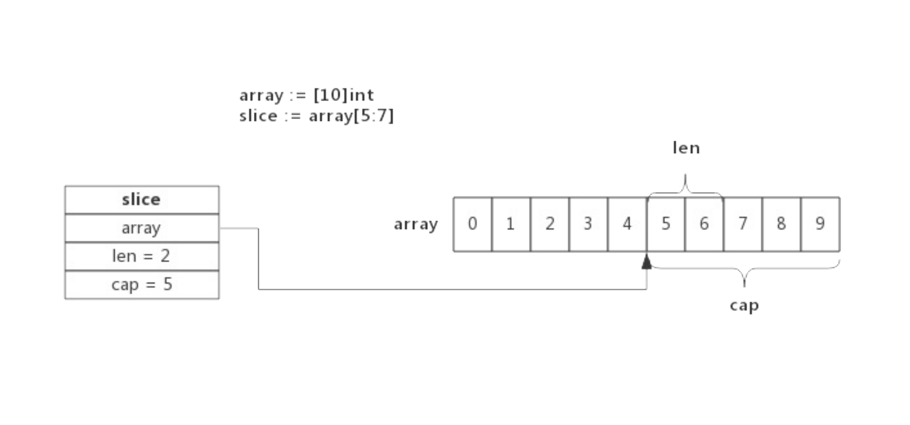

## 第一章：常见数据结构实现原理 

### chan数据结构 

src/runtime/chan.go:hchan 定义了channel的数据结构：

```go
type hchan struct { 

  qcount uint // 当前队列中剩余元素个数 

  dataqsiz uint // 环形队列长度，即可以存放的元素个数 

  buf unsafe.Pointer // 环形队列指针 

  elemsize uint16 // 每个元素的大小 

  closed uint32 // 标识关闭状态 

  elemtype *_type // 元素类型 

  sendx uint // 队列下标，指示元素写入时存放到队列中的位置 

  recvx uint // 队列下标，指示元素从队列的该位置读出 

  recvq waitq // 等待读消息的goroutine队列 

  sendq waitq // 等待写消息的goroutine队列 

  lock mutex // 互斥锁，chan不允许并发读写 

} 
```


#### 环形队列

 chan内部实现了一个环形队列作为其缓冲区，队列的长度是创建chan时指定的。


#### 等待队列

从channel读数据，如果channel缓冲区为空或者没有缓冲区，当前goroutine会被阻塞。向channel写数据，如 
果channel缓冲区已满或者没有缓冲区，当前goroutine会被阻塞。 

被阻塞的goroutine将会挂在channel的等待队列中： 
因读阻塞的goroutine会被向channel写入数据的goroutine唤醒； 
因写阻塞的goroutine会被从channel读数据的goroutine唤醒； 

下图展示了一个没有缓冲区的channel，有几个goroutine阻塞等待读数据： 


#### 类型信息 

一个channel只能传递一种类型的值，类型信息存储在hchan数据结构中。 

elemtype代表类型，用于数据传递过程中的赋值； 

elemsize代表类型大小，用于在buf中定位元素位置。 


#### 锁

一个channel同时仅允许被一个goroutine读写


### channel 读写


#### 创建channel 

创建channel的过程实际上是初始化hchan结构。其中类型信息和缓冲区长度由make语句传入，buf的大小则与元素大小和缓冲区长度共同决定。 

创建channel的伪代码如下所示： 

```go
func makechan(t *chantype, size int) *hchan { 

    var c *hchan 

    c = new(hchan) 

    c.buf = malloc(元素类型大小*size) 

    c.elemsize = 元素类型大小 

    c.elemtype = 元素类型 

    c.dataqsiz = size 


    return c 
} 
```

#### 向channel写数据 

向一个channel中写数据简单过程如下： 

1. 如果等待接收队列recvq不为空，说明缓冲区中没有数据或者没有缓冲区，此时直接从recvq取出G,并把数据写入，最后把该G唤醒，结束发送过程； 

2. 如果缓冲区中有空余位置，将数据写入缓冲区，结束发送过程； 

3. 如果缓冲区中没有空余位置，将待发送数据写入G，将当前G加入sendq，进入睡眠，等待被读goroutine唤醒； 

简单流程图如下：


 

#### 从channel读数据 

从一个channel读数据简单过程如下： 

1. 如果等待发送队列sendq不为空，且没有缓冲区，直接从sendq中取出G，把G中数据读出，最后把G唤醒，结束读取过程； 

2. 如果等待发送队列sendq不为空，此时说明缓冲区已满，从缓冲区中首部读出数据，把G中数据写入缓冲区尾部，把G唤醒，结束读取过程； 

3. 如果缓冲区中有数据，则从缓冲区取出数据，结束读取过程； 

4. 将当前goroutine加入recvq，进入睡眠，等待被写goroutine唤醒； 

简单流程图如下： 


#### 关闭channel

panic出现的常见场景还有： 

1. 关闭值为nil的channel 

2. 关闭已经被关闭的channel 

3. 向已经关闭的channel写数据 


#### 单向 channel

顾名思义，单向channel指只能用于发送或接收数据，实际上也没有单向channel。


#### select

使用select可以监控多channel，比如监控多个channel，当其中某一个channel有数据时，就从其读出数据。 

select的case语句读channel不会阻塞，尽管channel中没有数据。这是由于case语句编译后调用读channel时会明确传入不阻塞的参数，此时读不到数据时不会将当前goroutine加入到等待队列，而是直接返回。 


#### range

通过range可以持续从channel中读出数据，好像在遍历一个数组一样，当channel中没有数据时会阻塞当前goroutine，与读channel时阻塞处理机制一样。

```go
func chanRange(chanName chan int) {
    for e := range chanName { 
      fmt.Printf("Get element from chan: %d\n", e) 
    } 
}
```

注意：如果向此channel写数据的goroutine退出时，系统检测到这种情况后会panic，否则range将会永久阻塞。


### slice

Slice又称动态数组，依托数组实现，可以方便的进行扩容、传递等，实际使用中比数组更灵活。 正因为灵活，如果不了解其内部实现机制，有可能遭遇莫名的异常现象。Slice的实现原理很简单，本节试图根据真实的使用场景，在源码中总结实现原理。 


#### 题目一 

下面程序输出什么?

```go
package main 

import ("fmt") 

func main() { 
    var array [10]int 
  	// [0,0,0,0,0,0,0,0,0,0]
    var slice = array[5:6] 
  
    fmt.Println("lenth of slice: ", len(slice)) 
    fmt.Println("capacity of slice: ", cap(slice)) 
    fmt.Println(&slice[0] == &array[5]) 
} 
```

参考答案：slice跟据数组array创建，与数组共享存储空间，slice起始位置是array[5]，长度为1，容量为5，slice[0]和array[5]地址相同。 

#### 题目二 

下面程序输出什么?

```go
package main 

import ( "fmt") 

func AddElement(slice []int, e int) []int { 
		return append(slice, e) 
} 

func main() { 
    var slice []int 
    slice = append(slice, 1, 2, 3) 
    newSlice := AddElement(slice, 4) 
    fmt.Println(&slice[0] == &newSlice[0]) 
} 
```

参考答案：append函数执行时会判断切片容量是否能够存放新增元素，如果不能，则会重新申请存储空间，新存储空间将是原来的2倍或1.25倍（取决于扩展原空间大小），本例中实际执行了两次append操作，第一次空间增长到4，所以第二次append不会再扩容，所以新旧两个切片将共用一块存储空间。程序会输出”true”。

#### 题目三

下面程序输出什么?

```go
package main

import ("fmt")

func main() {
     orderLen := 5
     order := make([]uint16, 2 * orderLen)
		 // [0,0,0,0,0,0,0,0,0,0]
     pollorder := order[:orderLen:orderLen]
     lockorder := order[orderLen:][:orderLen:orderLen]

     fmt.Println("len(pollorder) = ", len(pollorder))
     fmt.Println("cap(pollorder) = ", cap(pollorder))
     fmt.Println("len(lockorder) = ", len(lockorder))
     fmt.Println("cap(lockorder) = ", cap(lockorder))
}
```

参考答案：order[low:high:max]操作意思是对order进行切片，新切片范围是[low, high),新切片容量是max。order长度为2倍的orderLen，pollorder切片指的是order的前半部分切片，lockorder指的是order的后半部分切片，即原order分成了两段。所以，pollorder和lockerorder的长度和容量都是orderLen，即5。 


#### Slice实现原理 

Slice依托数组实现，底层数组对用户屏蔽，在底层数组容量不足时可以实现自动重分配并生成新的Slice。接下来按照实际使用场景分别介绍其实现机制。 


#### Slice数据结构 

源码包中 src/runtime/slice.go:slice 定义了Slice的数据结构： 

```go
type slice struct {
    array unsafe.Pointer
    len int 
    cap int 
}
```

从数据结构看Slice很清晰, array指针指向底层数组，len表示切片长度，cap表示底层数组容量。 


#### 使用make创建Slice 

使用make来创建Slice时，可以同时指定长度和容量，创建时底层会分配一个数组，数组的长度即容量。 
例如，语句 slice := make([]int, 5, 10) 所创建的Slice，结构如下图所示：


该Slice长度为5，即可以使用下标slice[0] ~ slice[4]来操作里面的元素，capacity为10，表示后续向 slice 添加新的元素时可以不必重新分配内存，直接使用预留内存即可。 


#### 使用数组创建Slice 

使用数组来创建Slice时，Slice将与原数组共用一部分内存。 例如，语句 slice := array[5:7] 所创建的Slice，结构如下图所示： 



切片从数组array[5]开始，到数组array[7]结束（不含array[7]），即切片长度为2，数组后面的内容都作为切片的预留内存，即capacity为5。 

数组和切片操作可能作用于同一块内存，这也是使用过程中需要注意的地方。


#### Slice 扩容

使用append向Slice追加元素时，如果Slice空间不足，将会触发Slice扩容，扩容实际上重新一配一块更大的内 存，将原Slice数据拷贝进新Slice，然后返回新Slice，扩容后再将数据追加进去。 

例如，当向一个capacity为5，且length也为5的Slice再次追加1个元素时，就会发生扩容，如下图所示： 


扩容操作只关心容量，会把原Slice数据拷贝到新Slice，追加数据由append在扩容结束后完成。上图可见，扩容后 新的Slice长度仍然是5，但容量由5提升到了10，原Slice的数据也都拷贝到了新Slice指向的数组中。 

扩容容量的选择遵循以下规则： 

​		如果原Slice容量小于1024，则新Slice容量将扩大为原来的2倍； 

​		如果原Slice容量大于等于1024，则新Slice容量将扩大为原来的1.25倍； 

使用append()向Slice添加一个元素的实现步骤如下： 

1. 假如Slice容量够用，则将新元素追加进去，Slice.len++，返回原Slice 

2. 原Slice容量不够，则将Slice先扩容，扩容后得到新Slice 

3. 将新元素追加进新Slice，Slice.len++，返回新的Slice。 


#### Slice Copy 

使用copy()内置函数拷贝两个切片时，会将源切片的数据逐个拷贝到目的切片指向的数组中，拷贝数量取两个切片长度的最小值。 

例如长度为10的切片拷贝到长度为5的切片时，将会拷贝5个元素。也就是说，copy过程中不会发生扩容。


#### 特殊切片

跟据数组或切片生成新的切片一般使用 slice := array[start:end] 方式，这种新生成的切片并没有指定切片的容量， 实际上新切片的容量是从start开始直至array的结束。 比如下面两个切片，长度和容量都是一致的，使用共同的内存地址： 

```go
sliceA := make([]int, 5, 10) 
sliceB := sliceA[0:5]
```

根据数组或切片生成切片还有另一种写法，即切片同时也指定容量，即slice[start:end:cap], 其中cap即为新切片的容量，当然容量不能超过原切片实际值，如下所示： 

```go
sliceA := make([]int, 5, 10) //length = 5; capacity = 10 
sliceB := sliceA[0:5] //length = 5; capacity = 10 
sliceC := sliceA[0:5:5] //length = 5; capacity = 5
```

这切片方法不常见，在Golang源码里能够见到，不过非常利于切片的理解。


#### 编程Tips

创建切片时可跟据实际需要预分配容量，尽量避免追加过程中扩容操作，有利于提升性能； 

切片拷贝时需要判断实际拷贝的元素个数 

谨慎使用多个切片操作同一个数组，以防读写冲突 


#### Slice总结 

每个切片都指向一个底层数组 

每个切片都保存了当前切片的长度、底层数组可用容量 

使用len()计算切片长度时间复杂度为O(1)，不需要遍历切片 

使用cap()计算切片容量时间复杂度为O(1)，不需要遍历切片 

通过函数传递切片时，不会拷贝整个切片，因为切片本身只是个结构体而矣 

使用append()向切片追加元素时有可能触发扩容，扩容后将会生成新的切片 


### map数据结构


Golang的map使用哈希表作为底层实现，一个哈希表里可以有多个哈希表节点，也即bucket，而每个bucket就保存了map中的一个或一组键值对。 

map数据结构由 runtime/map.go/hmap 定义:

```go

type hmap struct {
    count int // 当前保存的元素个数 
    ... 
    B uint8 // 指示bucket数组的大小 
    ... 
    buckets unsafe.Pointer // bucket数组指针，数组的大小为2^B 
    ... 
} 
```


下图展示一个拥有4个bucket的map:


本例中, hmap.B=2 ， 而hmap.buckets长度是2^B为4. 元素经过哈希运算后会落到某个bucket中进行存储。查找过程类似。 

bucket 很多时候被翻译为桶，所谓的 哈希桶 实际上就是bucket。 


```go
type bmap struct {

    tophash [8]uint8 //存储哈希值的高8位

    data byte[1] //key value数据:key/key/key/.../value/value/value...
    overflow *bmap //溢出bucket的地址

}
```

每个bucket可以存储8个键值对。

- tophash是个长度为8的数组，哈希值相同的键（准确的说是哈希值低位相同的键）存入当前bucket时会将哈希值的高位存储在该数组中，以方便后续匹配。 

- data区存放的是key-value数据，存放顺序是key/key/key/…value/value/value，如此存放是为了节省字节对齐带来的空间浪费。 

- overflow 指针指向的是下一个bucket，据此将所有冲突的键连接起来。 

注意：上述中data和overflow并不是在结构体中显示定义的，而是直接通过指针运算进行访问的。 


下图展示bucket存放8个key-value对： 


#### 哈希冲突

当有两个或以上数量的键被哈希到了同一个bucket时，我们称这些键发生了冲突。Go使用链地址法来解决键冲突。由于每个bucket可以存放8个键值对，所以同一个bucket存放超过8个键值对时就会再创建一个键值对，用类似链表的方式将bucket连接起来。 

下图展示产生冲突后的map：


bucket数据结构指示下一个bucket的指针称为overflow bucket，意为当前bucket盛不下而溢出的部分。事实上哈希冲突并不是好事情，它降低了存取效率，好的哈希算法可以保证哈希值的随机性，但冲突过多也是要控制的，后面会再详细介绍。 


#### ChatGPT

**Go 语言 bmap 结构体解析**

在 Go 语言中，map 的底层数据结构之一是 bmap，用于实现哈希桶。下面是 bmap 结构体的一部分定义：

```go
type bmap struct {
    tophash [8]uint8
    data    byte[1]
    overflow *bmap
}
```

**1. byte[1] 是什么类型?**

​	•	在 bmap 结构体中，byte[1] 是一个大小为 1 的字节数组。

​	•	它实际是一个占位符，表示变长数组的起始位置，用于存储键值对的数据。

​	•	编译器会在实际使用时根据需要为 data 部分分配足够的内存。

**2. 为什么可以存下那么多的键值对?**

​	•	byte[1] 的真正作用是指示 bmap 结构体中包含了变长的数据区域，而不仅仅是一个字节。

​	•	data 部分存储多个键值对及其相关的哈希数据。

​	•	具体分配的内存大小由 map 的键和值的类型决定，以及每个桶的大小和 map 的负载因子。

​	•	bmap 结构体通过以下几部分实现哈希桶：

​	•	**tophash**: 数组用于存储哈希值的高 8 位，便于快速比较。

​	•	**data**: 实际的键值对数据，大小根据具体 map 类型动态调整。

​	•	**overflow**: 指针指向其他的 bmap 结构体，用于处理桶溢出的情况。

**3. 内存管理**

​	•	byte[1] 只是一个占位符，实际代表变长数据区域。

​	•	bmap 结构体的实际内存布局由编译器和运行时根据 map 类型和负载因子决定。

​	•	这样可以灵活高效地存储多个键值对，并在需要时进行扩展。

**总结**

bmap 结构体中的 byte[1] 作为占位符，表示一个变长的数据区域。通过 Go 语言的内存管理机制，根据 map 类型动态分配和管理内存，可以在一个 bmap 中存储多个键值对，确保哈希桶的高效运作。

这就是对 Go 语言中 bmap 结构体及其底层实现的解析。


#### 负载因子 

负载因子用于衡量一个哈希表冲突情况，公式为： 

​        负载因子 = 键数量/bucket数量 

例如，对于一个bucket数量为4，包含4个键值对的哈希表来说，这个哈希表的负载因子为1. 
哈希表需要将负载因子控制在合适的大小，超过其阀值需要进行rehash，也即键值对重新组织： 

- 哈希因子过小，说明空间利用率低 

- 哈希因子过大，说明冲突严重，存取效率低 

每个哈希表的实现对负载因子容忍程度不同，比如Redis实现中负载因子大于1时就会触发rehash，而Go则在在负载因子达到6.5时才会触发rehash，因为Redis的每个bucket只能存1个键值对，而Go的bucket可能存8个键值对，所以Go可以容忍更高的负载因子


#### 渐进式扩容

为了保证访问效率，当新元素将要添加进map时，都会检查是否需要扩容，扩容实际上是以空间换时间的手段。触发扩容的条件有二个： 

1. 负载因子 > 6.5时，也即平均每个bucket存储的键值对达到6.5个。 

2. overflow数量 > 2^15时，也即overflow数量超过32768时


##### 增量扩容

当负载因子过大时，就新建一个bucket，新的bucket长度是原来的2倍，然后旧bucket数据搬迁到新的bucket。考虑到如果map存储了数以亿计的key-value，一次性搬迁将会造成比较大的延时，Go采用逐步搬迁策略，即每次访问map时都会触发一次搬迁，每次搬迁2个键值对。 

下图展示了包含一个bucket满载的map(为了描述方便，图中bucket省略了value区域): 


当前map存储了7个键值对，只有1个bucket。此地负载因子为7。再次插入数据时将会触发扩容操作，扩容之后再将新插入键写入新的bucket。 

当第8个键值对插入时，将会触发扩容，扩容后示意图如下： 


hmap数据结构中oldbuckets成员指身原bucket，而buckets指向了新申请的bucket。新的键值对被插入新的bucket中。后续对map的访问操作会触发迁移，将oldbuckets中的键值对逐步的搬迁过来。当oldbuckets中的键值对全部搬迁完毕后，删除oldbuckets。 

搬迁完成后的示意图如下：


数据搬迁过程中原bucket中的键值对将存在于新bucket的前面，新插入的键值对将存在于新bucket的后面。实际搬迁过程中比较复杂，将在后续源码分析中详细介绍。 


##### 等量扩容

所谓等量扩容，实际上并不是扩大容量，buckets数量不变，重新做一遍类似增量扩容的搬迁动作，把松散的键值对重新排列一次，以使bucket的使用率更高，进而保证更快的存取。在极端场景下，比如不断的增删，而键值对正好集中在一小部分的bucket，这样会造成overflow的bucket数量增多，但负载因子又不高，从而无法执行增量搬迁的情况，如下图所示：


 

#### 查找过程

查找过程如下： 

1. 跟据key值算出哈希值 

2. 取哈希值低位与hmpa.B取模确定bucket位置 

3. 取哈希值高位在tophash数组中查询 

4. 如果tophash[i]中存储值也哈希值相等，则去找到该bucket中的key值进行比较 

5. 当前bucket没有找到，则继续从下个overflow的bucket中查找。 

6. 如果当前处于搬迁过程，则优先从oldbuckets查找 

注：如果查找不到，也不会返回空值，而是返回相应类型的0值。 


#### 插入过程 

新员素插入过程如下： 

1. 跟据key值算出哈希值 

2. 取哈希值低位与hmap.B取模确定bucket位置 

3. 查找该key是否已经存在，如果存在则直接更新值 

4. 如果没找到将key，将key插入


### struct

Go的struct声明允许字段附带 `Tag` 来对字段做一些标记。 

该 `Tag` 不仅仅是一个字符串那么简单，因为其主要用于反射场景， `reflect` 包中提供了操作 Tag 的方法，所以 Tag 写法也要遵循一定的规则。


#### Tag的本质


##### Tag规则

Tag 本身是一个字符串，但字符串中却是： 以空格分隔的 key:value 对 。 

- key : 必须是非空字符串，字符串不能包含控制字符、空格、引号、冒号。 

- value : 以双引号标记的字符串 

- 注意：冒号前后不能有空格 

如下代码所示，如此写没有实际意义，仅用于说明 Tag 规则 

```go
 type Server struct { 
   ServerName string `key1: "value1" key11:"value11"` 
   ServerIP string `key2: "value2"` 
 }
```

上述代码 ServerName 字段的 Tag 包含两个key-value对。 ServerIP 字段的 Tag 只包含一个key-value对。 


##### Tag是Struct的一部分

前面说过， Tag 只有在反射场景中才有用，而反射包中提供了操作 Tag 的方法。在说方法前，有必要先了解一下Go是如何管理struct字段的。 

以下是 reflect 包中的类型声明，省略了部分与本文无关的字段。 

```go
// A StructField describes a single field in a struct. 
type StructField struct {
     // Name is the field name. 
    Name string
    ... 
    Type Type // field type 
    Tag StructTag // field tag string 
    ... 
 } 
  
 type StructTag string 
```

可见，描述一个结构体成员的结构中包含了 StructTag ，而其本身是一个 string 。也就是说 Tag 其实是结构体字段的一个组成部分。 

##### 获取Tag

StructTag 提供了 Get(key string) string 方法来获取 Tag ，示例如下： 

```go
package main 

import (
  "reflect" 
  "fmt" 
) 

type Server struct {
    ServerName string `key1:"value1" key11:"value11"` 
    ServerIP string `key2:"value2"` 
} 

func main() {
    s := Server{} 
		st := reflect.TypeOf(s) 

    field1 := st.Field(0) 
    fmt.Printf("key1:%v\n", field1.Tag.Get("key1")) 
    fmt.Printf("key11:%v\n", field1.Tag.Get("key11")) 

    filed2 := st.Field(1) 
    fmt.Printf("key2:%v\n", filed2.Tag.Get("key2")) 
} 
```

程序输出如下：

```go
key1:value1 
key11:value11 
key2:value2
```

#### Tag存在的意义

总之：正是基于struct的tag特性，才有了诸如json、orm等等的应用。理解这个关系是至关重要的。或许，你可以定义另一种tag规则，来处理你特有的数据。 

常见的tag用法，主要是JSON数据解析、ORM映射等。 


### iota

我们知道iota常用于const表达式中，我们还知道其值是从零开始，const声明块中每增加一行iota值自增1。使用iota可以简化常量定义，但其规则必须要牢牢掌握，否则在我们阅读别人源码时可能会造成误解或障碍。本节我们尝试全面的总结其使用场景，另外花一小部分时间看一下其实现原理，从原理上把握可以更深刻的记忆这些规则。 


#### 规则

很多书上或博客描述的规则是这样的： 

1. iota在const关键字出现时被重置为0 

2. const声明块中每新增一行iota值自增1 

我曾经也这么理解，看过编译器代码后发现，其实规则只有一条： 

​	iota代表了const声明块的行索引（下标从0开始） 

#### 编译原理

const块中每一行在GO中使用spec数据结构描述，spec声明如下： 

```go
// A ValueSpec node represents a constant or variable declaration 
// (ConstSpec or VarSpec production). 
// 
ValueSpec struct {
    Doc *CommentGroup 		// associated documentation; or nil 
    Names []*Ident 				// value names (len(Names) > 0) 
    Type Expr 						// value type; or nil 
    Values []Expr 				// initial values; or nil 
    Comment *CommentGroup // line comments; or nil 
} 
```

这里我们只关注ValueSpec.Names， 这个切片中保存了一行中定义的常量，如果一行定义N个常量，那么ValueSpec.Names切片长度即为N。const块实际上是spec类型的切片，用于表示const中的多行

所以编译期间构造常量时的伪算法如下： 

```go
for iota, spec := range ValueSpecs { 
    for i, name := range spec.Names { 
        obj := NewConst(name, iota...) //此处将iota传入，用于构造常量 
        ... 
    } 
}
```

从上面可以更清晰的看出iota实际上是遍历const块的索引，每行中即便多次使用iota，其值也不会递增。


### string 

Go标准库 builtin 给出了所有内置类型的定义。源代码位于 src/builtin/builtin.go ，其中关于string的描述如下: 

```go
// string is the set of all strings of 8-bit bytes, conventionally but not 
// necessarily representing UTF-8-encoded text. A string may be empty, but 
// not nil. Values of string type are immutable. 
type string string
```

所以string是8比特字节的集合，通常但并不一定是UTF-8编码的文本。 另外，还提到了两点，非常重要： 
	string可以为空（长度为0），但不会是nil； 
	string对象不可以修改

#### string 数据结构

源码包 src/runtime/string.go:stringStruct 定义了string的数据结构： 

```go
type stringStruct struct { 
  	str unsafe.Pointer 
  	len int 
}
```

其数据结构很简单： 

​	stringStruct.str：字符串的首地址； 

​	stringStruct.len：字符串的长度； 

string数据结构跟切片有些类似，只不过切片还有一个表示容量的成员，事实上string和切片，准确的说是byte切片经常发生转换。这个后面再详细介绍。


#### string 操作

#### 声明

如下代码所示，可以声明一个string变量变赋予初值： 

```go
var str string 
str = "Hello World"
```

字符串构建过程是先跟据字符串构建stringStruct，再转换成string。转换的源码如下： 

```go
func gostringnocopy(str *byte) string { // 跟据字符串地址构建string 
    ss := stringStruct{str: unsafe.Pointer(str), len: findnull(str)} // 先构造stringStruct 
    s := *(*string)(unsafe.Pointer(&ss)) // 再将stringStruct转换成string 
    return s 
}
```

string在runtime包中就是stringStruct，对外呈现叫做string。 


#### []byte转string 

byte切片可以很方便的转换成string，如下所示：

```go
func GetStringBySlice(s []byte) string { 
  	return string(s) 
}
```

需要注意的是这种转换需要一次内存拷贝。

转换过程如下： 

1. 跟据切片的长度申请内存空间，假设内存地址为p，切片长度为len(b)； 

2. 构建string（string.str = p；string.len = len；） 

3. 拷贝数据(切片中数据拷贝到新申请的内存空间) 

转换示意图： 


#### string转[]byte

string也可以方便的转成byte切片，如下所示： 

```go
func GetSliceByString(str string) []byte { 
  	return []byte(str) 
}
```

string转换成byte切片，也需要一次内存拷贝，其过程如下： 

- 申请切片内存空间 

- 将string拷贝到切片 

转换示意图： 


#### 字符串拼接

字符串可以很方便的拼接，像下面这样： 

```go
str := "Str1" + "Str2" + "Str3"
```

即便有非常多的字符串需要拼接，性能上也有比较好的保证，因为新字符串的内存空间是一次分配完成的，所以性能消耗主要在拷贝数据上。 

一个拼接语句的字符串编译时都会被存放到一个切片中，拼接过程需要遍历两次切片，第一次遍历获取总的字符串长度，据此申请内存，第二次遍历会把字符串逐个拷贝过去。 

字符串拼接伪代码如下： 

```go
func concatstrings(a []string) string { // 字符串拼接 
  	length := 0 // 拼接后总的字符串长度 
  
    for _, str := range a { 
        length += length(str)
    } 
  
    s, b := rawstring(length) // 生成指定大小的字符串，返回一个string和切片，二者共享内存空间 

    for _, str := range a { 
        copy(b, str) // string无法修改，只能通过切片修改 
        b = b[len(str):] 
    } 

    return s 
}
```

因为string是无法直接修改的，所以这里使用rawstring()方法初始化一个指定大小的string，同时返回一个切片，二者共享同一块内存空间，后面向切片中拷贝数据，也就间接修改了string。

rawstring()源代码如下： 

```go
func rawstring(size int) (s string, b []byte) { // 生成一个新的string，返回的string和切片共享相同的空间 
    p := mallocgc(uintptr(size), nil, false) 

    stringStructOf(&s).str = p 
    stringStructOf(&s).len = size 

    *(*slice)(unsafe.Pointer(&b)) = slice{p, size, size} 

    return 
}
```

#### 为什么字符串不允许修改？

像C++语言中的string，其本身拥有内存空间，修改string是支持的。但Go的实现中，string不包含内存空间，只有一个内存的指针，这样做的好处是string变得非常轻量，可以很方便的进行传递而不用担心内存拷贝。 

因为string通常指向字符串字面量，而字符串字面量存储位置是只读段，而不是堆或栈上，所以才有了string不可修改的约定。

#### []byte转换成string一定会拷贝内存吗？

byte切片转换成string的场景很多，为了性能上的考虑，有时候只是临时需要字符串的场景下，byte切片转换成string时并不会拷贝内存，而是直接返回一个string，这个string的指针(string.str)指向切片的内存。 

比如，编译器会识别如下临时场景： 

- 使用m[string(b)]来查找map（map是string为key，临时把切片b转成string）； 

- 字符串拼接，如”<” + “string(b)” + “>”； 

- 字符串比较：string(b) == “foo” 

因为是临时把byte切片转换成string，也就避免了因byte切片同容改成而导致string引用失败的情况，所以此时可以不必拷贝内存新建一个string。


#### string和[]byte如何取舍 

string和[]byte都可以表示字符串，但因数据结构不同，其衍生出来的方法也不同，要跟据实际应用场景来选择。 

string 擅长的场景： 

- 需要字符串比较的场景； 

- 不需要nil字符串的场景； 

[]byte擅长的场景： 

- 修改字符串的场景，尤其是修改粒度为1个字节； 

- 函数返回值，需要用nil表示含义的场景； 

- 需要切片操作的场景； 

虽然看起来string适用的场景不如[]byte多，但因为string直观，在实际应用中还是大量存在，在偏底层的实现中[]byte使用更多。


## 第二章 常见控制结构实现原理

本章主要介绍常见的控制结构，比如defer、select、range等，通过对其底层实现原理的分析，来加深认识，以此避免一些使用过程中的误区。


### defer

defer语句用于延迟函数的调用，每次defer都会把一个函数压入栈中，函数返回前再把延迟的函数取出并执行。为了方便描述，我们把创建defer的函数称为主函数，defer语句后面的函数称为延迟函数。

下面函数输出结果是什么？ 

```go
func deferFuncParameter() { 
    var aInt = 1 

    defer fmt.Println(aInt) 

    aInt = 2 
    return 
}
```

参考答案：输出1。延迟函数fmt.Println(aInt)的参数在defer语句出现时就已经确定了，所以无论后面如何修改aInt变量都不会影响延迟函数。 

下面程序输出什么？ 

```go
package main 

import "fmt" 

func printArray(array *[3]int) {
    for i := range array {
        fmt.Println(array[i]) 
		} 
} 

func deferFuncParameter() {
  	var aArray = [3]int{1, 2, 3} 
		defer printArray(&aArray) 

		aArray[0] = 10 
		return
} 

func main() {
   deferFuncParameter() 
}
```

参考答案：输出10、2、3三个值。延迟函数printArray()的参数在defer语句出现时就已经确定了，即数组的地址，由于延迟函数执行时机是在return语句之前，所以对数组的最终修改值会被打印出来。 


下面函数输出什么？ 

```go
func deferFuncReturn() (result int) { 
    i := 1 
    defer func() { 
      result++ 
    }() 
    return i 
}
```

参考答案：函数输出2。函数的return语句并不是原子的，实际执行分为设置返回值—>ret，defer语句实际执行在返回前，即拥有defer的函数返回过程是：设置返回值—>执行defer—>ret。所以return语句先把result设置为i的值，即1，defer语句中又把result递增1，所以最终返回2。

#### defer规则 

##### 规则一：延迟函数的参数在defer语句出现时就已经确定下来了

官方给出一个例子，如下所示： 

```go
func a() { 
    i := 0 
    defer fmt.Println(i) 
    i++ 
    return 
}
```

defer语句中的fmt.Println()参数i值在defer出现时就已经确定下来，实际上是拷贝了一份。后面对变量i的修改不会影响fmt.Println()函数的执行，仍然打印”0”。 

注意：对于指针类型参数，规则仍然适用，只不过延迟函数的参数是一个地址值，这种情况下，defer后面的语句对变量的修改可能会影响延迟函数。 


##### 规则二：延迟函数执行按后进先出顺序执行，即先出现的defer最后执行 

这个规则很好理解，定义defer类似于入栈操作，执行defer类似于出栈操作。 

设计defer的初衷是简化函数返回时资源清理的动作，资源往往有依赖顺序，比如先申请A资源，再跟据A资源申请B资源，跟据B资源申请C资源，即申请顺序是:A—>B—>C，释放时往往又要反向进行。这就是把deffer设计成FIFO的原因。

每申请到一个用完需要释放的资源时，立即定义一个defer来释放资源是个很好的习惯。 


##### 规则三：延迟函数可能操作主函数的具名返回值

定义defer的函数，即主函数可能有返回值，返回值有没有名字没有关系，defer所作用的函数，即延迟函数可能会影响到返回值。


#### 函数返回过程 


#### defer实现原理 

defer数据结构 

源码包 src/src/runtime/runtime2.go:_defer 定义了defer的数据结构： 

```go
type _defer struct { 
    sp uintptr //函数栈指针
    pc uintptr //程序计数器 
    fn *funcval //函数地址 
    link *_defer //指向自身结构的指针，用于链接多个defer 
}       
```

我们知道defer后面一定要接一个函数的，所以defer的数据结构跟一般函数类似，也有栈地址、程序计数器、函数地址等等。 

与函数不同的一点是它含有一个指针，可用于指向另一个defer，每个goroutine数据结构中实际上也有一个defer指针，该指针指向一个defer的单链表，每次声明一个defer时就将defer插入到单链表表头，每次执行defer时就从单链表表头取出一个defer执行。


#### 总结

- defer定义的延迟函数参数在defer语句出时就已经确定下来了 

- defer定义顺序与实际执行顺序相反 

- return不是原子操作，执行过程是: 保存返回值(若有)—>执行defer（若有）—>执行ret跳转 

- 申请资源后立即使用defer关闭资源是好习惯 


### select

select是Golang在语言层面提供的多路IO复用的机制，其可以检测多个channel是否ready(即是否可读或可写)，使用起来非常方便。 

题目1 


题目1 

下面的程序输出是什么？ 

```go
package main 

import (
    "fmt" 
		"time" 
) 

func main() {
    chan1 := make(chan int) 
    chan2 := make(chan int) 

    go func() {
      	chan1 <- 1 
    		time.Sleep(5 * time.Second) 
    }() 

    go func() {
      	chan2 <- 1 
    		time.Sleep(5 * time.Second) 
    }() 

    select {
    case <-chan1: 
      	fmt.Println("chan1 ready.") 
    case <-chan2: 
      	fmt.Println("chan2 ready.") 
    default: 
      	fmt.Println("default") 
		} 

		fmt.Println("main exit.") 
}
```

参考答案：select中各个case执行顺序是随机的，如果某个case中的channel已经ready，则执行相应的语句并退出select流程，如果所有case中的channel都未ready，则执行default中的语句然后退出select流程。另外，由于启动的协程和select语句并不能保证执行顺序，所以也有可能select执行时协程还未向channel中写入数据，所以select直接执行default语句并退出。所以，以下三种输出都有可能： 
可能的输出一： 
chan1 ready. 
main exit. 

可能的输出二： 
chan2 ready. 
main exit. 

可能的输出三： 
default 
main exit. 

题目2

下面的程序执行到select时会发生什么？ 

```go
package main

import (
    "fmt" 
		"time" 
)

func main() {
  	chan1 := make(chan int) 
		chan2 := make(chan int) 

		writeFlag := false
    go func() {
      	for {
        		if writeFlag {
            		chan1 <- 1 
   					} 
						time.Sleep(time.Second) 
				} 
		}() 

    go func() {

      	for {
            if writeFlag {
                chan2 <- 1 
            } 
    				time.Sleep(time.Second) 
    		} 
    }() 

    select {
    case <-chan1: 
    		fmt.Println("chan1 ready.") 
    case <-chan2: 
    		fmt.Println("chan2 ready.") 
    } 

    fmt.Println("main exit.") 
} 
```

参考答案：select会按照随机的顺序检测各case语句中channel是否ready，如果某个case中的channel已经ready则执行相应的case语句然后退出select流程，如果所有的channel都未ready且没有default的话，则会阻塞等待各个channel。所以上述程序会一直阻塞。 

题目3

下面程序有什么问题？

```go
package main 

import (
    "fmt" 
) 
    
func main() {
  	chan1 := make(chan int) 
		chan2 := make(chan int) 

    go func() {
        close(chan1) 
    }() 

    go func() {
      	close(chan2) 
    }() 

    select {
    case <-chan1: 
    		fmt.Println("chan1 ready.") 
    case <-chan2: 
    		fmt.Println("chan2 ready.") 
    } 

    fmt.Println("main exit.") 
} 
```

参考答案：select会按照随机的顺序检测各case语句中channel是否ready，考虑到已关闭的channel也是可读的，所以上述程序中select不会阻塞，具体执行哪个case语句具是随机的。


下面程序会发生什么？ 

```go
package main

func main(){
    select{
    }
}
```

参考答案：对于空的select语句，程序会被阻塞，准确的说是当前协程被阻塞，同时Golang自带死锁检测机制，当发现当前协程再也没有机会被唤醒时，则会panic。所以上述程序会panic。 


#### 实现原理

Golang实现select时，定义了一个数据结构表示每个case语句(含defaut，default实际上是一种特殊的case)，select执行过程可以类比成一个函数，函数输入case数组，输出选中的case，然后程序流程转到选中的case块。 

#### case数据结构 

源码包 src/runtime/select.go:scase 定义了表示case语句的数据结构：

```go
type scase struct { 
    c *hchan // chan 
    kind uint16 
    elem unsafe.Pointer // data element 
}
```

scase.c为当前case语句所操作的channel指针，这也说明了一个case语句只能操作一个channel。scase.kind表示该case的类型，分为读channel、写channel和default，三种类型分别由常量定义： 

- caseRecv：case语句中尝试读取scase.c中的数据； 

- caseSend：case语句中尝试向scase.c中写入数据； 

- caseDefault： default语句 

scase.elem表示缓冲区地址，跟据scase.kind不同，有不同的用途： 

- scase.kind == caseRecv ： scase.elem表示读出channel的数据存放地址； 

- scase.kind == caseSend ： scase.elem表示将要写入channel的数据存放地址； 


### range


### mutex


### rwmutex


## 第三章 协程


## 内存管理

编写过C语言程序的肯定知道通过malloc()方法动态申请内存，其中内存分配器使用的是glibc提供的ptmalloc2。除了glibc，业界比较出名的内存分配器有Google的tcmalloc和Facebook的jemalloc。二者在避免内存碎片和性能上均比glic有比较大的优势，在多线程环境中效果更明显。 

Golang中也实现了内存分配器，原理与tcmalloc类似，简单的说就是维护一块大的全局内存，每个线程(Golang中为P)维护一块小的私有内存，私有内存不足再从全局申请。另外，内存分配与GC（垃圾回收）关系密切，所以了解GC前有必要了解内存分配的原理

### 内存分配原理

#### span

#### class

#### span 数据结构

#### cache

有了管理内存的基本单位span，还要有个数据结构来管理span，这个数据结构叫mcentral，各线程需要内存时从mcentral管理的span中申请内存，为了避免多线程申请内存时不断的加锁，Golang为每个线程分配了span的缓存，这个缓存即是cache。 

src/runtime/mcache.go:mcache 定义了cache的数据结构:

```go
type mcache struct { 
  	alloc [67*2]*mspan // 按class分组的mspan列表 
}
```

alloc为mspan的指针数组，数组大小为class总数的2倍。数组中每个元素代表了一种class类型的span列表，每种class类型都有两组span列表，第一组列表中所表示的对象中包含了指针，第二组列表中所表示的对象不含有指针，这么做是为了提高GC扫描性能，对于不包含指针的span列表，没必要去扫描。 

根据对象是否包含指针，将对象分为noscan和scan两类，其中noscan代表没有指针，而scan则代表有指针，需要GC进行扫描

mcache和span的对应关系如下图所示：


mchache在初始化时是没有任何span的，在使用过程中会动态的从central中获取并缓存下来，跟据使用情况，每种class的span个数也不相同。上图所示，class 0的span数比class1的要多，说明本线程中分配的小对象要多一些。


## 并发控制


#### ChatGPT

##### go 的源码中有以下这一段 , 其中为什么stopCtx 类型为 struct ,却可以嵌入了类型为 interface 的 Context 呢?嵌入后将有怎样的效果呢?

```go
type Context interface {
    Deadline() (deadline time.Time, ok bool)
    Done() <-chan struct{}
    Err() error
    Value(key any) any
}

type stopCtx struct {
	Context
	stop func() bool
}
```


在Go语言中，`struct` 类型嵌入一个 `interface` 类型实际上是一种常见的设计模式。让我们来分析一下这个设计：

1. **嵌入的概念**

Go语言允许将一个类型嵌入到另一个类型中。嵌入的类型可以是 `struct` 或者 `interface`。当你在一个结构体中嵌入另一个类型时，被嵌入的类型的字段和方法将会被“提升”到外层结构体上，也就是说，外层结构体可以直接访问嵌入类型的方法和字段，仿佛这些方法和字段是外层结构体自己的一样。

2. **嵌入 `interface` 的效果**

在你的例子中，`stopCtx` 是一个结构体类型，并且它嵌入了一个 `Context` 接口：

```go
type stopCtx struct {
	Context
	stop func() bool
}
```

这里的 `Context` 是一个接口类型。尽管 `Context` 是一个接口，但嵌入它的效果与嵌入一个结构体类型类似。也就是说，`stopCtx` 结构体会“继承” `Context` 接口的所有方法（即 `Deadline`, `Done`, `Err`, 和 `Value`）。因为 `stopCtx` 嵌入了 `Context` 接口，它必须实现 `Context` 接口的所有方法才能实例化一个 `stopCtx` 类型的值。

3. **实例化 `stopCtx`**

要理解这个更具体的效果，可以看一个简单的例子：

```go
type MyContext struct {
    // 实现 Context 接口的方法
}

func (MyContext) Deadline() (time.Time, bool) { /* 实现 */ }
func (MyContext) Done() <-chan struct{}       { /* 实现 */ }
func (MyContext) Err() error                  { /* 实现 */ }
func (MyContext) Value(key any) any           { /* 实现 */ }

ctx := MyContext{}
stopContext := stopCtx{
    Context: ctx,       // 嵌入了 MyContext
    stop:    func() bool { return true },
}
```

在上面的例子中，`MyContext` 实现了 `Context` 接口。当你创建 `stopCtx` 实例时，你将一个实现了 `Context` 接口的值（即 `ctx`）赋给了 `stopCtx` 的嵌入字段 `Context`。

由于 `stopCtx` 嵌入了 `Context`，`stopCtx` 类型的值也具有 `Context` 接口的方法。这意味着你可以直接通过 `stopContext` 调用 `Deadline()`, `Done()`, `Err()`, 和 `Value()` 方法，就像它们是 `stopCtx` 类型本身的方法一样。

4. **总结**

- **嵌入接口类型允许将接口的方法提升到外层结构体上**，使得外层结构体可以直接访问这些方法。
- **`stopCtx` 可以作为 `Context` 接口的实现**，因为它嵌入了一个实现了 `Context` 接口的值。
- **这种设计模式通常用于增强已有接口类型的功能**，例如在 `stopCtx` 中增加了 `stop` 函数的功能，而不需要重新实现 `Context` 的所有方法。

这种设计模式非常灵活，可以帮助你构建复杂的类型体系，同时保持代码的简洁和可读性。


##### goroutine 在获取通道值时阻塞了 , 此时当前goroutine 是否使 cpu 空转?


当一个 `goroutine` 在获取通道（channel）的值时阻塞，当前 `goroutine` **不会**使 CPU 空转。

**原理分析**

在 Go 中，`goroutine` 是由 Go 运行时管理的轻量级线程。Go 运行时有自己的调度器，用于在多个 `goroutine` 之间分配 CPU 资源。当一个 `goroutine` 尝试从一个通道读取数据并且该通道没有数据可供读取时，该 `goroutine` 会被自动挂起（阻塞），直到有数据可用。这意味着该 `goroutine` 不会占用 CPU 资源，也不会使 CPU 空转。

具体来说，当 `goroutine` 阻塞时，Go 的调度器会将其状态标记为“等待”，并将 CPU 资源分配给其他可以继续执行的 `goroutine`。一旦有数据写入通道，Go 运行时会唤醒阻塞的 `goroutine`，并重新安排它执行。

**例子**

考虑以下代码：

```go
func main() {
    ch := make(chan int)

    go func() {
        fmt.Println("Goroutine is waiting for a value...")
        val := <-ch // 在此处阻塞，直到从通道接收到数据
        fmt.Println("Goroutine received:", val)
    }()

    time.Sleep(2 * time.Second) // 模拟延迟
    ch <- 42 // 发送数据到通道，解除阻塞
}
```

在这个例子中，当匿名 `goroutine` 尝试从通道 `ch` 读取数据时，由于通道最初是空的，`goroutine` 会阻塞在 `val := <-ch` 这一行。但这时，CPU 不会空转。相反，Go 运行时会将该 `goroutine` 挂起，允许其他 `goroutine` 或主程序继续执行。当主程序在两秒后将值 `42` 发送到通道时，阻塞的 `goroutine` 被唤醒，继续执行其余的代码。

**总结**

当一个 `goroutine` 在获取通道的值时阻塞，它不会导致 CPU 空转。Go 运行时会有效地挂起该 `goroutine`，并将 CPU 资源分配给其他可以运行的 `goroutine`。这使得 Go 程序能够高效地使用 CPU 资源，尤其是在并发处理和 I/O 阻塞操作中。


##### 在 goroutine 中执行 time.Sleep(2 * time.Second)  , 此时当前goroutine 是否使 cpu 空转?

当一个 `goroutine` 执行 `time.Sleep(2 * time.Second)` 时，当前 `goroutine` **不会**使 CPU 空转。

**原理分析**

`time.Sleep` 是 Go 标准库提供的一个函数，用于让当前 `goroutine` 休眠指定的时间。当你调用 `time.Sleep` 时，Go 运行时会将当前的 `goroutine` 挂起，使其进入“睡眠”状态，并在指定的时间过去之后再恢复运行。

在 `goroutine` 休眠期间，Go 的调度器会将 CPU 资源分配给其他可以继续执行的 `goroutine`。因此，这个 `goroutine` 处于休眠状态时，不会占用 CPU 资源，也不会使 CPU 空转。

**示例**

考虑以下代码：

```go
func main() {
    go func() {
        fmt.Println("Goroutine is sleeping...")
        time.Sleep(2 * time.Second) // 在此处休眠 2 秒
        fmt.Println("Goroutine woke up")
    }()

    // 主 goroutine 也可以执行其他工作
    fmt.Println("Main goroutine is working")
    time.Sleep(3 * time.Second) // 让主 goroutine 也休眠，等待 goroutine 完成
}
```

在这个例子中，当 `goroutine` 调用 `time.Sleep(2 * time.Second)` 时，它会进入休眠状态。在这 2 秒钟的休眠期间，Go 运行时将不会为这个 `goroutine` 分配 CPU 时间，而是让其他 `goroutine` 继续执行。

**总结**

当一个 `goroutine` 调用 `time.Sleep` 进入休眠状态时，它不会导致 CPU 空转。Go 的调度器会将该 `goroutine` 挂起，释放 CPU 资源以供其他 `goroutine` 使用。当休眠时间结束时，`goroutine` 会被恢复执行。这种设计使得 Go 程序能够更高效地利用 CPU 资源，特别是在处理并发任务时。


```go
const timersLen = 64
var timers [timersLen]struct { //timersBucket数组，长度为64
    timersBucket
}
func (t *timer) assignBucket() *timersBucket {
    id := uint8(getg().m.p.ptr().id) % timersLen // Processor ID 与数组长度求模，得到下标
    t.tb = &timers[id].timersBucket
    return t.tb
}
```


常见的GO语言版本工具。 