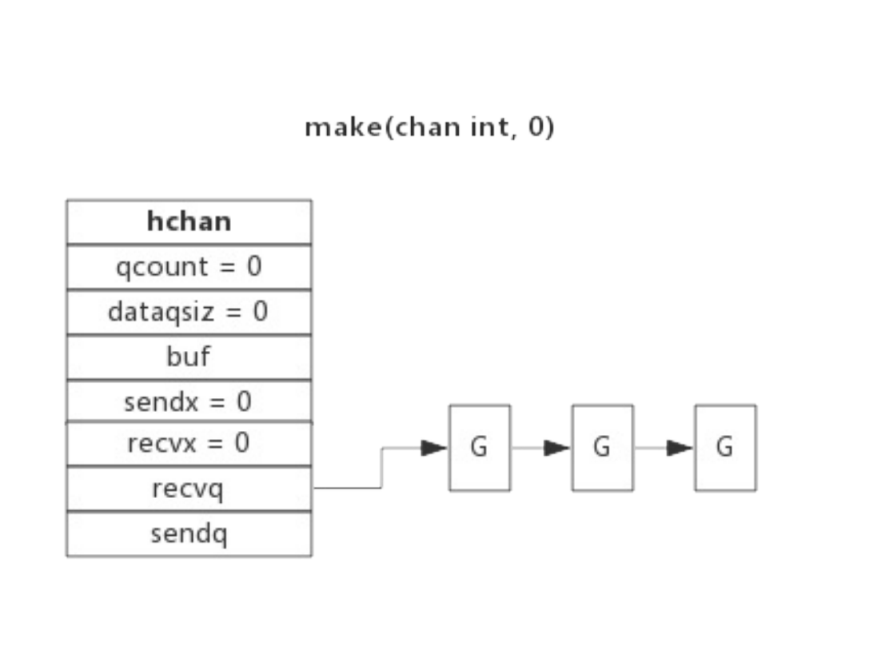
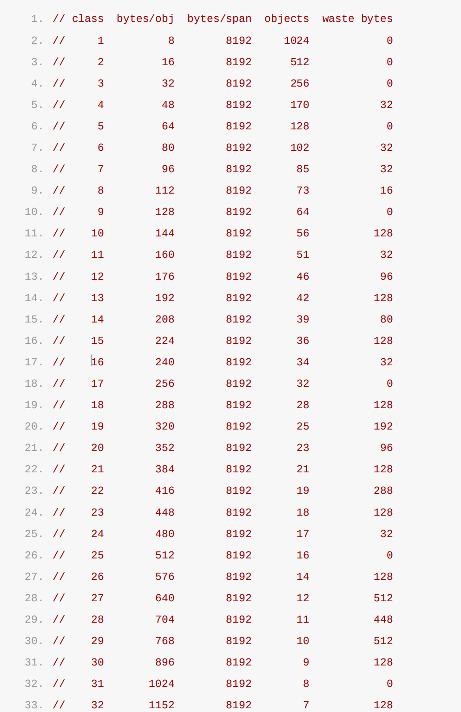
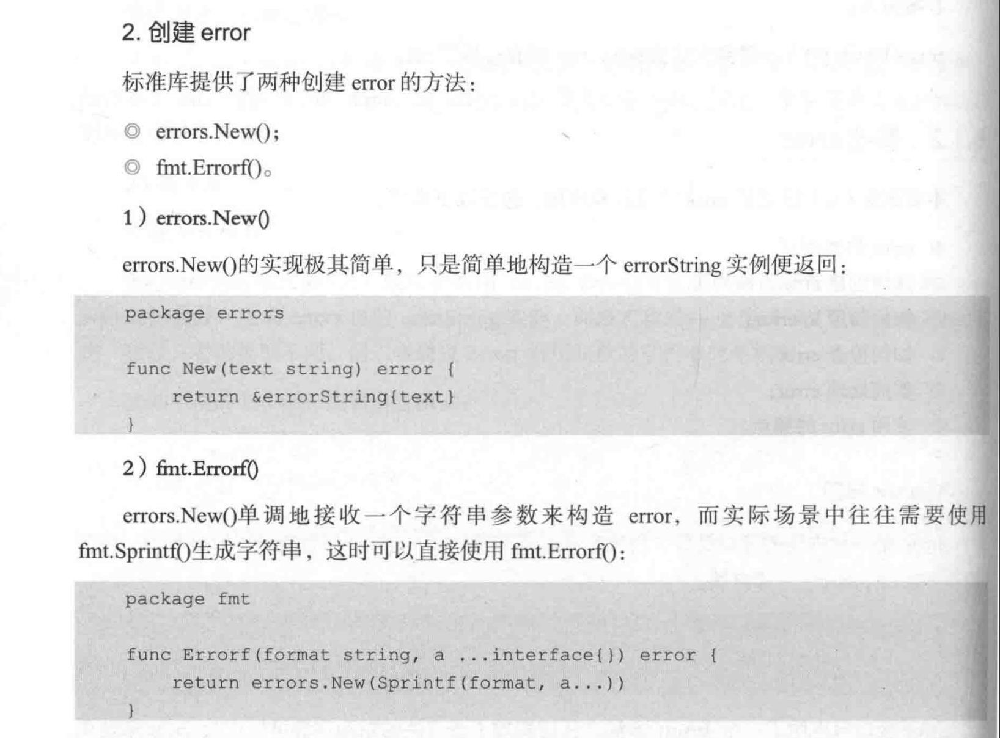

# Go 专家编程 - 任洪彩


## 常见数据结构实现原理 


### chan数据结构 


src/runtime/chan.go:hchan 定义了channel的数据结构：

```go
type hchan struct { 

  qcount uint // 当前队列中剩余元素个数 

  dataqsiz uint // 环形队列长度，即可以存放的元素个数 

  buf unsafe.Pointer // 环形队列指针 

  elemsize uint16 // 每个元素的大小 

  closed uint32 // 标识关闭状态 

  elemtype *_type // 元素类型 

  sendx uint // 队列下标，指示元素写入时存放到队列中的位置 

  recvx uint // 队列下标，指示元素从队列的该位置读出 

  recvq waitq // 等待读消息的goroutine队列 

  sendq waitq // 等待写消息的goroutine队列 

  lock mutex // 互斥锁，chan不允许并发读写 

} 
```


#### 环形队列

 chan内部实现了一个环形队列作为其缓冲区，队列的长度是创建chan时指定的。


#### 等待队列

从channel读数据，如果channel缓冲区为空或者没有缓冲区，当前goroutine会被阻塞。向channel写数据，如 
果channel缓冲区已满或者没有缓冲区，当前goroutine会被阻塞。 

被阻塞的goroutine将会挂在channel的等待队列中： 
因读阻塞的goroutine会被向channel写入数据的goroutine唤醒； 
因写阻塞的goroutine会被从channel读数据的goroutine唤醒； 

下图展示了一个没有缓冲区的channel，有几个goroutine阻塞等待读数据： 



#### 类型信息 

一个channel只能传递一种类型的值，类型信息存储在hchan数据结构中。 

elemtype代表类型，用于数据传递过程中的赋值； 

elemsize代表类型大小，用于在buf中定位元素位置。 


#### 锁

一个channel同时仅允许被一个goroutine读写


### channel 读写


#### 创建channel 

创建channel的过程实际上是初始化hchan结构。其中类型信息和缓冲区长度由make语句传入，buf的大小则与元素大小和缓冲区长度共同决定。 

创建channel的伪代码如下所示： 

```go
func makechan(t *chantype, size int) *hchan { 

    var c *hchan 

    c = new(hchan) 

    c.buf = malloc(元素类型大小*size) 

    c.elemsize = 元素类型大小 

    c.elemtype = 元素类型 

    c.dataqsiz = size 


    return c 
} 
```

#### 向channel写数据 

向一个channel中写数据简单过程如下： 

1. 如果等待接收队列recvq不为空，说明缓冲区中没有数据或者没有缓冲区，此时直接从recvq取出G,并把数据写入，最后把该G唤醒，结束发送过程； 

2. 如果缓冲区中有空余位置，将数据写入缓冲区，结束发送过程； 

3. 如果缓冲区中没有空余位置，将待发送数据写入G，将当前G加入sendq，进入睡眠，等待被读goroutine唤醒； 

简单流程图如下：


 

#### 从channel读数据 

从一个channel读数据简单过程如下： 

1. 如果等待发送队列sendq不为空，且没有缓冲区，直接从sendq中取出G，把G中数据读出，最后把G唤醒，结束读取过程； 

2. 如果等待发送队列sendq不为空，此时说明缓冲区已满，从缓冲区中首部读出数据，把G中数据写入缓冲区尾部，把G唤醒，结束读取过程； 

3. 如果缓冲区中有数据，则从缓冲区取出数据，结束读取过程； 

4. 将当前goroutine加入recvq，进入睡眠，等待被写goroutine唤醒； 

简单流程图如下： 


#### 关闭channel

panic出现的常见场景还有： 

1. 关闭值为nil的channel 

2. 关闭已经被关闭的channel 

3. 向已经关闭的channel写数据 


#### 单向 channel

顾名思义，单向channel指只能用于发送或接收数据，实际上也没有单向channel。


#### select

使用select可以监控多channel，比如监控多个channel，当其中某一个channel有数据时，就从其读出数据。 

select的case语句读channel不会阻塞，尽管channel中没有数据。这是由于case语句编译后调用读channel时会明确传入不阻塞的参数，此时读不到数据时不会将当前goroutine加入到等待队列，而是直接返回。 


#### range

通过range可以持续从channel中读出数据，好像在遍历一个数组一样，当channel中没有数据时会阻塞当前goroutine，与读channel时阻塞处理机制一样。

```go
func chanRange(chanName chan int) {
    for e := range chanName { 
      fmt.Printf("Get element from chan: %d\n", e) 
    } 
}
```

注意：如果向此channel写数据的goroutine退出时，系统检测到这种情况后会panic，否则range将会永久阻塞。


### slice

Slice又称动态数组，依托数组实现，可以方便的进行扩容、传递等，实际使用中比数组更灵活。 正因为灵活，如果不了解其内部实现机制，有可能遭遇莫名的异常现象。Slice的实现原理很简单，本节试图根据真实的使用场景，在源码中总结实现原理。 


#### 题目一 

下面程序输出什么?

```go
package main 

import ("fmt") 

func main() { 
    var array [10]int 
  	// [0,0,0,0,0,0,0,0,0,0]
    var slice = array[5:6] 
  
    fmt.Println("lenth of slice: ", len(slice)) 
    fmt.Println("capacity of slice: ", cap(slice)) 
    fmt.Println(&slice[0] == &array[5]) 
} 
```

参考答案：slice跟据数组array创建，与数组共享存储空间，slice起始位置是array[5]，长度为1，容量为5，slice[0]和array[5]地址相同。 

#### 题目二 

下面程序输出什么?

```go
package main 

import ( "fmt") 

func AddElement(slice []int, e int) []int { 
		return append(slice, e) 
} 

func main() { 
    var slice []int 
    slice = append(slice, 1, 2, 3) 
    newSlice := AddElement(slice, 4) 
    fmt.Println(&slice[0] == &newSlice[0]) 
} 
```

参考答案：append函数执行时会判断切片容量是否能够存放新增元素，如果不能，则会重新申请存储空间，新存储空间将是原来的2倍或1.25倍（取决于扩展原空间大小），本例中实际执行了两次append操作，第一次空间增长到4，所以第二次append不会再扩容，所以新旧两个切片将共用一块存储空间。程序会输出”true”。

#### 题目三

下面程序输出什么?

```go
package main

import ("fmt")

func main() {
     orderLen := 5
     order := make([]uint16, 2 * orderLen)
		 // [0,0,0,0,0,0,0,0,0,0]
     pollorder := order[:orderLen:orderLen]
     lockorder := order[orderLen:][:orderLen:orderLen]

     fmt.Println("len(pollorder) = ", len(pollorder))
     fmt.Println("cap(pollorder) = ", cap(pollorder))
     fmt.Println("len(lockorder) = ", len(lockorder))
     fmt.Println("cap(lockorder) = ", cap(lockorder))
}
```

参考答案：order[low:high:max]操作意思是对order进行切片，新切片范围是[low, high),新切片容量是max。order长度为2倍的orderLen，pollorder切片指的是order的前半部分切片，lockorder指的是order的后半部分切片，即原order分成了两段。所以，pollorder和lockerorder的长度和容量都是orderLen，即5。 


```go
func SliceRise(s []int) {
    s = append(s, 0) 
    for i := range s {
        s[i]++ 
    }
}

func SlicePrint() {
    s1 := []int{1, 2} 
    s2 := s1           
    s2 = append(s2, 3) 

    SliceRise(s1)  
    SliceRise(s2)   

    fmt.Println(s1, s2) // 输出结果？
}


然后调用SliceRise(s2)：

s2的当前状态是len=3，cap=4（假设），ptr指向某个数组，内容是[1,2,3]。当传入SliceRise时，s是s2的拷贝，ptr相同，len=3，cap=4。然后，append 0，此时len=4，cap=4，足够空间。所以s的ptr还是原来的数组。此时，s的数组现在是[1,2,3,0]。然后循环每个元素加一，变成2,3,4,1。因此，原来的s2的底层数组被修改了。因为s2的ptr和函数中的s的ptr是同一个，所以s2的底层数组现在前三个元素是2,3,4。虽然s2的len是3，但底层数组已经被修改。所以s2现在的值是[2,3,4]。

所以最终，输出s1和s2的结果是：[1 2] [2 3 4]。
```

在Go语言中，切片作为参数传递时是值传递（传递切片头结构，包含指针、长度和容量），但底层数组可能被共享。函数内对切片元素的修改会影响到底层数组，但append操作可能导致重新分配内存，从而断开与原切片的联系。

1. **初始化阶段**：
   - `s1 := []int{1, 2}`：`s1`长度为2，容量为2。
   - `s2 := s1`：`s2`与`s1`共享底层数组，长度和容量均为2。
   - `s2 = append(s2, 3)`：由于原容量不足，`s2`触发扩容，新底层数组为`[1, 2, 3]`，长度3，容量4。此时`s1`仍指向原数组，`s2`独立。
2. **调用`SliceRise(s1)`**：
   - 函数内`s`初始为`s1`的拷贝（指针指向原数组，长度2，容量2）。
   - `append(s, 0)`触发扩容，新底层数组为`[1, 2, 0]`，容量4。此时函数内的`s`指向新数组。
   - 循环将新数组元素加一，得到`[2, 3, 1]`，但原`s1`的底层数组未改变，仍为`[1, 2]`。
3. **调用`SliceRise(s2)`**：
   - `s2`当前指向底层数组`[1, 2, 3]`，长度3，容量4。
   - 函数内`append(s, 0)`未触发扩容，底层数组变为`[1, 2, 3, 0]`，长度4。
   - 循环将所有元素加一，得到`[2, 3, 4, 1]`。由于`s2`的指针未变且底层数组被修改，`s2`的前三个元素变为`[2, 3, 4]`。

**最终输出**：

- `s1`保持原值`[1, 2]`。
- `s2`的底层数组被修改，输出`[2, 3, 4]`。

答案：`[1 2] [2 3 4]`


#### Slice实现原理 

Slice依托数组实现，底层数组对用户屏蔽，在底层数组容量不足时可以实现自动重分配并生成新的Slice。接下来按照实际使用场景分别介绍其实现机制。 


#### Slice数据结构 

源码包中 src/runtime/slice.go:slice 定义了Slice的数据结构： 

```go
type slice struct {
    array unsafe.Pointer
    len int 
    cap int 
}
```

从数据结构看Slice很清晰, array指针指向底层数组，len表示切片长度，cap表示底层数组容量。 


#### 使用make创建Slice 

使用make来创建Slice时，可以同时指定长度和容量，创建时底层会分配一个数组，数组的长度即容量。 
例如，语句 slice := make([]int, 5, 10) 所创建的Slice，结构如下图所示：


该Slice长度为5，即可以使用下标slice[0] ~ slice[4]来操作里面的元素，capacity为10，表示后续向 slice 添加新的元素时可以不必重新分配内存，直接使用预留内存即可。 


#### 使用数组创建Slice 

使用数组来创建Slice时，Slice将与原数组共用一部分内存。 例如，语句 slice := array[5:7] 所创建的Slice，结构如下图所示： 


切片从数组array[5]开始，到数组array[7]结束（不含array[7]），即切片长度为2，数组后面的内容都作为切片的预留内存，即capacity为5。 

数组和切片操作可能作用于同一块内存，这也是使用过程中需要注意的地方。


#### Slice 扩容

使用append向Slice追加元素时，如果Slice空间不足，将会触发Slice扩容，扩容实际上重新一配一块更大的内 存，将原Slice数据拷贝进新Slice，然后返回新Slice，扩容后再将数据追加进去。 

例如，当向一个capacity为5，且length也为5的Slice再次追加1个元素时，就会发生扩容，如下图所示： 


扩容操作只关心容量，会把原Slice数据拷贝到新Slice，追加数据由append在扩容结束后完成。上图可见，扩容后 新的Slice长度仍然是5，但容量由5提升到了10，原Slice的数据也都拷贝到了新Slice指向的数组中。 

扩容容量的选择遵循以下规则： 

​		如果原Slice容量小于1024，则新Slice容量将扩大为原来的2倍； 

​		如果原Slice容量大于等于1024，则新Slice容量将扩大为原来的1.25倍； 

使用append()向Slice添加一个元素的实现步骤如下： 

1. 假如Slice容量够用，则将新元素追加进去，Slice.len++，返回原Slice 

2. 原Slice容量不够，则将Slice先扩容，扩容后得到新Slice 

3. 将新元素追加进新Slice，Slice.len++，返回新的Slice。 


#### Slice Copy 

使用copy()内置函数拷贝两个切片时，会将源切片的数据逐个拷贝到目的切片指向的数组中，拷贝数量取两个切片长度的最小值。 

例如长度为10的切片拷贝到长度为5的切片时，将会拷贝5个元素。也就是说，copy过程中不会发生扩容。


#### 特殊切片

跟据数组或切片生成新的切片一般使用 slice := array[start:end] 方式，这种新生成的切片并没有指定切片的容量， 实际上新切片的容量是从start开始直至array的结束。 比如下面两个切片，长度和容量都是一致的，使用共同的内存地址： 

```go
sliceA := make([]int, 5, 10) 
sliceB := sliceA[0:5]
```

根据数组或切片生成切片还有另一种写法，即切片同时也指定容量，即slice[start:end:cap], 其中cap即为新切片的容量，当然容量不能超过原切片实际值，如下所示： 

```go
sliceA := make([]int, 5, 10) //length = 5; capacity = 10 
sliceB := sliceA[0:5] //length = 5; capacity = 10 
sliceC := sliceA[0:5:5] //length = 5; capacity = 5
```

这切片方法不常见，在Golang源码里能够见到，不过非常利于切片的理解。


#### 编程Tips

创建切片时可跟据实际需要预分配容量，尽量避免追加过程中扩容操作，有利于提升性能； 

切片拷贝时需要判断实际拷贝的元素个数 

谨慎使用多个切片操作同一个数组，以防读写冲突 


#### Slice总结 

每个切片都指向一个底层数组 

每个切片都保存了当前切片的长度、底层数组可用容量 

使用len()计算切片长度时间复杂度为O(1)，不需要遍历切片 

使用cap()计算切片容量时间复杂度为O(1)，不需要遍历切片 

通过函数传递切片时，不会拷贝整个切片，因为切片本身只是个结构体而矣 

使用append()向切片追加元素时有可能触发扩容，扩容后将会生成新的切片 


### map数据结构


Golang的map使用哈希表作为底层实现，一个哈希表里可以有多个哈希表节点，也即bucket，而每个bucket就保存了map中的一个或一组键值对。 

map数据结构由 runtime/map.go/hmap 定义:

```go

type hmap struct {
    count int // 当前保存的元素个数 
    ... 
    B uint8 // 指示bucket数组的大小 
    ... 
    buckets unsafe.Pointer // bucket数组指针，数组的大小为2^B 
    ... 
} 
```


下图展示一个拥有4个bucket的map:


本例中, hmap.B=2 ， 而hmap.buckets长度是2^B为4. 元素经过哈希运算后会落到某个bucket中进行存储。查找过程类似。 

bucket 很多时候被翻译为桶，所谓的 哈希桶 实际上就是bucket。 


```go
type bmap struct {

    tophash [8]uint8 //存储哈希值的高8位

    data byte[1] //key value数据:key/key/key/.../value/value/value...
    overflow *bmap //溢出bucket的地址

}
```

每个bucket可以存储8个键值对。

- tophash是个长度为8的数组，哈希值相同的键（准确的说是哈希值低位相同的键）存入当前bucket时会将哈希值的高位存储在该数组中，以方便后续匹配。 

- data区存放的是key-value数据，存放顺序是key/key/key/…value/value/value，如此存放是为了节省字节对齐带来的空间浪费。 

- overflow 指针指向的是下一个bucket，据此将所有冲突的键连接起来。 

注意：上述中data和overflow并不是在结构体中显示定义的，而是直接通过指针运算进行访问的。 


下图展示bucket存放8个key-value对： 


#### 哈希冲突

当有两个或以上数量的键被哈希到了同一个bucket时，我们称这些键发生了冲突。Go使用链地址法来解决键冲突。由于每个bucket可以存放8个键值对，所以同一个bucket存放超过8个键值对时就会再创建一个键值对，用类似链表的方式将bucket连接起来。 

下图展示产生冲突后的map：


bucket数据结构指示下一个bucket的指针称为overflow bucket，意为当前bucket盛不下而溢出的部分。事实上哈希冲突并不是好事情，它降低了存取效率，好的哈希算法可以保证哈希值的随机性，但冲突过多也是要控制的，后面会再详细介绍。 


#### ChatGPT

**Go 语言 bmap 结构体解析**

在 Go 语言中，map 的底层数据结构之一是 bmap，用于实现哈希桶。下面是 bmap 结构体的一部分定义：

```go
type bmap struct {
    tophash [8]uint8
    data    byte[1]
    overflow *bmap
}
```

**1. byte[1] 是什么类型?**

​	•	在 bmap 结构体中，byte[1] 是一个大小为 1 的字节数组。

​	•	它实际是一个占位符，表示变长数组的起始位置，用于存储键值对的数据。

​	•	编译器会在实际使用时根据需要为 data 部分分配足够的内存。

**2. 为什么可以存下那么多的键值对?**

​	•	byte[1] 的真正作用是指示 bmap 结构体中包含了变长的数据区域，而不仅仅是一个字节。

​	•	data 部分存储多个键值对及其相关的哈希数据。

​	•	具体分配的内存大小由 map 的键和值的类型决定，以及每个桶的大小和 map 的负载因子。

​	•	bmap 结构体通过以下几部分实现哈希桶：

​	•	**tophash**: 数组用于存储哈希值的高 8 位，便于快速比较。

​	•	**data**: 实际的键值对数据，大小根据具体 map 类型动态调整。

​	•	**overflow**: 指针指向其他的 bmap 结构体，用于处理桶溢出的情况。

**3. 内存管理**

​	•	byte[1] 只是一个占位符，实际代表变长数据区域。

​	•	bmap 结构体的实际内存布局由编译器和运行时根据 map 类型和负载因子决定。

​	•	这样可以灵活高效地存储多个键值对，并在需要时进行扩展。

**总结**

bmap 结构体中的 byte[1] 作为占位符，表示一个变长的数据区域。通过 Go 语言的内存管理机制，根据 map 类型动态分配和管理内存，可以在一个 bmap 中存储多个键值对，确保哈希桶的高效运作。

这就是对 Go 语言中 bmap 结构体及其底层实现的解析。


#### 负载因子 

负载因子用于衡量一个哈希表冲突情况，公式为： 

​        负载因子 = 键数量/bucket数量 

例如，对于一个bucket数量为4，包含4个键值对的哈希表来说，这个哈希表的负载因子为1. 
哈希表需要将负载因子控制在合适的大小，超过其阀值需要进行rehash，也即键值对重新组织： 

- 哈希因子过小，说明空间利用率低 

- 哈希因子过大，说明冲突严重，存取效率低 

每个哈希表的实现对负载因子容忍程度不同，比如Redis实现中负载因子大于1时就会触发rehash，而Go则在在负载因子达到6.5时才会触发rehash，因为Redis的每个bucket只能存1个键值对，而Go的bucket可能存8个键值对，所以Go可以容忍更高的负载因子


#### 渐进式扩容

为了保证访问效率，当新元素将要添加进map时，都会检查是否需要扩容，扩容实际上是以空间换时间的手段。触发扩容的条件有二个： 

1. 负载因子 > 6.5时，也即平均每个bucket存储的键值对达到6.5个。 

2. overflow数量 > 2^15时，也即overflow数量超过32768时


##### 增量扩容

当负载因子过大时，就新建一个bucket，新的bucket长度是原来的2倍，然后旧bucket数据搬迁到新的bucket。考虑到如果map存储了数以亿计的key-value，一次性搬迁将会造成比较大的延时，Go采用逐步搬迁策略，即每次访问map时都会触发一次搬迁，每次搬迁2个键值对。 

下图展示了包含一个bucket满载的map(为了描述方便，图中bucket省略了value区域): 


当前map存储了7个键值对，只有1个bucket。此地负载因子为7。再次插入数据时将会触发扩容操作，扩容之后再将新插入键写入新的bucket。 

当第8个键值对插入时，将会触发扩容，扩容后示意图如下： 


hmap数据结构中oldbuckets成员指身原bucket，而buckets指向了新申请的bucket。新的键值对被插入新的bucket中。后续对map的访问操作会触发迁移，将oldbuckets中的键值对逐步的搬迁过来。当oldbuckets中的键值对全部搬迁完毕后，删除oldbuckets。 

搬迁完成后的示意图如下：


数据搬迁过程中原bucket中的键值对将存在于新bucket的前面，新插入的键值对将存在于新bucket的后面。实际搬迁过程中比较复杂，将在后续源码分析中详细介绍。 


##### 等量扩容

所谓等量扩容，实际上并不是扩大容量，buckets数量不变，重新做一遍类似增量扩容的搬迁动作，把松散的键值对重新排列一次，以使bucket的使用率更高，进而保证更快的存取。在极端场景下，比如不断的增删，而键值对正好集中在一小部分的bucket，这样会造成overflow的bucket数量增多，但负载因子又不高，从而无法执行增量搬迁的情况，如下图所示：


 

#### 查找过程

查找过程如下： 

1. 跟据key值算出哈希值 

2. 取哈希值低位与hmpa.B取模确定bucket位置 

3. 取哈希值高位在tophash数组中查询 

4. 如果tophash[i]中存储值也哈希值相等，则去找到该bucket中的key值进行比较 

5. 当前bucket没有找到，则继续从下个overflow的bucket中查找。 

6. 如果当前处于搬迁过程，则优先从oldbuckets查找 

注：如果查找不到，也不会返回空值，而是返回相应类型的0值。 


#### 插入过程 

新员素插入过程如下： 

1. 跟据key值算出哈希值 

2. 取哈希值低位与hmap.B取模确定bucket位置 

3. 查找该key是否已经存在，如果存在则直接更新值 

4. 如果没找到将key，将key插入


### struct

Go的struct声明允许字段附带 `Tag` 来对字段做一些标记。 

该 `Tag` 不仅仅是一个字符串那么简单，因为其主要用于反射场景， `reflect` 包中提供了操作 Tag 的方法，所以 Tag 写法也要遵循一定的规则。


#### Tag的本质


##### Tag规则

Tag 本身是一个字符串，但字符串中却是： 以空格分隔的 key:value 对 。 

- key : 必须是非空字符串，字符串不能包含控制字符、空格、引号、冒号。 

- value : 以双引号标记的字符串 

- 注意：冒号前后不能有空格 

如下代码所示，如此写没有实际意义，仅用于说明 Tag 规则 

```go
 type Server struct { 
   ServerName string `key1: "value1" key11:"value11"` 
   ServerIP string `key2: "value2"` 
 }
```

上述代码 ServerName 字段的 Tag 包含两个key-value对。 ServerIP 字段的 Tag 只包含一个key-value对。 


##### Tag是Struct的一部分

前面说过， Tag 只有在反射场景中才有用，而反射包中提供了操作 Tag 的方法。在说方法前，有必要先了解一下Go是如何管理struct字段的。 

以下是 reflect 包中的类型声明，省略了部分与本文无关的字段。 

```go
// A StructField describes a single field in a struct. 
type StructField struct {
     // Name is the field name. 
    Name string
    ... 
    Type Type // field type 
    Tag StructTag // field tag string 
    ... 
 } 
  
 type StructTag string 
```

可见，描述一个结构体成员的结构中包含了 StructTag ，而其本身是一个 string 。也就是说 Tag 其实是结构体字段的一个组成部分。 

##### 获取Tag

StructTag 提供了 Get(key string) string 方法来获取 Tag ，示例如下： 

```go
package main 

import (
  "reflect" 
  "fmt" 
) 

type Server struct {
    ServerName string `key1:"value1" key11:"value11"` 
    ServerIP string `key2:"value2"` 
} 

func main() {
    s := Server{} 
		st := reflect.TypeOf(s) 

    field1 := st.Field(0) 
    fmt.Printf("key1:%v\n", field1.Tag.Get("key1")) 
    fmt.Printf("key11:%v\n", field1.Tag.Get("key11")) 

    filed2 := st.Field(1) 
    fmt.Printf("key2:%v\n", filed2.Tag.Get("key2")) 
} 
```

程序输出如下：

```go
key1:value1 
key11:value11 
key2:value2
```

#### Tag存在的意义

总之：正是基于struct的tag特性，才有了诸如json、orm等等的应用。理解这个关系是至关重要的。或许，你可以定义另一种tag规则，来处理你特有的数据。 

常见的tag用法，主要是JSON数据解析、ORM映射等。 


### iota

我们知道iota常用于const表达式中，我们还知道其值是从零开始，const声明块中每增加一行iota值自增1。使用iota可以简化常量定义，但其规则必须要牢牢掌握，否则在我们阅读别人源码时可能会造成误解或障碍。本节我们尝试全面的总结其使用场景，另外花一小部分时间看一下其实现原理，从原理上把握可以更深刻的记忆这些规则。 


#### 规则

很多书上或博客描述的规则是这样的： 

1. iota在const关键字出现时被重置为0 

2. const声明块中每新增一行iota值自增1 

我曾经也这么理解，看过编译器代码后发现，其实规则只有一条： 

​	iota代表了const声明块的行索引（下标从0开始） 

#### 编译原理

const块中每一行在GO中使用spec数据结构描述，spec声明如下： 

```go
// A ValueSpec node represents a constant or variable declaration 
// (ConstSpec or VarSpec production). 
// 
ValueSpec struct {
    Doc *CommentGroup 		// associated documentation; or nil 
    Names []*Ident 				// value names (len(Names) > 0) 
    Type Expr 						// value type; or nil 
    Values []Expr 				// initial values; or nil 
    Comment *CommentGroup // line comments; or nil 
} 
```

这里我们只关注ValueSpec.Names， 这个切片中保存了一行中定义的常量，如果一行定义N个常量，那么ValueSpec.Names切片长度即为N。const块实际上是spec类型的切片，用于表示const中的多行

所以编译期间构造常量时的伪算法如下： 

```go
for iota, spec := range ValueSpecs { 
    for i, name := range spec.Names { 
        obj := NewConst(name, iota...) //此处将iota传入，用于构造常量 
        ... 
    } 
}
```

从上面可以更清晰的看出iota实际上是遍历const块的索引，每行中即便多次使用iota，其值也不会递增。


### string 

Go标准库 builtin 给出了所有内置类型的定义。源代码位于 src/builtin/builtin.go ，其中关于string的描述如下: 

```go
// string is the set of all strings of 8-bit bytes, conventionally but not 
// necessarily representing UTF-8-encoded text. A string may be empty, but 
// not nil. Values of string type are immutable. 
type string string
```

所以string是8比特字节的集合，通常但并不一定是UTF-8编码的文本。 另外，还提到了两点，非常重要： 
	string可以为空（长度为0），但不会是nil； 
	string对象不可以修改

#### string 数据结构

源码包 src/runtime/string.go:stringStruct 定义了string的数据结构： 

```go
type stringStruct struct { 
  	str unsafe.Pointer 
  	len int 
}
```

其数据结构很简单： 

​	stringStruct.str：字符串的首地址； 

​	stringStruct.len：字符串的长度； 

string数据结构跟切片有些类似，只不过切片还有一个表示容量的成员，事实上string和切片，准确的说是byte切片经常发生转换。这个后面再详细介绍。


#### string 操作

#### 声明

如下代码所示，可以声明一个string变量变赋予初值： 

```go
var str string 
str = "Hello World"
```

字符串构建过程是先跟据字符串构建stringStruct，再转换成string。转换的源码如下： 

```go
func gostringnocopy(str *byte) string { // 跟据字符串地址构建string 
    ss := stringStruct{str: unsafe.Pointer(str), len: findnull(str)} // 先构造stringStruct 
    s := *(*string)(unsafe.Pointer(&ss)) // 再将stringStruct转换成string 
    return s 
}
```

string在runtime包中就是stringStruct，对外呈现叫做string。 


#### []byte转string 

byte切片可以很方便的转换成string，如下所示：

```go
func GetStringBySlice(s []byte) string { 
  	return string(s) 
}
```

需要注意的是这种转换需要一次内存拷贝。

转换过程如下： 

1. 跟据切片的长度申请内存空间，假设内存地址为p，切片长度为len(b)； 

2. 构建string（string.str = p；string.len = len；） 

3. 拷贝数据(切片中数据拷贝到新申请的内存空间) 

转换示意图： 


#### string转[]byte

string也可以方便的转成byte切片，如下所示： 

```go
func GetSliceByString(str string) []byte { 
  	return []byte(str) 
}
```

string转换成byte切片，也需要一次内存拷贝，其过程如下： 

- 申请切片内存空间 

- 将string拷贝到切片 

转换示意图： 


#### 字符串拼接

字符串可以很方便的拼接，像下面这样： 

```go
str := "Str1" + "Str2" + "Str3"
```

即便有非常多的字符串需要拼接，性能上也有比较好的保证，因为新字符串的内存空间是一次分配完成的，所以性能消耗主要在拷贝数据上。 

一个拼接语句的字符串编译时都会被存放到一个切片中，拼接过程需要遍历两次切片，第一次遍历获取总的字符串长度，据此申请内存，第二次遍历会把字符串逐个拷贝过去。 

字符串拼接伪代码如下： 

```go
func concatstrings(a []string) string { // 字符串拼接 
  	length := 0 // 拼接后总的字符串长度 
  
    for _, str := range a { 
        length += length(str)
    } 
  
    s, b := rawstring(length) // 生成指定大小的字符串，返回一个string和切片，二者共享内存空间 

    for _, str := range a { 
        copy(b, str) // string无法修改，只能通过切片修改 
        b = b[len(str):] 
    } 

    return s 
}
```

因为string是无法直接修改的，所以这里使用rawstring()方法初始化一个指定大小的string，同时返回一个切片，二者共享同一块内存空间，后面向切片中拷贝数据，也就间接修改了string。

rawstring()源代码如下： 

```go
func rawstring(size int) (s string, b []byte) { // 生成一个新的string，返回的string和切片共享相同的空间 
    p := mallocgc(uintptr(size), nil, false) 

    stringStructOf(&s).str = p 
    stringStructOf(&s).len = size 

    *(*slice)(unsafe.Pointer(&b)) = slice{p, size, size} 

    return 
}
```

#### 为什么字符串不允许修改？

像C++语言中的string，其本身拥有内存空间，修改string是支持的。但Go的实现中，string不包含内存空间，只有一个内存的指针，这样做的好处是string变得非常轻量，可以很方便的进行传递而不用担心内存拷贝。 

因为string通常指向字符串字面量，而字符串字面量存储位置是只读段，而不是堆或栈上，所以才有了string不可修改的约定。

#### []byte转换成string一定会拷贝内存吗？

byte切片转换成string的场景很多，为了性能上的考虑，有时候只是临时需要字符串的场景下，byte切片转换成string时并不会拷贝内存，而是直接返回一个string，这个string的指针(string.str)指向切片的内存。 

比如，编译器会识别如下临时场景： 

- 使用m[string(b)]来查找map（map是string为key，临时把切片b转成string）； 

- 字符串拼接，如”<” + “string(b)” + “>”； 

- 字符串比较：string(b) == “foo” 

因为是临时把byte切片转换成string，也就避免了因byte切片同容改成而导致string引用失败的情况，所以此时可以不必拷贝内存新建一个string。


#### string和[]byte如何取舍 

string和[]byte都可以表示字符串，但因数据结构不同，其衍生出来的方法也不同，要跟据实际应用场景来选择。 

string 擅长的场景： 

- 需要字符串比较的场景； 

- 不需要nil字符串的场景； 

[]byte擅长的场景： 

- 修改字符串的场景，尤其是修改粒度为1个字节； 

- 函数返回值，需要用nil表示含义的场景； 

- 需要切片操作的场景； 

虽然看起来string适用的场景不如[]byte多，但因为string直观，在实际应用中还是大量存在，在偏底层的实现中[]byte使用更多。


## 常见控制结构实现原理

本章主要介绍常见的控制结构，比如defer、select、range等，通过对其底层实现原理的分析，来加深认识，以此避免一些使用过程中的误区。


### defer

defer语句用于延迟函数的调用，每次defer都会把一个函数压入栈中，函数返回前再把延迟的函数取出并执行。为了方便描述，我们把创建defer的函数称为主函数，defer语句后面的函数称为延迟函数。

下面函数输出结果是什么？ 

```go
func deferFuncParameter() { 
    var aInt = 1 

    defer fmt.Println(aInt) 

    aInt = 2 
    return 
}
```

参考答案：输出1。延迟函数fmt.Println(aInt)的参数在defer语句出现时就已经确定了，所以无论后面如何修改aInt变量都不会影响延迟函数。 

下面程序输出什么？ 

```go
package main 

import "fmt" 

func printArray(array *[3]int) {
    for i := range array {
        fmt.Println(array[i]) 
		} 
} 

func deferFuncParameter() {
  	var aArray = [3]int{1, 2, 3} 
		defer printArray(&aArray) 

		aArray[0] = 10 
		return
} 

func main() {
   deferFuncParameter() 
}
```

参考答案：输出10、2、3三个值。延迟函数printArray()的参数在defer语句出现时就已经确定了，即数组的地址，由于延迟函数执行时机是在return语句之前，所以对数组的最终修改值会被打印出来。 


下面函数输出什么？ 

```go
func deferFuncReturn() (result int) { 
    i := 1 
    defer func() { 
      result++ 
    }() 
    return i 
}
```

参考答案：函数输出2。函数的return语句并不是原子的，实际执行分为设置返回值—>ret，defer语句实际执行在返回前，即拥有defer的函数返回过程是：设置返回值—>执行defer—>ret。所以return语句先把result设置为i的值，即1，defer语句中又把result递增1，所以最终返回2。

#### defer规则 

##### 规则一：延迟函数的参数在defer语句出现时就已经确定下来了

官方给出一个例子，如下所示： 

```go
func a() { 
    i := 0 
    defer fmt.Println(i) 
    i++ 
    return 
}
```

defer语句中的fmt.Println()参数i值在defer出现时就已经确定下来，实际上是拷贝了一份。后面对变量i的修改不会影响fmt.Println()函数的执行，仍然打印”0”。 

注意：对于指针类型参数，规则仍然适用，只不过延迟函数的参数是一个地址值，这种情况下，defer后面的语句对变量的修改可能会影响延迟函数。 


##### 规则二：延迟函数执行按后进先出顺序执行，即先出现的defer最后执行 

这个规则很好理解，定义defer类似于入栈操作，执行defer类似于出栈操作。 

设计defer的初衷是简化函数返回时资源清理的动作，资源往往有依赖顺序，比如先申请A资源，再跟据A资源申请B资源，跟据B资源申请C资源，即申请顺序是:A—>B—>C，释放时往往又要反向进行。这就是把deffer设计成FIFO的原因。

每申请到一个用完需要释放的资源时，立即定义一个defer来释放资源是个很好的习惯。 


##### 规则三：延迟函数可能操作主函数的具名返回值

定义defer的函数，即主函数可能有返回值，返回值有没有名字没有关系，defer所作用的函数，即延迟函数可能会影响到返回值。


#### 函数返回过程 


#### defer实现原理 

defer数据结构 

源码包 src/src/runtime/runtime2.go:_defer 定义了defer的数据结构： 

```go
type _defer struct { 
    sp uintptr //函数栈指针
    pc uintptr //程序计数器 
    fn *funcval //函数地址 
    link *_defer //指向自身结构的指针，用于链接多个defer 
}       
```

我们知道defer后面一定要接一个函数的，所以defer的数据结构跟一般函数类似，也有栈地址、程序计数器、函数地址等等。 

与函数不同的一点是它含有一个指针，可用于指向另一个defer，每个goroutine数据结构中实际上也有一个defer指针，该指针指向一个defer的单链表，每次声明一个defer时就将defer插入到单链表表头，每次执行defer时就从单链表表头取出一个defer执行。


#### 总结

- defer定义的延迟函数参数在defer语句出时就已经确定下来了 

- defer定义顺序与实际执行顺序相反 

- return不是原子操作，执行过程是: 保存返回值(若有)—>执行defer（若有）—>执行ret跳转 

- 申请资源后立即使用defer关闭资源是好习惯 


### select

select是Golang在语言层面提供的多路IO复用的机制，其可以检测多个channel是否ready(即是否可读或可写)，使用起来非常方便。 

题目1 


题目1 

下面的程序输出是什么？ 

```go
package main 

import (
    "fmt" 
		"time" 
) 

func main() {
    chan1 := make(chan int) 
    chan2 := make(chan int) 

    go func() {
      	chan1 <- 1 
    		time.Sleep(5 * time.Second) 
    }() 

    go func() {
      	chan2 <- 1 
    		time.Sleep(5 * time.Second) 
    }() 

    select {
    case <-chan1: 
      	fmt.Println("chan1 ready.") 
    case <-chan2: 
      	fmt.Println("chan2 ready.") 
    default: 
      	fmt.Println("default") 
		} 

		fmt.Println("main exit.") 
}
```

参考答案：select中各个case执行顺序是随机的，如果某个case中的channel已经ready，则执行相应的语句并退出select流程，如果所有case中的channel都未ready，则执行default中的语句然后退出select流程。另外，由于启动的协程和select语句并不能保证执行顺序，所以也有可能select执行时协程还未向channel中写入数据，所以select直接执行default语句并退出。所以，以下三种输出都有可能： 
可能的输出一： 
chan1 ready. 
main exit. 

可能的输出二： 
chan2 ready. 
main exit. 

可能的输出三： 
default 
main exit. 

题目2

下面的程序执行到select时会发生什么？ 

```go
package main

import (
    "fmt" 
		"time" 
)

func main() {
  	chan1 := make(chan int) 
		chan2 := make(chan int) 

		writeFlag := false
    go func() {
      	for {
        		if writeFlag {
            		chan1 <- 1 
   					} 
						time.Sleep(time.Second) 
				} 
		}() 

    go func() {

      	for {
            if writeFlag {
                chan2 <- 1 
            } 
    				time.Sleep(time.Second) 
    		} 
    }() 

    select {
    case <-chan1: 
    		fmt.Println("chan1 ready.") 
    case <-chan2: 
    		fmt.Println("chan2 ready.") 
    } 

    fmt.Println("main exit.") 
} 
```

参考答案：select会按照随机的顺序检测各case语句中channel是否ready，如果某个case中的channel已经ready则执行相应的case语句然后退出select流程，如果所有的channel都未ready且没有default的话，则会阻塞等待各个channel。所以上述程序会一直阻塞。 

题目3

下面程序有什么问题？

```go
package main 

import (
    "fmt" 
) 
    
func main() {
  	chan1 := make(chan int) 
		chan2 := make(chan int) 

    go func() {
        close(chan1) 
    }() 

    go func() {
      	close(chan2) 
    }() 

    select {
    case <-chan1: 
    		fmt.Println("chan1 ready.") 
    case <-chan2: 
    		fmt.Println("chan2 ready.") 
    } 

    fmt.Println("main exit.") 
} 
```

参考答案：select会按照随机的顺序检测各case语句中channel是否ready，考虑到已关闭的channel也是可读的，所以上述程序中select不会阻塞，具体执行哪个case语句具是随机的。


下面程序会发生什么？ 

```go
package main

func main(){
    select{
    }
}
```

参考答案：对于空的select语句，程序会被阻塞，准确的说是当前协程被阻塞，同时Golang自带死锁检测机制，当发现当前协程再也没有机会被唤醒时，则会panic。所以上述程序会panic。 


#### 实现原理

Golang实现select时，定义了一个数据结构表示每个case语句(含defaut，default实际上是一种特殊的case)，select执行过程可以类比成一个函数，函数输入case数组，输出选中的case，然后程序流程转到选中的case块。 

#### case数据结构 

源码包 src/runtime/select.go:scase 定义了表示case语句的数据结构：

```go
type scase struct { 
    c *hchan // chan 
    kind uint16 
    elem unsafe.Pointer // data element 
}
```

scase.c为当前case语句所操作的channel指针，这也说明了一个case语句只能操作一个channel。scase.kind表示该case的类型，分为读channel、写channel和default，三种类型分别由常量定义： 

- caseRecv：case语句中尝试读取scase.c中的数据； 

- caseSend：case语句中尝试向scase.c中写入数据； 

- caseDefault： default语句 

scase.elem表示缓冲区地址，跟据scase.kind不同，有不同的用途： 

- scase.kind == caseRecv ： scase.elem表示读出channel的数据存放地址； 

- scase.kind == caseSend ： scase.elem表示将要写入channel的数据存放地址； 


### range

range是Golang提供的一种迭代遍历手段，可操作的类型有数组、切片、Map、channel等，实际使用频率非常高。 探索range的实现机制是很有意思的事情，这可能会改变你使用range的习惯。 


channel遍历是依次从channel中读取数据,读取前是不知道里面有多少个元素的。如果channel中没有元素，则会阻塞等待，如果channel已被关闭，则会解除阻塞并退出循环。 

遍历channel时，如果channel中没有数据，可能会阻塞 


### mutex


```go
源码包 src/sync/mutex.go:Mutex 定义了互斥锁的数据结构： 

type Mutex struct { 
  state int32 
  sema uint32
}
```

​	Mutex.state表示互斥锁的状态，比如是否被锁定等。 

​	Mutex.sema表示信号量，协程阻塞等待该信号量，解锁的协程释放信号量从而唤醒等待信号量的协程。 

我们看到Mutex.state是32位的整型变量，内部实现时把该变量分成四份，用于记录Mutex的四种状态。 
下图展示Mutex的内存布局： 

​	Locked: 表示该Mutex是否已被锁定，0：没有锁定 1：已被锁定。 

​	Woken: 表示是否有协程已被唤醒，0：没有协程唤醒 1：已有协程唤醒，正在加锁过程中。 

​	Starving：表示该Mutex是否处理饥饿状态， 0：没有饥饿 1：饥饿状态，说明有协程阻塞了超过1ms。 

​	Waiter: 表示阻塞等待锁的协程个数，协程解锁时根据此值来判断是否需要释放信号量。 


协程之间抢锁实际上是抢给Locked赋值的权利，能给Locked域置1，就说明抢锁成功。抢不到的话就阻塞等待 

Mutex.sema信号量，一旦持有锁的协程解锁，等待的协程会依次被唤醒。 

Woken和Starving主要用于控制协程间的抢锁过程，后面再进行了解。 


#### 自旋

加锁时，如果当前Locked位为1，说明该锁当前由其他协程持有，尝试加锁的协程并不是马上转入阻塞，而是会持续的探测Locked位是否变为0，这个过程即为自旋过程。 

自旋时间很短，但如果在自旋过程中发现锁已被释放，那么协程可以立即获取锁。此时即便有协程被唤醒也无法获取锁，只能再次阻塞。 

自旋的好处是，当加锁失败时不必立即转入阻塞，有一定机会获取到锁，这样可以避免协程的切换。


#### 加锁和解锁应该成对出现

加锁和解锁最好出现在同一个层次的代码块中，比如同一个函数。 重复解锁会引起panic，应避免这种操作的可能性。


### rwmutex


实现读写锁需要解决如下几个问题： 

1. 写锁需要阻塞写锁：一个协程拥有写锁时，其他协程写锁定需要阻塞 

2. 写锁需要阻塞读锁：一个协程拥有写锁时，其他协程读锁定需要阻塞 

3. 读锁需要阻塞写锁：一个协程拥有读锁时，其他协程写锁定需要阻塞 

4. 读锁不能阻塞读锁：一个协程拥有读锁时，其他协程也可以拥有读锁 


源码包 src/sync/rwmutex.go:RWMutex 定义了读写锁数据结构：

```go
type RWMutex struct {
  w Mutex 				  //用于控制多个写锁，获得写锁首先要获取该锁，如果有一个写锁在进行，那么再到来的写锁将会阻塞于此
  writerSem uint32  //写阻塞等待的信号量，最后一个读者释放锁时会释放信号量
  readerSem uint32  //读阻塞的协程等待的信号量，持有写锁的协程释放锁后会释放信号量
  readerCount int32 //记录读者个数 
  readerWait int32  //记录写阻塞时读者个数 
}
```

RWMutex提供4个简单的接口来提供服务： 

RLock( )：读锁定 

RUnlock( )：解除读锁定 

Lock( ): 写锁定，与Mutex完全一致 

Unlock( )：解除写锁定，与Mutex完全一致 


## 协程


#### 线程池的缺陷

​		我们知道，在高并发应用中频繁创建线程会造成不必要的开销，所以有了线程池。线程池中预先保存一定数量的线程，而新任务将不再以创建线程的方式去执行，而是将任务发布到任务队列，线程池中的线程不断的从任务队列中取出任务并执行，可以有效的减少线程创建和销毁所带来的开销。 

下图展示一个典型的线程池： 


​		为了方便下面的叙述，我们把任务队列中的每一个任务称作G，而G往往代表一个函数。线程池中的线程worker线程不断的从任务队列中取出任务并执行。而worker线程的调度则交给操作系统进行调度。如果worker线程执行的G任务中发生系统调用，则操作系统会将该线程置为阻塞状态，也意味着该线程在怠工，也意味着消费任务队列的worker线程变少了，也就是说线程池消费任务队列的能力变弱了。如果任务队列中的大部分任务都会进行系统调用，则会让这种状态恶化，大部分worker线程进入阻塞状态，从而任务队列中的任务产生堆积。解决这个问题的一个思路就是重新审视线程池中线程的数量，增加线程池中线程数量可以一定程度上提高消费能力， 但随着线程数量增多，由于过多线程争抢CPU，消费能力会有上限，甚至出现消费能力下降。 如下图所示：


#### Goroutine调度器 


​		线程数过多，意味着操作系统会不断的切换线程，频繁的上下文切换就成了性能瓶颈。Go提供一种机制，可以在线程中自己实现调度，上下文切换更轻量，从而达到了线程数少，而并发数并不少的效果。而线程中调度的就是Goroutine. 


早期Go版本，比如1.9.2版本的源码注释中有关于调度器的解释。Goroutine 调度器的工作就是把“ready-to-run”的goroutine分发到线程中。 

Goroutine主要概念如下： 

​		G（Goroutine）: 即Go协程，每个go关键字都会创建一个协程。 

​		M（Machine）： 工作线程，在Go中称为Machine。 

​		P(Processor): 处理器（Go中定义的一个摡念，不是指CPU），包含运行Go代码的必要资源，也有调度goroutine的能力。 


M必须拥有P才可以执行G中的代码，P含有一个包含多个G的队列，P可以调度G交由M执行。其关系如下图所示：


图中M是交给操作系统调度的线程，M持有一个P，P将G调度进M中执行。P同时还维护着一个包含G的队列（图中灰色部分），可以按照一定的策略将不能的G调度进M中执行。 

P的个数在程序启动时决定，默认情况下等同于CPU的核数，由于M必须持有一个P才可以运行Go代码，所以同时运行的M个数，也即线程数一般等同于CPU的个数，以达到尽可能的使用CPU而又不至于产生过多的线程切换开销。 

程序中可以使用 runtime.GOMAXPROCS() 设置P的个数，在某些IO密集型的场景下可以在一定程度上提高性能。这个后面再详细介绍。 


#### Goroutine调度策略


##### 队列轮转 

​		上图中可见每个P维护着一个包含G的队列，不考虑G进入系统调用或IO操作的情况下，P周期性的将G调度到M中执行，执行一小段时间，将上下文保存下来，然后将G放到队列尾部，然后从队列中重新取出一个G进行调度。

​		除了每个P维护的G队列以外，还有一个全局的队列，每个P会周期性的查看全局队列中是否有G待运行并将期调度到M中执行，全局队列中G的来源，主要有从系统调用中恢复的G。之所以P会周期性的查看全局队列，也是为了防止全局队列中的G被饿死。 

##### 系统调用

​		上面说到P的个数默认等于CPU核数，每个M必须持有一个P才可以执行G，一般情况下M的个数会略大于P的个数，这多出来的M将会在G产生系统调用时发挥作用。类似线程池，Go也提供一个M的池子，需要时从池子中获取，用完放回池子，不够用时就再创建一个。 

当M运行的某个G产生系统调用时，如下图所示： 


如图所示，当G0即将进入系统调用时，M0将释放P，进而某个空闲的M1获取P，继续执行P队列中剩下的G。而M0由于陷入系统调用而进被阻塞，M1接替M0的工作，只要P不空闲，就可以保证充分利用CPU。 

M1的来源有可能是M的缓存池，也可能是新建的。当G0系统调用结束后，跟据M0是否能获取到P，将会将G0做不同的处理： 

1. 如果有空闲的P，则获取一个P，继续执行G0。 

2. 如果没有空闲的P，则将G0放入全局队列，等待被其他的P调度。然后M0将进入缓存池睡眠。 


##### 工作量窃取 


多个P中维护的G队列有可能是不均衡的，比如下图：


竖线左侧中右边的P已经将G全部执行完，然后去查询全局队列，全局队列中也没有G，而另一个M中除了正在运行的G 外，队列中还有3个G待运行。此时，空闲的P会将其他P中的G偷取一部分过来，一般每次偷取一半。偷取完如右图所示。


##### GOMAXPROCS设置对性能的影响

​		一般来讲，程序运行时就将GOMAXPROCS大小设置为CPU核数，可让Go程序充分利用CPU。在某些IO密集型的应用里，这个值可能并不意味着性能最好。理论上当某个Goroutine进入系统调用时，会有一个新的M被启用或创建，继续占满CPU。但由于Go调度器检测到M被阻塞是有一定延迟的，也即旧的M被阻塞和新的M得到运行之间是有一定间隔的，所以在IO密集型应用中不妨把GOMAXPROCS设置的大一些，或许会有好的效果。 


---


## 内存管理


​		本章主要介绍GO语言的自动垃圾回收机制

​		自动垃圾回收是GO语言最大的特色之一，也是很有争议的话题。因为自动垃圾回收解放了程序员，使其不用担心内存泄露的问题，争议在于垃圾回收的性能，在某些应用场景下垃圾回收会暂时停止程序运行。 

​		编写过C语言程序的肯定知道通过malloc()方法动态申请内存，其中内存分配器使用的是glibc提供的ptmalloc2。除了glibc，业界比较出名的内存分配器有Google的tcmalloc和Facebook的jemalloc。二者在避免内存碎片和性能上均比glic有比较大的优势，在多线程环境中效果更明显。 

​		Golang中也实现了内存分配器，原理与tcmalloc类似，**简单的说就是维护一块大的全局内存，每个线程(Golang中为P)维护一块小的私有内存，私有内存不足再从全局申请**。另外，内存分配与GC（垃圾回收）关系密切，所以了解GC前有必要了解内存分配的原理


​		为了方便自主管理内存，做法便是先向系统申请一块内存，然后将内存切割成小块，通过一定的内存分配算法管理内存。以64位系统为例，Golang程序启动时会向系统申请的内存如下图所示： 


预申请的内存划分为spans、bitmap、arena三部分。其中arena即为所谓的堆区，应用中需要的内存从这里分配。其中spans和bitmap是为了管理arena区而存在的。 

arena的大小为512G，为了方便管理把arena区域划分成一个个的page，每个page为8KB,一共有512GB/8KB个页；

spans区域存放span的指针，每个指针对应一个page，所以span区域的大小为(512GB/8KB)*指针大小8byte = 512M bitmap区域大小也是通过arena计算出来，不过主要用于GC。 


### 内存分配原理


#### span

​		span是用于管理arena页的关键数据结构，每个span中包含1个或多个连续页，为了满足小对象分配，span中的一页会划分更小的粒度，而对于大对象比如超过页大小，则通过多页实现。 


#### class

​		跟据对象大小，划分了一系列class，每个class都代表一个固定大小的对象，以及每个span的大小。如下表所示： 




上表中每列含义如下： 

​		class： class ID，每个span结构中都有一个class ID, 表示该span可处理的对象类型 

​		bytes/obj：该class代表对象的字节数 

​		bytes/span：每个span占用堆的字节数，也即页数*页大小 

​		objects: 每个span可分配的对象个数，也即（bytes/spans）/（bytes/obj） 

​		waste bytes: 每个span产生的内存碎片，也即（bytes/spans）%（bytes/obj） 

上表可见最大的对象是32K大小，超过32K大小的由特殊的class表示，该class ID为0，每个class只包含一个对象。


#### span 数据结构


span是内存管理的基本单位,每个span用于管理特定的class对象, 跟据对象大小，span将一个或多个页拆分成多个块进行管理。 

src/runtime/mheap.go:mspan 定义了其数据结构： 

```go
type mspan struct { 
  next *mspan //链表前向指针，用于将span链接起来 
  prev *mspan //链表前向指针，用于将span链接起来 
  startAddr uintptr // 起始地址，也即所管理页的地址 
  npages uintptr // 管理的页数 
  
  nelems uintptr // 块个数，也即有多少个块可供分配 
  
  allocBits *gcBits //分配位图，每一位代表一个块是否已分配 
  
  allocCount uint16 // 已分配块的个数 
  spanclass spanClass // class表中的class ID 
  
  elemsize uintptr // class表中的对象大小，也即块大小 
}
```

以class 10为例，span和管理的内存如下图所示： 


​	spanclass为10，参照class表可得出npages=1,nelems=56,elemsize为144。其中startAddr是在span初始化时就指定了某个页的地址。allocBits指向一个位图，每位代表一个块是否被分配，本例中有两个块已经被分配，其allocCount也为2。 

next和prev用于将多个span链接起来，这有利于管理多个span，接下来会进行说明。 

#### cache

​		有了管理内存的基本单位span，还要有个数据结构来管理span，这个数据结构叫mcentral，各线程需要内存时从mcentral管理的span中申请内存，为了避免多线程申请内存时不断的加锁，Golang为每个线程分配了span的缓存，这个缓存即是cache。 

src/runtime/mcache.go:mcache 定义了cache的数据结构:

```go
type mcache struct { 
  	alloc [67*2]*mspan // 按class分组的mspan列表 
}
```

​		alloc为mspan的指针数组，数组大小为class总数的2倍。数组中每个元素代表了一种class类型的span列表，每种class类型都有两组span列表，第一组列表中所表示的对象中包含了指针，第二组列表中所表示的对象不含有指针，这么做是为了提高GC扫描性能，对于不包含指针的span列表，没必要去扫描。 
根据对象是否包含指针，将对象分为noscan和scan两类，其中noscan代表没有指针，而scan则代表有指针，需要GC进行扫描

mcache和span的对应关系如下图所示：


mchache在初始化时是没有任何span的，在使用过程中会动态的从central中获取并缓存下来，跟据使用情况，每种class的span个数也不相同。上图所示，class 0的span数比class1的要多，说明本线程中分配的小对象要多一些。


#### central 

​		cache作为线程的私有资源为单个线程服务，而central则是全局资源，为多个线程服务，当某个线程内存不足时会向central申请，当某个线程释放内存时又会回收进central。 

src/runtime/mcentral.go:mcentral 定义了central数据结构:

```go
 type mcentral struct { 
   lock mutex //互斥锁 
   spanclass spanClass // span class ID 
   nonempty mSpanList // non-empty 指还有空闲块的span列表 
   empty mSpanList // 指没有空闲块的span列表 
   
   nmalloc uint64 // 已累计分配的对象个数 
}
```

​		lock: 线程间互斥锁，防止多线程读写冲突 

​		spanclass : 每个mcentral管理着一组有相同class的span列表 

​		nonempty: 指还有内存可用的span列表 

​		empty: 指没有内存可用的span列表 

​		nmalloc: 指累计分配的对象个数 

线程从central获取span步骤如下： 

1. 加锁 

2. 从nonempty列表获取一个可用span，并将其从链表中删除 

3. 将取出的span放入empty链表 

4. 将span返回给线程 

5. 解锁 

6. 线程将该span缓存进cache


线程将span归还步骤如下： 

1. 加锁 

2. 将span从empty列表删除 

3. 将span加入noneempty列表 

4. 解锁 

上述线程从central中获取span和归还span只是简单流程，为简单起见，并未对具体细节展开.

 

#### heap 

​		从mcentral数据结构可见，每个mcentral对象只管理特定的class规格的span。事实上每种class都会对应一个mcentral,这个mcentral的集合存放于mheap数据结构中。 

src/runtime/mheap.go:mheap 定义了heap的数据结构： 

```go
type mheap struct { 
    lock mutex 

    spans []*mspan 

    bitmap uintptr //指向bitmap首地址，bitmap是从高地址向低地址增长的 

    arena_start uintptr //指示arena区首地址 
    arena_used uintptr //指示arena区已使用地址位置 

    central [67*2]struct { 
        mcentral mcentral 
        pad [sys.CacheLineSize - unsafe.Sizeof(mcentral{})%sys.CacheLineSize]byte 
    }
}
```

​		lock： 互斥锁 

​		spans: 指向spans区域，用于映射span和page的关系 

​		bitmap：bitmap的起始地址 

​		arena_start: arena区域首地址 

​		arena_used: 当前arena已使用区域的最大地址 

​		central: 每种class对应的两个mcentral 

从数据结构可见，mheap管理着全部的内存，事实上Golang就是通过一个mheap类型的全局变量进行内存管理的。

mheap内存管理示意图如下： 


 系统预分配的内存分为spans、bitmap、arean三个区域，通过mheap管理起来。接下来看内存分配过程。 


### 内存分配过程 

针对待分配对象的大小不同有不同的分配逻辑： 

​		(0, 16B) 且不包含指针的对象： Tiny分配 

​		(0, 16B) 包含指针的对象：正常分配 

​		[16B, 32KB] : 正常分配 

​		(32KB, -) : 大对象分配其中Tiny分配和大对象分配都属于内存管理的优化范畴，这里暂时仅关注一般的分配方法。 


以申请size为n的内存为例，分配步骤如下： 

1. 获取当前线程的私有缓存mcache 

2. 跟据size计算出适合的class的ID 

3. 从mcache的alloc[class]链表中查询可用的span 

4. 如果mcache没有可用的span则从mcentral申请一个新的span加入mcache中 

5. 如果mcentral中也没有可用的span则从mheap中申请一个新的span加入mcentral 

6. 从该span中获取到空闲对象地址并返回 


#### 总结 

Golang内存分配是个相当复杂的过程，其中还掺杂了GC的处理，这里仅仅对其关键数据结构进行了说明，了解其原理而又不至于深陷实现细节。 

1. Golang程序启动时申请一大块内存，并划分成spans、bitmap、arena区域 

2. arena区域按页划分成一个个小块 

3. span管理一个或多个页 

4. mcentral管理多个span供线程申请使用 

5. mcache作为线程私有资源，资源来源于mcentral 


### 垃圾回收原理


#### 垃圾回收算法 

业界常见的垃圾回收算法有以下几种： 

引用计数：对每个对象维护一个引用计数，当引用该对象的对象被销毁时，引用计数减1，当引用计数器为0是回收该对象。 

​		优点：对象可以很快的被回收，不会出现内存耗尽或达到某个阀值时才回收。 

​		缺点：不能很好的处理循环引用，而且实时维护引用计数，有也一定的代价。 

​		代表语言：Python、PHP、Swift 

标记-清除：从根变量开始遍历所有引用的对象，引用的对象标记为”被引用”，没有被标记的进行回收。 

​		优点：解决了引用计数的缺点。 

​		缺点：需要STW，即要暂时停掉程序运行。 

​		代表语言：Golang(其采用三色标记法) 

分代收集：按照对象生命周期长短划分不同的代空间，生命周期长的放入老年代，而短的放入新生代，不同代有不能的回收算法和回收频率。 

​		优点：回收性能好 

​		缺点：算法复杂 

​		代表语言： JAVA 


#### Golang垃圾回收 


垃圾回收原理


简单的说，垃圾回收的核心就是标记出哪些内存还在使用中(即被引用到)，哪些内存不再使用了（即未被引用），把未被引用的内存回收掉，以供后续内存分配时使用。 

下图展示了一段内存，内存中即有已分配掉的内存，也有未分配的内存，垃圾回收的目标就是把那些已经分配的但没有对象引用的内存找出来并回收掉： 


​		上图中，内存块1、2、4号位上的内存块已被分配(数字1代表已被分配，0 未分配)。变量a, b为一指针，指向内存的1、2号位。内存块的4号位曾经被使用过，但现在没有任何对象引用了，就需要被回收掉。 

垃圾回收开始时从root对象开始扫描，把root对象引用的内存标记为”被引用”，考虑到内存块中存放的可能是指针，所以还需要递归的进行标记，全部标记完成后，只保留被标记的内存，未被标记的全部标识为未分配即完成了回收。


内存标记(Mark) 

前面介绍内存分配时，介绍过span数据结构，span中维护了一个个内存块，并由一个位图allocBits表示每个内存块的分配情况。在span数据结构中还有另一个位图gcmarkBits用于标记内存块被引用情况。 


如上图所示，allocBits记录了每块内存分配情况，而gcmarkBits记录了每块内存标记情况。标记阶段对每块内存进行标记，有对象引用的的内存标记为1(如图中灰色所示)，没有引用到的保持默认为0. 

allocBits和gcmarkBits数据结构是完全一样的，标记结束就是内存回收，回收时将allocBits指向gcmarkBits，则代表标记过的才是存活的，gcmarkBits则会在下次标记时重新分配内存，非常的巧妙。 


三色标记法

前面介绍了对象标记状态的存储方式，还需要有一个标记队列来存放待标记的对象，可以简单想象成把对象从标记队列中取出，将对象的引用状态标记在span的gcmarkBits，把对象引用到的其他对象再放入队列中。 

三色只是为了叙述上方便抽象出来的一种说法，实际上对象并没有颜色之分。这里的三色，对应了垃圾回收过程中对象的三种状态： 

​		灰色：对象还在标记队列中等待 

​		黑色：对象已被标记，gcmarkBits对应的位为1（该对象不会在本次GC中被清理） 

​		白色：对象未被标记，gcmarkBits对应的位为0（该对象将会在本次GC中被清理） 

例如，当前内存中有A~F一共6个对象，根对象a,b本身为栈上分配的局部变量，根对象a、b分别引用了对象A、B, 而B对象又引用了对象D，则GC开始前各对象的状态如下图所示: 


初始状态下所有对象都是白色的。 

接着开始扫描根对象a、b: 


由于根对象引用了对象A、B,那么A、B变为灰色对象，接下来就开始分析灰色对象，分析A时，A没有引用其他对象很快就转入黑色，B引用了D，则B转入黑色的同时还需要将D转为灰色，进行接下来的分析。如下图所示：


上图中灰色对象只有D，由于D没有引用其他对象，所以D转入黑色。标记过程结束： 


最终，黑色的对象会被保留下来，白色对象会被回收掉。


#### Stop The World 

印度电影《苏丹》中有句描述摔跤的一句台词是：“所谓摔跤，就是把对手控制住，然后摔倒他。”对于垃圾回收来说，回收过程中也需要控制住内存的变化，否则回收过程中指针传递会引起内存引用关系变化，如果 

错误的回收了还在使用的内存，结果将是灾难性的。 

Golang中的STW（Stop The World）就是停掉所有的goroutine，专心做垃圾回收，待垃圾回收结束后再恢复goroutine。 

STW时间的长短直接影响了应用的执行，时间过长对于一些web应用来说是不可接受的，这也是广受诟病的原因之一。为了缩短STW的时间，Golang不断优化垃圾回收算法，这种情况得到了很大的改善。


#### 垃圾回收优化 

##### 写屏障(Write Barrier) 

前面说过STW目的是防止GC扫描时内存变化而停掉goroutine，而写屏障就是让goroutine与GC同时运行的手段。 虽然写屏障不能完全消除STW，但是可以大大减少STW的时间。 

写屏障类似一种开关，在GC的特定时机开启，开启后指针传递时会把指针标记，即本轮不回收，下次GC时再确定。 GC过程中新分配的内存会被立即标记，用的并不是写屏障技术，也即GC过程中分配的内存不会在本轮GC中回收。

 

##### 辅助GC(Mutator Assist) 

为了防止内存分配过快，在GC执行过程中，如果goroutine需要分配内存，那么这个goroutine会参与一部分GC的工作，即帮助GC做一部分工作，这个机制叫作Mutator Assist。 


#### 垃圾回收触发时机


##### 内存分配量达到阀值触发GC 

每次内存分配时都会检查当前内存分配量是否已达到阀值，如果达到阀值则立即启动GC。 

​		`阀值 = 上次GC内存分配量 * 内存增长 `

内存增长率由环境变量 GOGC 控制，默认为100，即每当内存扩大一倍时启动GC。 


##### 定期触发GC

默认情况下，最长2分钟触发一次GC，这个间隔在 src/runtime/proc.go:forcegcperiod 变量中被声明： 

```go
var forcegcperiod int64 = 2 * 60 * 1e9
```


##### 手动触发

​	程序代码中也可以使用 runtime.GC() 来手动触发GC。这主要用于GC性能测试和统计。 


#### GC性能优化


GC性能与对象数量负相关，对象越多GC性能越差，对程序影响越大。 

所以GC性能优化的思路之一就是减少对象分配个数，比如对象复用或使用大对象组合多个小对象等等。 

另外，由于内存逃逸现象，有些隐式的内存分配也会产生，也有可能成为GC的负担。 

关于GC性能优化的具体方法，后面单独介绍。 


### 逃逸分析


所谓逃逸分析（Escape analysis）是指由编译器决定内存分配的位置，不需要程序员指定。函数中申请一个新的对象 

​		如果分配在栈中，则函数执行结束可自动将内存回收； 

​		如果分配在堆中，则函数执行结束可交给GC（垃圾回收）处理; 

有了逃逸分析，返回函数局部变量将变得可能，除此之外，逃逸分析还跟闭包息息相关，了解哪些场景下对象会逃逸至关重要。 


#### 逃逸策略

每当函数中申请新的对象，编译器会跟据该对象是否被函数外部引用来决定是否逃逸： 

1. 如果函数外部没有引用，则优先放到栈中； 

2. 如果函数外部存在引用，则必定放到堆中； 

注意，对于函数外部没有引用的对象，也有可能放到堆中，比如内存过大超过栈的存储能力


#### 逃逸场景


##### 1.指针逃逸

```go
package main 

type Student struct { 
  Name string 
  Age int 
}

func StudentRegister(name string, age int) *Student { 
  s := new(Student) //局部变量s逃逸到堆 
  
  s.Name = name 
  s.Age = age 1
  
  return s 
} 

func main() { 
  StudentRegister("Jim", 18) 
}
```

函数StudentRegister()内部s为局部变量，其值通过函数返回值返回，s本身为一指针，其指向的内存地址不会是栈而是堆，这就是典型的逃逸案例。


##### 2.栈空间不足逃逸 

##### 3.动态类型逃逸 

##### 4.闭包引用对象逃逸 


#### 逃逸总结 

​		栈上分配内存比在堆中分配内存有更高的效率 

​		栈上分配的内存不需要GC处理 

​		堆上分配的内存使用完毕会交给GC处理 

​		逃逸分析目的是决定内分配地址是栈还是堆 

​		逃逸分析在编译阶段完成


#### 编程Tips 

​		思考一下这个问题：函数传递指针真的比传值效率高吗？我们知道传递指针可以减少底层值的拷贝，可以提高效率，但是如果拷贝的数据量小，由于指针传递会产生逃逸，可能会使用堆，也可能会增加GC的负担，所以传递指针不一定是高效的。 

---


## 并发控制


本章主要介绍GO语言开发过程中经常使用的并发控制手段。 

我们考虑这么一种场景，协程A执行过程中需要创建子协程A1、A2、A3…An，协程A创建完子协程后就等待子协程退出。针对这种场景，GO提供了三种解决方案： 

​		**Channel:       使用channel控制子协程** 

​		**WaitGroup :  使用信号量机制控制子协程** 

​		**Context:        使用上下文控制子协程** 

三种方案各有优劣，比如Channel优点是实现简单，清晰易懂，WaitGroup优点是子协程个数动态可调整，Context优点是对子协程派生出来的孙子协程的控制。缺点是相对而言的，要结合实例应用场景进行选择。 


#### channel

channel一般用于协程之间的通信，channel也可以用于并发控制。比如主协程启动N个子协程，主协程等待所有子协程退出后再继续后续流程，这种场景下channel也可轻易实现。 

下面程序展示一个使用channel控制子协程的例子：

```go
package main 
import ( 
	"time" 
	"fmt" 
) 

func Process(ch chan int) { 
	//Do some work... 
  time.Sleep(time.Second) 
  
  ch <- 1 //管道中写入一个元素表示当前协程已结束 
} 

func main() { 
  channels := make([]chan int, 10) //创建一个10个元素的切片，元素类型为channel 
  
  for i:= 0; i < 10; i++ { 
      channels[i] = make(chan int) //切片中放入一个channel 
      go Process(channels[i]) //启动协程，传一个管道用于通信 
  } 
  
  for i, ch := range channels { //遍历切片，等待子协程结束 
      <-ch 
      fmt.Println("Routine ", i, " quit!") 
  } 
}
```

​		使用channel来控制子协程的优点是实现简单，缺点是当需要大量创建协程时就需要有相同数量的channel，而且对于子协程继续派生出来的协程不方便控制。 后面继续介绍的WaitGroup、Context看起来比channel优雅一些，在各种开源组件中使用频率比channel高得多。


#### WaitGroup

WaitGroup是Golang应用开发过程中经常使用的并发控制技术。


**信号量**

信号量是Unix系统提供的一种保护共享资源的机制，用于防止多个线程同时访问某个资源。可简单理解为信号量为一个数值： 

​		当信号量>0时，表示资源可用，获取信号量时系统自动将信号量减1； 

​		当信号量==0时，表示资源暂不可用，获取信号量时，当前线程会进入睡眠，当信号量为正时被唤醒； 

由于WaitGroup实现中也使用了信号量，在此做个简单介绍。 


1. 启动goroutine前将计数器通过Add(2)将计数器设置为待启动的goroutine个数。 

2. 启动goroutine后，使用Wait()方法阻塞自己，等待计数器变为0。 

3. 每个goroutine执行结束通过Done()方法将计数器减1。 

4. 计数器变为0后，阻塞的goroutine被唤醒。 
5. 

源码包中 src/sync/waitgroup.go:WaitGroup 定义了其数据结构： 

```go
type WaitGroup struct { 
  	state1 [3]uint32 
}
```

state1是个长度为3的数组，其中包含了state和一个信号量，而state实际上是两个计数器： 

​		counter： 当前还未执行结束的goroutine计数器 

​		waiter count: 等待goroutine-group结束的goroutine数量，即有多少个等候者 

​		semaphore: 信号量 


WaitGroup对外提供三个接口： 

​		Add(delta int): 将delta值加到counter中 

​		Wait()： waiter递增1，并阻塞等待信号量semaphore 

​		Done()： counter递减1，按照waiter数值释放相应次数信号量 


#### Context

Golang context是Golang应用开发常用的并发控制技术，它与WaitGroup最大的不同点是context对于派生 goroutine有更强的控制力，它可以控制多级的goroutine。 

context翻译成中文是”上下文”，即它可以控制一组呈树状结构的goroutine，每个goroutine拥有相同的上下文。


上图中由于goroutine派生出子goroutine，而子goroutine又继续派生新的goroutine，这种情况下使用 WaitGroup就不太容易，因为子goroutine个数不容易确定。而使用context就可以很容易实现。

Context实现原理 

context实际上只定义了接口，凡是实现该接口的类都可称为是一种context，官方包中实现了几个常用的 context，分别可用于不同的场景。 

##### 接口定义 

源码包中 src/context/context.go:Context 定义了该接口： 

```go
 type Context interface {
   	Deadline() (deadline time.Time, ok bool) 
   
   	Done() <-chan struct{} 
   
   	Err() error 
   
   	Value(key interface{}) interface{} 
 }
```


##### 空context 

context包中定义了一个空的context， 名为emptyCtx，用于context的根节点，空的context只是简单的实现了Context，本身不包含任何值，仅用于其他context的父节点。 

emptyCtx类型定义如下代码所示： 

```go
type emptyCtx int 

func (*emptyCtx) Deadline() (deadline time.Time, ok bool) { 
  	return 
} 

func (*emptyCtx) Done() <-chan struct{} {
   	return nil 
} 

func (*emptyCtx) Err() error { 
  	return nil 
} 

func (*emptyCtx) Value(key interface{}) interface{} { 
  	return nil 
}
```

context包中定义了一个公用的emptCtx全局变量，名为background，可以使用context.Background()获取它，实现代码如下所示： 

```go
var background = new(emptyCtx) 
func Background() Context { 
  	return background 
}
```


context包提供了4个方法创建不同类型的context，使用这四个方法时如果没有父context，都需要传入backgroud，即backgroud作为其父节点： 

WithCancel( ) 

WithDeadline( ) 

WithTimeout( ) 

WithValue( ) 

context包中实现Context接口的struct，除了emptyCtx外，还有cancelCtx、timerCtx和valueCtx三种，正是基于这三种context实例，实现了上述4种类型的context。 


##### cancelCtx 

源码包中 src/context/context.go:cancelCtx 定义了该类型context： 

```go
type cancelCtx struct { 
  	Context 
  
    mu sync.Mutex // protects following fields 
    done chan struct{} // created lazily, closed by first cancel call 
    children map[canceler]struct{} // set to nil by the first cancel call 
    err error // set to non-nil by the first cancel call 
}
```

children中记录了由此context派生的所有child，此context被cancle时会把其中的所有child都cancle掉。cancelCtx与deadline和value无关，所以只需要实现Done()和Err()接口外露接口即可。

##### Done()接口实现

按照Context定义，Done()接口只需要返回一个channel即可，对于cancelCtx来说只需要返回成员变量done即可。

```go
func (c *cancelCtx) Done() <-chan struct{} { 
    c.mu.Lock() 
    if c.done == nil { 
      c.done = make(chan struct{}) 
    } 
    d := c.done 
    c.mu.Unlock() 
    return d 
}
```

由于cancelCtx没有指定初始化函数，所以cancelCtx.done可能还未分配，所以需要考虑初始化。cancelCtx.done会在context被cancel时关闭，所以cancelCtx.done的值一般经历如三个阶段：nil —>chan struct{} —> closed chan。 


##### Err()接口实现 

按照Context定义，Err()只需要返回一个error告知context被关闭的原因。对于cancelCtx来说只需要返回成员变量err即可。 

```go
func (c *cancelCtx) Err() error { 
    c.mu.Lock() 
    err := c.err
    c.mu.Unlock() 
    return err 
}                                 
```

cancelCtx.err默认是nil，在context被cancel时指定一个error变量： var Canceled = errors.New("context canceled") 。 

##### cancel()接口实现

cancel()内部方法是理解cancelCtx的最关键的方法，其作用是关闭自己和其后代，其后代存储在 cancelCtx.children的map中，其中key值即后代对象，value值并没有意义，这里使用map只是为了方便查询而已。

cancel方法实现伪代码如下所示： 

```go
func (c *cancelCtx) cancel(removeFromParent bool, err error) { 
    c.mu.Lock() 

    c.err = err //设置一个error，说明关闭原因 
    close(c.done) //将channel关闭，以此通知派生的context 

    for child := range c.children { //遍历所有children，逐个调用cancel方法 
      	child.cancel(false, err) 
    } 
    c.children = nil 
    c.mu.Unlock() 

    if removeFromParent { //正常情况下，需要将自己从parent删除 
      	removeChild(c.Context, c) 
    } 
}
```

实际上，WithCancel()返回的第二个用于cancel context的方法正是此cancel()。 


##### WithCancel()方法实现

WithCancel()方法作了三件事： 

​		初始化一个cancelCtx实例 

​		将cancelCtx实例添加到其父节点的children中(如果父节点也可以被cancel的话) 

​		返回cancelCtx实例和cancel()方法 

其实现源码如下所示： 

```go
func WithCancel(parent Context) (ctx Context, cancel CancelFunc) { 
    c := newCancelCtx(parent) 
    propagateCancel(parent, &c) //将自身添加到父节点 
    return &c, func() { c.cancel(true, Canceled) } 
}
```

这里将自身添加到父节点的过程有必要简单说明一下： 

1. 如果父节点也支持cancel，也就是说其父节点肯定有children成员，那么把新context添加到children里即可； 

2. 如果父节点不支持cancel，就继续向上查询，直到找到一个支持cancel的节点，把新context添加到children里； 

3. 如果所有的父节点均不支持cancel，则启动一个协程等待父节点结束，然后再把当前context结束。 

##### 典型使用案例 

一个典型的使用cancel context的例子如下所示:


```go
package main 

import ( 
  "fmt" 
  "time" 
  "context" 
) 

func HandelRequest(ctx context.Context) { 
    go WriteRedis(ctx) 
    go WriteDatabase(ctx) 
    for { 
        select { 
            case <-ctx.Done(): 
            fmt.Println("HandelRequest Done.") 
            return 
            default: 
            fmt.Println("HandelRequest running") 
            time.Sleep(2 * time.Second) 
        } 
    } 
} 

func WriteRedis(ctx context.Context) { 
    for { 
        select { 
            case <-ctx.Done(): 
            fmt.Println("WriteRedis Done.") 
            return 
            default: 
            fmt.Println("WriteRedis running") 
            time.Sleep(2 * time.Second) 
        } 
    } 
} 

func WriteDatabase(ctx context.Context) { 
    for { 
        select {
            case <-ctx.Done(): 
            fmt.Println("WriteDatabase Done.") 
            return 
            default: 
            fmt.Println("WriteDatabase running") 
            time.Sleep(2 * time.Second) 
        } 
    } 
} 

func main() { 
    ctx, cancel := context.WithCancel(context.Background()) 
    go HandelRequest(ctx) 

    time.Sleep(5 * time.Second) 
    fmt.Println("It's time to stop all sub goroutines!") 
    cancel() 

    //Just for test whether sub goroutines exit or not 
    time.Sleep(5 * time.Second) 
}
```

上面代码中协程HandelRequest()用于处理某个请求，其又会创建两个协程：WriteRedis()、 WriteDatabase()，main协程创建创建context，并把context在各子协程间传递，main协程在适当的时机可以 cancel掉所有子协程。 

程序输出如下所示:

```shell

HandelRequest running 
WriteDatabase running 
WriteRedis running 
HandelRequest running 
WriteDatabase running 
WriteRedis running 
HandelRequest running 
WriteDatabase running 
WriteRedis running 
It's time to stop all sub goroutines! 
WriteDatabase Done. 
HandelRequest Done. 
WriteRedis Done.

```

 

##### timerCtx 

```go
type timerCtx struct { 
    cancelCtx 
    timer *time.Timer // Under cancelCtx.mu.
    deadline time.Time 
}
```

timerCtx在cancelCtx基础上增加了deadline用于标示自动cancel的最终时间，而timer就是一个触发自动 cancel的定时器。 由此，衍生出WithDeadline()和WithTimeout()。实现上这两种类型实现原理一样，只不过使用语境不一样： 

​		deadline: 指定最后期限，比如context将2018.10.20 00:00:00之时自动结束 

​		timeout: 指定最长存活时间，比如context将在30s后结束。 

对于接口来说，timerCtx在cancelCtx基础上还需要实现Deadline()和cancel()方法，其中cancel()方法是重写的

典型使用案例 :

下面例子中使用WithTimeout()获得一个context并在其了协程中传递： 

```go
package main 

import ( 
  "fmt" 
  "time" 
  "context" 
) 

func HandelRequest(ctx context.Context) { 
    go WriteRedis(ctx) 
    go WriteDatabase(ctx) 
    for { 
        select { 
            case <-ctx.Done(): 
            fmt.Println("HandelRequest Done.") 
            return 
            default: 
            fmt.Println("HandelRequest running") 
            time.Sleep(2 * time.Second) 
        } 
    } 
} 

func WriteRedis(ctx context.Context) { 
    for { 
        select { 
            case <-ctx.Done(): 
            fmt.Println("WriteRedis Done.") 
            return 
            default: 
            fmt.Println("WriteRedis running") 
            time.Sleep(2 * time.Second) 
        } 
    } 
} 

func WriteDatabase(ctx context.Context) { 
    for { 
        select { 
            case <-ctx.Done(): 
            fmt.Println("WriteDatabase Done.") 
            return 
            default: 
            fmt.Println("WriteDatabase running") 
            time.Sleep(2 * time.Second) 
        } 
    } 
}
 func main() { 
   ctx, _ := context.WithTimeout(context.Background(), 5 * time.Second) 
   go HandelRequest(ctx) 
   
   time.Sleep(10 * time.Second) 
 }
```

主协程中创建一个10s超时的context，并将其传递给子协程，10s自动关闭context。程序输出如下： 

```shell
HandelRequest running 
WriteRedis running 
WriteDatabase running 
HandelRequest running 
WriteRedis running 
WriteDatabase running 
HandelRequest running 
WriteRedis running 
WriteDatabase running 
HandelRequest Done. 
WriteDatabase Done. 
WriteRedis Done.
```

##### valueCtx

```go
type valueCtx struct { 
    Context 
    key, val interface{} 
}
```

valueCtx只是在Context基础上增加了一个key-value对，用于在各级协程间传递一些数据。 

由于valueCtx既不需要cancel，也不需要deadline，那么只需要实现Value()接口即可。 


典型使用案例 

```go
package main 

import ( 
  "fmt" 
  "time" 
  "context" 
) 

func HandelRequest(ctx context.Context) { 
    for { 
        select { 
            case <-ctx.Done(): 
            fmt.Println("HandelRequest Done.") 
            return 
            default: 
            fmt.Println("HandelRequest running, parameter: ", ctx.Value("parameter")) 
            time.Sleep(2 * time.Second) 
        } 
 	 } 
} 

func main() { 
    ctx := context.WithValue(context.Background(), "parameter", "1") 
    go HandelRequest(ctx) 

    time.Sleep(10 * time.Second) 
}

```

上例main()中通过WithValue()方法获得一个context，需要指定一个父context、key和value。然后通将该context传递给子协程HandelRequest，子协程可以读取到context的key-value。 

注意：本例中子协程无法自动结束，因为context是不支持cancle的，也就是说<-ctx.Done()永远无法返回。如果需要返回，需要在创建context时指定一个可以cancel的context作为父节点，使用父节点的cancel()在适当的时机结束整个context。 


#### 总结

​		Context仅仅是一个接口定义，跟据实现的不同，可以衍生出不同的context类型； 

​		cancelCtx实现了Context接口，通过WithCancel()创建cancelCtx实例； 

​		timerCtx实现了Context接口，通过WithDeadline()和WithTimeout()创建timerCtx实例； 

​		valueCtx实现了Context接口，通过WithValue()创建valueCtx实例； 

​		三种context实例可互为父节点，从而可以组合成不同的应用形式；

 

---


## 反射机制 


### 反射三定律 

前面之所以讲类型，是为了引出interface，之所以讲interface是想说interface类型有个(value，type)对，而反射就是检查interface的这个(value, type)对的。具体一点说就是Go提供一组方法提取interface的value，提供另一组方法提取interface的type. 

官方提供了三条定律来说明反射，比较清晰，下面也按照这三定律来总结。 
反射包里有两个接口类型要先了解一下

​		reflect.Type 提供一组接口处理interface的类型，即（value, type）中的type 

​		reflect.Value 提供一组接口处理interface的值,即(value, type)中的value 

下面会提到反射对象，所谓反射对象即反射包里提供的两种类型的对象。

​		reflect.Type 类型对象

​		reflect.Value 类型对象

 

反射第一定律：反射可以将interface类型变量转换成反射对象 

下面示例，看看是如何通过反射获取一个变量的值和类型的： 

```go
package main 

import ( 
  "fmt" 
  "reflect" 
) 

func main() {
    var x float64 = 3.4
    t := reflect.TypeOf(x) //t is reflext.Type 
    fmt.Println("type:", t) 

    v := reflect.ValueOf(x) //v is reflext.Value 
    fmt.Println("value:", v) 
}
```

程序输出如下： 

type: float64 
value: 3.4 

注意：反射是针对interface类型变量的，其中 TypeOf() 和 ValueOf() 接受的参数都是 interface{} 类型的，也即x值是被转成了interface传入的。 
除了 reflect.TypeOf() 和 reflect.ValueOf() ，还有其他很多方法可以操作，本文先不过多介绍，否则一不小心会会引起困惑。


反射第二定律：反射可以将反射对象还原成interface对象

之所以叫’反射’，反射对象与interface对象是可以互相转化的。看以下例子： 

```go
package main 

import (
  "fmt" 
  "reflect" 
) 

func main() { 
    var x float64 = 3.4 

    v := reflect.ValueOf(x) //v is reflext.Value 

    var y float64 = v.Interface().(float64) 
    fmt.Println("value:", y) 
}
```

对象x转换成反射对象v，v又通过Interface()接口转换成interface对象，interface对象通过.(float64)类型断言获取float64类型的值。 


反射第三定律：反射对象可修改，value值必须是可设置的

通过反射可以将interface类型变量转换成反射对象，可以使用该反射对象设置其持有的值。在介绍何谓反射对象可修改前，先看一下失败的例子：

```go
package main 

import ( 
  "reflect" 
) 

func main() { 
    var x float64 = 3.4 
    v := reflect.ValueOf(x) 
    v.SetFloat(7.1) // Error: will panic. 
}
```

如下代码，通过反射对象v设置新值，会出现panic。报错如下： 

panic: reflect: reflect.Value.SetFloat using unaddressable value 

错误原因即是v是不可修改的。 

反射对象是否可修改取决于其所存储的值，回想一下函数传参时是传值还是传址就不难理解上例中为何失败了。 上例中，传入reflect.ValueOf()函数的其实是x的值，而非x本身。即通过v修改其值是无法影响x的，也即是无效 的修改，所以golang会报错。 

想到此处，即可明白，如果构建v时使用x的地址就可实现修改了，但此时v代表的是指针地址，我们要设置的是指针所指向的内容，也即我们想要修改的是 *v 。 那怎么通过v修改x的值呢？ 

reflect.Value 提供了 Elem() 方法，可以获得指针向指向的 value 。看如下代码：

```go
package main 2.3. import ( 4. "reflect" 5. "fmt" 6. ) 7.8. func main() { 9. var x float64 = 3.4 10. v := reflect.ValueOf(&x) 11. v.Elem().SetFloat(7.1) 12. fmt.Println("x :", v.Elem().Interface()) 13. }
```

输出为：

x : 7.1 


---


## go test


Go语言提供了go test 命令行工具，使用该工具可以很方便的进行测试。不仅Go语言源码中大量使用go test，在各种开源框架中的应用也极为普遍。目前go test支持的测试类型有： 

​		单元测试 

​		性能测试 

​		示例测试 


### 单元测试 

```go
package gotest 

// Add 方法用于演示go test使用 
func Add(a int, b int) int { 
  	return a + b 
}
```

测试文件 unit_test.go 中包含一个测试方法 TestAdd() ，如下所示： 

```go
package gotest_test 

import ( 
  "testing"
  "gotest" 
) 

func TestAdd(t *testing.T) { 
    var a = 1
    var b = 2 
    var expected = 3 

    actual := gotest.Add(a, b) 
    if actual != expected { 
      	t.Errorf("Add(%d, %d) = %d; expected: %d", a, b, actual, expected) 
    } 
}
```

命令行下，使用 go test 命令即可启动单元测试，如下所示： 

```shell
E:\OpenSource\GitHub\RainbowMango\GoExpertProgrammingSourceCode\GoExpert\src\gotest>go test 
PASS 
ok gotest 0.378s 

E:\OpenSource\GitHub\RainbowMango\GoExpertProgrammingSourceCode\GoExpert\src\gotest>
```


### 性能测试

```go
package gotest_test 

import ( 
  "testing" 
  "gotest" 
) 

func BenchmarkMakeSliceWithoutAlloc(b *testing.B) { 
    for i := 0; i < b.N; i++ { 
      	gotest.MakeSliceWithoutAlloc() 
    } 
} 

func BenchmarkMakeSliceWithPreAlloc(b *testing.B) { 
    for i := 0; i < b.N; i++ { 
      	gotest.MakeSliceWithPreAlloc() 
    } 
}
```

testing.B提供了一系列的用于辅助性能测试的方法或成员，比如本例中的 b.N 表示循环执行的次数，而N值不用程序员特别关心，按照官方说法，N值是动态调整的，直到可靠的算出程序执行时间后才会停止，具体执行次数会在执行结束后打印出来。 

命令行下，使用 go test -bench=. 命令即可启动性能测试，如下所示

```shell
E:\OpenSource\GitHub\RainbowMango\GoExpertProgrammingSourceCode\GoExpert\src\gotest>go test -bench=. 
BenchmarkMakeSliceWithoutAlloc-4 2000 1103822 ns/op 
BenchmarkMakeSliceWithPreAlloc-4 5000 328944 ns/op 
PASS 
ok gotest 4.445s
```

总结:		

​		文件名必须以“_test.go”结尾； 

​		函数名必须以“BenchmarkXxx”开始； 

​		使用命令“go test -bench=.”即可开始性能测试； 

### 示例测试


子测试

main 测试


---


## 异常处理

error




defer

panic

recover


---


## 定时器

定时器在Go语言应用中使用非常广泛，准确掌握其用法和实现原理至关重要。Go提供了两种定时器，此处分为一次性定时器、周期性定时器。 

​		一次性定时器：定时器只计时一次，结束便停止； 

​		周期性定时器：定时器周期性进行计时，除非主动停止，否则将永久运行； 

本章会快速介绍这两种定时器的基本用法，重点介绍其内部实现原理，最后再给出一个案例揭示使用定时器的风险。


### 一次性定时器(Timer)


#### 简介

Timer实际上是一种单一事件的定时器，即经过指定的时间后触发一个事件，这个事件通过其本身提供的channel进行通知。之所以叫单一事件，是因为Timer只执行一次就结束，这也是Timer与Ticker的最重要的区别之一。 

通过timer.NewTimer(d Duration)可以创建一个timer，参数即等待的时间，时间到来后立即触发一个事件。 

源码包 src/time/sleep.go:Timer 定义了Timer数据结构： 

```go
 type Timer struct { // Timer代表一次定时，时间到来后仅发生一个事件。 
     C <-chan Time 
     r runtimeTimer 
 }
```

Timer对外仅暴露一个channel，指定的时间到来时就往该channel中写入系统时间，也即一个事件。 

本节我们介绍Timer的几个使用场景，同时再介绍其对外呈现的方法。


#### 设定超时时间 


有时我们希望从一个管道中读取数据，在管道中没有数据时，我们不想让程序永远阻塞在管道中，而是设定一个超时时间，在此时间段中如果管道中还是没有数据到来，则判定为超时。 

Go源码包中有大量类似的用法，比如从一个连接中等待数据，其简单的用法如下代码所示： 

```go
func WaitChannel(conn <-chan string) bool { 
    timer := time.NewTimer(1 * time.Second) 

    select { 
        case <- conn: 
        timer.Stop()
        return true 
        case <- timer.C: // 超时 
        println("WaitChannel timeout!") 
        return false 
    } 
}
```

WaitChannel作用就是检测指定的管道中是否有数据到来，通过select语句轮询conn和timer.C两个管道，timer会在1s后向timer.C写入数据，如果1s内conn还没有数据，则会判断为超时。


#### 延迟执行某个方法 

有时我们希望某个方法在今后的某个时刻执行，如下代码所示： 

```go
func DelayFunction() { 
    timer := time.NewTimer(5 * time.Second) 

    select { 
        case <- timer.C: 
        log.Println("Delayed 5s, start to do something.") 
    } 
}
```

DelayFunction()会一直等待timer的事件到来才会执行后面的方法(打印)。 


#### Timer对外接口 

##### 创建定时器 

使用方法 func NewTimer(d Duration) *Timer 指定一个时间即可创建一个Timer，Timer一经创建便开始计时，不需要额外的启动命令。 

实际上，创建Timer意味着把一个计时任务交给系统守护协程，该协程管理着所有的Timer，当Timer的时间到达后向Timer的管道中发送当前的时间作为事件。详细的实现原理我们后面会单独介绍。

##### 停止定时器 

Timer创建后可以随时停止，停止计时器的方法是： 

```go
func (t *Timer) Stop() bool
```

 其返回值代表定时器有没有超时： 

​		true: 定时器超时前停止，后续不会再有事件发送； 

​		false: 定时器超时后停止； 

实际上，停止计时器意味着通知系统守护协程移除该定时器。详细的实现原理我们后面单独介绍。 

##### 重置定时器 

已过期的定时器或者已停止的定时器，可以通过重置动作重新激活，重置方法如下：

```go
func (t *Timer) Reset(d Duration) bool
```

重置的动作实质上是先停掉定时器，再启动。其返回值也即停掉计时器的返回值。 

需要注意的是，重置定时器虽然可以用于修改还未超时的定时器，但正确的使用方式还是针对已过期的定时器或已被停止的定时器，同时其返回值也不可靠，返回值存在的价值仅仅是与前面版本兼容。 

实际上，重置定时器意味着通知系统守护协程移除该定时器，重新设定时间后，再把定时器交给守护协程。详细的实现原理我们后面单独介绍。 


##### 简单接口

After() 

有时我们就是想等指定的时间，没有需求提前停止定时器，也没有需求复用该定时器，那么可以使用匿名的定时器。 

func After(d Duration) <-chan Time 方法创建一个定时器，并返回定时器的管道，如下代码所示：

```go
func AfterDemo() { 
    log.Println(time.Now()) 
    <- time.After(1 * time.Second) 
    log.Println(time.Now()) 
}
```

AfterDemo()两条打印时间间隔为1s，实际还是一个定时器，但代码变得更简洁。 


AfterFunc() 

前面我们例子中讲到延迟一个方法的调用，实际上通过AfterFunc可以更简洁。AfterFunc的原型为：

```go
func AfterFunc(d Duration, f func()) *Timer
```

该方法在指定时间到来后会执行函数f。例如：

```go
func AfterFuncDemo() { 
    log.Println("AfterFuncDemo start: ", time.Now()) 
    time.AfterFunc(1 * time.Second, func() {
      	log.Println("AfterFuncDemo end: ", time.Now()) 
    }) 

    time.Sleep(2 * time.Second) // 等待协程退出
}
```

AfterFuncDemo()中先打印一个时间，然后使用AfterFunc启动一个定器，并指定定时器结束时执行一个方法打印结束时间。 

与上面的例子所不同的是，time.AfterFunc()是异步执行的，所以需要在函数最后sleep等待指定的协程退出，否则可能函数结束时协程还未执行。 

##### 总结

本节简单介绍了Timer的常见使用场景和接口，后面的章节再介绍Ticker、以及二者的实际细节。Timer内容总结如下： 

​		time.NewTimer(d)创建一个Timer; 

​		timer.Stop()停掉当前Timer; 

​		timer.Reset(d)重置当前Timer; 


### 周期性定时器(Ticker)

#### 简介

Ticker是周期性定时器，即周期性的触发一个事件，通过Ticker本身提供的管道将事件传递出去。 

Ticker的数据结构与Timer完全一致： 

```go
type Ticker struct { 
    C <-chan Time 
    r runtimeTimer 
}
```

Ticker对外仅暴露一个channel，指定的时间到来时就往该channel中写入系统时间，也即一个事件。在创建Ticker时会指定一个时间，作为事件触发的周期。这也是Ticker与Timer的最主要的区别。另外，ticker的英文原意是钟表的”滴哒”声，钟表周期性的产生”滴哒”声，也即周期性的产生事件。 

#### 使用场景

##### 简单定时任务 

有时，我们希望定时执行一个任务，这时就可以使用ticker来完成。 下面代码演示，每隔1s记录一次日志： 

```go
// TickerDemo 用于演示ticker基础用法 
func TickerDemo() { 
    ticker := time.NewTicker(1 * time.Second) 
    defer ticker.Stop() 

    for range ticker.C {
      	log.Println("Ticker tick.") 
    } 
}
```

上述代码中， for range ticker.C 会持续从管道中获取事件，收到事件后打印一行日志，如果管道中没有数据会阻塞等待事件，由于ticker会周期性的向管道中写入事件，所以上述程序会周期性的打印日志。

##### 定时聚合任务

有时，我们希望把一些任务打包进行批量处理。比如，公交车发车场景： 

​		公交车每隔5分钟发一班，不管是否已坐满乘客； 

​		已坐满乘客情况下，不足5分钟也发车； 

下面代码演示公交车发车场景：

```go
// TickerLaunch用于演示ticker聚合任务用法 
func TickerLaunch() { 
    ticker := time.NewTicker(5 * time.Minute) 
    maxPassenger := 30 // 每车最大装载人数 
    passengers := make([]string, 0, maxPassenger) 

    for { 
        passenger := GetNewPassenger() // 获取一个新乘客 
        if passenger != "" { 
            passengers = append(passengers, passenger) 
        } else { 
          	time.Sleep(1 * time.Second) 
        } 

        select { 
          case <- ticker.C: // 时间到，发车
          Launch(passengers)
          passengers = []string{} 
          default: 
          if len(passengers) >= maxPassenger { // 时间没到，车已座满，发车 
              Launch(passengers) 
              passengers = []string{} 
          } 
        }
    } 
}
```

上面代码中for循环负责接待乘客上车，并决定是否要发车。每当乘客上车，select语句会先判断ticker.C中是否 

有数据，有数据则代表发车时间已到，如果没有数据，则判断车是否已坐满，坐满后仍然发车。

#### Ticker对外接口 

##### 创建定时器 

使用NewTicker方法就可以创建一个周期性定时器，函数原型如下： 

```go
func NewTicker(d Duration) *Ticker
```

其中参数 d 即为定时器事件触发的周期。 

##### 停止定时器

使用定时器对外暴露的Stop方法就可以停掉一个周期性定时器，函数原型如下： 

```go
func (t *Ticker) Stop()
```

需要注意的是，该方法会停止计时，意味着不会向定时器的管道中写入事件，但管道并不会被关闭。管道在使用完成后，生命周期结束后会自动释放。 

Ticker在使用完后务必要释放，否则会产生资源泄露，进而会持续消耗CPU资源，最后会把CPU耗尽。更详细的信息，后面我们研究Ticker实现原理时再详细分析。

总结

Ticker相关内容总结如下： 

​		使用time.NewTicker()来创建一个定时器； 

​		使用Stop()来停止一个定时器； 

​		定时器使用完毕要释放，否则会产生资源泄露； 


### runtimeTimer


---


## 语法糖


### 短变量声明

#### 规则一： 多变量赋值可能会重新声明 

​		当 := 左侧存在新变量时（如field2），那么已声明的变量（如offset）则会被重新声明，不会有其他额外副作用。 

​		当 := 左侧没有新变量是不允许的，编译会提示 no new variable on left side of := 。 

#### 规则二：不能用于函数外部

简短变量场景只能用于函数中，使用 := 来声明和初始化全局变量是行不通的。 

```go
package sugar 
import fmt 3

rule := "Short variable declarations" // syntax error: non-declaration statement outside function body
```


### 可变参函数

可变参函数是指函数的某个参数可有可无，即这个参数个数可以是0个或多个。声明可变参数函数的方式是在参数类型前加上 ... 前缀。 

```go
func Println(a ...interface{})
```

函数特征 

我们先写一个可变参函数： 

```go
func Greeting(prefix string, who ...string) { 
    if who == nil { 
        fmt.Printf("Nobody to say hi.") 
        return 
    } 

    for _, people := range who{ 
     	 fmt.Printf("%s %s\n", prefix, people) 
    } 
}
```


Greeting 函数负责给指定的人打招呼，其参数 who 为可变参数。 

这个函数几乎把可变参函数的特征全部表现出来了： 

​		可变参数必须在函数参数列表的尾部，即最后一个（如放前面会引起编译时歧义）； 

​		可变参数在函数内部是作为切片来解析的； 

​		可变参数可以不填，不填时函数内部当成 nil 切片处理； 

​		可变参数必须是相同类型的（如果需要是不同类型的可以定义为interface{}类型）； 

##### 传递切片 

调用可变参函数时，可变参数部分可以直接传递一个切片。参数部分需要使用 slice... 来表示切片。例如： 

```go
 func ExampleGreetingWithSlice() { 
     guest := []string{"Joe", "Anna", "Eileen"} 
     sugar.Greeting("hello:", guest...) 
     // OutPut: 
     // hello: Joe 
     // hello: Anna 
     // hello: Eileen 
 }
```

此时需要注意的一点是，切片传入时不会生成新的切片，也就是说函数内部使用的切片与传入的切片共享相同的存储空间。说得再直白一点就是，如果函数内部修改了切片，可能会影响外部调用的函数。 

总结

​		可变参数必须要位于函数列表尾部； 

​		可变参数是被当作切片来处理的； 

​		函数调用时，可变参数可以不填； 

​		函数调用时，可变参数可以填入切片；


---

## GO语言版本管理

GO语言的安装和卸载是个基本功，因为GO语言还在不断的演进，为了使用新版本你就需要先把旧版本删除再安装新版本。

另外，看起来非常简单的安装和卸载过程，如果你对 GOROOT 和 GOPATH 理解不到位，也会在使用过程中遇到麻烦。再进一步，业界有许多GO语言的版本管理工具，我们借助这些工具可以实现同时安装多个GO语言版本，要理解这些工具的实现原理，也需要了解GO语言运行机制，比如 import 搜索路径，而手动安装GO语言版本可以加深这些认识。 

本章我们先介绍手动安装和卸载过程，再介绍一些基础概念，比如 GOROOT 、 GOPATH 等，最后我们会介绍常见的GO语言版本工具。


Go语言安装比较简单，大体上分为三个步骤： 

​		安装可执行命令 

​		设置PATH环境变量 

​		设置GOPATH环境变量 


### Go 版本管理器


---


## 编程陷阱


### 切片扩容


### 空切片


### append 的本质

```go
func AppendDemo(){
  x := make([]int,0,10)
  x := append(x,1,2,3)
  y := append(x,4)
  z := append(x,5)
  fmt.Println(x)
  fmt.Println(y)
  fmt.Println(z)
}
```


x,y,z 输出:

[1 2 3]
[1 2 3 5]
[1 2 3 5]


### 循环变量引用


### 协程引用循环变量


### recover 失效


---

## ChatGPT

##### go 的源码中有以下这一段 , 其中为什么stopCtx 类型为 struct ,却可以嵌入了类型为 interface 的 Context 呢? 嵌入后将有怎样的效果呢?

```go
type Context interface {
    Deadline() (deadline time.Time, ok bool)
    Done() <-chan struct{}
    Err() error
    Value(key any) any
}

type stopCtx struct {
	Context
	stop func() bool
}
```


在Go语言中，`struct` 类型嵌入一个 `interface` 类型实际上是一种常见的设计模式。让我们来分析一下这个设计：

1. **嵌入的概念**

Go语言允许将一个类型嵌入到另一个类型中。嵌入的类型可以是 `struct` 或者 `interface`。当你在一个结构体中嵌入另一个类型时，被嵌入的类型的字段和方法将会被“提升”到外层结构体上，也就是说，外层结构体可以直接访问嵌入类型的方法和字段，仿佛这些方法和字段是外层结构体自己的一样。

2. **嵌入 `interface` 的效果**

在你的例子中，`stopCtx` 是一个结构体类型，并且它嵌入了一个 `Context` 接口：

```go
type stopCtx struct {
	Context
	stop func() bool
}
```

这里的 `Context` 是一个接口类型。尽管 `Context` 是一个接口，但嵌入它的效果与嵌入一个结构体类型类似。也就是说，`stopCtx` 结构体会“继承” `Context` 接口的所有方法（即 `Deadline`, `Done`, `Err`, 和 `Value`）。因为 `stopCtx` 嵌入了 `Context` 接口，它必须实现 `Context` 接口的所有方法才能实例化一个 `stopCtx` 类型的值。

3. **实例化 `stopCtx`**

要理解这个更具体的效果，可以看一个简单的例子：

```go
type MyContext struct {
    // 实现 Context 接口的方法
}

func (MyContext) Deadline() (time.Time, bool) { /* 实现 */ }
func (MyContext) Done() <-chan struct{}       { /* 实现 */ }
func (MyContext) Err() error                  { /* 实现 */ }
func (MyContext) Value(key any) any           { /* 实现 */ }

ctx := MyContext{}
stopContext := stopCtx{
    Context: ctx,       // 嵌入了 MyContext
    stop:    func() bool { return true },
}
```

在上面的例子中，`MyContext` 实现了 `Context` 接口。当你创建 `stopCtx` 实例时，你将一个实现了 `Context` 接口的值（即 `ctx`）赋给了 `stopCtx` 的嵌入字段 `Context`。

由于 `stopCtx` 嵌入了 `Context`，`stopCtx` 类型的值也具有 `Context` 接口的方法。这意味着你可以直接通过 `stopContext` 调用 `Deadline()`, `Done()`, `Err()`, 和 `Value()` 方法，就像它们是 `stopCtx` 类型本身的方法一样。

4. **总结**

- **嵌入接口类型允许将接口的方法提升到外层结构体上**，使得外层结构体可以直接访问这些方法。
- **`stopCtx` 可以作为 `Context` 接口的实现**，因为它嵌入了一个实现了 `Context` 接口的值。
- **这种设计模式通常用于增强已有接口类型的功能**，例如在 `stopCtx` 中增加了 `stop` 函数的功能，而不需要重新实现 `Context` 的所有方法。

这种设计模式非常灵活，可以帮助你构建复杂的类型体系，同时保持代码的简洁和可读性。


##### goroutine 在获取通道值时阻塞了 , 此时当前goroutine 是否使 cpu 空转?


当一个 `goroutine` 在获取通道（channel）的值时阻塞，当前 `goroutine` **不会**使 CPU 空转。

**原理分析**

在 Go 中，`goroutine` 是由 Go 运行时管理的轻量级线程。Go 运行时有自己的调度器，用于在多个 `goroutine` 之间分配 CPU 资源。当一个 `goroutine` 尝试从一个通道读取数据并且该通道没有数据可供读取时，该 `goroutine` 会被自动挂起（阻塞），直到有数据可用。这意味着该 `goroutine` 不会占用 CPU 资源，也不会使 CPU 空转。

具体来说，当 `goroutine` 阻塞时，Go 的调度器会将其状态标记为“等待”，并将 CPU 资源分配给其他可以继续执行的 `goroutine`。一旦有数据写入通道，Go 运行时会唤醒阻塞的 `goroutine`，并重新安排它执行。

**例子**

考虑以下代码：

```go
func main() {
    ch := make(chan int)

    go func() {
        fmt.Println("Goroutine is waiting for a value...")
        val := <-ch // 在此处阻塞，直到从通道接收到数据
        fmt.Println("Goroutine received:", val)
    }()

    time.Sleep(2 * time.Second) // 模拟延迟
    ch <- 42 // 发送数据到通道，解除阻塞
}
```

在这个例子中，当匿名 `goroutine` 尝试从通道 `ch` 读取数据时，由于通道最初是空的，`goroutine` 会阻塞在 `val := <-ch` 这一行。但这时，CPU 不会空转。相反，Go 运行时会将该 `goroutine` 挂起，允许其他 `goroutine` 或主程序继续执行。当主程序在两秒后将值 `42` 发送到通道时，阻塞的 `goroutine` 被唤醒，继续执行其余的代码。

**总结**

当一个 `goroutine` 在获取通道的值时阻塞，它不会导致 CPU 空转。Go 运行时会有效地挂起该 `goroutine`，并将 CPU 资源分配给其他可以运行的 `goroutine`。这使得 Go 程序能够高效地使用 CPU 资源，尤其是在并发处理和 I/O 阻塞操作中。


##### 在 goroutine 中执行 time.Sleep(2 * time.Second)  , 此时当前goroutine 是否使 cpu 空转?

当一个 `goroutine` 执行 `time.Sleep(2 * time.Second)` 时，当前 `goroutine` **不会**使 CPU 空转。

**原理分析**

`time.Sleep` 是 Go 标准库提供的一个函数，用于让当前 `goroutine` 休眠指定的时间。当你调用 `time.Sleep` 时，Go 运行时会将当前的 `goroutine` 挂起，使其进入“睡眠”状态，并在指定的时间过去之后再恢复运行。

在 `goroutine` 休眠期间，Go 的调度器会将 CPU 资源分配给其他可以继续执行的 `goroutine`。因此，这个 `goroutine` 处于休眠状态时，不会占用 CPU 资源，也不会使 CPU 空转。

**示例**

考虑以下代码：

```go
func main() {
    go func() {
        fmt.Println("Goroutine is sleeping...")
        time.Sleep(2 * time.Second) // 在此处休眠 2 秒
        fmt.Println("Goroutine woke up")
    }()

    // 主 goroutine 也可以执行其他工作
    fmt.Println("Main goroutine is working")
    time.Sleep(3 * time.Second) // 让主 goroutine 也休眠，等待 goroutine 完成
}
```

在这个例子中，当 `goroutine` 调用 `time.Sleep(2 * time.Second)` 时，它会进入休眠状态。在这 2 秒钟的休眠期间，Go 运行时将不会为这个 `goroutine` 分配 CPU 时间，而是让其他 `goroutine` 继续执行。

**总结**

当一个 `goroutine` 调用 `time.Sleep` 进入休眠状态时，它不会导致 CPU 空转。Go 的调度器会将该 `goroutine` 挂起，释放 CPU 资源以供其他 `goroutine` 使用。当休眠时间结束时，`goroutine` 会被恢复执行。这种设计使得 Go 程序能够更高效地利用 CPU 资源，特别是在处理并发任务时。


```go
const timersLen = 64
var timers [timersLen]struct { //timersBucket数组，长度为64
    timersBucket
}
func (t *timer) assignBucket() *timersBucket {
    id := uint8(getg().m.p.ptr().id) % timersLen // Processor ID 与数组长度求模，得到下标
    t.tb = &timers[id].timersBucket
    return t.tb
}
```


常见的GO语言版本工具。 