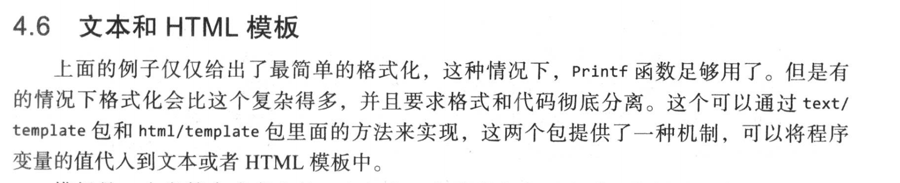
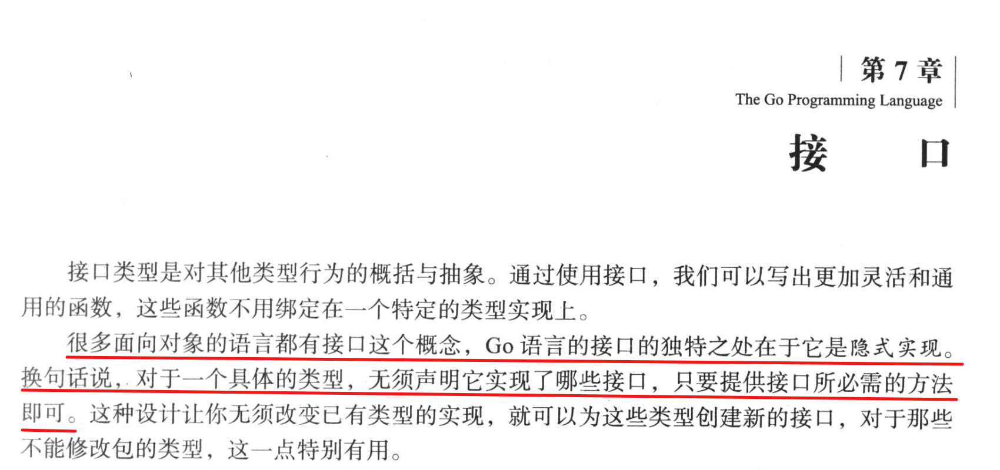

Go 程序设计语言 艾伦, 布莱恩

## 第一章 入门

go 语言中,map 是一个使用 make 创建的数据结构的引用


##### 所有的函数参数传递,都是值传递, 拷贝副本;  

如果传递的是指针,拷贝一个指针的值, 指针指向相同的地址, 同样可以达到引用修改的效果;

### 


在 Go 语言的 `fmt.Printf` 中，格式化占位符（如 `%d`、`%s`）的设计**直接继承自 C 语言的 `printf` 函数**，这些简写的命名规则源于早期编程语言的历史约定。以下是具体解释：

------

**一、核心简写的词源**

| 占位符 | 全称/来源                 | 示例                    | 设计逻辑                  |
| ------ | ------------------------- | ----------------------- | ------------------------- |
| `%d`   | **D**ecimal integer       | `%d` → 十进制整数       | "decimal" 的首字母 `d`    |
| `%s`   | **S**tring                | `%s` → 字符串           | "string" 的首字母 `s`     |
| `%f`   | **F**loating-point        | `%f` → 浮点数           | "float" 的首字母 `f`      |
| `%o`   | **O**ctal integer         | `%o` → 八进制整数       | "octal" 的首字母 `o`      |
| `%x`   | He**x**adecimal integer   | `%x` → 十六进制         | "hex" 的末尾字母 `x`      |
| `%c`   | **C**haracter             | `%c` → 单个字符         | "char" 的首字母 `c`       |
| `%p`   | **P**ointer address       | `%p` → 指针地址         | "pointer" 的首字母 `p`    |
| `%t`   | **T**ruth value (boolean) | `%t` → 布尔值           | "truth" 的首字母 `t`      |
| `%e`   | **E**xponential notation  | `%e` → 科学计数法       | "exponent" 的首字母 `e`   |
| `%g`   | **G**eneral float         | `%g` → 自动选择浮点格式 | 可能是 "general" 的首字母 |

**二、历史背景**

1. **C 语言的遗产**
   Go 的格式化占位符体系直接沿用了 C 语言 `printf` 的规范，目的是**降低学习成本**并保持与旧系统的兼容性。
   - 例如：`%d` 在 1972 年的 C 语言规范中就已存在，用于表示十进制整数。

**三、Go 特有的扩展**

| 占位符 | 功能           | 词源              |
| ------ | -------------- | ----------------- |
| `%v`   | 值的默认格式   | **V**alue         |
| `%T`   | 类型名称       | **T**ype          |
| `%b`   | 二进制格式     | **B**inary        |
| `%q`   | 带引号的字符串 | **Q**uoted string |
| `%U`   | Unicode 格式   | **U**nicode       |


##### Printf 转义字符:

%d 整数
%f  浮点数
%t 布尔值
%s 字符串
%v 值
%T 类型

## 第二章 程序结构


#### 名称:


##### 		推荐使用驼峰命名

#### 声明:

#### 短变量声明:

:=


```go
var user User
user,error := getUser()

// 短变量声明 := 左边可以声明多个变量,如果在局部变量中,已存在同名的变量,则只赋值,不声明新的同名变量;
// 但是:=左边也必须声明新的变量声明才能使用短变量声明


```


#### new 函数


#### 多重赋值:


##### 	互换两个变量的值

#### 可赋值性


#### 类型的声明:


##### 要比较两个变量 , 需要它俩都是相同的底层类型, 

命名类型 与 非命名类型比较 需要底层是相同的数据类型

命名类型 与 命名类型比较 智能相同的命名类型之间比较, 即使是底层数据类型相同也会编译报错: 类型不匹配 


#### chatgpt :包

go 语言的包,和 php 的命名空间,和 java 的 package,都存在哪些区别?

Chatgpt

Go 语言的包（package）、PHP 的命名空间（namespace）和 Java 的包（package）在管理代码组织和命名上有一些明显的区别。以下是它们的一些主要区别：

Go 语言的包（package）

1. 定义方式：
   - Go 使用 package 关键字定义包。
   - 包名一般是小写的单词。

2. 作用：
   - 用于组织代码和防止命名冲突。
   - 每个 Go 文件必须声明其所属的包，包名为文件的第一行代码。

3. 导入包：
   - 使用 import 关键字导入包。
   - 导入的包名可以使用别名。

4. 文件组织：
   - 一个目录只能包含一个包，目录名通常就是包名。

5. 访问权限：
   - 包内的标识符（变量、函数、类型等）如果以大写字母开头，则可以被其他包访问（公共）；以小写字母开头则只能在包内访问（私有）。

PHP 的命名空间（namespace）

1. **定义方式**：
   - 使用 `namespace` 关键字定义命名空间。
   - 命名空间名可以包含多个层级，用反斜杠 `\` 分隔。

2. **作用**：
   - 用于组织代码和防止命名冲突，特别是当多个库或框架在同一项目中使用时。

3. **导入命名空间**：
   - 使用 `use` 关键字导入命名空间或命名空间中的类、函数、常量等。

4. **文件组织**：
   - 命名空间不依赖文件系统的目录结构，可以在同一个文件中定义多个命名空间。

5. **访问权限**：
   - PHP 没有通过命名空间直接控制访问权限的机制，访问权限通过类的可见性（public、protected、private）控制。

Java 的包（package）

1. **定义方式**：
   - 使用 `package` 关键字定义包。
   - 包名通常是由域名反转加上项目名和模块名组成（如 `com.example.myproject`）。

2. **作用**：
   - 用于组织代码和防止命名冲突。
   - Java 类文件的第一行必须声明其所属的包。

3. **导入包**：
   - 使用 `import` 关键字导入包。
   - 可以使用通配符 `*` 导入包中的所有类。

4. **文件组织**：
   - 包的层级结构与文件系统的目录结构直接对应，包名与目录结构一致。

5. **访问权限**：
   - Java 提供四种访问级别（public、protected、default、private），其中 `default`（包私有）使得类和成员只能在同一包内访问。

总结

- **组织方式**：
  - Go 和 Java 的包在定义时都使用 `package` 关键字，而 PHP 使用 `namespace` 关键字。
  - Go 和 Java 都要求包的层级结构与文件系统的目录结构一致，而 PHP 的命名空间不依赖于文件结构。

- **导入方式**：
  - Go 使用 `import` 关键字导入包，允许别名。
  - PHP 使用 `use` 关键字导入命名空间或其成员。
  - Java 使用 `import` 关键字导入包，可以使用通配符。

- **访问权限**：
  - Go 通过标识符的大小写来控制访问权限。
  - PHP 通过类的可见性来控制访问权限。
  - Java 通过访问修饰符（public、protected、default、private）来控制访问权限。

这些机制在各自语言中都有助于实现代码的模块化、组织化和命名冲突的避免，但具体实现和用法有显著差异。


#### 包和文件:

按照约定,包名匹配导入路径的最后一段,这样可以方便的预测gopl.io/ch2/tempconv 的包名叫tempconv


#### 作用域


##### 代码块中声明的变量,它的作用域 ,仅在代码块中; 


##### 	局部声明一个变量 , 可以与全局存在的变量同名, 但会使局部优先使用局部自身的变量 ,而不会去使用全局变量;

##### 	 如果要使用全局变量 , 在局部中不使用短变量声明 , 直接赋值;


## 第三章 基本数据


##### 基础类型, 聚合类型 ,  引用类型 , 接口类型

#### 整数


int8    int16    int32    int64
uint8  uint16  uint32  uint64

1个字节  到  8 个字节

#### 运算符


int16 无法与 int32 进行运算和比较

int32 无法与 int 进行运算和比较


#### 浮点数


#### 复数:


#### 布尔值


#### 字符串


#### 字符串字面量


#### 原生的字符串字面量


#### Unicode

#### rune


UTF-8 编码是谁发明的?GO 语言又是谁发明的?

Chatgpt:

UTF-8 编码由肯·汤普逊（Ken Thompson）和罗布·派克（Rob Pike）于 1992 年发明。UTF-8 是一种针对 Unicode 的可变长度字符编码，旨在向后兼容 ASCII 并有效地编码多字节字符。

Go 语言（也称为 Golang）是由谷歌（Google）开发的，主要设计者是罗布·派克（Rob Pike）、肯·汤普逊（Ken Thompson）和罗伯特·格里斯莫（Robert Griesemer）。Go 语言的设计工作始于 2007 年，首次发布于 2009 年。


#### 常量


#### 无类型常量


## 第四章 复合数据类型


#### 数组


##### 如果一个数组的元素是可比较的,那这个数组也是可比较的


#### Slice 切片


##### 切片操作数, 左边包含, 右边不包含


##### slice 切片不能相互作对比


#### append


##### 切片底层的数组不足时, 动态扩容

##### 和 Java ArrayList 很相似的动态扩容机制


#### slice 就地修改


#### Map 


##### map 的 key 必须是可比较的 , 在 map 中是唯一的


##### 循环 map 中的 key , 每一次都是无序随机的


##### map 和 slice 一样不可以相互比较, map 可以和 nil 做比较

y[k]=0   1


#### Struct 结构体


##### 结构体成员变量不能是它自己, 但可以是它自己类型的指针


```go
	p1 := Point{1, 2}
	p2 := Point{1, 2}

	fmt.Println(p1.X == p2.X && p1.Y == p2.Y)  //true
	fmt.Println(p1 == p2)    //true
```


```go
  p1 := Person{"1", 2}
	p2 := Person{"1", 2}

	fmt.Println(p1.Name == p2.Name && p1.Age == p2.Age) //true
	fmt.Println(p1 == p2)                               //true

	fmt.Printf("%v \n", p1)  // {1 2}
	// %#v  按照 go 语法输出变量的值
	fmt.Printf("%#v \n", p1) // main.Person{Name:"1", Age:2} 

	fmt.Printf("%p  %p \n", &p1, &p2) // 0xc0000125b8  0xc0000125d0
	fmt.Println(&p1 == &p2)           // false
```


**和其他可比较的类型一样, 可比较的结构体类型都可以作为 map 的键类型**


#### JSON


#### HTML 模板




## 第五章 函数

#### 函数


##### Go 没有默认参数值的概念


##### 实参是按值传递的, 所以函数接收到的是每个实参的副本, 所以推荐传递指针

#### 错误


#### 匿名函数


##### 匿名函数中会隐藏一些对外部变量的引用

#### 警告: 捕获迭代变量


##### 注意:迭代过程中, 函数对变量的隐式引用 , 应该避免引用到迭代语句的变量,;

迭代语句中的临时变量,值在随着迭代而变化, 将导致引用的数据都是迭代的最后一条数据

同样的情况有: 创建 goroutine 时


#### 变长函数


func sum(vals ...int) int{
}


#### 延迟函数调用


##### defer 在宕机的情况下将仍然执行


##### 延迟执行的函数在 return 语句之后执行, 因此能访问到函数 return 的变量


#### 宕机


#### 恢复


## 第六章 方法


##### 方法接受者不能是指针类型


##### 实参接受者, 是形参接受者的同一个类型(实例本体或指针)的就可以调用方法


##### **接收者类型可以是非 struct 类型**: 你可以为任意类型（包括内置类型）定义方法。例如，可以为 `int` 类型定义一个方法：

Go 语言允许为基本类型添加方法，但前提是你必须通过类型定义来实现。你不能直接为 Go 的内置基本类型（如 `int`、`string` 等）添加方法，但你可以通过定义一个新的类型来实现这一点。例如：

```go
type MyInt int

func (m MyInt) Double() int {
    return int(m * 2)
}
```


#### 通过结构体内嵌组成类型

#### 方法变量与表达式


##### 结构体的方法, 也可以命名为函数变量来直接使用,当然是与具体的某个实例或指针绑定的


##### 相当于静态引用,事先未绑定具体的某个实例或指针,等到调用的时候再传入

位向量


#### 封装


## 第七章 接口



##### go 语言中实现接口是隐式的

#### 接口即约定


空接口


#### 接口值


##### 属于某一接口的值 , 包含动态类型和动态值


```go
	var in io.Writer

	fmt.Printf("type= %T", in) //type= <nil>

	fmt.Printf("value= %v", in) //value= <nil>

```


##### 接口的值是可比较的,是比较它的动态类型和动态值


#### error 接口


#####  error 是一个接口类型, 有一个 Error() string 方法


##### 接口类型才能进行类型断言

因为除接口类型外的其他类型都是已经确定的类型

##### 将一个接口类型的值, 断言为另一个接口类型 T ,  如果断言检测成功 , 结果的类型为 接口类型T, (通常方法数量是增多)


## 第八章 goroutine 和通道


##### main 函数 return 时, 所有的 goroutine 都暴力的直接终结

##### 没有办法让一个 goroutine 来停止另一个 goroutine, 除了让 main 函数返回

killall java  终结所有的指定名字的进程(UNIX 系统)


#### 通道


##### 通道已被关闭 , 向它发送值会崩溃

##### 通道已被关闭 , 用它接收值, 将会获取到通道中值 , 当通道中没有值时 , 接收操作将得到通道类型对应的零值

```go
//1. 未初始化的通道
var ch chan int // 未初始化的通道，值为 nil

//2. 显式将通道设置为 nil
ch := make(chan int)
ch = nil // 通道显式设置为 nil

//1.	在 select 语句中禁用通道
//在 select 语句中，设置某个通道为 nil 可以有效地禁用与该通道相关的 case 分支，因为对 nil 通道的发送和接收操作会阻塞。这样可以动态地控制 select 语句的行为。
var ch1, ch2 chan int
ch1 = make(chan int)
ch2 = nil

select {
case val := <-ch1:
    fmt.Println("Received from ch1:", val)
case val := <-ch2: // 这个 case 永远不会执行
    fmt.Println("Received from ch2:", val)
default:
    fmt.Println("No activity")
}
```

##### 通道是 nil 的时候不能关闭通道 

##### 通道中有值和无值都可以关闭通道 

#### 无缓冲通道


##### 使用无缓冲通道 , 等于将操作发送和接收的两个 goroutine 同步化了, 他们会等待彼此


#### 有缓冲通道


##### 缓冲通道可用空间被放满的时候 , 发送操作将被阻塞等待, 直到通道中有可用空间的时候才会被唤醒; 

##### 相反,如果缓冲通道是空的 , 接收操作将被阻塞等待, 直到通道中有可用数据的时候才会被唤醒; 


##### goroutine 泄漏:  

##### goroutine 被阻塞在同步接收后者同步发送无缓冲通道, 此时主 goroutine 结束 , 导致阻塞的 goroutine 被卡死;


for ch_value := range  ch2 {

} 

**对通道进行 for range 循环, 循环会阻塞等待通道关闭**


##### 计数信号量

##### 为限制并发执行的 goroutine 的数量, 在指定容量的缓冲通道中, 通过发送数据来将令牌写入占位, 执行完后接收掉占位令牌,

#### select 多路复用


##### Select多路复用同时命中 , 会随机选择一个进入执行


##### 使用select多路复用接收通道, 可以避免被阻塞


##### 多路复用 select

1,如果没有 case , 比如 select{} 将一直阻塞;

2,多个 case 的情况, 唯一执行成功的,被命中; 如果有多个执行成功的,则随机命中其中一个 case;

**3, 可以设置 default : , 当没有执行成功的 case, 将可以执行默认操作或者灵活的退出**

**4,如果多路都阻塞 , 并且没有 default 的话, select 将阻塞等待**

多路复用, 是同时使用多个通道, 避免单个通道阻塞整个流程的好方法


##### 使用 range 从通道中取值,如果通道未关闭就会阻塞; 如果通道已被关闭,自动退出range循环

##### 使用显式的 value,ok :=  <-chan , 可以使用 ok 值判断通道是否关闭


通道的关闭:


#### 计数信号量


#### 如何取消 goroutine 


## 第九章 使用共享变量实现并发


#### 数据竞态


#### 互斥锁 sync.Mutex


读写互斥锁: sync.RWMutex


sync.RWMutex


#### 延迟初始化: sync.Once


#### 竞态检测器


##### 从通道读取数据 , 这个操作会一直阻塞到通道关闭 , 并得到零值


#### goroutine 与线程


##### 一个线程2MB , 一个协程 goroutine 2KB 的栈内存


#### GOMAXPROCS


#### goroutine 没有标识


## 第十章 包和工具


#### 导入声明


#### 包及其命名


#### 工作空间的组织


在Go语言中，GOARCH和GOOS分别表示目标处理器架构和操作系统。这两个变量控制了Go编译器生成的可执行文件的架构和操作系统类型。以下是常见的GOARCH和GOOS值：

**常见的 GOARCH 值 (目标处理器架构)**

​	•	amd64：64位的x86架构

​	•	386：32位的x86架构

​	•	arm：32位的ARM架构

​	•	arm64：64位的ARM架构

**常见的 GOOS 值 (目标操作系统)**

​	•	darwin：macOS操作系统

​	•	linux：Linux操作系统

​	•	windows：Windows操作系统

​	•	android：Android操作系统

​	•	ios：iOS操作系统 (需要使用 GOARCH=arm64)

这些值可以组合使用以生成针对不同平台的可执行文件。例如，如果你想编译一个在64位Linux系统上运行的Go程序，你可以设置环境变量 GOOS=linux 和 GOARCH=amd64。


#### 包的下载


go get 命令可以下载单一的包


#### 包的文档化


#### 内部包


## 第十一章 测试


#### go test 工具


#### Test 函数


#### 基准测试


#### 性能剖析


#### Example 函数


## 第十二章 反射


#### reflect.Type 和 reflect.Value


#### 使用 reflect.Value 来设置值


#### 注意事项


## 第十三章 低级编程


