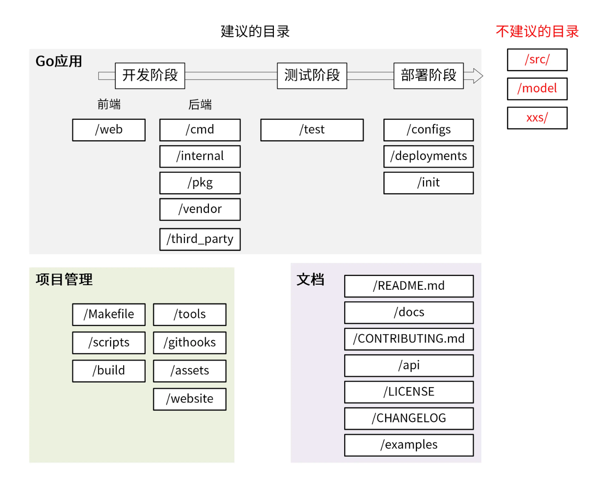

配置 go 开发环境

Linux 服务器申请
我们安装一个 CentOS 8.2 系统。

第一步，用 Root 用户登录 Linux 系统，并创建普通用户。

```shell
# useradd going # 创建 going 用户，通过 going 用户登录开发机进行开发
# passwd going # 设置密码
```

不仅如此，使用普通用户登录和操作开发机也可以保证系统的安全性，这是一个比较好的习惯，所以我们在日常开发中也要尽量避免使用 Root 用户。


第二步，添加 sudoers。
我们知道很多时候，普通用户也要用到 Root 的一些权限，但 Root 用户的密码一般是由系统管理员维护并定期更改的，每次都向管理员询问密码又很麻烦。因此，我建议你将普通用户加入到 sudoers 中，这样普通用户就可以通过 sudo 命令来暂时获取 Root 的权限。具体来说，你可以执行如下命令添加：

```shell
 # sed -i '/^root.*ALL=(ALL).*ALL/a\going\tALL=(ALL) \tALL' /etc/sudoers
```

第三步，用新的用户名（going）和密码登录 Linux 服务器。这一步也可以验证普通用户是否创建成功。

第四步，配置 $HOME/.bashrc 文件。

我们登录新服务器后的第一步就是配置 $HOME/.bashrc 文件，以使 Linux 登录 shell 更
加易用，例如配置 LANG 解决中文乱码，配置 PS1 可以避免整行都是文件路径，并将
$HOME/bin 加入到 PATH 路径中。配置后的内容如下：


### 目录结构





初始化项目


在控制台输入`go version`，若输出版本号则**安装成功**，如下：

```shell
go version
go version go1.13.1 linux/amd64
```


```
go mod init github.com/EDDYCJY/go-gin-example
```

