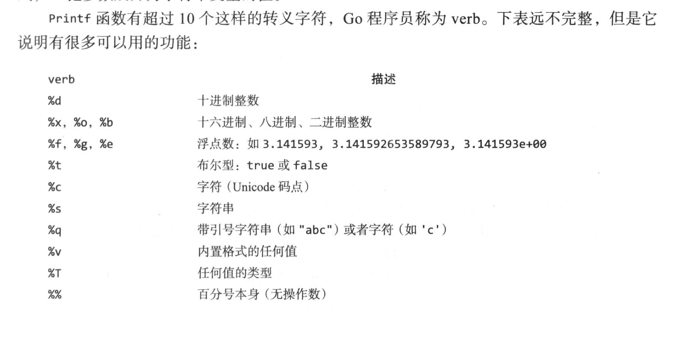

### 总览

所有的函数参数传递,都是值传递, 拷贝副本;  

Go 推荐使用驼峰命名

如果传递的是指针,拷贝一个指针的值, 指针指向相同的地址, 同样可以达到引用修改的效果;

Go 在语法上有着类 C 的感觉。如果你希望将两个（或更多）语句放在一行书写，它们必须用分号 (’;’) 分隔。一般情况下，你不需要分号。

Go 同其他语言不同的地方在于变量的类型在变量名的后面。不是：int a，而是 a int。

变量声明了没有使用, 也会发生编译错误

函数传参都是值拷贝 , 所以大多情况需要传递指针

Go 语言提供了, channel 通信通道 , 可以保障goroutine协程之间间通信(妙哉妙哉)

Go 语言提供了, 互斥锁和读写锁 , 可以保障goroutine协程运行安全 (数据竟态问题)

Go 语言提供了, 可直接使用的协程安全的 map , 和 Java (HasMap 线程安全版)类似 , 而基本类型（int32、uint32、int64、uint64）,提供了原子操作

go 语言中,map 是一个使用 make 创建的数据结构的引用, 因为当需要扩容时, 底层的地址会发生变化 , 所以 map 本身是一个引用, 用来隐藏底层地址的变化;


### 格式化占位符



在 Go 语言的 `fmt.Printf` 中，格式化占位符（如 `%d`、`%s`）的设计**直接继承自 C 语言的 `printf` 函数**，这些简写的命名规则源于早期编程语言的历史约定。以下是具体解释：

------

**一、核心简写的词源**

| 占位符 | 全称/来源                 | 示例                    | 设计逻辑                  |
| ------ | ------------------------- | ----------------------- | ------------------------- |
| `%d`   | **D**ecimal integer       | `%d` → 十进制整数       | "decimal" 的首字母 `d`    |
| `%s`   | **S**tring                | `%s` → 字符串           | "string" 的首字母 `s`     |
| `%f`   | **F**loating-point        | `%f` → 浮点数           | "float" 的首字母 `f`      |
| `%o`   | **O**ctal integer         | `%o` → 八进制整数       | "octal" 的首字母 `o`      |
| `%x`   | He**x**adecimal integer   | `%x` → 十六进制         | "hex" 的末尾字母 `x`      |
| `%c`   | **C**haracter             | `%c` → 单个字符         | "char" 的首字母 `c`       |
| `%p`   | **P**ointer address       | `%p` → 指针地址         | "pointer" 的首字母 `p`    |
| `%t`   | **T**ruth value (boolean) | `%t` → 布尔值           | "truth" 的首字母 `t`      |
| `%e`   | **E**xponential notation  | `%e` → 科学计数法       | "exponent" 的首字母 `e`   |
| `%g`   | **G**eneral float         | `%g` → 自动选择浮点格式 | 可能是 "general" 的首字母 |

---


### 变量

在函数内部，可以使用更简略的 `:=` 方式声明并初始化变量。

在外部, 例如 main.go 中 无法使用短变量声明 x:=1

变量声明以关键字`var`开头，变量类型放在变量的后面，行尾无需分号。 举个例子：

```go
var name string
var age int
var isOk bool
```

##### 短变量声明:

左边也必须声明新的变量声明才能使用短变量声明,;

左边可以声明多个变量,如果在局部变量中,已存在同名的变量,则只赋值,不声明新的同名变量;

```go
var user User
user,error := getUser()

// 短变量声明 := 左边可以声明多个变量,如果在局部变量中,已存在同名的变量,则只赋值,不声明新的同名变量;
// 但是 := 左边也必须声明新的变量声明才能使用短变量声明


```


---


### 常量

相对于变量，常量是恒定不变的值，多用于定义程序运行期间不会改变的那些值。 常量的声明和变量声明非常类似，只是把`var`换成了`const`，常量在定义的时候必须赋值。


`iota`是go语言的常量计数器，只能在常量的表达式中使用。

`iota`在const关键字出现时将被重置为0。const中每新增一行常量声明将使`iota`计数一次(iota可理解为const语句块中的行索引)。 使用iota能简化定义，在定义枚举时很有用。

举个例子：

```go
const (
		n1 = iota //0
		n2        //1
		n3        //2
		n4        //3
	)
```

几个常见的`iota`示例:

使用`_`跳过某些值

```go
const (
		n1 = iota //0
		n2        //1
		_
		n4        //3
	)
```

`iota`声明中间插队

```go
const (
		n1 = iota //0
		n2 = 100  //100
		n3 = iota //2
		n4        //3
	)
	const n5 = iota //0
```

定义数量级 （这里的`<<`表示左移操作，`1<<10`表示将1的二进制表示向左移10位，也就是由`1`变成了`10000000000`，也就是十进制的1024。同理`2<<2`表示将2的二进制表示向左移2位，也就是由`10`变成了`1000`，也就是十进制的8。）

```go
const (
		_  = iota
		KB = 1 << (10 * iota)
		MB = 1 << (10 * iota)
		GB = 1 << (10 * iota)
		TB = 1 << (10 * iota)
		PB = 1 << (10 * iota)
	)
```

多个`iota`定义在一行

```go
const (
		a, b = iota + 1, iota + 2 //1,2
		c, d                      //2,3
		e, f                      //3,4
	)
```

---


### 流程控制

for 循环

switch 流程


break 只跳出一层

continue 跳过当次循环

return 跳出所有,直接结束当前方法


for循环的初始语句可以被忽略，但是初始语句后的分号必须要写，例如：

```go
func forDemo2() {
	i := 0
	for ; i < 10; i++ {
		fmt.Println(i)
	}
}
```

for循环的初始语句和结束语句都可以省略，例如：

```go
func forDemo3() {
	i := 0
	for i < 10 {
		fmt.Println(i)
		i++
	}
}
```

这种写法类似于其他编程语言中的`while`，在`while`后添加一个条件表达式，满足条件表达式时持续循环，否则结束循环。

#### 无限循环

```go
for {
    循环体语句
}
```

for循环可以通过`break`、`goto`、`return`、`panic`语句强制退出循环。

#### for range(键值循环)

Go语言中可以使用`for range`遍历数组、切片、字符串、map 及通道（channel）。 通过`for range`遍历的返回值有以下规律：

1. 数组、切片、字符串返回索引和值。
2. map返回键和值。
3. 通道（channel）只返回通道内的值。

Go1.22版本开始支持 for range 整数。👉 [Go 1.22 Release Notes](https://go.dev/doc/go1.22)。

```go
for i := range 5 {
	fmt.Println(i)
}

for range 2 {
	fmt.Println("《Go语言之路》上市啦！")
}
```

输出：

```bash
0
1
2
3
4
《Go语言之路》上市啦！
《Go语言之路》上市啦！
```


#### switch

`fallthrough`语法可以执行满足条件的case的下一个case，是为了兼容C语言中的case设计的。

```go
func switchDemo5() {
	s := "a"
	switch {
	case s == "a":
		fmt.Println("a")
		fallthrough
	case s == "b":
		fmt.Println("b")
	case s == "c":
		fmt.Println("c")
	default:
		fmt.Println("...")
	}
}
```

输出：

```bash
a
b
```

---


### 基本类型

Go语言中有丰富的数据类型，除了基本的整型、浮点型、布尔型、字符串外， 还有数组、切片、结构体、函数、map、通道（channel）等。Go 语言的基本类型和其他语言大同小异。

#### 整型:

int8    int16    int32    int64
uint8  uint16  uint32  uint64

1个字节  到  8 个字节

go 中的方法入参变量是否可以设置为 int 类型 , 如果设置为 int 类型, 那么传入的变量类型可以是哪些? 

在 Go 语言中，方法的入参变量可以设置为 int 类型。int 是一个平台相关的类型，其大小依赖于当前操作系统架构：

​	•	在 32 位系统上，int 是 int32。

​	•	在 64 位系统上，int 是 int64。

**传入的变量类型**

当你定义一个方法的入参为 int 时，传入的变量必须是 int 类型（或者是一个可以隐式转换为 int 的类型）。如果你试图传递其他整数类型（例如 int32 或 int64），Go 会尝试进行类型转换。如果类型不匹配且无法自动转换，编译器会报错。

1. **`int` 参数**：
   - 可接受 `int` 类型变量
   - 其他类型需显式转换
   - 编译时通过 `GOARCH` 控制位数
2. **短声明变量**：
   - 默认为 `int`
   - 传递到不同位数函数需显式转换
3. **工程建议**：
   - 关键路径避免依赖 `int` 的位数
   - 协议/存储相关场景强制使用 `int32`/`int64`

通过遵循这些规则，可以确保代码在不同平台下的类型安全性和一致性。


#### 浮点型:

float32    float64


#### map

go 语言中,map 是一个使用 make 创建的数据结构的引用, 因为当需要扩容时, 底层的地址会发生变化 , 所以 map 本身是一个引用, 用来隐藏底层地址的变化;


#### byte和rune类型

组成每个字符串的元素叫做“字符”，可以通过遍历或者单个获取字符串元素获得字符。 字符用单引号（’）包裹起来，如：

```go
var a = '中'
var b = 'x'
```

Go 语言的字符有以下两种：

1. `uint8`类型，或者叫 byte 型，代表一个`ASCII码`字符。
2. `rune`类型，代表一个 `UTF-8字符`。

当需要处理中文、日文或者其他复合字符时，则需要用到`rune`类型。`rune`类型实际是一个`int32`。

Go 使用了特殊的 rune 类型来处理 Unicode，让基于 Unicode 的文本处理更为方便，也可以使用 byte 型进行默认字符串处理，性能和扩展性都有照顾。

```go
// 遍历字符串
func traversalString() {
	s := "hello沙河"
	for i := 0; i < len(s); i++ { //byte
		fmt.Printf("%v(%c) ", s[i], s[i])
	}
	fmt.Println()
	for _, r := range s { //rune
		fmt.Printf("%v(%c) ", r, r)
	}
	fmt.Println()
}
```

输出：

```bash
104(h) 101(e) 108(l) 108(l) 111(o) 230(æ) 178(²) 153() 230(æ) 178(²) 179(³) 
104(h) 101(e) 108(l) 108(l) 111(o) 27801(沙) 27827(河) 
```

因为UTF8编码下一个中文汉字由3~4个字节组成，所以我们不能简单的按照字节去遍历一个包含中文的字符串，否则就会出现上面输出中第一行的结果。

字符串底层是一个byte数组，所以可以和`[]byte`类型相互转换。字符串是不能修改的 字符串是由byte字节组成，所以字符串的长度是byte字节的长度。 rune类型用来表示utf8字符，一个rune字符由一个或多个byte组成。

底层:

```go
// rune is an alias for int32 and is equivalent to int32 in all ways. It is
// used, by convention, to distinguish character values from integer values.
type rune = int32
```


#### 修改字符串

要修改字符串，需要先将其转换成`[]rune`或`[]byte`，完成后再转换为`string`。无论哪种转换，都会重新分配内存，并复制字节数组。

```go
func changeString() {
	s1 := "big"
	// 强制类型转换
	byteS1 := []byte(s1)
	byteS1[0] = 'p'
	fmt.Println(string(byteS1))

	s2 := "白萝卜"
	runeS2 := []rune(s2)
	runeS2[0] = '红'
	fmt.Println(string(runeS2))
}
```

---


### 数组

GO的数组是基本类型，不是引用类型；

数组是同一种数据类型元素的集合。 在Go语言中，数组从声明时就确定，使用时可以修改数组成员，但是数组大小不可变化。

#### **数组的定义**

比如：`var a [5]int`， 数组的长度必须是常量，并且长度是数组类型的一部分。一旦定义，长度不能变。 `[5]int`和`[10]int`是不同的类型。

#### **声明数组和声明切片要注意**：

```go
//声明切片，无需指定长度
var s []int
//声明数组，必须指明长度
var a [3]int 
fmt.Printf("%T",s)
fmt.Println("")
fmt.Printf("%T",a)
```

```go
var a [3]int
fmt.println(a)
```

***

### 切片（Slice）

切片是一个拥有相同类型元素的可变长度的序列。它是基于数组类型做的一层封装。它非常灵活，支持自动扩容。
切片是一个引用类型，它的内部结构包含`地址`、`长度`和`容量`。切片一般用于快速地操作一块数据集合。

#### 切片的赋值拷贝

下面的代码中演示了拷贝前后两个变量共享底层数组，对一个切片的修改会影响另一个切片的内容，这点需要特别注意。

```go
func main() {
	s1 := make([]int, 3) //[0 0 0]
	s2 := s1             //将s1直接赋值给s2，s1和s2共用一个底层数组
	s2[0] = 100
	fmt.Println(s1) //[100 0 0]
	fmt.Println(s2) //[100 0 0]
}
```

#### 切片的扩容策略

可以通过查看`$GOROOT/src/runtime/slice.go`源码，其中扩容相关代码如下：

```go
newcap := old.cap
doublecap := newcap + newcap
if cap > doublecap {
	newcap = cap
} else {
	if old.len < 1024 {
		newcap = doublecap
	} else {
		// Check 0 < newcap to detect overflow
		// and prevent an infinite loop.
		for 0 < newcap && newcap < cap {
			newcap += newcap / 4
		}
		// Set newcap to the requested cap when
		// the newcap calculation overflowed.
		if newcap <= 0 {
			newcap = cap
		}
	}
}
```

从上面的代码可以看出以下内容：

- 首先判断，如果新申请容量（cap）大于2倍的旧容量（old.cap），最终容量（newcap）就是新申请的容量（cap）。
- 否则判断，如果旧切片的长度小于1024，则最终容量(newcap)就是旧容量(old.cap)的两倍，即（newcap=doublecap），
- 否则判断，如果旧切片长度大于等于1024，则最终容量（newcap）从旧容量（old.cap）开始循环增加原来的1/4，即（newcap=old.cap,for {newcap += newcap/4}）直到最终容量（newcap）大于等于新申请的容量(cap)，即（newcap >= cap）
- 如果最终容量（cap）计算值溢出，则最终容量（cap）就是新申请容量（cap）。

需要注意的是，切片扩容还会根据切片中元素的类型不同而做不同的处理，比如`int`和`string`类型的处理方式就不一样。使用copy()函数复制切片

首先我们来看一个问题：

```go
func main() {
	a := []int{1, 2, 3, 4, 5}
	b := a
	fmt.Println(a) //[1 2 3 4 5]
	fmt.Println(b) //[1 2 3 4 5]
	b[0] = 1000
	fmt.Println(a) //[1000 2 3 4 5]
	fmt.Println(b) //[1000 2 3 4 5]
}
```

由于切片是引用类型，所以a和b其实都指向了同一块内存地址。修改b的同时a的值也会发生变化。

Go语言内建的`copy()`函数可以迅速地将一个切片的数据复制到另外一个切片空间中，`copy()`函数的使用格式如下：

```bash
copy(destSlice, srcSlice []T)
```

其中：

- srcSlice: 数据来源切片
- destSlice: 目标切片

举个例子：

```go
func main() {
	// copy()复制切片
	a := []int{1, 2, 3, 4, 5}
	c := make([]int, 5, 5)
	copy(c, a)     //使用copy()函数将切片a中的元素复制到切片c
	fmt.Println(a) //[1 2 3 4 5]
	fmt.Println(c) //[1 2 3 4 5]
	c[0] = 1000
	fmt.Println(a) //[1 2 3 4 5]
	fmt.Println(c) //[1000 2 3 4 5]
}
```

---

### map


go 语言中,map 是一个使用 make 创建的数据结构的引用


map是一种无序的基于`key-value`的数据结构，Go语言中的map是引用类型，必须初始化才能使用。
map类型的变量默认初始值为nil，需要使用make()函数来分配内存。语法为：

```go
make(map[KeyType]ValueType, [cap])
```

#### 判断某个键是否存在

Go语言中有个判断map中键是否存在的特殊写法，格式如下:

```go
value, ok := map[key]
```

举个例子：

```go
func main() {
	scoreMap := make(map[string]int)
	scoreMap["张三"] = 90
	scoreMap["小明"] = 100
	// 如果key存在ok为true,v为对应的值；不存在ok为false,v为值类型的零值
	v, ok := scoreMap["张三"]
	if ok {
		fmt.Println(v)
	} else {
		fmt.Println("查无此人")
	}
}
```

---

### 函数

Go语言中支持函数、匿名函数和闭包，并且函数在Go语言中属于“一等公民”。

**defer**  延迟执行
go语言函数的return，分为两个步骤1，将返回值付给ret ； 2，return ret 。defer 执行的实际是在1和2之间

**函数类型**：根据入参和返回值分为不同的类型

**匿名函数**

#### **闭包**

闭包指的是一个函数和与其相关的引用环境组合而成的实体。简单来说，`闭包=函数+引用环境`。 首先我们来看一个例子：

```go
func adder() func(int) int {
	var x int
	return func(y int) int {
		x += y
		return x
	}
}
func main() {
	var f = adder()
	fmt.Println(f(10)) //10
	fmt.Println(f(20)) //30
	fmt.Println(f(30)) //60

	f1 := adder()
	fmt.Println(f1(40)) //40
	fmt.Println(f1(50)) //90
}
```

变量`f`是一个函数并且它引用了其外部作用域中的`x`变量，此时`f`就是一个闭包。 在`f`的生命周期内，变量`x`也一直有效。 闭包进阶示例1：

```go
func adder2(x int) func(int) int {
	return func(y int) int {
		x += y
		return x
	}
}
func main() {
	var f = adder2(10)
	fmt.Println(f(10)) //20
	fmt.Println(f(20)) //40
	fmt.Println(f(30)) //70	

	f1 := adder2(20)
	fmt.Println(f1(40)) //60
	fmt.Println(f1(50)) //110
}
```

---

### **指针**

指针本身是一个变量，它也有自己用于存放值的内存地址，而它的值为指向目标的内存地址值

区别于C/C++中的指针，Go语言中的指针不能进行偏移和运算，是安全指针。
要搞明白Go语言中的指针需要先知道3个概念：指针地址、指针类型和指针取值。


```go
func main() {
   var a int
   a = 100
   b := &a
   fmt.Printf("type a:%T type b:%T\n", a, b)
   // 将a的十六进制内存地址打印出来
   fmt.Printf("%p\n", &a)
   fmt.Printf("%p\n", b) // b的值
   fmt.Printf("%v\n", b)
   fmt.Printf("%p\n", &b) // b的内存地址
}
```

#### go语言中函数传参数永远传的是拷贝

```go
//go语言中函数传参数永远传的是拷贝
func f(x person) {
	x.gender = "女" // 修改的是副本的gender
}
func f2(x *person) {
	// (*x).gender = "女" // 根据内存地址找到那个原变量,修改的就是原来的变量
	x.gender = "女" // 语法糖,自动根据指针找对应的变量
}
func main() {
	var p person
	p.name = "周林"
	p.gender = "男"
	f(p)
	fmt.Println(p.gender) // 男
	f2(&p)                // ox1241ac3
	fmt.Println(p.gender) // 女
}
```


#### new

new是一个内置的函数，它的函数签名如下：

```go
func new(Type) *Type
```

其中，

- Type表示类型，new函数只接受一个参数，这个参数是一个类型
- *Type表示类型指针，new函数返回一个指向该类型内存地址的指针。

new函数不太常用，使用new函数得到的是一个类型的指针，并且该指针对应的值为该类型的零值。举个例子：

```go
func main() {
	a := new(int)
	b := new(bool)
	fmt.Printf("%T\n", a) // *int
	fmt.Printf("%T\n", b) // *bool
	fmt.Println(*a)       // 0
	fmt.Println(*b)       // false
}	
```

本节开始的示例代码中`var a *int`只是声明了一个指针变量a但是没有初始化，指针作为引用类型需要初始化后才会拥有内存空间，才可以给它赋值。应该按照如下方式使用内置的new函数对a进行初始化之后就可以正常对其赋值了：

```go
func main() {
	var a *int
	a = new(int)
	*a = 10
	fmt.Println(*a)
}
```

#### make

make也是用于内存分配的，区别于new，它只用于slice、map以及channel的内存创建，而且它返回的类型就是这三个类型本身，而不是他们的指针类型，因为这三种类型就是引用类型，所以就没有必要返回他们的指针了。make函数的函数签名如下：

```go
func make(t Type, size ...IntegerType) Type
```

make函数是无可替代的，我们在使用slice、map以及channel的时候，都需要使用make进行初始化，然后才可以对它们进行操作。这个我们在上一章中都有说明，关于channel我们会在后续的章节详细说明。

本节开始的示例中`var b map[string]int`只是声明变量b是一个map类型的变量，需要像下面的示例代码一样使用make函数进行初始化操作之后，才能对其进行键值对赋值：

```go
func main() {
	var b map[string]int
	b = make(map[string]int, 10)
	b["沙河娜扎"] = 100
	fmt.Println(b)
}
```

#### new与make的区别

1. 二者都是用来做内存分配的。
2. make只用于slice、map以及channel的初始化，返回的还是这三个引用类型本身；
3. 而new用于类型的内存分配，并且内存对应的值为类型零值，返回的是指向类型的指针。

---

### 