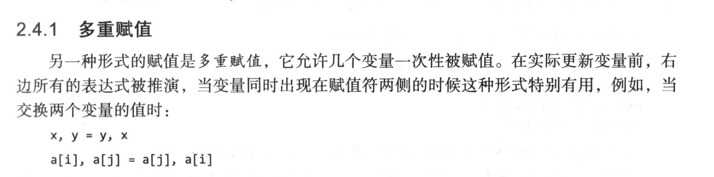
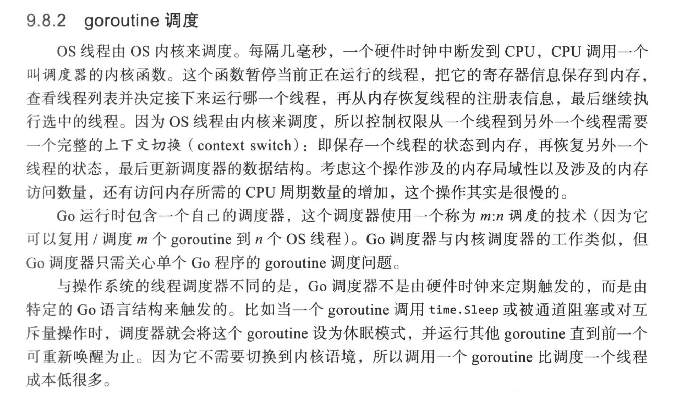

## 基础


### 总览

所有的函数参数传递,都是值传递, 拷贝副本;  

Go 推荐使用驼峰命名

如果传递的是指针,拷贝一个指针的值, 指针指向相同的地址, 同样可以达到引用修改的效果;

Go 在语法上有着类 C 的感觉。如果你希望将两个（或更多）语句放在一行书写，它们必须用分号 (’;’) 分隔。一般情况下，你不需要分号。

Go 同其他语言不同的地方在于变量的类型在变量名的后面。不是：int a，而是 a int。

变量声明了没有使用, 也会发生编译错误

函数传参都是值拷贝 , 所以大多情况需要传递指针

Go 语言提供了, channel 通信通道 , 可以保障goroutine协程之间间通信(妙哉妙哉)

Go 语言提供了, 互斥锁和读写锁 , 可以保障goroutine协程运行安全 (数据竟态问题)

Go 语言提供了, 可直接使用的协程安全的 map , 和 Java (HasMap 线程安全版)类似 , 而基本类型（int32、uint32、int64、uint64）,提供了原子操作

go 语言中,map 是一个使用 make 创建的数据结构的引用, 因为当需要扩容时, 底层的地址会发生变化 , 所以 map 本身是一个引用, 用来隐藏底层地址的变化;


#### 格式化占位符


在 Go 语言的 `fmt.Printf` 中，格式化占位符（如 `%d`、`%s`）的设计**直接继承自 C 语言的 `printf` 函数**，这些简写的命名规则源于早期编程语言的历史约定。以下是具体解释：

------

**一、核心简写的词源**

| 占位符 | 全称/来源                 | 示例                    | 设计逻辑                  |
| ------ | ------------------------- | ----------------------- | ------------------------- |
| `%d`   | **D**ecimal integer       | `%d` → 十进制整数       | "decimal" 的首字母 `d`    |
| `%s`   | **S**tring                | `%s` → 字符串           | "string" 的首字母 `s`     |
| `%f`   | **F**loating-point        | `%f` → 浮点数           | "float" 的首字母 `f`      |
| `%o`   | **O**ctal integer         | `%o` → 八进制整数       | "octal" 的首字母 `o`      |
| `%x`   | He**x**adecimal integer   | `%x` → 十六进制         | "hex" 的末尾字母 `x`      |
| `%c`   | **C**haracter             | `%c` → 单个字符         | "char" 的首字母 `c`       |
| `%p`   | **P**ointer address       | `%p` → 指针地址         | "pointer" 的首字母 `p`    |
| `%t`   | **T**ruth value (boolean) | `%t` → 布尔值           | "truth" 的首字母 `t`      |
| `%e`   | **E**xponential notation  | `%e` → 科学计数法       | "exponent" 的首字母 `e`   |
| `%g`   | **G**eneral float         | `%g` → 自动选择浮点格式 | 可能是 "general" 的首字母 |

---


### 变量

在函数内部，可以使用更简略的 `:=` 方式声明并初始化变量。

在外部, 例如 main.go 中 无法使用短变量声明 x:=1

变量声明以关键字`var`开头，变量类型放在变量的后面，行尾无需分号。 举个例子：

```go
var name string
var age int
var isOk bool
```

#### 短变量声明:

左边也必须声明新的变量声明才能使用短变量声明,;

左边可以声明多个变量,如果在局部变量中,已存在同名的变量,则只赋值,不声明新的同名变量;

```go
var user User
user,error := getUser()

// 短变量声明 := 左边可以声明多个变量,如果在局部变量中,已存在同名的变量,则只赋值,不声明新的同名变量;
// 但是 := 左边也必须声明新的变量声明才能使用短变量声明


```

---


#### 多重赋值:



互换两个变量的值


可赋值性


---


### 常量

相对于变量，常量是恒定不变的值，多用于定义程序运行期间不会改变的那些值。 常量的声明和变量声明非常类似，只是把`var`换成了`const`，常量在定义的时候必须赋值。


`iota`是go语言的常量计数器，只能在常量的表达式中使用。

`iota`在const关键字出现时将被重置为0。const中每新增一行常量声明将使`iota`计数一次(iota可理解为const语句块中的行索引)。 使用iota能简化定义，在定义枚举时很有用。

举个例子：

```go
const (
		n1 = iota //0
		n2        //1
		n3        //2
		n4        //3
	)
```

几个常见的`iota`示例:

使用`_`跳过某些值

```go
const (
		n1 = iota //0
		n2        //1
		_
		n4        //3
	)
```

`iota`声明中间插队

```go
const (
		n1 = iota //0
		n2 = 100  //100
		n3 = iota //2
		n4        //3
	)
	const n5 = iota //0
```

定义数量级 （这里的`<<`表示左移操作，`1<<10`表示将1的二进制表示向左移10位，也就是由`1`变成了`10000000000`，也就是十进制的1024。同理`2<<2`表示将2的二进制表示向左移2位，也就是由`10`变成了`1000`，也就是十进制的8。）

```go
const (
		_  = iota
		KB = 1 << (10 * iota)
		MB = 1 << (10 * iota)
		GB = 1 << (10 * iota)
		TB = 1 << (10 * iota)
		PB = 1 << (10 * iota)
	)
```

多个`iota`定义在一行

```go
const (
		a, b = iota + 1, iota + 2 //1,2
		c, d                      //2,3
		e, f                      //3,4
	)
```


#### 类型的声明:


##### 要比较两个变量 , 需要它俩都是相同的底层类型, 

命名类型 与 非命名类型比较 需要底层是相同的数据类型

命名类型 与 命名类型比较 智能相同的命名类型之间比较, 即使是底层数据类型相同也会编译报错: 类型不匹配 

---


#### 作用域


##### 代码块中声明的变量,它的作用域 ,仅在代码块中; 


##### 	局部声明一个变量 , 可以与全局存在的变量同名, 但会使局部优先使用局部自身的变量 ,而不会去使用全局变量;

##### 	 如果要使用全局变量 , 在局部中不使用声明 , 直接赋值;


---

### 流程控制

for 循环

switch 流程


break 只跳出一层

continue 跳过当次循环

return 跳出所有,直接结束当前方法


for循环的初始语句可以被忽略，但是初始语句后的分号必须要写，例如：

```go
func forDemo2() {
	i := 0
	for ; i < 10; i++ {
		fmt.Println(i)
	}
}
```

for循环的初始语句和结束语句都可以省略，例如：

```go
func forDemo3() {
	i := 0
	for i < 10 {
		fmt.Println(i)
		i++
	}
}
```

这种写法类似于其他编程语言中的`while`，在`while`后添加一个条件表达式，满足条件表达式时持续循环，否则结束循环。

#### 无限循环

```go
for {
    循环体语句
}
```

for循环可以通过`break`、`goto`、`return`、`panic`语句强制退出循环。

#### for range(键值循环)

Go语言中可以使用`for range`遍历数组、切片、字符串、map 及通道（channel）。 通过`for range`遍历的返回值有以下规律：

1. 数组、切片、字符串返回索引和值。
2. map返回键和值。
3. 通道（channel）只返回通道内的值。

Go1.22版本开始支持 for range 整数。👉 [Go 1.22 Release Notes](https://go.dev/doc/go1.22)。

```go
for i := range 5 {
	fmt.Println(i)
}

for range 2 {
	fmt.Println("《Go语言之路》上市啦！")
}
```

输出：

```bash
0
1
2
3
4
《Go语言之路》上市啦！
《Go语言之路》上市啦！
```


#### switch

`fallthrough`语法可以执行满足条件的case的下一个case，是为了兼容C语言中的case设计的。

```go
func switchDemo5() {
	s := "a"
	switch {
	case s == "a":
		fmt.Println("a")
		fallthrough
	case s == "b":
		fmt.Println("b")
	case s == "c":
		fmt.Println("c")
	default:
		fmt.Println("...")
	}
}
```

输出：

```bash
a
b
```

---


### 基本类型

Go语言中有丰富的数据类型，除了基本的整型、浮点型、布尔型、字符串外， 还有数组、切片、结构体、函数、map、通道（channel）等。Go 语言的基本类型和其他语言大同小异。

#### 整型:

int8    int16    int32    int64
uint8  uint16  uint32  uint64

1个字节  到  8 个字节

go 中的方法入参变量是否可以设置为 int 类型 , 如果设置为 int 类型, 那么传入的变量类型可以是哪些? 

在 Go 语言中，方法的入参变量可以设置为 int 类型。int 是一个平台相关的类型，其大小依赖于当前操作系统架构：

​	•	在 32 位系统上，int 是 int32。

​	•	在 64 位系统上，int 是 int64。

**传入的变量类型**

当你定义一个方法的入参为 int 时，传入的变量必须是 int 类型（或者是一个可以隐式转换为 int 的类型）。如果你试图传递其他整数类型（例如 int32 或 int64），Go 会尝试进行类型转换。如果类型不匹配且无法自动转换，编译器会报错。

1. **`int` 参数**：
   - 可接受 `int` 类型变量
   - 其他类型需显式转换
   - 编译时通过 `GOARCH` 控制位数
2. **短声明变量**：
   - 默认为 `int`
   - 传递到不同位数函数需显式转换
3. **工程建议**：
   - 关键路径避免依赖 `int` 的位数
   - 协议/存储相关场景强制使用 `int32`/`int64`

通过遵循这些规则，可以确保代码在不同平台下的类型安全性和一致性。


#### 浮点型:

float32    float64


#### 字符串


##### 字符串字面量


##### 原生的字符串字面量


##### Unicode

#### rune


UTF-8 编码是谁发明的?GO 语言又是谁发明的?

Chatgpt:

UTF-8 编码由肯·汤普逊（Ken Thompson）和罗布·派克（Rob Pike）于 1992 年发明。UTF-8 是一种针对 Unicode 的可变长度字符编码，旨在向后兼容 ASCII 并有效地编码多字节字符。

Go 语言（也称为 Golang）是由谷歌（Google）开发的，主要设计者是罗布·派克（Rob Pike）、肯·汤普逊（Ken Thompson）和罗伯特·格里斯莫（Robert Griesemer）。Go 语言的设计工作始于 2007 年，首次发布于 2009 年。


#### byte和rune类型

组成每个字符串的元素叫做“字符”，可以通过遍历或者单个获取字符串元素获得字符。 字符用单引号（’）包裹起来，如：

```go
var a = '中'
var b = 'x'
```

Go 语言的字符有以下两种：

1. `uint8`类型，或者叫 byte 型，代表一个`ASCII码`字符。
2. `rune`类型，代表一个 `UTF-8字符`。

当需要处理中文、日文或者其他复合字符时，则需要用到`rune`类型。`rune`类型实际是一个`int32`。

Go 使用了特殊的 rune 类型来处理 Unicode，让基于 Unicode 的文本处理更为方便，也可以使用 byte 型进行默认字符串处理，性能和扩展性都有照顾。

```go
// 遍历字符串
func traversalString() {
	s := "hello沙河"
	for i := 0; i < len(s); i++ { //byte
		fmt.Printf("%v(%c) ", s[i], s[i])
	}
	fmt.Println()
	for _, r := range s { //rune
		fmt.Printf("%v(%c) ", r, r)
	}
	fmt.Println()
}
```

输出：

```bash
104(h) 101(e) 108(l) 108(l) 111(o) 230(æ) 178(²) 153() 230(æ) 178(²) 179(³) 
104(h) 101(e) 108(l) 108(l) 111(o) 27801(沙) 27827(河) 
```

因为UTF8编码下一个中文汉字由3~4个字节组成，所以我们不能简单的按照字节去遍历一个包含中文的字符串，否则就会出现上面输出中第一行的结果。

字符串底层是一个byte数组，所以可以和`[]byte`类型相互转换。字符串是不能修改的 字符串是由byte字节组成，所以字符串的长度是byte字节的长度。 rune类型用来表示utf8字符，一个rune字符由一个或多个byte组成。

底层:

```go
// rune is an alias for int32 and is equivalent to int32 in all ways. It is
// used, by convention, to distinguish character values from integer values.
type rune = int32
```


#### 修改字符串

要修改字符串，需要先将其转换成`[]rune`或`[]byte`，完成后再转换为`string`。无论哪种转换，都会重新分配内存，并复制字节数组。

```go
func changeString() {
	s1 := "big"
	// 强制类型转换
	byteS1 := []byte(s1)
	byteS1[0] = 'p'
	fmt.Println(string(byteS1))

	s2 := "白萝卜"
	runeS2 := []rune(s2)
	runeS2[0] = '红'
	fmt.Println(string(runeS2))
}
```

---


### 数组

GO的数组是基本类型，不是引用类型；

数组是同一种数据类型元素的集合。 在Go语言中，数组从声明时就确定，使用时可以修改数组成员，但是数组大小不可变化。

#### **数组的定义**

比如：`var a [5]int`， 数组的长度必须是常量，并且长度是数组类型的一部分。一旦定义，长度不能变。 `[5]int`和`[10]int`是不同的类型。

#### **声明数组和声明切片要注意**：

```go
//声明切片，无需指定长度
var s []int
//声明数组，必须指明长度
var a [3]int 
fmt.Printf("%T",s)
fmt.Println("")
fmt.Printf("%T",a)
```

```go
var a [3]int
fmt.println(a)
```


##### 如果一个数组的元素是可比较的,那这个数组也是可比较的


***

### 切片（Slice）

切片是一个拥有相同类型元素的可变长度的序列。它是基于数组类型做的一层封装。它非常灵活，支持自动扩容。
切片是一个引用类型，它的内部结构包含`地址`、`长度`和`容量`。切片一般用于快速地操作一块数据集合。

#### 切片的赋值拷贝

下面的代码中演示了拷贝前后两个变量共享底层数组，对一个切片的修改会影响另一个切片的内容，这点需要特别注意。

```go
func main() {
	s1 := make([]int, 3) //[0 0 0]
	s2 := s1             //将s1直接赋值给s2，s1和s2共用一个底层数组
	s2[0] = 100
	fmt.Println(s1) //[100 0 0]
	fmt.Println(s2) //[100 0 0]
}
```

#### 切片的扩容策略

可以通过查看`$GOROOT/src/runtime/slice.go`源码，其中扩容相关代码如下：

```go
newcap := old.cap
doublecap := newcap + newcap
if cap > doublecap {
	newcap = cap
} else {
	if old.len < 1024 {
		newcap = doublecap
	} else {
		// Check 0 < newcap to detect overflow
		// and prevent an infinite loop.
		for 0 < newcap && newcap < cap {
			newcap += newcap / 4
		}
		// Set newcap to the requested cap when
		// the newcap calculation overflowed.
		if newcap <= 0 {
			newcap = cap
		}
	}
}
```

从上面的代码可以看出以下内容：

- 首先判断，如果新申请容量（cap）大于2倍的旧容量（old.cap），最终容量（newcap）就是新申请的容量（cap）。
- 否则判断，如果旧切片的长度小于1024，则最终容量(newcap)就是旧容量(old.cap)的两倍，即（newcap=doublecap），
- 否则判断，如果旧切片长度大于等于1024，则最终容量（newcap）从旧容量（old.cap）开始循环增加原来的1/4，即（newcap=old.cap,for {newcap += newcap/4}）直到最终容量（newcap）大于等于新申请的容量(cap)，即（newcap >= cap）
- 如果最终容量（cap）计算值溢出，则最终容量（cap）就是新申请容量（cap）。

需要注意的是，切片扩容还会根据切片中元素的类型不同而做不同的处理，比如`int`和`string`类型的处理方式就不一样。使用copy()函数复制切片

首先我们来看一个问题：

```go
func main() {
	a := []int{1, 2, 3, 4, 5}
	b := a
	fmt.Println(a) //[1 2 3 4 5]
	fmt.Println(b) //[1 2 3 4 5]
	b[0] = 1000
	fmt.Println(a) //[1000 2 3 4 5]
	fmt.Println(b) //[1000 2 3 4 5]
}
```

由于切片是引用类型，所以a和b其实都指向了同一块内存地址。修改b的同时a的值也会发生变化。

Go语言内建的`copy()`函数可以迅速地将一个切片的数据复制到另外一个切片空间中，`copy()`函数的使用格式如下：

```bash
copy(destSlice, srcSlice []T)
```

其中：

- srcSlice: 数据来源切片
- destSlice: 目标切片

举个例子：

```go
func main() {
	// copy()复制切片
	a := []int{1, 2, 3, 4, 5}
	c := make([]int, 5, 5)
	copy(c, a)     //使用copy()函数将切片a中的元素复制到切片c
	fmt.Println(a) //[1 2 3 4 5]
	fmt.Println(c) //[1 2 3 4 5]
	c[0] = 1000
	fmt.Println(a) //[1 2 3 4 5]
	fmt.Println(c) //[1000 2 3 4 5]
}
```


左边包含 , 右边不包含  , 取切片[n:m]


##### 切片底层的数组不足时, 动态扩容


##### 和 Java ArrayList 很相似的动态扩容机制


#### **slice 切片不能相互作对比**


#### append 函数


---


### map


go 语言中,map 是一个使用 make 创建的数据结构的引用, 因为当需要扩容时, 底层的地址会发生变化 , 所以 map 本身是一个引用, 用来隐藏底层地址的变化;

go 语言中,map 是一个使用 make 创建的数据结构的引用


map是一种无序的基于`key-value`的数据结构，Go语言中的map是引用类型，必须初始化才能使用。
map类型的变量默认初始值为nil，需要使用make()函数来分配内存。语法为：

```go
make(map[KeyType]ValueType, [cap])
```


当 map 为 nil 时 , 可以访问它的键但得到的是对应类型的零值;

当 map 为 nil 时 , 设置键值对会报错 , 因为还没有初始化内存;


#### 判断某个键是否存在

Go语言中有个判断map中键是否存在的特殊写法，格式如下:

```go
value, ok := map[key]
```

举个例子：

```go
func main() {
	scoreMap := make(map[string]int)
	scoreMap["张三"] = 90
	scoreMap["小明"] = 100
	// 如果key存在ok为true,v为对应的值；不存在ok为false,v为值类型的零值
	v, ok := scoreMap["张三"]
	if ok {
		fmt.Println(v)
	} else {
		fmt.Println("查无此人")
	}
}
```


**map 的 key 必须是可比较的 , 在 map 中是唯一的**


**循环 map 中的 key , 每一次都是无序随机的**


**map 和 slice 一样不可以相互比较, map 可以和 nil 做比较**


---


### 结构体

Go语言中没有“类”的概念，也不支持“类”的继承等面向对象的概念。Go语言中通过结构体的内嵌再配合接口比面向对象具有更高的扩展性和灵活性。

#### 自定义类型

在Go语言中有一些基本的数据类型，如`string`、`整型`、`浮点型`、`布尔`等数据类型， Go语言中可以使用`type`关键字来定义自定义类型。

自定义类型是定义了一个全新的类型。我们可以基于内置的基本类型定义，也可以通过struct定义。例如：

```go
//将MyInt定义为int类型
type MyInt int
```

通过`type`关键字的定义，`MyInt`就是一种新的类型，它具有`int`的特性。

#### 类型定义和类型别名的区别

类型别名与类型定义表面上看只有一个等号的差异，我们通过下面的这段代码来理解它们之间的区别。

```go
//类型定义
type NewInt int

//类型别名
type MyInt = int

func main() {
	var a NewInt
	var b MyInt
	
	fmt.Printf("type of a:%T\n", a) //type of a:main.NewInt
	fmt.Printf("type of b:%T\n", b) //type of b:int
}
```

结果显示a的类型是`main.NewInt`，表示main包下定义的`NewInt`类型。b的类型是`int`。`MyInt`类型只会在代码中存在，编译完成时并不会有`MyInt`类型。

#### 结构体

Go语言中的基础数据类型可以表示一些事物的基本属性，但是当我们想表达一个事物的全部或部分属性时，这时候再用单一的基本数据类型明显就无法满足需求了，Go语言提供了一种自定义数据类型，可以封装多个基本数据类型，这种数据类型叫结构体，英文名称`struct`。 也就是我们可以通过`struct`来定义自己的类型了。

Go语言中通过`struct`来实现面向对象。

#### 结构体的定义

使用`type`和`struct`关键字来定义结构体，具体代码格式如下：

```go
type 类型名 struct {
    字段名 字段类型
    字段名 字段类型
    …
}
```

其中：

- 类型名：标识自定义结构体的名称，在同一个包内不能重复。
- 字段名：表示结构体字段名。结构体中的字段名必须唯一。
- 字段类型：表示结构体字段的具体类型。

举个例子，我们定义一个`Person`（人）结构体，代码如下：

```go
type person struct {
	name string
	city string
	age  int8
}
```

同样类型的字段也可以写在一行，

```go
type person1 struct {
	name, city string
	age        int8
}
```

#### 创建指针类型结构体

我们还可以通过使用`new`关键字对结构体进行实例化，得到的是结构体的地址。 格式如下：

```go
var p2 = new(person)
fmt.Printf("%T\n", p2)     //*main.person
fmt.Printf("p2=%#v\n", p2) //p2=&main.person{name:"", city:"", age:0}
```

从打印的结果中我们可以看出`p2`是一个结构体指针。


#### 结构体成员变量不能是它自己, 但可以是它自己类型的指针


#### 方法和接收者

Go语言中的`方法（Method）`是一种作用于特定类型变量的函数。这种特定类型变量叫做`接收者（Receiver）`。接收者的概念就类似于其他语言中的`this`或者 `self`。

方法的定义格式如下：

```go
func (接收者变量 接收者类型) 方法名(参数列表) (返回参数) {
    函数体
}
```

其中，

- 接收者变量：接收者中的参数变量名在命名时，官方建议使用接收者类型名称首字母的小写，而不是`self`、`this`之类的命名。例如，`Person`类型的接收者变量应该命名为 `p`，`Connector`类型的接收者变量应该命名为`c`等。
- 接收者类型：接收者类型和参数类似，可以是指针类型和非指针类型。
- 方法名、参数列表、返回参数：具体格式与函数定义相同。

举个例子：

```go
//Person 结构体
type Person struct {
	name string
	age  int8
}

//NewPerson 构造函数
func NewPerson(name string, age int8) *Person {
	return &Person{
		name: name,
		age:  age,
	}
}

//Dream Person做梦的方法
func (p Person) Dream() {
	fmt.Printf("%s的梦想是学好Go语言！\n", p.name)
}

func main() {
	p1 := NewPerson("小王子", 25)
	p1.Dream()
}
```

方法与函数的区别是，函数不属于任何类型，方法属于特定的类型。

#### 指针类型的接收者

指针类型的接收者由一个结构体的指针组成，由于指针的特性，调用方法时修改接收者指针的任意成员变量，在方法结束后，修改都是有效的。这种方式就十分接近于其他语言中面向对象中的`this`或者`self`。 例如我们为`Person`添加一个`SetAge`方法，来修改实例变量的年龄。

```go
// SetAge 设置p的年龄
// 使用指针接收者
func (p *Person) SetAge(newAge int8) {
	p.age = newAge
}
```

调用该方法：

```go
func main() {
	p1 := NewPerson("小王子", 25)
	fmt.Println(p1.age) // 25
	p1.SetAge(30)
	fmt.Println(p1.age) // 30
}
```

#### 值类型的接收者

当方法作用于值类型接收者时，Go语言会在代码运行时将接收者的值复制一份。在值类型接收者的方法中可以获取接收者的成员值，但修改操作只是针对副本，无法修改接收者变量本身。

```go
// SetAge2 设置p的年龄
// 使用值接收者
func (p Person) SetAge2(newAge int8) {
	p.age = newAge
}

func main() {
	p1 := NewPerson("小王子", 25)
	p1.Dream()
	fmt.Println(p1.age) // 25
	p1.SetAge2(30) // (*p1).SetAge2(30)
	fmt.Println(p1.age) // 25
}
```

#### 什么时候应该使用指针类型接收者

1. 需要修改接收者中的值
2. 接收者是拷贝代价比较大的大对象
3. 保证一致性，如果有某个方法使用了指针接收者，那么其他的方法也应该使用指针接收者。

#### 任意类型添加方法

在Go语言中，接收者的类型可以是任何类型，不仅仅是结构体，任何类型都可以拥有方法。 举个例子，我们基于内置的`int`类型使用type关键字可以定义新的自定义类型，然后为我们的自定义类型添加方法。

```go
//MyInt 将int定义为自定义MyInt类型
type MyInt int

//SayHello 为MyInt添加一个SayHello的方法
func (m MyInt) SayHello() {
	fmt.Println("Hello, 我是一个int。")
}
func main() {
	var m1 MyInt
	m1.SayHello() //Hello, 我是一个int。
	m1 = 100
	fmt.Printf("%#v  %T\n", m1, m1) //100  main.MyInt
}
```

**注意事项：** 非本地类型不能定义方法，也就是说我们不能给别的包的类型定义方法。

#### 嵌套结构体

一个结构体中可以嵌套包含另一个结构体或结构体指针，就像下面的示例代码那样。

```go
//Address 地址结构体
type Address struct {
	Province string
	City     string
}

//User 用户结构体
type User struct {
	Name    string
	Gender  string
	Address Address
}

func main() {
	user1 := User{
		Name:   "小王子",
		Gender: "男",
		Address: Address{
			Province: "山东",
			City:     "威海",
		},
	}
	fmt.Printf("user1=%#v\n", user1)//user1=main.User{Name:"小王子", Gender:"男", Address:main.Address{Province:"山东", City:"威海"}}
}
```

#### 嵌套匿名字段

上面user结构体中嵌套的`Address`结构体也可以采用匿名字段的方式，例如：

```go
//Address 地址结构体
type Address struct {
	Province string
	City     string
}

//User 用户结构体
type User struct {
	Name    string
	Gender  string
	Address //匿名字段
}

func main() {
	var user2 User
	user2.Name = "小王子"
	user2.Gender = "男"
	user2.Address.Province = "山东"    // 匿名字段默认使用类型名作为字段名
	user2.City = "威海"                // 匿名字段可以省略
	fmt.Printf("user2=%#v\n", user2) //user2=main.User{Name:"小王子", Gender:"男", Address:main.Address{Province:"山东", City:"威海"}}
}
```

#### 结构体的“继承”

Go语言中使用结构体也可以实现其他编程语言中面向对象的继承。

```go
//Animal 动物
type Animal struct {
	name string
}

func (a *Animal) move() {
	fmt.Printf("%s会动！\n", a.name)
}

//Dog 狗
type Dog struct {
	Feet    int8
	*Animal //通过嵌套匿名结构体实现继承
}

func (d *Dog) wang() {
	fmt.Printf("%s会汪汪汪~\n", d.name)
}

func main() {
	d1 := &Dog{
		Feet: 4,
		Animal: &Animal{ //注意嵌套的是结构体指针
			name: "乐乐",
		},
	}
	d1.wang() //乐乐会汪汪汪~
	d1.move() //乐乐会动！
}
```

#### 结构体字段的可见性

**结构体中字段大写开头表示可公开访问，小写表示私有（仅在定义当前结构体的包中可访问）。**


#### 结构体的比较


```go
	p1 := Point{1, 2}
	p2 := Point{1, 2}

	fmt.Println(p1.X == p2.X && p1.Y == p2.Y)  //true
	fmt.Println(p1 == p2)    //true
```


```go
  p1 := Person{"1", 2}
	p2 := Person{"1", 2}

	fmt.Println(p1.Name == p2.Name && p1.Age == p2.Age) //true
	fmt.Println(p1 == p2)                               //true

	fmt.Printf("%v \n", p1)  // {1 2}
	// %#v  按照 go 语法输出变量的值
	fmt.Printf("%#v \n", p1) // main.Person{Name:"1", Age:2} 

	fmt.Printf("%p  %p \n", &p1, &p2) // 0xc0000125b8  0xc0000125d0
	fmt.Println(&p1 == &p2)           // false
```


#### **和其他可比较的类型一样, 可比较的结构体类型都可以作为 map 的键类型**

deepseek:

go 语言中, struct 结构体实体是否可以作为 map 的键来使用,请举例?

好的，用户问的是在Go语言中，结构体是否可以作为map的键，并且要举例说明。我需要先回忆一下Go语言中map键的要求。记得在Go中，map的键必须是可比较的类型，也就是说这个类型必须支持==和!=操作符。结构体如果所有字段都是可比较的，那么结构体本身也是可比较的，因此可以作为键。

接下来我要确认结构体作为键的条件。例如，如果结构体包含切片、map或者函数类型的字段，这些类型是不可比较的，所以这样的结构体不能作为键。用户可能需要一个例子说明可用和不可用的情况。

然后需要举例子。比如，一个包含基本类型的结构体，如Name和Age，这样的结构体可以作为键。另一个例子包含切片，这样会导致编译错误。代码示例要清晰，展示两种情况。

还要注意用户可能想了解如何使用结构体作为键，比如如何初始化、赋值和访问。需要说明注意事项，比如如果结构体中有指针字段，虽然指针本身可比较，但指向的内容变化会影响键的比较结果，这可能不是用户期望的。

另外，用户可能在实际使用中遇到结构体作为键的情况，比如缓存配置、复合主键等场景。可能还需要提醒结构体作为键时的不可变性，确保键在使用过程中不会被修改，否则会导致查找失败。

现在要组织语言，分步骤解释，先说明条件，再举正反例子，最后总结注意事项和应用场景。确保回答准确，代码正确，没有语法错误。

在 Go 语言中，**结构体（struct）可以作为 map 的键**，但需要满足一个关键条件：**结构体的所有字段必须是可比较（comparable）的类型**。Go 要求 map 的键必须支持 `==` 和 `!=` 操作符，因此结构体的字段不能包含不可比较的类型（如切片、map、函数等）。

------

##### 示例 1：合法（可比较的结构体作为键）

```go
package main

import "fmt"

// 结构体的所有字段均为可比较类型（string、int）
type Person struct {
    Name string
    Age  int
}

func main() {
    // 创建一个以 Person 结构体为键的 map
    m := make(map[Person]string)

    // 定义结构体键
    key1 := Person{Name: "Alice", Age: 30}
    key2 := Person{Name: "Bob", Age: 25}

    // 向 map 中插入值
    m[key1] = "Engineer"
    m[key2] = "Designer"

    // 访问值
    fmt.Println(m[key1]) // 输出: Engineer
    fmt.Println(m[key2]) // 输出: Designer
}
```

------

##### 示例 2：非法（包含不可比较字段的结构体）

如果结构体包含不可比较的字段（如切片），则无法作为 map 的键：

```go
type InvalidKey struct {
    Name  string
    Scores []int // 切片是不可比较类型！
}

func main() {
    // 编译错误：invalid map key type InvalidKey
    m := make(map[InvalidKey]string)
}
```

------

##### 关键注意事项

1. **可比较性规则**：

   - 基本类型（`int`, `string`, `bool` 等）和指针是可比较的。
   - 数组（如果元素可比较）是可比较的。
   - **切片、map、函数、通道**是不可比较的。

2. **结构体作为键的行为**：

   - 结构体是值类型，作为键时会复制整个结构体的值。
   - 如果结构体包含指针字段，指针的值（内存地址）会被比较，而不是指针指向的内容。

3. **修改结构体键的风险**：

   - 如果修改了已作为键的结构体的字段值，会导致 map 无法正确检索到该键对应的值。例如：

     ```go
     p := Person{Name: "Alice", Age: 30}
     m := map[Person]string{p: "Engineer"}
     p.Age = 31 // 修改结构体字段
     fmt.Println(m[p]) // 输出空字符串（找不到键）
     ```

------

##### 总结

- **合法**：如果结构体的所有字段均为可比较类型，则可以作为 map 的键。
- **典型用途**：缓存复合配置、唯一标识多字段组合等场景。
- **推荐实践**：确保结构体不可变（字段为不可修改类型，或通过封装避免修改）。


---


### 函数


Go语言中支持函数、匿名函数和闭包，并且函数在Go语言中属于“一等公民”。

**defer**  延迟执行
go语言函数的return，分为两个步骤1，将返回值付给ret ； 2，return ret 。defer 执行的实际是在1和2之间

**函数类型**：根据入参和返回值分为不同的类型

**匿名函数**

#### **闭包**

闭包指的是一个函数和与其相关的引用环境组合而成的实体。简单来说，`闭包=函数+引用环境`。 首先我们来看一个例子：

```go
func adder() func(int) int {
	var x int
	return func(y int) int {
		x += y
		return x
	}
}
func main() {
	var f = adder()
	fmt.Println(f(10)) //10
	fmt.Println(f(20)) //30
	fmt.Println(f(30)) //60

	f1 := adder()
	fmt.Println(f1(40)) //40
	fmt.Println(f1(50)) //90
}
```

变量`f`是一个函数并且它引用了其外部作用域中的`x`变量，此时`f`就是一个闭包。 在`f`的生命周期内，变量`x`也一直有效。 闭包进阶示例1：

```go
func adder2(x int) func(int) int {
	return func(y int) int {
		x += y
		return x
	}
}
func main() {
	var f = adder2(10)
	fmt.Println(f(10)) //20
	fmt.Println(f(20)) //40
	fmt.Println(f(30)) //70	

	f1 := adder2(20)
	fmt.Println(f1(40)) //60
	fmt.Println(f1(50)) //110
}
```

---


### **指针**


指针本身是一个变量，它也有自己用于存放值的内存地址，而它的值为指向目标的内存地址值

区别于C/C++中的指针，Go语言中的指针不能进行偏移和运算，是安全指针。
要搞明白Go语言中的指针需要先知道3个概念：指针地址、指针类型和指针取值。

```go
func main() {
   var a int
   a = 100
   b := &a
   fmt.Printf("type a:%T type b:%T\n", a, b)
   // 将a的十六进制内存地址打印出来
   fmt.Printf("%p\n", &a)
   fmt.Printf("%p\n", b) // b的值
   fmt.Printf("%v\n", b)
   fmt.Printf("%p\n", &b) // b的内存地址
}
```

#### go语言中函数传参数永远传的是拷贝

```go
//go语言中函数传参数永远传的是拷贝
func f(x person) {
	x.gender = "女" // 修改的是副本的gender
}
func f2(x *person) {
	// (*x).gender = "女" // 根据内存地址找到那个原变量,修改的就是原来的变量
	x.gender = "女" // 语法糖,自动根据指针找对应的变量
}
func main() {
	var p person
	p.name = "周林"
	p.gender = "男"
	f(p)
	fmt.Println(p.gender) // 男
	f2(&p)                // ox1241ac3
	fmt.Println(p.gender) // 女
}
```


#### new

new是一个内置的函数，它的函数签名如下：

```go
func new(Type) *Type
```

其中，

- Type表示类型，new函数只接受一个参数，这个参数是一个类型
- *Type表示类型指针，new函数返回一个指向该类型内存地址的指针。

new函数不太常用，使用new函数得到的是一个类型的指针，并且该指针对应的值为该类型的零值。举个例子：

```go
func main() {
	a := new(int)
	b := new(bool)
	fmt.Printf("%T\n", a) // *int
	fmt.Printf("%T\n", b) // *bool
	fmt.Println(*a)       // 0
	fmt.Println(*b)       // false
}	
```

本节开始的示例代码中`var a *int`只是声明了一个指针变量a但是没有初始化，指针作为引用类型需要初始化后才会拥有内存空间，才可以给它赋值。应该按照如下方式使用内置的new函数对a进行初始化之后就可以正常对其赋值了：

```go
func main() {
	var a *int
	a = new(int)
	*a = 10
	fmt.Println(*a)
}
```


以下是关于 Go 语言中 `new()` 函数的使用总结，以 Markdown 格式呈现：

```go
# Go 语言中的 `new()` 函数

## 概述
`new()` 是 Go 语言中的一个内置函数，用于分配内存并返回指向该内存的指针。其函数签名如下：

func new(Type) *Type
```

- `Type`：要分配内存的类型。
- 返回值：指向该类型零值的指针。

------

##### `new()` 的用途

`new()` 可以用于创建以下类型的指针：

1. **基本类型**：如 `int`、`float64`、`bool` 等。
2. **结构体**：可以创建结构体的指针。
3. **数组**：可以创建数组的指针。
4. **自定义类型**：可以创建自定义类型的指针。

------

##### 使用 `new()` 创建结构体

`new()` 可以用于创建结构体的指针。例如：

go

复制

```go
type Person struct {
    Name string
    Age  int
}

func main() {
    p := new(Person)  // 创建一个指向 Person 结构体的指针
    p.Name = "Alice"  // 通过指针访问结构体字段
    p.Age = 30
    fmt.Println(p)    // 输出: &{Alice 30}
}
```

------

##### `new()` 与 `&Type{}` 的区别

- **`new(Type)`**：
  - 返回一个指向 `Type` 零值的指针。
  - 适用于不需要立即初始化的场景。
- **`&Type{}`**：
  - 返回一个指向已初始化的 `Type` 的指针。
  - 适用于需要立即初始化的场景。

##### 示例

go

复制

```go
// 使用 new()
p1 := new(Person)  // p1 是一个指向零值 Person 的指针

// 使用 &Type{}
p2 := &Person{Name: "Alice", Age: 30}  // p2 是一个指向已初始化 Person 的指针
```

------

##### 何时使用 `new()`

- 需要分配内存但不需要立即初始化。
- 创建基本类型的指针。

------

##### 示例代码

go

复制

```go
package main

import "fmt"

type Person struct {
    Name string
    Age  int
}

func main() {
    // 使用 new() 创建基本类型的指针
    i := new(int)
    fmt.Println(*i) // 输出: 0

    // 使用 new() 创建结构体的指针
    p := new(Person)
    p.Name = "Bob"
    p.Age = 25
    fmt.Println(p) // 输出: &{Bob 25}

    // 使用 &Type{} 创建结构体的指针
    p2 := &Person{Name: "Alice", Age: 30}
    fmt.Println(p2) // 输出: &{Alice 30}
}
```

------

##### 总结

- `new()` 用于分配内存并返回指向该内存的指针。
- 适用于基本类型、结构体、数组和自定义类型。
- 对于结构体，`new()` 返回一个指向零值结构体的指针。
- 如果需要立即初始化结构体，可以使用 `&Type{}` 语法。


#### make

make也是用于内存分配的，区别于new，它只用于slice、map以及channel的内存创建，而且它返回的类型就是这三个类型本身，而不是他们的指针类型，因为这三种类型就是引用类型，所以就没有必要返回他们的指针了。make函数的函数签名如下：

```go
func make(t Type, size ...IntegerType) Type
```

make函数是无可替代的，我们在使用slice、map以及channel的时候，都需要使用make进行初始化，然后才可以对它们进行操作。这个我们在上一章中都有说明，关于channel我们会在后续的章节详细说明。

本节开始的示例中`var b map[string]int`只是声明变量b是一个map类型的变量，需要像下面的示例代码一样使用make函数进行初始化操作之后，才能对其进行键值对赋值：

```go
func main() {
	var b map[string]int
	b = make(map[string]int, 10)
	b["沙河娜扎"] = 100
	fmt.Println(b)
}
```

#### new与make的区别

1. 二者都是用来做内存分配的。

2. make只用于slice、map以及channel的初始化，返回的还是这三个引用类型本身；

3. 而new用于类型的内存分配，并且内存对应的值为类型零值，返回的是指向类型的指针。

   


#### 切片是引用类型是吗? 可以对切面取引用指针吗? 有什么用?

深度思考

嗯，用户之前问过Gin框架中使用goroutine为什么要用Copy的问题，现在又转向了Go的切片类型和指针引用。看起来用户可能是在学习Go语言的过程中，遇到了不同的概念，想要更深入理解。

首先，用户问切片是不是引用类型。根据之前的回答，我需要确认自己对Go中切片的理解是否正确。记得Go中的切片是引用类型，但这里的“引用”和传统意义上的引用类型可能不同。切片底层其实是一个结构体，包含指向数组的指针、长度和容量。所以当切片作为参数传递时，虽然传递的是值，但指针指向的是同一块数组，所以修改元素会影响原切片，但扩容导致底层数组改变时，原切片不会受影响。这时候需要明确切片不是传统引用类型，而是有引用语义的结构体。

接下来，用户问是否可以对切片取指针，这样有什么用。比如，他们可能想知道使用指针切片的情况，比如当需要在函数中修改切片本身（如扩容后替换原切片）时，就需要传递切片的指针。或者，当需要多个地方共享同一个切片的修改时，使用指针可以避免复制整个切片结构体。这时候需要举例说明，比如函数内修改切片长度或容量，如果不传指针，外部切片不会被影响。传递指针的话，可以修改外部切片指向的底层数组、长度等。

还要注意用户可能的误区，比如认为切片本身就是指针，不需要取地址。需要澄清虽然切片的结构体包含指针，但作为值传递时，修改结构体的指针、长度等字段不会影响原切片。只有通过指针传递，才能在函数内部修改原切片的这些属性。

另外，用户可能想知道在什么场景下需要使用切片的指针。比如，当需要高效地传递大切片，避免复制结构体的开销，或者需要多个协程共享同一个切片结构体的时候，可能需要指针。但通常来说，直接传递切片的结构体（值传递）已经足够高效，因为结构体本身只有三个字段：指针、长度、容量，复制成本低。所以使用指针的情况可能较少，但在特定需求下还是有用的。

最后，要总结切片不是引用类型但具有引用语义，使用指针的场景和注意事项，帮助用户在实际编程中正确选择是否使用指针，避免常见的错误。

在 Go 语言中，**切片（Slice）并不是严格意义上的引用类型**，但它具有类似引用的语义。以下是详细的解释和示例：

------

##### 1. **切片的本质**

切片是一个轻量级数据结构，底层实现是一个结构体，包含三个字段：

```go
go

复制代码type slice struct {
    array unsafe.Pointer // 指向底层数组的指针
    len   int            // 当前长度
    cap   int            // 容量
}
```

- **切片本身是值类型**，但它的 `array` 字段指向底层数组，因此**操作切片时共享底层数组**。
- 当切片作为参数传递时，会复制这个结构体（值传递），但复制的结构体中 `array` 指针仍然指向同一块内存。

------

##### 2. **切片行为示例**

##### 示例 1：修改元素（共享底层数组）

```go
go

复制代码func main() {
    s := []int{1, 2, 3}
    modifySlice(s)
    fmt.Println(s) // 输出 [100, 2, 3]
}

func modifySlice(s []int) {
    s[0] = 100 // 直接修改底层数组元素
}
```

- **原因**：切片 `s` 的副本和原切片共享底层数组，因此修改会影响原切片。

##### 示例 2：扩容后断开连接

```go
go

复制代码func main() {
    s := []int{1, 2, 3}
    appendSlice(s)
    fmt.Println(s) // 输出 [1, 2, 3]（未变化）
}

func appendSlice(s []int) {
    s = append(s, 4) // 触发扩容，底层数组更换
}
```

- **原因**：`append` 触发扩容时，会分配新的底层数组，此时切片的副本指向新数组，但原切片仍指向旧数组。

------

##### 3. **能否对切片取指针？**

可以，但通常不需要。以下是两种场景：

##### 场景 1：直接操作切片指针

```go
go

复制代码func main() {
    s := []int{1, 2, 3}
    modifySliceByPointer(&s)
    fmt.Println(s) // 输出 [100, 2, 3, 4]
}

func modifySliceByPointer(s *[]int) {
    (*s)[0] = 100  // 直接修改原切片的元素
    *s = append(*s, 4) // 修改原切片（长度和容量）
}
```

- **用途**：通过指针直接修改原切片的元数据（`len` 和 `cap`）或底层数组。

##### 场景 2：避免结构体复制（极少数场景）

```go
go

复制代码func processLargeSlice(s *[]int) {
    // 直接操作指针，避免复制大切片的结构体（虽然通常开销可以忽略）
}
```

------

##### 4. **何时需要切片的指针？**

大多数情况下不需要，但以下场景可能有用：

1. 需要修改原切片的元数据

   （如长度、容量）。

   ```go
   go
   
   复制代码func resetSlice(s *[]int) {
       *s = (*s)[:0] // 清空切片（复用底层数组）
   }
   ```

2. 需要共享切片的状态

   （如多个协程操作同一个切片）。

   ```go
   go
   
   复制代码var globalSlice *[]int
   func main() {
       data := []int{1, 2, 3}
       globalSlice = &data
       go modifyGlobalSlice()
   }
   ```

   > **注意：这种情况下需谨慎处理并发安全！**

------

##### 5. **总结**

- **切片不是引用类型**，但通过共享底层数组实现了类似引用的行为。
- **可以取切片指针**，但通常仅在需要修改切片元数据或共享状态时使用。
- **默认情况下直接传递切片即可**，因为复制切片结构体的成本很低（仅复制指针、长度、容量三个字段）。

------

##### 关键区别

| 操作         | 影响范围                                          |
| :----------- | :------------------------------------------------ |
| 直接传递切片 | 共享底层数组，但元数据（`len`/`cap`）的修改不共享 |
| 传递切片指针 | 共享底层数组和元数据                              |

理解这些特性后，可以更灵活地根据场景选择是否使用指针。

「tokens: 1399, speed: 7.63 tokens/s」

#### map 是什么类型,可以取引用吗?

#### channel 是什么类型可以取引用吗?

深度思考

好的，我现在要回答关于Go语言中map和channel的类型，以及是否可以取引用的问题。我需要先回忆一下Go语言的基础知识，然后逐步分析这两个数据结构的类型特性。

首先，关于map。在Go中，map是一种引用类型。我记得引用类型在赋值或传递时，不会复制底层的数据结构，而是共享同一个底层数据。例如，slice、map和channel都是引用类型。这意味着当把一个map赋值给另一个变量时，两个变量会指向同一个底层数据，修改其中一个会影响另一个。因此，map本身已经是引用类型，不需要再取指针来共享数据。

接下来，问题问是否可以取map的引用指针。这里的“取引用”可能是指获取map的指针。例如，使用&操作符获取map变量的地址。在Go中，这是允许的，但通常情况下没有必要，因为map本身已经是引用类型，传递时不需要指针。不过，如果需要修改map变量本身（比如将它指向另一个map），可能需要使用指针。例如，函数参数如果是指向map的指针，那么在该函数内部可以改变外部map变量所指向的map。不过大多数情况下，直接传递map即可，因为对map元素的修改会反映到原变量上，但重新赋值整个map则不会，这时候可能需要指针。

然后是channel的问题。同样，channel在Go中也是引用类型。当传递channel给函数或赋值给另一个变量时，它们指向同一个channel，不需要复制底层数据。因此，channel的传递通常也不需要取指针。例如，关闭一个channel后，所有引用该channel的地方都能感知到关闭状态。

是否可以取channel的指针呢？同样，技术上是可以的，使用&操作符获取channel变量的地址。但实际应用中，很少需要这样做。因为channel本身作为引用类型，传递其值已经足够，不需要额外的指针。如果需要修改channel变量本身（比如让它指向另一个channel），可能需要指针，但这种情况相对少见。

总结一下，map和channel都是引用类型，它们在赋值和传递时共享底层数据。取它们的指针在技术上是可行的，但大多数情况下并不需要，因为它们本身已经具备引用语义。只有在需要修改变量本身指向另一个map或channel时，才可能需要使用指针。不过，这种情况在实际编程中并不常见，应当根据具体需求来决定是否使用指针。

此外，需要注意在并发环境下使用map时，Go的map不是线程安全的，多个goroutine同时读写map需要加锁。而channel本身设计用于goroutine之间的通信，是并发安全的，可以在多个goroutine中使用而无需额外同步。

可能还需要考虑一些例子来验证这些结论。例如，对于map，如果传递一个map到函数中修改元素，原map会被改变；但如果传递一个指向map的指针，可以改变map变量指向另一个map。对于channel，传递channel到函数中，函数可以往里面发送数据，原调用者可以接收到；但如果传递的是指针，可能用于改变channel变量本身，比如关闭或重新分配，但这种情况较为少见。

最后，需要确认一下Go语言规范中关于这些类型的说明，确保自己的理解正确。根据Go的文档，map和channel都是引用类型，它们的变量持有的是指向底层数据结构的指针，因此传递时复制的是这个指针，而不是整个数据结构。

在 Go 语言中，**`map` 和 `channel` 都是引用类型**，但它们的行为和是否需要取指针的场景有所不同。以下是详细分析：

------

##### 1. **`map` 类型**

##### (1) 本质

- **`map` 是引用类型**，底层通过指针指向哈希表数据。

- 当传递 `map` 变量时，传递的是指向底层数据的指针（值传递指针本身），因此多个变量共享同一份数据。

- 示例：

  ```go
  go
  
  复制代码func main() {
      m1 := make(map[string]int)
      m1["a"] = 1
      m2 := m1             // m2 和 m1 共享底层数据
      m2["a"] = 100        // 修改 m2 会影响 m1
      fmt.Println(m1["a"]) // 输出 100
  }
  ```

##### (2) 能否取指针？

- 可以取指针

  ，但通常不需要：

  ```go
  go
  
  复制代码func main() {
      m := make(map[string]int)
      p := &m              // 获取 map 的指针
      (*p)["a"] = 1        // 通过指针操作 map
      fmt.Println(m["a"])  // 输出 1
  }
  ```

- 使用指针的场景

  ：

  - 需要修改

     

    ```
    map
    ```

     

    变量本身（如更换底层数据）：

    ```go
    go
    
    复制代码func replaceMap(m *map[string]int) {
        *m = make(map[string]int) // 让外部的 map 变量指向新内存
        (*m)["b"] = 2
    }
    ```

------

##### 2. **`channel` 类型**

##### (1) 本质

- **`channel` 是引用类型**，底层通过指针指向通道数据。

- 当传递 `channel` 变量时，传递的是指向通道的指针（值传递指针本身），因此多个变量共享同一个通道。

- 示例：

  ```go
  go
  
  复制代码func main() {
      ch := make(chan int, 1)
      ch2 := ch           // ch2 和 ch 指向同一通道
      ch <- 1
      fmt.Println(<-ch2)  // 输出 1
  }
  ```

##### (2) 能否取指针？

- 可以取指针

  ，但通常不需要：

  ```go
  go
  
  复制代码func main() {
      ch := make(chan int)
      p := &ch            // 获取 channel 的指针
      go func() {
          *p <- 1         // 通过指针向通道发送数据
      }()
      fmt.Println(<-ch)   // 输出 1
  }
  ```

- 使用指针的场景

  ：

  - 需要修改

     

    ```
    channel
    ```

     

    变量本身（如更换通道）：

    ```go
    go
    
    复制代码func replaceChannel(ch *chan int) {
        *ch = make(chan int) // 让外部的 channel 变量指向新通道
    }
    ```

------

##### 3. **关键区别与总结**

| 类型          | 是否引用类型 | 能否取指针         | 常见场景               |
| :------------ | :----------- | :----------------- | :--------------------- |
| **`map`**     | 是           | 可以，但通常不需要 | 共享数据，直接传递即可 |
| **`channel`** | 是           | 可以，但通常不需要 | 共享通道，直接传递即可 |

##### 为什么通常不需要指针？

- `map` 和 `channel` 作为引用类型

  ，传递时复制的是指向底层数据的指针，而非数据本身，因此：

  - 修改 `map` 的元素或通过 `channel` 发送数据时，直接影响共享的底层数据。
  - 只有需要修改变量本身（如重新分配 `map` 或 `channel`）时，才需要指针。

------

##### 4. **并发安全注意事项**

- **`map` 不是并发安全的**，多个 goroutine 同时读写需加锁（或使用 `sync.Map`）。
- **`channel` 是并发安全的**，设计用于 goroutine 间通信，可直接在并发场景中使用。

------

##### 5. 代码示例

##### (1) `map` 的指针操作

```go
go

复制代码func main() {
    m := make(map[string]int)
    modifyMap(&m)
    fmt.Println(m["a"]) // 输出 100
}

func modifyMap(m *map[string]int) {
    (*m)["a"] = 100 // 通过指针修改元素
}
```

##### (2) `channel` 的指针操作

```go
go

复制代码func main() {
    var ch chan int
    initChannel(&ch)
    ch <- 1
    fmt.Println(<-ch) // 输出 1
}

func initChannel(ch *chan int) {
    *ch = make(chan int, 1) // 通过指针初始化通道
}
```

------

##### 结论

- **`map` 和 `channel` 是引用类型**，直接传递即可共享数据。
- **可以取指针**，但通常仅在需要修改变量本身（如重新分配内存）时使用。
- 默认情况下，直接传递值即可满足大多数需求。


---


### 接口


接口（interface）定义了一个对象的行为规范，只定义规范不实现，由具体的对象来实现规范的细节。

#### 接口组合

接口与接口之间可以通过互相嵌套形成新的接口类型，例如Go标准库`io`源码中就有很多接口之间互相组合的示例。

```go
// src/io/io.go

type Reader interface {
	Read(p []byte) (n int, err error)
}

type Writer interface {
	Write(p []byte) (n int, err error)
}

type Closer interface {
	Close() error
}

// ReadWriter 是组合Reader接口和Writer接口形成的新接口类型
type ReadWriter interface {
	Reader
	Writer
}

// ReadCloser 是组合Reader接口和Closer接口形成的新接口类型
type ReadCloser interface {
	Reader
	Closer
}

// WriteCloser 是组合Writer接口和Closer接口形成的新接口类型
type WriteCloser interface {
	Writer
	Closer
}
```

对于这种由多个接口类型组合形成的新接口类型，同样只需要实现新接口类型中规定的所有方法就算实现了该接口类型。

#### 面向接口编程

PHP、Java等语言中也有接口的概念，不过在PHP和Java语言中需要显式声明一个类实现了哪些接口，在Go语言中使用隐式声明的方式实现接口。只要一个类型实现了接口中规定的所有方法，那么它就实现了这个接口。

​       由于接口类型的值可以是任意一个实现了该接口的类型值，所以接口值除了需要记录具体**值**之外，还需要记录这个值属于的**类型**。也就是说接口值由“类型”和“值”组成，鉴于这两部分会根据存入值的不同而发生变化，我们称之为接口的`动态类型`和`动态值`。

```go
// 定义接口
type speaker interface {
	speak() 
}
func main(){
  var ss speaker // 定义一个接口类型:speaker 的变量:ss
	fmt.Println(ss)  // <nil>
	fmt.Printf("%T",ss)   // <nil>
}
```

让我们来看一种特例：(*interface{})(nil)。将 nil 转成 interface 类型的指针，其实得到的结果仅仅是空接口类型指针并且它指向无效的地址。注意是空接口类型指针而不是空指针，这两者的区别蛮大的，学过 C 的童鞋都知道空指针是什么概念。

#### 空接口

**空接口的定义**

空接口是指没有定义任何方法的接口类型。因此任何类型都可以视为实现了空接口。也正是因为空接口类型的这个特性，空接口类型的变量可以存储任意类型的值。

#### 接口值

由于接口类型的值可以是任意一个实现了该接口的类型值，所以接口值除了需要记录具体**值**之外，还需要记录这个值属于的**类型**。也就是说接口值由“类型”和“值”组成，鉴于这两部分会根据存入值的不同而发生变化，我们称之为接口的`动态类型`和`动态值`。

我们接下来通过一个示例来加深对接口值的理解。

下面的示例代码中，定义了一个`Mover`接口类型和两个实现了该接口的`Dog`和`Car`结构体类型。

```go
type Mover interface {
	Move()
}

type Dog struct {
	Name string
}

func (d *Dog) Move() {
	fmt.Println("狗在跑~")
}

type Car struct {
	Brand string
}

func (c *Car) Move() {
	fmt.Println("汽车在跑~")
}
```

首先，我们创建一个`Mover`接口类型的变量`m`。

```go
var m Mover
```

此时，接口变量`m`是接口类型的零值，也就是它的类型和值部分都是`nil`，就如下图所示。

我们可以使用`m == nil`来判断此时的接口值是否为空。

```go
fmt.Println(m == nil)  // true
```

**注意：**我们不能对一个空接口值调用任何方法，否则会产生panic。

```go
m.Move() // panic: runtime error: invalid memory address or nil pointer dereference
```

接下来，我们将一个`*Dog`结构体指针赋值给变量`m`。

```go
m = &Dog{Name: "旺财"}
```

此时，接口值`m`的动态类型会被设置为`*Dog`，动态值为结构体变量的拷贝。

然后，我们给接口变量`m`赋值为一个`*Car`类型的值。

```go
var c *Car
m = c
```

这一次，接口值`m`的动态类型为`*Car`，动态值为`nil`。

**注意：**此时接口变量`m`与`nil`并不相等，因为它只是动态值的部分为`nil`，而动态类型部分保存着对应值的类型。

```go
fmt.Println(m == nil) // false
```

接口值是支持相互比较的，当且仅当接口值的动态类型和动态值都相等时才相等。

```go
var (
	x Mover = new(Dog)
	y Mover = new(Car)
)
fmt.Println(x == y) // false
```

但是有一种特殊情况需要特别注意，如果接口值保存的动态类型相同，但是这个动态类型不支持互相比较（比如切片），那么对它们相互比较时就会引发panic。

```go
var z interface{} = []int{1, 2, 3}
fmt.Println(z == z) // panic: runtime error: comparing uncomparable type []int
```

#### 类型断言

接口值可能赋值为任意类型的值，那我们如何从接口值获取其存储的具体数据呢？

我们可以借助标准库`fmt`包的格式化打印获取到接口值的动态类型。

```go
var m Mover

m = &Dog{Name: "旺财"}
fmt.Printf("%T\n", m) // *main.Dog

m = new(Car)
fmt.Printf("%T\n", m) // *main.Car
```

而`fmt`包内部其实是使用反射的机制在程序运行时获取到动态类型的名称。关于反射的内容我们会在后续章节详细介绍。

而想要从接口值中获取到对应的实际值需要使用类型断言，其语法格式如下。

```go
x.(T)
```

其中：

- x：表示接口类型的变量
- T：表示断言`x`可能是的类型。

该语法返回两个参数，第一个参数是`x`转化为`T`类型后的变量，第二个值是一个布尔值，若为`true`则表示断言成功，为`false`则表示断言失败。

举个例子：

```go
var n Mover = &Dog{Name: "旺财"}
v, ok := n.(*Dog)
if ok {
	fmt.Println("类型断言成功")
	v.Name = "富贵" // 变量v是*Dog类型
} else {
	fmt.Println("类型断言失败")
}
```

如果对一个接口值有多个实际类型需要判断，推荐使用`switch`语句来实现。

```go
// justifyType 对传入的空接口类型变量x进行类型断言
func justifyType(x interface{}) {
	switch v := x.(type) {
	case string:
		fmt.Printf("x is a string，value is %v\n", v)
	case int:
		fmt.Printf("x is a int is %v\n", v)
	case bool:
		fmt.Printf("x is a bool is %v\n", v)
	default:
		fmt.Println("unsupport type！")
	}
}
```

由于接口类型变量能够动态存储不同类型值的特点，所以很多初学者会滥用接口类型（特别是空接口）来实现编码过程中的便捷。只有当有两个或两个以上的具体类型必须以相同的方式进行处理时才需要定义接口。切记不要为了使用接口类型而增加不必要的抽象，导致不必要的运行时损耗。

在 Go 语言中接口是一个非常重要的概念和特性，使用接口类型能够实现代码的抽象和解耦，也可以隐藏某个功能的内部实现，但是缺点就是在查看源码的时候，不太方便查找到具体实现接口的类型。

相信很多读者在刚接触到接口类型时都会有很多疑惑，请牢记接口是一种类型，一种抽象的类型。区别于我们在之前章节提到的那些具体类型（整型、数组、结构体类型等），它是一个只要求实现特定方法的抽象类型。

**小技巧：** 下面的代码可以在程序编译阶段验证某一结构体是否满足特定的接口类型。

```go
// 摘自gin框架routergroup.go
type IRouter interface{ ... }

type RouterGroup struct { ... }

var _ IRouter = &RouterGroup{}  // 确保RouterGroup实现了接口IRouter
```

上面的代码中也可以使用`var _ IRouter = (*RouterGroup)(nil)`进行验证。

##### go 语言中实现接口是隐式的


```go
	var in io.Writer

	fmt.Printf("type= %T", in) //type= <nil>

	fmt.Printf("value= %v", in) //value= <nil>

```


##### 接口的值是可比较的,是比较它的动态类型和动态值


#### error 接口


#####  error 是一个接口类型, 有一个 Error() string 方法


##### 接口类型才能进行类型断言

因为除接口类型外的其他类型都是已经确定的类型

##### 将一个接口类型的值, 断言为另一个接口类型 T ,  如果断言检测成功 , 结果的类型为 接口类型T, (通常方法数量是增多)


---


### goroutine 和通道


##### main 函数 return 时, 所有的 goroutine 都暴力的直接终结

##### 没有办法让一个 goroutine 来停止另一个 goroutine, 除了让 main 函数返回

killall java  终结所有的指定名字的进程(UNIX 系统)


#### 通道


##### 通道已被关闭 , 向它发送值会崩溃

##### 通道已被关闭 , 用它接收值, 将会获取到通道中值 , 当通道中没有值时 , 接收操作将得到通道类型对应的零值

```go
//1. 未初始化的通道
var ch chan int // 未初始化的通道，值为 nil

//2. 显式将通道设置为 nil
ch := make(chan int)
ch = nil // 通道显式设置为 nil

//1.	在 select 语句中禁用通道
//在 select 语句中，设置某个通道为 nil 可以有效地禁用与该通道相关的 case 分支，因为对 nil 通道的发送和接收操作会阻塞。这样可以动态地控制 select 语句的行为。
var ch1, ch2 chan int
ch1 = make(chan int)
ch2 = nil

select {
case val := <-ch1:
    fmt.Println("Received from ch1:", val)
case val := <-ch2: // 这个 case 永远不会执行
    fmt.Println("Received from ch2:", val)
default:
    fmt.Println("No activity")
}
```

##### 通道是 nil 的时候不能关闭通道 

##### 通道中有值和无值都可以关闭通道 

#### 无缓冲通道


##### 使用无缓冲通道 , 等于将操作发送和接收的两个 goroutine 同步化了, 他们会等待彼此


#### 有缓冲通道


##### 缓冲通道可用空间被放满的时候 , 发送操作将被阻塞等待, 直到通道中有可用空间的时候才会被唤醒; 

##### 相反,如果缓冲通道是空的 , 接收操作将被阻塞等待, 直到通道中有可用数据的时候才会被唤醒; 


##### goroutine 泄漏:  

##### goroutine 被阻塞在同步接收后者同步发送无缓冲通道, 此时主 goroutine 结束 , 导致阻塞的 goroutine 被卡死;


##### 计数信号量

##### 为限制并发执行的 goroutine 的数量, 在指定容量的缓冲通道中, 通过发送数据来将令牌写入占位, 执行完后接收掉占位令牌,

#### select 多路复用


##### Select多路复用同时命中 , 会随机选择一个进入执行


##### 使用select多路复用接收通道, 可以避免被阻塞


##### 多路复用 select

1,如果没有 case , 比如 select{} 将一直阻塞;

2,多个 case 的情况, 唯一执行成功的,被命中; 如果有多个执行成功的,则随机命中其中一个 case;

3, 可以设置 default : , 当没有执行成功的 case, 将可以执行默认操作或者灵活的退出

4,如果多路都阻塞 , 并且没有 default 的话, select 将阻塞等待

多路复用, 是同时使用多个通道, 避免单个通道阻塞整个流程的好方法


##### 使用 range 从通道中取值,如果通道未关闭就会阻塞; 如果通道已被关闭,自动退出range循环

##### 使用显式的 value,ok :=  <-chan , 可以使用 ok 值判断通道是否关闭


通道的关闭:


#### 计数信号量


#### 如何取消 goroutine 


---


### 使用共享变量实现并发


#### 数据竞态


#### 互斥锁 sync.Mutex


读写互斥锁: sync.RWMutex


sync.RWMutex


#### 延迟初始化: sync.Once


#### 竞态检测器


##### 从通道读取数据 , 这个操作会一直阻塞到通道关闭 , 并得到零值


#### goroutine 与线程


##### 一个线程2MB , 一个协程 goroutine 2KB 的栈内存





#### GOMAXPROCS


#### goroutine 没有标识


---


### 泛型

Go 1.18版本增加了对泛型的支持，泛型也是自 Go 语言开源以来所做的最大改变。

#### 什么是泛型

泛型允许程序员在强类型程序设计语言中编写代码时使用一些以后才指定的类型，在实例化时作为参数指明这些类型。ーー换句话说，在编写某些代码或数据结构时先不提供值的类型，而是之后再提供。

泛型是一种独立于所使用的特定类型的编写代码的方法。使用泛型可以编写出适用于一组类型中的任何一种的函数和类型。

#### 为什么需要泛型

假设我们需要实现一个反转切片的函数——`reverse`。

```go
func reverse(s []int) []int {
	l := len(s)
	r := make([]int, l)

	for i, e := range s {
		r[l-i-1] = e
	}
	return r
}

fmt.Println(reverse([]int{1, 2, 3, 4}))  // [4 3 2 1]
```

可是这个函数只能接收`[]int`类型的参数，如果我们想支持`[]float64`类型的参数，我们就需要再定义一个`reverseFloat64Slice`函数。

```go
func reverseFloat64Slice(s []float64) []float64 {
	l := len(s)
	r := make([]float64, l)

	for i, e := range s {
		r[l-i-1] = e
	}
	return r
}
```

如果要想支持`[]string`类型切片就要定义`reverseStringSlice`函数，如果想支持`[]xxx`就需要定义一个`reverseXxxSlice`…

一遍一遍地编写相同的功能是低效的，实际上这个反转切片的函数并不需要知道切片中元素的类型，但为了适用不同的类型我们把一段代码重复了很多遍。

Go1.18之前我们可以尝试使用反射去解决上述问题，但是使用反射在运行期间获取变量类型会降低代码的执行效率并且失去编译期的类型检查，同时大量的反射代码也会让程序变得晦涩难懂。

类似这样的场景就非常适合使用泛型。从Go1.18开始，使用泛型就能够编写出适用所有元素类型的“普适版”`reverse`函数。

```go
func reverseWithGenerics[T any](s []T) []T {
	l := len(s)
	r := make([]T, l)

	for i, e := range s {
		r[l-i-1] = e
	}
	return r
}
```

#### 泛型语法

泛型为Go语言添加了三个新的重要特性:

1. 函数和类型的类型参数。
2. 将接口类型定义为类型集，包括没有方法的类型。
3. 类型推断，它允许在调用函数时在许多情况下省略类型参数。

#### 类型参数

#### 类型形参和类型实参

我们之前已经知道函数定义时可以指定形参，函数调用时需要传入实参。

现在，Go语言中的函数和类型支持添加类型参数。类型参数列表看起来像普通的参数列表，只不过它使用方括号（`[]`）而不是圆括号（`()`）。

借助泛型，我们可以声明一个适用于**一组类型**的`min`函数。

```go
func min[T int | float64](a, b T) T {
	if a <= b {
		return a
	}
	return b
}
```

#### 类型实例化

这次定义的`min`函数就同时支持`int`和`float64`两种类型，也就是说当调用`min`函数时，我们既可以传入`int`类型的参数。

```go
m1 := min[int](1, 2)  // 1
```

也可以传入`float64`类型的参数。

```go
m2 := min[float64](-0.1, -0.2)  // -0.2
```

向 `min` 函数提供类型参数(在本例中为`int`和`float64`)称为实例化（ *instantiation* ）。

类型实例化分两步进行：

1. 首先，编译器在整个泛型函数或类型中将所有类型形参（type parameters）替换为它们各自的类型实参（type arguments）。
2. 其次，编译器验证每个类型参数是否满足相应的约束。

在成功实例化之后，我们将得到一个非泛型函数，它可以像任何其他函数一样被调用。例如：

```go
fmin := min[float64] // 类型实例化，编译器生成T=float64的min函数
m2 = fmin(1.2, 2.3)  // 1.2
```

`min[float64]`得到的是类似我们之前定义的`minFloat64`函数——`fmin`，我们可以在函数调用中使用它。

#### 类型参数的使用

除了函数中支持使用类型参数列表外，类型也可以使用类型参数列表。

```go
type Slice[T int | string] []T

type Map[K int | string, V float32 | float64] map[K]V

type Tree[T interface{}] struct {
	left, right *Tree[T]
	value       T
}
```

在上述泛型类型中，`T`、`K`、`V`都属于类型形参，类型形参后面是类型约束，类型实参需要满足对应的类型约束。

泛型类型可以有方法，例如为上面的`Tree`实现一个查找元素的`Lookup`方法。

```go
func (t *Tree[T]) Lookup(x T) *Tree[T] { ... }
```

要使用泛型类型，必须进行实例化。`Tree[string]`是使用类型实参`string`实例化 `Tree` 的示例。

```go
var stringTree Tree[string]
```

#### 类型约束

普通函数中的每个参数都有一个类型; 该类型定义一系列值的集合。例如，我们上面定义的非泛型函数`minFloat64`那样，声明了参数的类型为`float64`，那么在函数调用时允许传入的实际参数就必须是可以用`float64`类型表示的浮点数值。

类似于参数列表中每个参数都有对应的参数类型，类型参数列表中每个类型参数都有一个**类型约束**。类型约束定义了一个类型集——只有在这个类型集中的类型才能用作类型实参。

Go语言中的类型约束是接口类型。

就以上面提到的`min`函数为例，我们来看一下类型约束常见的两种方式。

类型约束接口可以直接在类型参数列表中使用。

```go
// 类型约束字面量，通常外层interface{}可省略
func min[T interface{ int | float64 }](a, b T) T {
	if a <= b {
		return a
	}
	return b
}
```

作为类型约束使用的接口类型可以事先定义并支持复用。

```go
// 事先定义好的类型约束类型
type Value interface {
	int | float64
}
func min[T Value](a, b T) T {
	if a <= b {
		return a
	}
	return b
}
```

在使用类型约束时，如果省略了外层的`interface{}`会引起歧义，那么就不能省略。例如：

```go
type IntPtrSlice [T *int] []T  // T*int ?

type IntPtrSlice[T *int,] []T  // 只有一个类型约束时可以添加`,`
type IntPtrSlice[T interface{ *int }] []T // 使用interface{}包裹
```

#### 类型集

**Go1.18开始接口类型的定义也发生了改变，由过去的接口类型定义方法集（method set）变成了接口类型定义类型集（type set）。**也就是说，接口类型现在可以用作值的类型，也可以用作类型约束。


把接口类型当做类型集相较于方法集有一个优势: 我们可以显式地向集合添加类型，从而以新的方式控制类型集。

Go语言扩展了接口类型的语法，让我们能够向接口中添加类型。例如

```go
type V interface {
	int | string | bool
}
```

上面的代码就定义了一个包含 `int`、 `string` 和 `bool` 类型的类型集。

从 Go 1.18 开始，一个接口不仅可以嵌入其他接口，还可以嵌入任何类型、类型的联合或共享相同底层类型的无限类型集合。

当用作类型约束时，由接口定义的类型集精确地指定允许作为相应类型参数的类型。

- `|`符号

  `T1 | T2`表示类型约束为T1和T2这两个类型的并集，例如下面的`Integer`类型表示由`Signed`和`Unsigned`组成。

  ```go
  type Integer interface {
  	Signed | Unsigned
  }
  ```

- `~`符号

  `~T`表示所以底层类型是T的类型，例如`~string`表示所有底层类型是`string`的类型集合。

  ```go
  type MyString string  // MyString的底层类型是string
  ```

  **注意：**`~`符号后面只能是基本类型。

接口作为类型集是一种强大的新机制，是使类型约束能够生效的关键。目前，使用新语法表的接口只能用作类型约束。

#### any接口

空接口在类型参数列表中很常见，在Go 1.18引入了一个新的预声明标识符，作为空接口类型的别名。

```go
// src/builtin/builtin.go

type any = interface{}
```

由此，我们可以使用如下代码：

```go
func foo[S ~[]E, E any]() {
	// ...
}
```

#### constrains

https://pkg.go.dev/golang.org/x/exp/constraints 包提供了一些常用类型。

#### 类型推断

最后一个新的主要语言特征是类型推断。从某些方面来说，这是语言中最复杂的变化，但它很重要，因为它能让人们在编写调用泛型函数的代码时更自然。

#### 函数参数类型推断

对于类型参数，需要传递类型参数，这可能导致代码冗长。回到我们通用的 `min`函数：

```go
func min[T int | float64](a, b T) T {
	if a <= b {
		return a
	}
	return b
}
```

类型形参`T`用于指定`a`和`b`的类型。我们可以使用显式类型实参调用它：

```go
var a, b, m float64
m = min[float64](a, b) // 显式指定类型实参
```

在许多情况下，编译器可以从普通参数推断 `T` 的类型实参。这使得代码更短，同时保持清晰。

```go
var a, b, m float64

m = min(a, b) // 无需指定类型实参
```

这种从实参的类型推断出函数的类型实参的推断称为函数实参类型推断。函数实参类型推断只适用于函数参数中使用的类型参数，而不适用于仅在函数结果中或仅在函数体中使用的类型参数。例如，它不适用于像 `MakeT [ T any ]() T` 这样的函数，因为它只使用 `T` 表示结果。

#### 约束类型推断

Go 语言支持另一种类型推断，即*约束类型推断*。接下来我们从下面这个缩放整数的例子开始：

```go
// Scale 返回切片中每个元素都乘c的副本切片
func Scale[E constraints.Integer](s []E, c E) []E {
    r := make([]E, len(s))
    for i, v := range s {
        r[i] = v * c
    }
    return r
}
```

这是一个泛型函数适用于任何整数类型的切片。

现在假设我们有一个多维坐标的 `Point` 类型，其中每个 `Point` 只是一个给出点坐标的整数列表。这种类型通常会实现一些业务方法，这里假设它有一个`String`方法。

```go
type Point []int32

func (p Point) String() string {
    b, _ := json.Marshal(p)
    return string(b)
}
```

由于一个`Point`其实就是一个整数切片，我们可以使用前面编写的`Scale`函数：

```go
func ScaleAndPrint(p Point) {
    r := Scale(p, 2)
    fmt.Println(r.String()) // 编译失败
}
```

不幸的是，这代码会编译失败，输出`r.String undefined (type []int32 has no field or method String`的错误。

问题是`Scale`函数返回类型为`[]E`的值，其中`E`是参数切片的元素类型。当我们使用`Point`类型的值调用`Scale`（其基础类型为[]int32）时，我们返回的是`[]int32`类型的值，而不是`Point`类型。这源于泛型代码的编写方式，但这不是我们想要的。

为了解决这个问题，我们必须更改 `Scale` 函数，以便为切片类型使用类型参数。

```go
func Scale[S ~[]E, E constraints.Integer](s S, c E) S {
    r := make(S, len(s))
    for i, v := range s {
        r[i] = v * c
    }
    return r
}
```

我们引入了一个新的类型参数`S`，它是切片参数的类型。我们对它进行了约束，使得基础类型是`S`而不是`[]E`，函数返回的结果类型现在是`S`。由于`E`被约束为整数，因此效果与之前相同：第一个参数必须是某个整数类型的切片。对函数体的唯一更改是，现在我们在调用`make`时传递`S`，而不是`[]E`。

现在这个`Scale`函数，不仅支持传入普通整数切片参数，也支持传入`Point`类型参数。

这里需要思考的是，为什么不传递显式类型参数就可以写入 `Scale` 调用？也就是说，为什么我们可以写 `Scale(p, 2)`，没有类型参数，而不是必须写 `Scale[Point, int32](p, 2)` ？

新 `Scale` 函数有两个类型参数——`S` 和 `E`。在不传递任何类型参数的 `Scale(p, 2)` 调用中，如上所述，函数参数类型推断让编译器推断 `S` 的类型参数是 `Point`。但是这个函数也有一个类型参数 `E`，它是乘法因子 `c` 的类型。相应的函数参数是`2`，因为`2`是一个非类型化的常量，函数参数类型推断不能推断出 `E` 的正确类型(最好的情况是它可以推断出`2`的默认类型是 `int`，而这是错误的，因为Point 的基础类型是`[]int32`)。相反，编译器推断 `E` 的类型参数是切片的元素类型的过程称为**约束类型推断**。

约束类型推断从类型参数约束推导类型参数。当一个类型参数具有根据另一个类型参数定义的约束时使用。当其中一个类型参数的类型参数已知时，约束用于推断另一个类型参数的类型参数。

通常的情况是，当一个约束对某种类型使用 *~type* 形式时，该类型是使用其他类型参数编写的。我们在 `Scale` 的例子中看到了这一点。`S` 是 `~[]E`，后面跟着一个用另一个类型参数写的类型`[]E`。如果我们知道了 `S` 的类型实参，我们就可以推断出`E`的类型实参。`S` 是一个切片类型，而 `E`是该切片的元素类型。

#### 总结

总之，如果你发现自己多次编写完全相同的代码，而这些代码之间的唯一区别就是使用的类型不同，这个时候你就应该考虑是否可以使用类型参数。

泛型和接口类型之间并不是替代关系，而是相辅相成的关系。泛型的引入是为了配合接口的使用，让我们能够编写更加类型安全的Go代码，并能有效地减少重复代码。


---


## 专家编程


### 常见数据结构的实现原理


#### channel


### 切片的传递


```go
func SliceRise(s []int) {
    s = append(s, 0) 
    for i := range s {
        s[i]++ 
    }
}

func SlicePrint() {
    s1 := []int{1, 2} 
    s2 := s1           
    s2 = append(s2, 3) 

    SliceRise(s1)  
    SliceRise(s2)   

    fmt.Println(s1, s2) // 输出结果？
}


然后调用SliceRise(s2)：

s2的当前状态是len=3，cap=4（假设），ptr指向某个数组，内容是[1,2,3]。当传入SliceRise时，s是s2的拷贝，ptr相同，len=3，cap=4。然后，append 0，此时len=4，cap=4，足够空间。所以s的ptr还是原来的数组。此时，s的数组现在是[1,2,3,0]。然后循环每个元素加一，变成2,3,4,1。因此，原来的s2的底层数组被修改了。因为s2的ptr和函数中的s的ptr是同一个，所以s2的底层数组现在前三个元素是2,3,4。虽然s2的len是3，但底层数组已经被修改。所以s2现在的值是[2,3,4]。

所以最终，输出s1和s2的结果是：[1 2] [2 3 4]。
```

在Go语言中，切片作为参数传递时是值传递（传递切片头结构，包含指针、长度和容量），但底层数组可能被共享。函数内对切片元素的修改会影响到底层数组，但append操作可能导致重新分配内存，从而断开与原切片的联系。

1. **初始化阶段**：
   - `s1 := []int{1, 2}`：`s1`长度为2，容量为2。
   - `s2 := s1`：`s2`与`s1`共享底层数组，长度和容量均为2。
   - `s2 = append(s2, 3)`：由于原容量不足，`s2`触发扩容，新底层数组为`[1, 2, 3]`，长度3，容量4。此时`s1`仍指向原数组，`s2`独立。
2. **调用`SliceRise(s1)`**：
   - 函数内`s`初始为`s1`的拷贝（指针指向原数组，长度2，容量2）。
   - `append(s, 0)`触发扩容，新底层数组为`[1, 2, 0]`，容量4。此时函数内的`s`指向新数组。
   - 循环将新数组元素加一，得到`[2, 3, 1]`，但原`s1`的底层数组未改变，仍为`[1, 2]`。
3. **调用`SliceRise(s2)`**：
   - `s2`当前指向底层数组`[1, 2, 3]`，长度3，容量4。
   - 函数内`append(s, 0)`未触发扩容，底层数组变为`[1, 2, 3, 0]`，长度4。
   - 循环将所有元素加一，得到`[2, 3, 4, 1]`。由于`s2`的指针未变且底层数组被修改，`s2`的前三个元素变为`[2, 3, 4]`。

**最终输出**：

- `s1`保持原值`[1, 2]`。
- `s2`的底层数组被修改，输出`[2, 3, 4]`。

答案：`[1 2] [2 3 4]`


#### 切片传递到函数中，是引用传递还是值拷贝，为什么会共共底层数组，而长度不同?

好的，用户问的是关于Go语言中切片传递到函数中是引用传递还是值拷贝，以及为什么会有共享底层数组但长度不同的情况。我需要详细解释清楚这两个问题。


首先，用户可能已经知道切片的结构，包含指针、长度和容量，但可能对函数传参时的具体行为不太清楚。我需要强调切片是值传递的，但拷贝的是切片头，也就是这三个字段的值。因此，函数内部的切片和原切片共享底层数组，直到发生扩容。


接下来，用户提到为什么会共享底层数组但长度不同。这时候需要解释当传递切片到函数时，函数内的切片副本的指针指向同一个数组，但长度和容量是独立的。如果在函数里修改元素，会影响原切片，但如果append导致扩容，就会创建新数组，这时候与原切片断开联系。


可能用户之前的例子中，SliceRise函数里的append操作导致扩容，所以原切片不受影响。而另一个例子中，如果没有扩容，修改会反映到原切片。需要举例说明这两种情况，帮助用户理解何时共享，何时不共享。


用户可能混淆了引用传递和值传递的概念，需要明确Go中都是值传递，切片也是，但因为切片头包含指针，所以看起来像引用传递。但需要指出与真正引用传递的不同，比如函数内无法修改外部切片的长度和容量，除非传递指针。


另外，用户可能在实际编码中遇到了问题，比如函数内修改了切片但外部没变，所以需要解释扩容的影响。比如在例子中，s1在函数内append后扩容，导致函数内的s指向新数组，但外部的s1还是原来的长度和数组，所以元素不变。


最后，总结关键点：值传递切片头，共享底层数组直到扩容，长度和容量是副本，修改元素会影响原切片，但append可能断开联系。这样用户就能明白为什么长度不同但共享数组的情况了。

在 Go 语言中，**切片是值传递**（即传递切片头结构的拷贝），但底层数组可能会被共享。这是 Go 中切片行为的关键特性，也是容易混淆的地方。以下详细解释：

------

#### 1. **切片的值传递**

切片的底层结构是一个包含三个字段的"切片头"：

go

复制

```
type sliceHeader struct {
    Data uintptr // 指向底层数组的指针
    Len  int     // 当前长度
    Cap  int     // 容量
}
```

当切片作为参数传递时，**会拷贝整个切片头**（值拷贝），但不会拷贝底层数组。因此：

- 函数内外的切片头是独立的（`Len` 和 `Cap` 是副本，修改不会影响原切片）。
- **底层数组的指针是共享的**，因此对元素的修改会同步影响原切片。

------

#### 2. **共享底层数组的条件**

只要不发生扩容（`append` 后容量足够），函数内外的切片会共享底层数组：

go

复制

```
func Modify(s []int) {
    s[0] = 100 // 修改底层数组，原切片受影响
}

s := []int{1, 2, 3}
Modify(s)
fmt.Println(s) // 输出 [100, 2, 3]
```

此时 `s` 和函数内的 `s` 共享底层数组，修改会同步。

------

#### 3. **长度不同的原因**

若函数内对切片进行 `append` 操作并触发扩容，底层数组会被重新分配：

go

复制

```
func Append(s []int) {
    s = append(s, 4) // 触发扩容，底层数组重新分配
}

s := []int{1, 2, 3}
Append(s)
fmt.Println(s) // 输出 [1, 2, 3]（原切片未改变）
```

此时：

- 函数内的 `s` 指向新的底层数组（扩容后的数组）。
- 原切片的 `Len` 和 `Cap` 不变，仍指向旧数组。

------

#### 4. **关键区别点**

| **操作**                    | **是否共享底层数组** | **是否影响原切片**     |
| :-------------------------- | :------------------- | :--------------------- |
| 直接修改元素（如 `s[i]++`） | ✅ 共享               | ✅ 影响                 |
| `append` 不触发扩容         | ✅ 共享               | ❌ 不影响（长度是副本） |
| `append` 触发扩容           | ❌ 不共享             | ❌ 不影响               |

------

#### 5. **为什么说不是引用传递？**

- Go 中**没有引用传递**，只有值传递。
- 切片传递的是切片头的拷贝（值传递），但底层数组指针的共享让行为类似引用传递。
- **真正的引用传递**（如 C++ 的 `&`）允许直接修改外部变量的切片头（如 `Len` 和 `Cap`），但 Go 中无法做到这一点（除非传递切片的指针）。

------

#### 示例解释

go

复制

```
func SliceRise(s []int) {
    s = append(s, 0) // 可能触发扩容
    for i := range s {
        s[i]++ // 修改底层数组（若未扩容）
    }
}

s1 := []int{1, 2}
SliceRise(s1)
fmt.Println(s1) // 输出 [1, 2]（未扩容时，原数组被修改为 [2, 3]，但原切片的 Len 仍为 2）
```

- 若 `append` 触发扩容：函数内的 `s` 指向新数组，原切片 `s1` 不受影响。
- 若未触发扩容：底层数组被修改，但原切片的 `Len` 仍是 2，因此只能看到前两个元素。

------

#### 总结

- **切片是值传递**，传递的是切片头的拷贝。
- **共享底层数组的条件**：未触发扩容时，函数内外的切片共享底层数组。
- **长度不同的原因**：函数内对切片头的修改（如 `Len` 和 `Cap`）是副本操作，不影响原切片。


### 当map变量传递到函数作为参数时，是否也会因为map变量头信息中的底层bucket地址指针，被值传递到数组中，然后在函数内改变map，外层的原map变量会受影响吗?


已深度思考（用时 53 秒）


好的，我现在要仔细思考用户提出的关于Go语言中map作为函数参数传递时的影响问题。用户之前已经了解了切片在函数参数传递中的行为，现在他们想了解map是否会有类似的情况，即是否在函数内部修改map会影响外部的原map变量。


首先，我需要回忆Go语言中map的实现机制。根据我所知，Go中的map变量实际上是一个指向runtime.hmap结构的指针。这意味着当我们将map作为参数传递给函数时，虽然传递的是指针的副本，但由于指针指向的是同一个底层数据结构，所以对map的修改会在函数内外都生效。不过，我需要更仔细地验证这一点，确保没有遗漏细节。


接下来，我需要考虑用户提到的“map变量头信息中的底层bucket地址指针被值传递到数组中”是否正确。这里的“头信息”可能类似于切片的header结构，但map的实现可能不同。实际上，map变量本身可能就是一个指针，而不是像切片那样包含指针、长度和容量的结构体。因此，当map作为参数传递时，传递的是指针的副本，而不是整个头结构的值拷贝。这一点需要确认，因为如果map变量本身是指针，那么函数内部对map的修改自然会影响外部的map。


然后，我需要考虑用户的问题核心：在函数内改变map是否会影响外部的原map变量。根据我之前的理解，是的，因为map变量是指向同一块内存的指针，所以在函数内部对map的增删改操作都会反映到外部的map变量上。这一点和切片的append操作不同，因为append可能会导致切片扩容并分配新的底层数组，而map的扩容可能由运行时自动处理，但无论如何，map变量本身仍然指向同一个hmap结构，所以在函数内的修改会影响外部。


不过，我需要进一步确认，当map在函数内部被重新赋值时会发生什么。例如，如果函数内部执行了map = make(map[...]...)，这会不会改变外部map的指向？答案是不会，因为函数内部接收到的是外部map指针的副本，重新赋值只会改变副本的指向，而外部的map变量仍然指向原来的map。这一点类似于切片，当在函数内部对切片进行append并触发扩容时，外部的切片可能不会受到影响，因为切片头结构被拷贝，但底层数组可能被重新分配。但是对于map来说，如果只是修改其内容，而不是重新赋值，那么内外的修改会同步。


接下来，我需要考虑用户可能的误区，比如认为map的传递是引用传递，而实际上Go中所有参数传递都是值传递。map变量作为指针的副本被传递，所以可以理解为“引用类型”，但严格来说还是值传递。这一点需要明确，避免混淆。


然后，我需要用示例代码来验证我的理解。例如：


func modifyMap(m map[int]int) {

m[1] = 100

}


func main() {

m := make(map[int]int)

m[1] = 1

modifyMap(m)

fmt.Println(m) // 应该输出map[1:100]

}


这个例子中，函数内部修改了map，外部也看到了变化，说明确实共享底层数据。


再考虑另一个情况，如果在函数内部重新分配map：


func reassignMap(m map[int]int) {

m = make(map[int]int)

m[2] = 200

}


func main() {

m := make(map[int]int)

m[1] = 1

reassignMap(m)

fmt.Println(m) // 输出map[1:1]，因为m的副本在函数内被重新指向新map，但外部的m仍然指向原来的

}


这说明，重新赋值map变量本身不会影响外部，但修改其内容会影响。


接下来，我需要解释map的底层结构，确认传递的是指针，因此函数内外共享同一份数据。可能还需要提到map的扩容机制，当元素增多时，map会自动扩容，但这不影响指针的指向，因此函数内外仍然共享同一个map。


总结来说，用户的问题答案是：当map作为参数传递时，虽然传递的是指针的副本，但由于指向同一个底层结构，函数内部对map内容的修改会影响外部map。但如果在函数内重新分配（如make新的map），则外部的map不会受影响，因为此时函数内的副本指向了新的map，而外部的仍然指向旧的。


需要确保这些解释清晰，并且用示例和底层机制说明原因，帮助用户理解为何map在函数内的修改会影响外部，而切片在append时可能不会（如果触发扩容的话）。

在 Go 语言中，**`map` 作为函数参数传递时是值传递**（即传递 `map` 变量头信息的拷贝），但由于 `map` 底层实现中隐式包含指针，**函数内对 `map` 内容的修改会直接影响外部的原 `map`**。以下是详细解释：

------

#### 1. **`map` 的底层结构**

`map` 变量本质上是一个指向 `runtime.hmap` 结构的指针（隐藏的指针），该结构管理底层的哈希桶（buckets）和元数据。
当传递 `map` 到函数时，实际传递的是这个指针的**副本**，而不是整个哈希表的拷贝。

------

#### 2. **函数内修改 `map` 的行为**

- **直接修改元素**（增、删、改）会影响原 `map`，因为指针副本和原指针指向同一底层哈希表：

  go

  复制

  ```
  func ModifyMap(m map[string]int) {
      m["foo"] = 100 // 修改直接影响原 map
  }
  
  m := make(map[string]int)
  ModifyMap(m)
  fmt.Println(m) // 输出 map[foo:100]
  ```

- **扩容自动处理**：即使 `map` 在函数内触发扩容（哈希表重新散列到更大的内存），`map` 变量头中的指针会被运行时自动更新，函数内外仍共享同一底层结构：

  go

  复制

  ```
  func TriggerResize(m map[int]int) {
      for i := 0; i < 1000; i++ {
          m[i] = i // 可能触发扩容，但内外仍共享同一 map
      }
  }
  
  m := make(map[int]int)
  TriggerResize(m)
  fmt.Println(len(m)) // 输出 1000
  ```

------

#### 3. **与切片的区别**

- **切片**传递的是头结构的拷贝（包含指向数组的指针、长度、容量），`append` 可能触发底层数组重新分配，导致与原切片分离。
- **`map`** 传递的是指针的拷贝，但所有操作（包括扩容）由运行时统一管理，**始终共享底层哈希表**。

------

#### 4. **`map` 的“重新赋值”问题**

若在函数内对 `map` 参数**重新赋值**（如 `m = make(...)`），这只会修改函数内的指针副本，不会影响原 `map`：

go

复制

```
func ReassignMap(m map[int]int) {
    m = make(map[int]int) // 重新赋值仅影响函数内的副本
    m[2] = 200
}

m := make(map[int]int)
m[1] = 1
ReassignMap(m)
fmt.Println(m) // 输出 map[1:1]（外部的 m 未改变）
```

------

#### 5. **关键总结**

| **操作类型**          | 是否影响原 `map` | 原因                   |
| :-------------------- | :--------------- | :--------------------- |
| 修改已有键值对        | ✅ 影响           | 共享底层哈希表         |
| 新增键值对            | ✅ 影响           | 同上                   |
| 删除键值对            | ✅ 影响           | 同上                   |
| 重新赋值（`m = ...`） | ❌ 不影响         | 仅修改函数内的指针副本 |

------

#### 6. **为什么不是“引用传递”？**

- Go 中所有参数传递都是**值传递**，`map` 传递的是指针的副本，而非原指针本身。

- 若需在函数内修改外部 `map` 变量的指向（如重新分配），需传递 `map` 的指针：

  go

  复制

  ```
  func ReassignMapPtr(m *map[int]int) {
      *m = make(map[int]int) // 通过指针修改外部的 map
      (*m)[2] = 200
  }
  
  var m map[int]int
  ReassignMapPtr(&m)
  fmt.Println(m) // 输出 map[2:200]
  ```

------

#### 示例代码验证

go

复制

```
func main() {
    m := map[string]int{"a": 1}

    // 修改内容
    func Modify(m map[string]int) {
        m["a"] = 100
        m["b"] = 200
    }
    Modify(m)
    fmt.Println(m) // 输出 map[a:100 b:200]

    // 尝试重新赋值
    func Reassign(m map[string]int) {
        m = make(map[string]int) // 仅影响函数内的副本
        m["c"] = 300
    }
    Reassign(m)
    fmt.Println(m) // 输出 map[a:100 b:200]（未被修改）
}
```

------

#### 结论

- **`map` 作为函数参数时，对内容的修改直接影响外部原 `map`**（因为共享底层哈希表）。
- **重新赋值 `map` 变量不会影响外部**（因为操作的是指针的副本）。


### map变量本身是指针，那么可以对map变量取指针吗


已深度思考（用时 71 秒）


好的，我现在要思考用户的问题：“map变量本身是指针，那么可以对map变量取指针吗？” 这个问题看起来有点矛盾，因为用户可能已经知道在Go语言中，map变量实际上是一个指向底层结构的指针，所以直接对map变量取指针是否可行呢？


首先，我需要回顾一下Go语言中map的实现机制。记得之前学过，map的变量实际上是一个指向runtime.hmap结构的指针，所以在函数传递时，虽然是值传递，但由于传递的是指针的副本，所以修改map的内容会影响外部的原始map。


现在用户的问题是，既然map变量本身已经是指针了，那是否可以对它再取指针，比如使用&操作符获取它的地址呢？比如这样写：var m map[string]int; p := &m。这样的操作是否允许？有什么意义或者潜在的问题吗？


首先，我需要确认在Go语言中是否允许对map变量取地址。根据语法规则，map变量是一个引用类型，它的值本身是一个指针，所以对map变量使用&操作符是合法的，会得到一个指向map变量的指针，即指针的指针。例如，如果m是一个map，那么&m的类型就是*map[string]int。


接下来，用户可能想知道这样做是否有必要或者有什么实际的应用场景。通常，在Go中传递map作为参数时，直接传递map本身即可，因为map变量已经隐含了指针。但是，如果用户想要在函数内部修改map变量本身（比如重新分配一个新的map），就需要传递map的指针，即指向map的指针。例如：

```go
```


func reassign(m *map[string]int) {

*m = make(map[string]int)

(*m)["key"] = 123

}


这样，在函数内部通过指针修改了外部的map变量，使其指向一个新的map。这种情况下，确实需要用到map的指针。不过，这种情况比较少见，通常直接操作map本身即可满足需求，因为大部分时候我们只是修改map的内容，而不是替换整个map。


但是，问题在于用户可能认为既然map变量本身已经是隐含的指针，那么是否需要显式地传递指针。比如，如果函数需要改变map的指向（比如置为nil或者重新分配），这时候传递指针就有必要了。而如果只是修改map的内容，不需要传递指针，直接传递map即可。


接下来，我需要考虑用户可能的疑问：既然map变量已经是隐含的指针，为什么还需要取地址？这里可能存在对指针和引用类型的混淆。在Go中，所有的参数传递都是值传递，包括map。但由于map的值是一个指针，所以传递map的时候实际上是复制了这个指针，而底层的hmap结构并没有被复制，因此函数内外的map共享同一个底层数据。但如果需要改变这个指针本身的值（比如让外部的map变量指向另一个map），就需要传递指针的指针，也就是map变量的地址。


例如，如果有一个函数需要将外部的map变量设置为nil，那么必须传递map的指针：


func setNil(m *map[string]int) {

*m = nil

}


调用时：


var myMap map[string]int = make(...)

setNil(&myMap) // 现在myMap是nil


这时候，如果不传递指针，函数内部的修改不会影响外部的变量，因为参数传递的是map的副本（即指针的副本），修改这个副本的指向不会影响原来的变量。


总结一下，虽然map变量本身已经是隐含的指针，但在需要修改map变量本身（比如重新分配或设为nil）时，确实需要传递map的指针。因此，对map变量取地址是允许的，并且在特定情况下是有必要的。


不过，用户的问题可能更偏向于是否应该这样做，或者是否有其他注意事项。比如，使用指向map的指针是否会导致代码更难理解，或者是否会影响性能。一般来说，在不需要修改map变量本身的情况下，直接传递map即可，因为这样更简洁，而且性能上不会有差异。但如果需要修改变量的指向，就必须使用指针。


另外，需要注意的是，当传递map的指针时，如果函数内部进行重新分配（比如*m = make(...)），这会影响外部的map变量。而如果只是修改map的内容（比如添加或删除键值对），则不需要传递指针，因为map的隐含指针已经允许直接修改底层数据。


可能用户还存在疑问，比如是否对map取指针会导致额外的性能开销？实际上，传递指针本身在Go中是非常高效的操作，和传递普通的结构体指针一样，不会有明显的性能损失。因此，在需要的情况下，使用map的指针是可行的，但应仅在必要时使用。


此外，可能用户还关心类型系统的相关问题。比如，当声明一个指向map的指针时，类型会是*map[string]int，而普通的map变量是map[string]int。这两个类型是不同的，不能混用。例如，不能将一个*map[string]int类型的变量赋值给map[string]int类型的变量，反之亦然，除非进行显式的解引用操作。


例如：


var m1 map[string]int

var m2 *map[string]int


m1 = make(map[string]int)

m2 = &m1


// 访问m2指向的map需要使用解引用：

(*m2)["key"] = 123


这可能会让代码看起来有些繁琐，所以在不需要修改map变量本身的情况下，直接使用map类型更为方便。


最后，用户可能需要一些示例代码来验证这些结论。例如，展示如何通过指针修改map变量本身，以及直接操作map内容的情况。这有助于用户理解不同操作的效果。


总结起来，回答用户的问题需要分几个部分：


\1. 确认map变量在Go中是隐含的指针，传递时复制的是指针值。

\2. 允许对map变量取地址，得到指向map的指针。

\3. 解释何时需要使用指向map的指针（当需要修改map变量本身时）。

\4. 对比直接传递map和传递指针的不同效果。

\5. 提供示例代码说明正确用法。


同时，需要注意用户可能的误解，比如认为map本身是引用类型，所以不需要指针，但实际上在需要改变变量指向时，仍然需要指针。需要明确区分修改map内容和修改变量指向的不同情况。

在 Go 语言中，**可以对 `map` 变量取指针**，但需根据具体场景决定是否需要这样做。以下是详细解释：

------

#### 1. **`map` 的底层本质**

`map` 变量在底层是一个指向 `runtime.hmap` 结构的指针（隐式指针），因此：

- 直接传递 `map` 变量时，传递的是指针的**副本**（值传递）。
- 对 `map` 内容的修改（增、删、改）会直接影响原 `map`，因为底层哈希表是共享的。

------

#### 2. **何时需要对 `map` 取指针？**

在以下场景中，需要显式传递 `map` 的指针（即 `*map[K]V`）：

- **需要修改 `map` 变量本身的指向**（如重新分配或设为 `nil`）。
- **需要通过指针直接操作 `map` 的地址**（如某些特殊库或框架的接口要求）。

#### 示例 1：修改 `map` 的指向

go

复制

```
func ReassignMap(m *map[string]int) {
    *m = make(map[string]int) // 修改外部的 map 变量指向新分配的 map
    (*m)["key"] = 100         // 操作新 map
}

func main() {
    var m map[string]int       // 初始为 nil
    ReassignMap(&m)            // 传递 map 的指针
    fmt.Println(m)             // 输出 map[key:100]
}
```

#### 示例 2：将 `map` 设为 `nil`

go

复制

```
func SetNil(m *map[string]int) {
    *m = nil // 让外部的 map 变量指向 nil
}

func main() {
    m := make(map[string]int)
    SetNil(&m)
    fmt.Println(m == nil)      // 输出 true
}
```

------

#### 3. **何时不需要对 `map` 取指针？**

如果只需修改 `map` 的内容（增删键值对），直接传递 `map` 即可：

go

复制

```
func ModifyMap(m map[string]int) {
    m["key"] = 100 // 直接修改底层哈希表
}

func main() {
    m := make(map[string]int)
    ModifyMap(m)
    fmt.Println(m) // 输出 map[key:100]
}
```

------

#### 4. **语法与类型**

- `map` 变量的类型为 `map[K]V`。

- 对 `map` 取指针后，类型为 `*map[K]V`（指向 `map` 的指针）。

- 通过指针操作 `map` 时，需显式解引用：

  go

  复制

  ```
  func UpdateMap(m *map[string]int) {
      (*m)["key"] = 200 // 必须解引用
  }
  ```

------

#### 5. **性能与可读性**

- **性能**：传递 `map` 指针与直接传递 `map` 的性能差异可忽略不计（指针操作本身高效）。
- **可读性**：不必要地使用 `map` 指针会降低代码可读性，应仅在需要时使用。

------

#### 6. **与切片的对比**

| **类型** | **底层结构**              | **传递方式** | **修改内容**           | **修改指向（如重新分配）** |
| :------- | :------------------------ | :----------- | :--------------------- | :------------------------- |
| `map`    | 隐式指针（`*hmap`）       | 值传递       | ✅ 影响原值             | 需传递指针（`*map[K]V`）   |
| `slice`  | 显式头结构（指针+元数据） | 值传递       | ✅ 影响原值（未扩容时） | 需传递指针（`*[]T`）       |

------

#### 7. **总结**

| **操作**                        | **是否需要 `map` 指针** | **示例代码**                |
| :------------------------------ | :---------------------- | :-------------------------- |
| 修改 `map` 内容（增删改）       | ❌ 不需要                | `func Modify(m map[K]V)`    |
| 修改 `map` 指向（如 `m = ...`） | ✅ 需要                  | `func Reassign(m *map[K]V)` |

------

#### 8. **最佳实践**

- **默认直接传递 `map`**：大多数场景只需操作内容，无需指针。
- **仅在需要修改变量指向时使用指针**（如重新分配或设为 `nil`）。
- 避免滥用指针，以保持代码简洁性和可读性。


### 同样的channel，指针或者函数，接口等变量，可以取指针吗，有什么意义


已深度思考（用时 35 秒）


嗯，用户现在问的是关于Go语言中的channel、指针、函数和接口这些类型变量是否可以取指针，以及这样做有什么意义。我需要一步步理清楚每个类型的情况，然后给出准确的解释。


首先，用户之前已经了解了map和切片在作为函数参数传递时的行为，现在扩展到其他类型。这可能是因为他们在实际编程中遇到了需要传递这些类型指针的情况，或者在学习中想要全面理解各种类型的指针使用场景。


接下来，我需要逐个分析每个类型：


\1. **Channel（通道）**：在Go中，channel本身是引用类型，底层结构包含指针。传递channel变量时，实际上是传递了一个副本，但这个副本指向同一个通道实例。所以，是否需要取指针？通常不需要，因为直接传递channel已经可以在函数内部操作同一个通道。但如果需要修改channel变量本身（比如重新赋值或设为nil），就需要传递指针。例如，函数内部想改变外部channel变量的指向，就需要传递*chan T类型。


\2. **指针变量**：对指针变量再取指针，得到的是指向指针的指针（**T）。这在某些特定情况下有用，比如需要修改指针本身的值（比如让指针指向另一个地址）。但这种情况在Go中相对少见，通常可以通过返回值来重新赋值，而不是通过双重指针。


\3. **函数**：函数在Go中是一等公民，函数变量本身已经是引用类型，存储的是函数的地址。直接传递函数变量就可以在函数内部调用，不需要取指针。但如果需要修改外部的函数变量（比如重新赋值为另一个函数），则需要传递指针，即*func()类型。不过实际中这种情况较少，因为函数变量通常直接赋值即可。


\4. **接口（interface）**：接口变量包含类型信息和值指针。传递接口变量时，会复制接口的这两个部分。如果需要在函数内部修改接口的动态值，可能需要传递接口的指针。例如，当接口存储的是指针类型时，修改指针指向的内容会影响外部；但如果接口存储的是值类型，则函数内部的修改不会影响外部，除非传递接口的指针。


然后，需要总结每个类型取指针的意义和适用场景，强调大多数情况下直接传递即可，只有在需要修改变量本身（如重新赋值或设为nil）时才需要取指针。同时，要注意代码的可读性和简洁性，避免不必要的指针操作。


可能还需要对比之前讨论的map和切片的情况，帮助用户建立统一的理解。例如，channel和map类似，都是引用类型，传递时副本共享底层数据，但修改变量本身需要指针；而接口的行为可能更复杂，取决于存储的是值还是指针。


最后，要给出示例代码，帮助用户直观理解不同情况下的行为，特别是在传递指针和不传递指针时的区别。确保用户理解何时以及为什么需要使用指针，避免常见的误区，比如误以为传递指针可以提高性能，而实际上在多数情况下并不需要。

在 Go 语言中，`channel`、指针、函数、接口等类型的变量是否可取指针，以及这样做的意义，需要结合具体类型的行为和设计目的来分析。以下是详细解释：

------

#### 1. **`channel`（通道）**

#### **是否可以取指针？**

可以，但不常见。`channel` 本身是**引用类型**（底层是 `runtime.hchan` 结构的指针），传递时默认行为类似隐式指针。
语法示例：

go

复制

```
ch := make(chan int)
p := &ch // 合法，得到 *chan int 类型
```

#### **取指针的意义**

- **修改 `channel` 变量的指向**：例如在函数内重新分配或设为 `nil`：

  go

  复制

  ```
  func ResetChannel(p *chan int) {
      *p = make(chan int) // 修改外部的 channel 变量指向
  }
  
  func main() {
      var ch chan int
      ResetChannel(&ch)
      close(ch)
  }
  ```

- **特殊场景**：某些库或框架可能要求传递 `channel` 指针（如反射操作）。

#### **默认行为**

直接传递 `channel` 即可共享底层通道（无需指针）：

go

复制

```
func SendToChannel(ch chan int, value int) {
    ch <- value // 直接操作原 channel
}
```

------

#### 2. **指针变量**

#### **是否可以取指针？**

可以，但需谨慎。指针变量本身存储的是地址，对其取指针会得到**指向指针的指针**（`**T`）。
语法示例：

go

复制

```
a := 42
p := &a      // *int 类型
pp := &p     // **int 类型
```

#### **取指针的意义**

- **修改指针的指向**：例如在函数内让指针指向另一个变量：

  go

  复制

  ```
  func ChangePointer(pp **int) {
      b := 100
      *pp = &b // 修改外部的指针指向
  }
  
  func main() {
      a := 42
      p := &a
      ChangePointer(&p)
      fmt.Println(*p) // 输出 100
  }
  ```

- **多级间接访问**：在复杂数据结构（如链表树）中可能用到。

#### **默认行为**

大多数情况下，直接传递指针即可：

go

复制

```
func ModifyValue(p *int) {
    *p = 100 // 直接修改原变量
}
```

------

#### 3. **函数变量**

#### **是否可以取指针？**

可以，但极少需要。函数变量本质是**代码段的引用**（类似闭包的上下文指针）。
语法示例：

go

复制

```
func foo() {}
p := &foo // 合法，得到 *func() 类型
```

#### **取指针的意义**

- **修改函数变量的指向**：例如在函数内重新赋值：

  go

  复制

  ```
  func AssignFunc(p *func()) {
      *p = func() { fmt.Println("New function") }
  }
  
  func main() {
      var f func()
      AssignFunc(&f)
      f() // 输出 "New function"
  }
  ```

- **特殊场景**：需要通过指针操作函数变量（如动态替换回调函数）。

#### **默认行为**

直接传递函数变量即可：

go

复制

```
func Caller(f func()) {
    f() // 直接调用原函数
}
```

------


#### 4. **接口（`interface`） **是否可以取指针？

#### **是否可以取指针？**

可以，但需明确意图。接口变量包含类型信息和一个指向值的指针（类似 `(type, value)` 结构）。
语法示例：

go

复制

```
var w io.Writer = os.Stdout
p := &w // 合法，得到 *io.Writer 类型
```

#### **取指针的意义**

- **修改接口变量的动态值**：例如在函数内让接口指向另一个具体类型：

  go

  复制

  ```
  func ResetWriter(p *io.Writer) {
      file, _ := os.Create("output.txt")
      *p = file // 修改外部的接口变量
  }
  
  func main() {
      var w io.Writer = os.Stdout
      ResetWriter(&w)
      fmt.Fprintf(w, "Hello") // 写入文件
  }
  ```

- **动态反射操作**：通过指针修改接口的底层数据。

#### **默认行为**

直接传递接口变量即可共享其动态值：

go

复制

```
func WriteData(w io.Writer) {
    fmt.Fprintf(w, "Data") // 操作接口的动态值
}
```

------

#### 5. **对比总结**

| **类型**  | **可取指针** | **典型使用场景**                        | **默认行为**               |
| :-------- | :----------- | :-------------------------------------- | :------------------------- |
| `channel` | ✅            | 修改 `channel` 变量指向（如设为 `nil`） | 传递值即可共享底层通道     |
| 指针变量  | ✅            | 多级间接修改指针指向                    | 直接传递指针即可修改目标值 |
| 函数变量  | ✅            | 动态替换函数实现                        | 直接传递函数即可调用       |
| 接口      | ✅            | 动态修改接口的动态值或类型              | 传递值即可操作动态值       |

------

#### 6. **关键原则**

1. **默认直接传递值**：Go 中大多数引用类型（如 `slice`、`map`、`channel`、函数、接口）的默认传递行为已足够高效。
2. **仅在需要修改变量本身时用指针**：例如重新分配、设为 `nil`，或动态替换内容。
3. **避免滥用指针**：不必要的指针操作会降低代码可读性，且可能引入空指针风险。

------

#### 示例：何时需要指针？

go

复制

```
// 场景：动态替换接口的底层值
type Storage interface {
    Save(data string)
}

func ResetStorage(p *Storage) {
    *p = NewDatabaseStorage() // 替换外部的 Storage 实现
}

func main() {
    var s Storage = NewFileStorage()
    ResetStorage(&s)
    s.Save("data") // 使用新的 DatabaseStorage
}
```

------

#### 结论

- **可以取指针**：所有变量（包括 `channel`、指针、函数、接口）均可取指针。
- **意义**：主要用于修改变量本身的指向（如重新分配、设为 `nil`），而非修改其内容。
- **优先使用默认行为**：直接传递值在大多数场景下更简洁高效。


#### Go 语言变量传递与指针总结

##### 1. **切片（Slice）**
- **传递方式**：值传递（传递切片头结构的拷贝，包含指针、长度和容量）。
- **共享底层数组**：未触发扩容时，函数内外共享底层数组。
- **扩容影响**：`append` 触发扩容后，函数内切片指向新数组，原切片不受影响。
- **长度不同**：函数内对切片头的修改（如 `Len` 和 `Cap`）是副本操作，不影响原切片。

##### 2. **Map**
- **传递方式**：值传递（传递 `map` 变量头信息的拷贝，隐式包含指针）。
- **共享底层哈希表**：函数内外共享底层哈希表，修改内容直接影响原 `map`。
- **扩容处理**：扩容由运行时自动管理，函数内外仍共享同一底层结构。
- **重新赋值**：函数内重新赋值（如 `m = make(...)`）仅影响函数内副本，不影响原 `map`。

##### 3. **Channel**
- **传递方式**：值传递（`channel` 是引用类型，底层是 `runtime.hchan` 结构的指针）。
- **共享底层通道**：直接传递 `channel` 即可共享底层通道。
- **取指针意义**：用于修改 `channel` 变量指向（如重新分配或设为 `nil`）。

##### 4. **指针变量**
- **传递方式**：值传递（传递指针的副本）。
- **取指针意义**：用于修改指针的指向或多级间接访问。
- **默认行为**：直接传递指针即可修改目标值。

##### 5. **函数变量**
- **传递方式**：值传递（函数变量是代码段的引用）。
- **取指针意义**：用于动态替换函数实现。
- **默认行为**：直接传递函数即可调用。

##### 6. **接口（Interface）**
- **传递方式**：值传递（接口变量包含类型信息和指向值的指针）。
- **共享动态值**：直接传递接口即可操作其动态值。
- **取指针意义**：用于动态修改接口的动态值或类型。

##### 7. **总结**
- **值传递**：Go 中所有参数传递都是值传递，包括切片、`map`、`channel`、指针、函数和接口。
- **共享底层数据**：切片、`map`、`channel` 和接口通过隐式指针共享底层数据。
- **取指针的意义**：
  - 修改变量本身的指向（如重新分配、设为 `nil`）。
  - 动态替换内容（如函数实现、接口的动态值）。
- **默认行为**：直接传递值在大多数场景下更简洁高效。

##### 8. **关键原则**
1. **默认直接传递值**：Go 中大多数引用类型的默认传递行为已足够高效。
2. **仅在需要修改变量本身时用指针**：例如重新分配、设为 `nil`，或动态替换内容。
3. **避免滥用指针**：不必要的指针操作会降低代码可读性，且可能引入空指针风险。
4. 

---


## 工程化


### 切片值字段的循环提取

```go

memberIds := make([]uint, 0, len(members))
   for i,member := range members {
   memberIds[i] = member.Id
}
```


**为了取 member 切片中,每一个 member 的 id, 需要循环member切片, 这样不够简洁, 请问通常行业的项目,是如何取 id 的,有没有让项目看上取更简洁一些的方法?**

ds深度思考

嗯，用户的问题是关于如何更简洁地从Go语言的切片中提取所有成员的id字段。他们给出了一个例子，使用循环遍历切片并将每个成员的id添加到一个新的切片中，但觉得这样不够简洁，想知道行业项目中通常怎么做。

首先，我需要确认用户的需求。他们希望减少代码量，使代码更简洁，可能类似于其他语言中的map函数或者列表推导式。Go本身没有内置的map函数，但可以通过泛型来实现类似的功能。不过，用户可能不了解泛型或者希望用更传统的方法。

接下来，用户提供的代码有一个潜在的问题。在示例中，他们使用for member := range members，这实际上遍历的是切片的索引而不是元素，所以member其实是索引，而不是结构体。正确的应该是使用for _, member := range members来获取元素。这可能是一个笔误，需要指出。

然后，思考行业中的常见做法。在Go中，通常还是使用显式循环来处理这种情况，因为它简单且高效。但是，如果项目中有很多类似的操作，可能会使用泛型辅助函数来简化代码。例如，编写一个Map函数，接收切片和一个转换函数，返回处理后的新切片。

另外，用户可能希望代码更简洁，所以可以建议使用函数封装循环部分。这样在多次使用时可以减少重复代码。同时，需要考虑性能问题，如果切片很大，预分配容量是否正确，用户原来的代码用了make([]uint, 0, len(members))，这是正确的，应该保留。

还要考虑Go的版本，因为泛型是在1.18之后引入的，如果用户使用的是旧版本，就不能用泛型解决方案。可能需要询问或建议升级，但用户的问题中没有提到版本，所以可以假设他们使用最新版本。

最后，比较不同的方法，显式循环虽然代码多，但最直观，性能最好。而泛型辅助函数虽然简洁，但需要定义额外的函数，可能适用于项目中有多处类似操作的情况。需要根据具体情况选择合适的方法，但通常Go社区倾向于显式循环，因为它更清晰，易于维护。

在 Go 语言中，确实没有内置的类似其他语言的 `map` 高阶函数，但可以通过以下方式让代码更简洁（需要 Go 1.18+ 的泛型特性）：

1. **使用泛型辅助函数**（推荐方式）：

```go
go

复制代码// 定义泛型 Map 函数
func Map[T any, U any](s []T, f func(T) U) []U {
    result := make([]U, len(s))
    for i, v := range s {
        result[i] = f(v)
    }
    return result
}

// 使用示例
memberIds := Map(members, func(m member) uint { return m.id })
```

1. **使用显式循环的优化写法**（传统方式）：

```go
go

复制代码memberIds := make([]uint, len(members)) // 预分配精确长度
for i, member := range members {
    memberIds[i] = member.id
}
```

1. **使用匿名结构体切片**（如果只取 id 字段）：

```go
go

复制代码type memberID struct {
    id uint
}
ids := make([]memberID, len(members))
copy(ids, members) // 需要结构体字段顺序一致
```

**行业项目中的常见选择：**

- 对于 Go 1.18+ 项目，推荐使用泛型辅助函数方案，这是目前社区推崇的简洁写法
- 对于老版本项目，显式循环写法仍然是标准做法
- 第三种方式仅适用于特殊场景，不推荐常规使用

**建议改进点：**

1. 原代码中的 `range members` 写法需要修正：

```go
go

复制代码// 原代码中的问题：
for member := range members { // 这里得到的是 index，不是元素！
    memberIds = append(memberIds, member.id) // 会报错
}

// 正确写法：
for _, member := range members {
    memberIds = append(memberIds, member.id)
}
```

1. 性能优化建议：如果最终需要确定长度的切片，推荐使用预分配长度的方式而不是 append：

```go
go

复制代码memberIds := make([]uint, len(members)) // 注意这里不是 make(..., 0, len(members))
for i, member := range members {
    memberIds[i] = member.id
}
```

**扩展建议：**
如果是经常需要这类操作的项目，可以创建一个泛型工具包：

```go
go

复制代码package slices

func Map[T any, U any](s []T, mapper func(T) U) []U {
    result := make([]U, len(s))
    for i, v := range s {
        result[i] = mapper(v)
    }
    return result
}

func Pluck[T any, U comparable](s []T, field func(T) U) []U {
    return Map(s, field)
}

// 使用示例
memberIds := slices.Pluck(members, func(m member) uint { return m.id })
```

这种写法在 Ruby on Rails 的 pluck 方法之后被许多 Go 项目借鉴，既能保持代码简洁，又具备良好的类型安全性。


---

### **命名惯例总结**

- **简洁性**：Go 源码偏好短名称（如 `hchan`、`hmap`, `bmap`），避免冗长命名。

- 语义关联

  ：

  - `hchan` 的 `h` 体现对资源的控制（类似 `hdr` 表示 "header"）。
  - `bmap` 的 `b` 直接关联哈希桶（bucket）的物理结构。

- **历史沿袭**：部分命名继承自 Plan 9 系统（Go 的前身）的代码风格。

------

#### **补充：其他底层结构命名**

- `sudog`：调度器中的协程阻塞队列节点（`s` = scheduler, `u` = unidirectional, `g` = goroutine）。
- `g`：协程结构体（`g` = goroutine）。
- `m`：操作系统线程结构体（`m` = machine）。
- `p`：逻辑处理器结构体（`p` = processor）。

这些命名在 Go 源码中保持了高度一致性，通过简短的前缀快速表达语义。
