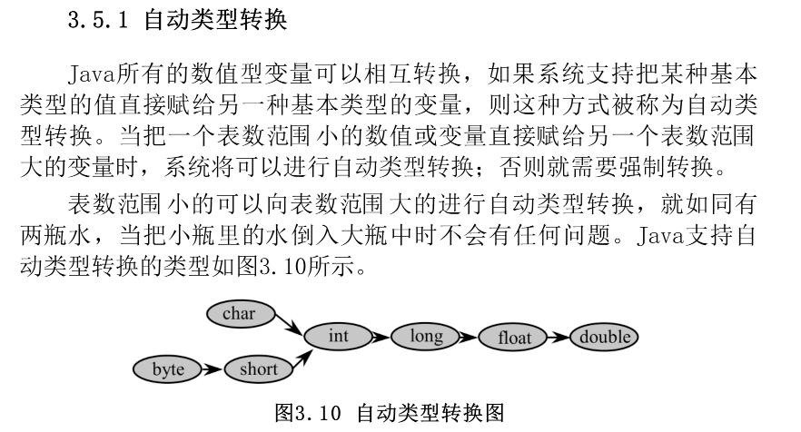
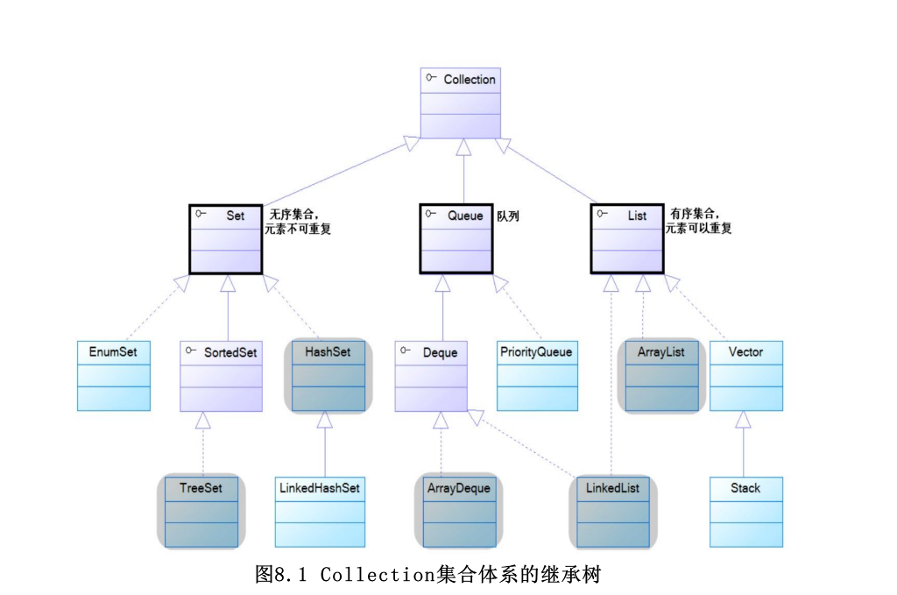
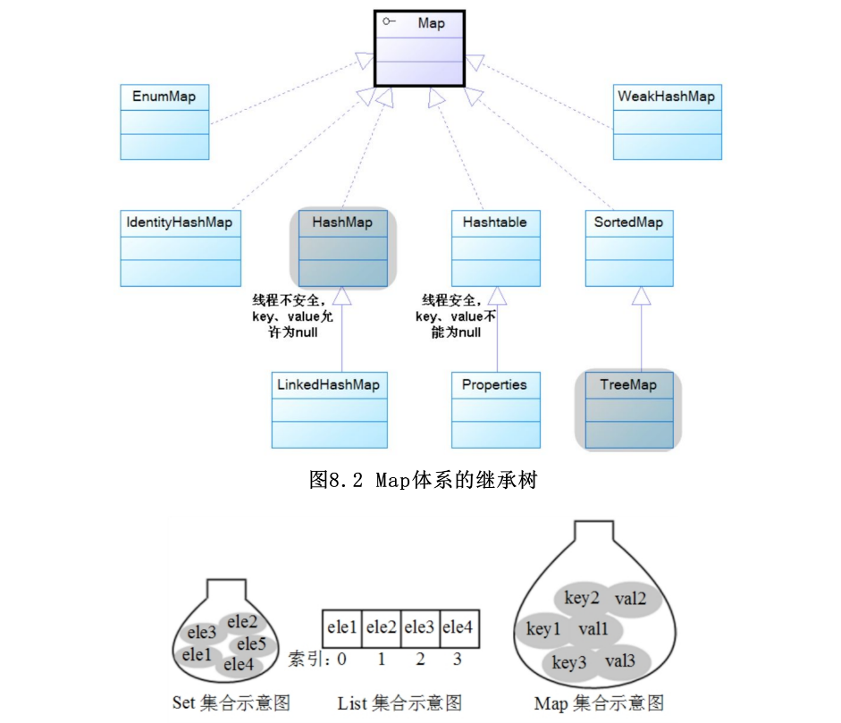
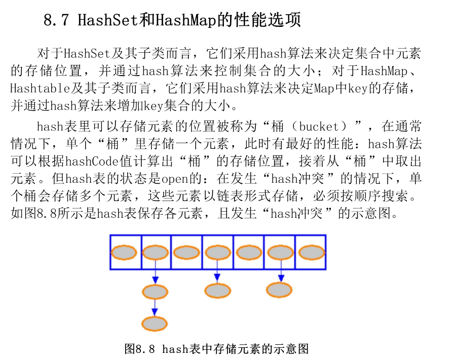
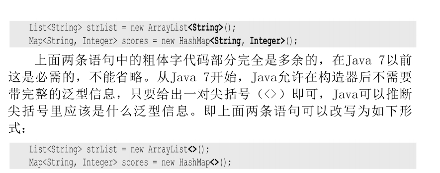
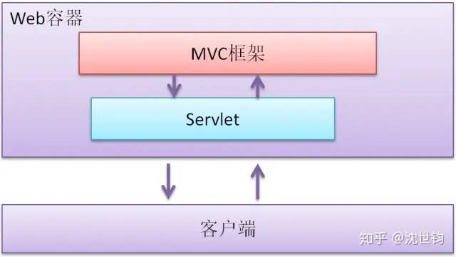
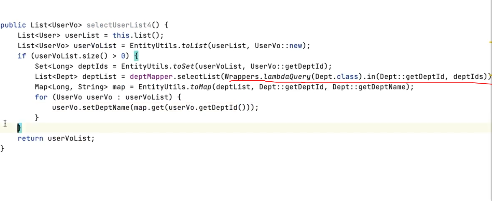
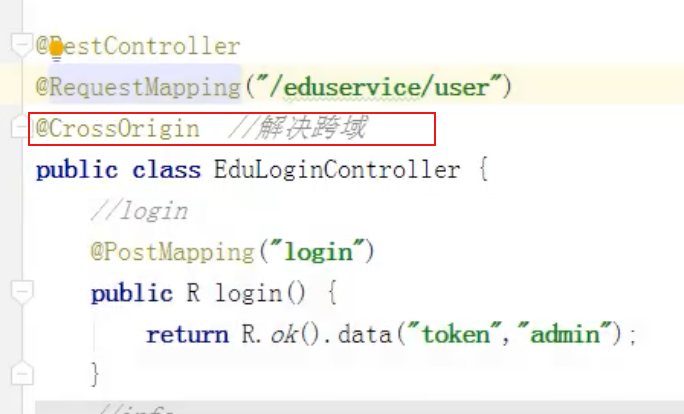
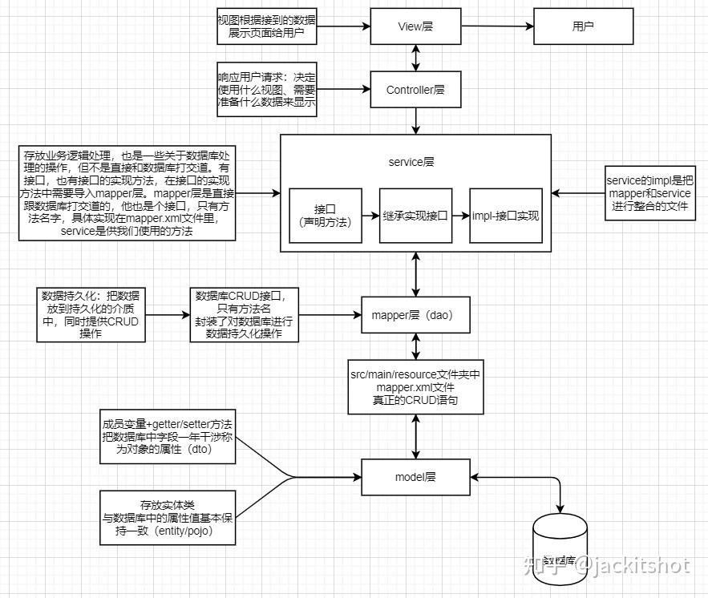

# 笔记

## 概论

### Java LTS 长期支持版本:

 Java8 (14.x)  , Java 11 (18.9) , Java 17 (21.x)

https://www.oracle.com/java/technologies/javase/jdk13-archive-downloads.html       oricale账号： [rdg_007@163.com](mailto:rdg_007@163.com) RDGrdg007!@#

PO 
Persistant Object （持久化对象）和持久层(数据库)形成对应的映射关系

BO 
Business Object （业务对象）,把业务逻辑封装为一个对象

DTO 
Data transfer Object （数据传输对象）用于展示层与服务层之间的数据传输对象

DAO
Data access Object （数据库访问对象）

VO
Value Object (视图对象)，可以理解为展⽰要⽤的数据，传递到前端页⾯上，直接进⾏展⽰ (比如要避免一些隐私字段的暴露)

### 程序羊推荐：

java编程思想，疯狂java讲义，java核心技术，重构，mysq必知必会
Jvm虚拟机,多线程并发，JUC并发工具类( import java.util.concurrent.locks.ReentrantLock;  java.util.concurrent 简称 JUC ) (Java 并发工具包（Java Util Concurrent，简称 JUC）是 Java 标准库中一个重要的部分，旨在简化并发编程，并提供了一些强大的并发工具和机制。)
Java  - Spring Boot
PHP - Laravel
Go  - Beego \ Gin
Python - Flask \ Django
android 开发 Kotlin（基于JDK）
object-C swift  IOS开发
Algorithms + Data Structures = Programs  算法+数据结构=程序
程序能否快速而高效地完成预定的任务,取决于是否选对了数据结构,而出程序是否能清晰而正确地把问题解决,取决于算法.
（元数据：用来修饰实际数据的修饰数据）

### orm

ORM 框架，对JDBC的封装 Hibernate，Mybatis, JDBCTemplate

JPA 是一种ORM规范，不是ORM框架
Spring Data JPA 是Spring框架对JPA的封装

### 流行框架演变:

 Spring、Spring MVC、Spring Boot


### 关于 java

Java 1995 — (Stanford University Network，斯坦福大学网络公司

跨平台性：**Write** **once , Run Anywhere**
只要在需要运行 java 应用程序的操作系统上，先安装一个Java虚拟机 (JVM Java Virtual Machine) 即可。由JVM来负责Java程序在该系统中的运行
Java虚拟机机制屏蔽了底层运行平台的差别，实现了“一次编译，到处运行”

**JDK** (**J**ava **D**evelopment **K**it  - Java开发工具包)
JDK是提供给Java开发人员使用的，其中包含了java的开发工具，也包括了JRE。所以安装了JDK，就不用在单独安装JRE了。
其中的开发工具：编译工具(javac.exe) 打包工具(jar.exe)等

**JRE** (**J**ava **R**untime **E**nvironment - Java运行环境)
包括Java虚拟机(JVM Java Virtual Machine)和Java程序所需的核心类库等，
如果想要**运行**一个开发好的Java程序，计算机中只需要安装JRE即可。


JDK = JRE + 开发工具集（例如Javac编译工具等）
JRE = JVM + Java SE标准类库

**Write** **once , Run Anywhere**

**1**、**Spring** **框架一般都是基于** **AspectJ** **实现** **AOP** **操作**

（1）AspectJ 不是 Spring 组成部分，独立 AOP 框架，一般把 AspectJ 和 Spirng 框架一起使用，进行 AOP 操作

**2**、基于 **AspectJ** **实现** **AOP** **操作**

（1）基于 xml 配置文件实现
（2）基于注解方式实现（使用）


Java 语言里负责解释执行字节码文件的是 Java 虚拟机 ，即JVM（Java Virtual Machine）。

JVM是可运行Java字节码文件的虚拟 计算机。所有平台上的JVM向编译器提供相同的编程接口，而编译器只 需要面向虚拟机，生成虚拟机能理解的代码，然后由虚拟机来解释执 行。在一些虚拟机的实现中，还会将虚拟机代码转换成特定系统的机器码执行，从而提高执行效率。

当使用Java编译器编译Java程序时，生成的是与平台无关的字节码，这些字节码不面向任何具体平台，只面向JVM。不同平台上的JVM都是不同的，但它们都提供了相同的接口。JVM是Java程序跨平台的关键部分，只要为不同平台实现了相应的虚拟机，编译后的Java字节码就可以在该平台上运行。显然，相同的字节码程序需要在不同的平台 上运行，这几乎是“不可能的”，只有通过中间的转换器才可以实现，JVM就是这个转换器。


如果Java程序源代码里定义了一个public类，则该源文件的主文件名必须与该public类（也就是该类定义使用了public关键字修饰）的类名相同。

由于Java程序源文件的文件名必须与public类的类名相同，因此，一个Java源文件里最多只能定义一个public类。

## 基本语法 


###  idea & test

1,自动运行测试方法：光标选中方法名称 

```java
@Test 
public void goAhead()

//Shift + Ctrl + R   运行Run指定的test方法
```

### statement

Java语言严格区分大小写。

Java方法由一条条语句构成，每个语句以“;”结束。

大括号都是成对出现的，缺一不可。

一个源文件中最多只能有一个public类。其它类的个数不限，如果源文件包含

一个public类，则文件名必须按该类名命名。

运算符两边习惯性各加一个空格。比如：2 + 4 * 5


### 标识符

Java 对各种**变量**、**方法**和**类**等要素命名时使用的字符序列称为标识符
**技巧：凡是自己可以起名字的地方都叫标识符**。

定义合法标识符规则：由*26个英文字母大小写，0-9 ，_或 $ 组成*数字不可以开头。

不可以使用关键字和保留字，但能包含关键字和保留字。

Java 中严格区分大小写，长度无限制。

标识符不能包含空格。

Java中的名称命名规范：

**包名**：多单词组成时所有字母都小写：xxxyyyzzz

**类名、接口名**：多单词组成时，所有单词的首字母大写：XxxYyyZzz

**变量名、方法名**：多单词组成时，第一个单词首字母小写，第二个单词开始每个

单词首字母大写：xxxYyyZzz

**常量名**：所有字母都大写。多单词时每个单词用下划线连接：XXX_YYY_ZZZ

注意1：在起名字时，为了提高阅读性，要尽量有意义，“见名知意”。
注意2：java采用unicode字符集，因此标识符也可以使用汉字声明，但是不建议使用。

### 变量


boolean类型数据只允许取值true和false，无null。


Java语言支持的类型分为两类：基本类型（Primitive Type）和 引用类型（Reference Type）。

基本类型包括boolean类型和数值类型。数值类型有整数类型和浮 点类型。整数类型包括byte、short、int、long、char，浮点类型包括float和double。

Java只包含这8种基本数据类型，值得指出的是，字符串不是基本数据类型，字符串是一个类，也就是一个引用数据类型。

为了简化局部变量的声明，从Java 10开始支持使用var定义局部 变量：var相当于一个动态类型，使用var定义的局部变量的类型由编 译器自动推断—定义变量时分配了什么类型的初始值，那该变量就是什么类型。


#### 自动类型转换

容量小的类型自动转换为容量大的数据类型。数据类型按容量大小排序为：



有多种类型的数据混合运算时，系统首先自动将所有数据转换成容量最大的那种数据类型，然后再进行计算。

byte,short,char之间不会相互转换，他们三者在计算时首先转换为int类型。boolean类型不能与其它数据类型运算。

当把任何基本数据类型的值和字符串(String)进行连接运算时(+)，基本数据类型的值将自动转化为字符串(String)类型。

String不是基本数据类型，属于引用数据类型, 使用方式与基本数据类型一致。例如：String str = “abcd”;

一个字符串可以串接另一个字符串，也可以直接串接其他类型的数据。例如：

```java
str = str + “xyz” ;
int n = 100;
str = str + n;
```

逻辑运算符用于连接布尔型表达式，在Java中不可以写成3<x<6，应该写成x>3 & x<6 。

#### “&”和“&&”的区别

单&时，左边无论真假，右边都进行运算；
双&时，如果左边为真，右边参与运算，如果左边为假，那么右边不参与运算。
“|”和“||”的区别同理，||表示：当左边为真，右边不参与运算。
异或( ^ )与或( | )的不同之处是：当左右都为true时，结果为false。
理解：异或，追求的是“异”!

### 数组

数组(Array)，是多个相同类型数据按一定顺序排列的集合，并使用一个名字命名，并通过编号的方式对这些数据进行统一管理。

数组本身是引用数据类型，而数组中的元素可以是任何数据类型，包括基本数据类型和引用数据类型。

创建数组对象会在内存中开辟一整块连续的空间，而数组名中引用的是这块连续空间的首地址。

数组的长度一旦确定，就不能修改。

### 面向对象

面向对象三大特性：封装性，继承性，多态性
我们也可以不定义对象的句柄，而直接调用这个对象的方法。这样的对象叫做匿名对象。

如：**new Person().shout();**

没有具体返回值的情况，返回值类型用关键字void表示，那么方法体中可以不必使用return语句。如果使用，仅用来结束方法。

#### 重载的概念

在同一个类中，允许存在一个以上的同名方法，只要它们的参数个数或者参数类型不同即可。

重载的特点：

与返回值类型无关，只看参数列表，且参数列表必须不同。(参数个数或参数类型)。调用时，根据方法参数列表的不同来区别。

重载示例：

```java
//返回两个整数的和
int add(int x,int y){return x+y;}

//返回三个整数的和
int add(int x,int y,int z){return x+y+z;}

//返回两个小数的和
double add(double x,double y){return x+y;}
```

 

使用重载方法，可以为编程带来方便。

例如，System.out.println()方法就是典型的重载方法，其内部的声明形式如下：

```java
public void println(byte x)

public void println(short x)

public void println(int x)

public void println(long x)

public void println(float x)

public void println(double x)

public void println(char x)

public void println(double x)

public void println()

……
```

\1. 声明格式：方法名(参数的类型名 ...参数名)

\2. 可变参数：方法参数部分指定类型的参数个数是可变多个：0个，1个或多个

\3. 可变个数形参的方法与同名的方法之间，彼此构成重载

\4. 可变参数方法的使用与方法参数部分使用数组是一致的

\5. 方法的参数部分有可变形参，需要放在形参声明的最后

\6. 在一个方法的形参位置，最多只能声明一个可变个数形参

Java的实参值如何传入方法呢？

Java里方法的参数传递方式只有一种：值传递。 即将实际参数值的副本（复制品）传入方法内，而参数本身不受影响。

形参是基本数据类型：将实参基本数据类型变量的“数据值”传递给形参

形参是引用数据类型：将实参引用数据类型变量的“地址值”传递给形参

#### 构造器的特征

它具有与类相同的名称

它不声明返回值类型。（与声明为void不同）

不能被static、final、synchronized、abstract、native修饰，不能有return语句返回值

根据参数不同，构造器可以分为如下两类：

**隐式无参构造器（系统****默认****提供）**

**显式****定义一个或多个构造器（无参、有参）**

注意：

**Java****语言中，每个类都至少有一个构造器**

**默认构造器的修饰符与所属类的修饰符一致**

**一旦显式定义了构造器，则系统****不再****提供默认构造器**

**一个类可以创建多个****重载****的构造器**

**父类的构造器不可被子类继承**


#### JavaBean

JavaBean是一种Java语言写成的可重用组件。

所谓javaBean，是指符合如下标准的Java类：

类是公共的

有一个无参的公共的构造器

有属性，且有对应的get、set方法

用户可以使用JavaBean将功能、处理、值、数据库访问和其他任何可以用Java代码创造的对象进行打包，并且其他的开发者可以通过内部的JSP页面、Servlet、其他JavaBean、applet程序或者应用来使用这些对象。用户可以认为JavaBean提供了一种随时随地的复制和粘贴的功能，而不用关心任何改变。

\1. 在任意方法或构造器内，如果使用当前类的成员变量或成员方法可以在其前面添加this，增强程序的阅读性。不过，通常我们都习惯省略this。

\2. 当形参与成员变量同名时，如果在方法内或构造器内需要使用成员变量，必须添加this来表明该变量是类的成员变量

3.使用this访问属性和方法时，如果在本类中未找到，会从父类中查


#### 方法的重写 (override/overwrite)

**定义**：在子类中可以根据需要对从父类中继承来的方法进行改造，也称为方法的重置、覆盖。在程序执行时，子类的方法将覆盖父类的方法。

**要求**：
\1. 子类重写的方法必须和父类被重写的方法具有相同的方法名称、参数列表
\2. 子类重写的方法的返回值类型不能大于父类被重写的方法的返回值类型
\3. 子类重写的方法使用的访问权限不能小于父类被重写的方法的访问权限子类不能重写父类中声明为private权限的方法
\4. 子类方法抛出的异常不能大于父类被重写方法的异常

注意：
子类与父类中同名同参数的方法必须同时声明为非static的(即为重写)，或者同时声明为static的（不是重写）。因为static方法是属于类的，子类无法覆盖父类的方法。

#### 关键字 — super

在Java类中使用super来调用父类中的指定操作：

super可用于访问父类中定义的属性

super可用于调用父类中定义的成员方法

super可用于在子类构造器中调用父类的构造器

注意：

尤其当子父类出现同名成员时，可以用super表明调用的是父类中的成员super的追溯不仅限于直接父类super和this的用法相像，this代表本类对象的引用，super代表父类的内存空间的标识

**调用父类的构造器**

子类中所有的构造器默认都会访问父类中空参数的构造器当父类中没有空参数的构造器时，子类的构造器必须通过this(参数列表)或者super(参数列表)语句指定调用本类或者父类中相应的构造器。同时，只能”二选一”，且必须放在构造器的首行如果子类构造器中既未显式调用父类或本类的构造器，且父类中又没有无参的构造器，则编译出错


#### 多态性

**对象的多态性：父类的引用指向子类的对象**

可以直接应用在抽象类和接口上

对象的多态 —在Java中,子类的对象可以替代父类的对象使用一个变量只能有一种确定的数据类型一个引用类型变量可能指向(引用)多种不同类型的对象

```java
Person p = new Student();

Object o = new Person();//Object类型的变量o，指向Person类型的对象

o = new Student(); //Object类型的变量o，指向Student类型的对象
```


子类可看做是特殊的父类，所以父类类型的引用可以指向子类的对象：向上转型(upcasting)

一个引用类型变量如果声明为父类的类型，但实际引用的是子类对象，那么该变量就****不能****再访问子类中添加的属性和方法


```java
Student m = new Student();
m.school = “pku”; //****合法****,Student****类有****school****成员变量**

Person e = new Student();
e.school = “pku”;//****非法****,Person****类没有****school****成员变量**
```


属性是在编译时确定的，编译时e为Person类型，没有school成员变量，因而编译错误。

Object类是所有Java类的根父类如果在类的声明中未使用extends关键字指明其父类，则默认父类为java.lang.Object类

```java
public class Person {
...
}
//等价于：
public class Person extends Object {
...
}

//例：
method(Object obj){…} //可以接收任何类作为其参数
Person o=new Person();
method(o);
```


equals()：所有类都继承了Object，也就获得了equals()方法。还可以重写。只能比较引用类型，其作用与“==”相同,比较是否指向同一个对象。

格式:obj1.equals(obj2)

重写equals()方法的原则

对称性：如果x.equals(y)返回是“true”，那么y.equals(x)也应该返回是“true”。

自反性：x.equals(x)必须返回是“true”。

传递性：如果x.equals(y)返回是“true”，而且y.equals(z)返回是“true”，那么z.equals(x)也应该返回是“true”。

一致性：如果x.equals(y)返回是“true”，只要x和y内容一直不变，不管你重复x.equals(y)多少次，返回都是“true”。任何情况下，x.equals(null)，永远返回是“false”；x.equals(和x不同类型的对象)永远返回是“false”。

**面试题：****==****和****equals****的区别**

1 == 既可以比较基本类型也可以比较引用类型。对于基本类型就是比较值，对于引用类型就是比较内存地址

2 equals的话，它是属于java.lang.Object类里面的方法，如果该方法没有被重写过默认也是==;我们可以看到String等类的equals方法是被重写过的，而且String类在日常开发中用的比较多，久而久之，形成了equals是比较值的错误观点。

3 具体要看自定义类里有没有重写Object的equals方法来判断。

4 通常情况下，重写equals方法，会比较类中的相应属性是否都相等。

```java
String str1 = new String("hello");

String str2 = new String("hello");

System.out.println("str1和str2是否相等？"+ (str1 == str2));//false

System.out.println("str1和str2是否相等？"+ str1.equals(str2));//true
```


**toString()** **方法**

toString()方法在Object类中定义，其返回值是String类型，返回类名和它的引用地址。

在进行String与其它类型数据的连接操作时，自动调用toString()方法

```java
Date now=new Date();

System.out.println(“now=”+now); 相当于

System.out.println(“now=”+now.toString());

```

可以根据需要在用户自定义类型中重写toString()方法

如String类重写了**toString()方法，返回字符串的值。

```java
s1=“hello”;
System.out.println(s1);//相当于System.out.println(s1.toString());
```

基本类型数据转换为String类型时，调用了对应包装类的toString()方法

int a=10; System.out.println(“a=”+a);

面试题：

问题:如下代码所示,请问输出结果是什么?

```java
int[] arr1 = new int[]{1,2,3};

System.out.println(arr1);

//[I@289d1c02

char[] arr2 = new char[]{'a','b','c'};

System.out.println(arr2);

//abc
```


或许大多数人都认为这也太简单了吧!心想结果不就是输出的是地址值嘛其实,正确的结果是:为什么会出现这样的结果呢?首先,我带大家来看一下PrintStream里面所有的方法结构我发现调用的System.out.println(arr1);方法实际上是PrintStream里的println(Object)方法,而System.out.println(arr2);实际上调用的是PrintStream里的println(char[])方法.


由于Java虚拟机需要调用类的main()方法，所以该方法的访问权限必须是public，又因为Java虚拟机在执行main()方法时不必创建对象，所以该方法必须是static的，该方法接收一个String类型的数组参数，该数组中保存执行Java命令时传递给所运行的类的参数。又因为main() 方法是静态的，我们不能直接访问该类中的非静态成员，必须创建该类的一个实例对象后，才能通过这个对象去访问类中的非静态成员，这种情况，我们在之前的例子中多次碰到。

代码块(或初始化块)的分类： 一个类中代码块若有修饰符，则只能被static修饰，称为静态代码块(static block)，没有使用static修饰的，为非静态代码块。

静态代码块：用static 修饰的代码块

\1. 可以有输出语句。

\2. 可以对类的属性、类的声明进行初始化操作。

\3. 不可以对非静态的属性初始化。即：不可以调用非静态的属性和方法。

\4. 若有多个静态的代码块，那么按照从上到下的顺序依次执行。

\5. 静态代码块的执行要先于非静态代码块。

\6. 静态代码块随着类的加载而加载，且只执行一次。

非静态代码块：没有static修饰的代码块

\1. 可以有输出语句。

\2. 可以对类的属性、类的声明进行初始化操作。

\3. 除了调用非静态的结构外，还可以调用静态的变量或方法。

\4. 若有多个非静态的代码块，那么按照从上到下的顺序依次执行。

\5. 每次创建对象的时候，都会执行一次。且先于构造器执行。


在Java中声明类、变量和方法时，可使用关键字final来修饰,表示“最终的”。

**final****标记的类不能被继承。**提高安全性，提高程序的可读性。

String类、System类、StringBuffer类

**final****标记的方法不能被子类重写。**

比如：Object类中的getClass()。

**final****标记的变量****(****成员变量或局部变量****)****即称为常量。**名称大写，且只能被赋值一次。

final标记的成员变量必须在声明时或在每个构造器中或代码块中显式赋值，然后才能使用。

final double MY_PI = 3.14;


#### 接口

一方面，有时必须从几个类中派生出一个子类，继承它们所有的属性和方法。但是，Java不支持多重继承。有了接口，就可以得到多重继承的效果。另一方面，有时必须从几个类中抽取出一些共同的行为特征，而它们之间又没有is-a的关系，仅仅是具有相同的行为特征而已。例如：鼠标、键盘、打印机、扫描仪、摄像头、充电器、MP3机、手机、数码相机、移动硬盘等都支持USB连接。

接口就是规范，定义的是一组规则，体现了现实世界中“如果你是/要...则必须能...”的思想。继承是一个"是不是"的关系，而接口实现则是 "能不能"的关系。接口的本质是契约，标准，规范，就像我们的法律一样。制定好后大家都要遵守。


接口(interface)是抽象方法和常量值定义的集合。

**接口的特点：**

用interface来定义。

接口中的所有成员变量都默认是由public static final修饰的。

接口中的所有抽象方法都默认是由public abstract修饰的。

接口中没有构造器。

接口采用多继承机制。

接口定义举例

```java
public interface Runner {

  public static final int ID = 1;

  public abstract void start();

  public abstract void run();

  public abstract void stop();

}

```


**接口**

定义Java类的语法格式：先写extends，后写implementsclass SubClass extends SuperClass **implements** InterfaceA{ }一个类可以实现多个接口，接口也可以继承其它接口。实现接口的类中必须提供接口中所有方法的具体实现内容，方可实例化。否则，仍为抽象类。

接口的主要用途就是被实现类实现。（面向接口编程）与继承关系类似，接口与实现类之间存在多态性

接口和类是并列关系，或者可以理解为一种特殊的类。从本质上讲，接口是一种特殊的抽象类，这种抽象类中只包含常量和方法的定义(JDK7.0及之前)，而没有变量和方法的实现。


接口的应用：代理模式(Proxy)

应用场景：

 安全代理：屏蔽对真实角色的直接访问。

 远程代理：通过代理类处理远程方法调用（RMI）

 延迟加载：先加载轻量级的代理对象，真正需要再加载真实对象

比如你要开发一个大文档查看软件，大文档中有大的图片，有可能一个图片有100MB，在打开文件时，不可能将所有的图片都显示出来，这样就可以使用代理模式，当需要查看图片时，用proxy来进行大图片的打开。

分类

 静态代理（静态定义代理类）

 动态代理（动态生成代理类）

 JDK自带的动态代理，需要反射等知识


Java 8 中关于接口的改进

Java 8中，你可以为接口添加静态方法和默认方法。从技术角度来说，这是完全合法的，只是它看起来违反了接口作为一个抽象定义的理念。

**静态方法：**使用 static 关键字修饰。可以通过接口直接调用静态方法，并执行其方法体。我们经常在相互一起使用的类中使用静态方法。你可以在标准库中找到像Collection/Collections或者Path/Paths这样成对的接口和类。

**默认方法：**默认方法使用 default 关键字修饰。可以通过实现类对象来调用。

我们在已有的接口中提供新方法的同时，还保持了与旧版本代码的兼容性。比如：java 8 API中对Collection、List、Comparator等接口提供了丰富的默认方法。


**接口中的默认方法**

若一个接口中定义了一个默认方法，而另外一个接口中也定义了一个同名同参数的方法（不管此方法是否是默认方法），在实现类同时实现了这两个接口时，会出现：**接口冲突。**

解决办法：实现类必须覆盖接口中同名同参数的方法，来解决冲突。若一个接口中定义了一个默认方法，而父类中也定义了一个同名同参数的非抽象方法，则不会出现冲突问题。因为此时遵守：**类优先原则。**接口中具有相同名称和参数的默认方法会被忽略。

内部类

```java
public class Outer {
    private int s = 111;
    public class Inner {
        private int s = 222;
        public void mb(int s) {
            System.out.println(s); // 局部变量s
            System.out.println(this.s); // 内部类对象的属性s
            System.out.println(Outer.this.s); // 外部类对象属性s 
        } 
    }
    public static void main(String args[]) {
        Outer a = new Outer();
        Outer.Inner b = a.new Inner();
        b.mb(333);
    }
}


public class Outer {
  
  private int s = 111;

  public class Inner {
  
    private int s = 222;

    public void mb(int s) {
        System.out.println(s); // 局部变量s
        System.out.println(this.s); // 内部类对象的属性s
        System.out.println(Outer.this.s); // 外部类对象属性s
      }
    }

    public static void main(String args[]) {
      Outer a = new Outer();
      Outer.Inner b = a.new Inner();
      b.mb(333);
    }
}
```


## 集合


Java的集合类主要由两个接口派生而出：Collection和Map，Collection和Map是Java集合框架的根接口，这两个接口又包含了一些子接口或实现类。










## 泛型



需要说明的是，当使用var声明变量时，编译器无法推断泛型的类型。因此，如果使用var声明变量，程序无法使用“菱形”语法。


## 框架

Spring 是轻量级的开源的 JavaEE 框架

2、Spring 可以解决企业应用开发的复杂性

3、Spring 有两个核心部分：IOC 和 Aop

（1）IOC：控制反转，把创建对象过程交给 Spring 进行管理

（2）Aop：面向切面，不修改源代码进行功能增强

4、Spring 特点

（1）方便解耦，简化开发

（2）Aop 编程支持

（3）方便程序测试

（4）方便和其他框架进行整合

（5）方便进行事务操作

（6）降低 API 开发难度

IOC（概念和原理）

1、什么是 IOC

（1）控制反转，把对象创建和对象之间的调用过程，交给 Spring 进行管理

（2）使用 IOC 目的：为了耦合度降低

（3）做入门案例就是 IOC 实现

2、IOC 底层原理

（1）xml 解析、工厂模式、反射

3、画图讲解 IOC 底层原理

IOC（BeanFactory 接口）

1、IOC 思想基于 IOC 容器完成，IOC 容器底层就是对象工厂

2、Spring 提供 IOC 容器实现两种方式：（两个接口）

（1）BeanFactory：IOC 容器基本实现，是 Spring 内部的使用接口，不提供开发人员进行使用加载配置文件时候不会创建对象，在获取对象（使用）才去创建对象

（2）ApplicationContext：BeanFactory 接口的子接口，提供更多更强大的功能，一般由开发人员进行使用加载配置文件时候就会把在配置文件对象进行创建

3、ApplicationContext 接口有实现类

IOC 操作 Bean 管理（概念）

1、什么是 Bean 管理

（0）Bean 管理指的是两个操作

（1）Spring 创建对象

（2）Spirng 注入属性2、Bean 管理操作有两种方式

（1）基于 xml 配置文件方式实现

（2）基于注解方式实现


### Hibernate

Hibernate作为老牌的 ORM映射框架，功能非常强大，涵盖面非常广。但这既是它的优点，同时也成为它的“负担”，是开发人员“不能承受之重”。

Hibernate的设计初衷，是为了最大程度地解放程序员，完全隔离数据库，实现彻底的OR映射。程序员甚至可以不写一行SQL语句，单通过配置就能实现对数据库的操作。

当然，为了实现这个目标，Hibernate也设计地非常复杂、非常精巧。就不可避免的带来以下副作用：

1. 学习成本高
2. 配置复杂
3. 调优困难

前两点不难理解，单说“调优困难”。

因为Hibernate的设计目标是彻底的OR映射，彻底的隔离SQL语句。但必然会带来一定的性能损失。大部分情况下，应用如果对性能不敏感，Hibernate也没问题。但应用一旦对性能敏感，有SQL级别调优的需求，Hibernate的优点反而成为缺点。

虽然Hibernate也支持SQL级别的调优，但因为框架设计的过于复杂和精巧，这就需要开发人员对Hibernate理解的非常透彻，这就带来了更高的学习成本。

而现在最流行的MyBatis，作为一个“混合式”，轻量级OR映射框架，既继承了Hibernate的优点，同时也吸取了他的教训。在支持配置的同时，又能接触SQL，从而带来了更多灵活性（包括调试、优化）。

当前，在实际开发中，Hibernate使用得越来越少了。大家更偏爱**MyBatis**这种轻量级框架。所以，对后来学习者，我的建议是：

“*不需要再学习Hibernate了，学MyBatis就够了*。”


### Servlet（要精通）

当然，现在不会有任何公司，再用纯粹的Servlet来实现整个Web应用，而是转向一些更高级的技术（例如各种 MVC 框架）。因此，会给人一种错觉：Servlet已经过时，后来者就不需要再学习了。

在这里，我可以非常负责任地说：这种观点是极端错误，极端不负责任的。

Servlet不仅要学，而且要学深，学透。

当前，Servlet虽然不再是一个主流web开发技术，但依然是Java Web开发技术的基础，是Java Web容器的基石，是行业标准。而现在流行的各种MVC框架（包括SpringMVC），在最底层，还是以 Servlet为基础的。

为此，我画了一个简单的图（不准确，会意即可）：

图片

所以，如果你想要彻底掌握某个MVC框架，则必须彻底理解Servlet。

而且，Servlet作为一个基础设施。精通它，不仅有助于理解各种MVC框架。即使Servlet本身，也有很多实用价值。

如果你深刻理解了Servlet的生命周期，就可以在底层做很多事情。譬如在Request进来的时候，进行拦截，进行权限的判定。也可以在Response发出的时候，进行拦截，统一检查、统一附加。

所以，如果你正在学习Java，对Servlet，我的建议是：

“*Servlet不仅要学，而且要学深，学透*。”


## Mybatis


## Mybatis Plus


### 主键生成策略

> **源码解释**

```java
public enum IdType {
    AUTO, //数据库id自增
    INPUT, //手动输入
    ID_WORKER, //默认的全局唯一id
    UUID, //全局唯一id  uuid
    NONE;//未设置主键
    **
}
```


```java
// 假设有一个 QueryWrapper 对象，设置查询条件为 name = 'John Doe'，并将结果转换为 String
QueryWrapper<User> queryWrapper = new QueryWrapper<>();
queryWrapper.eq("name", "John Doe");
String userName = userService.getObj(queryWrapper, obj -> ((User) obj).getName()); // 调用 getObj 方法
if (userName != null) {
    System.out.println("User name found: " + userName);
} else {
    System.out.println("User name not found.");
}
```

当前线程本地储存:

****




消息转换器


## 项目笔记


### 创建项目


详见印象笔记：【SpringBoot新手篇】Spring Boot 简介
原帖地址：https://blog.csdn.net/qq_45297578/article/details/119249574

1. 处理 idea java版本设置问题，包括 compile 配置的java版本

选择阿里云的镜像中心创建项目,会有更多的国内项目的依赖应用可选, 例如:mybatis-plus

```
https://start.aliyun.com
```


#### 解决跨域




#### 热部署


#### 自动导入包,去掉不用的包


#### 快速复制工程:

复制文件夹, 重命名文件夹

删除其他所有的文件,包括隐藏文件,只剩下src和 pom

修改更换 pom 中的 artifactId 

idea 直接 open 这个新的文件夹


#### idea 将下划线转换为驼峰

Shift + F6 弹出下拉选项


#### 问题处理:

Port 8080 was already in use

Description:
Web server failed to start. Port 8080 was already in use.

lsof -i:8080

kill  pid


#### 修改文件自动重启、编译

mvn idea:module

  解决方法有两种：

    1、手动：修改完代码，按快捷键Ctrl+F9，手动构建项目，或者只修改单个类文件的话，按Ctrl+Shift+F9，重新编译该类文件，即可触发重启服务。


#### Springboot项目结构

https://blog.csdn.net/weixin_46356448/article/details/136992276

3.1 /src/main/java 目录

|_annotation：放置项目自定义注解
|_aspect：放置切面代码
|_config：放置配置类
|_constant：放置常量、枚举等定义
   |__consist：存放常量定义
   |__enums：存放枚举定义
|_controller：放置控制器代码
|_filter：放置一些过滤、拦截相关的代码
|_mapper：放置数据访问层代码接口
|_model：放置数据模型代码
   |__entity：放置数据库实体对象定义
   |__dto：存放数据传输对象定义
   |__vo：存放显示层对象定义
|_service：放置具体的业务逻辑代码（接口和实现分离）
   |__intf：存放业务逻辑接口定义
   |__impl：存放业务逻辑实际实现
|_utils：放置工具类和辅助代码





#### 接收 json 格式的请求参数

springboot 使用@RequestParam Integer id 能否接收 json 格式的请求参数?

ChatGPT

在 Spring Boot 中，`@RequestParam` 注解通常用于从查询参数中提取参数，而不是从请求体中提取 JSON 格式的参数。如果你想要从 JSON 格式的请求体中提取参数，通常会使用 `@RequestBody` 注解。

使用 `@RequestBody` 解析 JSON 请求体

如果你的请求是 JSON 格式的，你应该使用 `@RequestBody` 注解来接收 JSON 请求体，并将其映射到一个 Java 对象。例如：

1. **定义一个 DTO 类**：

   ```
   java
   复制代码
   public class UserDTO {
       private Integer id;
   
       // getters and setters
   }
   ```


### 部署项目到服务器


#### 安装 OpenJDK 11

这里假设你使用的是一个基于 Ubuntu 的 Linux 服务器。

步骤 1：更新系统软件包

首先，更新你的系统软件包列表以确保你有最新的软件包信息。

```
sudo apt update
```

步骤 2：安装 OpenJDK 11

在 Ubuntu 上，你可以使用以下命令来安装 OpenJDK 11：

```
sudo apt install openjdk-11-jdk
```

步骤 3：验证安装

安装完成后，你可以通过以下命令来验证 Java 11 是否已正确安装：

```
java -version
```

在 CentOS 上安装 OpenJDK 11

```
sudo yum install java-11-openjdk-devel
```


#### 启动 mysql

```mysql
systemctl start mysqld


#安装 mysql
yum install mysql-server
# 新安装的 mysql,获取MySQL的初始密码
# 通过grep命令，在/var/log/mysqld.log文件中，过滤 temporary password关键字，得到初始密码
grep 'temporary password' /var/log/mysqld.log

#如果账号权限不足, 赋予权限
GRANT ALL PRIVILEGES ON cheng_yue.* TO 'root'@'localhost' IDENTIFIED BY 'RDGrdg007!@#';
GRANT ALL PRIVILEGES ON *.* TO 'root'@'localhost';
ALTER USER 'root'@'localhost' IDENTIFIED WITH mysql_native_password BY 'RDGrdg007!@#';

GRANT ALL PRIVILEGES ON *.* TO 'root'@'localhost' IDENTIFIED BY 'RDGrdg007!@#';
GRANT ALL PRIVILEGES ON *.* TO 'root'@'%' IDENTIFIED BY "RDGrdg007!@#";
GRANT ALL PRIVILEGES ON *.* TO "root"@"%" IDENTIFIED BY "RDGrdg007!@#"; //为root添加远程连接的能力

FLUSH PRIVILEGES;

ALTER USER 'root'@'localhost' IDENTIFIED WITH mysql_native_password;
grant all privileges on *.* to 'root'@'%';
ALTER USER 'root'@'%' IDENTIFIED WITH mysql_native_password BY 'RDGrdg007!@#';

ALTER USER 'root'@'localhost' IDENTIFIED WITH mysql_native_password BY 'RDGrdg007!@#';
ALTER USER 'root'@'localhost' IDENTIFIED BY 'RDGrdg007!@#';
create user 'root'@'%' IDENTIFIED WITH mysql_native_password BY 'RDGrdg007!@#';
mysql> update user set Grant_priv='y' where user='root' and host='%';

grant all privileges on *.* to 'root'@'%';
grant all privileges on *.* to 'root'@'localhost';
GRANT ALL PRIVILEGES ON *.* TO 'root'@'localhost' WITH GRANT OPTION;

#设置密码策略级别(0为最低)
set global validate_password.policy=0;

-GfNDpdCo8KC
```

#### 配置 nginx

转发前端请求到指定端口

```nginx
server {
      listen 80;
      server_name 8.137.16.60;
      root /var/www/html/web_cheng_yue/dist;
      index index.html;
      location / {
          try_files $uri $uri/ /index.html;
      }
      location /api/ {
         # 将/api/开头的url转向该域名
         proxy_pass   http://127.0.0.1:8090;
         #最终url中去掉/api前缀
         rewrite "^/api/(.*)$" /$1 break;

        proxy_set_header Host $host;
        proxy_set_header X-Real-IP $remote_addr;
        proxy_set_header X-Forwarded-For $proxy_add_x_forwarded_for;
        proxy_set_header X-Forwarded-Proto $scheme;

        # 处理 CORS 请求头
        if ($request_method = 'OPTIONS') {
            add_header 'Access-Control-Allow-Origin' '*';
            add_header 'Access-Control-Allow-Methods' 'GET, POST, OPTIONS, DELETE, PUT';
            add_header 'Access-Control-Allow-Headers' 'Authorization, Content-Type';
            add_header 'Access-Control-Max-Age' 1728000;
            add_header 'Content-Type' 'text/plain charset=UTF-8';
            add_header 'Content-Length' 0;
            return 204;
        }
        add_header 'Access-Control-Allow-Origin' '*';
        add_header 'Access-Control-Allow-Methods' 'GET, POST, OPTIONS, DELETE, PUT';
        add_header 'Access-Control-Allow-Headers' 'Authorization, Content-Type';
      }
}
```


#### 启动 jar 包

```shell
java11启动项目
nohup /home/jdk-11/bin/java -jar /mnt/env_manager/envmgt-v1.0.1.jar > log.file 2>&1 &

nohup java -jar /var/www/html/api_java/target/api-0.0.1-SNAPSHOT.jar --spring.profiles.active=prod > /var/www/html/api_java/runtime.log 2>&1 &

nohup java -jar /var/www/html/api_java/target/api-0.0.1-SNAPSHOT.jar --spring.profiles.active=dev > /var/www/html/api_java/runtime.log 2>&1 &

nohup java -jar /Users/rdg/www/api/target/api-0.0.1-SNAPSHOT.jar --spring.profiles.active=dev > /Users/rdg/www/api/runtime.log 2>&1 &


#查看实时运行日志
tail -f /var/www/html/api_java/runtime.log
```

在关闭服务器远程会话服务终端（例如，SSH 连接）时，Spring Boot 应用程序的 JAR 包运行报错 `Shutting down ExecutorService 'applicationTaskExecutor'` 并自动退出，这通常是因为该应用程序被绑定到了该终端上，并在终端关闭时被系统信号中断。

这是一个常见的问题，特别是在没有使用后台运行工具的情况下启动应用程序时。以下是解决这个问题的方法：

#### 使用 `nohup` 命令启动 jar 包

`nohup` 命令可以让你的应用程序在后台运行，即使你关闭终端，它也不会退出。

```shell
nohup java -jar your-application.jar &
```

`&` 符号表示在后台运行，`nohup` 表示忽略挂起信号。运行这个命令后，你可以安全地关闭终端，而不影响应用程序的运行。


