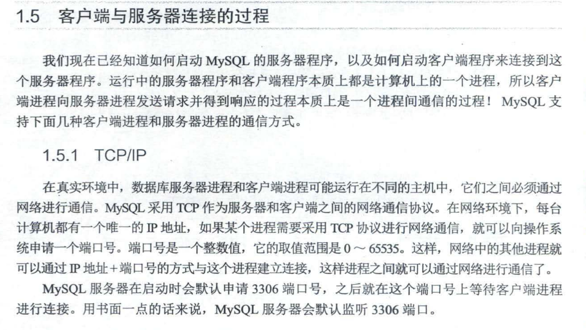
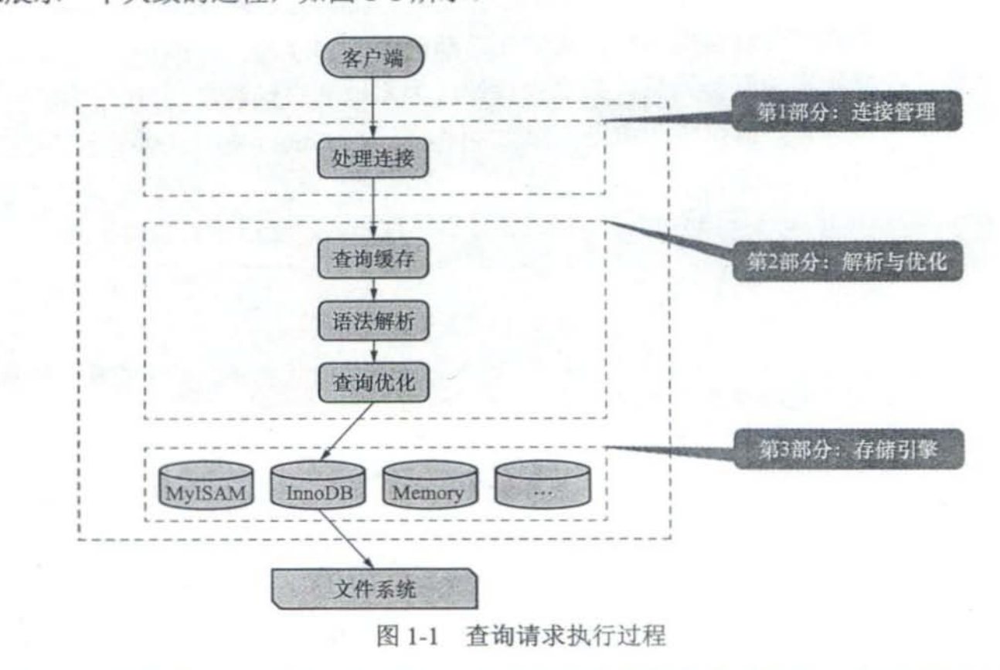
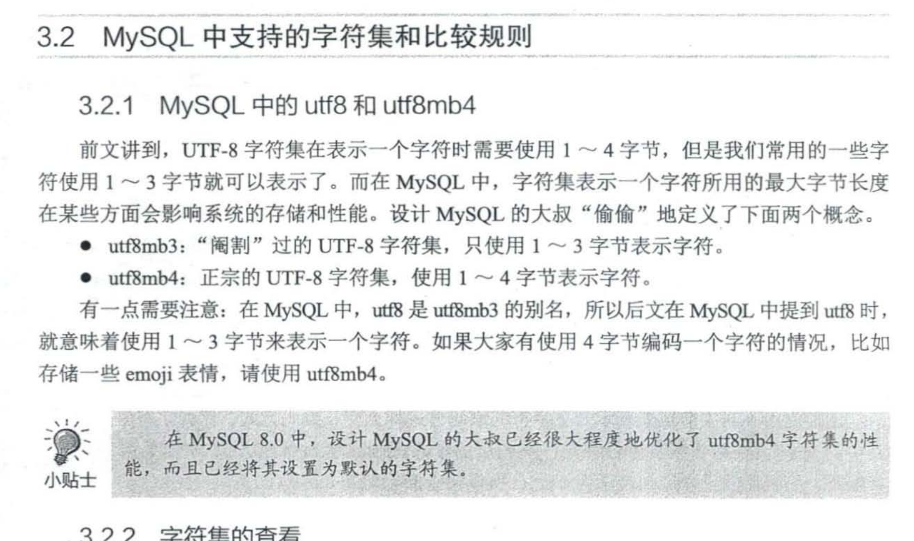
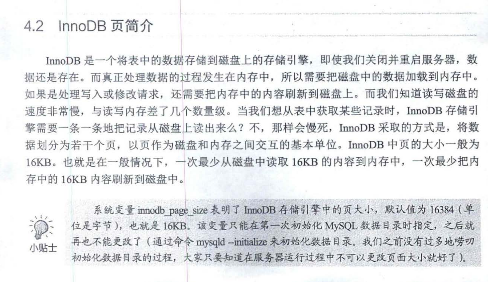
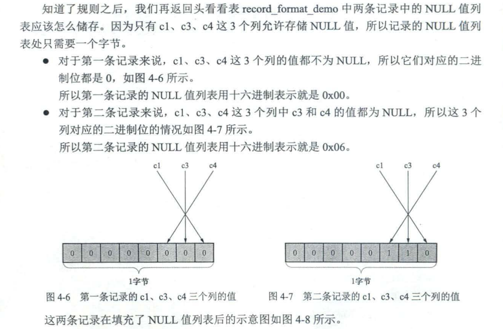
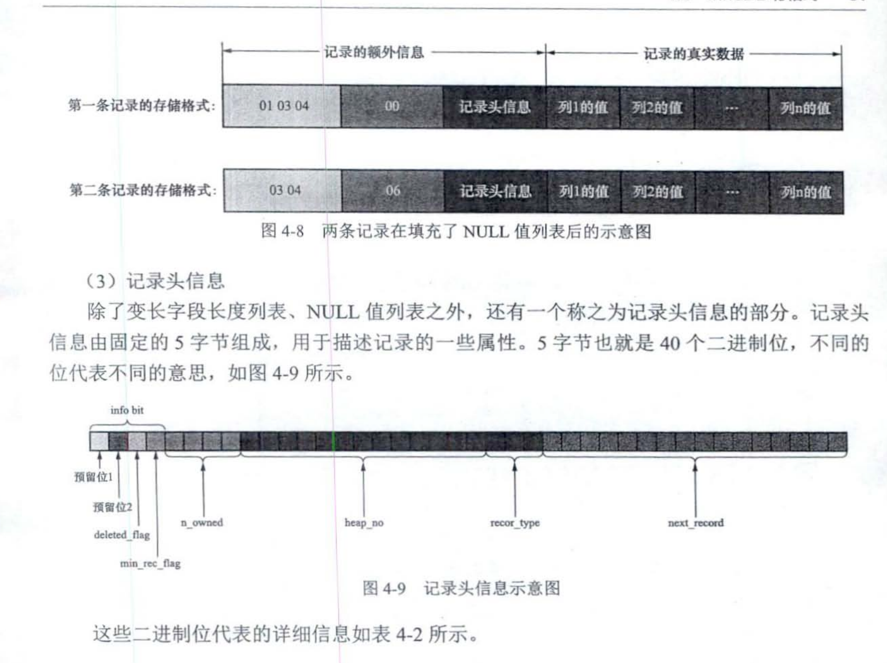
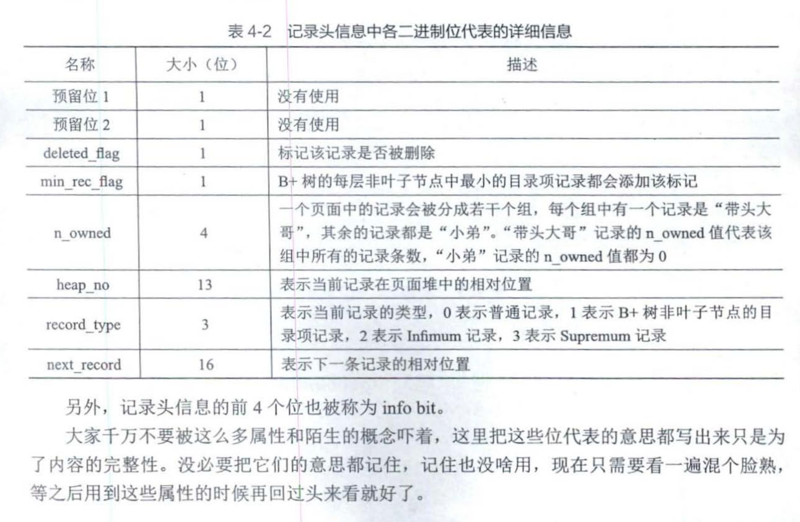
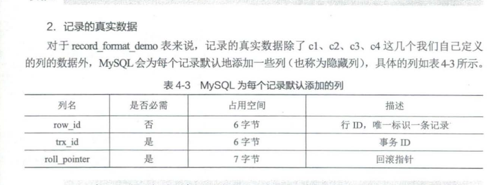
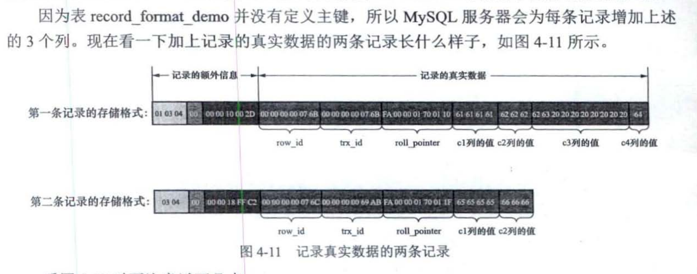
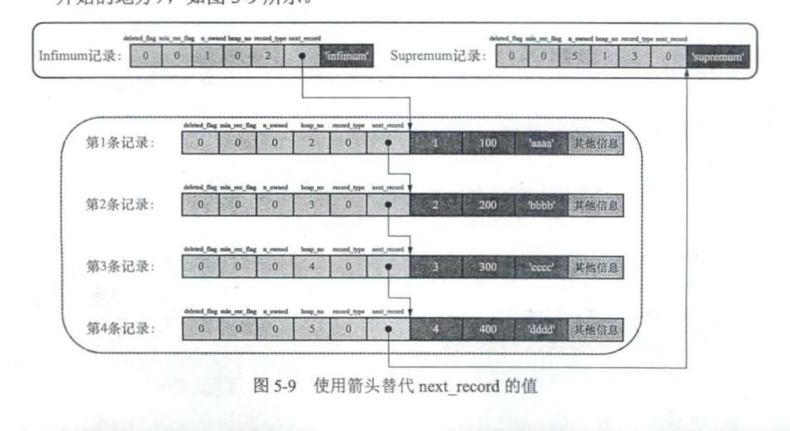

# mysql 是怎样运行的


采用TCP/IP连接：
****

 

小贴士：

MySQL 7.2 开始，不推荐使用查询缓存 ，MySQL8.0 中直接将其删除.

## 启动选项和系统变量

GLOBAL （全局范围）

SESSION （会话范围）


## 字符集和比较规则




## 从一条记录说起 -- InnoDB 录存储结构 



记录的额外信息：

InnoDB 储存NULL值，其实只用到了一个bit的长度，再记录头中将所有的允许null的字段，储存值是否为null，0不是，1是。都记录在这个额外信息中。







记录的真实数据：






## 盛放记录的大盒子-- InnoDB数据页结构

### InnoDB 数据页结构


页内的记录，以链表的方式连接在一起。




## B+树索引


#### MyISAM 需要至少执行一次回表


## B+树索引的使用


#### 				回表的代价


尽可能选择 小的数据类型 更有利于查询效率，不单单只是节约存储空间那点好处。往往几个int型的大小相差4倍及以上，选小的类型，在二级索引扫描时可以较少倍数级的磁盘I/O次数


## MySQL 的数据目录


## InnoDB 的表空间


### InnoDB 数据字典 , 元数据


## 单表访问方法

MySQLSe凹町 有一个称为优化器的模块. MySQL Server 在对一条查询语

句进行语法解析之后，就会将其交给优化器来优化，优化的结果就是生成一个所谓的执行计划~.

这个执行计划表明了应该使用哪些索引进行查询、表之间的连接顺序是啥样的 等等.最后会

按照执行计划中的步骤调用存储引擎提供的接口来真正地执行查询，并将查询结果返给客户端。

### const


设计 MySQL 的大叔认为，通过主键或者唯一二级索引列与常数的等值比较来定位 条记录是像坐火箭 样快的 ，所以他们把这种通过主键或者唯一二级索号|列来定位 条记录的访问方法定义为 const (意思是常数级别的 代价是可以忽略不计的) 不过这种 const 访问方法只能在 键列或者唯一二级索引列与一个常数进行等值比较时才有效.

### ref


### ref_or_null


值为 NUL 的记录会被 在索引 的最左边.

### range


### index


### all


### 索引合并


## 两个者的亲密接触 -- 连接的原理


## 基于成本的优化


## 兵马未动，粮草先行 -- InnoDB 统计数据是如何收的


## 基于规则的优化(内含查询优化二三事）


### 外连接消除


### 子查询优化


### In 子查询优化


## 查询优化的百科全书 -- EXPLAIN 详解


### select type


### type 访问方法


#### system


#### const 


#### eq_ref 


#### ref


#### fulltext 


#### ref_or_null


#### index_merge


#### unique_subquery


#### index_subquery 


#### range 


#### index 


#### ALL


Extra


## 神兵利器 -- optimizer trace 的神奇功效

```sql
SET OPTIMIZER_TRACE="enabled=on";


explain SELECT * FROM test.single_table WHERE 
key1 > 'z' AND 
key2 < 1000000 AND 
key3 IN ('a','b','c') AND 
common_field= 'abc';

select * from information_schema.OPTIMIZER_TRACE;

SET OPTIMIZER_TRACE="enabled=off";
```


```json
{
  "steps": [
    {
      "join_preparation": {
        "select#": 1,
        "steps": [
          {
            "IN_uses_bisection": true
          },
          {
            "expanded_query": "/* select#1 */ select `test`.`single_table`.`id` AS `id`,`test`.`single_table`.`key1` AS `key1`,`test`.`single_table`.`key2` AS `key2`,`test`.`single_table`.`key3` AS `key3`,`test`.`single_table`.`key_part1` AS `key_part1`,`test`.`single_table`.`key_part2` AS `key_part2`,`test`.`single_table`.`key_part3` AS `key_part3`,`test`.`single_table`.`common_field` AS `common_field` from `test`.`single_table` where ((`test`.`single_table`.`key1` > 'z') and (`test`.`single_table`.`key2` < 1000000) and (`test`.`single_table`.`key3` in ('a','b','c')) and (`test`.`single_table`.`common_field` = 'abc'))"
          }
        ]
      }
    },
    {
      "join_optimization": {
        "select#": 1,
        "steps": [
          {
            "condition_processing": {
              "condition": "WHERE",
              "original_condition": "((`test`.`single_table`.`key1` > 'z') and (`test`.`single_table`.`key2` < 1000000) and (`test`.`single_table`.`key3` in ('a','b','c')) and (`test`.`single_table`.`common_field` = 'abc'))",
              "steps": [
                {
                  "transformation": "equality_propagation",
                  "resulting_condition": "((`test`.`single_table`.`key1` > 'z') and (`test`.`single_table`.`key2` < 1000000) and (`test`.`single_table`.`key3` in ('a','b','c')) and (`test`.`single_table`.`common_field` = 'abc'))"
                },
                {
                  "transformation": "constant_propagation",
                  "resulting_condition": "((`test`.`single_table`.`key1` > 'z') and (`test`.`single_table`.`key2` < 1000000) and (`test`.`single_table`.`key3` in ('a','b','c')) and (`test`.`single_table`.`common_field` = 'abc'))"
                },
                {
                  "transformation": "trivial_condition_removal",
                  "resulting_condition": "((`test`.`single_table`.`key1` > 'z') and (`test`.`single_table`.`key2` < 1000000) and (`test`.`single_table`.`key3` in ('a','b','c')) and (`test`.`single_table`.`common_field` = 'abc'))"
                }
              ]
            }
          },
          {
            "substitute_generated_columns": {
            }
          },
          {
            "table_dependencies": [
              {
                "table": "`test`.`single_table`",
                "row_may_be_null": false,
                "map_bit": 0,
                "depends_on_map_bits": [
                ]
              }
            ]
          },
          {
            "ref_optimizer_key_uses": [
            ]
          },
          {
            "rows_estimation": [
              {
                "table": "`test`.`single_table`",
                "range_analysis": {
                  "table_scan": {
                    "rows": 1,
                    "cost": 2.45
                  },
                  "potential_range_indexes": [
                    {
                      "index": "PRIMARY",
                      "usable": false,
                      "cause": "not_applicable"
                    },
                    {
                      "index": "uk_key2",
                      "usable": true,
                      "key_parts": [
                        "key2"
                      ]
                    },
                    {
                      "index": "idx_key1",
                      "usable": true,
                      "key_parts": [
                        "key1",
                        "id"
                      ]
                    },
                    {
                      "index": "idx_key3",
                      "usable": true,
                      "key_parts": [
                        "key3",
                        "id"
                      ]
                    },
                    {
                      "index": "idx_key_part",
                      "usable": false,
                      "cause": "not_applicable"
                    }
                  ],
                  "setup_range_conditions": [
                  ],
                  "group_index_range": {
                    "chosen": false,
                    "cause": "not_group_by_or_distinct"
                  },
                  "skip_scan_range": {
                    "potential_skip_scan_indexes": [
                      {
                        "index": "uk_key2",
                        "usable": false,
                        "cause": "query_references_nonkey_column"
                      },
                      {
                        "index": "idx_key1",
                        "usable": false,
                        "cause": "query_references_nonkey_column"
                      },
                      {
                        "index": "idx_key3",
                        "usable": false,
                        "cause": "query_references_nonkey_column"
                      }
                    ]
                  },
                  "analyzing_range_alternatives": {
                    "range_scan_alternatives": [
                      {
                        "index": "uk_key2",
                        "ranges": [
                          "NULL < key2 < 1000000"
                        ],
                        "index_dives_for_eq_ranges": true,
                        "rowid_ordered": false,
                        "using_mrr": false,
                        "index_only": false,
                        "in_memory": 1,
                        "rows": 1,
                        "cost": 0.61,
                        "chosen": true
                      },
                      {
                        "index": "idx_key1",
                        "ranges": [
                          "'z' < key1"
                        ],
                        "index_dives_for_eq_ranges": true,
                        "rowid_ordered": false,
                        "using_mrr": false,
                        "index_only": false,
                        "in_memory": 1,
                        "rows": 1,
                        "cost": 0.61,
                        "chosen": false,
                        "cause": "cost"
                      },
                      {
                        "index": "idx_key3",
                        "ranges": [
                          "key3 = 'a'",
                          "key3 = 'b'",
                          "key3 = 'c'"
                        ],
                        "index_dives_for_eq_ranges": true,
                        "rowid_ordered": false,
                        "using_mrr": false,
                        "index_only": false,
                        "in_memory": 1,
                        "rows": 3,
                        "cost": 1.81,
                        "chosen": false,
                        "cause": "cost"
                      }
                    ],
                    "analyzing_roworder_intersect": {
                      "usable": false,
                      "cause": "too_few_roworder_scans"
                    }
                  },
                  "chosen_range_access_summary": {
                    "range_access_plan": {
                      "type": "range_scan",
                      "index": "uk_key2",
                      "rows": 1,
                      "ranges": [
                        "NULL < key2 < 1000000"
                      ]
                    },
                    "rows_for_plan": 1,
                    "cost_for_plan": 0.61,
                    "chosen": true
                  }
                }
              }
            ]
          },
          {
            "considered_execution_plans": [
              {
                "plan_prefix": [
                ],
                "table": "`test`.`single_table`",
                "best_access_path": {
                  "considered_access_paths": [
                    {
                      "rows_to_scan": 1,
                      "access_type": "range",
                      "range_details": {
                        "used_index": "uk_key2"
                      },
                      "resulting_rows": 1,
                      "cost": 0.71,
                      "chosen": true
                    }
                  ]
                },
                "condition_filtering_pct": 100,
                "rows_for_plan": 1,
                "cost_for_plan": 0.71,
                "chosen": true
              }
            ]
          },
          {
            "attaching_conditions_to_tables": {
              "original_condition": "((`test`.`single_table`.`key1` > 'z') and (`test`.`single_table`.`key2` < 1000000) and (`test`.`single_table`.`key3` in ('a','b','c')) and (`test`.`single_table`.`common_field` = 'abc'))",
              "attached_conditions_computation": [
              ],
              "attached_conditions_summary": [
                {
                  "table": "`test`.`single_table`",
                  "attached": "((`test`.`single_table`.`key1` > 'z') and (`test`.`single_table`.`key2` < 1000000) and (`test`.`single_table`.`key3` in ('a','b','c')) and (`test`.`single_table`.`common_field` = 'abc'))"
                }
              ]
            }
          },
          {
            "finalizing_table_conditions": [
              {
                "table": "`test`.`single_table`",
                "original_table_condition": "((`test`.`single_table`.`key1` > 'z') and (`test`.`single_table`.`key2` < 1000000) and (`test`.`single_table`.`key3` in ('a','b','c')) and (`test`.`single_table`.`common_field` = 'abc'))",
                "final_table_condition   ": "((`test`.`single_table`.`key1` > 'z') and (`test`.`single_table`.`key2` < 1000000) and (`test`.`single_table`.`key3` in ('a','b','c')) and (`test`.`single_table`.`common_field` = 'abc'))"
              }
            ]
          },
          {
            "refine_plan": [
              {
                "table": "`test`.`single_table`",
                "pushed_index_condition": "(`test`.`single_table`.`key2` < 1000000)",
                "table_condition_attached": "((`test`.`single_table`.`key1` > 'z') and (`test`.`single_table`.`key3` in ('a','b','c')) and (`test`.`single_table`.`common_field` = 'abc'))"
              }
            ]
          }
        ]
      }
    },
    {
      "join_execution": {
        "select#": 1,
        "steps": [
        ]
      }
    }
  ]
}
```


## 调节磁 CPU 的矛盾  -- InnoDB Buffer Pool


### free链表


### LRU链表


## 事务简介


## 说过的话就一定要做到 -- redo 日志


### innodb_flush_log_at_trx_commit


-- 0 commit 时,redo日志不刷新到磁盘
-- 1 commit 时,redo日志刷新到磁盘
-- 2 commit 时,redo日志刷新到操作系统缓冲区（用操作系统来半持久化）

show VARIABLES like 'innodb_flush_log_at_trx_commit';


## 后悔了怎么办 -- undo 日志


### insert 类型的undo日志


### delete 类型的undo日志


### UPDATE ，不改主键


### UPDATE ，改主键


### 对二级索引的影响


### 通用链表结构


### Undo页面链表


### 段的概念


### 回滚段


## 一条记录的多副面孔 -- 事务隔离级别和 MVCC


### 脏写


### 脏读


### 不可重复读


### 幻读


SQL标准中的四中隔离级别


### MVCC原理 -- 版本链


### REPEATABLE READ 总结：

在一个事务执行过程中，即使其他事务在当前事务执行过程当中提交了修改，当前事务多次查询的结果，依然是当前事务刚刚开始的值，不会受到其他事务在当前事务执行过程当中提交修改值的影响。


## 工作面试老大难 -- 锁


### INNODB 的表级锁


### INNODB 的行级锁


### 信号量的实现


### INNODB 锁的内存结构


### 死锁


---


