# 图解MySQL


# 基础篇


## 执行一条 select 语句，期间发生了什么？


学习 SQL 的时候，大家肯定第一个先学到的就是 select 查询语句了，比如下面这句查询语句：

```sql
// 在 product 表中，查询 id = 1 的记录
select * from product where id = 1;
```

但是有没有想过，**MySQL 执行一条 select 查询语句，在 MySQL 中期间发生了什么？**

带着这个问题，我们可以很好的了解 MySQL 内部的架构，所以这次小林就带大家拆解一下 MySQL 内部的结构，看看内部里的每一个“零件”具体是负责做什么的。

### MySQL 执行流程是怎样的？

先来一个上帝视角图，下面就是 MySQL 执行一条 SQL 查询语句的流程，也从图中可以看到 MySQL 内部架构里的各个功能模块。

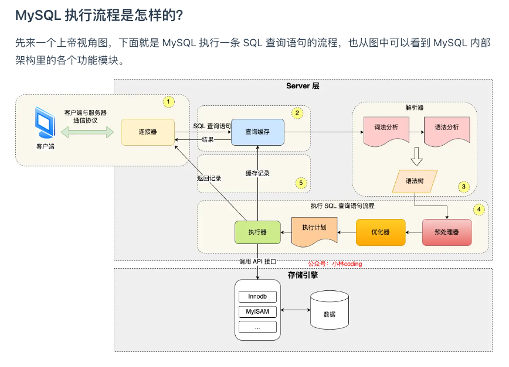


可以看到， MySQL 的架构共分为两层：**Server 层和存储引擎层**，

- **Server 层负责建立连接、分析和执行 SQL**。MySQL 大多数的核心功能模块都在这实现，主要包括连接器，查询缓存、解析器、预处理器、优化器、执行器等。另外，所有的内置函数（如日期、时间、数学和加密函数等）和所有跨存储引擎的功能（如存储过程、触发器、视图等。）都在 Server 层实现。
- **存储引擎层负责数据的存储和提取**。支持 InnoDB、MyISAM、Memory 等多个存储引擎，不同的存储引擎共用一个 Server 层。现在最常用的存储引擎是 InnoDB，从 MySQL 5.5 版本开始， InnoDB 成为了 MySQL 的默认存储引擎。我们常说的索引数据结构，就是由存储引擎层实现的，不同的存储引擎支持的索引类型也不相同，比如 InnoDB 支持索引类型是 B+树 ，且是默认使用，也就是说在数据表中创建的主键索引和二级索引默认使用的是 B+ 树索引。

好了，现在我们对 Server 层和存储引擎层有了一个简单认识，接下来，就详细说一条 SQL 查询语句的执行流程，依次看看每一个功能模块的作用。


### 第一步：连接器

如果你在 Linux 操作系统里要使用 MySQL，那你第一步肯定是要先连接 MySQL 服务，然后才能执行 SQL 语句，普遍我们都是使用下面这条命令进行连接：

```shell
# -h 指定 MySQL 服务得 IP 地址，如果是连接本地的 MySQL服务，可以不用这个参数；
# -u 指定用户名，管理员角色名为 root；
# -p 指定密码，如果命令行中不填写密码（为了密码安全，建议不要在命令行写密码），就需要在交互对话里面输入密码
mysql -h$ip -u$user -p
```

连接的过程需要先经过 TCP 三次握手，因为 MySQL 是基于 TCP 协议进行传输的，如果 MySQL 服务并没有启动，则会收到如下的报错：


如果 MySQL 服务正常运行，完成 TCP 连接的建立后，连接器就要开始验证你的用户名和密码，如果用户名或密码不对，就收到一个"Access denied for user"的错误，然后客户端程序结束执行。


如果用户密码都没有问题，连接器就会获取该用户的权限，然后保存起来，后续该用户在此连接里的任何操作，都会基于连接开始时读到的权限进行权限逻辑的判断。

所以，如果一个用户已经建立了连接，即使管理员中途修改了该用户的权限，也不会影响已经存在连接的权限。修改完成后，只有再新建的连接才会使用新的权限设置。

> 如何查看 MySQL 服务被多少个客户端连接了？

如果你想知道当前 MySQL 服务被多少个客户端连接了，你可以执行 `show processlist` 命令进行查看。

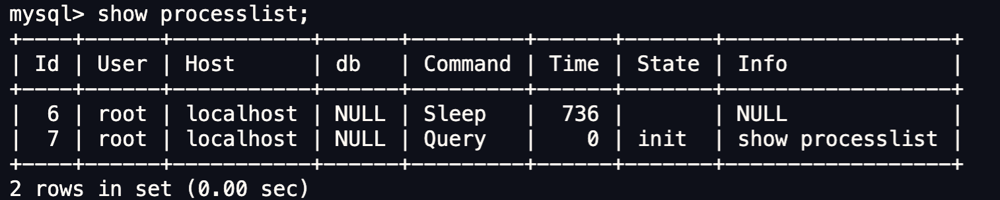

比如上图的显示结果，共有两个用户名为 root 的用户连接了 MySQL 服务，其中 id 为 6 的用户的 Command 列的状态为 `Sleep` ，这意味着该用户连接完 MySQL 服务就没有再执行过任何命令，也就是说这是一个空闲的连接，并且空闲的时长是 736 秒（ Time 列）。

> 空闲连接会一直占用着吗？

当然不是了，MySQL 定义了空闲连接的最大空闲时长，由 `wait_timeout` 参数控制的，默认值是 8 小时（28880秒），如果空闲连接超过了这个时间，连接器就会自动将它断开。


MySQL 的连接也跟 HTTP 一样，有短连接和长连接的概念，它们的区别如下：

```c
// 短连接
连接 mysql 服务（TCP 三次握手）
执行sql
断开 mysql 服务（TCP 四次挥手）

// 长连接
连接 mysql 服务（TCP 三次握手）
执行sql
执行sql
执行sql
....
断开 mysql 服务（TCP 四次挥手）
```

可以看到，使用长连接的好处就是可以减少建立连接和断开连接的过程，所以一般是推荐使用长连接。

但是，使用长连接后可能会占用内存增多，因为 MySQL 在执行查询过程中临时使用内存管理连接对象，这些连接对象资源只有在连接断开时才会释放。如果长连接累计很多，将导致 MySQL 服务占用内存太大，有可能会被系统强制杀掉，这样会发生 MySQL 服务异常重启的现象。

> 怎么解决长连接占用内存的问题？

有两种解决方式。

第一种，**定期断开长连接**。既然断开连接后就会释放连接占用的内存资源，那么我们可以定期断开长连接。

第二种，**客户端主动重置连接**。MySQL 5.7 版本实现了 `mysql_reset_connection()` 函数的接口，注意这是接口函数不是命令，那么当客户端执行了一个很大的操作后，在代码里调用 mysql_reset_connection 函数来重置连接，达到释放内存的效果。这个过程不需要重连和重新做权限验证，但是会将连接恢复到刚刚创建完时的状态。


### 第二步：查询缓存

连接器得工作完成后，客户端就可以向 MySQL 服务发送 SQL 语句了，MySQL 服务收到 SQL 语句后，就会解析出 SQL 语句的第一个字段，看看是什么类型的语句。

如果 SQL 是查询语句（select 语句），MySQL 就会先去查询缓存（ Query Cache ）里查找缓存数据，看看之前有没有执行过这一条命令，这个查询缓存是以 key-value 形式保存在内存中的，key 为 SQL 查询语句，value 为 SQL 语句查询的结果。

如果查询的语句命中查询缓存，那么就会直接返回 value 给客户端。如果查询的语句没有命中查询缓存中，那么就要往下继续执行，等执行完后，查询的结果就会被存入查询缓存中。

这么看，查询缓存还挺有用，但是其实**查询缓存挺鸡肋**的。

对于更新比较频繁的表，查询缓存的命中率很低的，因为只要一个表有更新操作，那么这个表的查询缓存就会被清空。如果刚缓存了一个查询结果很大的数据，还没被使用的时候，刚好这个表有更新操作，查询缓冲就被清空了，相当于缓存了个寂寞。

所以，MySQL 8.0 版本直接将查询缓存删掉了，也就是说 MySQL 8.0 开始，执行一条 SQL 查询语句，不会再走到查询缓存这个阶段了。

对于 MySQL 8.0 之前的版本，如果想关闭查询缓存，我们可以通过将参数 query_cache_type 设置成 DEMAND。

TIP:

这里说的查询缓存是 server 层的，也就是 MySQL 8.0 版本移除的是 server 层的查询缓存，并不是 Innodb 存储引擎中的 buffer pool。


### 第三步：解析 SQL

在正式执行 SQL 查询语句之前， MySQL 会先对 SQL 语句做解析，这个工作交由「解析器」来完成。

#### [#](https://xiaolincoding.com/mysql/base/how_select.html#解析器)解析器

解析器会做如下两件事情。

第一件事情，**词法分析**。MySQL 会根据你输入的字符串识别出关键字出来，例如，SQL语句 select username from userinfo，在分析之后，会得到4个Token，其中有2个Keyword，分别为select和from：

| 关键字 | 非关键字 | 关键字 | 非关键字 |
| ------ | -------- | ------ | -------- |
| select | username | from   | userinfo |

第二件事情，**语法分析**。根据词法分析的结果，语法解析器会根据语法规则，判断你输入的这个 SQL 语句是否满足 MySQL 语法，如果没问题就会构建出 SQL 语法树，这样方便后面模块获取 SQL 类型、表名、字段名、 where 条件等等。

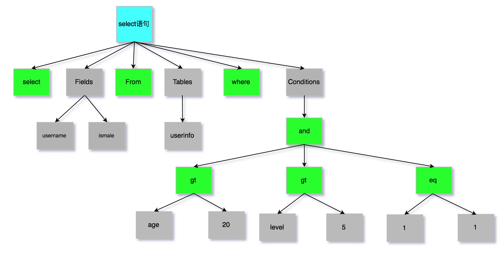

如果我们输入的 SQL 语句语法不对，就会在解析器这个阶段报错。比如，我下面这条查询语句，把 from 写成了 form，这时 MySQL 解析器就会给报错。

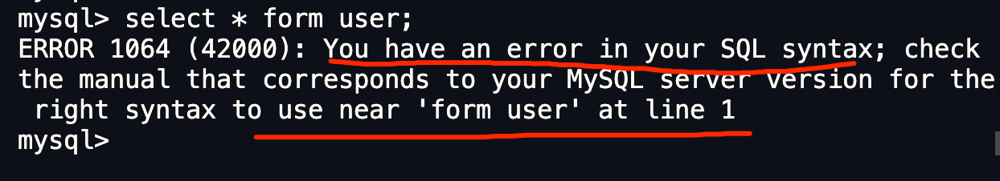

但是注意，表不存在或者字段不存在，并不是在解析器里做的，《MySQL 45 讲》说是在解析器做的，但是经过我和朋友看 MySQL 源码（5.7和8.0）得出结论是解析器只负责检查语法和构建语法树，但是不会去查表或者字段存不存在。

那到底谁来做检测表和字段是否存在的工作呢？别急，接下来就是了。


### 第四步：执行 SQL

经过解析器后，接着就要进入执行 SQL 查询语句的流程了，每条`SELECT` 查询语句流程主要可以分为下面这三个阶段：

- prepare 阶段，也就是预处理阶段；
- optimize 阶段，也就是优化阶段；
- execute 阶段，也就是执行阶段；

#### [#](https://xiaolincoding.com/mysql/base/how_select.html#预处理器)预处理器

我们先来说说预处理阶段做了什么事情。

- 检查 SQL 查询语句中的表或者字段是否存在；
- 将 `select *` 中的 `*` 符号，扩展为表上的所有列；

我下面这条查询语句，test 这张表是不存在的，这时 MySQL 就会在执行 SQL 查询语句的 prepare 阶段中报错。

```sql
mysql> select * from test;
ERROR 1146 (42S02): Table 'mysql.test' doesn't exist
```

这里贴个 MySQL 8.0 源码来证明表或字段是否存在的判断，不是在解析器里做的，而是在 prepare 阶段。（*PS：下图是公众号「一树一溪」老哥帮我分析的，这位老哥专门写 MySQL 源码文章，感兴趣的朋友，可以微信搜索关注*）

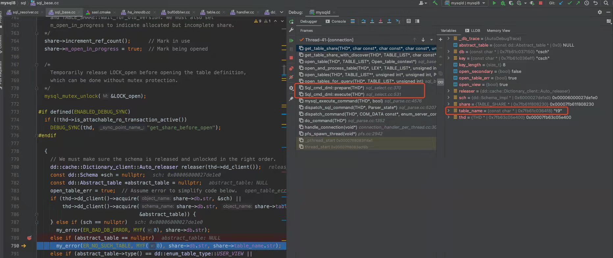

上面的中间部分是 MySQL 报错表不存在时的函数调用栈，可以看到表不存在的错误是在get_table_share() 函数里报错的，而这个函数是在 prepare 阶段调用的。

不过，对于 MySQL 5.7 判断表或字段是否存在的工作，是在词法分析&语法分析之后，prepare 阶段之前做的。结论都一样，不是在解析器里做的。代码我就不放了，正因为 MySQL 5.7 代码结构不好，所以 MySQL 8.0 代码结构变化很大，后来判断表或字段是否存在的工作就被放入到 prepare 阶段做了。

#### [#](https://xiaolincoding.com/mysql/base/how_select.html#优化器)优化器

经过预处理阶段后，还需要为 SQL 查询语句先制定一个执行计划，这个工作交由「优化器」来完成的。

**优化器主要负责将 SQL 查询语句的执行方案确定下来**，比如在表里面有多个索引的时候，优化器会基于查询成本的考虑，来决定选择使用哪个索引。

当然，我们本次的查询语句（select * from product where id = 1）很简单，就是选择使用主键索引。

要想知道优化器选择了哪个索引，我们可以在查询语句最前面加个 `explain` 命令，这样就会输出这条 SQL 语句的执行计划，然后执行计划中的 key 就表示执行过程中使用了哪个索引，比如下图的 key 为 `PRIMARY` 就是使用了主键索引。

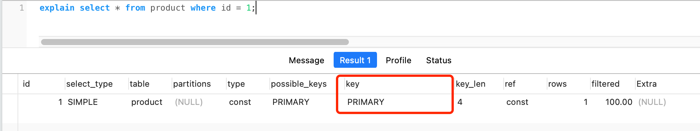

如果查询语句的执行计划里的 key 为 null 说明没有使用索引，那就会全表扫描（type = ALL），这种查询扫描的方式是效率最低档次的，如下图：

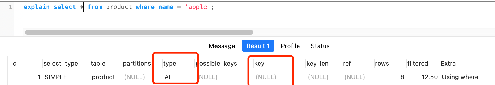

这张 product 表只有一个索引就是主键，现在我在表中将 name 设置为普通索引（二级索引）。

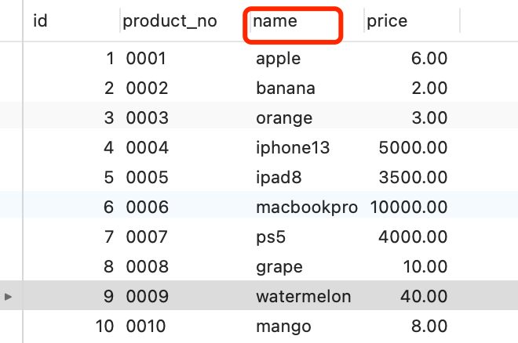

这时 product 表就有主键索引（id）和普通索引（name）。假设执行了这条查询语句：

```sql
select id from product where id > 1  and name like 'i%';
```

这条查询语句的结果既可以使用主键索引，也可以使用普通索引，但是执行的效率会不同。这时，就需要优化器来决定使用哪个索引了。

很显然这条查询语句是**覆盖索引**，直接在二级索引就能查找到结果（因为二级索引的 B+ 树的叶子节点的数据存储的是主键值），就没必要在主键索引查找了，因为查询主键索引的 B+ 树的成本会比查询二级索引的 B+ 的成本大，优化器基于查询成本的考虑，会选择查询代价小的普通索引。

在下图中执行计划，我们可以看到，执行过程中使用了普通索引（name），Exta 为 Using index，这就是表明使用了覆盖索引优化。

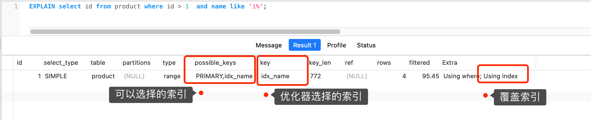

#### [#](https://xiaolincoding.com/mysql/base/how_select.html#执行器)执行器

经历完优化器后，就确定了执行方案，接下来 MySQL 就真正开始执行语句了，这个工作是由「执行器」完成的。在执行的过程中，执行器就会和存储引擎交互了，交互是以记录为单位的。

接下来，用三种方式执行过程，跟大家说一下执行器和存储引擎的交互过程（PS ：为了写好这一部分，特地去看 MySQL 源码，也是第一次看哈哈）。

- 主键索引查询
- 全表扫描
- 索引下推

##### [#](https://xiaolincoding.com/mysql/base/how_select.html#主键索引查询)主键索引查询

以本文开头查询语句为例，看看执行器是怎么工作的。

```sql
select * from product where id = 1;
```

这条查询语句的查询条件用到了主键索引，而且是等值查询，同时主键 id 是唯一，不会有 id 相同的记录，所以优化器决定选用访问类型为 const 进行查询，也就是使用主键索引查询一条记录，那么执行器与存储引擎的执行流程是这样的：

- 执行器第一次查询，会调用 read_first_record 函数指针指向的函数，因为优化器选择的访问类型为 const，这个函数指针被指向为 InnoDB 引擎索引查询的接口，把条件 `id = 1` 交给存储引擎，**让存储引擎定位符合条件的第一条记录**。
- 存储引擎通过主键索引的 B+ 树结构定位到 id = 1的第一条记录，如果记录是不存在的，就会向执行器上报记录找不到的错误，然后查询结束。如果记录是存在的，就会将记录返回给执行器；
- 执行器从存储引擎读到记录后，接着判断记录是否符合查询条件，如果符合则发送给客户端，如果不符合则跳过该记录。
- 执行器查询的过程是一个 while 循环，所以还会再查一次，但是这次因为不是第一次查询了，所以会调用 read_record 函数指针指向的函数，因为优化器选择的访问类型为 const，这个函数指针被指向为一个永远返回 - 1 的函数，所以当调用该函数的时候，执行器就退出循环，也就是结束查询了。

至此，这个语句就执行完成了。

##### [#](https://xiaolincoding.com/mysql/base/how_select.html#全表扫描)全表扫描

举个全表扫描的例子：

```text
select * from product where name = 'iphone';
```

这条查询语句的查询条件没有用到索引，所以优化器决定选用访问类型为 ALL 进行查询，也就是全表扫描的方式查询，那么这时执行器与存储引擎的执行流程是这样的：

- 执行器第一次查询，会调用 read_first_record 函数指针指向的函数，因为优化器选择的访问类型为 all，这个函数指针被指向为 InnoDB 引擎全扫描的接口，**让存储引擎读取表中的第一条记录**；
- 执行器会判断读到的这条记录的 name 是不是 iphone，如果不是则跳过；如果是则将记录发给客户的（是的没错，Server 层每从存储引擎读到一条记录就会发送给客户端，之所以客户端显示的时候是直接显示所有记录的，是因为客户端是等查询语句查询完成后，才会显示出所有的记录）。
- 执行器查询的过程是一个 while 循环，所以还会再查一次，会调用 read_record 函数指针指向的函数，因为优化器选择的访问类型为 all，read_record 函数指针指向的还是 InnoDB 引擎全扫描的接口，所以接着向存储引擎层要求继续读刚才那条记录的下一条记录，存储引擎把下一条记录取出后就将其返回给执行器（Server层），执行器继续判断条件，不符合查询条件即跳过该记录，否则发送到客户端；
- 一直重复上述过程，直到存储引擎把表中的所有记录读完，然后向执行器（Server层） 返回了读取完毕的信息；
- 执行器收到存储引擎报告的查询完毕的信息，退出循环，停止查询。

至此，这个语句就执行完成了。

##### [#](https://xiaolincoding.com/mysql/base/how_select.html#索引下推)索引下推

在这部分非常适合讲索引下推（MySQL 5.6 推出的查询优化策略），这样大家能清楚的知道，「下推」这个动作，下推到了哪里。

索引下推能够减少**二级索引**在查询时的回表操作，提高查询的效率，因为它将 Server 层部分负责的事情，交给存储引擎层去处理了。

举一个具体的例子，方便大家理解，这里一张用户表如下，我对 age 和 reward 字段建立了联合索引（age，reward）：

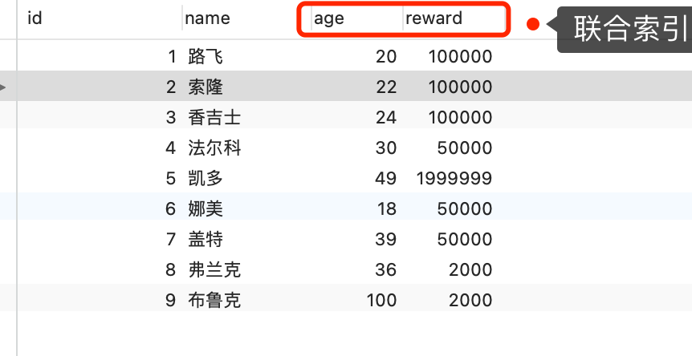

现在有下面这条查询语句：

```sql
select * from t_user  where age > 20 and reward = 100000;
```

联合索引当遇到范围查询 (>、<) 就会停止匹配，也就是 **age 字段能用到联合索引，但是 reward 字段则无法利用到索引**。具体原因这里可以看这篇：[索引常见面试题(opens new window)](https://xiaolincoding.com/mysql/index/index_interview.html#按字段个数分类)

那么，不使用索引下推（MySQL 5.6 之前的版本）时，执行器与存储引擎的执行流程是这样的：

- Server 层首先调用存储引擎的接口定位到满足查询条件的第一条二级索引记录，也就是定位到 age > 20 的第一条记录；
- 存储引擎根据二级索引的 B+ 树快速定位到这条记录后，获取主键值，然后**进行回表操作**，将完整的记录返回给 Server 层；
- Server 层在判断该记录的 reward 是否等于 100000，如果成立则将其发送给客户端；否则跳过该记录；
- 接着，继续向存储引擎索要下一条记录，存储引擎在二级索引定位到记录后，获取主键值，然后回表操作，将完整的记录返回给 Server 层；
- 如此往复，直到存储引擎把表中的所有记录读完。

可以看到，没有索引下推的时候，每查询到一条二级索引记录，都要进行回表操作，然后将记录返回给 Server，接着 Server 再判断该记录的 reward 是否等于 100000。

而使用索引下推后，判断记录的 reward 是否等于 100000 的工作交给了存储引擎层，过程如下 ：

- Server 层首先调用存储引擎的接口定位到满足查询条件的第一条二级索引记录，也就是定位到 age > 20 的第一条记录；
- 存储引擎定位到二级索引后，**先不执行回表**操作，而是先判断一下该索引中包含的列（reward列）的条件（reward 是否等于 100000）是否成立。如果**条件不成立**，则直接**跳过该二级索引**。如果**成立**，则**执行回表**操作，将完成记录返回给 Server 层。
- Server 层在判断其他的查询条件（本次查询没有其他条件）是否成立，如果成立则将其发送给客户端；否则跳过该记录，然后向存储引擎索要下一条记录。
- 如此往复，直到存储引擎把表中的所有记录读完。

可以看到，使用了索引下推后，虽然 reward 列无法使用到联合索引，但是因为它包含在联合索引（age，reward）里，所以直接在存储引擎过滤出满足 reward = 100000 的记录后，才去执行回表操作获取整个记录。相比于没有使用索引下推，节省了很多回表操作。

当你发现执行计划里的 Extr 部分显示了 “Using index condition”，说明使用了索引下推。

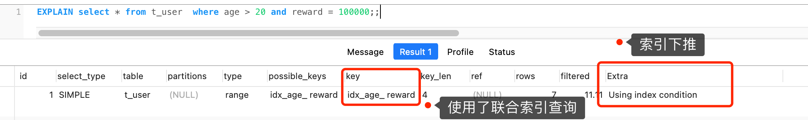

------

总结

执行一条 SQL 查询语句，期间发生了什么？

- 连接器：建立连接，管理连接、校验用户身份；
- 查询缓存：查询语句如果命中查询缓存则直接返回，否则继续往下执行。MySQL 8.0 已删除该模块；
- 解析 SQL，通过解析器对 SQL 查询语句进行词法分析、语法分析，然后构建语法树，方便后续模块读取表名、字段、语句类型；
- 执行 SQL：执行 SQL 共有三个阶段：
  - 预处理阶段：检查表或字段是否存在；将 `select *` 中的 `*` 符号扩展为表上的所有列。
  - 优化阶段：基于查询成本的考虑， 选择查询成本最小的执行计划；
  - 执行阶段：根据执行计划执行 SQL 查询语句，从存储引擎读取记录，返回给客户端；

怎么样？现在再看这张图，是不是很清晰了。

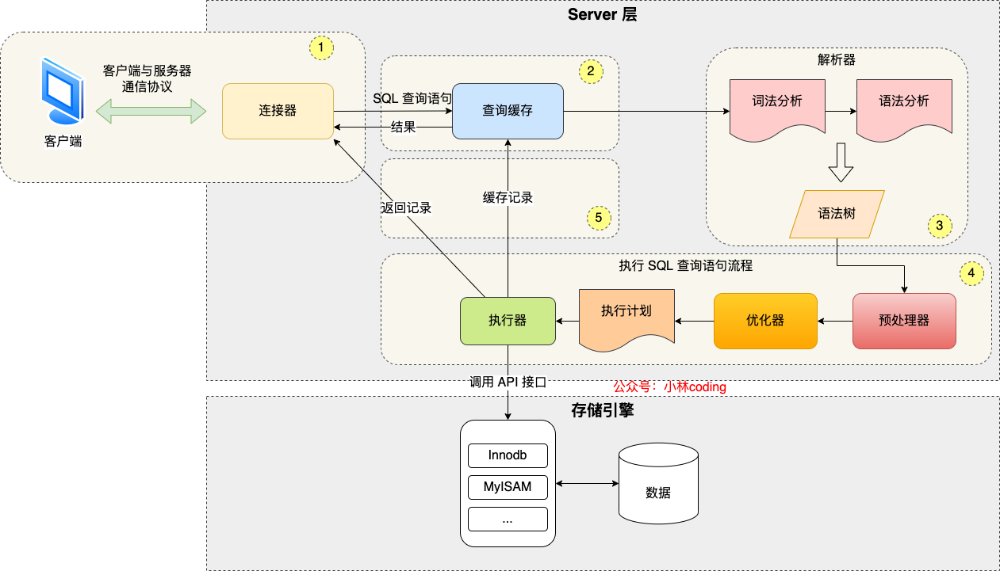

完！


## MySQL 一行记录是怎么存储的？


### 表空间文件的结构是怎么样的？

**表空间由段（segment）、区（extent）、页（page）、行（row）组成**，InnoDB存储引擎的逻辑存储结构大致如下图：

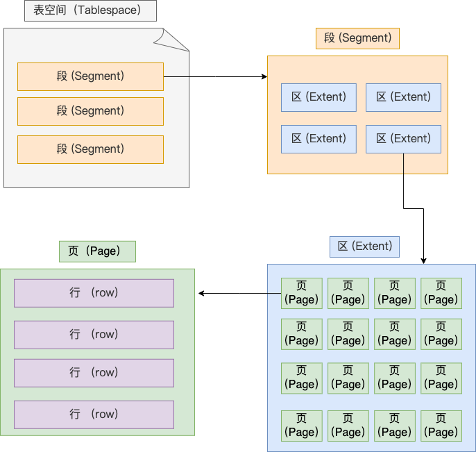

下面我们从下往上一个个看看。

#### [#](https://xiaolincoding.com/mysql/base/row_format.html#_1、行-row)1、行（row）

数据库表中的记录都是按行（row）进行存放的，每行记录根据不同的行格式，有不同的存储结构。

后面我们详细介绍 InnoDB 存储引擎的行格式，也是本文重点介绍的内容。

#### [#](https://xiaolincoding.com/mysql/base/row_format.html#_2、页-page)2、页（page）

记录是按照行来存储的，但是数据库的读取并不以「行」为单位，否则一次读取（也就是一次 I/O 操作）只能处理一行数据，效率会非常低。

因此，**InnoDB 的数据是按「页」为单位来读写的**，也就是说，当需要读一条记录的时候，并不是将这个行记录从磁盘读出来，而是以页为单位，将其整体读入内存。

**默认每个页的大小为 16KB**，也就是最多能保证 16KB 的连续存储空间。

页是 InnoDB 存储引擎磁盘管理的最小单元，意味着数据库每次读写都是以 16KB 为单位的，一次最少从磁盘中读取 16K 的内容到内存中，一次最少把内存中的 16K 内容刷新到磁盘中。

页的类型有很多，常见的有数据页、undo 日志页、溢出页等等。数据表中的行记录是用「数据页」来管理的，数据页的结构这里我就不讲细说了，之前文章有说过，感兴趣的可以去看这篇文章：[换一个角度看 B+ 树(opens new window)](https://xiaolincoding.com/mysql/index/page.html)

总之知道表中的记录存储在「数据页」里面就行。

#### [#](https://xiaolincoding.com/mysql/base/row_format.html#_3、区-extent)3、区（extent）

我们知道 InnoDB 存储引擎是用 B+ 树来组织数据的。

B+ 树中每一层都是通过双向链表连接起来的，如果是以页为单位来分配存储空间，那么链表中相邻的两个页之间的物理位置并不是连续的，可能离得非常远，那么磁盘查询时就会有大量的随机I/O，随机 I/O 是非常慢的。

解决这个问题也很简单，就是让链表中相邻的页的物理位置也相邻，这样就可以使用顺序 I/O 了，那么在范围查询（扫描叶子节点）的时候性能就会很高。

那具体怎么解决呢？

**在表中数据量大的时候，为某个索引分配空间的时候就不再按照页为单位分配了，而是按照区（extent）为单位分配。每个区的大小为 1MB，对于 16KB 的页来说，连续的 64 个页会被划为一个区，这样就使得链表中相邻的页的物理位置也相邻，就能使用顺序 I/O 了**。

#### [#](https://xiaolincoding.com/mysql/base/row_format.html#_4、段-segment)4、段（segment）

表空间是由各个段（segment）组成的，段是由多个区（extent）组成的。段一般分为数据段、索引段和回滚段等。

- 索引段：存放 B + 树的非叶子节点的区的集合；
- 数据段：存放 B + 树的叶子节点的区的集合；
- 回滚段：存放的是回滚数据的区的集合，之前讲[事务隔离 (opens new window)](https://xiaolincoding.com/mysql/transaction/mvcc.html)的时候就介绍到了 MVCC 利用了回滚段实现了多版本查询数据。

好了，终于说完表空间的结构了。接下来，就具体讲一下 InnoDB 的行格式了。

之所以要绕一大圈才讲行记录的格式，主要是想让大家知道行记录是存储在哪个文件，以及行记录在这个表空间文件中的哪个区域，有一个从上往下切入的视角，这样理解起来不会觉得很抽象。

### InnoDB 行格式有哪些？

行格式（row_format），就是一条记录的存储结构。

InnoDB 提供了 4 种行格式，分别是 Redundant、Compact、Dynamic和 Compressed 行格式。

- Redundant 是很古老的行格式了， MySQL 5.0 版本之前用的行格式，现在基本没人用了。
- 由于 Redundant 不是一种紧凑的行格式，所以 MySQL 5.0 之后引入了 Compact 行记录存储方式，Compact 是一种紧凑的行格式，设计的初衷就是为了让一个数据页中可以存放更多的行记录，从 MySQL 5.1 版本之后，行格式默认设置成 Compact。
- Dynamic 和 Compressed 两个都是紧凑的行格式，它们的行格式都和 Compact 差不多，因为都是基于 Compact 改进一点东西。从 MySQL5.7 版本之后，默认使用 Dynamic 行格式。

Redundant 行格式我这里就不讲了，因为现在基本没人用了，这次重点介绍 Compact 行格式，因为 Dynamic 和 Compressed 这两个行格式跟 Compact 非常像。

所以，弄懂了 Compact 行格式，之后你们在去了解其他行格式，很快也能看懂。

### [#](https://xiaolincoding.com/mysql/base/row_format.html#compact-行格式长什么样)COMPACT 行格式长什么样？

先跟 Compact 行格式混个脸熟，它长这样：

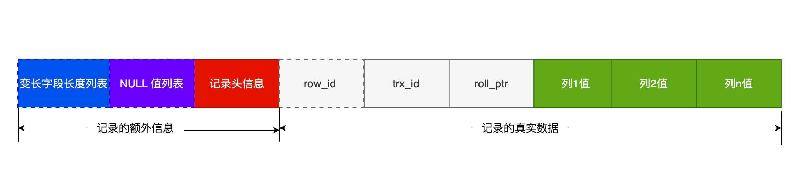

可以看到，一条完整的记录分为「记录的额外信息」和「记录的真实数据」两个部分。

接下里，分别详细说下。

### [#](https://xiaolincoding.com/mysql/base/row_format.html#记录的额外信息)记录的额外信息

记录的额外信息包含 3 个部分：变长字段长度列表、NULL 值列表、记录头信息。

#### [#](https://xiaolincoding.com/mysql/base/row_format.html#_1-变长字段长度列表)1. 变长字段长度列表

varchar(n) 和 char(n) 的区别是什么，相信大家都非常清楚，char 是定长的，varchar 是变长的，变长字段实际存储的数据的长度（大小）不固定的。

所以，在存储数据的时候，也要把数据占用的大小存起来，存到「变长字段长度列表」里面，读取数据的时候才能根据这个「变长字段长度列表」去读取对应长度的数据。其他 TEXT、BLOB 等变长字段也是这么实现的。

为了展示「变长字段长度列表」具体是怎么保存「变长字段的真实数据占用的字节数」，我们先创建这样一张表，字符集是 ascii（所以每一个字符占用的 1 字节），行格式是 Compact，t_user 表中 name 和 phone 字段都是变长字段：

```sql
CREATE TABLE `t_user` (
  `id` int(11) NOT NULL,
  `name` VARCHAR(20) DEFAULT NULL,
  `phone` VARCHAR(20) DEFAULT NULL,
  `age` int(11) DEFAULT NULL,
  PRIMARY KEY (`id`) USING BTREE
) ENGINE = InnoDB DEFAULT CHARACTER SET = ascii ROW_FORMAT = COMPACT;
```

现在 t_user 表里有这三条记录：

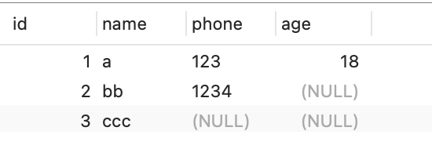

接下来，我们看看看看这三条记录的行格式中的 「变长字段长度列表」是怎样存储的。

先来看第一条记录：

- name 列的值为 a，真实数据占用的字节数是 1 字节，十六进制 0x01；
- phone 列的值为 123，真实数据占用的字节数是 3 字节，十六进制 0x03；
- age 列和 id 列不是变长字段，所以这里不用管。

这些变长字段的真实数据占用的字节数会按照列的顺序**逆序存放**（等下会说为什么要这么设计），所以「变长字段长度列表」里的内容是「 03 01」，而不是 「01 03」。

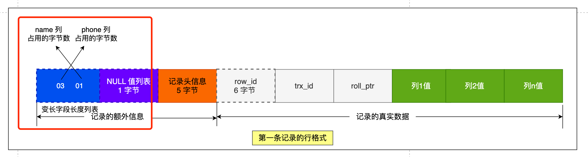

同样的道理，我们也可以得出**第二条记录**的行格式中，「变长字段长度列表」里的内容是「 04 02」，如下图：

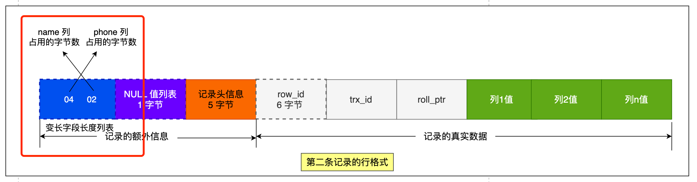

**第三条记录**中 phone 列的值是 NULL，**NULL 是不会存放在行格式中记录的真实数据部分里的**，所以「变长字段长度列表」里不需要保存值为 NULL 的变长字段的长度。

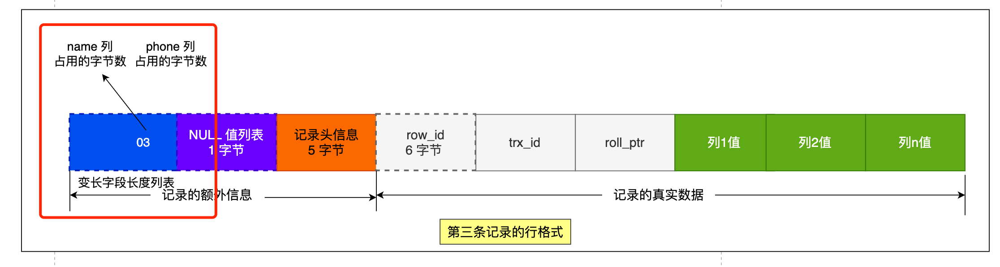

> 为什么「变长字段长度列表」的信息要按照逆序存放？

这个设计是有想法的，主要是因为「记录头信息」中指向下一个记录的指针，指向的是下一条记录的「记录头信息」和「真实数据」之间的位置，这样的好处是向左读就是记录头信息，向右读就是真实数据，比较方便。

「变长字段长度列表」中的信息之所以要逆序存放，是因为这样可以**使得位置靠前的记录的真实数据和数据对应的字段长度信息可以同时在一个 CPU Cache Line 中，这样就可以提高 CPU Cache 的命中率**。

同样的道理， NULL 值列表的信息也需要逆序存放。

如果你不知道什么是 CPU Cache，可以看[这篇文章 (opens new window)](https://xiaolincoding.com/os/1_hardware/how_to_make_cpu_run_faster.html)，这属于计算机组成的知识。

> 每个数据库表的行格式都有「变长字段字节数列表」吗？

其实变长字段字节数列表不是必须的。

**当数据表没有变长字段的时候，比如全部都是 int 类型的字段，这时候表里的行格式就不会有「变长字段长度列表」了**，因为没必要，不如去掉以节省空间。

所以「变长字段长度列表」只出现在数据表有变长字段的时候。

#### [#](https://xiaolincoding.com/mysql/base/row_format.html#_2-null-值列表)2. NULL 值列表

表中的某些列可能会存储 NULL 值，如果把这些 NULL 值都放到记录的真实数据中会比较浪费空间，所以 Compact 行格式把这些值为 NULL 的列存储到 NULL值列表中。

如果存在允许 NULL 值的列，则每个列对应一个二进制位（bit），二进制位按照列的顺序逆序排列。

- 二进制位的值为`1`时，代表该列的值为NULL。
- 二进制位的值为`0`时，代表该列的值不为NULL。

另外，NULL 值列表必须用整数个字节的位表示（1字节8位），如果使用的二进制位个数不足整数个字节，则在字节的高位补 `0`。

还是以 t_user 表的这三条记录作为例子：


接下来，我们看看看看这三条记录的行格式中的 NULL 值列表是怎样存储的。

先来看**第一条记录**，第一条记录所有列都有值，不存在 NULL 值，所以用二进制来表示是酱紫的：

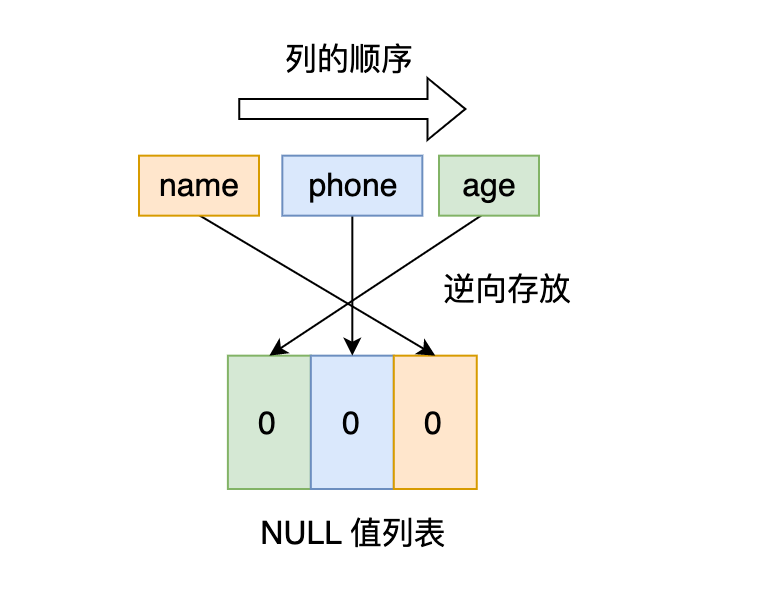

但是 InnoDB 是用整数字节的二进制位来表示 NULL 值列表的，现在不足 8 位，所以要在高位补 0，最终用二进制来表示是酱紫的：

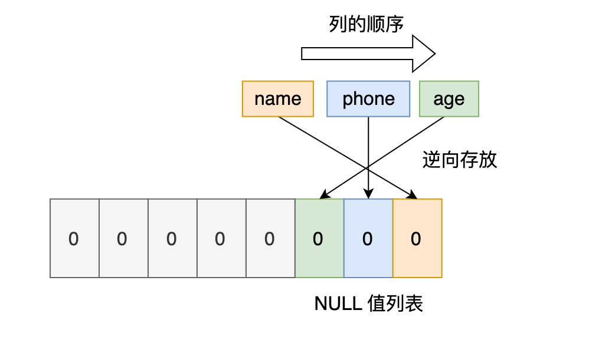

所以，对于第一条数据，NULL 值列表用十六进制表示是 0x00。

接下来看**第二条记录**，第二条记录 age 列是 NULL 值，所以，对于第二条数据，NULL值列表用十六进制表示是 0x04。

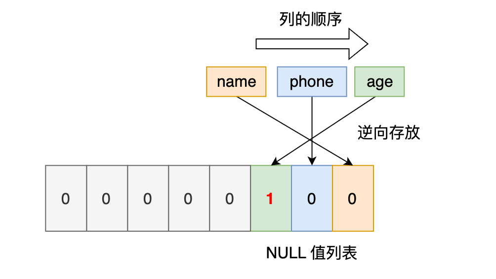

最后**第三条记录**，第三条记录 phone 列 和 age 列是 NULL 值，所以，对于第三条数据，NULL 值列表用十六进制表示是 0x06。

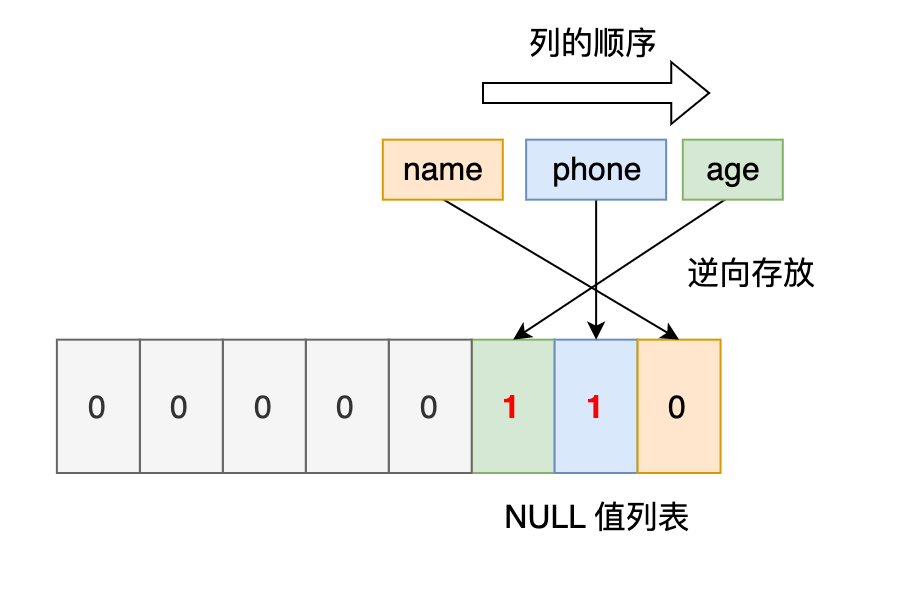

我们把三条记录的 NULL 值列表都填充完毕后，它们的行格式是这样的：

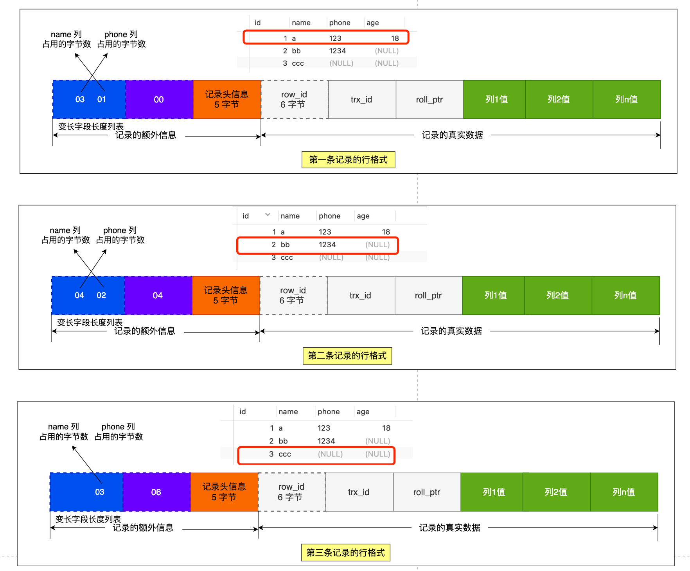

> 每个数据库表的行格式都有「NULL 值列表」吗？

NULL 值列表也不是必须的。

**当数据表的字段都定义成 NOT NULL 的时候，这时候表里的行格式就不会有 NULL 值列表了**。

所以在设计数据库表的时候，通常都是建议将字段设置为 NOT NULL，这样可以至少节省 1 字节的空间（NULL 值列表至少占用 1 字节空间）。

--rdg:-- 此段错误,比如 varchar 类型的如果是 not null , 那么存储空字符串,也需要记录变长字段长度,那么就需要一个字节,此外对 name != "" 的查询效率, 比 name is not null 的效率会低很多;

> 「NULL 值列表」是固定 1 字节空间吗？如果这样的话，一条记录有 9 个字段值都是 NULL，这时候怎么表示？

「NULL 值列表」的空间不是固定 1 字节的。

当一条记录有 9 个字段值都是 NULL，那么就会创建 2 字节空间的「NULL 值列表」，以此类推。

#### [#](https://xiaolincoding.com/mysql/base/row_format.html#_3-记录头信息)3. 记录头信息

记录头信息中包含的内容很多，我就不一一列举了，这里说几个比较重要的：

- delete_mask ：标识此条数据是否被删除。从这里可以知道，我们执行 detele 删除记录的时候，并不会真正的删除记录，只是将这个记录的 delete_mask 标记为 1。
- next_record：下一条记录的位置。从这里可以知道，记录与记录之间是通过链表组织的。在前面我也提到了，指向的是下一条记录的「记录头信息」和「真实数据」之间的位置，这样的好处是向左读就是记录头信息，向右读就是真实数据，比较方便。
- record_type：表示当前记录的类型，0表示普通记录，1表示B+树非叶子节点记录，2表示最小记录，3表示最大记录

### [#](https://xiaolincoding.com/mysql/base/row_format.html#记录的真实数据)记录的真实数据

记录真实数据部分除了我们定义的字段，还有三个隐藏字段，分别为：row_id、trx_id、roll_pointer，我们来看下这三个字段是什么。

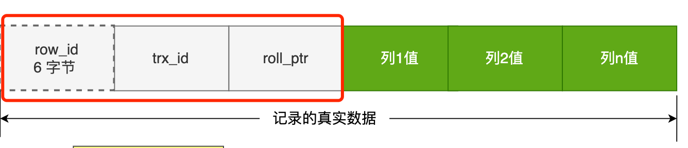

- row_id

如果我们建表的时候指定了主键或者唯一约束列，那么就没有 row_id 隐藏字段了。如果既没有指定主键，又没有唯一约束，那么 InnoDB 就会为记录添加 row_id 隐藏字段。row_id不是必需的，占用 6 个字节。

- trx_id

事务id，表示这个数据是由哪个事务生成的。 trx_id是必需的，占用 6 个字节。

- roll_pointer

这条记录上一个版本的指针。roll_pointer 是必需的，占用 7 个字节。

如果你熟悉 MVCC 机制，你应该就清楚 trx_id 和 roll_pointer 的作用了，如果你还不知道 MVCC 机制，可以看完[这篇文章 (opens new window)](https://xiaolincoding.com/mysql/transaction/mvcc.html)，一定要掌握，面试也很经常问 MVCC 是怎么实现的。

### varchar(n) 中 n 最大取值为多少？

我们要清楚一点，**MySQL 规定除了 TEXT、BLOBs 这种大对象类型之外，其他所有的列（不包括隐藏列和记录头信息）占用的字节长度加起来不能超过 65535 个字节**。

也就是说，一行记录除了 TEXT、BLOBs 类型的列，限制最大为 65535 字节，注意是一行的总长度，不是一列。

知道了这个前提之后，我们再来看看这个问题：「varchar(n) 中 n 最大取值为多少？」

varchar(n) 字段类型的 n 代表的是最多存储的字符数量，并不是字节大小哦。

要算 varchar(n) 最大能允许存储的字节数，还要看数据库表的字符集，因为字符集代表着，1个字符要占用多少字节，比如 ascii 字符集， 1 个字符占用 1 字节，那么 varchar(100) 意味着最大能允许存储 100 字节的数据。

### [#](https://xiaolincoding.com/mysql/base/row_format.html#单字段的情况)单字段的情况

前面我们知道了，一行记录最大只能存储 65535 字节的数据。

那假设数据库表只有一个 varchar(n) 类型的列且字符集是 ascii，在这种情况下， varchar(n) 中 n 最大取值是 65535 吗？

不着急说结论，我们先来做个实验验证一下。

我们定义一个 varchar(65535) 类型的字段，字符集为 ascii 的数据库表。

```sql
CREATE TABLE test ( 
`name` VARCHAR(65535)  NULL
) ENGINE = InnoDB DEFAULT CHARACTER SET = ascii ROW_FORMAT = COMPACT;
```

看能不能成功创建一张表：

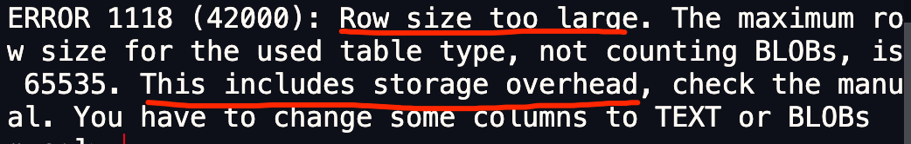

可以看到，创建失败了。

从报错信息就可以知道**一行数据的最大字节数是 65535（不包含 TEXT、BLOBs 这种大对象类型），其中包含了 storage overhead**。

问题来了，这个 storage overhead 是什么呢？其实就是「变长字段长度列表」和 「NULL 值列表」，也就是说**一行数据的最大字节数 65535，其实是包含「变长字段长度列表」和 「NULL 值列表」所占用的字节数的**。所以， 我们在算 varchar(n) 中 n 最大值时，需要减去 storage overhead 占用的字节数。

这是因为我们存储字段类型为 varchar(n) 的数据时，其实分成了三个部分来存储：

- 真实数据
- 真实数据占用的字节数
- NULL 标识，如果不允许为NULL，这部分不需要

> 本次案例中，「NULL 值列表」所占用的字节数是多少？

前面我创建表的时候，字段是允许为 NULL 的，所以**会用 1 字节来表示「NULL 值列表」**。

> 本次案例中，「变长字段长度列表」所占用的字节数是多少？

「变长字段长度列表」所占用的字节数 = 所有「变长字段长度」占用的字节数之和。

所以，我们要先知道每个变长字段的「变长字段长度」需要用多少字节表示？具体情况分为：

- 条件一：如果变长字段允许存储的最大字节数小于等于 255 字节，就会用 1 字节表示「变长字段长度」；
- 条件二：如果变长字段允许存储的最大字节数大于 255 字节，就会用 2 字节表示「变长字段长度」；

我们这里字段类型是 varchar(65535) ，字符集是 ascii，所以代表着变长字段允许存储的最大字节数是 65535，符合条件二，所以会用 2 字节来表示「变长字段长度」。

**因为我们这个案例是只有 1 个变长字段，所以「变长字段长度列表」= 1 个「变长字段长度」占用的字节数，也就是 2 字节**。

因为我们在算 varchar(n) 中 n 最大值时，需要减去 「变长字段长度列表」和 「NULL 值列表」所占用的字节数的。所以，**在数据库表只有一个 varchar(n) 字段且字符集是 ascii 的情况下，varchar(n) 中 n 最大值 = 65535 - 2 - 1 = 65532**。

我们先来测试看看 varchar(65533) 是否可行？

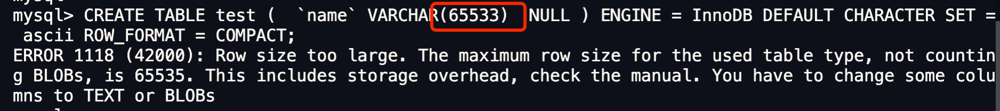

可以看到，还是不行，接下来看看 varchar(65532) 是否可行？

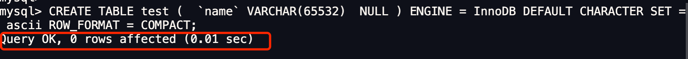

可以看到，创建成功了。说明我们的推论是正确的，在算 varchar(n) 中 n 最大值时，需要减去 「变长字段长度列表」和 「NULL 值列表」所占用的字节数的。

当然，我上面这个例子是针对字符集为 ascii 情况，如果采用的是 UTF-8，varchar(n) 最多能存储的数据计算方式就不一样了：

- 在 UTF-8 字符集下，一个字符最多需要三个字节，varchar(n) 的 n 最大取值就是 65532/3 = 21844。

上面所说的只是针对于一个字段的计算方式。

### [#](https://xiaolincoding.com/mysql/base/row_format.html#多字段的情况)多字段的情况

**如果有多个字段的话，要保证所有字段的长度 + 变长字段字节数列表所占用的字节数 + NULL值列表所占用的字节数 <= 65535**。

这里举个多字段的情况的例子（感谢@Emoji同学提供的例子）

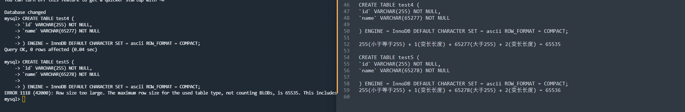

### [#](https://xiaolincoding.com/mysql/base/row_format.html#行溢出后-mysql-是怎么处理的)行溢出后，MySQL 是怎么处理的？

MySQL 中磁盘和内存交互的基本单位是页，一个页的大小一般是 `16KB`，也就是 `16384字节`，而一个 varchar(n) 类型的列最多可以存储 `65532字节`，一些大对象如 TEXT、BLOB 可能存储更多的数据，这时一个页可能就存不了一条记录。这个时候就会**发生行溢出，多的数据就会存到另外的「溢出页」中**。

如果一个数据页存不了一条记录，InnoDB 存储引擎会自动将溢出的数据存放到「溢出页」中。在一般情况下，InnoDB 的数据都是存放在 「数据页」中。但是当发生行溢出时，溢出的数据会存放到「溢出页」中。

当发生行溢出时，在记录的真实数据处只会保存该列的一部分数据，而把剩余的数据放在「溢出页」中，然后真实数据处用 20 字节存储指向溢出页的地址，从而可以找到剩余数据所在的页。大致如下图所示。

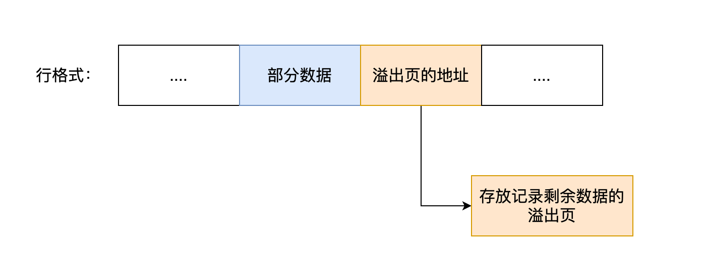

上面这个是 Compact 行格式在发生行溢出后的处理。

Compressed 和 Dynamic 这两个行格式和 Compact 非常类似，主要的区别在于处理行溢出数据时有些区别。

这两种格式采用完全的行溢出方式，记录的真实数据处不会存储该列的一部分数据，只存储 20 个字节的指针来指向溢出页。而实际的数据都存储在溢出页中，看起来就像下面这样：

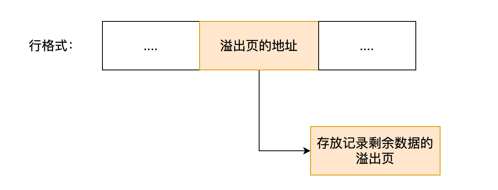

### [#](https://xiaolincoding.com/mysql/base/row_format.html#总结)总结

> MySQL 的 NULL 值是怎么存放的？

MySQL 的 Compact 行格式中会用「NULL值列表」来标记值为 NULL 的列，NULL 值并不会存储在行格式中的真实数据部分。

NULL值列表会占用 1 字节空间，当表中所有字段都定义成 NOT NULL，行格式中就不会有 NULL值列表，这样可节省 1 字节的空间。

> MySQL 怎么知道 varchar(n) 实际占用数据的大小？

MySQL 的 Compact 行格式中会用「变长字段长度列表」存储变长字段实际占用的数据大小。

> varchar(n) 中 n 最大取值为多少？

一行记录最大能存储 65535 字节的数据，但是这个是包含「变长字段字节数列表所占用的字节数」和「NULL值列表所占用的字节数」。所以， 我们在算 varchar(n) 中 n 最大值时，需要减去这两个列表所占用的字节数。

如果一张表只有一个 varchar(n) 字段，且允许为 NULL，字符集为 ascii。varchar(n) 中 n 最大取值为 65532。

计算公式：65535 - 变长字段字节数列表所占用的字节数 - NULL值列表所占用的字节数 = 65535 - 2 - 1 = 65532。

如果有多个字段的话，要保证所有字段的长度 + 变长字段字节数列表所占用的字节数 + NULL值列表所占用的字节数 <= 65535。

> 行溢出后，MySQL 是怎么处理的？

如果一个数据页存不了一条记录，InnoDB 存储引擎会自动将溢出的数据存放到「溢出页」中。

Compact 行格式针对行溢出的处理是这样的：当发生行溢出时，在记录的真实数据处只会保存该列的一部分数据，而把剩余的数据放在「溢出页」中，然后真实数据处用 20 字节存储指向溢出页的地址，从而可以找到剩余数据所在的页。

Compressed 和 Dynamic 这两种格式采用完全的行溢出方式，记录的真实数据处不会存储该列的一部分数据，只存储 20 个字节的指针来指向溢出页。而实际的数据都存储在溢出页中。


# 索引篇


**什么是树形结构？**

树形结构（Tree Structure）是一种 **分层数据的抽象模型**，由节点（Node）和边（Edge）组成，满足以下条件：

- **根节点（Root）**：唯一没有父节点的节点。

- **子节点（Child）**：每个节点可以有多个子节点。

- **叶子节点（Leaf）**：没有子节点的节点。

- **层级关系**：除了根节点，其他节点有且仅有一个父节点。

  


## 索引常见面试题


#### 索引区分度

另外，建立联合索引时的字段顺序，对索引效率也有很大影响。越靠前的字段被用于索引过滤的概率越高，实际开发工作中**建立联合索引时，要把区分度大的字段排在前面，这样区分度大的字段越有可能被更多的 SQL 使用到**。

区分度就是某个字段 column 不同值的个数「除以」表的总行数，计算公式如下：


比如，性别的区分度就很小，不适合建立索引或不适合排在联合索引列的靠前的位置，而 UUID 这类字段就比较适合做索引或排在联合索引列的靠前的位置。

因为如果索引的区分度很小，假设字段的值分布均匀，那么无论搜索哪个值都可能得到一半的数据。在这些情况下，还不如不要索引，因为 MySQL 还有一个查询优化器，查询优化器发现某个值出现在表的数据行中的百分比（惯用的百分比界线是"30%"）很高的时候，它一般会忽略索引，进行全表扫描。

##### [#](https://xiaolincoding.com/mysql/index/index_interview.html#联合索引进行排序)联合索引进行排序

这里出一个题目，针对针对下面这条 SQL，你怎么通过索引来提高查询效率呢？

```sql
select * from order where status = 1 order by create_time asc
```

有的同学会认为，单独给 status 建立一个索引就可以了。

但是更好的方式给 status 和 create_time 列建立一个联合索引，因为这样可以避免 MySQL 数据库发生文件排序。

因为在查询时，如果只用到 status 的索引，但是这条语句还要对 create_time 排序，这时就要用文件排序 filesort，也就是在 SQL 执行计划中，Extra 列会出现 Using filesort。

所以，要利用索引的有序性，在 status 和 create_time 列建立联合索引，这样根据 status 筛选后的数据就是按照 create_time 排好序的，避免在文件排序，提高了查询效率。

### [#](https://xiaolincoding.com/mysql/index/index_interview.html#什么时候需要-不需要创建索引)什么时候需要 / 不需要创建索引？

索引最大的好处是提高查询速度，但是索引也是有缺点的，比如：

- 需要占用物理空间，数量越大，占用空间越大；
- 创建索引和维护索引要耗费时间，这种时间随着数据量的增加而增大；
- 会降低表的增删改的效率，因为每次增删改索引，B+ 树为了维护索引有序性，都需要进行动态维护。

所以，索引不是万能钥匙，它也是根据场景来使用的。

#### [#](https://xiaolincoding.com/mysql/index/index_interview.html#什么时候适用索引)什么时候适用索引？

- 字段有唯一性限制的，比如商品编码；
- 经常用于 `WHERE` 查询条件的字段，这样能够提高整个表的查询速度，如果查询条件不是一个字段，可以建立联合索引。
- 经常用于 `GROUP BY` 和 `ORDER BY` 的字段，这样在查询的时候就不需要再去做一次排序了，因为我们都已经知道了建立索引之后在 B+Tree 中的记录都是排序好的。

#### [#](https://xiaolincoding.com/mysql/index/index_interview.html#什么时候不需要创建索引)什么时候不需要创建索引？

- `WHERE` 条件，`GROUP BY`，`ORDER BY` 里用不到的字段，索引的价值是快速定位，如果起不到定位的字段通常是不需要创建索引的，因为索引是会占用物理空间的。
- 字段中存在大量重复数据，不需要创建索引，比如性别字段，只有男女，如果数据库表中，男女的记录分布均匀，那么无论搜索哪个值都可能得到一半的数据。在这些情况下，还不如不要索引，因为 MySQL 还有一个查询优化器，查询优化器发现某个值出现在表的数据行中的百分比很高的时候，它一般会忽略索引，进行全表扫描。
- 表数据太少的时候，不需要创建索引；
- 经常更新的字段不用创建索引，比如不要对电商项目的用户余额建立索引，因为索引字段频繁修改，由于要维护 B+Tree的有序性，那么就需要频繁的重建索引，这个过程是会影响数据库性能的。

### [#](https://xiaolincoding.com/mysql/index/index_interview.html#有什么优化索引的方法)有什么优化索引的方法？

这里说一下几种常见优化索引的方法：

- 前缀索引优化；
- 覆盖索引优化；
- 主键索引最好是自增的；
- 防止索引失效；

### [#](https://xiaolincoding.com/mysql/index/index_interview.html#前缀索引优化)前缀索引优化

前缀索引顾名思义就是使用某个字段中字符串的前几个字符建立索引，那我们为什么需要使用前缀来建立索引呢？

使用前缀索引是为了减小索引字段大小，可以增加一个索引页中存储的索引值，有效提高索引的查询速度。在一些大字符串的字段作为索引时，使用前缀索引可以帮助我们减小索引项的大小。

不过，前缀索引有一定的局限性，例如：

- order by 就无法使用前缀索引；
- 无法把前缀索引用作覆盖索引；

### [#](https://xiaolincoding.com/mysql/index/index_interview.html#覆盖索引优化)覆盖索引优化

覆盖索引是指 SQL 中 query 的所有字段，在索引 B+Tree 的叶子节点上都能找得到的那些索引，从二级索引中查询得到记录，而不需要通过聚簇索引查询获得，可以避免回表的操作。

假设我们只需要查询商品的名称、价格，有什么方式可以避免回表呢？

我们可以建立一个联合索引，即「商品ID、名称、价格」作为一个联合索引。如果索引中存在这些数据，查询将不会再次检索主键索引，从而避免回表。

所以，使用覆盖索引的好处就是，不需要查询出包含整行记录的所有信息，也就减少了大量的 I/O 操作。

### [#](https://xiaolincoding.com/mysql/index/index_interview.html#主键索引最好是自增的)主键索引最好是自增的

我们在建表的时候，都会默认将主键索引设置为自增的，具体为什么要这样做呢？又什么好处？

InnoDB 创建主键索引默认为聚簇索引，数据被存放在了 B+Tree 的叶子节点上。也就是说，同一个叶子节点内的各个数据是按主键顺序存放的，因此，每当有一条新的数据插入时，数据库会根据主键将其插入到对应的叶子节点中。

**如果我们使用自增主键**，那么每次插入的新数据就会按顺序添加到当前索引节点的位置，不需要移动已有的数据，当页面写满，就会自动开辟一个新页面。因为每次**插入一条新记录，都是追加操作，不需要重新移动数据**，因此这种插入数据的方法效率非常高。

**如果我们使用非自增主键**，由于每次插入主键的索引值都是随机的，因此每次插入新的数据时，就可能会插入到现有数据页中间的某个位置，这将不得不移动其它数据来满足新数据的插入，甚至需要从一个页面复制数据到另外一个页面，我们通常将这种情况称为**页分裂**。**页分裂还有可能会造成大量的内存碎片，导致索引结构不紧凑，从而影响查询效率**。

举个例子，假设某个数据页中的数据是1、3、5、9，且数据页满了，现在准备插入一个数据7，则需要把数据页分割为两个数据页：

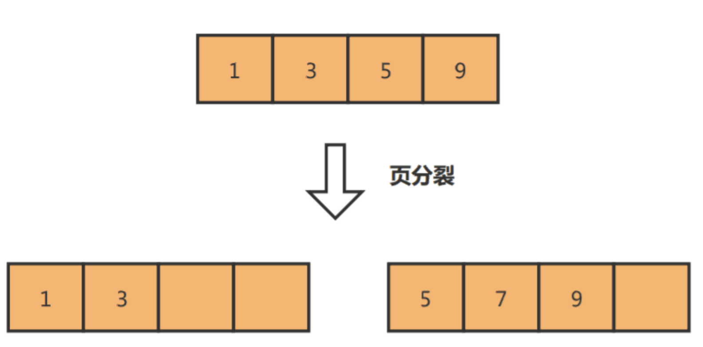

出现页分裂时，需要将一个页的记录移动到另外一个页，性能会受到影响，同时页空间的利用率下降，造成存储空间的浪费。

而如果记录是顺序插入的，例如插入数据11，则只需开辟新的数据页，也就不会发生页分裂：

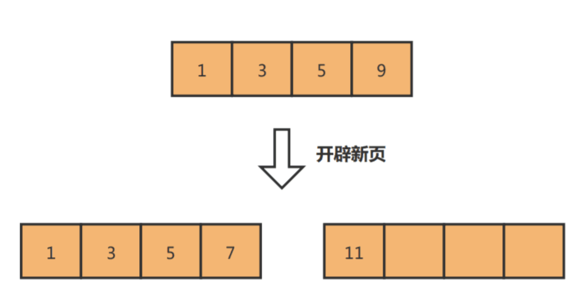

因此，在使用 InnoDB 存储引擎时，如果没有特别的业务需求，建议使用自增字段作为主键。

另外，主键字段的长度不要太大，因为**主键字段长度越小，意味着二级索引的叶子节点越小（二级索引的叶子节点存放的数据是主键值），这样二级索引占用的空间也就越小**。

### [#](https://xiaolincoding.com/mysql/index/index_interview.html#索引最好设置为-not-null)索引最好设置为 NOT NULL

为了更好的利用索引，索引列要设置为 NOT NULL 约束。有两个原因：

- 第一原因：索引列存在 NULL 就会导致优化器在做索引选择的时候更加复杂，更加难以优化，因为可为 NULL 的列会使索引、索引统计和值比较都更复杂，比如进行索引统计时，count 会省略值为NULL 的行。

- 第二个原因：NULL 值是一个没意义的值，但是它会占用物理空间，所以会带来的存储空间的问题，因为 InnoDB 存储记录的时候，如果表中存在允许为 NULL 的字段，那么[行格式 (opens new window)](https://xiaolincoding.com/mysql/base/row_format.html#innodb-行格式有哪些)中**至少会用 1 字节空间存储 NULL 值列表**，如下图的紫色部分：

  

### [#](https://xiaolincoding.com/mysql/index/index_interview.html#防止索引失效)防止索引失效

用上了索引并不意味着查询的时候会使用到索引，所以我们心里要清楚有哪些情况会导致索引失效，从而避免写出索引失效的查询语句，否则这样的查询效率是很低的。

我之前写过索引失效的文章，想详细了解的可以去看这篇文章：[谁还没碰过索引失效呢?(opens new window)](https://mp.weixin.qq.com/s/lEx6iRRP3MbwJ82Xwp675w)

这里简单说一下，发生索引失效的情况：

- 当我们使用左或者左右模糊匹配的时候，也就是 `like %xx` 或者 `like %xx%`这两种方式都会造成索引失效；
- 当我们在查询条件中对索引列做了计算、函数、类型转换操作，这些情况下都会造成索引失效；
- 联合索引要能正确使用需要遵循最左匹配原则，也就是按照最左优先的方式进行索引的匹配，否则就会导致索引失效。
- 在 WHERE 子句中，如果在 OR 前的条件列是索引列，而在 OR 后的条件列不是索引列，那么索引会失效。

我上面说的是常见的索引失效场景，实际过程中，可能会出现其他的索引失效场景，这时我们就需要查看执行计划，通过执行计划显示的数据判断查询语句是否使用了索引。

如下图，就是一个没有使用索引，并且是一个全表扫描的查询语句。

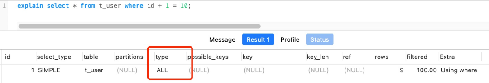

对于执行计划，参数有：

- possible_keys 字段表示可能用到的索引；
- key 字段表示实际用的索引，如果这一项为 NULL，说明没有使用索引；
- key_len 表示索引的长度；
- rows 表示扫描的数据行数。
- type 表示数据扫描类型，我们需要重点看这个。

type 字段就是描述了找到所需数据时使用的扫描方式是什么，常见扫描类型的**执行效率从低到高的顺序为**：

- All（全表扫描）；
- index（全索引扫描）；
- range（索引范围扫描）；
- ref（非唯一索引扫描）；
- eq_ref（唯一索引扫描）；
- const（结果只有一条的主键或唯一索引扫描）。

在这些情况里，all 是最坏的情况，因为采用了全表扫描的方式。index 和 all 差不多，只不过 index 对索引表进行全扫描，这样做的好处是不再需要对数据进行排序，但是开销依然很大。所以，要尽量避免全表扫描和全索引扫描。

range 表示采用了索引范围扫描，一般在 where 子句中使用 < 、>、in、between 等关键词，只检索给定范围的行，属于范围查找。**从这一级别开始，索引的作用会越来越明显，因此我们需要尽量让 SQL 查询可以使用到 range 这一级别及以上的 type 访问方式**。

ref 类型表示采用了非唯一索引，或者是唯一索引的非唯一性前缀，返回数据返回可能是多条。因为虽然使用了索引，但该索引列的值并不唯一，有重复。这样即使使用索引快速查找到了第一条数据，仍然不能停止，要进行目标值附近的小范围扫描。但它的好处是它并不需要扫全表，因为索引是有序的，即便有重复值，也是在一个非常小的范围内扫描。

eq_ref 类型是使用主键或唯一索引时产生的访问方式，通常使用在多表联查中。比如，对两张表进行联查，关联条件是两张表的 user_id 相等，且 user_id 是唯一索引，那么使用 EXPLAIN 进行执行计划查看的时候，type 就会显示 eq_ref。

const 类型表示使用了主键或者唯一索引与常量值进行比较，比如 select name from product where id=1。

需要说明的是 const 类型和 eq_ref 都使用了主键或唯一索引，不过这两个类型有所区别，**const 是与常量进行比较，查询效率会更快，而 eq_ref 通常用于多表联查中**。

> 除了关注 type，我们也要关注 extra 显示的结果。

这里说几个重要的参考指标：

- Using filesort ：当查询语句中包含 group by 操作，而且无法利用索引完成排序操作的时候， 这时不得不选择相应的排序算法进行，甚至可能会通过文件排序，效率是很低的，所以要避免这种问题的出现。
- Using temporary：使了用临时表保存中间结果，MySQL 在对查询结果排序时使用临时表，常见于排序 order by 和分组查询 group by。效率低，要避免这种问题的出现。
- Using index：所需数据只需在索引即可全部获得，不须要再到表中取数据，也就是使用了覆盖索引，避免了回表操作，效率不错。

### [#](https://xiaolincoding.com/mysql/index/index_interview.html#总结)总结

这次主要介绍了索引的原理、分类和使用。我把重点总结在了下面这个表格

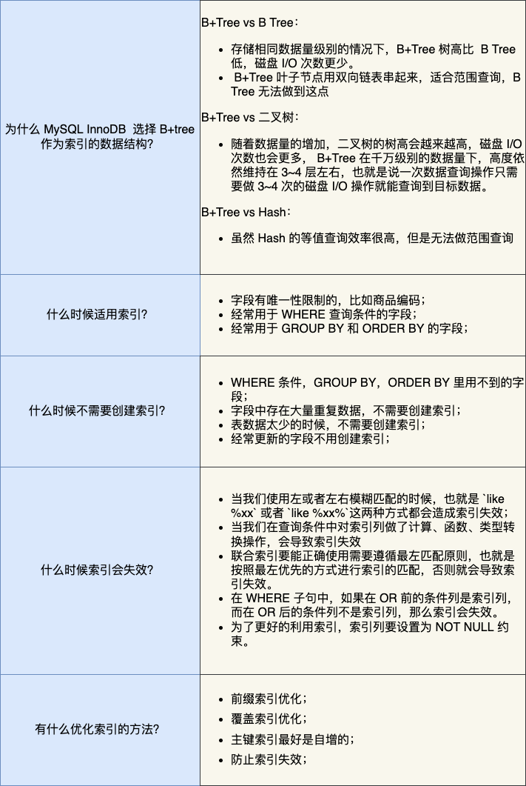

完！


---


## 从数据页的角度看 B+ 树


###  count() 是什么？

count() 是一个聚合函数，函数的参数不仅可以是字段名，也可以是其他任意表达式，该函数作用是**统计符合查询条件的记录中，函数指定的参数不为 NULL 的记录有多少个**。

## 哪种 count 性能最好？

我先直接说结论：

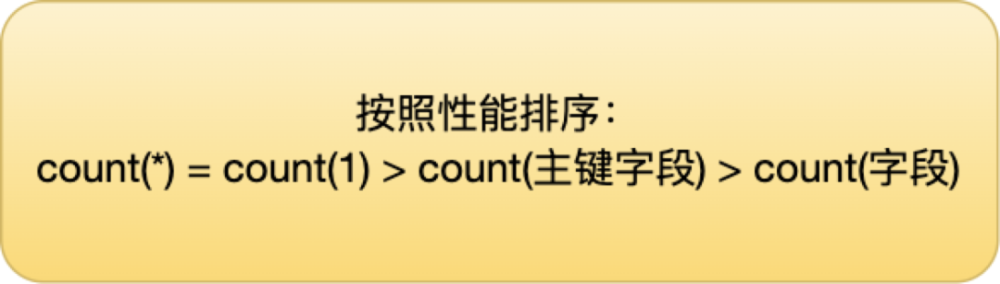

要弄明白这个，我们得要深入 count 的原理，以下内容基于常用的 innodb 存储引擎来说明。


# 事务篇


## 事务的隔离级别有哪些？

前面我们提到，当多个事务并发执行时可能会遇到「脏读、不可重复读、幻读」的现象，这些现象会对事务的一致性产生不同程序的影响。

- 脏读：读到其他事务未提交的数据；
- 不可重复读：前后读取的数据不一致；
- 幻读：前后读取的记录数量不一致。

这三个现象的严重性排序如下：


SQL 标准提出了四种隔离级别来规避这些现象，隔离级别越高，性能效率就越低，这四个隔离级别如下：

- **读未提交（\*read uncommitted\*）**，指一个事务还没提交时，它做的变更就能被其他事务看到；
- **读提交（\*read committed\*）**，指一个事务提交之后，它做的变更才能被其他事务看到；
- **可重复读（\*repeatable read\*）**，指一个事务执行过程中看到的数据，一直跟这个事务启动时看到的数据是一致的，**MySQL InnoDB 引擎的默认隔离级别**；
- **串行化（\*serializable\* ）**；会对记录加上读写锁，在多个事务对这条记录进行读写操作时，如果发生了读写冲突的时候，后访问的事务必须等前一个事务执行完成，才能继续执行；

按隔离水平高低排序如下：


针对不同的隔离级别，并发事务时可能发生的现象也会不同。


也就是说：

- 在「读未提交」隔离级别下，可能发生脏读、不可重复读和幻读现象；
- 在「读提交」隔离级别下，可能发生不可重复读和幻读现象，但是不可能发生脏读现象；
- 在「可重复读」隔离级别下，可能发生幻读现象，但是不可能脏读和不可重复读现象；
- 在「串行化」隔离级别下，脏读、不可重复读和幻读现象都不可能会发生。

所以，要解决脏读现象，就要升级到「读提交」以上的隔离级别；要解决不可重复读现象，就要升级到「可重复读」的隔离级别，要解决幻读现象不建议将隔离级别升级到「串行化」。

不同的数据库厂商对 SQL 标准中规定的 4 种隔离级别的支持不一样，有的数据库只实现了其中几种隔离级别，**我们讨论的 MySQL 虽然支持 4 种隔离级别，但是与SQL 标准中规定的各级隔离级别允许发生的现象却有些出入**。

MySQL 在「可重复读」隔离级别下，可以很大程度上避免幻读现象的发生（注意是很大程度避免，并不是彻底避免），所以 MySQL 并不会使用「串行化」隔离级别来避免幻读现象的发生，因为使用「串行化」隔离级别会影响性能。


## 幻读被完全解决了吗？

**可重复读隔离级别下虽然很大程度上避免了幻读，但是还是没有能完全解决幻读**。

我举例一个可重复读隔离级别发生幻读现象的场景。

### [#](https://xiaolincoding.com/mysql/transaction/phantom.html#第一个发生幻读现象的场景)第一个发生幻读现象的场景

还是以这张表作为例子：

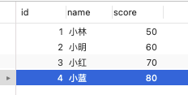

事务 A 执行查询 id = 5 的记录，此时表中是没有该记录的，所以查询不出来。

```sql
# 事务 A
mysql> begin;
Query OK, 0 rows affected (0.00 sec)

mysql> select * from t_stu where id = 5;
Empty set (0.01 sec)
```

然后事务 B 插入一条 id = 5 的记录，并且提交了事务。

```sql
# 事务 B
mysql> begin;
Query OK, 0 rows affected (0.00 sec)

mysql> insert into t_stu values(5, '小美', 18);
Query OK, 1 row affected (0.00 sec)

mysql> commit;
Query OK, 0 rows affected (0.00 sec)
```

此时，**事务 A 更新 id = 5 这条记录，对没错，事务 A 看不到 id = 5 这条记录，但是他去更新了这条记录，这场景确实很违和，然后再次查询 id = 5 的记录，事务 A 就能看到事务 B 插入的纪录了，幻读就是发生在这种违和的场景**。

```sql
# 事务 A
mysql> update t_stu set name = '小林coding' where id = 5;
Query OK, 1 row affected (0.01 sec)
Rows matched: 1  Changed: 1  Warnings: 0

mysql> select * from t_stu where id = 5;
+----+--------------+------+
| id | name         | age  |
+----+--------------+------+
|  5 | 小林coding   |   18 |
+----+--------------+------+
1 row in set (0.00 sec)
```

整个发生幻读的时序图如下：

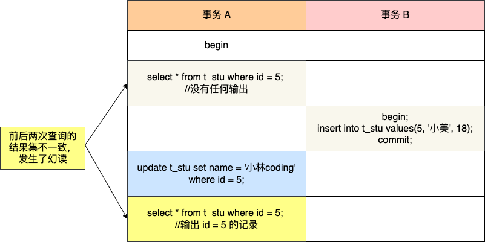

在可重复读隔离级别下，事务 A 第一次执行普通的 select 语句时生成了一个 ReadView，之后事务 B 向表中新插入了一条 id = 5 的记录并提交。接着，事务 A 对 id = 5 这条记录进行了更新操作，在这个时刻，这条新记录的 trx_id 隐藏列的值就变成了事务 A 的事务 id，之后事务 A 再使用普通 select 语句去查询这条记录时就可以看到这条记录了，于是就发生了幻读。

因为这种特殊现象的存在，所以我们认为 **MySQL Innodb 中的 MVCC 并不能完全避免幻读现象**。

### [#](https://xiaolincoding.com/mysql/transaction/phantom.html#第二个发生幻读现象的场景)第二个发生幻读现象的场景

除了上面这一种场景会发生幻读现象之外，还有下面这个场景也会发生幻读现象。

- T1 时刻：事务 A 先执行「快照读语句」：select * from t_test where id > 100 得到了 3 条记录。
- T2 时刻：事务 B 往插入一个 id= 200 的记录并提交；
- T3 时刻：事务 A 再执行「当前读语句」 select * from t_test where id > 100 for update 就会得到 4 条记录，此时也发生了幻读现象。

**要避免这类特殊场景下发生幻读的现象的话，就是尽量在开启事务之后，马上执行 select ... for update 这类当前读的语句**，因为它会对记录加 next-key lock，从而避免其他事务插入一条新记录。

##### [#](https://xiaolincoding.com/mysql/transaction/phantom.html#总结)总结

MySQL InnoDB 引擎的可重复读隔离级别（默认隔离级），根据不同的查询方式，分别提出了避免幻读的方案：

- 针对**快照读**（普通 select 语句），是通过 MVCC 方式解决了幻读。
- 针对**当前读**（select ... for update 等语句），是通过 next-key lock（记录锁+间隙锁）方式解决了幻读。

我举例了两个发生幻读场景的例子。

第一个例子：对于快照读， MVCC 并不能完全避免幻读现象。因为当事务 A 更新了一条事务 B 插入的记录，那么事务 A 前后两次查询的记录条目就不一样了，所以就发生幻读。

第二个例子：对于当前读，如果事务开启后，并没有执行当前读，而是先快照读，然后这期间如果其他事务插入了一条记录，那么事务后续使用当前读进行查询的时候，就会发现两次查询的记录条目就不一样了，所以就发生幻读。

所以，**MySQL 可重复读隔离级别并没有彻底解决幻读，只是很大程度上避免了幻读现象的发生。**

要避免这类特殊场景下发生幻读的现象的话，就是尽量在开启事务之后，马上执行 select ... for update 这类当前读的语句，因为它会对记录加 next-key lock，从而避免其他事务插入一条新记录。


# 锁篇


全局锁主要应用于做**全库逻辑备份**，这样在备份数据库期间，不会因为数据或表结构的更新，而出现备份文件的数据与预期的不一样。

举个例子大家就知道了。

在全库逻辑备份期间，假设不加全局锁的场景，看看会出现什么意外的情况。

如果在全库逻辑备份期间，有用户购买了一件商品，一般购买商品的业务逻辑是会涉及到多张数据库表的更新，比如在用户表更新该用户的余额，然后在商品表更新被购买的商品的库存。

那么，有可能出现这样的顺序：

1. 先备份了用户表的数据；
2. 然后有用户发起了购买商品的操作；
3. 接着再备份商品表的数据。

也就是在备份用户表和商品表之间，有用户购买了商品。

这种情况下，备份的结果是用户表中该用户的余额并没有扣除，反而商品表中该商品的库存被减少了，如果后面用这个备份文件恢复数据库数据的话，用户钱没少，而库存少了，等于用户白嫖了一件商品。

所以，在全库逻辑备份期间，加上全局锁，就不会出现上面这种情况了。

> 加全局锁又会带来什么缺点呢？

加上全局锁，意味着整个数据库都是只读状态。

那么如果数据库里有很多数据，备份就会花费很多的时间，关键是备份期间，业务只能读数据，而不能更新数据，这样会造成业务停滞。

> 既然备份数据库数据的时候，使用全局锁会影响业务，那有什么其他方式可以避免？

有的，如果数据库的引擎支持的事务支持**可重复读的隔离级别**，那么在备份数据库之前先开启事务，会先创建 Read View，然后整个事务执行期间都在用这个 Read View，而且由于 MVCC 的支持，备份期间业务依然可以对数据进行更新操作。

因为在可重复读的隔离级别下，即使其他事务更新了表的数据，也不会影响备份数据库时的 Read View，这就是事务四大特性中的隔离性，这样备份期间备份的数据一直是在开启事务时的数据。

备份数据库的工具是 mysqldump，在使用 mysqldump 时加上 `–single-transaction` 参数的时候，就会在备份数据库之前先开启事务。这种方法只适用于支持「可重复读隔离级别的事务」的存储引擎。

InnoDB 存储引擎默认的事务隔离级别正是可重复读，因此可以采用这种方式来备份数据库。

但是，对于 MyISAM 这种不支持事务的引擎，在备份数据库时就要使用全局锁的方法。


## 表级锁

> MySQL 表级锁有哪些？具体怎么用的。

MySQL 里面表级别的锁有这几种：

- 表锁；
- 元数据锁（MDL）;
- 意向锁；
- AUTO-INC 锁；

### [#](https://xiaolincoding.com/mysql/lock/mysql_lock.html#表锁)表锁

先来说说**表锁**。

如果我们想对学生表（t_student）加表锁，可以使用下面的命令：

```sql
//表级别的共享锁，也就是读锁；
lock tables t_student read;

//表级别的独占锁，也就是写锁；
lock tables t_stuent write;
```

需要注意的是，表锁除了会限制别的线程的读写外，也会限制本线程接下来的读写操作。

也就是说如果本线程对学生表加了「共享表锁」，那么本线程接下来如果要对学生表执行写操作的语句，是会被阻塞的，当然其他线程对学生表进行写操作时也会被阻塞，直到锁被释放。

要释放表锁，可以使用下面这条命令，会释放当前会话的所有表锁：

```sql
unlock tables
```

另外，当会话退出后，也会释放所有表锁。

不过尽量避免在使用 InnoDB 引擎的表使用表锁，因为表锁的颗粒度太大，会影响并发性能，**InnoDB 牛逼的地方在于实现了颗粒度更细的行级锁**。

### 元数据锁

再来说说**元数据锁**（MDL）。

我们不需要显示的使用 MDL，因为当我们对数据库表进行操作时，会自动给这个表加上 MDL：

- 对一张表进行 CRUD 操作时，加的是 **MDL 读锁**；
- 对一张表做结构变更操作的时候，加的是 **MDL 写锁**；


行级锁的类型主要有三类：

- Record Lock，记录锁，也就是仅仅把一条记录锁上；
- Gap Lock，间隙锁，锁定一个范围，但是不包含记录本身；
- Next-Key Lock：Record Lock + Gap Lock 的组合，锁定一个范围，并且锁定记录本身。

### [#](https://xiaolincoding.com/mysql/lock/mysql_lock.html#record-lock)


## MySQL 死锁了，怎么办？

大家好，我是小林。

说个很早之前自己遇到过数据库死锁问题。

有个业务主要逻辑就是新增订单、修改订单、查询订单等操作。然后因为订单是不能重复的，所以当时在新增订单的时候做了幂等性校验，做法就是在新增订单记录之前，先通过 `select ... for update` 语句查询订单是否存在，如果不存在才插入订单记录。

而正是因为这样的操作，当业务量很大的时候，就可能会出现死锁。

接下来跟大家聊下**为什么会发生死锁，以及怎么避免死锁**。

## [#](https://xiaolincoding.com/mysql/lock/deadlock.html#死锁的发生)死锁的发生

本次案例使用存储引擎 Innodb，隔离级别为可重复读（RR）。

接下来，我用实战的方式来带大家看看死锁是怎么发生的。

我建了一张订单表，其中 id 字段为主键索引，order_no 字段普通索引，也就是非唯一索引：

```sql
CREATE TABLE `t_order` (
  `id` int NOT NULL AUTO_INCREMENT,
  `order_no` int DEFAULT NULL,
  `create_date` datetime DEFAULT NULL,
  PRIMARY KEY (`id`),
  KEY `index_order` (`order_no`) USING BTREE
) ENGINE=InnoDB ;
```

然后，先 `t_order` 表里现在已经有了 6 条记录：

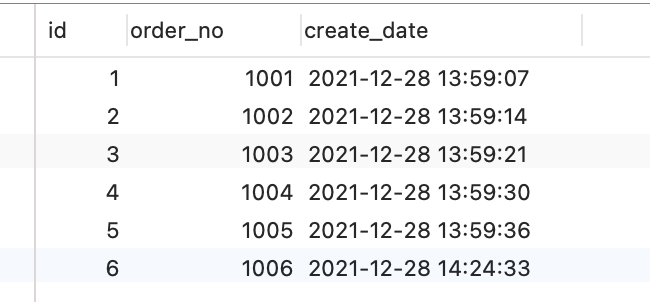

假设这时有两事务，一个事务要插入订单 1007 ，另外一个事务要插入订单 1008，因为需要对订单做幂等性校验，所以两个事务先要查询该订单是否存在，不存在才插入记录，过程如下：

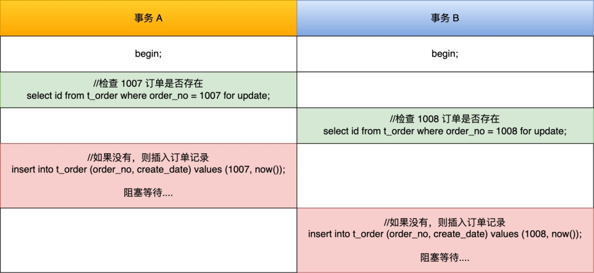

可以看到，两个事务都陷入了等待状态（前提没有打开死锁检测），也就是发生了死锁，因为都在相互等待对方释放锁。

这里在查询记录是否存在的时候，使用了 `select ... for update` 语句，目的为了防止事务执行的过程中，有其他事务插入了记录，而出现幻读的问题。

如果没有使用 `select ... for update` 语句，而使用了单纯的 select 语句，如果是两个订单号一样的请求同时进来，就会出现两个重复的订单，有可能出现幻读，如下图：

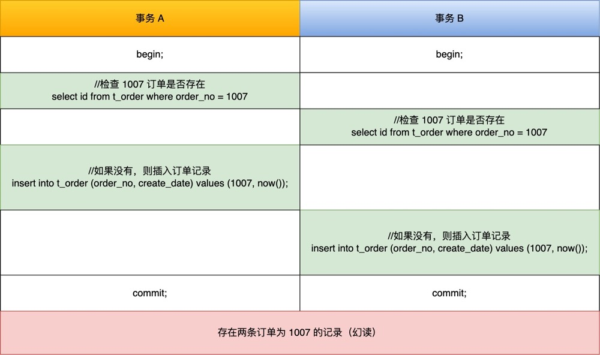

## [#](https://xiaolincoding.com/mysql/lock/deadlock.html#为什么会产生死锁)为什么会产生死锁？

可重复读隔离级别下，是存在幻读的问题。

**Innodb 引擎为了解决「可重复读」隔离级别下的幻读问题，就引出了 next-key 锁**，它是记录锁和间隙锁的组合。

- Record Lock，记录锁，锁的是记录本身；
- Gap Lock，间隙锁，锁的就是两个值之间的空隙，以防止其他事务在这个空隙间插入新的数据，从而避免幻读现象。

普通的 select 语句是不会对记录加锁的，因为它是通过 MVCC 的机制实现的快照读，如果要在查询时对记录加行锁，可以使用下面这两个方式：

```sql
begin;
//对读取的记录加共享锁
select ... lock in share mode;
commit; //锁释放

begin;
//对读取的记录加排他锁
select ... for update;
commit; //锁释放
```

行锁的释放时机是在事务提交（commit）后，锁就会被释放，并不是一条语句执行完就释放行锁。

比如，下面事务 A 查询语句会锁住 `(2, +∞]` 范围的记录，然后期间如果有其他事务在这个锁住的范围插入数据就会被阻塞。

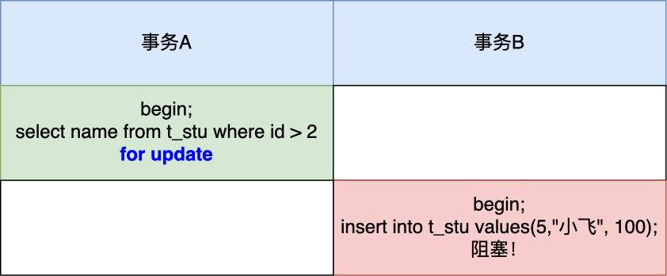

next-key 锁的加锁规则其实挺复杂的，在一些场景下会退化成记录锁或间隙锁，我之前也写一篇加锁规则，详细可以看这篇：[MySQL 是怎么加锁的？(opens new window)](https://xiaolincoding.com/mysql/lock/how_to_lock.html)

需要注意的是，如果 update 语句的 where 条件没有用到索引列，那么就会全表扫描，在一行行扫描的过程中，不仅给行记录加上了行锁，还给行记录两边的空隙也加上了间隙锁，相当于锁住整个表，然后直到事务结束才会释放锁。

所以在线上千万不要执行没有带索引条件的 update 语句，不然会造成业务停滞，我有个读者就因为干了这个事情，然后被老板教育了一波，详细可以看这篇：[update 没加索引会锁全表？(opens new window)](https://xiaolincoding.com/mysql/lock/update_index.html)

回到前面死锁的例子。


事务 A 在执行下面这条语句的时候：

```sql
select id from t_order where order_no = 1007 for update;
```

我们可以通过 `select * from performance_schema.data_locks\G;` 这条语句，查看事务执行 SQL 过程中加了什么锁。

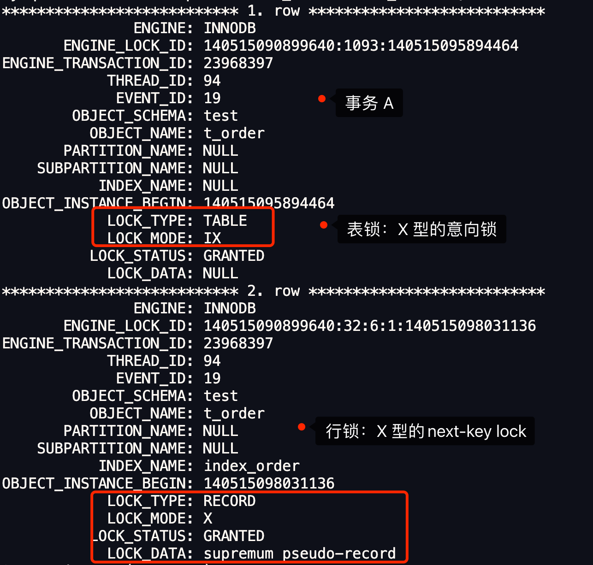

从上图可以看到，共加了两个锁，分别是：

- 表锁：X 类型的意向锁；
- 行锁：X 类型的间隙锁；

这里我们重点关注行锁，图中 LOCK_TYPE 中的 RECORD 表示行级锁，而不是记录锁的意思，通过 LOCK_MODE 可以确认是 next-key 锁，还是间隙锁，还是记录锁：

- 如果 LOCK_MODE 为 `X`，说明是 X 型的 next-key 锁；
- 如果 LOCK_MODE 为 `X, REC_NOT_GAP`，说明是 X 型的记录锁；
- 如果 LOCK_MODE 为 `X, GAP`，说明是 X 型的间隙锁；

**因此，此时事务 A 在二级索引（INDEX_NAME : index_order）上加的是 X 型的 next-key 锁，锁范围是`(1006, +∞]`**。

next-key 锁的范围 (1006, +∞]，是怎么确定的？

根据我的经验，如果 LOCK_MODE 是 next-key 锁或者间隙锁，那么 LOCK_DATA 就表示锁的范围最右值，此次的事务 A 的 LOCK_DATA 是 supremum pseudo-record，表示的是 +∞。然后锁范围的最左值是 t_order 表中最后一个记录的 index_order 的值，也就是 1006。因此，next-key 锁的范围 (1006, +∞]。

TIP

有的读者问，[MySQL 是怎么加锁的？ (opens new window)](https://xiaolincoding.com/mysql/lock/how_to_lock.html)这篇文章讲非唯一索引等值查询时，说「当查询的记录不存在时，加 next-key lock，然后会退化为间隙锁」。为什么上面事务 A 的 next-key lock 并没有退化为间隙锁？

如果表中最后一个记录的 order_no 为 1005，那么等值查询 order_no = 1006（不存在），就是 next key lock，如上面事务 A 的情况。

如果表中最后一个记录的 order_no 为 1010，那么等值查询 order_no = 1006（不存在），就是间隙锁，比如下图：

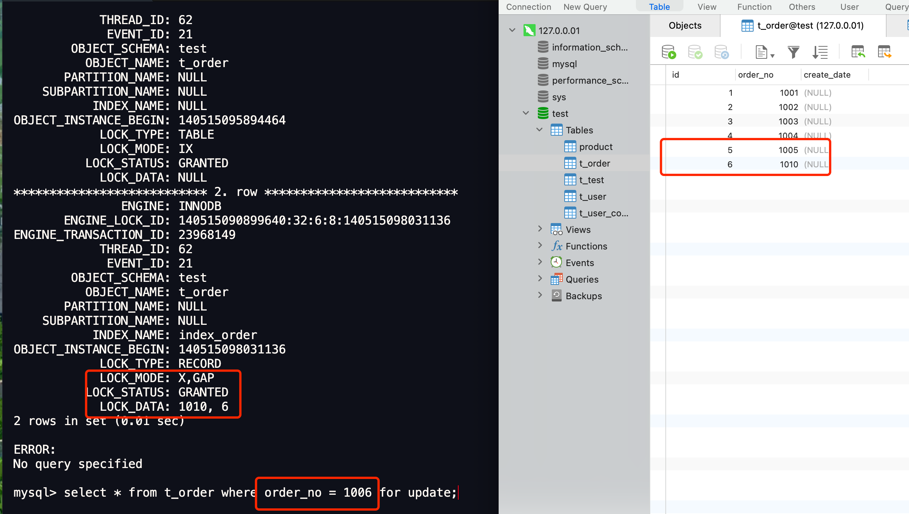

当事务 B 往事务 A next-key 锁的范围 (1006, +∞] 里插入 id = 1008 的记录就会被锁住：

```sql
Insert into t_order (order_no, create_date) values (1008, now());
```

因为当我们执行以下插入语句时，会在插入间隙上获取插入意向锁，**而插入意向锁与间隙锁是冲突的，所以当其它事务持有该间隙的间隙锁时，需要等待其它事务释放间隙锁之后，才能获取到插入意向锁。而间隙锁与间隙锁之间是兼容的，所以所以两个事务中 `select ... for update` 语句并不会相互影响**。

案例中的事务 A 和事务 B 在执行完后 `select ... for update` 语句后都持有范围为`(1006,+∞]`的next-key 锁，而接下来的插入操作为了获取到插入意向锁，都在等待对方事务的间隙锁释放，于是就造成了循环等待，导致死锁。

> 为什么间隙锁与间隙锁之间是兼容的？

在MySQL官网上还有一段非常关键的描述：

*Gap locks in InnoDB are “purely inhibitive”, which means that their only purpose is to prevent other transactions from Inserting to the gap. Gap locks can co-exist. A gap lock taken by one transaction does not prevent another transaction from taking a gap lock on the same gap. There is no difference between shared and exclusive gap locks. They do not conflict with each other, and they perform the same function.*

**间隙锁的意义只在于阻止区间被插入**，因此是可以共存的。**一个事务获取的间隙锁不会阻止另一个事务获取同一个间隙范围的间隙锁**，共享和排他的间隙锁是没有区别的，他们相互不冲突，且功能相同，即两个事务可以同时持有包含共同间隙的间隙锁。

这里的共同间隙包括两种场景：

- 其一是两个间隙锁的间隙区间完全一样；
- 其二是一个间隙锁包含的间隙区间是另一个间隙锁包含间隙区间的子集。

但是有一点要注意，**next-key lock 是包含间隙锁+记录锁的，如果一个事务获取了 X 型的 next-key lock，那么另外一个事务在获取相同范围的 X 型的 next-key lock 时，是会被阻塞的**。

比如，一个事务持有了范围为 (1, 10] 的 X 型的 next-key lock，那么另外一个事务在获取相同范围的 X 型的 next-key lock 时，就会被阻塞。

虽然相同范围的间隙锁是多个事务相互兼容的，但对于记录锁，我们是要考虑 X 型与 S 型关系。X 型的记录锁与 X 型的记录锁是冲突的，比如一个事务执行了 select ... where id = 1 for update，后一个事务在执行这条语句的时候，就会被阻塞的。

但是还要注意！对于这种范围为 (1006, +∞] 的 next-key lock，两个事务是可以同时持有的，不会冲突。因为 +∞ 并不是一个真实的记录，自然就不需要考虑 X 型与 S 型关系。

> 插入意向锁是什么？

注意！插入意向锁名字虽然有意向锁，但是它并不是意向锁，它是一种特殊的间隙锁。

在MySQL的官方文档中有以下重要描述：

*An Insert intention lock is a type of gap lock set by Insert operations prior to row Insertion. This lock signals the intent to Insert in such a way that multiple transactions Inserting into the same index gap need not wait for each other if they are not Inserting at the same position within the gap. Suppose that there are index records with values of 4 and 7. Separate transactions that attempt to Insert values of 5 and 6, respectively, each lock the gap between 4 and 7 with Insert intention locks prior to obtaining the exclusive lock on the Inserted row, but do not block each other because the rows are nonconflicting.*

这段话表明尽管**插入意向锁是一种特殊的间隙锁，但不同于间隙锁的是，该锁只用于并发插入操作**。

如果说间隙锁锁住的是一个区间，那么「插入意向锁」锁住的就是一个点。因而从这个角度来说，插入意向锁确实是一种特殊的间隙锁。

插入意向锁与间隙锁的另一个非常重要的差别是：尽管「插入意向锁」也属于间隙锁，但两个事务却不能在同一时间内，一个拥有间隙锁，另一个拥有该间隙区间内的插入意向锁（当然，插入意向锁如果不在间隙锁区间内则是可以的）。

另外，我补充一点，插入意向锁的生成时机：

- 每插入一条新记录，都需要看一下待插入记录的下一条记录上是否已经被加了间隙锁，如果已加间隙锁，此时会生成一个插入意向锁，然后锁的状态设置为等待状态（*PS：MySQL 加锁时，是先生成锁结构，然后设置锁的状态，如果锁状态是等待状态，并不是意味着事务成功获取到了锁，只有当锁状态为正常状态时，才代表事务成功获取到了锁*），现象就是 Insert 语句会被阻塞。

## 如何避免死锁？

死锁的四个必要条件：**互斥、占有且等待、不可强占用、循环等待**。只要系统发生死锁，这些条件必然成立，但是只要破坏任意一个条件就死锁就不会成立。

在数据库层面，有两种策略通过「打破循环等待条件」来解除死锁状态：

- **设置事务等待锁的超时时间**。当一个事务的等待时间超过该值后，就对这个事务进行回滚，于是锁就释放了，另一个事务就可以继续执行了。在 InnoDB 中，参数 `innodb_lock_wait_timeout` 是用来设置超时时间的，默认值时 50 秒。

  当发生超时后，就出现下面这个提示：


- **开启主动死锁检测**。主动死锁检测在发现死锁后，主动回滚死锁链条中的某一个事务，让其他事务得以继续执行。将参数 `innodb_deadlock_detect` 设置为 on，表示开启这个逻辑，默认就开启。

  当检测到死锁后，就会出现下面这个提示：


上面这个两种策略是「当有死锁发生时」的避免方式。

我们可以回归业务的角度来预防死锁，对订单做幂等性校验的目的是为了保证不会出现重复的订单，那我们可以直接将 order_no 字段设置为唯一索引列，利用它的唯一性来保证订单表不会出现重复的订单，不过有一点不好的地方就是在我们插入一个已经存在的订单记录时就会抛出异常。

# 日志篇


不过，更新语句的流程会涉及到 undo log（回滚日志）、redo log（重做日志） 、binlog （归档日志）这三种日志：

- **undo log（回滚日志）**：是 Innodb 存储引擎层生成的日志，实现了事务中的**原子性**，主要**用于事务回滚和 MVCC**。

- **redo log（重做日志）**：是 Innodb 存储引擎层生成的日志，实现了事务中的**持久性**，主要**用于掉电等故障恢复**；

- **binlog （归档日志）**：是 Server 层生成的日志，主要**用于数据备份和主从复制**；

  

因此，undo log 两大作用：

- **实现事务回滚，保障事务的原子性**。事务处理过程中，如果出现了错误或者用户执 行了 ROLLBACK 语句，MySQL 可以利用 undo log 中的历史数据将数据恢复到事务开始之前的状态。
- **实现 MVCC（多版本并发控制）关键因素之一**。MVCC 是通过 ReadView + undo log 实现的。undo log 为每条记录保存多份历史数据，MySQL 在执行快照读（普通 select 语句）的时候，会根据事务的 Read View 里的信息，顺着 undo log 的版本链找到满足其可见性的记录。


## 为什么需要 redo log ？

Buffer Pool 是提高了读写效率没错，但是问题来了，Buffer Pool 是基于内存的，而内存总是不可靠，万一断电重启，还没来得及落盘的脏页数据就会丢失。

为了防止断电导致数据丢失的问题，当有一条记录需要更新的时候，InnoDB 引擎就会先更新内存（同时标记为脏页），然后将本次对这个页的修改以 redo log 的形式记录下来，**这个时候更新就算完成了**。

后续，InnoDB 引擎会在适当的时候，由后台线程将缓存在 Buffer Pool 的脏页刷新到磁盘里，这就是 **WAL （Write-Ahead Logging）技术**。

**WAL 技术指的是， MySQL 的写操作并不是立刻写到磁盘上，而是先写日志，然后在合适的时间再写到磁盘上**。

过程如下图：

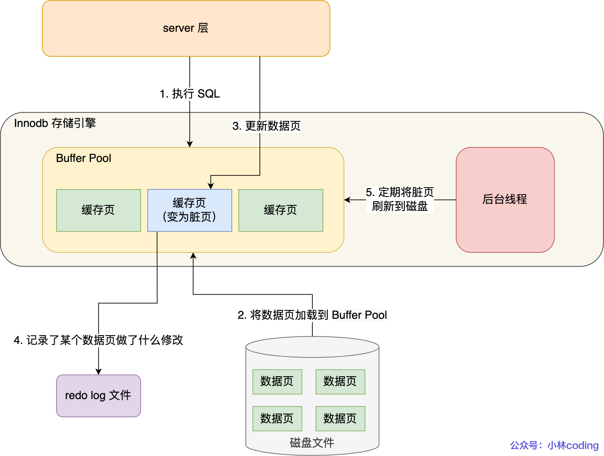

> 什么是 redo log？

redo log 是物理日志，记录了某个数据页做了什么修改，比如**对 XXX 表空间中的 YYY 数据页 ZZZ 偏移量的地方做了AAA 更新**，每当执行一个事务就会产生这样的一条或者多条物理日志。

在事务提交时，只要先将 redo log 持久化到磁盘即可，可以不需要等到将缓存在 Buffer Pool 里的脏页数据持久化到磁盘。

当系统崩溃时，虽然脏页数据没有持久化，但是 redo log 已经持久化，接着 MySQL 重启后，可以根据 redo log 的内容，将所有数据恢复到最新的状态。


### redo log 和 binlog 有什么区别？

这两个日志有四个区别。

*1、适用对象不同：*

- binlog 是 MySQL 的 Server 层实现的日志，所有存储引擎都可以使用；
- redo log 是 Innodb 存储引擎实现的日志；

*2、文件格式不同：*

- binlog 有 3 种格式类型，分别是 STATEMENT（默认格式）、ROW、 MIXED，区别如下：
  - STATEMENT：每一条修改数据的 SQL 都会被记录到 binlog 中（相当于记录了逻辑操作，所以针对这种格式， binlog 可以称为逻辑日志），主从复制中 slave 端再根据 SQL 语句重现。但 STATEMENT 有动态函数的问题，比如你用了 uuid 或者 now 这些函数，你在主库上执行的结果并不是你在从库执行的结果，这种随时在变的函数会导致复制的数据不一致；
  - ROW：记录行数据最终被修改成什么样了（这种格式的日志，就不能称为逻辑日志了），不会出现 STATEMENT 下动态函数的问题。但 ROW 的缺点是每行数据的变化结果都会被记录，比如执行批量 update 语句，更新多少行数据就会产生多少条记录，使 binlog 文件过大，而在 STATEMENT 格式下只会记录一个 update 语句而已；
  - MIXED：包含了 STATEMENT 和 ROW 模式，它会根据不同的情况自动使用 ROW 模式和 STATEMENT 模式；
- redo log 是物理日志，记录的是在某个数据页做了什么修改，比如对 XXX 表空间中的 YYY 数据页 ZZZ 偏移量的地方做了AAA 更新；

*3、写入方式不同：*

- binlog 是追加写，写满一个文件，就创建一个新的文件继续写，不会覆盖以前的日志，保存的是全量的日志。
- redo log 是循环写，日志空间大小是固定，全部写满就从头开始，保存未被刷入磁盘的脏页日志。

*4、用途不同：*

- binlog 用于备份恢复、主从复制；
- redo log 用于掉电等故障恢复。

> 如果不小心整个数据库的数据被删除了，能使用 redo log 文件恢复数据吗？

不可以使用 redo log 文件恢复，只能使用 binlog 文件恢复。

因为 redo log 文件是循环写，是会边写边擦除日志的，只记录未被刷入磁盘的数据的物理日志，已经刷入磁盘的数据都会从 redo log 文件里擦除。

binlog 文件保存的是全量的日志，也就是保存了所有数据变更的情况，理论上只要记录在 binlog 上的数据，都可以恢复，所以如果不小心整个数据库的数据被删除了，得用 binlog 文件恢复数据。


# 内存篇


## 总结

Innodb 存储引擎设计了一个**缓冲池（\*Buffer Pool\*）**，来提高数据库的读写性能。

Buffer Pool 以页为单位缓冲数据，可以通过 `innodb_buffer_pool_size` 参数调整缓冲池的大小，默认是 128 M。

Innodb 通过三种链表来管理缓页：

- Free List （空闲页链表），管理空闲页；
- Flush List （脏页链表），管理脏页；
- LRU List，管理脏页+干净页，将最近且经常查询的数据缓存在其中，而不常查询的数据就淘汰出去。；

InnoDB 对 LRU 做了一些优化，我们熟悉的 LRU 算法通常是将最近查询的数据放到 LRU 链表的头部，而 InnoDB 做 2 点优化：

- 将 LRU 链表 分为**young 和 old 两个区域**，加入缓冲池的页，优先插入 old 区域；页被访问时，才进入 young 区域，目的是为了解决预读失效的问题。
- 当**「页被访问」且「 old 区域停留时间超过 `innodb_old_blocks_time` 阈值（默认为1秒）」**时，才会将页插入到 young 区域，否则还是插入到 old 区域，目的是为了解决批量数据访问，大量热数据淘汰的问题。

可以通过调整 `innodb_old_blocks_pct` 参数，设置 young 区域和 old 区域比例。

在开启了慢 SQL 监控后，如果你发现「偶尔」会出现一些用时稍长的 SQL，这可因为脏页在刷新到磁盘时导致数据库性能抖动。如果在很短的时间出现这种现象，就需要调大 Buffer Pool 空间或 redo log 日志的大小。

