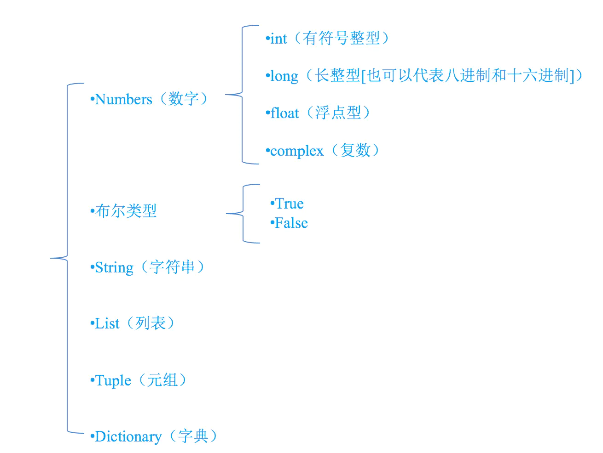
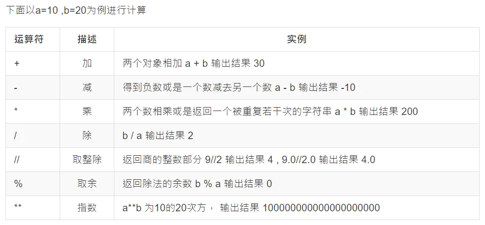
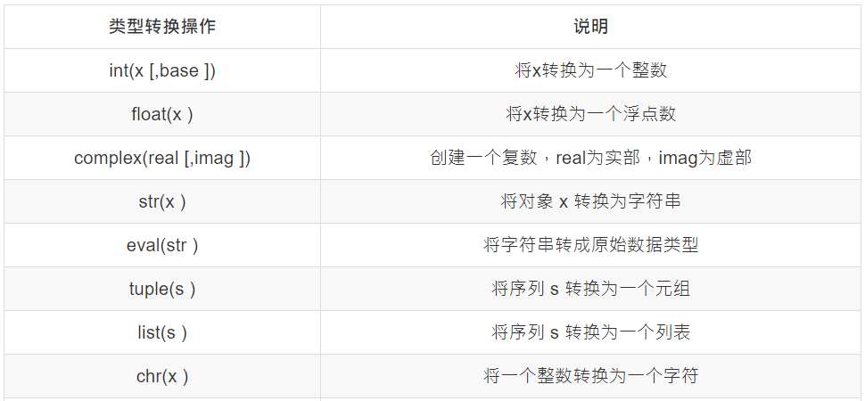
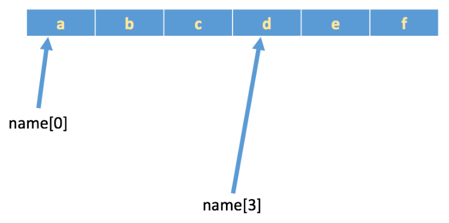

# 概论

## Python是一门解释型语言

## Python解释器

当我们编写Python代码时，我们得到的是一个包含Python代码的以`.py`为扩展名的文本文件。要运行代码，就需要Python解释器去执行`.py`文件。

在计算机内部，Python解释器把源代码转换成称为字节码的中间形式，然后再把它翻译成计算机使用的机器语言并运行。

## 运行方式

### 1,解释器

### 2,交互式

​	IPython是基于CPython之上的一个交互式解释器

### 3,集成环境pycharm

# 基础语法

## 1. 注释

### 单行注释

以#开头，#右边的所有文字当作说明，而不是真正要执行的程序，起辅助说明作用

```python
# 我是注释，可以在里写一些功能说明之类的哦
print('hello world')
```

### 多行注释

两行`'''` （是英文状态下Enter左边那个键按三下）之间可以写多行注释

```python
'''
    我是多行注释，可以写很多很多行的功能说明
'''
```

注释分为：

- 1. 单行注释: 以 # 开头 ，注释内容只能写一行

- 1. 多行注释: 使用三引号，注释内容可以有多行

  

## 2. 变量以及类型

### 2.1变量的定义

```python
num1 = 100  #num1就是一个变量，就好一个小菜篮子

num2 = 87   #num2也是一个变量

result = num1 + num2  #把num1和num2这两个变量中的数据进行累加，然后放到 result变量中
```

### 2.2 变量的类型

为了更充分的利用内存空间以及更有效率的管理内存，变量是有不同的类型的，如下所示：



变量的类型

在python中，只要定义了一个变量，而且它有数据，那么它的类型就已经确定了，不需要咱们开发者主动的去说明它的类型，系统会自动辨别，可以使用type(变量的名字)，来查看变量的类型：

```python
# int 型变量
num1 = 200
print(type(num1))

# 浮点型变量
num2 = 3.14
print(type(num2))

# 布尔型变量
my_bool = True
print(type(my_bool))

# 字符串型变量
my_str = 'hello'
print(type(my_str))

############## 输出结果 ###############
<class 'int'>
<class 'float'>
<class 'bool'>
<class 'str'>
```

## 3. 标识符和关键字

### 3.1 标识符

- 标识符：变量名和函数名等等
- 标识符的组成：字母、数字、下划线并且不能以数字开头
- **python中的标识符是区分大小写的**（Name 不等于 name）

### 3.2 关键字

```python
and     as      assert     break     class      continue    def     del
elif    else    except     exec      finally    for         from    global
if      in      import     is        lambda     not         or      pass
print   raise   return     try       while      with        yield
```

通过导入关键字模块查看当前系统中的Python关键字：

```python
import keyword  # 导入关键字模块

# keyword.kwlist返回的是关键字列表
result = keyword.kwlist

print(result)
print(type(result))
############## 输出结果 ###############

['False', 'None', 'True', 'and', 'as', 'assert', 'async', 'await', 'break', 'class', 'continue', 'def', 'del', 'elif', 'else', 'except', 'finally', 'for', 'from', 'global', 'if', 'import', 'in', 'is', 'lambda', 'nonlocal', 'not', 'or', 'pass', 'raise', 'return', 'try', 'while', 'with', 'yield']
<class 'list'>
```

## 4. 输出

`print("hello world")`就是最简单的输出, 通过print函数可以输出多个变量：

```python
name = "张三"
age = 20
# 通过print函数可以输出多个变量
print(name, age)
############## 输出结果 ###############
张三 20
```

扩展：修改输出显示时的分隔符   `sep`：表示指定多个数据输出时的分隔符：

```python
name = "张三"
age = 20

# seq可以指定输出时的分隔符
print(name, age, sep="&")

# \n 表示换行符
print("你好\n世界")
############## 输出结果 ###############
张三&20
你好
世界
```

`end`：表示输出内容后面追加指定数据，默认追加的是`\n`：

```python
name = "张三"
age = 20
job = "讲师"

# 没有指定end参数，默认后面是\n，所以打印完第一行之后再打印第二行会另起一行
print(name, age)
print(job)

# 指定end参数是 “ &”所以打印完第一行追加“ ！”后直接
print(name, age, end="&")
print(job)

############## 输出结果 ###############
张三 20
讲师
张三 20&讲师
```

`end`参数还可以指定为空格或者指定为空：

```python
name = "李四"
address = "北京"
job = "讲师"

#end参数指定为空格
print(name, end= " ")
# 指定为空
print(job, end="")
print(address)

############## 输出结果 ###############
李四 讲师北京
```

### 格式化输出

- %d: 将数据以  整型  方式进行格式化输出 
- %f: 将数据以  浮点数  方式进行格式化输出
- %s: 将数据以  字符串  方式进行格式化输出

```python
age = 10
print("我今年%d岁" % age)
age += 1
print("我今年%d岁" % age)

############## 输出结果 ###############
我今年10岁
我今年11岁
```

如果给多个格式化占位符传参，那么多个参数需要放到小括号：

```python
name = "宋江"
age = 50

# 如果给多个格式化占位符传参，那么多个参数需要放到小括号
print("我叫:%s 年龄:%d" % (name, age))

############## 输出结果 ###############
我叫:宋江 年龄:50
```

字符型占位符 `%f` 默认保留六位小数，会进行四舍五入：

```python
pi = 3.1415926

print("圆周率: %f" % pi)
print("圆周率: %.2f" % pi)

############## 输出结果 ###############
圆周率: 3.141593
圆周率: 3.14
```

`%f` 默认是保留六位小数，`%.2f`就是规定我只保留小数点后两位。

## 5. 输入

— 接收用户输入的数据使用 `input()` 函数

可以接受用户的输入

```python
password = input("请输入密码:")
############## 运行结果 ###############
请输入密码:
```

这时系统就会接受用户的输入

```python
password = input("请输入密码:")  # 使用password这个变量保存用户输入数据
print("密码为:", password)

password_type = type(password)
print(password_type)
############## 运行结果 ###############
请输入密码:123
密码为: 123
<class 'str'>
```

---


## 6. 运算符

python支持以下几种运算符：



> 注意：混合运算时，优先级顺序为： `**` 高于 `* / % //` 高于 `+ -` ，为了避免歧义，建议使用 `()`来处理运算符优先级。
>  并且，不同类型的数字在进行混合运算时，整数将会转换成浮点数进行运算。

#### *   乘

```python
num1 = 5
num2 = 3

result = num1 * num2
print(result, type(result))

############## 运行结果 ###############
15 <class 'int'>
```

#### /   除

注意：两个数字相除，返回的数据类是float

```python
num1 = 5
num2 = 3

result = num1 / num2
print(result, type(result))

############## 运行结果 ###############
1.6666666666666667 <class 'float'>
```

#### //  取整除

```python
num1 = 5
num2 = 3

result = num1 // num2
print(result, type(result))

############## 运行结果 ###############
1 <class 'int'>
```

#### %   求余数

```python
num1 = 5
num2 = 3

result = num1 % num2
print(result, type(result))

############## 运行结果 ###############
2 <class 'int'>
```

#### ** 求几次方

```python
num1 = 5
num2 = 3

result = num1 ** num2
print(result, type(result))
############## 运行结果 ###############
125 <class 'int'>
```

## 7. 赋值运算符

**同时给多个变量赋值, 多个变量之间使用逗号进行分割**

```python
name, age = "关胜", 40  # 拆包
print(name, age)
############## 运行结果 ###############
关胜 40
```

## 8. 复合赋值运算符


#### **=

```python
num1 = 5
num1 **= 2 # => num1 = num1 ** 2
print(num1)
############## 运行结果 ###############
25
```

#### //=

```python
num1 = 5
num1 //= 4  # => num1 = num1 // 4
print(num1)
############## 运行结果 ###############
1
```

## 9. 数据类型

类型统一才能完成相关的计算操作, 类型不统一进行计算操作会报错：

```python
num1 = 1
my_str = "2"
result = num1 + my_str

print(result)
############## 运行结果 ###############
TypeError: unsupported operand type(s) for +: 'int' and 'str'
```

常用的数据类型转换



#### `eval`

获取字符串中的原始数据，将字符串转换成原始数据类型

```python
my_str = "321"
result = eval(my_str)

print(result, type(result))
############## 运行结果 ###############
321 <class 'int'>
```

```python
abc = 1
my_str = "abc"
result = eval(my_str) # abc

print(result, type(result))
############## 运行结果 ###############
1 <class 'int'>
```

```python
my_str = "[1, 2]"
result = eval(my_str)
print(result, type(result))
############## 运行结果 ###############
[1, 2] <class 'list'>
```

#### `ord`

将一个字符转换为它的ASCII整数值

```python
my_char = "a"
result = ord(my_char)
print(result)
############## 运行结果 ###############
97
```

#### `chr`

将ASCII整数值转换为一个字符

```python
result = chr(97)
print(result, type(result))
############## 运行结果 ###############
a <class 'str'>
```

---

# 流程控制

## 1. if 语句的使用

#### if 语句的格式：

```python
if 判断的条件:
    条件成立会执行if语句里面的代码
```

```python
age = 18
if age >= 18:
    print("你已成年")
############## 运行结果 ###############
你已成年
```

## 2. 比较运算符


## 3. 逻辑运算符

- and：左右表达式都为True，整个表达式结果才为True；
- or：左右表达式有一个为True，整个表达式结果就为True；
- not：将右边表达式的逻辑结果取反，Ture变为False，False变为True

#### and

```python
if name == "西施" and age == 25:
    print("找到女神了!")
```

#### or

```python
if name == "貂蝉" or age < 38:
    print("找到你们啦")
```

#### not

not True 等于 False ， not False 等于 True

```python
result = not False
print(result)
############## 运行结果 ###############
True
```

## 4. if-else的使用

```python
if age >= 18:
    print("你已成年")
else:
    print("尚未成年")
```

```python
if score >= 90 and score <= 100:
    print("优秀")
elif score >= 80 and score < 90:
    print("良好")
elif score >= 70 and score < 80:
    print("一般")
elif score >= 60 and score < 70:
    print("及格")
else:
    print("不及格")
```

## 5. 三目运算操作

```python
num1 = 1
num2 = 2
# 使用三目运算操作对if-else语句进行简化操作
result = num1 if num1 > num2 else num2
print(result)
```


## 6. 循环语句

循环语句就是在程序中可以重复执行某段代码，循环语句有 while 、 for

```python
i = 0
    while i < 10000:
        print("媳妇儿，我错了")
        i += 1
```

### 1. while循环语句

需求：循环打印5次“人生苦短，我用Python”

```python
num = 0
while num < 5:
    print("人生苦短，我用Python")
    num += 1
#### 输出为 #####
人生苦短，我用Python
人生苦短，我用Python
人生苦短，我用Python
人生苦短，我用Python
人生苦短，我用Python
```

### 2. for循环

for循环的格式

```python
for 临时变量 in 列表或者字符串等可迭代对象:
    循环满足条件时执行的代码
```

for循环应用—遍历容器类型中的每一个数据

```python
my_str = "hello"
# 通过for循环可以方便的获取字符串中的每一个数据
for value in my_str:
    # 依次查看value获取的每一个数据
    print(value)
#### 输出为 #####
h
e
l
l
o
```

### 3. for 循环结合`range`使用

range 表示一个范围，也是属于容器类型
for 循环结合`range`使用也可以让某段代码重复执行多次
range(5)：表示产生一个[0,5) => [0, 4]范围**

```python
for value in range(5):
    print("哈哈", value)
#### 输出为 #####
哈哈 0
哈哈 1
哈哈 2
哈哈 3
哈哈 4
```

range(1, 4) ： 1—表示开始位置数据 ；4—表示结束位置数据 [结束位置数据不包含]

```python
for value in range(1, 4):
    print("嘻嘻", value)
#### 输出为 #####
嘻嘻 1
嘻嘻 2
嘻嘻 3
```

range(1, 11, 2) ：第一个参数是开始位置数据，第二个参数是结束位置数据[不包含], 第三个参数步长：前后数据之间间隔

提示：如果不指定步长默认1

```python
for value in range(1, 11, 2):
    print(value)
#### 输出为 #####
1
3
5
7
9
```

步长还可以指定为负数：

```python
for value in range(5, 0, -1):
    print(value)
#### 输出为 #####
5
4
3
2
1
```

循环中的变量可以使用下划线进行占位：

```python
for _ in range(3):
    print("嗯嗯")
#### 输出为 #####
嗯嗯
嗯嗯
嗯嗯
```

### 4. break 和 continue

break的作用：结束break所在的这层循环。
continue的作用：用来结束本次循环，紧接着执行下一次的循环。
break 和 continue 只能用在循环语句里面，不能单独使用。循环语句有：while， for
当循环语句里面执行break，表示当前这层循环执行结束，break后面代码不能执行；
当循环语句执行了continue，表示本次循环执行结束，然后根据条件判断是否执行下一次循环。

---

# 字符串

## 1. 字符串定义方式有四种：

### **单引号字符串：**

```python
my_str1 = 'hello'
```

### **双引号字符串：**

```python
my_str2 = "你好"
```

### **三个单引号字符串：**

```python
### 三个单引号/双引号之间可以定义多行字符串
my_str3 = '''
哈哈
嘻嘻  
嘿嘿'''
```

### **三个双引号字符串：**

```python
### 三个单引号/双引号之间可以定义多行字符串
my_str4 = """A
B
C"""
```

## 2. f-string 的使用

f-string是python3.6及以上版本提供动态绑定字符串数据的一个新特性 —— 相当于字符串动态绑定数据格式化占位符的简化版本。

用法一：

```python
name = input("请输入您的姓名:")
age = int(input("请输入您的年龄:"))
# f-string:动态绑定数据只需要一对大括号即可
my_str = f"我叫:{name} 年龄:{age}"
print(my_str, type(my_str))
#########  输出为  ############
我叫:小明 年龄:26 <class 'str'>
```

用法二：

```python
num1 = int(input("请输入第一个数字:"))
num2 = int(input("请输入第二个数字:"))
message = F'{num1} + {num2} = {num1 + num2}'
print(message)
#########  输出为  ############
请输入第一个数字:10
请输入第二个数字:90
10 + 90 = 100
```

## 3. 下标和切片

### 下标-索引

下标：又称为索引，其实就是数字，下标在python里面可以分为正数下标和负数下标。

如果有字符串 : `name = 'abcdef'`，在内存中的实际存储如下 :



```python
name = 'abcdef'
   print(name[0])
   print(name[1])
   print(name[2])
#########  输出为  ############
a
b
c
```

### 切片

**切片：根据下标范围获取对象(字符串，列表，元组)中的一部分数据。**

#### 切片的语法格式

my_str[开始下标: 结束下标: 步长] 注意点：结束下标不包含，步长不指定默认是1。

#### 切片获取字符串中一部分数据

```python
my_str = "abcedf"
result = my_str[0:3]
print(result)
print(type(result))
#########  输出为  ############
abc
```

**说明不是引用类型而是值拷贝, 和Go语言的切片(底层引用原数组)不同**

```python
my_list = [1, 3.14, "abc", True]
result = my_list[2:4]
print(result,type(result))
my_list[3] = "dsfsd"
print(result,type(result))
#########
['abc', True] <class 'list'>
['abc', True] <class 'list'>

```

#### 获取前三个字符串的简写

```python
my_str = "abcedf"
result = my_str[:3]
print(result)
#########  输出为  ############
abc
```

#### 根据指定下标获取到最后一个数据简写方式

```python
my_str = "abcedf"
result = my_str[3:]
print(result)

#########  输出为  ############
edf
```

#### 获取倒数后面三个字符串数据的简写方式 

```python
my_str = "abcedf"
result = my_str[-3:]
print(result)
#########  输出为  ############
edf
```

#### 获取字符串中的整个数据 

```python
my_str = "abcedf"
result = my_str[:]
print(result)
result = my_str[::1]
print(result)
#########  输出为  ############
abcedf
abcedf
```

#### 指定步长

```python
my_str = "abcedf"
result = my_str[::2]
print(result)
result = my_str[-2:-6:-1]
print(result)
#########  输出为  ############
acd
decb
```

*注意点：切片的范围如果有问题，获取数据是不会报错，但是获取的数据是一个空的字符串数据*

**总结：如果步长是正数表示从左到右取值，如果步长是负数表示从右到左取值。**

------

**（面试题）给定一个字符串aStr, 请反转字符串**

#### python 字符串快速逆置：

```python
aStr = "hello"
print(aStr[::-1])  # 从后向前，按步长为1进行取值
#########  输出为  ############
olleh
```

扩展总结：

```python
s = 'Hello World!'
print(s[4])
print(s)
print(s[:]) # 取出所有元素（没有起始位和结束位之分），默认步长为1
print(s[1:]) # 从下标为1开始，取出 后面所有的元素（没有结束位）
print(s[:5])  # 从起始位置开始，取到 下标为5的前一个元素（不包括结束位本身）
print(s[:-1]) # 从起始位置开始，取到 倒数第一个元素（不包括结束位本身）
print(s[-4:-1]) # 从倒数第4个元素开始，取到 倒数第1个元素（不包括结束位本身）
print(s[1:5:2]) # 从下标为1开始，取到下标为5的前一个元素，步长为2（不包括结束位本身）
#########  输出为  ############
o
Hello World!
Hello World!
ello World!
Hello
Hello World
rld
el
```

## 4. 字符串常见操作

### (1) find

**find: 根据指定字符串，获取字符串所在的下标**

注意：如果没有找到对应的字符串，返回 -1，这里 -1 不是最后一个元素表示的是没有找到字符串的下标位置。
比如，我们有一个字符串：`my_str = "hello"`，我们想知道 `e` 这个字符串是否在`my_str`中前两个位置，如果在就返回`e` 所在的下标，不在返回 -1：

```python
my_str = "hello"
result = my_str.find("e", 0, 2)
print(result)
############## 运行结果 ###############
1
```

`my_str.find("查找的指定字符串", 开始下标, 结束下标[不包含])`
 `my_str.find("e", 0, 2)`：查找`e`是否在`hello`中的前两个字符中，如果在就返回所对应的下标。

再比如，有字符串 `my_str = 'you are more than what you have become '`，检测字符串 `more` 是否包含在`my_str`中，如果包含则返回`more`中第一字母的索引值（所对应的下标），否则返回 -1：

```python
my_str = 'you are more than what you have become '
result = my_str.find("more", 0, len(my_str))
print(result)
############## 运行结果 ###############
8
my_str.find("more", 0, len(my_str))` 查找字符串 `more` 是否在 `'you are more than what you have become '` 中。
 注意：`my_str.find("more", 0, len(my_str))` = `my_str.find("more")
```

在指定区间内查找指定字符：

```python
my_str = 'you are more than what you have become '
result = my_str.find("more", 0, 7)
print(result)
############## 运行结果 ###############
-1
```

`my_str.find("more", 0, 7)` ：查找字符串 `more` 是否在`'you are more than what you have become '`前7个字符中，不存在就返回 -1。

### (2) index

**index: 根据指定字符串，获取字符串所对应的下标**

```python
my_str = "hello"
result = my_str.index("h", 0, 2)
print(result)
############## 运行结果 ###############
0
my_str.index("查找的指定字符串", 开始下标, 结束下标[不包含])
```

- `my_str.index("h", 0, 2)`：查找 `h` 是否存在 `hello` 中前两个字符中，如果存在返回字符串所对应的下标。

如果查找的字符串不存在 find 会返回 -1 ，但这里会报错：

```python
my_str = "hello"
result = my_str.index("l", 0, 2)
print(result)
############## 运行结果 ###############
ValueError: substring not found
```

`my_str.index("l", 0, 2)`：查找 `l` 在 `hello` 前两个字母中所对应的下标，没有找到指定字符串就报错。

### (3) count

**count: 统计指定字符串出现次数**

```python
my_str = "hello"
result = my_str.count("l", 0, 3)
print(result)
result = my_str.count("l")
print(result)
############## 运行结果 ###############
1
2
my_str.count("统计的指定字符串", 开始下标, 结束下标[不包含])
```

### (4) replace

**replace: 根据指定字符串进行替换**

```python
my_str = "hello"
result = my_str.replace("l", "w", 1)
print(result)
result = my_str.replace("l", "w", 2)
print(result)
result = my_str.replace("l", "w")
print(result)
############## 运行结果 ###############
hewlo
hewwo
hewwo
my_str.replace("要替换的字符串", "替换后的字符串", 替换的次数[默认是全部替换，1表示替换1次])
```

`my_str.replace("l", "w", 1)`： 将`hello`中的 `l` 替换成 `w` 只替换一次；
`my_str.replace("l", "w")`：将`hello`中的 `l` 全部替换成 `w`

### (5) split

**根据指定字符串进行分割数据，返回是一个列表**

```python
my_str = "苹果,橘子,香蕉"
result = my_str.split(",", 1)
print(result, type(result))
############## 运行结果 ###############
['苹果', '橘子,香蕉'] <class 'list'>
my_str.split("指定分割的字符串", 分割的次数[默认是-1表示全部分割,1表示分割1次])
```

`my_str.split(",", 1)`：将字符串`my_str = "苹果,橘子,香蕉"`按照指定字符：`,` 进行分割一次

```python
my_str = "苹果,橘子,香蕉"
result = my_str.split(",")
print(result, type(result))
############## 运行结果 ###############
['苹果', '橘子', '香蕉'] <class 'list'>
```

`my_str.split(",")`：将字符串`my_str = "苹果,橘子,香蕉"`按照指定字符：`,` 全部分割。

### (6) startswith

startswith: 判断是否是以指定字符串开头

```python
my_str = "http://www.baidu.com"
result = my_str.startswith("ftp://")
print(result)
############## 运行结果 ###############
False
```

### (7) endswith

**endswith: 判断是否是以指定字符串结尾**

```python
my_str = "http://www.baidu.com"
result = my_str.endswith("com")
print(result)
############## 运行结果 ###############
True
```

### (8) lstrip - 去除左边空格

```python
my_str = "    abc    "
print(my_str)
# 去除左边空格
result = my_str.lstrip()
print(result)
############## 运行结果 ###############
    abc    
abc    
```

### (9) rstrip - 去除右边空格

### (10) strip - 去除两边空格

去除左边、右边、两边的空格总体效果：

```python
my_str = "    abc    "
print(my_str)
result = my_str.lstrip()   ##去除左边空格
print(result)
result = my_str.rstrip()  ##去除右边空格
print(result)
result = my_str.strip()  ##去除两边空格
print(result)
############## 运行结果 ###############
    abc    
abc    
    abc
abc
```

### (11) rfind - 根据指定数据从右往左查找返回对应的下标

根据指定数据从右往左查找返回对应的下标，如果没有该指定数据则返回-1

```python
my_str = "asssabc"
result = my_str.rfind("x")  ##my_str中没有x，所以会返回-1
print(result) 
result = my_str.rfind("c") ##my_str中c对应的下标是6
print(result)
############## 运行结果 ###############
-1
6
```

### (12) partition

partition: 根据指定分割符，把数据分割成三部分， 返回的是一个元组。

```python
my_str = "abc&abc"
my_str2 = "abc&abc&dsfd"
## 根据指定分隔符&，将字符串分割成三部分， 返回的是一个元组
result = my_str.partition("&")
print(result,type(result))
result2 = my_str2.partition("&")
print(result2,type(result2))
############## 运行结果 ###############
('abc', '&', 'abc') <class 'tuple'>
('abc', '&', 'abc&dsfd') <class 'tuple'>
```

### (13) splitlines - 根据换行符进行分割

```python
my_str = "abc\nbcd\nedf"
result = my_str.splitlines()
print(result)
print(type(result))
############## 运行结果 ###############
['abc', 'bcd', 'edf']
<class 'list'>
```

只分割第一个换行符，后面的不分割：

```python
my_str = "abc\nbcd\nedf"
result = my_str.split("\n", 1)  ##只分割第一个换行符
print(result)
############## 运行结果 ###############
['abc', 'bcd\nedf']
```

### (14) isdigit - 判断字符串中是否只包含数字

```python
my_str = "123"
# 判断字符串中是否只包含数字
result = my_str.isdigit()
print(result)
############## 运行结果 ###############
True
```

### (15) join

**根据指定字符串完成字符串的拼接，返回的是一个新的字符串。**
比如，我们有一个字符串`abc`，我们想把它变成`a,b,c`，就可以用`join`来实现：

```python
my_str = "abc"
# 根据指定字符串(逗号)完成对容器类型(字符串，列表，元组)中的每一个数据进行拼接，返回的是一个字符串
result = ",".join(my_str)
print(result)
print(type(result))
############## 运行结果 ###############
a,b,c
<class 'str'>
```

**注意：**使用`join`方法，容器类型中的每个数据都是字符串，也就是说列表中的每个数据，元组中的每个数据都要是字符串。
如果想要拼接的数据不是字符串类型，那就会报错：

```python
my_list = ["苹果", 10086]
# 列表里的第二个数据10086不是字符串类型
result = "!".join(my_list)
print(result)
############## 运行结果 ###############
Traceback (most recent call last):
  File "C:/Users/huangjing00liang/Desktop/黑马Python45期/第03天-字符串、列表/04-代码/day03/练习.py", line 4, in <module>
    result = "!".join(my_list)
TypeError: sequence item 1: expected str instance, int found
```

```python
my_list = ["苹果", "10086"]
result = "!".join(my_list)
print(result)
############## 运行结果 ###############
苹果!10086
```

---

# 列表

### 可以存储多个任意类型的数据

列表最外层的表现形式是一对中括号，列表可以存储多个任意类型的数据，好比数据容器。

### **值可重复**

**列表可以储存任意多个类型的数据：**

```python
my_list = [1, 3.14, "abc", True]
print(my_list, type(my_list))
############## 运行结果 ###############
[1, 3.14, 'abc', True] <class 'list'>
```

**可以根据下标获取列表中的数据：**

```python
# 根据下标获取列表中的数据
my_list = [1, 3.14, "abc", True]
result = my_list[-2]
print(result)
############ 运行结果 ###############
abc
```

**列表还可以结合切片使用：**

```python
# 根据下标获取列表中的数据
my_list = [1, 3.14, "abc", True]
result = my_list[2:4]
print(result,type(result))
############## 运行结果 ###############
['abc', True] <class 'list'>
```

**可以定义一个空列表，留着后面放数据：**

```python
my_list = []
print(my_list, type(my_list))
############## 运行结果 ###############
[] <class 'list'>
```

### 1、列表的遍历

列表的遍历可以使用`for`循环和`while`循环，推荐：`for`循环更加方便和简单。

#### 使用for循环遍历列表中的每一个数据

```python
my_list = [1, 3.14, "abc", True, [1, 3, 5]]
# 使用for循环遍历列表中的每一个数据
for value in my_list:
    # 打印每次遍历的数据
    print(value)
############## 运行结果 ###############
1
3.14
abc
True
[1, 3, 5]
```

#### 使用while循环遍历列表中的每个数据

```python
my_list = [1, 3.14, "abc", True, [1, 3, 5]]
index = 0
while index <= 4:
    # 根据下标获取对应的数据
    result = my_list[index]
    print(result)
    index += 1
############## 运行结果 ###############
1
3.14
abc
True
[1, 3, 5]
```

### 2、列表的增删改查

> 列表的添加，删除，修改，查看[根据下标获取数据]数据

#### append: 列表的末尾追加一个元素

```python
my_list = []
print(my_list)
## append: 列表的末尾追加一个元素
my_list.append("晁盖")
print(my_list)
my_list.append("宋江")
print(my_list)
############## 运行结果 ###############
[]
['晁盖']
['晁盖', '宋江']
```

#### insert: 根据下标插入指定数据

```python
my_list = ["晁盖", "宋江"]
print(my_list)
#在下标为0的位置插入“林冲”
my_list.insert(0, "林冲")
print(my_list)
############## 运行结果 ###############
['晁盖', '宋江']
['林冲', '晁盖', '宋江']
```

#### extend: 对指定的列表进行扩展

```python
my_list = ["晁盖", "宋江"]
my_list1 = ["鲁智深", "李逵", "武松"]
#把my_list1里面的每一个元素(数据)添加到my_list列表中
my_list.extend(my_list1)
print(my_list)
############## 运行结果 ###############
['晁盖', '宋江', '鲁智深', '李逵', '武松']
```

#### 根据下标修改数据

```python
my_list = ["晁盖", "宋江"]
print(my_list)
##根据下标修改列表中第二个数据
my_list[1] = "及时雨宋江"
print(my_list)
############## 运行结果 ###############
['晁盖', '宋江']
['晁盖', '及时雨宋江']
```

#### 根据切片修改多个数据

```python
my_list = ["林冲", "晁盖", "鲁智深", "李逵"]
print(my_list)

## 使用切片同时修改列表中前两个数据
my_list[0:2] = ["豹子头林冲", "天王晁盖"]
print(my_list)

############## 运行结果 ###############

['林冲', '晁盖', '鲁智深', '李逵']
['豹子头林冲', '天王晁盖', '鲁智深', '李逵']
```

### 3. 删除列表中的数据 

#### [del， remove,  pop]

#### del 根据下标删除数据

```python
my_list = ["林冲", "晁盖", "鲁智深", "李逵"]
print(my_list)

##删除下标是2的即第3个数据
del my_list[2]
print(my_list)

############## 运行结果 ###############

['林冲', '晁盖', '鲁智深', '李逵']
['林冲', '晁盖', '李逵']
```

#### del 根据切片删除多个数据

```python
my_list = ["林冲", "晁盖", "鲁智深", "李逵"]
print(my_list)

del my_list[1:3]
print(my_list)

############## 运行结果 ###############

['林冲', '晁盖', '鲁智深', '李逵']
['林冲', '李逵']
```

#### remove 根据列表中的元素删除数据

```python
my_list = ["林冲", "晁盖", "鲁智深", "李逵"]
print(my_list)

my_list.remove("鲁智深")
print(my_list)

############## 运行结果 ###############

['林冲', '晁盖', '鲁智深', '李逵']
['林冲', '晁盖', '李逵']
```

#### pop 根据下标删除数据并显示删除的数据

> 又想根据下标删除数据又想知道删除的数据是什么，以防删错了，这时用`pop`参数就能完成。

```python
my_list = ["林冲", "晁盖", "鲁智深", "李逵"]
print(my_list)

result = my_list.pop()  ##不指定下标，默认删除最后一个元素
print(result, my_list)

############## 运行结果 ###############

['林冲', '晁盖', '鲁智深', '李逵']
李逵 ['林冲', '晁盖', '鲁智深']
```

#### 根据下标查看(获取)指定数据

```python
my_list = ["林冲", "晁盖", "鲁智深", "李逵"]
result = my_list[0:2]

print(result)

############## 运行结果 ###############

['林冲', '晁盖']
```

### 3、in 和 not in 结合列表使用

> in: 判断指定数据是否在列表里面     类似php的 in_array( )

```python
# 存储多个用户的姓名
my_list = []

for _ in range(3):
    name = input("请输入您添加姓名:")
    my_list.append(name)

print(my_list)

# 判断是否有要查找的数据
search_name = input("请输入您要查询的姓名:")

result = search_name in my_list
if result:
    print("找到了这个人")
else:
    print("没有找到该人")

############## 运行结果 ###############

请输入您添加姓名:张三
请输入您添加姓名:李四
请输入您添加姓名:王五
['张三', '李四', '王五']
请输入您要查询的姓名:黄晶
没有找到该人
```

以上操作就是将输入的三个用户名：'张三', '李四', '王五' ，存放在列表`my_list`，然后使用 `in`  结合列表查找指定用户是否在列表里。

> - not in : 判断指定数据不在列表里面

```python
name_list = ["A", 1, 3.14]

# 3.16 不在指定列表中
result = 3.16 not in name_list
print(result)

############## 运行结果 ###############

True
```

### 4、index 和 count 方法结合列表使用

> index: 根据指定数据在列表中获取数据对应的下标

```python
my_list = ["曹操", "荀彧", "贾诩"]

# 返回指定数据所对应的下标
result = my_list.index("荀彧")
print(result)

############## 运行结果 ###############

1
```

> count: 统计指定数据在列表中出现的次数

```python
my_list = ["曹操", "荀彧", "贾诩", "马忠", "孙权", "马忠"]

# 统计指定数据在列表中出现的次数
result = my_list.count("马忠")
print(result)

############## 运行结果 ###############

2
```

### 4、reverse 和 sort 方法结合列表使用

> reverse：将列表反转

```python
my_list = [1, 3, 2, 4]
print(my_list)

# 列表反转
my_list.reverse()
print(my_list)

############## 运行结果 ###############

[1, 3, 2, 4]
[4, 2, 3, 1]
```

**注意：`reverse`方法没有提供返回值，查看数据直接使用之前的变量即可**
 所以如果使用一个新的变量放`reverse`反转后的结果就会返回空`None`：

```python
my_list = [1, 3, 2, 4]
print(my_list)

##`reverse`方法没有返回值
result = my_list.reverse()
print(result)

############## 运行结果 ###############

[1, 3, 2, 4]
None
```

> sort ：将列表进行排序，默认从小到大 -> 升序

```python
my_list = [1, 3, 2, 4]
print(my_list)

my_list.sort()
print(my_list)

############## 运行结果 ###############

[1, 3, 2, 4]
[1, 2, 3, 4]
```

**对列表里面的内容先排序再反转：**

```python
my_list = [1, 3, 2, 4]
print(my_list)

# 排序，默认从小到大 -> 升序
my_list.sort()
print(my_list)

# 对排序后的数据进行反转
my_list.reverse()
print(my_list)

############## 运行结果 ###############

[1, 3, 2, 4]    ##自己定义的列表
[1, 2, 3, 4]    ##排序后的结果
[4, 3, 2, 1]    ##对排序后的结果再进行反转
```

### 5、列表的嵌套

> 列表嵌套：在一个列表里面再次使用一个列表

```python
city_list = []

# 南方城市列表
south_list = ["上海", "深圳", "广州"]
# 北方城市列表
north_list = ["北京", "天津", "济南"]

# 添加数据
city_list.append(south_list)
city_list.append(north_list)

print(city_list)

############## 运行结果 ###############

[['上海', '深圳', '广州'], ['北京', '天津', '济南']]
```

##### 提取大列表中子列表中元素：

比如，我想把列表`city_list = [['上海', '深圳', '广州'], ['北京', '天津', '济南']]`中的`天津`取出来：

```python
city_list = [['上海', '深圳', '广州'], ['北京', '天津', '济南']]

##取大列表中的子列表中的元素
city_name = city_list[1][1]
print(city_name)

############## 运行结果 ###############

天津
```

### 6. 列表的应用

> **思考：一个学校，有3个办公室，现在有8位老师等待工位的分配，请编写程序，完成随机的分配**

```python
#导入模块random，它可以随机产生数字
import random

# 1. 三个办公室，办公室是可以容纳老师的，所以每一个办公室就是一个小列表
# my_list1 = []
# my_list2 = []
# my_list3 = []

# 办公室列表，里面的每个元素表示一个办公室，每个办公室还是一个列表
office_list = [[], [], []]

# 2. 8位老师，可以定义一个老师列表，存储8位老师
teacher_list = ["刘老师", "王老师", "郭老师", "马老师", "牛老师", "杨老师", "朱老师", "侯老师"]

# 3. 依次获取老师列表中的每一位老师，然后把老师随机分配到指定办公室
for teacher in teacher_list:

    # 生产随机数字，随机数字就是办公室的下标
    index = random.randint(0, 2)
    print(teacher, index)

    # 根据生产的下标获取对应的办公室
    office = office_list[index]

    # 把老师添加到随机的办公室里面
    office.append(teacher)

# 查看办公室信息
print(office_list)

############## 运行结果 ###############

刘老师 1
王老师 1
郭老师 1
马老师 2
牛老师 1
杨老师 1
朱老师 0
侯老师 0
[['朱老师', '侯老师'], ['刘老师', '王老师', '郭老师', '牛老师', '杨老师'], ['马老师']]
```

---

# 元组 — tuple

> 元组：**也是一个容器类型，可以存储多个任意类型的数据，元组好比是一个只读的列表，只能获取数据不能对元组中的数据进行修改。**

**可以存储多个任意类型的数据.**

**只能获取数据不能对元组中的数据进行修改。**

**值可以重复**

**key可以为数字,不可为list列表等**

元组的表现形式： (1, "3")，最外层表现形式**是一对小括号**

```python
my_tuple = (1, 3.14, True, "abc", [1, 2], (1, 54))

print(my_tuple)
print(type(my_tuple))

#########  运行结果  ############

(1, 3.14, True, 'abc', [1, 2], (1, 54))
<class 'tuple'>
```

#### 不能对元组中的数据进行修改

如果对元组中的数据进行修改就会报错：

```python
my_tuple = (1, 3.14, True, "abc", [1, 2], (1, 54))

my_tuple[0] = 2
del my_tuple[-1]

print(my_tuple)

#########  运行结果  ############

TypeError: 'tuple' object does not support item assignment
```

> 注意：元组只能获取数据

#### 根据下标获取元组中的数据

```python
my_tuple = (1, 3.14, True, "abc", [1, 2], (1, 54))

result = my_tuple[0]
print(result)

result = my_tuple[-1]
print(result)

#########  运行结果  ############

1
(1, 54)
```

##### 元组的切片

> 字符串，列表，元组都有切片处理

```python
my_tuple = (1, 3.14, True, "abc", [1, 2], (1, 54))
result = my_tuple[1:4]
print(result)
#########  运行结果  ############
(3.14, True, 'abc')
```

**元组的使用场景：**

- 函数的返回值是元组，保证返回的数据不能修改
- print函数进行格式化输出的时候使用元组

通过元组给多个格式化占位符进行传参：

```python
print("我叫:%s 年龄:%d" % ("李四", 20))

#########  运行结果  ############

我叫:李四 年龄:20
```

元组的注意点：

- 元组里面的数据不能修改(添加，删除，修改)
- 当元组里面只有一个元素，元组里面的逗号不能省略

元组中若只有一个元素时把后面的逗号省去了将不再是元组类型：

```python
my_tuple = ("abc",)
my_tuple1 = ([1, 2],)

print(my_tuple, type(my_tuple))
print(my_tuple1, type(my_tuple1))

print("=== 元组中只有一个元素把后面的逗号省去了将不再是元组类型 ===")

my_tuple2 = ("abc")
my_tuple3 = ([1, 2])

print(my_tuple2, type(my_tuple2))
print(my_tuple3, type(my_tuple3))

#########  运行结果  ############

('abc',) <class 'tuple'>
([1, 2],) <class 'tuple'>
=== 元组中只有一个元素把后面的逗号省去了将不再是元组类型 ===
abc <class 'str'>
[1, 2] <class 'list'>
```

### index和count方法结合元组使用

#### count: 统计指定数据在元组里面的次数

```python
my_tuple = (1, 3, "1", 1)

# 统计指定数据1在元组里面出现的次数
result = my_tuple.count(1)
print(result)

#########  运行结果  ############

2
```

#### index: 根据指定数据，获取数据在元组的下标

```python
my_tuple = (1, 3, "1", 1)

# 元组结合index使用获取数据3在元组的下标
result = my_tuple.index(3)

#########  运行结果  ############

1
```

### 元组的遍历

#### for循环遍历元组中的每一个数据

```python
my_tuple = ('西施', "貂蝉", "王昭君", "杨玉环")

for value in my_tuple:
    print(value)

#########  运行结果  ############

西施
貂蝉
王昭君
杨玉环
```

#### while循环遍历元组中的每一个数据

```python
my_tuple = ('西施', "貂蝉", "王昭君", "杨玉环")
index = 0
while index <= 3:
    result = my_tuple[index]
    print(result)
    index += 1
#########  运行结果  ############

西施
貂蝉
王昭君
杨玉环
```

扩展：`len`: 获取容器类型数据的长度， len函数获取字符串、列表、元组类型的个数

```python
my_tuple = ('西施', "貂蝉", "王昭君", "杨玉环")
number = len(my_tuple)
print(number)

#########  运行结果  ############
4
```

扩展：反向输出

```python
my_tuple = ('西施', "貂蝉", "王昭君", "杨玉环")

result = my_tuple[::-1]
print(result)

#########  运行结果  ############
('杨玉环', '王昭君', '貂蝉', '西施')
```

---

# 字典 — dict

> 字典：也是一个容器类型，字典里面的每一个数据都是键值对(key:value), 字典的最外层表现形式: {key:value, ....}
>  学习字典的目的： 对于存储描述性信息可以使用字典，比如：存储学生信息，老师信息，教室信息，电脑信息

**注意：字典中的key是唯一的, 不能重复**

类似于php的数组 array ; java的map ; go的map

### 定义字典

```python
my_dict = {"age": 20, "name": "李四",  "address": "北京", "sex": "女"}
print(my_dict, type(my_dict))

#########  运行结果  ############

{'age': 20, 'name': '李四', 'address': '北京', 'sex': '女'} <class 'dict'>
```

### 通过key获取对应的value值

```python
my_dict = {"age": 20, "name": "李四",  "address": "北京", "sex": "女"}
value = my_dict["age"]
print(value)
sex = my_dict["sex"]
print(sex)
#########  运行结果  ############
20
女
```

**使用上面这种中括号方式获取字典中的value值，如果key不存在那么程序会报错**
 比如我们想要获取“李四”的学历（educational_history）字典中并没有：

```python
my_dict = {"age": 20, "name": "李四",  "address": "北京", "sex": "女"}

result = my_dict["educational_history"]
print(result)

#########  运行结果  ############
KeyError: 'educational_history'
```

### get方式取值（value）

get方式取值可以提供默认值，如果字典有对应的key，获取key对应的value值，没有就使用默认值：

```python
my_dict = {"age": 20, "name": "李四",  "address": "北京", "sex": "女"}

# get方式取值,如果字典有对应的key就获取key对应的value值
value = my_dict.get("age")
print(value)

value2 = my_dict.get("educational_history")
print(value2)

# 如果字典没有对应的key使用默认值
result = my_dict.get("educational_history", "硕士")
print(result)

#########  运行结果  ############
20
None
硕士
```

## 字典的增删改查

#### 添加键值对

> 注意点：如果操作的key在字典里面不存在，那么是添加键值对操作

```python
my_dict = {"name": "西施", "age": 25}
print(my_dict)

# 添加键值对 
my_dict["address"] = "杭州"
print(my_dict)

my_dict["sex"] = "女"
print(my_dict)

#########  运行结果  ############

{'name': '西施', 'age': 25}
{'name': '西施', 'age': 25, 'address': '杭州'}
{'name': '西施', 'age': 25, 'address': '杭州', 'sex': '女'}
```

#### 修改键值对

> 注意点：如果操作的key在字典里面，那么是修改键值对操作

```python
my_dict = {"name": "西施", "age": 25}
print(my_dict)
# 修改键值对，注意点：如果操作的key在字典里面，那么是修改键值对操作
my_dict["age"] = 20
print(my_dict)

#########  运行结果  ############
{'name': '西施', 'age': 25}
{'name': '西施', 'age': 20}
```

#### 删除键值对

##### del

```python
my_dict = {"name": "西施", "age": 25, "address": "杭州"}
print(my_dict)

##删除键值对
del my_dict["address"]
print(my_dict)

#########  运行结果  ############

{'name': '西施', 'age': 25, 'address': '杭州'}
{'name': '西施', 'age': 25}
```

##### pop

扩展：根据key删除键值对，并且返回key对应的value值

```python
my_dict = {"name": "西施", "age": 25, "address": "杭州"}
print(my_dict)

##pop有返回值
value = my_dict.pop("age")
print(value, my_dict)

#########  运行结果  ############

{'name': '西施', 'age': 25, 'address': '杭州'}
25 {'name': '西施', 'address': '杭州'}
```

#### 清除字典中的所有数据

```python
my_dict = {"name": "西施", "age": 25, "address": "杭州"}
print(my_dict)

##清除字典中的所有数据
my_dict.clear()
print(my_dict)

#########  运行结果  ############

{'name': '西施', 'age': 25, 'address': '杭州'}
{}
```

#### 清除列表中的所有数据

```python
my_list = [1, 3, 5]
print(my_list)
##清除列表中的所有数据
my_list.clear()
print(my_list)
#########  运行结果  ############
[1, 3, 5]
[]
```

扩展：列表 list 里面通过 `extend` 完成列表的合并，字典里面通过 `update` 完成字典的合并

#### 字典的合并 — update

```python
my_dict1 = {"name": "貂蝉", "age": 20}
my_dict2 = {"sex": "女", "address": "无锡", "age": 25}
print(my_dict1)
print(my_dict2)

# 把my_dict2字典中的每一个键值对添加到my_dict1里面
print("====== 合并后 =====")
my_dict1.update(my_dict2)

print(my_dict1)

#########  运行结果  ############

{'name': '貂蝉', 'age': 20}
{'sex': '女', 'address': '无锡', 'age': 25}
====== 合并后 =====
{'name': '貂蝉', 'age': 25, 'sex': '女', 'address': '无锡'}
```

## 字典的常见的操作

#### len函数获取字典的个数

`len`函数还可以获取：字符串，列表，元组，字典的个数

```python
my_dict = {"name": "猪八戒", "sex": "男"}
# 获取字典的个数
result = len(my_dict)
print(result)
#########  运行结果  ############
2
```

#### keys方法获取字典中的所有key

```python
my_dict = {"name": "猪八戒", "sex": "男"}

# keys方法获取字典中的所有key
result = my_dict.keys()

# 返回的是dict_keys类型， 查看数据不方便，可以转换成list类型
print(result, type(result))

# 把dict_keys类型转成list
my_list = list(result)
print(my_list, type(my_list))

#########  运行结果  ############

dict_keys(['name', 'sex']) <class 'dict_keys'>
['name', 'sex'] <class 'list'>
```

#### values方法获取字典中的所有value

```python
my_dict = {"name": "猪八戒", "sex": "男"}

# values方法： 获取字典中的所有value
result = my_dict.values()
# 返回的类型是dict_values，查看数据不方便，可以转换成list类型
print(result, type(result))
my_list = list(result)
print(my_list, type(my_list))

#########  运行结果  ############
dict_values(['猪八戒', '男']) <class 'dict_values'>
['猪八戒', '男'] <class 'list'>
```

#### items方法获取字典中的所有项数据，每一项数据是一个键值对数据

```python
my_dict = {"name": "猪八戒", "sex": "男"}

result = my_dict.items()
# 返回的数据类型：dict_items，查看数据不方便可以转换list类型
print(result, type(result))

my_list = list(result)
print(my_list, type(my_list))

#########  运行结果  ############

dict_items([('name', '猪八戒'), ('sex', '男')]) <class 'dict_items'>
[('name', '猪八戒'), ('sex', '男')] <class 'list'>
```

## 字典的遍历

#### 遍历字典中的所有key

my_dict.keys()` 获取字典中的所有`key

```python
my_dict = {"name": "小明", "age": 18, "sex": "男", "address": "北京"}

# 遍历字典中的所有key
for key in my_dict.keys(): # my_dict.keys() 获取字典中的所有key
    # 根据key获取对应的value值
    value = my_dict[key]
    print(key, value)
#########  运行结果  ############
name 小明
age 18
sex 男
address 北京
```

#### 遍历字典中的所有value

```python
my_dict = {"name": "小明", "age": 18, "sex": "男", "address": "北京"}

for value in my_dict.values():
    print(value)
#########  运行结果  ############
小明
18
男
北京
```

#### 遍历字典中的所有项(item)

```python
my_dict = {"name": "小明", "age": 18, "sex": "男", "address": "北京"}

for item in my_dict.items():
    # 遍历的每项数据是一个元组类型，元组里面存放的是key和value
    print(item, type(item))
    # 根据下标获取元组中的数据
    # 获取key
    key = item[0]
    value = item[1]
    print(key, value)

#########  运行结果  ############

('name', '小明') <class 'tuple'>
name 小明
('age', 18) <class 'tuple'>
age 18
('sex', '男') <class 'tuple'>
sex 男
('address', '北京') <class 'tuple'>
address 北京
```

**遍历的每项数据是一个元组，使用不同变量保存元组中的每一个数据，这里是操作是拆包：**

```python
my_dict = {"name": "小明", "age": 18, "sex": "男", "address": "北京"}

for key, value in my_dict.items():
    print(key, value)

#########  运行结果  ############
name 小明
age 18
sex 男
address 北京
```

扩展： 直接遍历字典，默认取的是字典的key  

**而php默认取得是值**

```python
my_dict = {"name": "小明", "age": 18, "sex": "男", "address": "北京"}

for key in my_dict:
    print(key)
#########  运行结果  ############
name
age
sex
address
```

## enumerate函数的使用

`enumerate`函数：当使用for循环遍历数据时，又想使用数据对应的下标又想使用数据就可以使用enumerate函数了。

如果不使用 `enumerate` 函数想要遍历数据时又获取下标又获取数据，就需要设置一个变量存放下标：

```python
my_list = ["a", "b", "c"]

# 记录当前数据的下标
index = 0
for value in my_list:
    print(index, value)
    index += 1
#########  运行结果  ############
0 a
1 b
2 c
```

使用enumerate函数就会方便很多：

```python
my_list = ["a", "b", "c"]

for item in enumerate(my_list): # enumerate(my_list)表示又取下标又取数据
    # 遍历的每项数据是一个元组
    print(item)

#########  运行结果  ############

(0, 'a')
(1, 'b')
(2, 'c')
```

遍历的每项数据是一个元组，对元组进行拆包处理：

```python
my_list = ["a", "b", "c"]

for index, value in enumerate(my_list):
    print(index, value)

#########  运行结果  ############

0 a
1 b
2 c
```

结合`break`语句使用：

```python
my_list = ["a", "b", "c"]
for index, value in enumerate(my_list): # enumerate(my_list)表示又取下标又取数据
    print(index, value)
    if index == 1:
        break
#########  运行结果  ############
0 a
1 b
```

扩展： enumerate可以结合列表，字符串，元组，字典

例如，enumerate结合字典：

```python
my_dict = {"name": "小明", "age": 18, "sex": "男", "address": "北京"}

for index, item in enumerate(my_dict.items()):
    if index == 2:
        break
    # 利用拆包，获取元组中的每项数据
    key, value = item
    print(key, value)
#########  运行结果  ############
name 小明
age 18
```

enumerate结合字符串：

```python
my_str = "hello"

for index, value in enumerate(my_str):
    print(index, value)

#########  运行结果  ############

0 h
1 e
2 l
3 l
4 o
```

