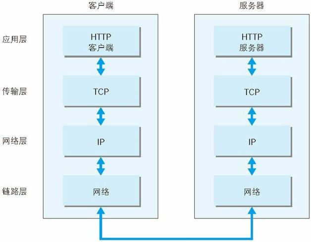
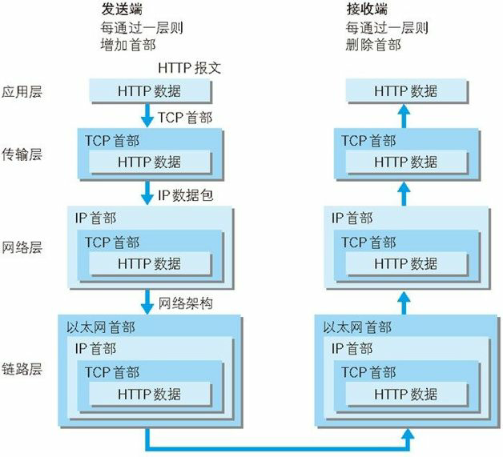
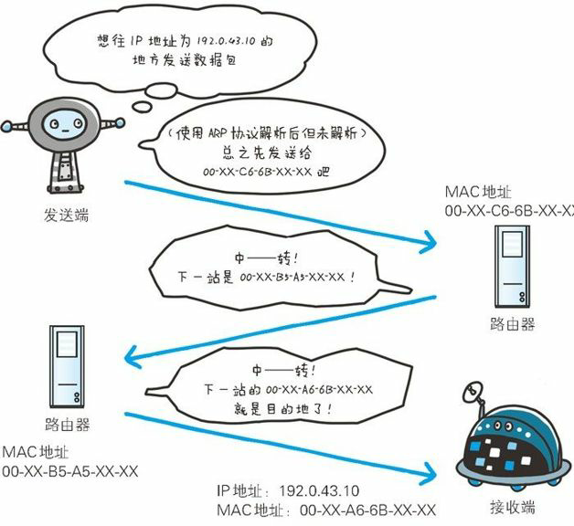
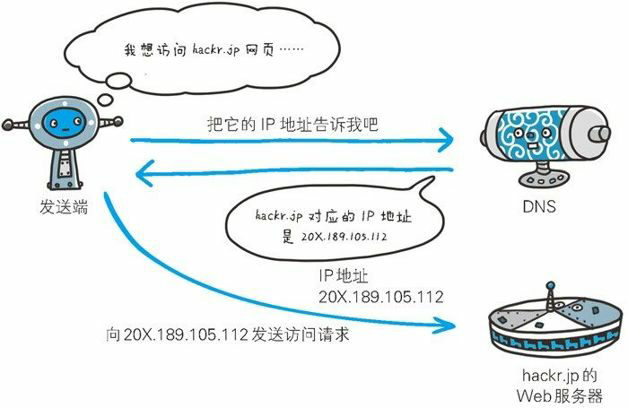
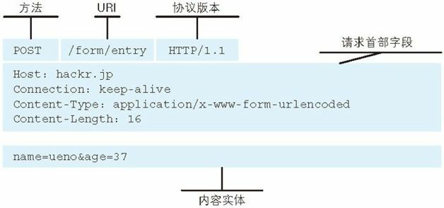
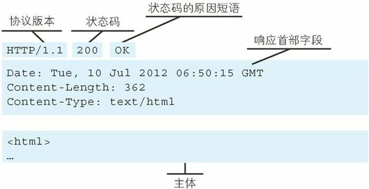
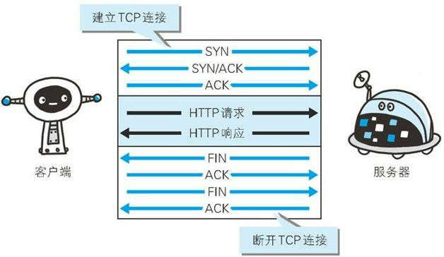
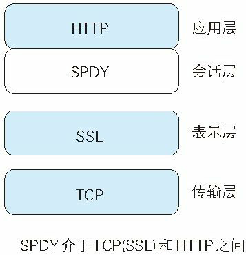

图解HTTP  -  上野宣（日）

## 第 **1** 章 网络基础 

HTTP（HyperText Transfer Protocol，超文本传输协议）规范

TCP/IP 协议族里重要的一点就是分层。

**TCP/IP 协议族按层次分别分为以下 4 层：应用层、传输层、网络层和数据链路层。** 

​	把 TCP/IP 层次化是有好处的。比如，如果互联网只由一个协议统筹，某个地方需要改变设计时，就必须把所有部分整体替换掉。而分层之后只需把变动的层替换掉即可。把各层之间的接口部分规划好之 后，每个层次内部的设计就能够自由改动了。 值得一提的是，层次化之后，设计也变得相对简单了。处于应用层上 的应用可以只考虑分派给自己的任务，而不需要弄清对方在地球上哪个地方、对方的传输路线是怎样的、是否能确保传输送达等问题。 

### 应用层

​	应用层决定了向用户提供应用服务时通信的活动。 
TCP/IP 协议族内预存了各类通用的应用服务。比如，FTP（File Transfer Protocol，文件传输协议）和 DNS（Domain Name System，域名系统）服务就是其中两类。HTTP 协议也处于该层。

#### 传输层

​	传输层对上层应用层，提供处于网络连接中的两台计算机之间的数据传输。在传输层有两个性质不同的协议：TCP（Transmission Control Protocol，传输控制协议）和 UDP（User Data Protocol，用户数据报协议）。

#### 网络层

​	网络层用来处理在网络上流动的数据包。数据包是网络传输的最小数据单位。该层规定了通过怎样的路径（所谓的传输路线）到达对方计算机，并把数据包传送给对方。与对方计算机之间通过多台计算机或网络设备进行传输时，网络层所起的作用就是在众多的选项内选择一条传输路线。

#### 数据链路层

​	用来处理连接网络的硬件部分。包括控制操作系统、硬件的设备驱动、NIC（Network Interface Card，网络适配器，即网卡），及光纤等物理可见部分（还包括连接器等一切传输媒介）。硬件上的范畴均在链路层的作用范围之内。 

**TCP/IP** 通信传输流

​     																

发送端在层与层之间传输数据时，每经过一层时必定会被打上一个该层所属的首部信息。反之，接收端在层与层传输数据时，每经过一层时会把对应的首部消去。这种把数据信息包装起来的做法称为封装（encapsulate）。

**1.4** 与 **HTTP** 关系密切的协议 **: IP**、**TCP** 和 **DNS** 

**1.4.1** 负责传输的 **IP** 协议

​	IP 协议的作用是把各种数据包传送给对方。而要保证确实传送到对方那里，则需要满足各类条件。其中两个重要的条件是 IP 地址和 MAC地址（Media Access Control Address）。IP 地址指明了节点被分配到的地址，MAC 地址是指网卡所属的固定地址。IP 地址可以和 MAC 地址进行配对。IP 地址可变换，但 MAC地址基本上不会更改。 

**1.4.2** 确保可靠性的 **TCP** 协议 

​	按层次分，TCP 位于传输层，提供可靠的字节流服务。 

​	所谓的字节流服务（Byte Stream Service）是指，为了方便传输，将大块数据分割成以报文段（segment）为单位的数据包进行管理。而可靠的传输服务是指，能够把数据准确可靠地传给对方。一言以蔽之，TCP 协议为了更容易传送大数据才把数据分割，而且 TCP 协议能够 确认数据最终是否送达到对方。 

​	确保数据能到达目标 

​	为了准确无误地将数据送达目标处，TCP 协议采用了三次握手 （three-way handshaking）策略。用 TCP 协议把数据包送出去后，TCP 不会对传送后的情况置之不理，它一定会向对方确认是否成功送达。 握手过程中使用了 TCP 的标志（flag） —— SYN（synchronize） 和 ACK（acknowledgement）。

​	发送端首先发送一个带 SYN 标志的数据包给对方。接收端收到后，回传一个带有 SYN/ACK 标志的数据包以示传达确认信息。最后，发送端再回传一个带 ACK 标志的数据包，代表“握手”结束。

​	若在握手过程中某个阶段莫名中断，TCP 协议会再次以相同的顺序发送相同的数据包。 

**1.5** 负责域名解析的 **DNS** 服务 

DNS（Domain Name System）服务是和 HTTP 协议一样位于应用层的协议。它提供域名到 IP 地址之间的解析服务。 计算机既可以被赋予 IP 地址，也可以被赋予主机名和域名。比如 www.hackr.jp。 

**1.6** 各种协议与 **HTTP** 协议的关系

​	学习了和 HTTP 协议密不可分的 TCP/IP 协议族中的各种协议后，我们再通过这张图来了解下 IP 协议、TCP 协议和 DNS 服务在使用 HTTP 协议的通信过程中各自发挥了哪些作用

**1.7 URI** 和 **URL** 

与 URI（统一资源标识符）相比，我们更熟悉 URL（Uniform Resource Locator，统一资源定位符）。URL正是使用 Web 浏览器等访问 Web 页面时需要输入的网页地址。比如，下图的 http://hackr.jp/就是 URL。 

## 

---

## 第一章

HTTP（HyperText Transfer Protocol，超文转移协议，超文本传输协议的译法并不严谨。）

### 网络基础 TCP/IP

#### TCP/IP 协议族

TCP/IP 协议族是互联网相关联的协议的集合。从电缆的规格到IP地址的选定方法、寻找异地用户的方法、双方建立通信的顺序，以及Web页面显示需要处理的步骤，等等。而HTTP是属于它内部的一个子集。

#### TCP/IP 的分层管理

TCP/IP 协议族按层次分别分为以下 4 层：应用层、传输层、网络层和数据链路层。 分层的好处：把各层之间的接口部分规划好之后，每个层次内部的设计就能够自由改动了。而且，层次化之后，设计也变得相对简单。处于应用层上的应用可以只考虑分派给自己的任务，而无需弄清对方在地球上哪个地方、对方的传输路线、是否能确保传输送达等问题。

- 应用层：决定了向用户提供应用服务时通信的活动。 TCP/IP 协议族预存了各类通用的应用服务。如 FTP（File Transfer Protocol）、DNS（Domain Name System）和 HTTP。
- 传输层：该层对上层应用层，提供处于网络连接中的两台计算机之间的数据传输。TCP（Transmission Control Protocol）和 UDP（User Data Protocol，用户数据报协议）。
- 网络层：网络层用来处理在网络上流动的数据包。数据包是网络传输的最小数据单位。该层规定了通过怎么样的路径到达对方计算机，并把数据包传送给对方。
- 链路层：用来处理网络的硬件部分。

#### TCP/IP 通信传输流

利用 TCP/IP 协议族进行网络通信时，会通过分层顺序与对方进行通信。发送端从应用层往下走，接收端则往应用层往上走。

用HTTP 举例来说：首先作为发送端的客户端在应用层（HTTP协议）发出一个HTTP请求。 接着，在传输层（TCP协议）把从应用层处收到的数据（HTTP请求报文）进行分隔，并在各个报文上打上标记序号及端口号后转发给网络层。 在网络层（IP协议），增加作为通信目的地的MAC地址后转发给链路层。这就让发往网络的通信请求准备齐全了。 接收端的服务器在链路层接收到数据后，按序往上层发送，一直到应用层。当传输到应用层，才能算真正接收到客户端发送过来的HTTP请求。

发送端在层与层之间传输数据时，每经过一层时必定会被打上一个该层所属的首部信息。反之，接收端在层与层传输数据时，每经过一层时会把对应的首部消去。 把数据信息包装起来的做法称为封装。 -->### 与HTTP关系密切的协议：IP、TCP和DNS

#### 负责传输的 IP 协议

IP（网际协议）位于网络层。该协议的作用是把各种数据包传送给对方。而要保证确实传送到对方那里，则需要满足各类条件。其中最重要的两个条件是 IP 地址和 MAC地址。 IP 地址指明了节点被分配到的地址，MAC地址是指网卡所属的固定地址。IP地址可以和MAC地址进行配对。

**使用ARP协议凭借MAC地址进行通信** IP间通信通信依赖MAC地址。通信的双方通常会经过多台计算机和网络设备中转才能连接到对方，而在进行中转时，会利用下一站中转设备的MAC地址来搜索下一个中转目标。这时，会采用ARP协议。该协议是一种用以解析地址的协议，根据通信方的IP地址就可以反查出对应的MAC地址。

#### 确保可靠性的TCP协议

TCP属于传输层，提供可靠的字节流服务。 字节流服务是指：为了方便传输，将大块数据分割成以报文段为单位的数据包进行管理。 这就是为什么下载高清大图时，图片会一块一块地加载。

**三次握手** 为了准确无误地将数据送达目标处，TCP协议在发送数据的准备阶段采用了三次握手策略（若在握手过程中某个阶段中断，TCP协议会再次以相同的顺序发送相同的数据包）。

当然，除了三次握手，TCP还有其它各种手段确保通信的可靠性。

### 负责域名解析的 DNS 服务

DNS服务提供域名到IP 地址之间的解析服务。 即可通过域名查找IP，或逆向从IP地址反查域名服务。

因为域名解析也需要时间，所以可以 [提前获取DNS来提升网页加载速度](https://gitee.com/link?target=http%3A%2F%2Ffanyi.jobbole.com%2F14191%2F)。

### URI和URL

URI（uniform Resource Identifier） Uniform：规定统一的格式可方便处理多种不同类型的资源。 Resource：可标识的任何东西 Identifier：标识符

URI就是某个协议方案表示的资源的定位标识符。协议方案是指访问资源所使用的协议类型名称，如http、ftp。

URI 用字符串标识某一个互联网资源，而URL表示资源的地点。URL是URI的子集。

表示指定的URI，要使用涵盖全部必要信息的绝对URI、绝对URL以及相对URL。相对URL是指从浏览器中基本URI处指定的URL，如 `/image/logo.gif`。

绝对URI的格式如下：

## 第二章 简单的HTTP协议

HTTP协议规定，先从客户端开始建立通信，服务端在没有接收到请求之前不会发送响应。

请求报文由请求方法、请求URI、协议版本、可选的请求首部字段和内容实体构成的。

响应报文基本上由协议版本、状态码、用以解释状态码的原因短语、可选的响应首部字段以及实体主体构成。

### HTTP是不保存状态的协议

HTTP是无状态协议。自身不对请求和响应之间通信状态进行保存（即不做持久化处理）。 HTTP之所以设计得如此简单，是为了更快地处理大量事物，确保协议的可伸缩性。 HTTP/1.1 随时无状态协议，但可通过 Cookie 技术保存状态。

### 告知服务器意图的HTTP方法

- GET：获取资源
- POST：传输实体主体
- PUT：传输文件
- HEAD：获得报文首部，与GET方法一样，只是不返回报文主体内容。用于确认URI的有效性及资源更新的日期时间等。
- DELETE：删除文件，与PUT相反（响应返回204 No Content）。
- OPTIONS：询问支持的方法，查询针对请求URI指定的资源支持的方法（Allow:GET、POST、HEAD、OPTIONS）。
- TRACE：追踪路径
- CONNECT：要求用隧道协议连接代理（主要使用SSL（Secure Sockets Layer，安全套接层）和TLS（Transport Layer Security，传输层安全）协议把通信内容加密后经网络隧道传输）。

向请求URI指定的资源发送请求报文时，采用称为方法的命令。方法名区分大小写，主要要用大写字母。

### 持久连接节省通信量

#### 持久连接

HTTP协议的初始版本中，每进行一次HTTP通信就要断开一次TCP连接。

发送请求一份包含多张图片的HTML文档对应的Web页面，会产生大量通信开销。

 为了解决上述TCP连接的问题，HTTP/1.1和一部分的HTTP/1.0想出了持久连接（HTTP Persistent Connections，也称为HTTP keep-alive 或 HTTP Connection resue）的方法。 **持久连接的特点**是，只要任意一端没有明确提出断开连接，则保持TCP连接状态。

持久连接的好处在于减少了TCP连接的重复建立和断开所造成的额外开销，减轻了服务器端的负载。另外，减少开销的那部分时间，使HTTP请求和响应能够更早地结束，这样Web页面的显示速度也相应提高了。

在HTTP/1.1中，所有连接默认都是持久连接，但在HTTP/1.0内并未标准化。 毫无疑问，除了服务器端，客户端也需要支持持久连接。

#### 管线化

持久连接使得多数请求以管线化方式发送成为可能。以前发送请求后需等待并收到响应，才能发送下一个请求。管线化技术出现后，不用等待响应亦可直接发送下一个请求（并行发送多个请求）。

注意：尽管HTTP管线化可以克服同域并行请求限制带来的阻塞， 但HTTP/1.x 有严格的串行返回响应机制，服务器通过 TCP 连接返回响应时，就是必须 按照客户端的请求顺序进行响应 ，前一个响应没有完成，下一个响应就不能返回。所以使用“ HTTP 管道”技术时，万一第一个响应时间很长，那么后面的响应处理完了也无法发送，只能被缓存起来，占用服务器内存，这就是传说中的“队首阻塞”。

> 每个浏览器支持的请求并发数不同，但可在页面中使用多个域名加大并发量（因为浏览器是基于domain的并发控制，而不是page），不过过多的散布会导致DNS解析上付出额外的代价。

### 使用Cookie的状态管理

Cookie技术通过在请求和响应报文中写入cookie信息来控制客户端的状态。 Cookie会根据从服务器端发送的响应报文内的一个叫做 `Set-Cookie` 的首部字段信息，通知客户端保存 Cookie。当下次客户端再往该服务器发送请求时，客户端会自动在请求报文中加入Cookie值后发送出去。

如果您在cookie中设置了HttpOnly属性，那么通过js脚本将无法读取到cookie信息，这样能有效的防止XSS攻击。

> Cookie-free Domains：用户在请求静态资源时，也会发送cookie信息。对于一个拥有多个静态资源的网站，这无疑会产生不必要的流量。因此我们可以启用与主站不同的域名（包括子域名）来放置静态资源。

## 第三章 HTTP报文内的HTTP信息

用于HTTP协议交互的信息被称为HTTP报文。请求端的HTTP报文叫做请求报文，响应端的叫做响应报文。HTTP报文本身是由多行（用CR+LF做换行符）数据构成的字符串文本。

HTTP报文大致可分为报文首部和报文主体两部块。两者由最初出现的空行（CR+LF、回车符+换行符）来划分。通常，并不一定要有报文主体。

### 编码提升传输速率

HTTP在传输数据时可以按照数据原貌直接传输，但也可以在传输过程中通过编码提升传输速率，但这会消耗更多的CPU等资源。

#### 报文主体和实体主体的差异

报文：是HTTP通信中的基本单位，由8位组字节流组成，通过HTTP通信传输。 实体：作为请求或响应的有效载荷数据（补充项）被传输，其内容由实体首部和实体主体组成。

HTTP报文的主体用于传输请求或响应的实体主体。 通常，报文主体等于实体主体。只有当传输中进行编码操作时，实体主体的内容发生变化，才导致它和报文主体产生差异。

#### 压缩传输的内容编码

内容编码指明应用在实体内容上的编码格式，并保持实体信息原样压缩。内容编码后的实体由客户端接收并负责解码。 常见的内容编码有：gzip（GNU zip）、compress（UNIX系统的标准压缩）、deflate（zlib）、identity（不进行编码）

#### 分隔发送的分块传输编码

在HTTP通信过程中，请求的编码实体资源尚未全部传输完成之前，浏览器无法显示请求页面。在传输大容量数据时，通过把数据分割成多块，能够让浏览器逐步显示页面。 这种把实体主体分块的功能称为**分块传输编码**（Chunked Transfer Coding）。

分块传输编码会将实体主体分成多个部分（块）。每一块都会用十六进制来标记块的大小，而实体主体的最后一块会使用“0（CR+LF）”来标记。

使用分块传输编码的实体主体会由接收的客户端负责解码，恢复到编码前的实体主体。

### 发送多种数据的多部分对象集合

HTTP协议中采纳了多部分对象集合，发送的一份报文主体内可含有多类型实体。通常实在图片或文本文件等上传时使用。

### 获取部分内容的范围请求

下载大尺寸的图片的过程中，如果网络中断，则需要重新下载。因此需要一种可恢复的机制。 实现该功能需要指定下载的实体范围，像这样，指定范围发送的请求叫做**范围请求**。 执行范围请求时，会用到首部字段Range来指定资源的byte范围。响应会返回状态码206 Partial Content。

如果服务器端无法响应范围请求，则会返回状态码200 OK和完整的实体内容。

### 内容协商返回最合适的内容

内容协商机制是指客户端和服务器端就响应的资源内容进行交涉，然后提供给客户端最为适合的资源。内容协商会以响应资源的语言、字符集、编码方式等作为判断的基准。

## 返回结果的HTTP状态码

状态码的职责是当客户端向服务器端发送请求时，描述返回的请求结果。 状态码如200 OK，以3为数字和原因短语组成。 数字中的第一位定义了响应类别，后两位无分类。响应类别有以下五种：

|      | 类别                             | 原因短语                   |
| ---- | -------------------------------- | -------------------------- |
| 1XX  | Informational(信息性状态码)      | 接收的请求正在处理         |
| 2XX  | Success（成功状态码）            | 请求正常处理完毕           |
| 3XX  | Redirection（重定向状态码）      | 需要进行附加操作以完成请求 |
| 4XX  | Client Error（客户端错误状态码） | 服务器无法处理请求         |
| 5XX  | Server Error（服务器错误状态码） | 服务器处理请求出错         |

只要遵守状态码类别的定义，即使改变 [RFC2616](https://gitee.com/link?target=https%3A%2F%2Fdatatracker.ietf.org%2Fdoc%2Frfc2616%2F) 中定义的状态码，或服务器端自行创建状态码都没问题。

### 常用的状态码14种：

#### 2XX 成功

- 200 OK：请求被正常处理
- 204 No Content：一般在只需从客户端往服务器发送信息，而对客户端不需要发送新信息内容的情况下使用。
- 206 Partial Content：客户端进行范围请求

#### 3XX 重定向

- 301 Moved Permanently：永久重定向。表示请求的资源已被分配了新的URI，以后应使用资源现在所指的URI。 也就是说，如果已经把资源对应的URI保存为书签了，这时应该按Location首部字段提示的URI重新保存。
- 302 Found：临时性重定向。表示请求的资源已被分配了新的URI，希望用户（本次）能使用新的URI访问。 和301 Moved Permanently状态码相似，但302状态码代表的资源不是被永久移动，只是临时性质的。换句话说，已移动的资源对应的URI将来还有可能发生改变。比如，用户把URI保存成书签，但不会像301状态码出现时那样去更新书签，而是仍旧保留返回302状态码的页面对应的URI（在Chrome中，还是会保存为重定向后的URI，不解）。
- 303 See Other：表示由于请求对应的资源存在着另一个URI，应使用GET方法定向获取请求的资源。这与302类似，但303明确表示客户端应当采用GET方法获取资源。
- 304 Not Modified：该状态码表示客户端发送附带条件的请求（指采用GET方法的请求报文中包含If-Match,If-Modified-Since，If-None-March，If-Range，If-Unmodified-Since中任一首部。）时，服务器端允许请求访问资源，但因发生请求为满足条件的情况后，直接返回304（服务器端资源未改变，可直接使用客户端未过期的缓存）。304状态码返回时，不包含任何响应的主体部分。
  304虽被划分在3XX类别，但是和重定向没有关系。
- 307 Temporary Redirect：临时重定向。与302有相同含义。307遵守浏览器标准，不会从POST变成GET。

> 就算是304，也需要发出请求与接收响应，也会耗费资源和时间。

#### 4XX 客户端错误

4XX的响应结果表明客户端是发生错误的原因所在。

- 400 Bad Request：表示请求报文中存在语法错误。
- 401 Unauthorized：表示发送的请求需要有通过HTTP认证（BASIC认证、DIGEST认证）的认证信息。
- 403 Forbidden：表明对请求资源的访问被服务器拒绝了。服务器端可在实体的主体部分对原因进行描述（可选）
- 404 Not Found：表明服务器上无法找到请求的资源。除此之外，也可以在服务器端拒绝请求且不想说明理由时时用。

#### 5XX 服务器错误

5XX的响应结果表明服务器本身发生错误。

- 500 Interval Server Error：表明服务器端在执行请求时发生了错误。也有可能是Web应用存在的bug或某些临时的故障。
- 503 Service Unavailable：表明服务器暂时处于超负载或正在进行停机维护，现在无法处理请求。如果事先得知解除以上状况需要的时间，最好写入Retry-After首部字段再返回给客户端。

## 第五章 与HTTP协作的Web服务器

### 用单台虚拟主机实现多个域名

HTTP/1.1 规范允许一台HTTP服务器搭建多个Web站点。这是利用虚拟主机（Virtual Host，又称虚拟服务器）的功能。

在互联网上，域名通过DNS服务映射到IP地址之后访问目标网站。可见，当请求发送到服务器时，已经是以IP地址形式访问了。所以，当一台托管了两个域名的服务器接收到请求时就需要弄清楚究竟要访问哪个域名。 在相同的IP地址下，由于虚拟主机可以寄存多个不同主机名和域名的Web网站，因此在发送HTTP请求时，必须在Host首部内完整指定主机名或域名的URI。

### 通信数据转发程序：代理、网关、隧道

HTTP通信时，除客户端和服务器以外，还有一些用于通信数据转发的应用程序，例如代理、网关、隧道。它们可以配合服务器工作。

- 代理：是一种有转发功能的应用程序，扮演了位于服务器和客户端“中间人”的角色，接收由客户端发送的请求并转发给服务器，同时也接收服务器返回的响应并转发给客户端。
- 网关：是转发其他服务器通信数据的服务器，接收从客户端发送来的请求时，它就像自己拥有资源的源服务器一样对请求进行处理。
- 隧道：是在相隔甚远的客户端和服务器两者之间进行中转，并保持双方通信连接的应用程序。

#### 代理

代理不改变请求URI，会直接发送给前方持有资源的目标服务器。 持有资源实体的服务器被称为源服务器。

 例如：

每次通过代理服务器转发请求或响应式，会追加写入via首部信息。

使用代理服务器的理由有：利用缓存技术减少网络带宽的流量，组织内部针对特定网站的访问控制，以获取访问日志为主要目的，等等。

代理有多种使用方法，按两种基准分类。一种是是否是否使用缓存，另一种是是否会修改报文。

- 代理缓存：代理转发响应时，缓存代理（Caching Proxy）会预先将资源的副本（缓存）保存在代理服务器上。当代理再次接收到对相同资源的请求时，就可以不从源服务器那里获取资源，而是将之前缓存的资源作为响应返回。
- 透明代理：转发请求或响应时，不对报文做任何加工的代理类型被称为透明代理（Transparent Proxy）。反之，对报文内容进行加工的代理被称为非透明代理。

#### 网关

网关的工作机制和代理十分相似。而网关能使通信线路上的服务器提供**非HTTP协议服务**。 利用网关能提高通信的安全性，因为可以在客户端与网关之间的通信线路上加密以确保连接的安全。比如，网关可以连接数据库，使用SQL语句查询数据。另外，在Web购物网站上进行信用卡结算时，网关可以和信用卡结算系统联动。

#### 隧道

隧道可按要求建立起一条与其他服务器的通信线路，届时使用SSL等加密手段进行通信。隧道的目的是确保客户端与服务器进行安全的通信。

隧道本身不会去解析HTTP请求。请求保持原样中转给之后的服务器。隧道会在通信双方断开连接时结束。

### 保存资源的缓存

缓存是指代理服务器或客户端本地磁盘内保存的资源副本。利用缓存可减少对源服务器的访问，节省通信流量和时间。

缓存服务器是代理服务器的一种。当代理转发从服务器返回的响应时，代理服务器将会保存一份资源的副本。

缓存服务器的优势在于利用缓存可避免多次从源服务器转发资源。因此客户端可就近从缓存服务器上获取资源，而源服务器也不必多次处理相同的请求了。

#### 缓存的有效期限

对于缓存服务器和客户端浏览器，当判定缓存过期或客户端要求，会向源服务器确认资源的有效性。若失效，浏览器会再次请求新资源。

## 第六章 HTTP首部 header

HTTP协议的请求和响应报文中必定包含HTTP首部。首部内容为客户端和服务器端分别处理请求和响应提供所需要的信息。

HTTP请求报文：由方法、URI、HTTP版本、HTTP首部字段等构成。 HTTP响应报文：由HTTP版本、状态码（数字和原因短语）、HTTP首部字段 3 部分组成。

### HTTP首部字段

使用首部字段是为了给浏览器和服务器提供报文主体大小、所使用的语言、认证信息等内容。

#### 4种HTTP首部字段类型

HTTP首部字段根据实际通途被分为以下4种类型：

- 通用首部字段（General Header Fileds）：请求报文和响应报文两方都会使用的首部
- 请求首都字段（Request Header Fields）：从客服端向服务器端发送请求报文时使用的首部。补充了请求的附加内容、客户端信息、响应内容相关优先级等信息。
- 响应首部字段（Response Header Fields）：从服务器端向客户端返回响应报文时使用的首部。补充了响应的附加内容，也会要求客户端附加额外的内容信息。
- 实体首部字段（Entity Header Fields）：针对请求报文和响应报文的实体部分使用的首部。补充了资源内容更新时间等与实体有关的信息。

#### HTTP/1.1首部字段一览

通用首部字段

| 首部字段名        | 说明                       |
| ----------------- | -------------------------- |
| Cache-Control     | 控制缓存行为               |
| Connection        | 逐跳首部、连接的管理       |
| Date              | 创建报文的日期时间         |
| Pragma            | 报文指令                   |
| Trailer           | 报文末端的首部一览         |
| Transfer-Encoding | 指定报文主体的传输编码方式 |
| Upgrade           | 升级为其他协议             |
| Via               | 代理服务器的相关信息       |
| Warning           | 错误通知                   |

Cache-Control的no-cache指令代表不缓存过期的资源，而不是不缓存。no-store才是真正不进行缓存。 Connection首部字段的值为close时，代表服务器想明确断开连接（HTTP/1.1默认都是持久连接）

请求首部字段

| 首部字段名          | 说明                                          |
| ------------------- | --------------------------------------------- |
| Accept              | 用户代理可处理的媒体类型                      |
| Accept-Charset      | 优先的字符集                                  |
| Accept-Encoding     | 优先的内容编码                                |
| Accept-Language     | 优先的语言                                    |
| Authorization       | Web认证信息                                   |
| Expect              | 期待服务器的行为                              |
| From                | 用户的电子邮箱地址                            |
| Host                | 请求资源所在服务器                            |
| If-Match            | 比较实体标记（ETag）                          |
| If-Modified-Since   | 比较资源的更新时间                            |
| If-Node-Match       | 比较实体标记（与If-Match相反）                |
| If-Range            | 资源未更新时发送实体Byte的范围请求            |
| If-Unmodified-Since | 比较资源的更新时间（与If-Modified-Since相反） |
| Max-Forwards        | 最大传输逐跳数                                |
| Proxy-Authorization | 代理服务器要求客户端的认证信息                |
| Range               | 实体的字节范围请求                            |
| Referer             | 对请求中URI的原始获取方                       |
| TE                  | 传输编码的优先级                              |
| User-Agent          | HTTP客户端程序的信息                          |

该表的Accept*字段都可以指定权重q（0-1）。当服务器提供多种内容时，将会首先返回权重最高的。 If-xxx请求首部字段都称为条件请求，服务器接收到附带条件的请求后，只有判断指定条件为真时，才回执行请求。 Referer 的正确拼写应该是Referrer。当直接在浏览器的地址栏输入URI时，或处于安全考虑时，可不发该首部字段。

响应首部字段

| 首部字段名         | 说明                         |
| ------------------ | ---------------------------- |
| Accept-Ranges      | 是否接受字节范围请求         |
| Age                | 推算资源创建经过时间         |
| ETag               | 资源的匹配信息               |
| Location           | 令客户端重定向至指定URI      |
| Proxy-Authenticate | 代理服务器对客户端的认证信息 |
| Retry-After        | 对再次发起请求的时机要求     |
| Server             | HTTP服务器的安装信息         |
| Vary               | 代理服务器缓存的管理信息     |
| WWW-Authenticate   | 服务器对客户端的认证信息     |

几乎所有浏览器在接收到包含首部字段Location的响应后，都会强制性地尝试对已提示的重定向资源的访问。

实体首部字段

| 首部字段名       | 说明                   |
| ---------------- | ---------------------- |
| Allow            | 资源可支持的HTTP方法   |
| Content-Encoding | 实体主体适用的编码方式 |
| Content-Language | 实体主体的自然语言     |
| Content-Length   | 实体主体的大小（字节） |
| Content-Location | 替代对应资源的URI      |
| Content-MD5      | 实体主体的报文摘要     |
| Content-Range    | 实体主体的位置范围     |
| Content-Type     | 实体主体的媒体类型     |
| Expires          | 实体主体过期的日期时间 |
| Last-Modified    | 资源的最后修改日期时间 |

为Cookie服务的首部字段

| 首部字段名 | 说明                           | 首部类型     |
| ---------- | ------------------------------ | ------------ |
| Set-Cookie | 开始状态管理所使用的Cookie信息 | 响应首部字段 |
| Cookie     | 服务器接收到的Cookie信息       | 请求首部字段 |

Set-Cookie字段的属性

| 属性         | 说明                                                         |
| ------------ | ------------------------------------------------------------ |
| NAME=VALUE   | 赋予Cookie的名称和其值（必需项）                             |
| expires=DATE | Cookie的有效期（若不明确指定则默认为浏览器关闭前为止）       |
| path=Path    | 将服务器上的文件目录作为Cookie的适用对象（若不指定则默认为文档所在的文件目录） |
| domain=域名  | 作为Cookie适用对象的域名（若不指定则默认为创建Cookie的服务器的域名） |
| Secure       | 仅在HTTPS安全通信时才会发送Cookie                            |
| HttpOnly     | 加以限制，使Cookie不能被JavaSript脚本访问                    |

expires：一旦Cookie从服务器端发送至客户端，服务器端就不存在可以显示删除Cookie的方法。但可通过覆盖已过期的Cookie，实现对客户端Cookie的实质性删除操作。 path：用来指定cookie被发送到服务器的哪一个目录路径下（即被服务器哪个路径接收cookie），其中"/"指的是站点根目录，可在同一台服务器（即使有多个应用）内共享该cookie。

## 第七章 确保Web安全的HTTPS

### HTTP的缺点

- 通信使用明文可能会被窃听
- 不验证通信方的身份就可能遭受伪装
- 无法验证报文完整性，可能已遭篡改

### HTTP+加密+认证+完整性保护 = HTTPS

## 第八章 确认访问用户身份的认证

核对的信息通常是指以下这些：

- 密码：只有本人才会知道的字符串信息
- 动态令牌：仅限本人持有的设备内显示的一次性密码
- 数字证书：仅限本人（终端）持有的信息
- 生物认证：指纹和虹膜等本人的生理信息
- IC卡等：仅限本人持有的信息

HTTP/1.1 使用的认证方式如下所示：

- BASIC认证（基本认证）
- DIGEST 认证（摘要认证）
- SSL 客户端认证
- FormBase认证（基于表单认证）

## 第九章 基于HTTP的功能追加协议

### HTTP的瓶颈

使用HTTP协议探知服务器上是否有内容更新，就必须频繁地从客户端到服务器端进行确认。如果服务器上没有内容更新，那么就会产生徒劳的通信。 若想在现有Web实现所需的功能，一下这些HTTP标准就会成为瓶颈：

- 一条连接上只可发送一个请求（前面讲到，持久化可保持TCP连接状态，但仍完成一次请求/响应后才能进行下一次请求/响应，而管线化方式可让一个TCP连接并行发送多个请求。）
- 请求只能从客户端开始。客户端不可以接收除响应以外的指令
- 请求/响应首部未经压缩就发送。首部信息越多延迟越大
- 发送冗长的首部。每次互相发送相同的首部造成的浪费较多
- 可任意选择数据压缩格式。非强制压缩发送

#### Comet 的解决方法

通常，服务器接收到请求，在处理完毕后就立即返回响应，但为了实现推送功能，Comet会先将响应置于**挂起状态**，当服务器端有内容更新时，再返回该响应。 内容上虽然可以做到实时更新，但为了保留响应，一次连接的持续时间也变长了。期间，为了维持连接会消耗更多的资源。另外，Comet仍未解决HTTP协议的本身存在的问题。

#### SPDY

Google 在2010年发布了 SPDY，其开发目标旨在解决HTTP的性能瓶颈，缩短Web页面的加载时间。 SPDY没有完全改写HTTP协议，而是在TCP/IP的应用层与运输层之间通过新加会话层的形式运作。同时，考虑到安全性问题，SPDY规定通信中使用SSL。

SPDY以会话层的形式加入，控制对数据的流动，但还是采用HTTP建立通信连接。因此，可照常使用HTTP的GET和POST等方法、Cookie以及HTTP报文等。

使用 SPDY后，HTTP协议额外获得以下功能。

- 多路复用流：通过单一的TCP连接，可以无限制处理多个HTTP请求。所有请求的处理都在一条TCP连接上完成，因此TCP的处理效率得到提高。
- 赋予请求优先级：SPDY不仅可以无限制地并发处理请求，还可以给请求逐个分配优先级顺序。这样主要是为了在发送多个请求时，解决因带宽低而导致响应变慢的问题。
- 压缩HTTP首部：压缩HTTP请求和响应的首部。
- 推送功能：支持服务器主动向客户端推送数据的功能。
- 服务器提示功能：服务器可以主动提示客户端请求所需的资源。由于在客户端发现资源之前就可以获知资源的存在，因此在资源已缓存等情况下，可以避免发送不必要的请求。

### 使用浏览器进行全双工通信的 WebSocket

利用Ajax和Comet技术进行通信可以提升Web的浏览速度。但问题在于通信若使用HTTP协议，就无法彻底解决瓶颈问题。

WebSocket技术主要是为了解决Ajax和Comet里XMLHttpRequst附带的缺陷所引起的问题。

一旦Web服务器与客户端之间建立起WebSocket协议的通信连接，之后所有的通信都依靠这个专用协议进行。通信过程中可互相发送JSON、XML、HTML或图片等任意格式的数据。

WebSocket的主要特点：

- 推送功能：支持由服务器向客户端推送数据。
- 减少通信量：和HTTP相比，不但每次连接时的总开销减少，而且由于WebSocket的首部信息很小，通信量也相应较少。

为了实现WebSocket通信，在HTTP连接建立之后，需要完成一次“握手”的步骤。

- 握手·请求：为了实现WebSocket通信，需要用到HTTP的Upgrade首部字段，告知服务器通信协议发生改变，以达到握手的目的。
- 握手·响应：对于之前的请求，返回状态码101 Switching Protocols 的响应。

成功握手确立WebSocket连接后，通信时不再使用HTTP的数据帧，而采用WebSocket独立的数据帧。

**由于是建立在HTTP基础上的协议，因此连接的发起方仍是客户端**，而一旦确立WebSocket通信连接，不论服务器端还是客户端，任意一方都可直接向对方发送报文。

## HTTP/2.0

[HTTP2中英对照版](https://gitee.com/link?target=https%3A%2F%2Fgithub.com%2Ffex-team%2Fhttp2-spec%2Fblob%2Fmaster%2FHTTP2%E4%B8%AD%E8%8B%B1%E5%AF%B9%E7%85%A7%E7%89%88%2806-29%29.md) [HTTP/2.0 相比1.0有哪些重大改进？](https://gitee.com/link?target=https%3A%2F%2Fwww.zhihu.com%2Fquestion%2F34074946)

## 第十一章 Web攻击技术

简单的HTTP协议本身并不存在安全性问题，因此协议本身几乎不会成为攻击的对象。应用HTTP协议的服务器和客户端，以及运行在服务器上的Web应用等资源才是攻击目标。

HTTP不具备必要的安全功能，就拿远程登录时会用到的SSH协议来说，SSH具备协议级别的认证及会话管理等功能，HTTP协议则没有。另外在架设SSH服务方面，任何人都可以轻易地创建安全等级高的服务。而HTTP即使已假设好服务器，但开发者需要自行设计并开发认证及会话管理功能来满足Web应用的安全。而自行设计就意味着会出现各种形形色色的实现，可仍在运作的Web应用背后就会隐藏着各种容易被攻击者滥用的安全漏洞的Bug。

### 因输出值转义不完全引发的安全漏洞

- 跨站脚本攻击（Cross-Site Scripting, XSS）：主要是指在用户浏览器内运行了非法的 HTML 标签或 JavaScript 脚本。比如富文本编辑器，如果不过滤用户输入的数据直接显示用户输入的HTML内容的话，就会有可能运行恶意的 JavaScript 脚本，导致页面结构错乱，Cookies 信息被窃取等问题。
- SQL注入攻击（SQL Injection）：是指针对 Web 应用使用的数据库，通过运行非法的SQL而产生的攻击。
- OS命令攻击（OS Command Injection）：是指通过 Web 应用，执行非法的操作系统命令达到攻击的目的。 只要在能调用 Shell 函数的地方就有存在被攻击的风险。
- HTTP首部注入攻击（HTTP Header Injection）：是指攻击者通过在响应首部字段内插入换行，添加任意响应首部或主体的一种攻击。
- HTTP 响应截断攻击：是用在 HTTP 首部注入的一种攻击。攻击顺序相同，但是要将两个 %0D%0A%0D%0A 并排插入字符串后 发送。利用两个连续的换行就可作出 HTTP 首部与主体分隔所需的空行了，这样 就能显示伪造的主体，达到攻击的目的。
- 邮件首部注入攻击（Mail Header Injection）：是指 Web 应用中的邮件发送功能，攻击者通过向邮件首部 To 或 Subject 内任意添加非法内容发起的攻击。利用存在安全漏洞的Web网站，可对任意邮件地址发送广告邮件或 病毒邮件。
- 目录遍历攻击（Directory Traversal）：是指对本无意公开的文件目录，通过非法截断其目录路径后，达成访问目的的一种攻击。比如，通过 ../ 等相对路径定位到 /etc/passwd 等绝对路径上。
- 远程文件包含漏洞（Remote File Inclusion）： 是指当部分脚本内容需要从其他文件读入时，攻击者利用指定外部服务器的URL充当依赖文件，让脚本读取之后，就可运行任意脚本的一种攻击。

### 因设置或设计上的缺陷引发的安全漏洞

- 强制浏览（Forced Browsing）：是指，从安置在Web服务器的公开目录下的文件中，浏览那些原本非自愿公开的文件。比如，没有对那些需要保护的静态资源增加权限控制。
- 不正确的错误消息处理（Error Handling Vulerability）：指Web应用的错误信息内包含对攻击者有用 的信息。
- 开放重定向（Open Redirect）：是一种对指定的任意URL作重定向跳转的功能。而于此功能相关联的安全漏洞是指， 假如指定的重定向 URL 到某个具有恶意的 Web 网站，那么用户就会被诱导至那个 Web 网站。

### 因会话管理疏忽引发的安全漏洞

- 会话劫持（Session Hijiack）：是指攻击者通过某种手段拿到了用户的会话 ID，并非法使用此会话 ID 伪装成用户，达到攻击的目的。
- 会话固定攻击（Session Fixation）：对以窃取目标会话ID为主动攻击手段的会话劫持而言，会强制用户使用攻击者指定的会话 ID，属于被动攻击。
- 跨站点请求伪造（Cross-Site Request Forgeries, CSRF）：是指攻击者通过设置好陷阱，强制对已完成认证的用户进行非预期的个人信息或设定等某些状态更新，属于被动攻击。

### 其它安全漏洞

- 密码破解：①通过网络进行密码试错（穷举法和字典攻击）；②对已加密密码的破解（通过穷举法·字典攻击进行类推、彩虹表、拿到加密时使用的密钥、加密算法的漏洞）
- 点击劫持：是指利用透明的按钮或链接做成陷阱，覆盖在Web页面之上。然后诱使用户在不知情的情况下， 单击那个链接访问内容的一种攻击手段。这种行为又称为界面伪装（UI Redressing）。
- Dos攻击：是一种让运行中的服务呈停止状态的攻击。有时也叫做服务停止攻击或拒绝服务攻击。多台计算机发起的 Dos 攻击称为 DDoS 攻击（Distributed Denial of Service attach） 。
- 后门程序：是指开发设置的隐藏入口（如开发阶段作为Debug调用的后门程序），可不按正常步骤使用受限功能。利用后门程序就能够使用原本受限的功能。

