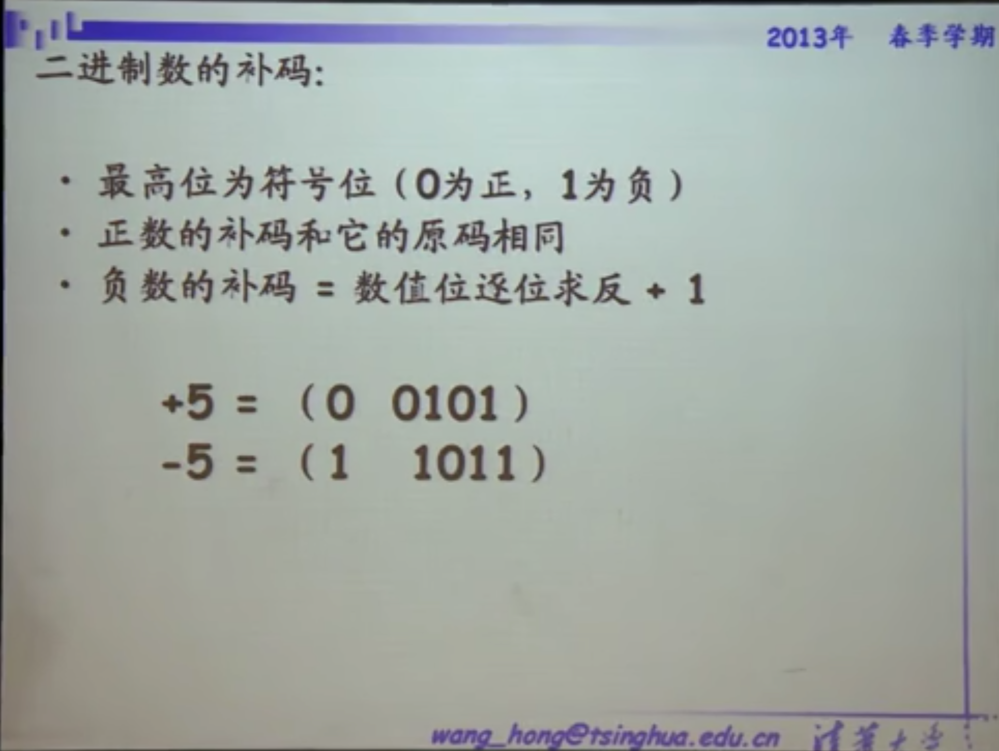

# 数字电子技术基础（数字电路/数电)

## 信息与编码

### 二进制

## 逻辑代数

与或非

逻辑函数化简法

卡诺图

## 半导体二极管门电路

门电路:实现基本运算\符合盐酸的单元电路,如与门,或门,与非门

门电路中以高/低电平表示逻辑状态的1/0

## CMOS反相器的工作原理

## 双极性三极管

## TTL反相器的工作原理

P18 [组合电路的分析和设计方法](https://www.bilibili.com/video/BV18p411Z7ce?p=18)

https://www.bilibili.com/video/BV18p411Z7ce?p=18

P22  组合电路中的竞争—冒险
P23  EDA 可编程逻辑器件（1）
P24  触发器的电路结构和动作特点
P25  触发器逻辑功能的分类
P26  电路结构与逻辑功能的关系
P27  FSM,时序电路的分析方法
P28  典型的时序电路模块1
P29  典型的时序电路模块2
P30  同步计数器
P31  任意进制计数器的构成方法1
P32  任意进制计数器的构成方法2
P33  同步时序电路的设计方法1
P34  同步时序电路的设计方法2
P35  时序电路的动态特性分析1
P36  时序电路的动态特性分析2
P37  时序电路扩展1
P38  时序电路扩展2
P39  ROM、RAM 的工作原理和使用方法（1）第一讲
P40  ROM、RAM 的工作原理和使用方法（1）第二讲
P41  EDA 可编程逻辑器件 硬件描述语言（2）
P42  施密特触发器的工作原理和应用
P43  单稳态触发器的工作原理和应用1
P44  单稳态触发器的工作原理和应用2
P45  多谐振荡器的工作原理和主要类型
P46  555定时器的工作原理和应用1
P47  555定时器的工作原理和应用2
P48  D-A转换器的工作原理，转换精度和速度
P49  A-D转换器的工作原理，转换精度和速度1
P50  A-D转换器的工作原理，转换精度和速度2
P51  附 电子技术课程设计教 录像

继电器 迭代到 真空管 迭代到 晶体管(迭代到5纳米级别,每秒切换上百万次 )

通过控制门电路的电荷可以控制半导体材料的导电性

半导体:有时候导电,有时候不导电,可开关,允许或不允许电流流动

