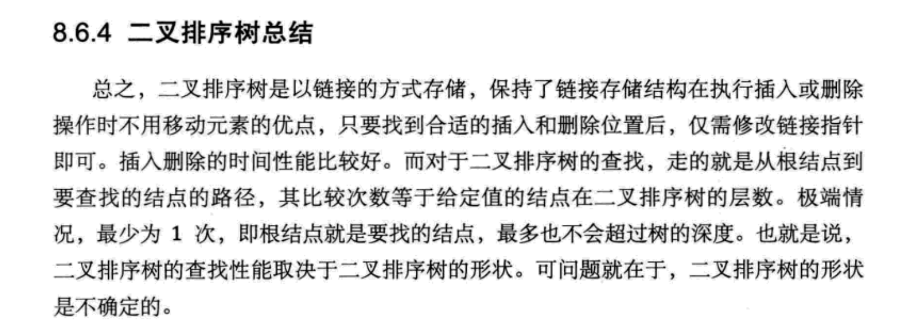
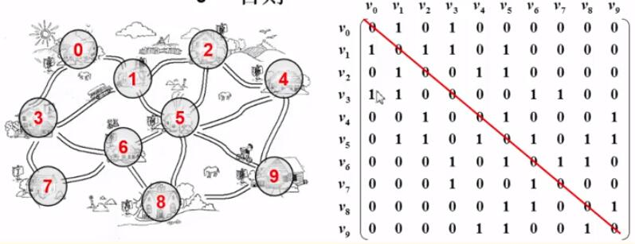

## 《大话数据结构》 -- 程杰


## 第一章 数据结构绪论

## 第二章 算法


## 第三章 线性表：

 线性表：

​	顺序存储结构

​	链式存储结构


​	顺序存储结构：


链式存储结构：


## 第四章 栈与队列


队列：


## 第五章 串


## 第六章 树


二叉树的储存结构


赫夫曼树算法：


## 第七章 图


无向图：


有向图：


无向完全图

有向完全图


图的储存结构


## 第八章 查找





树：

二叉树

二叉排序树

平衡二叉树（AVL树）

多路查找树（B树）


2-3树

2-3-4树

B+树


散列表（哈希表）


冲突问题：


思路：

1，更换备用散列函数，直到找到可储存的空地址

2，哈希链表，目标地址存放单向链表


## 第九章 排序


排序算法的指标：

1，时间性能

2，辅助空间

3，算法的复杂度


冒泡排序

简单选择排序

直接插入排序


希尔排序

堆排序

归并排序

快速排序


---


## 《浙江大学的数据结构》


第一讲 基本概念：1.1.1 至 1.3.3
第二讲 线性结构：2.1.1 至 小白专场：多项式乘法与加法运算③
第三讲 树(上)：3.1.1 至 小白专场：树的同构②
第四讲 树(中)：4.1.1 至 小白专场：是否同一棵二叉搜索树③
第五讲 树(下)：5.1.1 至 小白专场：File Transfer④
第六讲 图(上)：6.1 至 小白专场：如何建立图⑥
第七讲 图(中)：7.1.1 至 小白专场：哈利?波特的考试④
第八讲 图(下)：8.1.1 至 图之习题选讲-旅游规划②
第九讲 排序(上)：9.1.1 至 9.4.3
第十讲 排序(下)：10.1.1 至 排序之习题选讲Sort with Swap(0,*) ②
第十一讲 散列查找：11.1.1 至 散列查找之习题选讲-Hashing - Hard Version


## 第一讲 基本概念

### 算法

复杂度

时间效率和空间效率


## 第二讲 线性结构

### 线性表

“线性表”：由同类型数据元素构成有序序列的线性结构

表中元素个数称为线性表的长度
线性表没有元素时，称为空表
表起始位置称为表头，表结束位置称表尾

#### 线性表的抽象数据类型描述

类型名称：线性表（List）

数据对象集：线性表是 n (≥0) 个元素构成的有序序列


#### 线性表的顺序存储实现

1，数组
利用数组的连续存储空间顺序存放线性表的各元素

2，链表
不要求逻辑上相邻的两个元素物理上也相邻，通过"链"建立起数据之间的逻辑关系

### 堆栈

1. 什么是堆栈
堆栈（Stack）：具有一定操作约束的线性表

只在一端（栈顶，Top）做插入、删除
插入数据：入栈（Push）
删除数据：出栈（Pop）
后入先出：Last In First Out（LIFO）

2. 堆栈的抽象数据类型描述
类型名称：堆栈（Stack）

数据对象集：一个有 0 个或多个元素的有穷线性表

操作集：长度为 MaxSize 的堆栈 S ∈ Stack，堆栈元素 item ∈ ElementType

堆栈的基本操作主要有：

Stack CreateStack(int MaxSize)：生成空堆栈，其最大长度为 MaxSize
int IsFull(Stack S,int MaxSize)：判断堆栈 S 是否已满
void Push(Stack S,ElementType item)：将元素 item 压入堆栈
int IsEmpty(Stack S)：判断堆栈 S 是否为空
ElementType Pop(Stack S)：删除并返回栈顶元素

```c
#include<stdio.h>
#include<malloc.h> 
#define MaxSize 100   // 堆栈元素的最大个数 
typedef int ElementType; // ElementType 暂时定义为 int 类型 
typedef struct SNode *Stack;
struct SNode{
	ElementType Data[MaxSize];   // 存储堆栈元素
	int Top;  // 记录栈顶元素下标 
}; 
Stack S;

Stack CreateStack();  // 初始化堆栈 
int IsFull(Stack S); // 判断堆栈是否已满 
int IsEmpty(Stack S);   // 判断堆栈是否为空 
void Push(Stack S,ElementType item);   // 入栈 
ElementType Pop(Stack S);   // 出栈 

// 初始化堆栈 
Stack CreateStack(){
	S = (Stack)malloc(sizeof(struct SNode));
	S->Top = -1;
	return S;
} 

// 是否已满 
int IsFull(Stack S){
	return (S->Top == MaxSize-1);
}

// 是否为空 
int IsEmpty(Stack S){
	return (S->Top == -1); 
} 

// 入栈 
void Push(Stack S,ElementType item){
	if(IsFull(S)){   // Top 从 0 开始 
		printf("堆栈满");
		return;
	}else{
		S->Top++;   // 栈顶元素加一 
		S->Data[S->Top] = item;   // 放进最上 
		return;
	}
}

// 出栈
ElementType Pop(Stack S){
	if(IsEmpty(S)){
		printf("堆栈空");
		return;
	}else{
		ElementType val = S->Data[S->Top];  //取出最上 
		S->Top--;  // 栈顶元素减一 
		return val;
	}
}
int main(){
	S = CreateStack();
	printf("5入栈\n");
	Push(S,5);
	printf("7入栈\n");
	Push(S,7);
	printf("66入栈\n");
	Push(S,66);
	printf("%d出栈\n",Pop(S));
	printf("%d出栈\n",Pop(S));
	return 0;
}

```


#### 栈的[链表](https://so.csdn.net/so/search?q=链表&spm=1001.2101.3001.7020)存储实现

 栈的链式存储结构实际上就是一个单链表，叫做链栈。插入和删除操作只能在链栈的栈顶进行

```c
#include<stdio.h>
#include<malloc.h>
typedef int ElementType;
typedef struct SNode *Stack;
struct SNode{
	ElementType Data;
	Stack Next;
};


Stack CreateStack();  // 初始化链栈 
int IsEmpty(Stack S);  // 判断链栈是否为空 
void Push(Stack S,ElementType item);  // 入栈 
ElementType Pop(Stack S);  // 出栈
 

// 初始化 
Stack CreateStack(){
	Stack S;
	S = (Stack)malloc(sizeof(struct SNode));
	S->Next = NULL;
	return S;
}

// 判断是否为空 
int IsEmpty(Stack S){
	return (S->Next == NULL);
}

// 入栈
void Push(Stack S,ElementType item){
	Stack tmp;
	tmp = (Stack)malloc(sizeof(struct SNode));
	tmp->Data = item;
	// 链栈栈顶元素是链表头结点，新入栈的链表在栈顶元素后面 
	tmp->Next = S->Next;   
	S->Next = tmp;
} 

// 出栈
ElementType Pop(Stack S){
	Stack First;
	ElementType TopVal;
	if(IsEmpty(S)){
		printf("堆栈空");
		return;
	}else{
		First = S->Next;   // 出栈第一个元素在栈顶元素后面 
		S->Next = First->Next;  //把第一个元素从链栈删除 
		TopVal = First->Data;   // 取出被删除结点的值 
		free(First);  // 释放空间 
		return TopVal;
	}
} 

int main(){
	Stack S;
	S = CreateStack();
	printf("5入栈\n");
	Push(S,5);
	printf("7入栈\n");
	Push(S,7);
	printf("66入栈\n");
	Push(S,66);
	printf("%d出栈\n",Pop(S));
	printf("%d出栈\n",Pop(S));
	return 0;
} 

```


### 队列

1. 什么是队列
队列（Queue）：具有一定操作约束的线性表

插入和删除操作：只能在一端（front）插入，而在另一端（rear）删除
数据插入：入队列（AddQ）
数据删除：出队列（DeleteQ）
先进先出：FIFO
2. 队列的抽象数据类型描述
类型名称：队列（Queue）

数据对象集：一个有 0 个或多个元素的有穷线性表

操作集：长度为 MaxSize 的队列 Q∈Queue，队列元素 item∈ElementType

队列的基本操作主要有：

Queue CreateQueue(int MaxSize)：生成长度为 MaxSize 的空队列
int IsFull(Queue Q)：判断队列 Q 是已满
void AddQ(Queue Q,ElementType item)：将数据元素 item 插入队列 Q 中
int IsEmpty(Queue Q)：判断队列 Q 是否为空
ElementType DeleteQ(Queue Q)：将队头数据元素从队列中删除并返回
1. 循环队列的顺序存储实现
 队列的顺序存储结构通常由一个一维数组和一个记录队列头元素位置的变量 front 以及一个记录队列尾元素位置的变量 rear 组成，其中 front 指向整个队列的头一个元素的再前一个，rear 指向的是整个队列的最后一个元素，从 rear 入队，从 front 出队，且仅使用 n-1 个数组空间

```c
#include<stdio.h>
#include<malloc.h>
#define MaxSize 100
typedef int ElementType;
typedef struct QNode *Queue;
struct QNode{
	ElementType Data[MaxSize];
	int front;   // 记录队头 
	int rear;    // 记录队尾 
};

Queue CreateQueue();  // 初始化队列 
void AddQ(Queue Q,ElementType item);  //  入队
int IsFull(Queue Q); // 判断队列是否已满 
ElementType DeleteQ(Queue Q);  // 出队 
int IsEmpty(Queue Q); // 判断队列是否为空 

// 初始化 
Queue CreateQueue(){
	Queue Q;
	Q = (Queue)malloc(sizeof(struct QNode));
	Q->front = -1;
	Q->rear = -1;
	return Q;
} 

// 判断队列是否已满
int IsFull(Queue Q){
 	return ((Q->rear+1) % MaxSize == Q->front);
}

// 入队 
void AddQ(Queue Q,ElementType item){
	if(IsFull(Q)){
		printf("队列满");
		return;
	}else{ 
		Q->rear = (Q->rear+1) % MaxSize;
		Q->Data[Q->rear] = item; 
	}
}

//判断队列是否为空
int IsEmpty(Queue Q){
	return (Q->front == Q->rear);
}
 
// 出队
ElementType DeleteQ(Queue Q){
	if(IsEmpty(Q)){
		printf("队列空");
		return 0;
	}else{
		Q->front = (Q->front+1) % MaxSize;
		return Q->Data[Q->front];
	}
} 

int main(){
	Queue Q;
	Q = CreateQueue();
	AddQ(Q,3);
	printf("3入队\n");
	AddQ(Q,5);
	printf("5入队\n");
	AddQ(Q,11);
	printf("11入队\n");
	printf("%d出队\n",DeleteQ(Q));
	printf("%d出队\n",DeleteQ(Q));
	return 0;
} 

```

#### 2. 队列的链式存储实现

 队列的链式存储结构也可以用一个单[链表](https://so.csdn.net/so/search?q=链表&spm=1001.2101.3001.7020)实现。插入和删除操作分别在链表的两头进行，front 在链表头，rear 在链表尾，从 rear 入队，从 front 出队

```c
#include<stdio.h>
#include<malloc.h>
typedef int ElementType;
typedef struct QNode *Queue;
struct Node{
	ElementType Data;
	struct Node *Next;
};
struct QNode{
	struct Node *rear;    // 指向队尾结点 
	struct Node *front;   // 指向队头结点 
};

Queue CreateQueue();  // 初始化队列 
void AddQ(Queue Q,ElementType item);  //  入队
ElementType DeleteQ(Queue Q);  // 出队 
int IsEmpty(Queue Q); // 判断队列是否为空 

// 初始化 
Queue CreateQueue(){
	Queue Q;
	Q = (Queue)malloc(sizeof(struct QNode));
	Q->front = NULL;
	Q->rear = NULL;
	return Q;
}

// 是否为空 
int IsEmpty(Queue Q){
	return (Q->front == NULL);
}

// 入队
void AddQ(Queue Q,ElementType item){
	struct Node *node;
	node = (struct Node *)malloc(sizeof(struct Node));
	node->Data = item;
	node->Next = NULL;
	if(Q->rear==NULL){  //此时队列空 
		Q->rear = node;
		Q->front = node;
	}else{ //不为空 
		Q->rear->Next = node;  // 将结点入队 
		Q->rear = node;   // rear 仍然保持最后 
	}
} 

// 出队
ElementType DeleteQ(Queue Q){
	struct Node *FrontCell;
	ElementType FrontElem;
	if(IsEmpty(Q)){
		printf("队列空");
		return 0;
	}
	FrontCell = Q->front;
	if(Q->front == Q->rear){ // 队列中只有一个元素 
		Q->front = Q->rear = NULL; 
	}else{
		Q->front = Q->front->Next;
	}
	FrontElem = FrontCell->Data;
	free(FrontCell);
	return FrontElem;
}

int main(){
	Queue Q;
	Q = CreateQueue();
	printf("入队5\n"); 
	AddQ(Q,5);
	printf("入队4\n"); 
	AddQ(Q,4);
	printf("入队4\n"); 
	AddQ(Q,3);
	printf("出队%d\n",DeleteQ(Q));
	printf("出队%d\n",DeleteQ(Q));
	printf("出队%d\n",DeleteQ(Q));
	printf("%d\n",DeleteQ(Q));
	return 0;
} 

```


### 什么是抽象的链表

有快地方存数据

又快地方存指针 -- 下一个节点的地址

所以不是说只有C，C++这样拥有指针的语言可以，每个语言都可以实现链表

## 第三讲 树(上)

1. 树的定义
树（Tree）：n（n≥0）个结点构成的有限集合，当 n=0 时，称为空树

2. 基本术语
    结点的度（Degree）：结点的子树个数
    树的度：树的所有结点中最大的度数
    叶结点（Leaf）：度为 0 的结点
    父结点（Parent）：有子树的结点是其子树的根结点的父结点
    子结点（Child）：若 A 结点是 B 结点的父结点，则称 B 结点是 A 结点的子结点，也称孩子结点
    兄弟结点（Sibling）：具有同一父结点的各个结点彼此是兄弟结点
    路径：
    路径长度：路径所包含边的个数
    祖先结点（Ancestor）：沿树根到某一结点路径上的所有结点都是这个结点的祖先结点
    子孙结点（Descendant）：某一结点的子树中的所有结点是这个结点的子孙
    结点的层次（Level）：规定根结点在 1 层，其他任一结点的层数是其父结点的层数加一
    树的深度（Depth）：树中所有结点中的最大层次是这棵树的深度

3. 树的表示
1. 儿子-兄弟表示法


Element 存值
FirstChild 指向第一个儿子
NextSibling 指向下一个兄弟


2. 二叉树
即度为 2 的树


Element 存值
Left 指向左子树
Right 指向右子树
二叉树其实就是儿子-兄弟表示法的链表右移 45° 得到的结果


2. 二叉树
1. 定义
 二叉树 T：一个有穷的结点集合

 这个集合可以为空

 的两个不相交的二叉树组成

 二叉树的子树有左右顺序之分

2. 五种基本形态


3. 特殊形态
斜二叉树

只有左儿子或只有右儿子

完美二叉树（满二叉树）

除最后一层叶结点外，每个结点都有两个子结点

完全二叉树

有 n 个结点的二叉树，对树中结点按从上至下、从左到右顺序进行编号，编号为 i（1 ≤ i ≤ n）结点与满二叉树中编号为 i 结点在二叉树中位置相同

5. 抽象数据类型定义
类型名称：二叉树

数据对象集：一个有穷的结点集合，若不为空，则由根结点和其左、右二叉子树组成

操作集：BT ∈ BinTree，Item ∈ ElementType

主要操作有：

Boolean IsEmpty(BinTree BT)：判别 BT 是否为空
void Traversal(BinTree BT)：遍历，按某顺序访问每个结点
BinTree CreatBinTree()：创建一个二叉树
常用的遍历方法有：

void PreOrderTraversal(BinTree BT)：先序——根、左子树、右子树
void InOrderTraversal(BinTree BT)：中序——左子树、根、右子树
void PostOrderTraversal(BinTree BT)：后序——左子树、右子树、根
void LevelOrderTraversal(BinTree BT)：层次遍历，从上到下、从左到右
1. 顺序存储结构
按从上至下、从左到右顺序存储 n 个结点的完全二叉树的结点父子关系：

非根结点（序号 i > 1）的父结点的序号是 ⌊i/2⌋（向下取整）
结点（序号为 i）的左孩子结点的序号是 2i（若 2 i ≤ n，否则没有左孩子
结点（序号为 i）的右孩子结点的序号是 2i+1（若 2 i +1 ≤ n，否则没有右孩子


2. 链表存储

typedef struct TreeNode *BinTree;
struct TreeNode{
	Element Data;  // 存值 
	BinTree Left;    // 左儿子结点 
	BinTree Right;   // 右儿子结点 
};

## 第四讲 树(中)

## 第五讲 树(下)

#### 堆 Heap  （特殊的队列）

优先队列(Priority Queue)  
结构性:用 *数组* 表示的完全二叉树;  
有序性:任一结点的关键字是其子树所有结点的最大值(或最小值)  

   * “最大堆(MaxHeap)”,也称“大顶堆”:最大值  
     * “最小堆(MinHeap)”,也称“小顶堆” :最小值  

主要操作有:   
• MaxHeap Create( int MaxSize ):创建一个空的最大堆。  
• Boolean IsFull( MaxHeap H ):判断最大堆H是否已满。  
• Insert( MaxHeap H, ElementType item ):将元素item插入最大堆H。   
• Boolean IsEmpty( MaxHeap H ):判断最大堆H是否为空。  
• ElementType DeleteMax( MaxHeap H ):返回H中最大元素(高优先级)。  

##### 结构

```c
typedef struct HNode *MaxHeap;
struct HNode {
    ElementType *Elements; // 存储堆元素的数组
    int Size;   // 堆的当前元素的个数
    int Capacity  // 堆的最大容量
}

```

## 

## 第六讲 图(上)

### 图

1. 什么是图
表示”多对多”的关系
包含
一组顶点：通常用 V（Vertex）表示顶点集合
一组边：通常用 E（Edge）表示边的集合
边是顶点对：（v,w）∈ E，其中 v,w ∈ V v—w
有向边 <v,w> 表示从 v 指向 w 的边（单行线） v→w
不考虑重边和自回路
2. 常见术语
无向图：图中所有的边无所谓方向
有向图：图中的边可能是双向，也可能是单向的，方向是很重要的
权值：给图中每条边赋予的值，可能有各种各样的现实意义
网络：带权值的图
邻接点：有边直接相连的顶点
出度：从某顶点发出的边数
入度：指向某顶点的边数
稀疏图：顶点很多而边很少的图
稠密图：顶点多边也多的图
完全图：对于给定的一组顶点，顶点间都存在边
3. 抽象数据类型定义
类型名称：图（Graph）

数据对象集：G（V，E）由一个非空的有限顶点集合 V 和一个有限边集合 E 组成

操作集：对于任意图 G ∈ Graph，以及 v ∈ V，e ∈ E

主要操作有：

Graph Create()：建立并返回空图
Graph InsertVertex(Graph G,Vertex v)：将 v 插入 G
Graph InsertEdge(Graph G,Edge e)：将 e 插入 G
void DFS(Graph G,Vertex v)：从顶点 v 出发深度优先遍历图 G
void BFS(Graph G,Vertex v)：从顶点 v 出发宽度优先遍历图 G
1. 邻接矩阵表示

 


特征：

对角线元素全 0
关于对角线对称
优点：

直观、简单、好理解
方便检查任意一对顶点间是否存在边
方便找任一顶点的所有邻接点
方便计算任一顶点的度
无向图：对应行（或列）非 0 元素的个数
有向图：对应行非 0 元素的个数是出度；对应列非 0 元素的个数是入度
缺点：

浪费空间——存稀疏图
浪费时间——统计稀疏图的边

```c
#include<stdio.h>
#include<stdlib.h>
#define MaxVertexNum 100
typedef int weightType;
typedef int Vertex;
typedef int DataType;
typedef struct GNode *ptrToGNode;
struct GNode{   // 图 
	int Nv;   // 顶点数 
	int Ne;   // 边数
	weightType G[MaxVertexNum][MaxVertexNum];
	DataType Data[MaxVertexNum]; // 存顶点的数据 
}; 
typedef ptrToGNode MGraph;
typedef struct ENode *ptrToENode;
struct ENode{  // 边 
	Vertex V1,V2;    // 有向边<V1,V2> 
	weightType Weight;  // 权重 
};
typedef ptrToENode Edge;

// 初始化图 
MGraph Create(int VertexNum){
	Vertex v,w;
	MGraph Graph;
	
	Graph = (MGraph)malloc(sizeof(struct GNode));
	Graph->Nv = VertexNum;
	Graph->Ne = 0;
	
	for(v=0;v<VertexNum;v++)
		for(w=0;w<VertexNum;w++)
			Graph->G[v][w] = 0;
	return Graph;
}

// 插入边 
MGraph Insert(MGraph Graph,Edge E){
	
	// 插入边 <V1,V2>
	Graph->G[E->V1][E->V2] = E->Weight;
	
	// 如果是无向图，还需要插入边 <V2,V1>
	Graph->G[E->V2][E->V1] = E->Weight;
	
} 

// 建图 
MGraph BuildGraph(){
	MGraph Graph;
	Edge E;
	Vertex V;
	int Nv,i;
	scanf("%d",&Nv);   // 读入顶点数 
	Graph = Create(Nv);
	scanf("%d",&(Graph->Ne));  // 读入边数 
	if(Graph->Ne != 0){   
		E = (Edge)malloc(sizeof(struct ENode));
		for(i=0;i<Graph->Ne;i++){
			scanf("%d %d %d",&E->V1,&E->V2,&E->Weight);  // 读入每个边的数据 
			Insert(Graph,E);
		}
	}
	return Graph;
}

// 遍历图
void print(MGraph Graph){
	Vertex v,w;
	for(v=0;v<Graph->Nv;v++){
		for(w=0;w<Graph->Nv;w++)
			printf("%d ",Graph->G[v][w]);
		printf("\n");
	}
} 

int main(){
	MGraph Graph;
	Graph = BuildGraph();
	print(Graph);
	return 0;
}

```

简洁版

```c
#include<stdio.h>
#include<stdlib.h>
#define MAXN 100
int G[MAXN][MAXN],Nv,Ne;

void BuildGraph(){
	int i,j,v1,v2,w;
	
	scanf("%d",&Nv);
	// 初始化图 
	for(i=0;i<Nv;i++) 
		for(j=0;j<Nv;j++)
			G[i][j] = 0;
	scanf("%d",&Ne);
	// 插入边 
	for(i=0;i<Ne;i++){
		scanf("%d %d %d",&v1,&v2,&w);
		G[v1][v2] = w;
		G[v2][v1] = w;
	}
}


// 遍历图
void print(){
	int i,j;
	for(i=0;i<Nv;i++){
		for(j=0;j<Nv;j++)
			printf("%d ",G[i][j]);
		printf("\n");
	}
} 

int main(){
	BuildGraph();
	print();
	return 0;
}

```


#### 2. [邻接表](https://so.csdn.net/so/search?q=邻接表&spm=1001.2101.3001.7020)表示

邻接表：G[N] 为指针数组，对应矩阵每行一个链表，只存非 0 元素


特点：

方便找任一顶点的所有邻接顶点
节省稀疏图的空间
需要 N 个头指针 + 2E 个结点（每个结点至少 2 个域）
对于是否方便计算任一顶点的度
无向图：方便
有向图：只能计算出度
不方便检查任意一对顶点间是否存在边

```c
#include<stdio.h>
#include<stdlib.h>
#define MaxVertexNum 100
typedef struct AdjVNode *AdjList;
struct AdjVNode{
	int weight;  // 权值 
  	int adjv;   // 下标 
	AdjList next;  // 其后一个 
};
AdjList Graph[MaxVertexNum];
int Ne,Nv;

// 建图
void BuildGraph(){
	int i;
	int v1,v2,w;
	AdjList NewNode;
	scanf("%d",&Nv);
	for(i=0;i<Nv;i++){
		Graph[i] = (AdjList)malloc(sizeof(struct AdjVNode));
		Graph[i]->adjv = i;
		Graph[i]->next = NULL;
	}
	scanf("%d",&Ne);
	for(i=0;i<Ne;i++){
		scanf("%d %d %d",&v1,&v2,&w);
		NewNode = (AdjList)malloc(sizeof(struct AdjVNode));
		NewNode->adjv = v1;
		NewNode->weight = w;
		
		NewNode->next = Graph[v2]->next;
		Graph[v2]->next = NewNode;
		
		NewNode = (AdjList)malloc(sizeof(struct AdjVNode));
		NewNode->adjv = v2;
		NewNode->weight = w;
		
		NewNode->next = Graph[v1]->next;
		Graph[v1]->next = NewNode;
	}
} 

void print(){
	AdjList tmp;
	int i;
	for(i=0;i<Nv;i++){
		tmp = Graph[i];
		while(tmp){
			printf("%d ",tmp->adjv);
			tmp = tmp->next;
		}
		printf("\n");
	}
}

int main(){
	
	BuildGraph();
	print();
	return 0;
}


```

### 图的遍历

深度优先搜索（Depth First Search)，类似于树的先序遍历

广度优先搜索（Breadth First Search)，相当于树的层序遍历

### 最短路问题

在网络（带权图）中，求两个不同顶点之间的所有路径中，边的权值之和最小的那一条路径

- 这条路径就是两点之间的**最短路径**（ShorttestPath）
- 第一个顶点为**源点**（Source）
- 最后一个顶点为**终点**（Destination）

#### 1. 无权图的单源最短路算法

按照递增（非递减）的顺序找出到各个顶点的最短路

#### 2. 有权图的单源最短路算法

#### 3.多源最短路算法

#### Dijkstra 算法


## 第七讲 图(中)

## 第八讲 图(下)

## 第九讲 排序(上)

## 第十讲 排序(下)

## 第十一讲 散列查找


