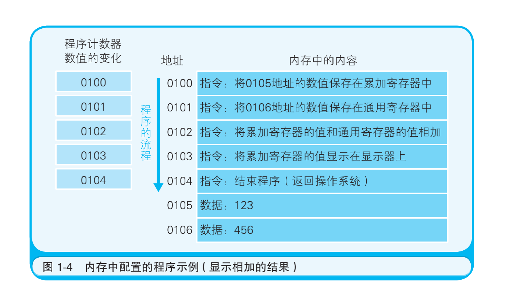
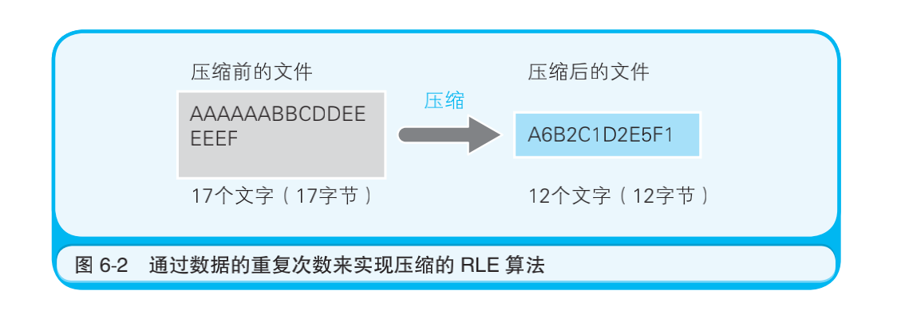
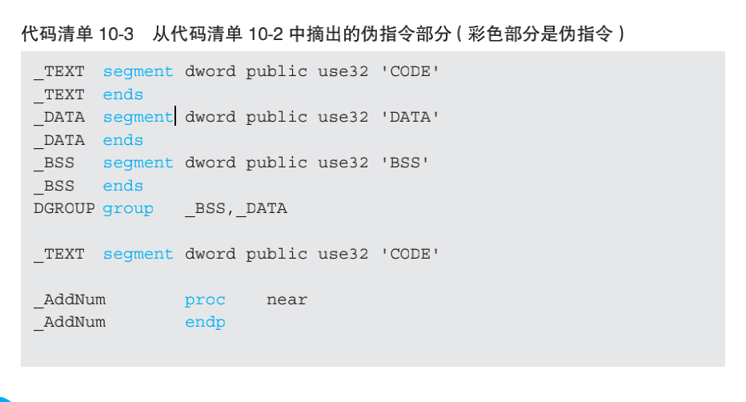
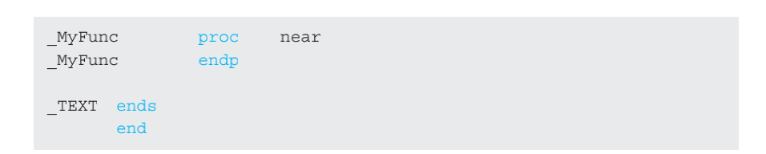
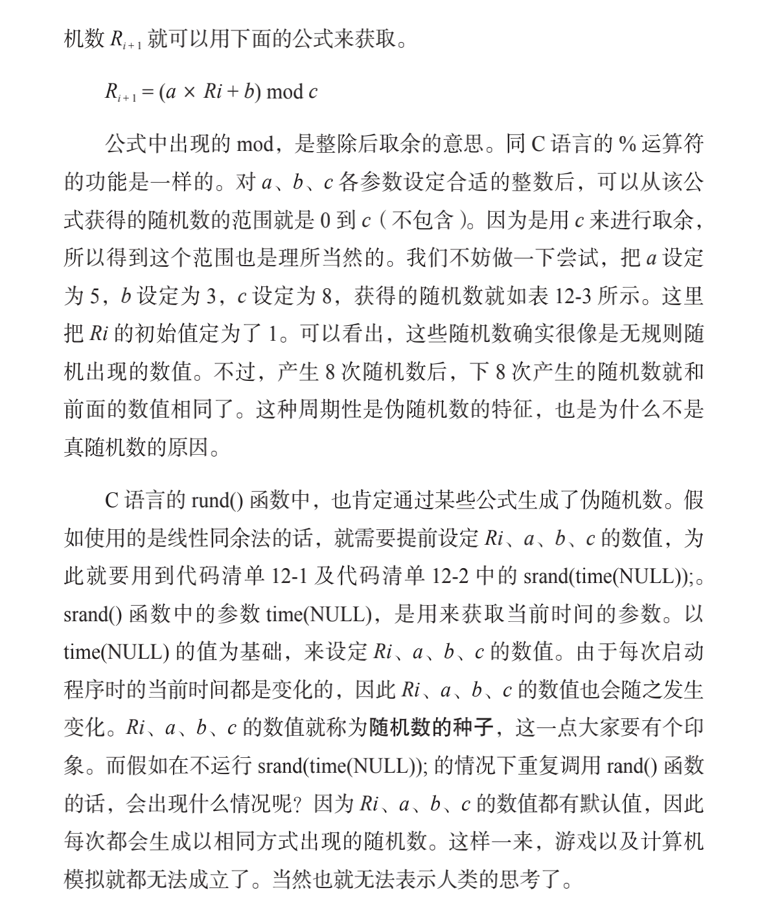

## 程序是怎样跑起来的 -- 矢泽久雄


## 第一章 对程序员来说 CPU是什么

### CPU 的内部结构解析

​	CPU的内部由寄存器、控制器、运算器和时钟四个部分构成，各部分之间由电流信号相互连通。寄存器可用来暂存指令、数据等处理对象，一个 CPU 内部会有20～100 个寄存器。控制器负责把内存上的指令、数据等读入寄存器，并根据指令的执行结果来控制整个计算机。运算器负责运算从内存读入寄存器的数据。 时钟负责发出 CPU 开始计时的时钟信号 A。不过，也有些计算机的时钟位于 CPU 的外部。


### 　CPU 是寄存器的集合体

汇编语言和机器语言基本上是一一对应的。这一点和 C 语言、Java 语言等高级编程语言 C 有很大不同，这也是我们使用汇编语言来说明 CPU 运行的原因。通常我们将汇编语言编写的程序转化成机器语言的过程称为 汇编；反之，机器语言程序转化成汇编语言程序的过程则称为 反汇编。

代码清单 1-1　汇编语言编写的程序示例

```assembly
mov eax, dword ptr [ebp-8] …把数值从内存复制到 eax
add eax, dword ptr [ebp-0Ch] …exa 的数值和内存的数值相加
mov dword ptr [ebp-4], eax …把 exa 的数值（上一步的相加结果）存储在内存中
```


使用高级语言编写的程序会在编译后转化成机器语言，然后再通过 CPU 内部的寄存器来处理。例如，a = 1+2 这样的高级语言的代码程序在转化成机器语言后，就是利用寄存器来进行相加运算和存储处理的。 

寄存器中存储的内容既可以是指令也可以是数据。其中，数据分为“用于运算的数值”和“表示内存地址的数值”两种。数据种类不同，存储该数值的寄存器也不同。CPU 中每个寄存器的功能都是不同的。


用于运算的数值放在累加寄存器中存储，表示内存地址的数值则放在基址寄存器和变址寄存器中存储。代码清单 1-1 的程序中用到的 eax 和 ebp 分别是累加寄存器和基址寄存器。

对程序员来说，CPU 是什么呢？如图 1-3 所示，CPU 是具有各种功能的寄存器的集合体。其中，程序计数器、累加寄存器、标志寄存器、指令寄存器和栈寄存器都只有一个，其他的寄存器一般有多个。


### 决定程序流程的程序计数器



条件分支和循环中使用的**跳转指令**

### 条件分支和循环机制


程序运行的开始位置是 0100 地址。随着程序计数器数值的增加，当到达 0102 地址时，如果累加寄存器的值是正数，则执行跳转指令（jump 指令）跳转到 0104 地址。此时，由于累加寄存器的值是 123，为正数，因此 0103 地址的指令被跳过，程序的流程直接跳转到了 0104 地址。也就是说，“跳转到 0104 地址”这个指令间接执行了“将程序计数器设定成 0104 地址”这个操作。


**无论当前累加寄存器的运算结果是负数、零还是正数，标志寄存器都会将其保存（也负责存放溢出 A和奇偶校验 B的结果 )**。CPU 在进行运算时，标志寄存器的数值会根据运算结果自动设定。条件分支在跳转指令前会进行比较运算。至于是否执行跳转指令，则 由 CPU 在参考标志寄存器的数值后进行判断。运算结果的正、零、负三种状态由标志寄存器的三个位 A表示。图 1-6 是 32 位 CPU（寄存器的长度是 32 位）的标志寄存器的示例。标志寄存器的第一个字节位、第二个字节位和第三个字节位的值为 1 时，表示运算结果分别为正数、零和负数。

CPU 执行比较的机制很有意思，因此请大家务必牢记。例如，假设要比较累加寄存器中存储的 XXX 值和通用寄存器中存储的 YYY值，执行比较的指令后，CPU 的运算装置就会在内部（暗中）进行XXX－YYY 的减法运算。而无论减法运算的结果是正数、零还是负数，都会保存到标志寄存器中。结果为正表示 XXX 比 YYY 大，零表示XXX 和 YYY 相等，负表示 XXX 比 YYY 小。**程序中的比较指令，就是在 CPU 内部做减法运算**。


### 函数的调用机制 （call指令）


​		接下来，我们继续介绍程序的流程。哪怕是高级语言编写的程序，函数 A调用处理也是通过把程序计数器的值设定成函数的存储地址来实现的。不过，这和条件分支、循环的机制有所不同，因为单纯的跳转指令无法实现函数的调用。函数的调用需要在完成函数内部的处理后，处理流程再返回到函数调用点（函数调用指令的下一个地址）。因此，如果只是跳转到函数的入口地址，处理流程就不知道应该返回至哪里了。 

​		图 1-7 是给变量 *a* 和 *b* 分别代入 123 和 456 后，将其赋值给参数（parameter）来调用 MyFunc 函数的 C 语言程序。图中的地址是将 C 语言编译成机器语言后运行时的地址。由于 1 行 C 语言程序在编译后通常会变成多行的机器语言，所以图中的地址是离散的。

​		此外，通过跳转指令把程序计数器的值设定成 0260 也可实现调用MyFunc 函数。函数的调用原点（0132 地址）和被调用函数（0260 地 址）之间的数据传递，可以通过内存或寄存器来实现。不过，当函数处理进行到最后的 0354 地址时，我们知道应该将程序计数器的值设定成函数调用后要执行的 0154 地址，但实际上这一操作根本无法实现。那 么，怎么办才好呢？

​		机器语言的 call 指令和 return 指令能够解决这个问题。建议大家把二者结合起来来记忆。**函数调用使用的是 call 指令，而不是跳转指令**。在将函数的入口地址设定到程序计数器之前， **call 指令**会把调用函数后要执行的指令地址存储在名为栈 A的主存内。函数处理完毕后，再通过函数的出口来执行 return 命令。 **return 命令的功能是把保存在栈中的地址设定到程序计数器中**。如图 1-7 所示，MyFunc 函数被调用之前，0154 地址保存在栈中。MyFunc 函数的处理完毕后，栈中的 0154 地址就会被读取出来，然后再被设定到程序计数器中（图 1-8）。


在编译高级编程语言的程序后，函数调用的处理会转换成 **call 指令**，函数结束的处理则会转换成 **return 指令**。这样一来，程序的运行也就变得非常流畅。


### 通过地址和索引实现数组

​		接下来我们看一下表 1-1 中出现的 **基址寄存器** 和 **变址寄存器**。通过这两个寄存器，我们可以对主内存上特定的内存区域进行划分，从而实现类似于数组 A的操作。首先，我们用十六进制数 B将计算机内存上 00000000～FFFFFFFF的地址划分出来。那么，凡是该范围的内存区域，只要有一个 32 位的寄存器，即可查看全部的内存地址。但如果想要像数组那样分割特定的内存区域以达到连续查看的目的，使用两个寄存器会更方便些。 例如，查看 10000000 地址～1000FFFF 地址时，如图 1-9 所示，可以将 10000000 存入基址寄存器， 并使变址寄存器的值在00000000～0000FFFF 变化。CPU 则会把基址寄存器＋变址寄存器的值解释为实际查看的内存地址。**变址寄存器的值就相当于高级编程语言程序中数组的索引功能**。 


### CPU 的处理其实很简单


可能有些读者不知道机器语言和汇编语言的指令到底有多少种，因而对 CPU 的运行没什么概念。这里没有列出指令的具体名称（汇编语言的助记符）。看完表后你会惊奇地发现，原来 CPU 可以进行的处理非常少。虽然高级编程语言编写的程序看起来非常复杂，但CPU 实际处理的事情就是这么简单。


## 第二章 数据是用二进制数表示的


1. 32 位是几个字节 ?

   4

2. 二进制数 01011100 转换成十进制数是多少？

   92

3. 二进制数 00001111 左移两位后，会变成原数的几倍？

   4

4.   补码形式表示的 8 位二进制数 11111111，用十进制数表示的话是多少？

5.   补码形式表示的 8 位二进制数 10101010，用 16 位的二进制数表示的话是多少？

6. 反转部分图形模式时，使用的是什么逻辑运算？

   非

### 用二进制数表示计算机信息的原因

​		想必大家都知道计算机内部是由IC （集成电路 Integrated Circuit）这种电子部件构成的。IC 有几种不同的形状，有的像一条黑色蜈蚣，在其两侧有数个乃至数百个引脚；**IC 的所有引脚，只有直流电压0V 或 5V 两个状态**。也就是说，IC 的一个引脚，只能表示两个状态。

​		IC 的这个特性，决定了计算机的信息数据只能用二进制数来处理。大部分 IC 的电源电压都是 +5V。不过，为了控制电量的消耗，有的 IC 也会使用 +5V 以下的电压。


​		二进制数的位数一般是 8 位、16 位、32 位……也就是 8 的倍数，这是因为计算机所处理的信息的基本单位是 8 位二进制数。**8 位二进制数被称为一个字节** 。字节是最基本的信息计量单位。位是最小单位，字节是基本单位。内存和磁盘都使用字节单位来存储和读写数据，使用位单位则无法读写数据。因此，字节是信息的基本单位。

​		奔腾等 32 位微处理器，具有 32 个引脚以用于信息的输入和输出。也就是说，奔腾一次可以处理 32 位（32 位 = 4字节）的二进制数信息。


### 什么是二进制数

### 移位运算和乘除运算的关系


代码清单 2-1　将变量 a 的值左移两位的 C 语言程序 

```c
a = 39;
b = a << 2;
```


空出来的低位要进行补0 操作。不过，这一规则只适用于左移运算。至于右移时空出来的高位要进行怎样的操作，我们会在后面说明。此外，移位操作使最高位或最低位溢出的数字，直接丢弃就可以了。


### 便于计算机处理的“补数”

​	**二进制数中表示负数值时，一般会把最高位作为符号来使用，因此我们把这个最高位称为符号位。符号位是 0 时表示正数 ，符号位是1 时表示负数。**那么－1 用 8 位二进制数来表示的话是什么样的呢？可能很多人会认为“1 的二进制数是 00000001，因此－1 就是 10000001”，但这个答案是错的，正确答案是 11111111。


**计算机在做减法运算时，实际上内部是在做加法运算。用加法运算来实现减法运算，是不是很新奇呢？为此，在表示负数时就需要使用“二进制的补数”。 补数就是用正数来表示负数，很不可思议吧。**

​		为了获得补数，我们需要将二进制数的各数位的数值全部取反，然后再将结果加 1。

​		例如，用 8 位二进制数表示－ 1 时，只需求得 1，也就是 00000001 的补数即可。具体来说，就是将各数位的 0 取反成 1， 1 取反成 0，然后再将取反的结果加 1，最后就转化成了 11111111


 **补数求解的变换方法就是“取反＋ 1”。**


8位一个字节的整型， 整数为 0 至 127，而负数为 -1 至 -128；

符号位为0表示正数： 0000 0000 （0）     到  0111 1111 （127）
符号位为1表示负数： 1000 0000 （-128）到 1111 1111 （-1）

补码：   1000 0000 表示负数，换算为十进制的过程如下：

减1后： 0111 1111

取反：   1000 0000 = -128

负数比正整数多一个。


### 逻辑右移和算术右移的区别

​		将二进制数作为带符号的数值进行运算时，移位后要在最高位填充移位前符号位的值（0 或 1）。这就称为算术右移。如果数值是用补数表示的负数值，那么右移后在空出来的最高位补 1，就可以正确地实现 1/2、1/4、1/8 等的数值运算。如果是正数，只需在最高位补 0即可。

​		现在我们来看一个右移的例子。将－ 4（= 11111100）右移两位。这 时，逻辑右移的情况下结果就会变成 00111111，也就是十进制数 63，显然不是－ 4 的 1/4。而算术右移的情况下，结果就会变成 11111111，用补数表示就是－ 1，即－ 4 的 1/4（图 2-10）。

​	**只有在右移时才必须区分逻辑位移和算术位移。左移时，无论是图形模式（逻辑左移）还是相乘运算（算术左移），都只需在空出来的低位补 0 即可**


​	符号扩充就是指在保持值不变的前提下将其转换成 16 位和 32 位的二进制数。不管是正数还是用补数表示的负数，都只需用符号位的值（0 或者 1）填充高位即可。


### 掌握逻辑运算的窍门

​	解释逻辑右移时，提及了“逻辑”这个术语。大家听到逻辑这个词可能会感觉有些难，但实际上它很简单。在运算中，与逻辑相对的术语是算术。我们不妨这样考虑，将二进制数表示的信息作为四则运算的数值来处理就是 算术。而像图形模式那样，将数值处理为单纯的 0 和 1 的罗列就是 逻辑。

​	计算机能处理的运算，大体可分为算术运算和逻辑运算。算术运算是指加减乘除四则运算。逻辑运算是指对二进制数各数字位的 0 和 1分别进行处理的运算，包括逻辑非（NOT 运算）、逻辑与（AND 运 算）、逻辑或（OR 运算）和逻辑异或（XOR 运算 A）四种。


## 第三章 计算机进行小数运算时出错的原因


```c
#include <studio.h>
void main(){
 float sum; 
 int i;
 // 将保存总和的变量清 0
 sum = 0;
 //0.1 相加 100 次
 for (i = 1; i <= 100; i++) {
 sum += 0.1;
 }
 // 显示结果
 printf("%f\n", sum);
}
```


### 计算机运算出错的原因

​		在了解了将二进制数表示的小数转换成十进制数的方法后，计算机运算出错的原因也就容易理解了。这里我先把答案告诉大家，计算机之所以会出现运算错误，是因为“有一些十进制数的小数无法转换成二进制数”。例如，十进制数 0.1，就无法用二进制数正确表示，小数点后面即使有几百位也无法表示。接下来，我们就来看一下不能正确表示的原因。 

​		图 3-2 中， 小 数 点 后 4 位 用 二 进 制 数 表 示 时 的 数 值 范 围 为0.0000～0.1111。因此，这里只能表示 0.5、0.25、0.125、0.0625 这四个二进制数小数点后面的位权组合而成（相加总和）的小数。将这些数值组合后能够表示的数值，即为表 3-1 中所示的无序的十进制数。


​		实际上，十进制数0.1 转换成二进制后，会变成 0.00011001100…（1100 循环）这样的 循环小数 A。这和无法用十进制数来表示 1/3 是一样的道理。1/3 就是0.3333…，同样是循环小数。

​		至此，大家应该明白了为什么用代码清单 3-1 的程序无法得到正确结果了吧。因为无法正确表示的数值，最后都变成了近似值。计算机这个功能有限的机器设备，是无法处理无限循环的小数的。因此，在遇到循环小数时，计算机就会根据变量数据类型所对应的长度将数值从中间截断或者四舍五入。我们知道，将 0.3333…这样的循环小数从中间截断会变成 0.333333，这时它的 3 倍是无法得出 1 的（结果是0.999999），计算机运算出错的原因也是同样的道理。

### 什么是浮点数

​	很多编程语言中都提供了两种表示小数的数据类型，分别是双精度浮点数和单精度浮点数。**双精度浮点数类型用 64 位、单精度浮点数类型用 32 位来表示全体小数**

​	C 语言中，双精度浮点数类型和单精度浮点数类型分别用 double 和 float 来表示。不过，这些数据类型都采用浮点数来表示小数。浮点数是指用符号、尾数、基数和指数这四部分来表示的小数（图3-3）。


​	因为计算机内部使用的是二进制数，所以基数自然就是 2。因此，实际的数据中往往不考虑基数，只用符号、尾数、指数这三部分即可表示浮点数。也就是说，64 位（双精度浮点数）和 32 位（单精度浮点数）的数据，会被分为三部分来使用（图 3-4）。


**符号部分**是指使用一个数据位来表示数值的符号。该数据位是 1时表示负，为 0 时则表示“正或者 0”。这和用二进制数来表示整数时的符号位是同样的。数值的大小用尾数部分和指数部分来表示。例如，小数就是用“尾数部分 × 2 的指数部分次幂”这样的形式来表示的。讲到这里，大家是不是多少有点概念了呢。

### 正则表达式和 EXCESS 系统


## 第四章 熟练使用有棱有角的内存

### 内存的物理机制很简单

​	内存实际上是一种名为内存 IC 的电子元件。虽然内存 IC 包括 DRAM、SRAM、ROMA等多种形式，但从外部来看，其基本机制都是一样的。内存 IC 中有电源、地址信号、数据信号、控制信号等用于输入输出的大量引脚（IC 的引脚），通过为其指定地址（address），来进行数据的读写。


​		那么，这个内存 IC 中能存储多少数据呢？数据信号引脚有 D0～D7共八个，表示一次可以输入输出 8 位（= 1 字节）的数据。此外，地址信号引脚有 A0～A9 共十个，表示可以指定 0000000000～1111111111 共1024 个地址。而地址用来表示数据的存储场所，因此我们可以得出这个内存 IC 中可以存储 1024 个 1 字节的数据。因为 1024 = 1K ，所以该内存 IC 的容量就是 1KB。

​		现在大家使用的计算机至少有 512M 的内存。这就相当于 512000个（512MB÷1KB = 512K）1KB 的内存 IC。当然，一台计算机中不太可能放入如此多的内存 IC。通常情况下，计算机使用的内存 IC 中会有更多的地址信号引脚，这样就能在一个内存 IC 中存储数十兆字节的数据。因此，只用数个内存 IC，就可以达到 512MB 的容量。

​		**下面让我们继续来看刚才所说的 1KB 的内存 IC。首先，我们假设要往该内存 IC 中写入 1 字节的数据。为了实现该目的，可以给 VCC接入＋５V，给 GND 接入 0V 的电源，并使用 A0～A9 的地址信号来指定数据的存储场所，然后再把数据的值输入给 D0～D7 的数据信号，并把 WR（write = 写入的简写）信号设定成 1。执行完这些操作，就可以在内存 IC 内部写入数据（图 4-2 (a)）了。**

​		读出数据时，只需通过 A0～A9 的地址信号指定数据的存储场所，然后再将 RD（read = 读出的简写）信号设成 1 即可。执行完这些操作，指定地址中存储的数据就会被输出到 D0～D7 的数据信号引脚（图 4-2(b)）中。另外，像 WR 和 RD 这样可以让 IC 运行的信号称为控制信号。其中，当 WR 和 RD 同时为 0 时，写入和读出的操作都无法进行。

​		由此可见，内存 IC 的物理机制实质上是很简单的。总体来讲，内 存 IC 内部有大量可以存储 8 位数据的地方，通过地址指定这些场所，之后即可进行数据的读写。


### 内存的逻辑模型是楼房


虽然内存的实体是内存 IC，不过从程序员的角度来看，也可以把

它假想成每层都存储着数据的楼房，并不需要过多地关注内存 IC 的电

源和控制信号等。


编程语言中的数据类型表示存储的是何种类

型的数据。从内存来看，就是占用的内存大小（占有的楼层数）的意

思。即使是物理上以 1 个字节为单位来逐一读写数据的内存，在程序

中，通过指定其类型（变量的数据类型等），也能实现以特定字节数为单位来进行读写。


### 简单的指针

理解指针的关键点就是要弄清楚数据类型这个概念。

​		**指针**也是一种变量，它所表示的不是数据的值，而是存储着数据的内存的地址。通过使用指针，就可以对任意指定地址的数据进行读写。虽然前面所提到的假想内存 IC 中仅有 10 位地址信号，但大家在Windows 计算机上使用的程序通常都是 32 位（4 字节）的内存地址。这种情况下，指针变量的长度也是 32 位。

代码清单 4-2　各种数据类型指针的定义

```c
char *d; //char 类型的指针 d 的定义
short *e; //short 类型的指针 e 的定义
long *f; //long 类型的指针 f 的定义
```


### 数组是高效使用内存的基础

​		下面让我们回到主题，解释一下本章标题中出现的“熟练使用有棱有角的内存”。在熟练使用前，**我们先来看一下内存最直接的使用方法。在这里，我们要用到数组**。

 		数组是指多个同样数据类型的数据在内存中连续排列的形式。作为数组元素的各个数据会通过连续的编号被区分开来，这个编号称为索引（index）。指定索引后，就可以对该索引所对应地址的内存进行读写操作。而索引和内存地址的变换工作则是由编译器自动实现的。

代码清单 4-3　各种类型的数组定义

```c
char g[100]; //char 类型数组 g 的定义
short h[100]; //short 类型数组 h 的定义
long i[100]; //long 类型数组 i 的定义
```

​		数组的定义中所指定的数据类型，也表示一次能够读写的内存大小。char 类型的数组以 1 个字节为单位对内存进行读写，而 short 类型和 long 类型的数组则分别以 2 个字节、4 个字节为单位对内存进行读写。数组是使用内存的基本。本章后半部分会讲述各种各样的内存使用技能，其中每一种都需要以数组为基础。


**之所以说数组是内存的使用方法的基础，是因为数组和内存的物理构造是一样的。**


​		使用数组能够使编程工作变得更加高效。如果在反复运行的循环处理中使用数组，很短的代码就能达到按顺序读出或写入数组元素的目的。不过，虽然是通过指定索引来使用数组，但这和内存的物理读写并没有特别大的区别。因此很多程序都会在数组的使用上花费大量工夫。接下来，我们就向大家介绍一下栈、队列、代码清单和二叉查找树这些数组的变形方法。对于一名优秀的程序员来说，不仅要了解，还要会灵活使用这些方法。


### 栈、队列以及环形缓冲区

​	栈 和 队列，都可以不通过指定地址和索引来对数组的元素进行读写。需要临时保存计算过程中的数据、连接在计算机上的设备或者输入输出的数据时，都可以通过这些方法来使用内存。如果每次保存临时数据都需指定地址和索引，程序就会变得比较麻烦，因此要加以改进。

​		栈和队列的区别在于数据出入的顺序是不同的。在对内存数据进行读写时，栈用的是 LIFO（Last Input First Out，后入先出）方式，而队列用的则是 FIFO（First Input First Out，先入先出）方式。如果我们在内存中预留出栈和队列所需要的空间，并确定好写入和读出的顺序，就不用再指定地址和索引了。

​		如果要在程序中实现栈和队列，就需要以适当的元素数来定义一个用来存储数据的数组，以及对该数组进行读写的函数对。当然，在这些函数的内部，对数组的读写会涉及索引的管理，但从使用函数的角度来说，就没有必要考虑数组及索引了。


### 链表使元素的追加和删除更容易


​	接下来介绍的链表和二叉查找树，都是不用考虑索引的顺序就可以对数组元素进行读写的方式。通过使用链表，可以更加高效地对数组数据（元素）进行追加和删除处理。而通过使用二叉查找树，则可以更加高效地对数组数据进行检索。


​		如果不使用链表数组，那么中途删除或追加元素时，其后的元素就必须要全部移动。示例中数组的元素只有 6 个，处理起来不会花费较多时间。而在实际的程序中，有时需要对包含数千至数万个元素的数组进行频繁的数据追加或删除操作。如果每次都需要移动数千至数万个元素，那么哪怕是高速计算机也会花费很长时间（图 4-13、图4-14）。反之，使用代码清单来追加或删除数据则毫不费事。


### 二叉查找树使数据搜索更有效

**二叉查找树** 是指在链表的基础上往数组中追加元素时，考虑到数据的大小关系，将其分成左右两个方向的表现形式。例如，假设我们事先把 50 这个值保存到了数组中。那么，如果接下来的值比先前保存的数值大的话，就要将其放到右边，反之如果小的话就放在左边。但实际的内存并不会分成两个方向，这是在程序逻辑上实现的（图 4-15）。


​	只要在程序开发中多花一些心思，我们就可以熟练地使用内存、实现栈处理、链表处理、二叉查找树处理等，这一点想必大家都清楚了。不过，大家还必须理解为什么要进行这些处理。**另外，请大家牢记数组是进行这些处理的基础**。


## 第五章 内存和磁盘的亲密关系


### 不读入内存就无法运行

​	计算机中主要的存储部件是内存和磁盘。磁盘中存储的程序，必须要加载到内存后才能运行。在磁盘中保存的原始程序是无法直接运行的。这是因为，负责解析和运行程序内容的 CPU，需要通过内部程序计数器来指定内存地址，然后才能读出程序 。即使 CPU 可以直接读出并运行磁盘中保存的程序，由于磁盘读取速度慢，程序的运行速度还是会降低。总之，存储在磁盘中的程序需要读入到内存后才能运行。


### 磁盘缓存加快了磁盘访问速度

磁盘缓存指的是把从磁盘中读出的数据存储

到内存空间中的方式。这样一来，当接下来需要读取同一数据时，就

不用通过实际的磁盘，而是从磁盘缓存中把内容读出。使用磁盘缓存

可以大大改善磁盘数据的访问速度（图 5-2）。


### 虚拟内存把磁盘作为部分内存来使用

虚拟内存是指把磁盘的一部分作为假想

的内存来使用。通过借助虚拟内存，在内存不足时也可以运行程序。例如，在只

剩下 5MB 内存空间的情况下也能运行 10MB 大小的程序。


​	刚才已经说过，Windows 提供了虚拟内存机制作为操作系统。在当前的 Windows 中，虚拟内存依然发挥着很大的作用。虚拟内存的方法有分页式和分段式两种。一般情况下，Windows 计算机的页的大小是 4KB。也就是说，把大程序用 4KB 的页来进行切分。


### 节约内存的编程方法

#### （1）通过 DLL 文件实现函数共有

​		DLL（Dynamic Link Library）文件 ，顾名思义，是在程序运行时可以动态加载 Library（函数和数据的集合）的文件。此外，还有一个需要大家注意的地方，那就是多个应用可以共有同一个 DLL 文件。而通过共有同一个 DLL 文件则可以达到节约内存的效果。


#### （2）通过调用 _stdcall 来减小程序文件的大小

​	通过调用 _stdcall来减小程序文件的方法，是用 C 语言编写应用时可以利用的高级技巧。不过，这一思路应该也可以应用在其他编程语言中，因此大家一定要记住。 

 	C语言中，在调用函数后，需要执行栈清理处理指令。栈清理处理是指，把不需要的数据从接收和传递函数的参数时使用的内存上的栈区域中清理出去。该命令不是程序记述的，而是在程序编译时由编译器自动附加到程序中的。编译器默认将该处理附加在函数调用方。

​	例如，在代码清单 5-1 中，从函数 main() 中调用了函数 MyFunc()。按照默认设定，栈的清理处理会附加在函数 main() 这一方。在同一个程序中，同样的函数可能会被多次反复调用。而如果是同样的函数，栈清理处理的内容也是一样的。由于该处理是在调用函数一方，因此就会导致同一处理被反复进行。这就造成了内存的浪费。

代码清单 5-1　C 语言的函数调用程序示例

```c
// 函数调用方
void main()
{
 int a;
 a = MyFunc(123, 456);
}
// 被调用方
int MyFunc(int a, int b)
{
 ...
}
```

​		虽然通过调查编译器生成的机器语言执行文件就可以得知栈清理的处理内容，不过鉴于原始的机器语言不太容易理解，所以这里我们用汇编语言的代码清单将其显示了出来。将代码清单 5-1 中调用函数MyFunc() 的部分用汇编语言来表示，就如代码清单 5-2 所示。最后 1行的处理就是清理处理。

代码清单 5-2　调用 MyFunc() 的部分程序（汇编语言）

```assembly
push 1C8h ←将参数 456 (= 1c8h) 存入栈中
push 7Bh ← 将参数 123 (= 7Bh) 存入栈中
call @LTD+15 (MyFunc)(00401014) ←调用 MyFunc() 函数
add esp, 8 ←运行栈清理
```

​		C 语言通过栈来传递函数的参数。push是往栈中存入数据的指令。32 位 CPU 中，1 次 push 指令可以存储 4 个字节的数据。代码清单 5-2中，由于使用了两次 push 指令把两个参数（456 和 123）存入到了栈中，因此总的来说就是存储了 8 字节的数据。通过 call 指令调用函数MyFunc() 后，栈中存储的数据就不再需要了。于是这时就通过 add esp, 8 这个指令，使存储着栈数据的 esp 寄存器 前进 8 位（设定为指向高 8 位字节地址），来进行数据清理。由于栈是在各种情况下都可以再利用的内存领域，因此使用完毕后有必要将其恢复到原状态。上述这些操作就是栈的清理处理。另外，在 C 语言中，函数的返回值，是通过寄存器而非栈来返回的。

​		栈清理处理，比起在函数调用方进行，在反复被调用的函数一方进行时，程序整体要小一些。这时所使用的就是 _stdcall。在函数前加上_stdcall，就可以把栈清理处理变为在被调用函数一方进行。把代码清单5-1 中的 int MyFunc(int a, int b) 部分转成 int _stdcall MyFunc(int a, int b)进行再编译后，和代码清单 5-2 中 add esp, 8 同样的处理就会在函数MyFunc() 一方执行。虽然该处理只能节约 3 个字节（add esp, 8 是机器语 3 个字节）的程序大小，不过在整个程序中还是有效果的（图 5-7）。


### 磁盘的物理结构

​	扇区方式中，把磁盘表面分成若干个同心圆的空间就是磁道，把磁道按照固定大小（能存储的数据长度相同）划分而成的空间就是 扇区（图 5-8）。


​	扇区是对磁盘进行物理读写的最小单位。Windows 中使用的磁盘，一般 1 个扇区是 512 字节。不过，Windows 在逻辑方面（软件方面）对磁盘进行读写的单位是扇区整数倍簇。

​	根据磁盘容量的不同，1 簇可以是 512 字节（1 簇 = 1 扇区）、1KB（1 簇 = 2 扇区）、2KB、4KB、8KB、16KB、32KB（1 簇 = 64 扇区）。磁盘的容量越大，簇的容量也越大。


## 第六章 亲自尝试压缩数据


#### 文件储存的基本单位是什么？

​	1 字节（= 8 位 ）

####  BMP（BITMAP）格式的图像文件，是压缩过的吗？

​	没有压缩过


### 文件以字节为单位保存

​		文件是将数据存储在磁盘等存储媒介中的一种形式。程序文件中存储数据的单位是字节。文件的大小之所以用 ××KB、××MB等来表示，就是因为文件是以字节（B = Byte）为单位来存储的。


### RLE 算法的机制

大家是不是会采取将文件的内容用“字符 × 重复次数”这样的表现方式来压缩呢。



### RLE 算法的缺点


### 通过莫尔斯编码来看哈夫曼算法的基础


### 　可逆压缩和非可逆压缩


 6-7 中列出了各种格式的图像文件。其中，原始的图像文件是BMP 格式。通过此图可以看出，JPEG 格式和 GIF 格式的图像文件有一些模糊。这是因为 JPEG 格式的文件是非可逆压缩，因此还原后的图像信息有一部分是模糊的。


## 第七章 程序是在何种环境中运行的

### 运行环境 = 操作系统 ＋ 硬件


美国 Intel 的微处理器，是按照 8086、80286、80386、80486、Pentium……这样的顺序不断升级的。**因为这些型号的后面都带有 86，所以总称为 x86**。32 位处理器也称为“IA-32”。


​		机器语言的程序称为本地代码（native code）。程序员用 C 语言等编写的程序，在编写阶段仅仅是文本文件。文本文件（排除文字编码的问题）在任何环境下都能显示和编辑。我们称之为源代码。通过对源代码进行编译，就可以得到本地代码。在市面上出售的用于 Windows 的应用软件包 CD-ROM 中，收录的就不是源代码，而是本地代码


### Windows 克服了 CPU 以外的硬件差异


### 提供相同运行环境的 Java 虚拟机

​	除虚拟机的方法之外，还有一种方法能够提供不依赖于特定硬件及操作系统的程序运行环境，那就是 Java。

​	大家说的 Java，有两个层面的意思。一个是作为编程语言的 Java，另一个是作为程序运行环境的 Java。同其他编程语言相同，Java 也是将 Java 语法记述的源代码编译后运行。不过，编译后生成的并不是特定 CPU 使用的本地代码，而是名为字节代码的程序。字节代码的运行环境就称为  Java 虚拟机（JavaVM，Java Virtual Machine）。Java 虚拟机是一边把 Java 字节代码逐一转换成本地代码一边运行的。


​	例如，在使用用于 AT 兼容机的 Java 编译器和 Java 虚拟机的情况下，编译器会将程序员编写的源代码（sample.java）转换成字节代码（sample.class）。而 Java 虚拟机（java.exe）则会把字节代码变换成 x86系列 CPU 适用的本地代码，然后由 x86 系列 CPU 负责实际的处理。


​	Windows 有 Windows 专用的 Java 虚拟机，Macintosh 也有 Macintosh专用的 Java 虚拟机。从操作系统方面来看，Java 虚拟机是一个应用，而从 Java 应用方面来看，Java 虚拟机就是运行环境。虽然这样看起来Java 虚拟机全是好处，但其实也有不少问题。其中一点就是，不同的Java 虚拟机之间无法进行完整互换。这是因为，想让所有字节代码在任意 Java 虚拟机上都能运行是比较困难的。而且，当我们使用只适用于某些特定硬件的功能时，就会出现在其他 Java 虚拟机上无法运行，或者功能使用受限等情况。

​		另一点就是运行速度的问题。Java 虚拟机每次运行时都要把字节代码变换成本机代码，这一机制是造成运行速度慢的原因。为此，目前业界也在努力改善这一问题，比如把首次变换后的本地代码保存起来，第 2 次以后直接利用本地代码，或是对字节代码中处理较为费时的部分进行优化（改善生成的本地代码质量）等。

### BIOS 和引导

​		最后对一些比较基础（和硬件相近的部分）的内容做一下补充说明。程序的运行环境中，存在着名为 BIOS（Basic Input/Output System）的系统。BIOS 存储在 ROM 中，是预先内置在计算机主机内部的程序。BIOS 除了键盘、磁盘、显卡等基本控制程序外，还有启动“引导程序”的功能。引导程序是存储在启动驱动器起始区域的小程序。操作系统的启动驱动器一般是硬盘，不过有时也可以是 CD-ROM 或软盘。

​		开机后，BIOS 会确认硬件是否正常运行，没有问题的话就会启动引导程序。引导程序的功能是把在硬盘等记录的 OS 加载到内存中运行。虽然启动应用是 OS 的功能，但 OS 并不能自己启动自己，而是通过引导程序来启动。


## 第八章 从源文件到可执行文件

#### 在程序运行时，用来动态申请分配的数据和对象的内存区域形式称为什么？

​		堆的内存空间会根据程序的命令进行申请及释放。


源代码完成后，就可以编译生成可执行文件了。负责实现该功能的是编译器。

### 计算机只能运行本地代码

​	本地（native）这个术语有“母语的”意思。对 CPU 来说，母语就是机器语言，而转换成机器语言的程序就是本地代码。用任何编程语言编写的源代码，最后都要翻译成本地代码（图 8-2），否则 CPU 就不能理解。也就是说，即使是用不同编程语言编写的代码，转换成本地代码后，也都变成用同一种语言（机器语言）来表示了。


### 本地代码的内容

​	Windows 中 EXE 文件的程序内容，使用的就是本地代码。正所谓“百闻不如一见”，接下来就让我们来看一下本地代码的内容吧。用记事本打开由代码清单 8-1 的内容转换成本地代码得到的 EXE文件（Sample1.exe），页面显示情况如图 8-3 所示。据此我们应该可以看出，本地代码的内容是人类无法理解的。也正是因为如此，才有了用人类容易理解的 C 语言等编程语言来编写源代码，然后再将源代码转换成本地代码这一方法。


​	接下来，我们把刚才的 EXE 文件的内容 Dump 一下。 **Dump 是指把文件的内容，每个字节用 2 位十六进制数来表示的方式**。本地代码的内容就是各种数值的罗列，这一点想必大家都了解。而这些数值就是本地代码的真面目。每个数值都表示某一个命令或数据（图 8-4）。这里我们用的是原始的 Dump 程序。

​	而计算机就是把所有的信息作为数值的集合来处理的。例如，A这个字符数据就是用十六进制数 41 来表示的。与此相同，计算机指令也是数值的罗列。这就是本地代码。


### 编译器负责转换源代码

​	能够把 C 语言等高级编程语言编写的源代码转换成本地代码的程序称为**编译器**。每个编写源代码的编程语言都需要其专用的编译器。 将 C 语言编写的源代码转换成本地代码的编译器称为 C 编译器。

​	编译器首先读入代码的内容，然后再把源代码转换成本地代码。编译器中就好像有一个源代码同本地代码的对应表。但实际上，仅仅靠对应表是无法生成本地代码的。读入的源代码还要经过语法解析、句法解析、语义解析等，才能生成本地代码。

​		根据 CPU 类型的不同，本地代码的类型也不同。因而，编译器不仅和编程语言的种类有关，和 CPU 的类型也是相关的。例如，Pentium等 x86 系列 CPU 用的 C 编译器，同 PowerPC 这种 CPU 用的 C 编译器就不同。从另一个方面来看，这其实是非常方便的。因为这样一来，同样的源代码就可以翻译成适用于不同 CPU 的本地代码了（图 8-5）。


​	因为编译器本身也是程序的一种，所以也需要运行环境。例如， 有 Windows 用的 C 编译器、Linux 用的 C 编译器等。此外，还有一种 **交叉编译器**，它生成的是和运行环境中的 CPU 不同的 CPU 所使用的本地代码。


### 仅靠编译是无法得到可执行文件的

​		编译器转换源代码后，就会生成本地文件。不过，本地文件是无法直接运行的。为了得到可以运行的 EXE 文件，编译之后还需要进行“链接”处理。

​		Borland C++ 的编译器是 bcc32.exe 这个命令行工具。在 Windows的命令提示符中，运行下列命令后，由 C 语言编写的源文件 Smaple1.c就会被编译 。

​		bcc32 -W -c Sample1.c  

​		“-W-c”是用来指定编译 Windows 用的程序的选项。选项是对编译器的指示。有时也称为“开关”。

​		编译后生成的不是 EXE 文件，而是扩展名为“.obj”的 **目标文件** 。Sample1.c 编译后，就生成了 Sample1.obj 目标文件。虽然目标文件的内容是本地代码，但却无法直接运行。那么这是为什么呢？原因就是当前程序还处于未完成状态。

```c
// 返回两个参数的平均值的函数
double Average(double a, double b) {
	 return (a + b) / 2; 
}

// 程序运行启始位置的函数
int WINAPI WinMain(HINSTANCE h, HINSTANCE d, LPSTR s, int m)
{
   double ave; // 保存平均值的变量
   char buff[80]; // 保存字符串的变量
  
   // 求解 123,456 的平均值
   ave = Average(123, 456);
  
   // 编写显示在消息框中的字符串
   sprintf(buff, " 平均值 = %f", ave);
  
   // 打开消息框
   MessageBox(NULL, buff, title, MB_OK);
  
   return 0;
 }
```


​		sprintf() 是通过指定格式把数值变换成字符串的函数，MessageBox() 是消息框函数，不过源代码中都没有记述这些函数的处理内容。因此，这时就必须将存储着sprintf() 和 MessageBox() 的处理内容的目标文件同 Sample1.obj 结合，否则处理就不完整，EXE 文件也就无法完成。

​		把多个目标文件结合，生成 1 个 EXE 文件的处理就是 链接，运行连接的程序就称为链接器（linkage editor 或连结器）。Borland C++ 的链接器就是 ilink32.exe 的命令行工具。在 Windows 命令提示符下运行以下命令后，程序所需的目标文件就会被全部链接生成 Sample1.exe 这个EXE 文件。

```
ilink32 -Tpe -c -x -aa c0w32.obj Sample1.obj, Sample1.exe,, 
import32.lib cw32.lib
```

### 启动及库文件

​	那么，大家可能会有这样一个疑问：“链接时不指定 sprintf() 和MessageBox() 的目标文件也没问题么？”这个担心是多余的。在链接的命令行末尾，存在着扩展名是“.lib”的 import32.lib 和 cw32.lib 这两个文件。这是因为 sprintf() 的目标文件在 cw32.lib 中，MessageBox() 的目标文件在 import32.lib 中（实际上，MessageBox() 的目标文件在 user32.dll 这个 DLL 文件中。关于这一点，我们会在后面进行说明）。

​	像 import32.lib 及 cw32.lib 这样的文件称为库文件。库文件指的是把多个目标文件集成保存到一个文件中的形式。链接器指定库文件后，就会从中把需要的目标文件抽取出来，并同其他目标文件结合生成EXE 文件。

​	Sample1.obj 是尚未完成的本地代码，这个在前面已经进行了说明。这是因为，Sample1.obj 文件中包含有“链接时请结合 sprintf() 及MessageBox()”这样的信息。意思是如果不存在其他函数的话，程序就无法运行。

​	下面，我们就来做一个尝试，看看在不指定这两个库文件的情况下进行链接会发生什么。


​	sprintf() 等函数，不是通过源代码形式而是通过库文件形式和编译器一起提供的。这样的函数称为标准函数。之所以使用库文件，是为了简化为链接器的参数指定多个目标文件这一过程。例如，在链接调用了数百个标准函数的程序时，就要在链接器的命令行中指定数百个目标文件，这样就太繁琐了。而利用存储着多个目标文件的库文件的话，则只需在链接器的命令行中指定几个库文件就可以了。

### DLL 文件及导入库


### 可执行文件运行时的必要条件

​	EXE 文件是作为单独的文件储存在硬盘中的。通过资源管理器找到并双击 EXE 文件，就会把 EXE 文件的内容加载到内存中运行。

​	请大家思考一下下面的问题。本地代码在对程序中记述的变量进行读写时，是参照数据存储的内存地址来运行命令的。在调用函数时，程序的处理流程就会跳转到存储着函数处理内容的内存地址上。EXE文件作为本地代码的程序，并没有指定变量及函数的实际内存地址。在类似于 Windows 操作系统这样的可以加载多个可执行程序的运行环境中，每次运行时，程序内的变量及函数被分配到的内存地址都是不同的。那么，在 EXE 文件中，变量和函数的内存地址的值，是如何来表示的呢？

​	下面就让我们来揭晓答案。那就是 EXE 文件中给变量及函数分配了虚拟的内存地址。在程序运行时，虚拟的内存地址会转换成实际的内存地址。链接器会在 EXE 文件的开头，追加转换内存地址所需的必要信息。这个信息称为 **再配置信息**。

​		EXE 文件的再配置信息，就成为了变量和函数的相对地址。相对地址表示的是相对于基点地址的偏移量，也就是相对距离。实现相对地址，也是需要花费一番心思的。在源代码中，虽然变量及函数是在不同位置分散记述的，但在链接后的 EXE 文件中，**变量及函数就会变成一个连续排列的组**。这样一来，各变量的内存地址就可以用相对于**变量组**起始位置这一基点的偏移量来表示，同样，各函数的内存地址也可以用相对于**函数组**起始位置这一基点的偏移量来表示。而各组基点的内存地址则是在程序运行时被分配的（图 8-9）。


​	当程序加载到内存后，除此之外还会额外生成两个组，那就是栈和堆。


### 程序加载时会生成栈和堆

​		EXE 文件的内容分为再配置信息、变量组和函数组，这一点想必大家都清楚了吧。不过，当程序加载到内存后，除此之外还会额外生成两个组，那就是栈和堆。

 	**栈 **是用来存储函数内部临时使用的变量（局部变量 ），以及函数调用时所用的参数的内存区域。

 	**堆 **是用来存储程序运行时的任意数据及对象的内存领域（图 8-10）。

​		EXE 文件中并不存在栈及堆的组。栈和堆需要的内存空间是在EXE 文件加载到内存后开始运行时得到分配的。因而，内存中的程序，就是由

**用于变量的内存空间、**

**用于函数的内存空间、**

**用于栈的内存空间、**

**用于堆的内存空间**

这 4 部分构成的。当然，在内存中，加载Windows 等操作系统的内存空间又是另外一回事了（图 8-10）。


​	栈及堆的相似之处在于，他们的内存空间都是在程序运行时得到申请分配的。不过，在内存的使用方法上，二者存在些许不同。栈中对数据进行存储和舍弃（清理处理）的代码，是由编译器自动生成的，因此不需要程序员的参与。使用栈的数据的内存空间，每当函数被调用时都会得到申请分配，并在函数处理完毕后自动释放。与此相对，堆的内存空间，则要根据程序员编写的程序，来明确进行申请分配或释放。 

​	不管是什么程序，程序的内容都是由处理和数据构成的。大多数编程语言都是用函数来表示处理、用变量来表示数据。 

 	栈和堆的大小，可以由程序员任意指定。在高级编程语言中，编译器会自动生成指定栈和堆大小的代码，并将其附加到程序中。


​	根据编程语言的不同，对堆用的内存空间进行申请分配和释放的程序的编写方法也是多种多样的。C 语言中是通过 malloc() 函数来进行申请分配、通过 free() 函数来释放的。而 C++ 中则是通过 new 运算符来申请分配、通过 delete 运算符来释放的。无论是 C 语言还是 C++，如果没有在程序中明确释放堆的内存空间，那么即使在处理完毕后，该内存空间仍会一直残留。这个现象称为**内存泄露（memory leak）**，它是令 C 语言及 C++ 的程序员们十分头疼的一个 bug（程序的错误）。如果内存泄露一直存在的话，就有可能会造成内存不足而导致宕机。这就好比，如果水龙头一直嘀嗒嘀嗒地漏水，那么一晚上的时间水桶就可能会装满并溢出。

### 有点难度的 Q&A

Q ：编译器和解释器有什么不同？

A ：编译器是在运行前对所有源代码进行解释处理的。而解释器则是在运行时对源代码的内容一行一行地进行解释处理的。

Q ：“Build”指的是什么？

A ：根据开发工具种类的不同，有的编译器可以通过选择“Build”菜单来生成 EXE 文件。这种情况下，Build 指的是连续执行编译和链接。

Q ：使用 DLL 文件的好处是什么？

A ：DLL 文件中的函数可以被多个程序共用。因此，借助该功能可以节约内存和磁盘。此外，在对函数的内容进行修正时，还不需要重新链接（静态链接）使用这个函数的程序

Q ：和内存管理相关的“**垃圾回收机制**”指的是什么呢？

A ：垃圾回收机制（garbage collection）**指的是对处理完毕后不再需要的堆内存空间的数据和对象 进行清理**，释放它们所使用的内存空间。这里把不需要的数据比喻为了垃圾。进行该处理时，C 语言用的是free() 函数，C++ 用的是 delete 运算符。在 C++ 的基础上开发出来的**Java 及 C# 这些编程语言中，程序运行环境会自动进行垃圾回收**。这样就可以避免由于程序员的疏忽（忘了记述内存的释放处理）而造成内存泄露了。 


## 第九章 操作系统和应用的关系


### 要意识到操作系统的存在

​	代码清单 9-1 表示的是，在 Windows 操作系统下，用 C 语言制作一个具有表示当前时间功能的应用。time() 是用来取得当前日期和时间的函数，printf() 是用来在显示器上显示字符串的函数。程序的运行结果如图 9-4所示。

代码清单 9-1　表示当前时间的应用

```c
#include <stdio.h>
#include <time.h>
void main() {
 // 保存当前日期和时间信息的变量
 time_t tm;
 // 取得当前的日期和时间
 time(&tm);
 // 在显示器上显示日期和时间
 printf("%s\n", ctime(&tm));
}
```


运行代码清单 9-1 的应用时，硬件的受控过程如下所示。 

（1）通过 time_t tm;，为 time_t 类型的变量申请分配内存空间。 

（2）通过 time(&tm);，将当前的日期和时间数据保存到变量的内存空间中。 

（3）通过 printf("%s\n",ctime(&tm));，把变量内存空间的内容输出到显示器上。

​	在操作系统这个运行环境下，应用并不是直接控制硬件，而是通过操作系统来间接控制硬件的。变量定义中涉及的内存的申请分配，以及 time() 和 printf() 这些函数的运行结果，都不是面向硬件而是面向操作系统的。操作系统收到应用发出的指令后，首先会对该指令进行解释，然后会对时钟 IC（实时时钟 ）和显示器用的 I/O 进行控制。


### 系统调用和高级编程语言的移植性

​		操作系统的硬件控制功能，通常是通过一些小的函数集合体的形式来提供的。这些函数及调用函数的行为统称为系统调用（system call），也就是应用对操作系统（system）的功能进行调用（call）的意思。在前面的程序中用到了 time() 及 printf() 等函数，这些函数内部也都使用了系统调用。

 		语言等高级编程语言并不依存于特定的操作系统。这是因为人们希望不管是 Windows 还是 Linux，都能使用几乎相同的源代码。因此，高级编程语言的机制就是，使用独自的函数名，然后再在编译时将其转换成相应操作系统的系统调用（也有可能是多个系统调用的组合）。


### 操作系统和高级编程语言使硬件抽象化


### Windows 操作系统的特征

Windows 操作系统的主要特征如下所示。 

（1）32 位操作系统（也有 64 位版本） 

（2）通过 API 函数集来提供系统调用

（3）提供采用了图形用户界面的用户界面

（4）通过 WYSIWYG实现打印输出

（5）提供多任务功能

（6）提供网络功能及数据库功能

（7）通过即插即用实现设备驱动的自动设定


（1）32 位操作系统

​	虽然现在的 Windows 也有 64 位版本，但一般广泛普及的还是 32位版本。这里的 32 位表示的是处理效率最高的数据大小。Windows 处理数据的基本单位是 32 位。习惯在以前的 MS-DOS 等 16 位操作系统下编程的程序员，可能不太愿意使用 32 位的数据类型。因为他们认为处理 32 位的数据，要比处理 16 位的数据更花时间。确实，在 16 位操作系统中处理 32 位的数据时，因为要处理两次 16 位的数据，所以会多花一些时间。而如果是 32 位操作系统的话，那么只需要 1 次就可以完成 32 位的数据的处理了。所以说，凡是在 Windows 上运行的应用，都可以毫无顾虑地尽可能地使用 32 位的数据。

（5）提供多任务功能

​	**多任务**指的是同时运行多个程序的功能。Windows 是通过 **时钟分割**技术来实现多任务功能的。

​	时钟分割指的是在短时间间隔内，多个程序切换运行的方式。在用户看来，就是多个程序在同时运行。也就是说，Windows 会自动切换多个程序的运行（图 9-9）。此外，Windows 中还具有以程序中的函数为单位来进行时钟分割的**多线程**功能。


（6）提供网络功能及数据库功能

​		Windows 中，网络功能是作为标准功能提供的。数据库（数据库服务器）功能有时也会在之后进行追加。网络功能和数据库功能，虽并不是操作系统本身不可欠缺的功能，但因为它们和操作系统很接近，所以被统称为中间件而不是应用。意思是处于操作系统和应用的中间（middle）。操作系统和中间件合在一起，也称为系统软件。应用不仅可以利用操作系统，也可以利用中间件的功能（图 9-10）


相对于操作系统一旦安装就不能轻易替换，中间件则可以根据需要进行任意的替换。不过，大多数情况下，中间件变更后应用往往也需要变更，因此中间件的变更也不是那么容易。

（7）通过即插即用实现设备驱动的自动设定

**即插即用（Plug-and-Play）**指的是新的设备连接（Plug）后立刻就可以使用（Play）的机制。新的设备连接到计算机后，系统就会自动安装和设定用来控制该设备的 **设备驱动**程序。


## 第十章 通过汇编语言了解程序的实际构成

1. 本地代码的指令中，表示其功能的英语缩写称为什么？

   \1. 汇编语言是通过利用助记符来记述程序的。

2. 汇编语言的源代码转换成本地代码的方式称为什么？

   \2. 使用**汇编器**这个工具来进行**汇编**。

3. 本地代码转换成汇编语言的源代码的方式称为什么？

   \3. 通过**反汇编**，得到人们可以理解的代码。

4. 汇编语言的源文件的扩展名，通常是什么格式？

   \4.     **.asm** 是 assembler（汇编器）的略写。

5. 汇编语言程序中的段定义指的是什么？

   \5. 在高级编程语言的源代码中，即使指令和数据在编写时是分散的，编译后也会在段定义中集合汇总起来。大家看过汇编语言的源代码后，就会清楚了。

6.  汇编语言的跳转指令，是在何种情况下使用的？

​	\6. 在汇编语言中，通过跳转指令，可以实现循环和条件分支。

### 汇编语言和本地代码是一一对应的

​		通过调查本地代码的内容，可以了解程序最终是以何种形式来运行的。但是，如果直接打开本地代码来看的话，只能看到数值的罗列。如果直接使用这些数值来编写程序的话，还真是不太容易理解。因而就产生了这样一种想法，那就是在各本地代码中，附带上表示其功能的英语单词缩写。例如，在加法运算的本地代码中加上 add（addition的缩写）、在比较运算的本地代码中加上 cmp（compare 的缩写）等。这些缩写称为助记符，使用助记符的编程语言称为汇编语言。这样，通过查看汇编语言编写的源代码，就可以了解程序的本质了。因为这和查看本地代码的源代码，是同一级别的。

​	不过，即使是用汇编语言编写的源代码，最终也必须要转换成本地代码才能运行。负责转换工作的程序称为**汇编器**，转换这一处理本身称为**汇编**。在将源代码转换成本地代码这个功能方面，汇编器和编译器是同样的。

​		用汇编语言编写的源代码，和本地代码是一一对应的。因而，本地代码也可以反过来转换成汇编语言的源代码。持有该功能的逆变换程序称为 **反汇编程序**，逆变换这一处理本身称为 **反汇编**（图 10-1）。


​	哪怕是用 C 语言编写的源代码，编译后也会转换成特定 CPU 用的本地代码。而将其反汇编的话，就可以得到汇编语言的源代码，并对其内容进行调查。不过，本地代码变换成 C 语言源代码的反编译，则要比反汇编困难。这是因为，C 语言的源代码同本地代码不是一一对应的，因此完全还原到原始的源代码是不太可能的。

### 通过编译器输出汇编语言的源代码

​		除了将本地代码进行反汇编这一方法外，通过其他方式也可以获取汇编语言的源代码。大部分 C 语言编译器，都可以把利用 C 语言编写的源代码转换成汇编语言的源代码，而不是本地代码。利用该功能，就可以对 C 语言的源代码和汇编语言的源代码进行比较研究。笔者在学生时代的报告中，使用的便是该功能。Borland C++ 中，通过在编译器的选项中指定“-S”，就可以生成汇编语言的源代码了。大家也可以实际尝试一下。

代码清单 10-1　由两个函数构成的 C 语言的源代码

```c
// 返回两个参数值之和的函数
int AddNum(int a, int b)
{
 	return a + b;
}

// 调用 AddNum 函数的函数
void MyFunc()
{
 	int c;
 	c = AddNum(123, 456);
}
```


 		由Windows 开始菜单启动命令提示符，把当前目录变更到 Sample4.c保存的文件夹后，输入下面的命令并按下 Enter 键。bcc32 是启动Borland C++ 编译器的命令。“-c”选项指的是，仅进行编译而不进行链接 。“-S”选项被用来指定生成汇编语言的源代码。

bcc32 -c -S Sample4.c

代码清单 10-2　 编译器生成的汇编语言源代码（一部分做了省略，; 彩色部分是转换成注释的 C 语言源代码）

```assembly
_TEXT segment dword public use32 'CODE'
_TEXT ends
_DATA segment dword public use32 'DATA'
_DATA ends
_BSS segment dword public use32 'BSS'
_BSS ends
DGROUP group _BSS,_DATA

_TEXT segment dword public use32 'CODE'

_AddNum proc near
  ; 
  ; int AddNum(int a, int b)
  ; 
    push ebp
    mov ebp,esp
  ; 
  ; {
  ; return a + b;
  ; 
    mov eax,dword ptr [ebp+8]
    add eax,dword ptr [ebp+12]
  ; 
  ; }
  ; 
    pop ebp
    ret 
_AddNum endp

_MyFunc proc near
 ; 
 ; void MyFunc()
 ; 
   push ebp
   mov ebp,esp
 ; 
 ; {
 ; int c;
 ; c = AddNum(123, 456);
 ; 
   push 456
   push 123
   call _AddNum
   add esp,8 
 ; 
 ; }
 ; 
   pop ebp
   ret 
_MyFunc endp

_TEXT ends
 			end
```


### 不会转换成本地代码的伪指令


​		第一次看到汇编语言源代码的读者可能会感到有些难，不过实际上很简单。而且毫不夸张地说它比 C 语言还要简单。为了便于阅读汇编语言编写的源代码，在开始源代码内容的讲解前，让我们先来看一下下面几个要点。

​		汇编语言的源代码，是由转换成本地代码的指令（后面讲述的操作码）和针对汇编器的伪指令构成的。伪指令负责把程序的构造及汇编的方法指示给汇编器（转换程序）。不过伪指令本身是无法汇编转换成本地代码的。这里我们把代码清单 10-2 中用到的伪指令部分摘出，如代码清单 10-3 所示。






### 汇编语言的语法是“操作码 + 操作数”


汇编语言指令的语法结构是操作码 + 操作数 （也存在只有操作码没有操作数的指令）。

操作码表示的是指令动作，操作数表示的是指令对象。操作码和操作数罗列在一起的语法，就是一个英文的指令文本。操作码是动词，操作数相当于宾语。


​		寄存器是 CPU 中的存储区域。不过，寄存器并不仅仅具有存储指令和数据的功能，也有运算功能。x86 系列 CPU 的寄存器的主要种类和角色如表 10-2 所示。寄存器的名称会通过汇编语言的源代码指定给操作数。内存中的存储区域是用地址编号来区分的。CPU 内的寄存器是用 eax 及 ebx 这些名称来区分的。此外，CPU 内部也有程序员无法直接操作的寄存器。例如，表示运算结果正负及溢出状态的标志寄存器及操作系统专用的寄存器等，都无法通过程序员编写的程序直接进行操作。


### 最常用的 mov 指令


​		指令中最常使用的是对寄存器和内存进行数据存储的  mov 指令。mov 指令的两个操作数，分别用来指定数据的存储地和读出源。操作数中可以指定寄存器、常数、标签（附加在地址前），以及用方括号（[]）围起来的这些内容。


### 对栈进行 push 和 pop

​		程序运行时，会在内存上申请分配一个称为栈的数据空间。栈 （stack）有“干草堆积如山”的意思。就如该名称所表示的那样，数据在存储时是从内存的下层（大的地址编号）逐渐往上层（小的地址编号）累积，读出时则是按照从上往下的顺利进行（图 10-3）的。


 **栈**是存储临时数据的区域，它的特点是通过 push 指令和 pop 指令进行数据的存储和读出。往栈中存储数据称为“入栈”，从栈中读出数据称为“出栈”。32 位 x86 系列的 CPU 中，进行 1 次 push 或 pop，即可处理 32 位（4 字节）的数据。

​	push 指令和 pop 指令中只有一个操作数。该操作数表示的是“push的是什么及 pop 的是什么”，而不需要指定“对哪一个地址编号的内存进行 push 或 pop”。这是因为，对栈进行读写的内存地址是由 esp 寄存器（栈指针）进行管理的。push 指令和 pop 指令运行后， esp 寄存器的值会自动进行更新（push 指令是 -4，pop 命令是 +4），因而程序员就没有必要指定内存地址了。

### 函数调用机制


​	（3）和（4）表示的是将传递给 AddNum 函数的参数通过 push 入 栈。在 C 语言的源代码中，虽然记述为函数 AddNum（123，456），但入栈时则会按照 456、123 这样的顺序，也就是位于后面的数值先入栈。这是 C 语言的规定。（5）的 call 指令，把程序流程跳转到了操作数中指定的 AddNum 函数所在的内存地址处。在汇编语言中，函数名表示的是函数所在的内存地址。AddNum 函数处理完毕后，程序流程必须要返回到编号（6）这一行。call 指令运行后，call 指令的下一行（（6）这一行）的内存地址（调用函数完毕后要返回的内存地址）会自动地 push 入栈。该值会在 AddNum 函数处理的最后通过 ret 指令 pop 出 栈，然后程序流程就会返回到（6）这一行。 

​	（6）部分会把栈中存储的两个参数（456 和 123）进行销毁处理，也就是在第 5 章提到的栈清理处理。虽然通过使用两次 pop 指令也可以实现，不过采用 esp 寄存器加 8 的方式会更有效率（处理 1 次即可）。对栈进行数值的输入输出时，数值的单位是 4 字节。因此，通过在负责栈地址管理的 esp 寄存器中加上 4 的 2 倍 8，就可以达到和运行两次 pop 命令同样的效果。虽然内存中的数据实际上还残留着，但只要把 esp 寄存器的值更新为数据存储地址前面的数据位置，该数据也就相当于被销毁了。

### 函数内部的处理


我们进行了很多细节的说明，其实就是希望大家了解“**函数的参数是通过栈来传递，返回值是通过寄存器来返回的**”这一点。

### 始终确保全局变量用的内存空间

​	熟悉了汇编语言后，接下来将进入到本章的后半部分。C 语言中，在函数外部定义的变量称为全局变量，在函数内部定义的变量称为 局部变量。全局变量可以参阅源代码的任意部分，而局部变量只能在定义该变量的函数内进行参阅。例如，在 MyFuncA 函数内部定义的 i 这个局部变量就无法通过 MyFuncB 函数进行参阅。与此相反，如果是在函数外部定义的全局变量，MyFuncA 函数和 MyFuncB 函数都可以参阅。下面，就让我们通过汇编语言的源代码，来看一下全局变量和局部变量的不同。

代码清单 10-6　使用全局变量和局部变量的 C 语言源代码

```c
// 定义被初始化的全局变量
int a1 = 1;
int a2 = 2;
int a3 = 3;
int a4 = 4;
int a5 = 5;
// 定义没有初始化的全局变量
int b1, b2, b3, b4, b5;

// 定义函数
void MyFunc()
{
   // 定义局部变量
   int c1, c2, c3, c4, c5, c6, c7, c8, c9, c10;
  
   // 给局部变量赋值
   c1 = 1;
   c2 = 2;
   c3 = 3;
   c4 = 4;
   c5 = 5;
   c6 = 6;
   c7 = 7;
   c8 = 8;
   c9 = 9;
   c10 = 10;
  
   // 把局部变量的值赋给全局变量
   a1 = c1;
   a2 = c2;
   a3 = c3;
   a4 = c4;
   a5 = c5;
   b1 = c6;
   b2 = c7;
   b3 = c8;
   b4 = c9;
   b5 = c10;
}
```


全局变量在数据段中的（ _DATA），已声明未初始化的在数据段中的 ( _BBS）,而局部变量实在临时申请的栈空间中。

### 临时确保局部变量用的内存空间

​		为什么局部变量只能在定义该变量的函数内进行参阅呢？这是因为，局部变量是临时保存在寄存器和栈中的。正如本章前半部分讲的那样**，函数内部利用的栈，在函数处理完毕后会恢复到初始状态，因此局部变量的值也就被销毁了**，而寄存器也可能会被用于其他目的。因此，局部变量只是在函数处理运行期间临时存储在寄存器和栈上。


### 循环处理的实现方法

代码清单 10-8　执行循环处理的 C 语言源代码

```c
// 定义 MySub 函数
void MySub()
{
 // 不做任何处理
}

// 定义 MyFunc 函数
Void MyFunc()
{
     int i;
     for （i = 0; i < 10; i++ )
     {
         // 重复调用 MySub 函数 10 次
         MySub();
     }
 }
```

代码清单 10-9　将代码清单 10-8 中的 for 语句转换成汇编语言的结果

```assembly
		xor ebx, ebx 		; 将 eax 寄存器清 0
@4  call _MySub 		; // 调用 MySub 函数
 		inc ebx 				; //ebx 寄存器的值加 1
 		cmp ebx,10 			; // 将 ebx 寄存器的值和 10 进行比较
 		jl short @4		  ; // 如果小于 10 就跳转到 @4
```


代码清单 10-10　用 C 语言来表示代码清单 10-9 的处理顺序

```c
 i ^= i;
L4: MySub();
 i++;
 if (i < 10) goto L4;
```


### 条件分支的实现方法

代码清单 10-11　进行条件分支的 C 语言源代码

```c
// 定义 MySub1 函数
void MySub1()
{
 // 不做任何处理
}
// 定义 MySub2 函数
void MySub2()
{
 // 不做任何处理
}
// 定义 MySub3 函数
void MySub3()
{
 // 不做任何处理
}
// 定义 MyFunc 函数
void MyFunc()
{
 int a = 123;
 // 根据条件调用不同的函数
 if (a > 100)
 {
 MySub1();
 }
 else if (a < 50)
 {
 MySub2();
 }
 else
 {
 MySub3();
 }
}
```


​		虽然大部分的 C 语言参考书中都写着“为了便于理解程序的结构，应尽量避免使用无条件分支的 goto 语句”，不过，在汇编语言这一领域中，如果不使用相当于 C 语言 goto 语句的 jmp 指令，就无法实现循环和条件分支。由此看来，关于应不应该在 C 语言中使用 goto 语句，大家没有必要这么紧张。


### 了解程序运行方式的必要性

​		现在基本上没有人用汇编语言来编写程序了。因为 C 语言等高级编程语言用 1 行就可以完成的处理，使用汇编语言的话有时就需要多行，效率很低。不过，汇编语言的经验还是很重要的。因为借助汇编语言，我们可以更好地了解计算机的机制。特别是对专业程序员来说，至少要有一次使用汇编语言的经验。

​	下面让我们以开车为例进行说明。没有汇编语言经验的程序员，就相当于只知道汽车的驾驶方法而不了解汽车结构的驾驶员。对这样的驾驶员来说，如果汽车出现了故障或奇怪的现象，他们就无法自己找到原因。不了解汽车结构的话，开车的时候还可能会浪费油。这样的话，作为职业驾驶员是不合格的。与此相对，有汇编语言经验的程序员，也就相当于了解计算机和程序机制的驾驶员，他们不仅能自己解决问题，还能在驾驶过程中省油。

## 第十一章 硬件控制方法

### 支撑硬件输入输出的 IN 指令和 OUT 指令

​		Windows 提供了通过应用来间接控制硬件的方法。利用操作系统提供的系统调用功能就可以实现对硬件的控制。在 Windows 中，系统调用称为  API（图 11-1）。各 API 就是应用调用的函数。这些函数的实体被存储在 DLL 文件中。


### 支撑硬件输入输出的 IN 指令和 OUT 指令


### 编写测试用的输入输出程序


### 外围设备的中断请求

​		IRQ（Interrupt Request）是中断请求的意思。那么，IRQ 主要是用来做什么的呢？IRQ 是用来暂停当前正在运行的程序，并跳转到其他程序运行的必要机制。该机制称为中断处理。中断处理在硬件控制中担当着重要角色。因为如果没有中断处理，就有可能出现处理无法顺畅进行的情况。


​		CPU 接收到来自中断控制器的中断请求后，会把当前正在运行的主程序中断，并切换到中断处理程序。中断处理程序的第一步处理，就是把 CPU 所有寄存器的数值保存到内存的栈中。在中断处理程序中完成外围设备的输入输出后，把栈中保存的数值还原到 CPU 寄存器中，然后再继续进行对主程序的处理。


### 用中断来实现实时处理

​		打印机等输出用的外围设备中，外围设备接收数据的状态，有时是需要用中断来通知的。由于外围设备的处理速度比计算机主机的处理速度要慢很多，因此，这种情况下就不需要对打印机的状态进行多次调查，只需在中断请求发生时输出数据即可，这样一来，其他时间CPU 就可以集中处理别的程序了。中断处理是不是很方便呢。

### DMA 可以实现短时间内传送大量数据

​		在了解 I/O 输入输出及中断处理的同时，还希望大家记住另外一个机制，这就是 DMA（Direct Memory Access）。DMA 是指在不通过 CPU 的情况下，外围设备直接和主内存进行数据传送。磁盘等都用到了这个 DMA机制。通过利用 DMA，大量数据就可以在短时间内转送到主内存。之所以这么快速，是因为 CPU 作为中介的时间被节省了（图 11-9）。


### 文字及图片的显示机制


在现在的计算机中，显卡等专用硬件中一般都配置有与主内存相

独立的 VRAM 和  GPU（Graphics Processing Unit，图形处理器，也称

为图形芯片）。这是因为，对经常需要描绘图形的 Windows 来说，数百

兆的 VRAM 是必需的。而为了提升图形的描绘速度，有时还需要专用

的图形处理器（图 11-11(b)）。但不管怎样，内存 VRAM 中存储的数据

就是显示器上显示的信息，这一机制是不变的。


## 第十二章 让计算机“思考”


### 程序生成随机数的方法




## 附录  让我们开始 C 语言之旅

### C 语言的特点


​		 语言是 AT&T 贝尔实验室的 D. M. Ritchie 在 1973 年推出的程序开发语言。C 语言虽是高级编程语言，但它也具备了能够和汇编语言相媲美的低层处理（内存操作及位操作）功能。AT&T 贝尔实验室开发的Unix，最初是用汇编语言编写的，但后来大部分都用 C 语言进行了重写。借助 C 语言，Unix 的移植性得到了大幅提升，进而使得更多类型的计算机开始应用 Unix 操作系统。此外，作为 Unix 系列操作系统之一的 Linux 也是用 C 语言来编写的。

​		在最新的 Web 编程中，Java、C# 等编程语言最有人气。Java 和C# 都不是全新的编程语言，而是在对 C 语言语法进行了扩张的 C++ 的基础上发展而来的。因而，只要掌握了 C 语言，也就能很快掌握 Java及 C#。另外，大部分的 C 语言编译器，都具有将 C 语言源代码转换成汇编语言源代码的功能，以及可以在 C 语言源代码中嵌入汇编语言的特点。


