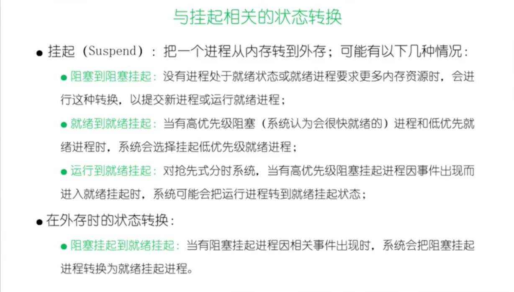
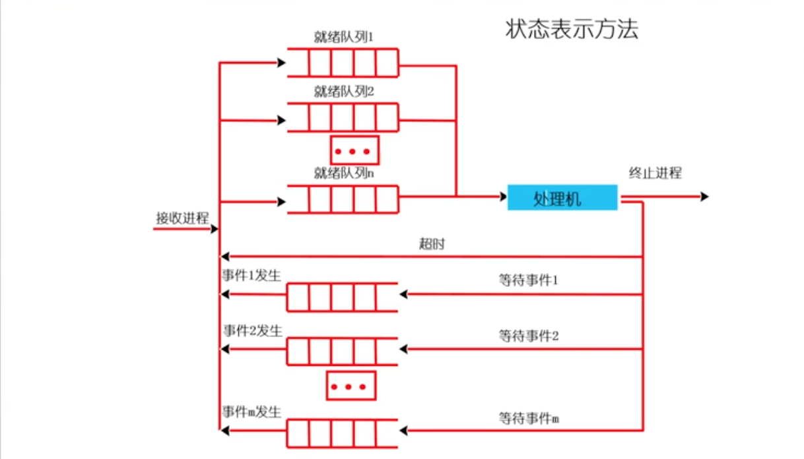
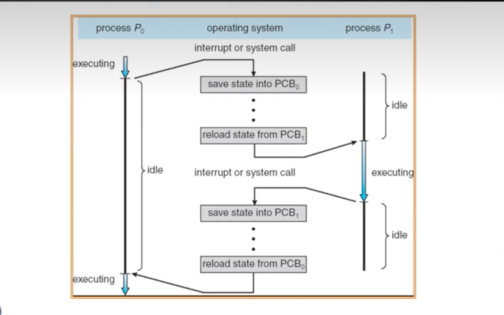
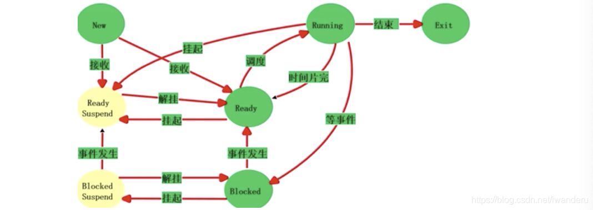
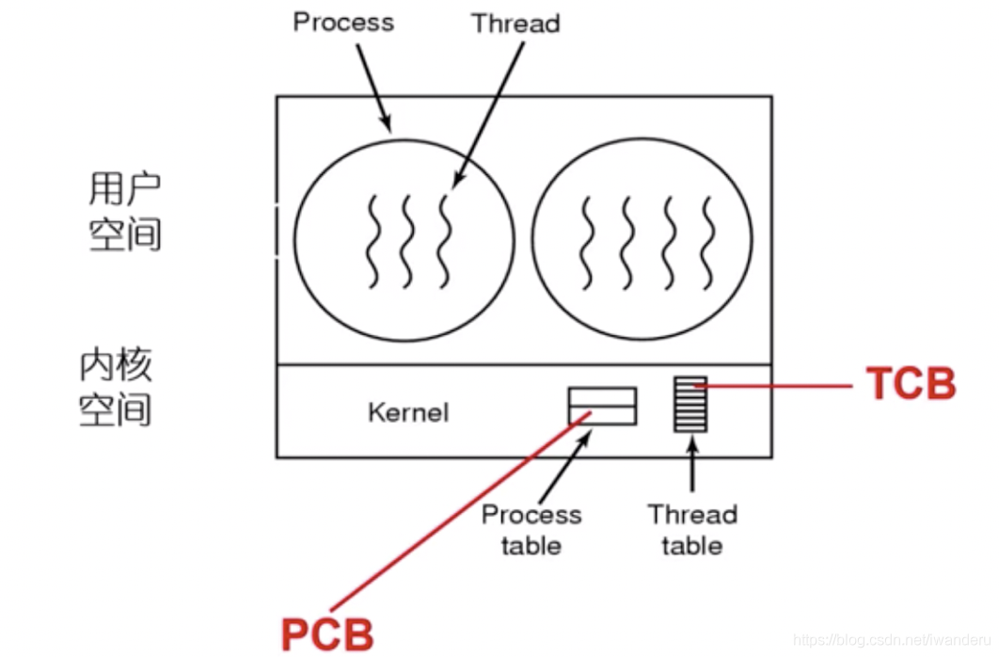
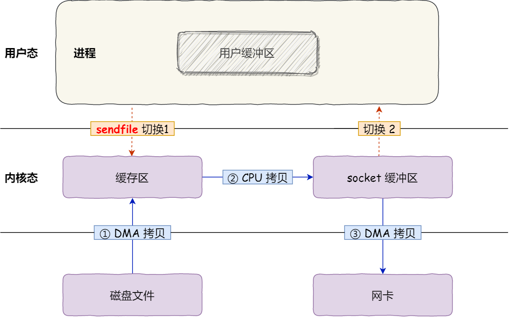

# 计算机操作系统 (第四版) - 汤小丹


操作系统比较重要的四大模块，分别是: [内存管理](https://mp.weixin.qq.com/s?__biz=MzUxODAzNDg4NQ==&mid=2247485033&idx=1&sn=bf9ba7aca126ad186922c57a96928593&scene=21#wechat_redirect)、[进程管理](https://mp.weixin.qq.com/s?__biz=MzUxODAzNDg4NQ==&mid=2247485175&idx=1&sn=eda03758d4e810afd897ade44c19a508&scene=21#wechat_redirect)、[文件系统管理 ](https://mp.weixin.qq.com/s?__biz=MzUxODAzNDg4NQ==&mid=2247485446&idx=1&sn=2c525f008622b98bc08a66f2b4dcfee8&scene=21#wechat_redirect)、[输入输出设备管理](https://mp.weixin.qq.com/s?__biz=MzUxODAzNDg4NQ==&mid=2247485498&idx=1&sn=6948f309461ea83c691892949c8272dd&scene=21#wechat_redirect)

多道程序系统 , 多处理机


OS程序存储在Disk 硬盘中
BIOS:基本I/O处理系统

## 第一章 操作系统引论

### 操作系统的目标和功能

目标
方便性
有效性
		提高系统资源利用率
		提高系统吞吐量
可扩充性
开放性
作用
		OS作为用户与计算机硬件系统之间的接口
		命令方式
		系统调用方式
		图标–窗口方式
		OS实现了对计算机资源的抽象

一个未配置OS的计算机系统是极难使用的,如果用户想直接在计算机(裸机)上运行自己所编写的程序,就必须用机器语言书写程序.

### 操作系统的发展过程

未配置操作系统的计算机系统

人工操作方式

​		用户独占全机 CPU等待人工操作 严重降低了计算机资源的利用率

脱机输入/输出(Off–Line I/O)方式

​		减少了CPU的空闲时间 提高了I/O速度 效率仍然不理想

单道批处理系统

多道批处理系统
		1.资源利用率高
		2.系统吞吐量大
		3.平均周转时间长
		4.无交互能力
		(宏观并行，微观串行)

分时系统
		1.多路性
		2.独立性
		3.及时性
		4.交互性

实时系统

集群系统–超算~云计算

微机操作系统的发展

微软 DOS windows 

IBM UNIX 

类UNIX系统: Solaris OS ,Linux OS


### 操作系统的基本特征


#### 并发concurrence

​	区别并行和并发
​			并行性是指两个或多个事件在同一时刻发生→宏观并行，微观并行
​			并发性是指两个或多个事件在同一时间间隔内发生→宏观并行，微观串行

并发是进程宏观一起运行，微观上交替运行，而并行是指同时运行

1.**并行与并发**
		并行性和并发性是既相似又有区别的两个概念。并行性是指两个或多个事件在同一时刻发生。而并发性是指两个或多个事件在同--时间间隔内发生。在多道程序环境下，并发性是指在一段时间内宏观上有多个程序在同时运行，但在单处理机系统中，每一时刻却仅能有一道程序执行，故微观上这些程序只能是分时地交替执行。例如，在1秒钟时间内，0~15 ms 程序 A 运行：15~30ms 程序B运行：30~45ms 程序C运行：45~60 ms 程序D运行，因此可以说，在1秒钟时间间隔内，宏观上有四道程序在同时运行，但微观上，程序A、B、C、D是分时地交替执行的。倘若在计算机系统中有多个处理机，这些可以并发执行的程序便可被分配到多个处理机上，实现并行执行，即利用每个处理机来处理一个可并发执行的程序。这样，多个程序便可同时执行。

2.**引入进程**
		在一个末引入进程的系统中，在属于同一个应用程序的计算程序和 VO 程序之间只能是顺序执行，即只有在计算程序执行告一段落后，才允许 VO 程序执行；反之，在程序执行VO操作时，计算程序也不能执行。但在为计算程序和VO 程序分别建立一个进程(Process)后，这两个进程便可并发执行。若对内存中的多个程序都分别建立一个进程，它们就可以并发执行，这样便能极大地提高系统资源的利用率，增加系统的吞吐量•所谓进程，是指在系统中能独立运行并作为资源分配的基本单位，它是由一组机器指令、数据和堆栈等组成的，是一个能独立运行的活动实体。多个进程之间可以并发执行和交换信息。事实上，进程和并发是现代操作系统中最重要的基本概念，也是操作系统运行的基础.

引入进程
		进程是指在系统中能独立运行并作为资源分配的基本单位，它是由一组机器指令，数据和堆栈等组成的，是一个能独立运行的活动实体

共享sharing
1.互斥共享方式
2.同时访问方式
并发和共享是多用户(多任务)OS的两个最基本的特征。它们又是互为存在的条件

虚拟virtual
		时分复用技术
		空分复用技术

异步asynchronism
		多道程序环境下,系统允许多个进程并发执行. 在单处理机环境下,由于系统中只有一台处理机,因此每次只允许一直进程执行,其余进程只能等待


### 操作系统的主要功能:


#### 1 处理机管理功能

##### 	进程控制

##### 	进程同步

​		进程互斥方式

​		进程同步方式(协同)

##### 	进程通信

##### 	调度

​		作业调度  从后备队列中按照一定的算法选择出若干个作业,分别为他们建立进程.

​		进程调度  从进程的就绪队列中按照约定的算法选出一个进程,将处理机分配给它,并为它设置运行现场.


#### 2 存储器管理功能

##### 	内存分配

​		静态分配

​		动态分配

##### 	内存保护  

​		去报没到程序尽在自己的内存空间内运行,彼此互不干扰

##### 	地址映射

​		为每个程序提供逻辑地址与物理内存地址的映射

##### 	内存扩充

​		为进程扩充内存


#### 3 设备管理功能

##### 	缓冲管理

​		如果在I/O设备和CPU之间映入缓冲,则可以有效地缓和CPU和I/O设备速度不匹配的矛盾,提高CPU的利用率,劲儿提高系统吞吐量

##### 	设备分配

##### 	设备处理

​		设备处理程序又称设备驱动程序

#### 4 文件管理功能

##### 	文件存储空间的管理

##### 	目录管理

##### 	文件的读写管理和保护

#### 5 操作系统与用户之间的接口

##### 	用户接口

##### 	程序接口

#### 6.现代操作系统的新功能

##### 	系统安全

##### 	网络的功能和服务

##### 	支持多媒体


### OS结构设计

#### 传统操作系统结构:

​		无结构操作系统  在早期开发操作系统时,缺乏设计思想,是众多的过程的集合,无结构的

​		模块化OS


​		分层式结构OS

​			将OS系统分为若干层次,每个层次分若干模块,层次之间存在单项依赖关系,即高层仅依赖相邻的低层.

​		客户/服务器模式  Client / Server    CS模式

​		面对对象的程序设计

​			该技术是基于抽象和隐蔽来控制大型软件的复杂度


#### 微内核os结构:

  	为了提高操作系统的“正确性” “灵活性”、“易维护性”和“可扩充性”，在进行现代操作系统结构设计时，即使在单计算机环境下，大多也采用基于客户/服务器模式的微内核结构，将操作系统划分为两大部分：微内核和多个服务器。至于什么是微内核操作系统结构，现在尚无一致公认的定义，但我们可以从下面四个方面对微内核结构的操作系统进行描述。

1足够小的内核
在微内核操作系统中，内核是指精心设计的、能实现现代 OS 最基本核心功能的小型内核，微内核并非是一个完整的OS，而只是将操作系统中最基本的部分放入微内核，通常包含有：① 与硬件处理紧密相关的部分；②些较基本的功能；③ 客户和服务器之间的通信。这些OS 最基本的部分只是为构建通用 OS 提供一个重要基础，这样就可以确保把操作系统内核做得很小。

2）基于客户/服务器模式
由于客户/服务器模式具有非常多的优点，故在单机微内核操作系统中几乎无一例外地都采用客广/服务器模式，将操作系统中最基本的部分放入内核中，而把操作系统的绝大部分功能都放在微内核外面的一组服务器(进程)中实现，如用于提供对进程(线程)进行管理的进程（线程)服务器、提供虚拟存储器管理功能的虚拟存储器服务器、提供 VO 设备管理的 VO 设备管理服务器等，它们都是被作为进程来实现的，运行在用户态，客户与服务器之间是借助微内核提供的消息传递机制来实现信息交互的。图1-11 示出了在单机环境下的客户/服务器模式。


3） 应用“机制与策略分离”原理
在现在操作系统的结构设计中，经常利用“机制与策略分离”的原理来构造 OS 结构。所谓机制，是指实现某一功能的具体执行机构。而策略，则是在机制的基础上借助于某些参数和算法来实现该功能的优化，或达到不同的功能目标。通常，机制处于。个系统的基层，而策略则处于系统的高层。在传统的 ◎S 中，将机制放在OS 的内核的较低层，把策略放在内核的较高层次中。而在微内核操作系统中，通常将机制放在 oS 的微内核中。正因为如此，才有可能将内核做得很小。

4）采用面向对象技术
操作系统是一个极其复杂的大型软件系统，我们不仅可以通过结构设计来分解操作系统的复杂度，还可以基于面向对象技术中的“抽象” 和“隐蔽”原则控制系统的复杂性，再进一步利用“对象”、“封装”和“继承”等概念来确保操作系统的“正确性”、“可靠性”，“易修改性”、“易扩展性” 等，并提高操作系统的设计速度。正因为面向对象技术能带来如此多的好处，故面向对象技术被广泛应用手现代操作系统的设计中。

微内核的基本功能:
微内核应具有哪些功能，或者说哪些功能应放在微内核内，哪些应放在微内核外，目前尚无明确的规定。现在一般都采用 “机制与策略分离”的原理，将机制部分以及与硬件紧密相关的部分放入微内核中。由此可知微内核通常具有如下几方面的功能：

1进程(线程)管理
大多数的微内核OS，对于进程管理功能的实现，都采用“机制与策略分离”的原理，例如，为实现进程(线程)调度功能，须在进程管理中设置一个或多个进程(线程）优先级队列：能将指定优先级进程(线程)从所在队列中取出，并将其投入执行。由于这一部分属于调度功能的机制部分，应将它放入微内核中。布对于用户(进程)如何进行分类，以及其优先级的确认方式或原则，则都是属于策略问题。可将它们放入微内核外的进程(线程)管理服务器中。由于进程(线程)之间的通信功能是微内核 oS 最基本的功能，被频繁使用，因此几乎所有的微内核OS 都是将进程(线程)之间的通信功能放入微内核中。此外，还将进程的切换、线程的调度，以及名处理机之间的同步等功能也放入微内核中。

2）低级存储器管理
通常在微内核中，只配置最基本的低级存储器管理机制，如用于实现将用户空间的逻辑地址变换为内存空间的物理地址的页表机制和地址变换机制，这一部分是依赖于硬件的，因此放入微内核。而实现處拟存储器管理的策略，则包含应采取何种页面置换算法、采用何种分配内存与回收的策略等.

3）中断和陷入


4.微内核操作系统存在的问题
		应当指出，在微内核操作系统中，由于采用了非常小的内核，客户/服务器模式和消息传递机制虽给微内核操作系统带来了许多优点，但由此也使微内核 OS 存在着潜在缺点，其中最主要的是，较之早期的操作系统，微内核操作系统的运行效率有所降低。

​		效率降低最主要的原因是，在完成一次客户对操作系统提出的服务请求时，需要利用消息实现名次交互和进行用户/内核模式与上下文的多次切换。然而，在早期的oS 中，用户进程在请求取得 OS 服务时，一般只需进行两次上下文的切换：一次是在执行系统调用后由用户态转向系统态时；另一次是在系统完成用户请求的服务后，由系统态返回用户态时

​		在微内核 os 中，由于客户和服务器、服务器和服务器之间的通信都需通过微内核致使同样的服务请求至少需要进行四次上下文切换。第一次是发生在客户发送请求消息给内核，以请求取得某服务器特定的服务时：第二次是发生在由内核把客户的请求消息发往服务器时；第三次是当服务器完成客户请求后，把响应消息发送到内核时：第四次是在内核将响应消息发送给客户时。

​		实际情况是往往还会引起更多的上下文切换。例如，当某个服务器自身尚无能力完成客户请求而需要其它服务器的帮助时，如图1-12所示，其中的文件服务器还需要磁盘服务器的帮助，这时就需要进行8次上下文的切换。


​	 为了改善运行效率，可以重新把一些常用的操作系统基本功能由服务器移入微内核中。这样可使客户对常用操作系统功能的请求所发生的用户/内核模式和上下文的切换的次数由四次或八次降为两次。但这又会使微内核的容量明显地增大，在小型接口定义和适应性方面的优点也有所下降，并提高了微内核的设计代价。


## 第二章 进程的描述与控制

​		在传统的操作系统中，为了提高资源利用率和系统吞吐量，通常采用多道程序技术，将多个程序同时装入内存，并使之并发运行，传统意义上的程序不再能独立运行。此时，作为资源分配和独立运行的基本单位都是进程。操作系统所具有的四大特征也都是基于进程而形成的，并从进程的角度对操作系统进行研究。可见，在操作系统中，进程是一个极其重要的概念。因此，本章专门对进程进行详细阐述

​		在早期未配置 OS 的系统和单道批处理系统中，程序的执行方式是顺序执行，即在内存中仅装入一道用户程序，由它独占系统中的所有资源，只有在一个用户程序执行完成后，才允许装入另一个程序并执行。可见，这种方式浪费资源、系统运行效率低等缺点。而在多道程序系统中，由于内存中可以同时装入多个程序，使它们共享系统资源，并发执行，显然可以克服上述缺点。程序的这两种执行方式间有着显著的不同，尤其是考虑到程序并发执行时的特征，才导致了在操作系统中引入进程的概念。因此，这里有必要先对程序的顺序和并发执行方式做简单的描述。

### 程序并发执行

程序的并发执行

程序并发执行时的特征
	间断性
	失去封闭性
	不可再现性

### 进程的描述

进程的定义

- 进程是程序的一次执行
- 进程是一个程序及其数据在处理机上顺序执行时所发生的活动
- 进程是具有独立功能的程序在一个数据集合上运行的过程，它是系统进行资源分配和调度的一个独立单位

进程的特征

- 动态性
- 并发性
- 独立性
- 异步性

从操作系统角度分类

- 系统进程
- 用户进程

进程和程序的区别

- 进程是动态概念，而程序则是静态概念
- 程序是指令的有序集合，永远存在；进程强调是程序在数据集上的一次执行，有创建有撤销，存在是暂时的；
- 进程具有并发性，而程序没有
- 进程可创建其他进程，而程序并不能形成新的程序
- 进程是竞争计算机资源的基本单位，程序不是

进程和程序的联系

- 进程是程序在数据集上的一次执行

- 程序是构成进程的组成部分，一个程序可对应多个进程，一个进程可包括多个程序

- 进程的运行目标是执行所对应的程序

- 从静态看，进程由程序、数据和进程控制块（PCB）组成

  

### 进程的基本状态及转换

进程的三种基本状态

- 就绪状态ready
- 执行状态running
- 阻塞状态block

三种基本状态的转换

创建状态和终止状态

- 五状态进程模型

- 注意 阻塞态->运行态 和 就绪态->阻塞态这二种状态转换不可能发生


挂起操作和进程状态的转换

挂起和阻塞的区别

挂起操作的目的

- 终端用户的需要: 修改、检查进程
- 父进程的需要：修改、协调子进程
- 对换的需要：缓和内存
- 负荷调节的需要：保证实时任务的执行


### 进程管理中的数据结构

进程控制块PCB的作用

- 作为独立运行基本单位的标志
- 能实现间断性运行方式
- 提供进程管理所需要的信息
- 提供进程调度所需要的信息
- 实现与其他进程的同步与通信进程控制块的信息

进程标识符

- 外部标识符PID
- 内部标识符(端口)

处理机状态

- 通用寄存器
- 指令计数器
- 程序状态字PSW
- 用户栈指针

进程调度信息

- 进程状态
- 进程优先级
- 进程调度所需的其他信息
- 事件

进程控制信息

- 程序和数据的地址
- 进程同步和通信机制
- 资源清单
- 链接指针

进程控制块的组织方式

- 线性方式
- 链接方式
- 索引方式

### 进程控制

操作系统内核
	现代操作系统一般将OS 划分为若干层次，再将OS 的不同功能分别设置在不同的层次中。通常将一些与硬件紧密相关的模块(如中断处理程序等)、各种常用设备的驱动程序以及运行频率较高的模块(如时钟管理、进程调度和许多模块所公用的一些基本操作)，都安排在紧靠硬件的软件层次中，将它们常驻内存，即通常被称为的 OS 内核。这种安排方式的目的在于两方面：一是便于对这些软件进行保护，防止遭受其他应用程序的破坏：二是可以提高OS 的运行效率。相对应的是，为了防止 OS 本身及关键数据(如 PCB 等)遭受到应用程序有意或无意的破坏，通常也将处理机的执行状态分成系统态和用户态两种：
① 系统态：又称为管态，也称为内核态。它具有较高的特权，能执行-一切指令，访问所有寄存器和存储区，传统的 OS都在系统态运行。
② 用户态：又称为目态。它是具有较低特权的执行状态，仅能执行规定的指令，访问指定的寄存器和存储区。一般情况下，应用程序只能在用户态运行，不能去执行 OS 指令及访问 OS 区域，这样可以防止应用程序对 OS 的破坏。

两大功能:
**1.支撑功能**
该功能是提供给 OS 其它众多模块所需要的些基本功能，以便支撑这些模块工作。其中三种最基本的支撑功能是：中断处理、时钟管理和原语操作。
	(1）中断处理。中断处理是内核最基本的功能，是整个操作系统赖以活动的基础，OS中许多重要的活动，如各种类型的系统调用、键盘命令的输入、进程调度、设备驱动等，无不依赖于中断。通常，为减少处理机中断的时间，提高程序执行的并发性，内核在对中浙进行“有限处理” 后，便转入相关的进程，由这些进程继续完成后续的处理工作。
 （2） 时钟管理。时钟管理是内核的一项基本功能，在OS 中的许多活动都需要得到它的支撑，如在时间片轮转调度中，每当时间片用完时，便由时钟管理产生一个中断信号，促使调度程序重新进行调度。同样，在实时系统中的截止时间控制、批处理系统中的最长运行时间控制等，也无不依赖于时钟管理功能。
 （3） 原语操作。所谓原语(Primitive)，就是由若千条指令组成的，用于完成一定功能的个过程。它与一般过程的区别在于：它们是“原子操作(Action Operation)”。所谓原子操作是指，一个操作中的所有动作要么全做，要么全不做。换言之，它是一个不可分割的基本单位。因此，原语在执行过程中不允许被中断。原子操作在系统态下执行，常驻内存在内核中可能有许多原语，如用于对链表进行操作的原语、 用于实现进程同步的原语等。

​	进程的管理，由若干原语（primitive）来执行

**2.资源管理功能**
	(1)  进程管理。在进程管理中，或者由于各个功能模块的运行频率较高，如进程的调度与分派、进程的创建与撤消等：或者由于它们为多种功能模块所需要，如用于实现进程同步的原语、常用的进程通信原语等。通常都将它们放在内核中，以提高OS 的性能。
  （2）存储器管理。存储器管理软件的运行频率也比较高，如用于实现将用户空间的逻辑地址变换为内存空间的物理地址的地址转换机构、内存分配与回收的功能模块以及实现内存保护和对换功能的模块等。通常也将它们放在内核中，以保证存储器管理具有较高的运行速度。
	(3）设各管理。由于设各管理与硬件(设备)紧密相关，因此其中很大部分也都设置在内核中。如各类设备的驱动程序、用于缓和 CPU 与VO 速度不匹配矛盾的缓冲管理、用于实现设备分配和设备独立性功能的模块等.

#### 进程的创建

- 进程的层次结构
  - 父进程
  - 子进程
  
- 引起创建进程的事件
  - 用户登录
  - 作业调度
  - 提供服务
  - 应用请求
  
- 进程的创建过程
  - 1.申请空白PCB
  - 2.为新进程分配其运行所需的资源
  - 3.初始化进程块PCB
  - 4.如果进程就绪队列能够接纳新进程，便将新进程插入就绪队列
  
- 进程的终止
  - 引起进程终止的事件
    - 1.正常结束
    - 2.异常结束
    - 3.外界干预
  - 进程的终止过程
    - 1.根据被终止进程的标识符
  
- 进程的阻塞与唤醒
  - 引起进程阻塞和唤醒的事件
    - 请求系统服务而未满足
    - 启动某种操作而阻塞当前进程
    - 新数据尚未到达
    - 无新工作可做：系统进程
  - 进程阻塞过程(自己阻塞自己)
  - 进程唤醒过程(系统或其他进程唤醒自己)
  
- 进程的挂起与激活
  - suspend
  - active

- 进程同步
  - 基本概念
    - 两种形式的制约关系
      - 间接相互制约关系
        - 互斥——竞争
      - 直接相互制约关系
        - 同步——协作
    - 临界资源
    - 分区
      - 进入区enter section
      - 临界区critical section
      - 退出区exit section
      - 剩余区remainder section
    - 同步机制应遵循的规则
      - 1.空闲让进
      - 2.忙则等待
      - 3.有限等待
      - 4.让权等待
  - 进程同步机制
    - 软件同步机制:都没有解决让权等待，而且部分方法还会产生死锁的情况
    - 硬件同步机制
      - 关中断
      - 利用Test-and-Set指令实现互斥
      - 利用swap指令实现进程互斥
    - 信号量机制
      - 整型信号量
      - 记录型信号量
        - 由于整型信号量没有遵循让权等待原则，记录型允许负数，即阻塞链表
      - AND型信号量
      - 信号量集
        - 理解:AND型号量的wait和signal仅能对信号施以加1或减1操作，意味着每次只能对某类临界资源进行一个单位的申请或释放。当一次需要N个单位时，便要进行N次wait操作，这显然是低效的，甚至会增加死锁的概率。此外，在有些情况下，为确保系统的安全性，当所申请的资源数量低于某一下限值时，还必须进行管制，不予以分配。因此，当进程申请某类临界资源时，在每次分配前，都必须测试资源数量，判断是否大于可分配的下限值，决定是否予以分配
        - 操作
          - Swait(S1，t1，d1…Sn，tn，dn)
          - Ssignal(S1，d1…Sn，dn)
        - 特殊情况
  
  
  
  
  
  
  
  
  
  - 经典进程的同步问题
    - 生产者–消费者问题
    - 哲学家进餐问题
    - 读者–写者问题

### 进程通信

- 进程通信是指进程之间的信息交换，又称低级进程通信

- 进程通信的类型

  - 共享存储器系统

    基于共享数据结构的通信方式

    ​		生产者和消费者

    基于共享存储区的通信方式

    ​		高级通信

  - 管道通信系统(pipe)  (共享文件)

    高级通信

  - 消息传递系统

    高级通信

    方式分类

    ​		直接通信

    ​		间接通信

  - 客服机–服务器系统

- 消息传递通信的实现方式

  - 直接消息传递系统
  - 信箱通信

### 线程的基本概念

​	在多处理机系统中，对于传统的进程，即单线程进程，不管有多少处理机，该进程只能运行在一个处理机上。但对于多线程进程，就可以将-一个进程中的多个线程分配到多个处理机上，使它们并行执行，这无疑将加速进程的完成。因此，现代多处理机 oS 都无-例外地引入了多线程。

- 线程的引入

  - 线程的引入正是为了简化线程间的通信，以小的开销来提高进程内的并发程度

  - 多线程并发的不足

    - 进程的两个基本属性
      - 一个拥有资源的独立单位，可独立分配系统资源
      - 一个可独立调度和分派的基本单位，PCB
    - 程序并发执行所需付出的时空开销
      - 创建进程
      - 撤销进程
      - 进程切换
    - 进程间通信效率低
    - 将分配资源和调度两个属性分开

  - 线程——作为调度和分派的基本单位

    - 进程是系统资源分配的单位，线程是处理器调度的单位

    - 线程表示进程的一个控制点，可以执行一系列的指令。通常，和应用程序的一个函数相对应

    - 进程分解为线程还可以有效利用多处理器和多核计算机 

      

- 线程与进程的比较

  - 不同点
    - 调度的基本单位
    - 并发性
  - 相似点
    - 状态：运行、阻塞、就绪
    - 线程具有一定的生命期
    - 进程可创建线程，一个线程可创建另一个子线程
    - 多个线程并发执行时仍然存在互斥与同步

- 线程的实现

  - 线程的实现方式
    - 内核支持线程KST
    - 用户级线程ULT
    - 组合方式

多线程OS中的进程属性

通常在多线程oS 中的进程都包含了多个线程，并为它们提供资源。OS 支持在一个进
程中的多个线程能并发执行，但此时的进程就不再作为一个执行的实体。多线程 OS 中的
进程有以下属性：
	(1) 进程是一个可拥有资源的基本单位。在多线程 oS 中，进程仍是作为系统资源分配的基本单位，任一进程所拥有的资源都包括：用户的地址空间、实现进程(线程)间同步和通信的机制、己打开的文件和己申请到的 VO 设备，以及一张由核心进程维护的地址映射表，该表用手实现用户程序的逻辑地址到其内存物理地址的映射。
（2）多个线程可并发执行。通常一个进程都含有若干个相对独立的线程，其数目可多可少，但至少要有一个线程。由进程为这些(个)线程提供资源及运行环境，使它们能并发执行。在os 中的所有线程都只能属于某一个特定进程。实际上，现在把传统进程的执行方法称为单线程方法。如传统的 UNIX 系统能支持多用户进程，但只支持单线程方法。反之，将每个进程支持多个线程执行的方法称为多线程方法。**如Java 的运行环境是单进程多线程的， Windows 2000、Solaris、Mach 等采用的则是多进程多线程的方法。**
	(3）**进程己不是可执行的实体。在多线程OS 中，是把线程作为独立运行(或称调度)的基本单位**。此时的进程己不再是一个基本的可执行实体。虽然如此，进程仍具有与执行相关的状态。例如，所谓进程处于 “执行”状态，实际上是指该进程中的某线程正在执行。此外，对进程所施加的与进程状态有关的操作也对其线程起作用。例如，在把某个进程挂起时，该进程中的所有线程也都将被挂起：又如，在把某进程激活时，属于该进程的所有线程也都将被激活。

- 线程的状态和线程控制块
  - 线程运行的三个状态
    - 执行状态
    - 就绪状态
    - 阻塞状态
  - 线程控制块TCB

## 第三章 处理机调度与死锁

### 处理机调度算法的目标

1. 处理机调度算法的共同目标

   1. 资源利用率:CPU的利用率=CPU有效工作时间/(CPU有效工作时间+CPU空闲等待时间)
   2. 公平性
   3. 平衡性
   4. 策略强制执行

2. 批处理系统的目标

   1. 平均周转时间短
   2. 系统吞吐量高
   3. 处理机利用率高

3. 分时系统的目标

   - 响应时间快
   - 均衡性

4. 实时系统目标

   - 截止时间的保证
   - 可预测性

5. 处理机调度的层次

   - 高级调度（作业调度）

     - 分时系统无需作业调度，因为需要交互
     - 批处理系统需要作业调度

   - 中级调度（和挂起有关）

   - 低级调度（进程调度）

     - 进程调度是最基本的调度，任何操作系统都有进程调度。

     - 低级调度的三个基本机制

       - 排队器

       - 分派器

       - 上下文切换

         ​		上下文切换器。在对处理机进行切换时，会发生两对上下文的切换操作：①第-对上下文切换时，OS 将保存当前进程的上下文，即把当前进程的处理机寄存器内容保存到该进程的进程控制块内的相应单元，再装入分派程序的上下文，以便分派程序运行：②第二对上下文切换是移出分派程序的上下文，而把新选进程的 CPU 现场信息装入到处理机的各个相应寄存器中，以便新选进程运行。

         ​		在进行上下文切换时，需要执行大量的 load 和store 等操作指令，以保存寄存器的内容。即使是现代计算机，每一次上下文切换所花费的时间大约可执行上千条指令。为此，现在已有靠硬件实现的方法来减少上下文切换时问。一般采用两组(或多组)寄存器，其中的一组寄存器任外理机在系统杰时伟用，而另一组寄在聚任应用程序佳用，在这样冬件下的上下文切换，只需改变指针，使其指向当前寄存器组即可。

   进程调度方式

   - 非抢占方式

   - 抢占方式

     ​		在现代 OS 中广泛采用抢占方式，这是因为：对于批处理机系统，可以防止一个长进程长时间地占用处理机，以确保处理机能为所有进程提供更为公平的服务。在分时系统中，只有采用抢占方式才有可能实现人一机交互。

     ​	①优先权原则，指允许优先级高的新到进程抢占当前进程的处理机，即当有新进程到达时，如果它的优先级比正在执行进程的优先级高，则调度程序将剥夺当前进程的运行，将处理机分配给新到的优先权高的进程。
     ​	② 短进程优先原则，指允许新到的短进程可以抢占当前长进程的处理机，即当新到达的进程比正在执行的进程(尚须运行的时间)明显短时，将处理机分配给新到的短进程。
     ​	③ 时间片原则，即各进程按时间片轮转运行时，当正在执行的进程的一个时间片用完后，便停止该进程的执行而重新进行调度

   - 进程调度的任务

     - 保存处理机的现场信息
     - 按某种算法选取进程
     - 把处理器分配给进程

   - 进程调度的算法

     - 优先级调度算法
       - 优先级调度算法的类型
         - 非抢占式优先级调度算法
           - 等当前进程执行完以后，再执行另一个优先权最高的进程
           - 这种调度算法主要用于批处理系统中；也可用于某些对实时性要求不严的实时系统中。
         - 抢占式优先级调度算法
           - 不等当前进程结束，直接抢处理机
           - 常用于要求比较严格的实时系统中， 以及对性能要求较高的批处理和分时系统中。
       - 优先级的类型
         - 静态优先级
           - 优先权是在创建进程时确定的，且在进程的整个运行期间保持不变。一般地，优先权是利用某一范围内的一个整数来表示的，例如，07或0255中的某一整数， 又把该整数称为优先数。
           - 可以参考BIOS系统中设置boot的优先级
         - 动态优先级
           - 在创建进程时所赋予的优先权，是可以随进程的推进或随其等待时间的增加而改变的，以便获得更好的调度性能。
     - 轮转调度算法
       - 基本原理:在轮转(RR)法中，系统根据FCFS策略，将所有的就绪进程排成一个就绪队列，并可设置每隔一定时间间隔(如30ms)即产生一次中断，激活系统中的进程调度程序，完成一次调度，将CPU分配给队首进程，令其执行
       - 进程切换时机
         - 时间片未用完，进程完成
         - 时间片到，进程未完成
       - 时间片大小的确定
         - 太小利于短作业，增加系统切换开销
         - 太长就退化为FCFS算法
         - 一般选择: q略大于一次交互所需要的时间，使大多数进程在一个时间片内完成
       - 一般来说，平均周转时间将比SJF长，但是有较好的响应时间
     - 多队列调度算法
     - 多级反馈队列调度算法
       - 调度机制
         - 设置多个就绪队列
         - 每个队列都采用FCFS算法
         - 按照队列优先级调度，在第n队列中采取按时间片轮转的方式运行
       - 调度算法的性能
         - 对于终端型用户，由于作业小，感觉满意
         - 对于短批处理作业用户，周转时间也较小
         - 长批处理作业用户，也能够得到执行
     - 基于公平原则的调度算法
       - 保证调度算法
       - 公平分享调度算法

### 作业与作业调度

作业

- 作业不仅包含程序和数据，还配有一份作业说明书，系统根据说明书对程序的运行进行控制。批处理系统是以作业为单位从外存掉入内存的。

作业控制块JCB

- 为每个作业设置一个JCB，保存了对作业管理调度的全部信息。是作业存在的标志。

作业步

- 作业步，每个作业都必须经过若干相对独立，有相互关联的顺序步骤才能得到结果。每一个步骤就是一个作业步。

作业运行的三个阶段

- 收容阶段
- 运行阶段
- 完成阶段

作业运行的三个状态

- 后备状态
- 运行状态
- 完成状态

作业调度的主要任务

- 接纳多少个作业
- 接纳哪些作业

先来先服务(first–come first–served，FCFS)调度算法

- 比较有利于长作业，而不利于短作业。
- 有利于CPU繁忙的作业，而不利于I/O繁忙的作业。

短作业优先(short job first，SJF)的调度算法

- 优点
  - 比FCFS改善平均周转时间和平均带权周转时间，缩短作业的等待时间；
  - 提高系统的吞吐量；
- 缺点
  - 必须预知作业的运行时间
  - 对长作业非常不利，长作业的周转时间会明显地增长
  - 在采用SJF算法时，人–机无法实现交互
  - 该调度算法完全未考虑作业的紧迫程度，故不能保证紧迫性作业能得到及时处理

优先级调度算法(priority–scheduling algorithm，PSA)

高响应比优先调度算法(Highest Response Ratio Next,HRRN)

- 原理
  - 在每次选择作业投入运行时，先计算此时后备作业队列中每个作业的响应比RP然后选择其值最大的作业投入运行
  - 优先权=(等待时间+要求服务时间)/要求服务时间=响应时间/要求服务时间=1+等待时间/要求服务时间
- 特点
  - 如果作业的等待时间相同，则要求服务的时间愈短，其优先权愈高，因而类似于SJF算法，有利于短作业
  - 当要求服务的时间相同时，作业的优先权又决定于其等待时间，因而该算法又类似于FCFS算法
  - 对于长时间的优先级，可以为随等待时间的增加而提高，当等待时间足够长时，也可获得处理机

### 实时调度(HRT和SRT任务)

实现实时调度的基本条件 

- 提供必要信息
  - 就绪时间
  - 开始截止时间和完成截止时间
  - 处理时间
  - 资源要求
  - 优先级
- 系统处理能力强
  - ∑(Ci/Pi)≤1
  - N个处理机:∑(Ci/Pi)≤N
- 采用抢占式调度机制
- 具有快速切换机制
  - 对中断的快速响应能力
  - 快速的任务分派能力

实时调度算法的分类

- 非抢占式调度算法
  - 非抢占式轮转调度算法
  - 非抢占式优先调度算法
- 抢占式调度算法
  - 基于时钟中断的抢占式优先级调度算法
  - 立即抢占的优先级调度算法

最早截止时间优先EDF(Earliest Deadline First)算法

- 根据任务的开始截至时间来确定任务的优先级
  - 截至时间越早，优先级越高
- 非抢占式调度方式用于非周期实时任务
- 抢占式调度方式用于周期实时任务

最低松弛度优先LLF(Least Laxity First)算法

- 类似EDF
- 算法根据任务紧急(或松弛)的程度，来确定任务的优先级。任务的紧急程度愈高，为该任务所赋予的优先级就愈高， 以使之优先执行。
- 松弛度例子
  - 例如，一个任务在200ms时必须完成，而它本身所需的运行时间就有100ms，因此，调度程序必须在100 ms之前调度执行，该任务的紧急程度(松弛程度)为100 ms

优先级倒置(Priority inversion problem)

- 优先级倒置的形成
  - 高优先级进程被低优先级进程延迟或阻塞。
- 优先级倒置的解决方法
  - 简单的:假如进程P3在进入临界区后P3所占用的处理机就不允许被抢占
  - 实用的:建立在动态优先级继承基础上的

### 死锁概述

死锁的起因，通常是源于多个进程对资源的争夺，不仅对不可抢占资源进行争夺时会引起死锁，而且对可消耗资源进行争夺时，也会引起死锁。
1. 竞争不可抢占性资源引起死锁
通常系统中所拥有的不可抢占性资源其数量不足以满足多个进程运行的需要，使得进程在运行过程中，会因争布资源而陷入僵局。例如，系统中有两个进程P1和P2，它们都准备写两个文件 F1和F2，而这两者都属于可重用和不可抢占性资源。进程P1先打开F1然后再打开文件F2,进程P2先打开文件 F2,互相等待对方释放资源,而形成死锁。

- 资源问题

  - 可重用性资源
    - 计算机外设
  - 消耗性资源
    - 数据，消息
  - 可抢占性资源
    - 不引起死锁
    - CPU，内存
  - 不可抢占性资源
    - 光驱，打印机

- 计算机系统中的死锁

  - 竞争不可抢占性资源引起死锁
  - 竞争可消耗资源引起死锁
  - **进程推进顺序不当引起死锁**

- 死锁的定义，必要条件和处理方法

  定义:如果一组进程中的每一个进程都在等待仅由该进程中的其他进程才能引发的事件，那么该组进程是死锁的

  **产生死锁的必要条件 , 只要其中任一个条件不成立,死锁就不会发生:**

  - 互斥条件 (资源是互斥的)
  - 请求和保存条件 ((进程已经保持了至少一个资源,但又体处理新的资源请求,而该资源已被其他进程占有,此时请求进程被阻塞,但对自己已获得的资源保持不放))
  - 不可抢占条件 (资源在未使用完之前不能被抢占)
  - 循环等待条件
    - 如果每个资源只有一个实例，则环路等待条件是死锁存在的充分必要条件

  处理死锁的方法

  预防死锁

  - 静态方法，在进程执行前采取的措施，通过设置某些限制条件，去破坏产生死锁的四个条件之一，防止发生死锁。
  - 预防死锁的策略
    - 破坏"请求和保存"条件
      - 第一种协议
        - 所有进程在开始运行之前，必须一次性地申请其在整个运行过程中所需的全部资源
        - 优点:简单，易行，安全
        - 缺点
          - 资源被严重浪费，严重地恶化了资源的利用率
          - 使进程经常会发生饥饿现象
      - 第二种协议
        - 它允许一个进程只获得运行初期所需的资源后，便开始运行。进程运行过程中再逐步释放已分配给自己的，且已用毕的全部资源，然后再请求新的所需资源
    - 破坏"不可抢占"条件
      - 当一个已经保存了某些不可被抢占资源的进程，提出新的资源请求而不能得到满足时，它必须释放已经保持的所有资源，待以后需要时再重新申请
    - 破坏"循环等待"条件
      - 对系统所以资源类型进行线性排序，并赋予不同的序号
      - 例如令输入机的序号为1，打印机序号为2，磁盘机序号为3等。所有进程对资源的请求必须严格按资源序号递增的次序提出。

  避免死锁

  动态的方法，在进程执行过程中采取的措施，不需事先采取限制措施破坏产生死锁的必要条件，而是在进程申请资源时用某种方法去防止系统进入不安全状态，从而避免发生死锁。如银行家算法

  - 避免死锁的策略

    - 系统安全状态

      - 安全状态
        - 某时刻，对于并发执行的n个进程，若系统能够按照某种顺序如<p1,p2…pn>来为每个进程分配所需资源，直至最大需求，从而使每个进程都可顺利完成，则认为该时刻系统处于安全状态，这样的序列为安全序列
      - 安全状态之例
      - 由安全状态向不安全状态的转换

    - 利用银行家算法避免死锁

      含义:每一个新进程在进入系统时，它必须申明在运行过程中，可能需要每种资源类型的最大单元数目，其数目不应超过系统所拥有的资源总量。当进程请求一组资源时，系统必须首先确定是否有足够的资源分配给该进程。若有，再进一步计算在将这些资源分配给进程后，是否会使系统处于不安全状态。如果不会，才将资源分配给它，否则让进程等待

      - 银行家算法中的数据结构
        - 可用资源向量 Available[m]：m为系统中资源种类数，Available[j]=k表示系统中第j类资源数为k个。
        - 最大需求矩阵 Max[n,m]：n为系统中进程数，Max[i,j]=k表示进程i对j类资源的最大需求数为中k。
        - 分配矩阵 Allocation[n，m]:它定义了系统中每一类资源当前已分配给每一进程资源数， Allocation[i,j] = k表示进程i已分得j类资源的数目为k个。
        - 需求矩阵 Need[n,m]：它表示每个进程尚需的各类资源数，Need[i,j]=k 表示进程i 还需要j类资源k个。Need[i,j]=Max[i,j] - Allocation[i,j]
      - 银行家算法
      - 安全性算法
      - 银行家算法之例
      - 解题
        - 矩阵
        - 列表

  检测死锁

  - 死锁的检测与解除
    - 死锁的检测
      - 资源分配图
        - 简化步骤
          - 选择一个没有阻塞的进程p
          - 将p移走，包括它的所有请求边和分配边
          - 重复步骤1，2，直至不能继续下去
      - 死锁定理
        - 若一系列简化以后不能使所有的进程节点都成为孤立节点
      - 检测时机
        - 当进程等待时检测死锁 （其缺点是系统的开销大）
        - 定时检测
        - 系统资源利用率下降时检测死锁
      - 死锁检测中的数据结构
    - 死锁的解除
      - 抢占资源
      - 终止(或撤销)进程
      - 终止进程的方法
        - 终止所有死锁进程
        - 逐个终止进程
          - 代价最小
            - 进程的优先级的大小
            - 进程已执行了多少时间，还需时间
            - 进程在运行中已经使用资源的多少，还需多少资源
            - 进程的性质是交互式还是批处理的
      - 付出代价最小的死锁解除算法
        - 是使用一个有效的挂起和解除机构来挂起一些死锁的进程

  - 解除死锁

## 第四章 存储器管理

### 存储器的层次结构

多层结构的存储系统

- 存储器的多层结构

  - CPU寄存器
  - 主存
  - 辅存

  可执行存储器

  - 寄存器和主存的总称
  - 访问速度快，进程可以在很少的时钟周期内用一条load或store指令完成存取。

主存储器与寄存器

高速缓存和磁盘缓存

​	由于当前磁盘的I/O速度远低于对驻村的访问速度,为了缓和两者之间在速度上的不匹配,而设置了磁盘缓存

### 程序的装入和链接

步骤

- 编译
  - 源程序 ->目标模块（Object modules）--------Compiler
    - 由编译程序对用户源程序进行编译，形成若干个目标模块
- 链接
  - 一组目标模块 ->装入模块 （Load Module）----------Linker
    - 由链接程序将编译后形成的一组目标模板以及它们所需要的库函数链接在一起，形成一个完整的装入模块
- 装入
  - 装入模块 ->内存 --------Loader
    - 由装入程序将装入模块装入内存

程序的装入

- 绝对装入方式
  - 在编译时，如果知道程序将驻留在内存中指定的位置。编译程序将产生绝对地址的目标代码。
- 可重定位装入方式
  - 在可执行文件中，列出各个需要重定位的地址单元和相对地址值。当用户程序被装入内存时，一次性实现逻辑地址到物理地址的转换，以后不再转换(一般在装入内存时由软件完成)。
  - 优点：不需硬件支持，可以装入有限多道程序。
  - 缺点：一个程序通常需要占用连续的内存空间，程序装入内存后不能移动。不易实现共享。
- 动态运行时的装入方式
  - 动态运行时的装入程序在把装入模块装入内存后，并不立即把装入模块中的逻辑地址转换为物理地址，而是把这种地址转换推迟到程序真正要执行时才进行
  - 优点：
    - OS可以将一个程序分散存放于不连续的内存空间，可以移动程序，有利用实现共享。
    - 能够支持程序执行中产生的地址引用，如指针变量（而不仅是生成可执行文件时的地址引用）。
  - 缺点：需要硬件支持，OS实现较复杂。
  - 它是虚拟存储的基础。

程序的链接

- 静态链接方式(lib)
- 装入时动态链接
- 运行时动态链接(dll)

### 连续分配存储管理方式

连续分配

- 单一连续分配(DOS)
- 固定分区分配(浪费很多空间)
- 动态分区分配

地址映射和存储保护措施

- 基址寄存器：程序的最小物理地址
- 界限寄存器：程序的逻辑地址范围
- 物理地址 = 逻辑地址 + 基址

内碎片：占用分区之内未被利用的空间

外碎片：占用分区之间难以利用的空闲分区（通常是小空闲分区）

把内存划分为若干个固定大小的连续分区。固定式分区又称为静态分区。

- 分区大小相等：只适合于多个相同程序的并发执行（处理多个类型相同的对象）。
- 分区大小不等：多个小分区、适量的中等分区、少量的大分区。根据程序的大小，分配当前空闲的、适当大小的分区。
- 优点：无外碎片、易实现、开销小。
- 缺点：
  - 存在内碎片，造成浪费
  - 分区总数固定，限制了并发执行的程序数目。
  - 通用Os很少采用，部分控制系统中采用

动态创建分区：指在作业装入内存时，从可用的内存中划出一块连续的区域分配给它，且分区大小正好等于该作业的大小。可变式分区中分区的大小和分区的个数都是可变的，而且是根据作业的大小和多少动态地划分。

- 基于顺序搜索的动态分区分配算法
  - 首次适应算法（first fit,FF）
    - 顺序找，找到一个满足的就分配，但是可能存在浪费
    - 这种方法目的在于减少查找时间。
    - 空闲分区表（空闲区链）中的空闲分区要按地址由低到高进行排序
  - 循环首次适应算法（next fit，NF）
    - 相对上面那种，不是顺序，类似哈希算法中左右交叉排序
    - 空闲分区分布得更均匀，查找开销小
    - 从上次找到的空闲区的下一个空闲区开始查找，直到找到第一个能满足要求的的空闲区为止，并从中划出一块与请求大小相等的内存空间分配给作业。
  - 最佳适应算法（best fit，BF）
    - 找到最合适的，但是大区域的访问次数减少
    - 这种方法能使外碎片尽量小。
    - 空闲分区表（空闲区链）中的空闲分区要按大小从小到大进行排序，自表头开始查找到第一个满足要求的自由分区分配。
  - 最坏适应算法（worst fit，WF）
    - 相对于最好而言，找最大的区域下手，导致最大的区域可能很少，也造成许多碎片
    - 空闲分区按大小由大到小排序
- 基于索引搜索的动态分区分配算法
  - 快速适应算法（quick fit）
  - 伙伴系统（buddy system）
  - 哈希算法
- 动态可重定位分区分配
  - 紧凑
  - 动态重定位
    - 动态运行时装入，地址转化在指令执行时进行，需获得硬件地址变换机制的支持
    - 内存地址=相对地址+起始地址
  - 动态重定位分区分配算法
    - 1、在某个分区被释放后立即进行紧凑，系统总是只有一个连续的分区而无碎片，此法很花费机时。
    - 2、当“请求分配模块”找不到足够大的自由分区分给用户时再进行紧凑，这样紧缩的次数比上种方法少得多，但管理复杂。采用此法的动态重定位分区分配算法框图如下：
- 优点：没有内碎片。
- 缺点：外碎片。

### 对换（了解）

系统把所有的作业放在外存，每次只调用一个作业进入内存运行，当时间片用完时，将它调至外存后备队列上等待，在从后备队列调入另一个作业进入内存运行。

### 基本分页存储管理方式

分页存储管理的基本方式

页面    将一个进程的逻辑地址空间分成若干个大小相等的片

页框（frame） 内存空间分成与页面相同大小的存储块

由于进程的最后一页经常装不满一块而形成了不可利用的碎片，称之为“页内碎片”

地址结构   页号P+位移量W(0-31)

页表

- 在分页系统中，允许将进程的各个页离散地存储在内存在内存的任一物理块中，为保证进程仍然能够正确地运行，即能在内存中找到每一个页面所对应的物理块，系统又为每个进程建立了一张页面映像表，简称页表
- 页表的作用是实现从页面号到物理块号的地址映射

页号必须连续,否则CPU会多次访问页表并对比逻辑页号地址

地址变换机构

基本的地址变换机构

- 要访问两次内存
- 页表大都驻留在内存中
- 为了实现地址变换功能，在系统中设置页表寄存器（PTR），用来存放页表的始址和页表的长度。
- 在进程未执行时，每个进程对应的页表的始址和长度存放在进程的PCB中，当该进程被调度时，就将它们装入页表寄存器。

具有快表的地址变换机构

**快表** 实质上是在CPU寄存器中缓存了最近常使用的逻辑内存地址和内存物理地址的映射


- 提高了效率，此处会有计算题
- 如果页表存放在内存中，则每次访问内存时，都要先访问内存中的页表，然后根据所形成的物理地址再访问内存。这样CPU存一个数据必须访问两次内存，从而使计算机的处理速度降低了1/2。
- 为了提高地址变换的速度，在地址变换机构中增设了一个具有并行查询功能的特殊的高速缓冲存储器，称为“联想存储器”或“快表”，用以存放当前访问的那些页表项。
- 地址变换过程为：
  - 1、CPU给出有效地址
  - 2、地址变换机构自动地将页号送入高速缓存，确定所需要的页是否在快表中。
  - 3、若是，则直接读出该页所对应的物理块号，送入物理地址寄存器；
  - 4、若快表中未找到对应的页表项，则需再访问内存中的页表
  - 5、找到后，把从页表中读出的页表项存入快表中的一个寄存器单元中，以取代一个旧的页表项。

两级和多级页表

- 主要是有的时候页表太多了，要化简
- 格式：外层页号P1+外层页内地址P2+页内地址d
- 基本方法：将页表进行分页，每个页面的大小与内存物理块的大小相同，并为它们进行编号，可以离散地将各个页面分别存放在不同的物理块中。

反置页表

- 反置页表为每一个物理块（页框）设置一个页表项，并按物理块排序，其内容则是页号和其所属进程的标识。

优点：

- 没有外碎片，每个内碎片不超过页大小。
- 一个程序不必连续存放。
- 便于改变程序占用空间的大小。即随着程序运行而动态生成的数据增多，地址空间可相应增长。

缺点：程序全部装入内存。

### 分段存储管理方式


****

引入

​		方便编程

​		信息共享

​		动态增长

​		动态链接

​		在分段存储管理方式中，作业的地址空间被划分为若干个段，每个段是一组完整的逻辑信息，每个段都有自己的名字，都是从零开始编址的一段连续的地址空间，各段长度是不等的。

内存空间被动态的划分为若干个长度不相同的区域，称为物理段，每个物理段由起始地址和长度确定

分段系统的基本原理

​		分段
​				格式：段号+段内地址

​		段表
​				段表实现了从逻辑段到物理内存区的映射。

​		地址变换机构

和分页的区别

​		页是信息的物理单位

​		页的大小固定且由系统固定

​		分页的用户程序地址空间是一维的

​		通常段比页大，因而段表比页表短，可以缩短查找时间，提高访问速度。

​		分页是系统管理的需要，分段是用户应用的需要。一条指令或一个操作数可能会跨越两个页的分界处，而不会跨越两个段的分界处。

信息共享

​		这是分段最重要的优点

### 段页式存储管理方式

​		现将用户程序分成若干个段,再把每个段分成若干个页.

基本原理

​		格式：段号（S）+段内页号（P）+页内地址（W）

地址变换过程

​		需要三次访问过程

在段页式系统中，为了获得一条指令或数据，需三次访问内存：第一次访问内存中的段表，从中取得页表始址；第二次访问内存中的页表，从中取出该页所在的物理块号，并将该块号与页内地址一起形成指令或数据的物理地址；第三次访问才是真正根据所得的物理地址取出指令或数据。

​	

## 第五章 虚拟存储器


程序逻辑地址直接分段映射到虚拟内存, 然后由虚拟内存分页后映射到物理内存

### 常规存储管理方式的特征

一次性

驻留性

### 局部性原理

​	程序在执行时将呈现出局部性特征，即在一较短的时间内，程序的执行仅局限于某个部分，相应地，它所访问的存储空间也局限于某个区域

**时间局限性**

​		如果程序中的某条指令一旦执行， 则不久以后该指令可能再次执行；如果某数据被访问过， 则不久以后该数据可能再次被访问。产生时间局限性的典型原因，是由于在程序中存在着大量的循环操作

**空间局限性**

​		一旦程序访问了某个存储单元，在不久之后，其附近的存储单元也将被访问，即程序在一段时间内所访问的地址，可能集中在一定的范围之内，其典型情况便是程序的顺序执行。

### 定义

​	指具有请求调入功能和置换功能，能从逻辑上对内存容量加以扩充的一种存储器系统

### 优点

大程序：可在较小的可用内存中执行较大的用户程序；

大的用户空间：提供给用户可用的虚拟内存空间通常大于物理内存(real memory)

并发：可在内存中容纳更多程序并发执行；

易于开发：不必影响编程时的程序结构

以CPU时间和外存空间换取昂贵内存空间，这是操作系统中的资源转换技术

### 特征

离散性

​		指在内存分配时采用离散的分配方式，它是虚拟存储器的实现的基础

多次性

​		指一个作业被分成多次调入内存运行，即在作业运行时没有必要将其全部装入，只须将当前要运行的那部分程序和数据装入内存即可。多次性是虚拟存储器最重要的特征

对换性

​		指允许在作业的运行过程中在内存和外存的对换区之间换进、换出。

虚拟性

​		指能够从逻辑上扩充内存容量，使用户所看到的内存容量远大于实际内存容量。

### 虚拟存储器的实现方式

### 请求分页存储管理方式

​	硬件

​									

​	请求页表机制

​			格式：页号+物理块号+状态位P+访问字段A+修改位M+外存地址

​	缺页中断机构


​	地址变换机构（过程图很关键）


请求分页中的内存分配

​	最小物理块数

​			即能保证进程正常运行所需的最小物理块数

​	内存分配策略

​			固定分配局部置换（国王的大儿子） 固定数量的物理块

​			可变分配全局置换（国王的二儿子） 固定数量的物理块 + 申请新的物理块

​			可变分配局部置换（国王的小儿子） 固定数量的物理块 + 申请新的物理块 (根据情况由算法决定)

物理块分配算法

​		平均分配算法

​		按比例分配算法

​		考虑优先权的分配算法

页面调入策略

​		系统应在何时调入所需页面

​		预调页策略（不能实现）

​		请求调页策略（需要才给）

系统应该从何处调入这些页面

​		对换区

​		文件区

页面调入过程

​		每当程序所要访问的页面未在内存时(存在位为“0”），便向 CPU 发出一缺页中断，中断处理程序首先保留 CPU 环境，分析中析原因后转入缺页中断处理程序。该程序通过查找页表得到该页在外存的物理块后，如果此时内存能容纳新页，则启动磁盘 IO，将所缺之页调入内存，然后修改页表。如果内存已满，则须先按照某种置换算法，从内存中选出一页准备换出：如果该页未被修改过(修改位为“0”），可不必将该页写回磁盘；但如果此页已被修改(修改位为“1”），则必须将它写回磁盘，然后再把所缺的页调入内存，并修改页表中的相应表项，置其存在位为“1”，并将此页表项写入快表中。在缺页调入内存后，利用修改后的页表形成所要访问数据的物理地址，再去访问内存数据。掐个页面的调入过程对用户是透明的。


缺页率（出计算题）

​		假设一个进程的逻辑空间为n页，系统为其分配的内存物理块数为 m(m≤n）。如果在进程的运行过程中，访问页面成功(即所访问页面在内存中)的次数为 S，访问页面失败(即所访问页面不在内存中，需要从外存调入)的次数为F，则该进程总的页面访问次数为A=S+F，那么该进程在其运行过程中的**缺页率**即为 :
 f = F / A
通常，缺页率受到以下几个因素的影响：
(1)  页面大小。页面划分较大，则缺页率较低；反之，缺页率较高。
(2）进程所分配物理块的数目。所分配的物理块数目越多，缺页率越低；反之则越高。
(3）页面置换算法。算法的优劣决定了进程执行过程中缺页中桥的次数，因此缺页率是衡量页面置换算法的重要指标。
(4）程序固有特性。程序本身的编制方法对缺页中断次数有影响，根据程序执行的局部性原理，程序编制的局部化程度越高，相应执行时的缺页程度越低。事实上，在缺页中断处理时，当由手空间不足，需要置换部分页面到外存时，选择被置换页面还需要考虑到置换的代价，如页面是否被修改过。没有修改过的页面可以直接放弃，而修改过的页面则必须进行保存，所以处理这两种情况时的时间也是不同的。


### 页面置换算法

抖动的概念

​		即刚被换出的页很快又要被访问，需要将它重新调入，此时又需要再选一页调出

最佳置换算法(需要预知后面进程，所以不能实现)

先进先出页面置换算法（FIFO）

​		选择在内存中驻留时间最久的页面予以淘汰

最近最久未使用置换算法（LRU）Recently

​		寄存器支持

​		特殊的栈结构

最少使用置换算法（LFU）Frequently

clock置换算法（对访问位A的判断）

​		改进型——增加对修改位M思维判断

页面缓冲算法（PBA,page buffering algorithm）

​		空闲页面链表 
​				实际上该链表是一个空闲物理块链表,是系统掌握的空闲物理块,用于降低进程的缺页率

​		修改页面链表
​				他是由已修改的页面所形成的链表

### 请求分段储存管理方式

​		在分页基础上建立的请求分页式虚拟存储器系统，是以页面为单位进行换入、换出的。而在分段基础上所建立的请求分段式虛拟存储器系统，则是以分段为单位进行换入、换出的。它们在实现原理以及所需要的硬件支持上都是十分相似的。在请求分段系统中，程序运行之前，只需先调入少数几个分段(不必调入所有的分段)便可启动运行。当所访问的段不在内存中时，可请求 oS 将所缺的段调入内存。像请求分页系统一样，为实现请求分段存储管理方式，同样需要一定的硬件支持和相应的软件。

段表:


缺段中断机构
		在请求分段系统中采用的是请求调段策略。每当发现运行进程所要访问的段尚末调入内存时，便由缺段中断机构产生一缺段中断信号，进入 oS 后，由缺段中断处理程序将所需的段调入内存。与缺页中断机构类似，缺段中断机构同样需要在一条指令的执行期间产生和处理中断，以及在一条指令执行期间，可能产生多次缺段中断。但由于分段是信息的逻辑单位，因而不可能出现一条指令被分割在两个分段中，和一组信息被分割在两个分段中的情况。缺段中断的处理过程如图 5-12 所示。由于段不是定长的，这使对缺段中断的处理要比对缺页中断的处理复杂。


## 第六章 输入输出系统

### I/O系统的功能，模型和接口

I/O系统管理的对象是I/O设备和相应的设备控制器。

I/O系统的基本功能

​			隐藏物理设备的细节

​			与设备的无关性

​			提高处理机和I/O设备的利用率

​			对I/O设备进行控制

​			确保对设备的正确共享

​			错误处理

I/O软件的层次结构

​			用户层I/O软件

​			设备独立性软件

​			设备驱动程序（厂家开发）

​			中断处理程序

​			硬件


I/O系统的分层

​		中断处理程序

​		设备驱动程序

​		设备独立性软件

I/O系统接口

**块设备接口**

​	指以数据块为单位来组织和传送数据信息的设备

​	典型的块设备是磁盘、光盘

​	块设备的基本特征

​		①传输速率较高，通常每秒钟为几兆位；

​		②它是可寻址的，即可随机地读/写任意一块；

​		③磁盘设备的I/O采用DMA方式。

​		虚拟存储器系统也需要使用块设备接口,发生缺页中断时,通过块设备接口从磁盘存储器中将所缺之页面调入内存

**流设备接口**

​	又称字符设备指以单个字符为单位来传送数据信息的设备

​	这类设备一般用于数据的输入和输出，有交互式终端、打印机

​	字符设备的基本特征

​		①传输速率较低；

​		②不可寻址，即不能指定输入时的源地址或输出时的目标地址；

​		③字符设备的I/O常采用中断驱动方式。

网络通信接口

​	提供网络接入功能，使计算机能通过网络与其他计算机进行通信或上网浏览。

### I/O设备和设备控制器

分类

使用特性分

​		存储设备

​		I/O设备

传输速率分

​		低速设备（几字节——几百字节）

​			典型的设备有键盘、鼠标、语音的输入

​		中速设备（数千——数万字节）

​			典型的设备有行式打印机、激光打印机

​		高速设备（数十万——千兆字节）

​			典型的设备有磁带机、磁盘机、光盘机

设备并不是直接与CPU进行通信，而是与设备控制器通信。在设备与设备控制器之间应该有一个接口。

​		数据信号：控制器 ← 设备 ← 控制器

​				传送数据信号，输入、输出bit

​		控制信号: 控制器 → 设备

​				执行读、写操作的信号

​		状态信号：设备当前使用状态


#### 设备控制器

主要功能：控制一个或多个I/O设备，以实现I/O设备和计算机之间的数据交换

基本功能

​		接收和识别命令

​				控制寄存器、命令译码器

​		数据交换

​				实现CPU与控制器，控制器与设备间的数据交换

​		标识和报告设备的状态

​		地址识别

​				配置地址译码器，识别不同的设备

​		数据缓冲区

​		差错控制

设备控制器的组成:


​	设备控制器与处理机（CPU）的接口

​				实现CPU与设备控制器之间的通信

​	设备控制器与设备的接口

​				控制器可连接多个设备

​	I/O逻辑

​				实现对设备的控制

​				CPU利用该逻辑向控制器发送I/O命令

​				命令、地址译码

内存映像I/O

​		驱动程序将抽象I/O命令转换出的一系列具体的命令，参数等数据装入设备控制器的相应寄存器，由控制器来执行这些命令，具体实施对I/O设备的操作

#### I/O通道

目的：建立独立的I/O操作(组织, 管理和结束)，使由CPU处理的I/O工作转由通道完成（解放CPU，实现并行）

什么是I/O通道？

​		**是一种特殊的处理机，具有通过执行通道程序完成I/O操作的指令**

​		特点：**指令单一**(局限于与I/O操作相关的指令)，与CPU共享内存

基本过程：

​		CPU向通道发出I/O指令->通道接收指令->从内存取出通道程序处理I/O->向CPU发出中断

通道类型

字节多路通道

​		低中速连接子通道时间片轮转方式共享主通道

​		字节多路通道不适于连接高速设备，这推动了按数组方式进行数据传送的数组选择通道的形成。

数组选择通道

​		这种通道可以连接多台高速设备，但只含有一个分配型子通道，在一段时间内只能执行一道通道程序， 控制一台设备进行数据传送， 直至该设备传送完毕释放该通道。这种通道的利用率很低。

数组多路通道

​		含有多个非分配型子通道，前两种通道的组合，通道利用率较好

瓶颈问题

​		原因;通道不足

​		解决办法：增加设备到主机间的通路，而不增加通道（结果类似RS触发器）

### 中断机构和中断处理程序

中断分类:

​		中断（外部触发）

​				对外部I/O设备发出的中断信号的响应

​		陷入（内部原因：除0）

​				由CPU内部事件引起的中断

中断向量表（类比51单片机）

​		中断程序的入口地址表

中断优先级

​		对紧急程度不同的中断处理方式

对多中断源的处理方式

​		屏蔽中断

​		嵌套中断

#### 中断处理程序

当一个进程请求 I/O 操作时，该进程将被挂起，直到I/O设备完成 IO 操作后，设备控制器便向 CPU 发送一个中断请求，CPU 响应后便转向中断处理程序，中断处理程序执行相应的处理，处理完后解除相应进程的阻塞状态。

​	测定是否有未响应的中断信号

​	保护被中断进程的CPU环境

​	转入相应的设备处理程序

​	中断处理

​	恢复CPU 的现场并退出中断

### 设备驱动程序

是I/O进程与设备控制器之间的通信程序，又由于它常以进程的形式存在，故以后就简称为设备驱动进程

主要任务是接受来自它上一层的与设备无关软件的抽象请求，并执行这个请求。

功能

​		接收由I/O进程发来的命令和参数， 并将命令中的抽象要求转换为具体要求。例如，将磁盘块号转换为磁盘的盘面、 磁道号及扇区号。

​		检查用户I/O请求的合法性，了解I/O设备的状态，传递有关参数，设置设备的工作方式。

​		发出I/O命令，如果设备空闲，便立即启动I/O设备去完成指定的I/O操作；如果设备处于忙碌状态，则将请求者的请求块挂在设备队列上等待。

​		及时响应由控制器或通道发来的中断请求，并根据其中断类型调用相应的中断处理程序进行处理。

​		对于设置有通道的计算机系统，驱动程序还应能够根据用户的I/O请求，自动地构成通道程序。

设备驱动程序的处理过程

​		将用户和上层软件对设备控制的抽象要求转换成对设备的具体要求，如对抽象要求的盘块号转换为磁盘的盘面、磁道及扇区。

​		检查I/O请求的合理性。

​		读出和检查设备的状态，确保设备处于就绪态。

​		传送必要的参数，如传送的字节数，数据在主存的首址等。

​		工作方式的设置。

​		启动I/O设备，并检查启动是否成功，如成功则将控制返回给I/O控制系统，在I/O设备忙于传送数据时，该用户进程把自己阻塞，直至中断到来才将它唤醒，而CPU可干别的事。

对I/O设备的控制方式

​		I/O控制的宗旨

​				减少CPU对I/O控制的干预

​				充分利用CPU完成数据处理工作

​		I/O 控制方式

​				轮询的可编程I/O方式  (cpu在不断轮询设备状态等待设备就绪,造成极大的浪费)

​				中断驱动I/O方式

​				DMA控制方式

​				I/O通道控制方式


DMA控制器组成

​		主机与DMA控制器的接口

​		DMA控制器与块设备的接口

​		I/O控制逻辑


### 与设备无关的I/O软件

基本概念

含义： 应用程序独立于具体使用的物理设备。

驱动程序是一个与硬件(或设备)紧密相关的软件。为实现设备独立性，须在驱动程序上设置一层软件，称为设备独立性软件。

设备独立性(Device Independence)的优点

​				以物理设备名使用设备

​				引入了逻辑设备名

​				逻辑设备名称到物理设备名称的转换（易于实现I/O重定向）

#### 与设备无关的软件

​		设备驱动程序的统一接口

​		缓存管理

​		差错控制

​		对独立设备的分配与回收

​		独立于设备的逻辑数据块

设备分配中的数据结构

​		设备控制表DCT

​		控制器控制表COCT

​		通道控制表CHCT

​		显然，在有通道的系统中，一个进程只有获得了通道，控制器和所需设备三者之后，才具备了进行I/O操作的物理条件

​		系统设备表SDT

​		逻辑设备表LUT

​		分配的流程，从资源多的到资源紧张的:LUT->SDT->DCT->COCT->CHCT

​		在申请设备的过程中，根据用户请求的I/O设备的逻辑名，查找逻辑设备和物理设备的映射表；以物理设备为索引，查找SDT，找到该设备所连接的DCT；继续查找与该设备连接的COCT和CHCT，就找到了一条通路。

### 用户层的I/O软件

系统调用与库函数

​		OS向用户提供的所有功能，用户进程都必须通过系统调用来获取

​		在C语言以及UNIX系统中，系统调用（如read）与各系统调用所使用的库函数（如read）之间几乎是一一对应的。而微软的叫Win32API

假脱机系统（spooling）

spooling技术是对脱机输入/输出系统的模拟

主要组成:

​		输入/输出井

​		输入/输出缓冲区

​		输入/输出进程

​		井管理程序

特点（体现操作系统的虚拟性）:

​	提高了I/O的速度

​		对数据所进行的I/O操作，已从对低速设备演变为对输入井或输出井中的数据存取。

​	将独占设备改造为共享设备

​		实际分给用户进程的不是打印设备，而是共享输出井中的存储区域

​	实现了虚拟设备功能

​		将独占设备变成多台独占的虚拟设备。

### 缓冲区管理

缓冲的引入（原因）

​		缓和CPU与I/O设备间速度不匹配的矛盾

​		减少对CPU的中断频率，放宽对CPU中断响应时间的限制

​		提高CPU和I/O设备之间的并行性

​		解决数据粒度不匹配的问题

单缓冲区

​		即在CPU计算的时候，将数据数据输入到缓冲区(大小取决与T和C的大小)

双缓冲区

​		即允许CPU连续工作（T不断）

环形缓冲区（专为生产者和消费者打造）

组成:

​		多个缓冲区

​		多个指针

使用:

​		Getbuf过程

​		Releasebuf过程

同步问题

缓冲池(理解为更大的缓冲区)

组成:

​		空白缓冲队列（emq）

​				由空缓冲区链接而成F(emq)，L(emq)分别指向该队列首尾缓冲区

​		输入队列（inq）

​				由装满输入数据的缓冲区链接而成F(inq)，L(inq)分别指向该队列首尾缓冲区

​		输出队列（outq）

​				由装满输出数据的缓冲区链接而成F(outq)， L(outq)分别指向该队列首尾缓冲

Getbuf和Putbuf过程:

​		收容：缓冲池接收外界数据

​		提取：外界从缓冲池获得数据

缓冲区工作方式（从缓冲区的角度来看）:

​		收容输入

​		提取输入

​		收容输出

​		提取输出

### 磁盘存储器的性能和调度

数据的组织和格式

磁盘的类型

​		固定头磁盘（贵）

​		移动头磁盘

磁盘访问的时间（关键）

​		寻道时间Ts=m*n+s

​		旋转延迟时间Tr

​		传输时间Tt=b/rN

​		总时间Ta=Ts+1/2r+b/rN

磁盘的调度算法（掌握图表）

先来先服务（FCFS）:

​	优点：公平，简单

​	缺点：可能导致某些进程的请求长期得不到满足

最短寻道时间优先（SSTF）:

​	说明：要求访问的磁道和当前磁头所在的磁道距离最近，以使每次的寻道时间最短

扫描算法（SCAN）:

​	扫描算法不仅考虑到欲访问的磁道与当前磁道间的距离，更优先考虑的是磁道当前的移动方向

​	联想电梯的运行

​	可防止低优先级进程出现“饥饿”的现象

循环扫描算法（CSCAN）:

​	算法规定磁头单向移动，例如，只是自里向外移动，当磁头移到最外的磁道并访问后，磁头立即返回到最里的欲访问磁道，亦即将最小磁道号紧接着最大磁道号构成循环，进行循环扫描

NStepScan算法:

​	N步SCAN算法是将磁盘请求队列分成若干个长度为N的子队列，磁盘调度将按FCFS算法依次这些子队列。

FSCAN算法:

​	是Nstepscan算法的简化，将磁盘请求队列分成两个子队列

## 第七章 文件管理

### 数据项

​		基本数据项

​		组合数据项

### 记录

​		记录是一组相关数据项的集合，用于描述一个对象在某个方面的属性

### 文件

​		文件类型

​		文件长度

​		文件的物理位置

​		文件的建立时间

### 文件操作

​		创建文件

​		删除文件

​		读文

​		写文件

​		设置文件读写的位置

### 文件的逻辑结构

​		顺序文件

​		记录寻址

​		索引文件

​		索引顺序文件

​		直接文件和哈希文件

### 文件目录

文件控制块（FCB）

​		文件名+inode(属性)

简单的文件目录

​		单级文件目录:

​				查找慢

​				不允许重名

​				不便于实现文件共享

​		两级文件目录:

​				提高检索速度，从M*N到M+N

​				树形结构目录

路径名

​		“…”是父目录

​		“/”是根目录

​		区别绝对路径和相对路径（…/…/…/1/2/3/）

文件系统首先要先挂载到某个目录才可以正常使用，比如 Linux 系统在启动时，会把文件系统挂载到根目录。

### 文件共享

有向无循环图（DAG）

利用符号链接实现文件共享

​		实际上就是“快捷方式”

### 文件保护


###  非连续空间存放方式

非连续空间存放方式分为「链表方式」和「索引方式」。

链表的方式存放是**离散的，不用连续的**，于是就可以**消除磁盘碎片**，可大大提高磁盘空间的利用率，同时**文件的长度可以动态扩展**。根据实现的方式的不同，链表可分为「**隐式链表**」和「**显式链接**」两种形式。

如果取出每个磁盘块的指针，把它放在内存的一个表中，就可以解决上述隐式链表的两个不足。那么，这种实现方式是「**显式链接**」，它指**把用于链接文件各数据块的指针，显式地存放在内存的一张链接表中**，该表在整个磁盘仅设置一张，**每个表项中存放链接指针，指向下一个数据块号**。

由于查找记录的过程是在内存中进行的，因而不仅显著地**提高了检索速度**，而且**大大减少了访问磁盘的次数**。但也正是整个表都存放在内存中的关系，它的主要的缺点是**不适用于大磁盘**。 

## 磁盘存储器的管理

## 操作系统接口

## 多处理器操作系统

## 多媒体操作系统

## 保护和安全


---

# 操作系统 -- 清华大学 陈渝


程序 = 算法 + 数据结构


## 连续内存分配

### 内存碎片问题:

​		外碎片,未分配的碎片;

​		内碎片,分配给程序,程序未使用的碎片;

### 内存管理算法:

​		首次适配: 分配第一个匹配的物理块, 带来不确定性
​		最优适配: 寻找最适合大小的空闲物理块, 产生大量小碎块 
​		最差适配: 寻找最大的空闲物理块, 可避免产生大量小碎块, 会导致后来没有大块空闲物理块了
没有一个最好的算法, 根据不同的场景使用不同的算法 

### 分段

​		段表

代码段 (主程序段)
代码段 (子程序段)
数据段

### 分页

​		页表
​		多级页表
​		快表 （CPU中缓存的映射）


## 虚拟内存


### 虚拟内存的起因

因为需要运行大于内存容量的程序,用小内存运行大程序;

以往都是全部导出到IO, 需要运行时再全部搬回内存,覆盖式的;后来分块导出导入;

覆盖技术:由程序来分块导入导出内存;

交换技术:  需要注意换多大的内存,换出去再换回来后地址不是以前的地址了,需要重新动态映射内存地址;


### 覆盖技术

发生在一个程序里面, 有程序员操作内存空间的覆盖; 增加了程序员的负担;

### 交换技术

由操作系统完成的, 将某个程序换出, 开销稍大; 增加了处理器的开销

交换时机的确定, 当有内存空间不够的危险时
交换区的大小, 必须足够大以存放所有用户进程的所有内存映像的拷贝：必须能对这些内存映像进行直接存取：
程序换入时的重定位 , 最好采用动态地址映射的方法

### 覆盖与交换的比较

＞	覆盖具能发生在那些相互之间没有调用关系的程序模块之间，因此程序员必须给出程序内的各个模块之间的逻辑覆盖结构。
＞	交换技术是以在内存中的程序大小为单位来进行的，它不需要程序员给出各个模块之间的逻辑覆盖结构。换言之，交换发生在内存中程序与管理程序或操作系统之间，而覆盖则发生在运行程序的内部。

### 虚拟内存管理技术 (虚存技术)


解决覆盖技术,交换技术的缺点, 有操作系统执行, 实现只将一个程序中的一小部分内容置换到外存中;

已页为单位,将内存置换到外存;

**程序的局部性原理 (principle of locality)**：指程序在执行过程中的一个较短时期，所执行的指令地址和指令的操作数地址，分别局限于一定区域。


以页为单位,交换导入导出


操作系统内核程序是肯定不会被换出的;

访问页表时,不存在映射的物理内存 => 缺页中断 => 请求调页 => 页面置换


### 内存分段:

代码段 (主程序段)
代码段 (子程序段)
数据段

大量数据存在硬盘,需要时取到内存中,比如: 代码 , 类库(动态加载的共享库程序段),因暂未使用被置换到硬盘的数据


  


---

1秒(s)=1000 毫秒

1毫秒(ms)=1000 微秒

1微秒(us)=1000 纳秒

1纳秒(ns)=1000 皮秒

1皮秒(ps)=1000 飞秒

---

访问内存时间:10 ns

磁盘访问时间: 5 ms = 5000000 ns   是约100万次内存访问的时间

1. 一次内存访问、[SSD](https://so.csdn.net/so/search?q=SSD&spm=1001.2101.3001.7020) 硬盘访问和SATA 硬盘随机访问的时间分别约是几十纳秒，几十微秒，几十毫秒。

访问内存一次是100个时钟周期以上，
访问一次普通的硬盘在几十万盗数百万个时钟周期，
ssd速度是普通硬盘的十倍了，
访问一次L1 cache大概是十个时钟周期之内，
访问一次L2 cache在20个时钟周期之内，
访问一次L3 cache在40个时钟周期之内；
访问一次寄存器在3-5个时钟周期之内；
流水线寄存器在1个时钟周期之内，大概是20ps（1ps=10^-12s）


磁盘的存取访问时间一般包括: 寻道时间、旋转延迟时间、传送时间

---

**内存页的换入换出都需要CPU的参与；应尽量减少换入换出**

### 页面置换算法 (局部) :


#### 最优页面置换算法


#### 先进先出算法


#### 最近最久未使用算法


#### 时钟页面置换算法


#### 二次机会法 (加强时钟页面置换算法)

因为被修改过的内存换出到外存时需要将修改后的数据回写到外存;产生了IO耗时;未被修改的内存被换出时只需要将数据释放;

而二次机会法就是为了减少将被修改过的页被换出去的几率


#### 最不常用法


#### Belady现象，LRU、FIFO、Clock的比较

### 局部页替换算法的问题：


分配给进程的物理页帧的多少，决定了置换算法的效率；而各个程序差异较大，都用一个算法无法适配说有程序的最优算法；


### 页面置换算法 (全局) :


​	


#### 两个全局置换算法


#### 抖动问题

常驻集 < 工作集


## 进程

### 进程

进程：一个居右一定独立功能的程序在一个数据集合上的一次动态执行过程。


操作系统为每个进程都维护了一个**PCB**（Process Control Block ， PCB），用来保存与该进程有关的各种状态信息。


程序计数器（PC）：记录程序执行到了哪一条指令。








### 线程


**线程**：进程当中的一条执行流程。

TCB （Thread Control Block , TCB）,堆空间代码段共享


以往的浏览器，打开一个网页是启动一个线程，会导致一个网页崩溃引起整个浏览器进程的崩溃，影响所有的网页。
而 **chrome** 每打开一个网页会对应创建一个进程，这样一个网页崩溃了不会导致整个所有chrome进程崩溃掉。


windos系统是采用内核线程


### 上下文切换





CSDN笔记 第七章：进程和线程

---

【操作系统】 Operation System 

第七章：进程和线程

7.1 进程的定义
进程(process)描述 进程状态(state) 线程(thread) 进程间通信(inter-process communication) 进程互斥与同步 死锁(deadlock)(1)进程的定义一个具有一定独立功能的程序在一个数据集合上的一次动态执行过程。 7.2 进程的组成(1)一个进程应该包括程序的代码 -程序处理的数据 -程序计数器的值，指示下一条将运行的指令 -一组通用的寄存器的当前值，堆，栈 -一组系统资源(如打开的文件) 总之，进程包含了正在运行的一个程序的所有状态信息。(2)进程与程序的联系程序是产生进程的基础 -程序的每次运行构成不同的进程 -进程是程序功能的体现 -通过多次执行，一个程序可对应多个进程；通过调用关系，一个进程可包括多个程序。(3)进程与程序的区别进程是动态的，程序是静态的：程序是有序代码的集合；进程是程序的执行，进程有核心态/用户态 -进程是暂时的，程序是永久的：进程是一个状态变化的过程，程序可长久保存 -进程与程序的组成不同：进程的组成包括程序，数据和进程控制块(进程的状态信息)7.3 进程的特点动态性：可动态地创建，结束进程 并发性：进程可以被独立调度并占用处理机运行 独立性：不同进程的工作不互相影响 制约性：因访问共享数据/资源或进程间同步而产生制约 
 程序 = 算法 + 数据结构 进程控制块(process control block, PCB): 描述进程的数据结构，操作系统管理控制进程运行所用的信息集合。 操作系统为每个进程都维护了一个PCB，用来保存与该进程有关的各种状态信息，PCB是进程存在的唯一标志。7.4 进程控制块PCB结构PCB包含下列三大信息(1)进程标识信息。如本进程的标识，本进程的产生者标识(父进程标识)；用户标识(2)处理机状态信息保存区，保存进程的运行现场信息-&gt;用户可见寄存器，用户程序可以使用的数据，地址等寄存器 -&gt;控制和状态寄存器，如程序寄存器(PC)，程序状态字(PSW) -&gt;栈指针，过程调用/系统调用/中断处理和返回时需要用到它。(3)进程的控制信息调度和状态信息：用于操作系统调度进程并占用处理机使用； 进程间通信信息：为支持进程间的与通信相关的各种标识，信号，信件等，这些信息存在接收方的PCB中； 存储管理信息：包含有指向本进程映像存储空间的数据结构； 进程所用资源：说明由进程打开，使用的系统资源，如打开的文件等； 有关数据结构等连接信息：进程可以连接到一个进程队列中，或连接到相关的其它进程的PCB。(4)PCB的组织方式链表：统一状态的进程其PCB成一脸表，多个状态对应多个不同的链表，各状态的进程形成不同的链表，例如就绪链表和阻塞链表 索引表：同一状态的进程归入一个index表(由index指向PCB)，多个状态对应多个不同的index，各状态的进程形成不同的索引表，例如就绪索引表，阻塞索引表。 
 7.5 进程的生命周期管理进程创建-进程运行-进程等待-进程唤醒-进程结束(1)进程创建引起进程创建的三个主要事件：系统初始化-&gt;用户请求创建一个新进程-&gt;正在运行的进程执行了创建进程的系统调用(2)进程等待在以下情况中，进程等待(阻塞)-&gt;请求并等待系统服务，无法马上完成； -&gt;启动某种操作，无法马上完成； -&gt;需要的数据没有到达。
 (3)进程唤醒唤醒进程的原因如下：-&gt;被阻塞进程需要的资源可被满足； -&gt;被阻塞进程等待的事件到达； -&gt;将该进程的PCB插入到就绪队列中。
 (4)进程结束包括以下四种情形：-&gt;正常退出(自愿) -&gt;错误推出(自愿) -&gt;致命错误(强制性) -&gt;被其它进程所杀(强制性)
 7.6 进程的状态变化模型进程的三种基本状态： 进程在生命结束前处于且仅处于三种基本状态之一，不用系统设置的进程状态数目不同。-&gt;运行状态(running)：当一个进程正在处理机上运行时； -&gt;就绪状态(ready)：一个进程获得了除处理机之外的一切所需资源，一旦得到处理机即可运行； -&gt;等待状态(或阻塞状态blocked)：一个进程正在等待某一事件而暂停运行时的状态，如等待资源，等待I/O完成。
  进程还有其它的基本状态，包括，-&gt;创建状态(new)，一个进程正在被创建，还没被转到就绪状态之前的状态。 -&gt;结束状态(exit)，一个进程正在从系统中消失时的状态，这是因为进程结束或由于其它原因所导致。
  可能的状态变化
  7.7 进程挂起suspend7.7.1 进程挂起是一种合理且充分地利用系统资源的方式。挂起时，进程没有占用内存空间，处于挂起状态的吧进程映像在磁盘上。
   挂起就是把一个进程从内存转到外存。7.7.2 挂起状态阻塞挂起状态(blocked-suspend):进程在外存并等待某事件的出现 就绪挂起状态(ready-suspend):进程在外存，但只要进入内存，即可运行(1)挂起：内存-&gt;外存包括，阻塞-&gt;阻塞挂起：没有进程处于就绪状态；或者就绪进程需要更多的内存资源； 就绪-&gt;就绪挂起：当 高优先级阻塞(系统认为会很快就绪的)进程 和 低优先级就绪进程 冲突时，系统会挂起低优先级就绪进程； 运行-&gt;就绪挂起：对于抢先式分时系统，当有 高优先级阻塞挂起进程 因为事件而变成 就绪挂起 时，系统可能会把正在运行的进程转到 就绪挂起状态。(2)在外存中的状态包括，阻塞挂起-&gt;就绪挂起：当 阻塞挂起的进程 因为相关事件出现时，系统会把 阻塞挂起进程 转化为 就绪挂起状态。(3)解挂/激活(activate):外存-&gt;内存包括，就绪挂起-&gt;就绪：现在没有就绪进程；当前的 就绪挂起进程 的优先级高于 就绪进程； 阻塞挂起-&gt;阻塞：当一个进程释放足够的内存时，系统会把一个高优先级的 阻塞挂起进程(系统认为会很快出现所等待的事件发生) 转为阻塞进程。7.7.3 从进程角度看待OS用进程的观点来看待OS，OS包括 用户进程，磁盘管理进程，终端进程等； 
    以进程为基本结构的OS包括： 最底层scheduler为CPU的调度程序(包括中断处理等)； 上面一层为一组各式各样的进程。7.7.4 状态队列(1)状态队列是由操作系统来维护的一组队列，用来表示系统当中所有进程的当前状态； (2)不同的状态分别用不同的队列来表示(就绪队列，各种类型的阻塞队列等)； (3)每个进程的PCB都根据它的状态加入到相应的队列当中，当一个进程的状态发生变化时，它的PCB从一个状态队列中脱离，加入到另一个状态队列里。 
    7.8 为什么使用线程
    单进程方案
    多进程方案
     因此，需要满足：实体间能够并发地执行；实体之间共享相同的地址空间。-&gt;线程7.9 线程的定义
     进程 = 资源管理 + 线程线程的优点：一个进程中可以同时存在多个线程； 各个线程之间可以并发的执行； 各个线程之间可以共享地址空间和文件等资源。线程的缺点：一个线程崩溃，该进程的所有线程崩溃。不同操作系统对线程的支持：
     线程所需的资源：
     线程与进程的比较：线程是资源分配的单位，线程是CPU调度单位； 进程拥有完整的资源平台，而线程只占有必须的资源，如寄存器，栈。 线程同样由就绪，阻塞，执行三种基本状态，同样具有状态之间的转换关系。 线程能减少并发执行的时间和空间开销： (线程的创建时间/终止时间/(同一进程内)切换时间更小；同一进程内各线程共享内存和文件资源，可直接进行不通过内核的通信)。7.10 线程的实现有三种线程实现的方法， **用户线程：**在用户空间实现，例如POSIX Pthreads, Mach C-threads, Solaris threads。 **内核线程：**在内核中实现，例如Windows, Solaris, Linux。 **轻量级线程：**在内核中实现，支持用户线程，例如Solaris。 
     (1)用户线程在用户空间实现的线程机制，不依赖于操作系统的内核； 由一组用户级的线程库来完成线程的管理，包括创建/终止/同步/调度； 优点：-&gt;不需要操作系统内核了解用户线程的存在，可用于不支持线程技术的多进程操作系统； -&gt;每个进程都需要它私有的线程控制块TCB列表，来跟踪记录它各个线程的状态信息(PC/栈指针/寄存器),TCB由线程库函数来维护； -&gt;用户线程的切换由线程库函数实现，无需 用户态/核心态切换，所以速度快； -&gt;允许每个进程有自定义的线程调度算法。缺点：-&gt;如果一个线程发起系统调用而阻塞，则整个进程都在等待； -&gt;如果一个线程开始运行，除非它主动交出CPU，否则该线程所在进程的其它线程都无法运行； -&gt;由于时间片分配给的是进程，所以与其它进程相比，在多线程执行时，每个线程得到的时间片较少，执行会较慢。
     (2)内核线程是指在操作系统的内核中实现的一种线程机制，由操作系统的内核来完成线程的创建，终止和管理。-&gt;由内核维护进程和上下文信息，也就是进程/线程控制块PCB/TCB； -&gt;线程的创建/终止/切换都是通过系统调用或内核函数来实现(内核实现)，所以系统开销大； -&gt;在一个进程中，如果某个内核线程发起系统调用而阻塞，不会影响其它内核线程的运行； -&gt;时间片分配给线程，多线程的进程能获得更多的CPU时间； -&gt;Windows NT/2000/XP 支持内核线程。
     (3)轻量级进程(lightweight process)他是内核支持的用户线程。一个进程可以有一个或多个轻量级进程，每个轻量级进程由一个单独的内核线程来支持(Solaris/Linux)。 
     7.11 上下文切换上下文切换上停止当前运行的进程(从运行态改变成其它状态)并且调度其它进程(转变成运行态)。-&gt;必须在切换之前储存许多部分的进程上下文； -&gt;必须能够在之后恢复他们，所以进程不能显示它曾经被暂停过； -&gt;必须快速(因为上下文切换非常频繁)。上下文切换需要储存的内容：-&gt;例如寄存器(PC/SP/…)，CPU状态，… -&gt;一些时候可能会费时，所以需要尽量避免。
     操作系统为活跃进程准备了PCB； 操作系统将PCB放置到一个合适的队列里。 
     


---


## CPU调度


实时调度


## 同步


将以上的操作封装成为一个机器指令，从而实现该指令一旦执行变不会被中途中断。


而盲等的线程，自己将自己转到等待队列中去，从而让出CPU，避免浪费。

同时如果处于临界区的线程处理完后，会释放锁，并唤醒其他线程。处于等待队列的线程会被唤醒，继续去获取锁。


## 信号量和管程


### 信号量


实习只有一个线程操作buffer区域


写入后通知消费者 和 取出后通知生产者


### 信号量的实现


### 管程 （monitor）

我的理解是：信号量控制程序


### 经典同步问题

1、读者写者问题。

2、哲学家就餐问题。


Rcount 记录当前读者数量


#### 用管程来实现，读者写着问题（写者优先）


因为可以多个reader同时read，所以广播通知所有的reader线程。


#### 哲学家就餐问题 


## 死锁


 


### 死锁的处理方法


由于处理死锁的开销大。操作系统通常选择忽略死锁的存在，而依赖程序设计时保证不引入死锁。


#### 银行家算法


以上存在安全序列


以上不安全序列


程序需要的最大资源数很难确定，且上述算法的复杂度较高系统开销较大，所以操作系统很少使用上述的银行家算法和死锁检测算法。


## 进程间通信 IPC 


### 信号，管道，消息队列，共享内存


### 信号


### socket （网络原理）

前面提到的管道、消息队列、共享内存、信号量和信号都是在同一台主机上进行进程间通信，那要想**跨网络与不同主机上的进程之间通信，就需要 Socket 通信了。**

实际上，Socket 通信不仅可以跨网络与不同主机的进程间通信，还可以在同主机上进程间通信。


## 文件管理


 


文件锁的粒度可以是整个文件，也可以是文件的某行


硬链接和软连接的区别：软连接相当于windows的快捷方式，存的是一个文件的地址。


连续存储


链式存储


索引分配储存


对大文件进行多级索引


## Lab


unix，linux主要由C语言，汇编语言开发

windows，macos 主要由C，C++，汇编语言开发

BIOS 启动bootloader，bootloader来启动操作系统


---

# 图解操作系统 - 小林


## 硬件结构：

### [磁盘比内存慢几万倍？](https://xiaolincoding.com/os/1_hardware/storage.html)


### Linux 内核 vs Windows 内核

#### [#](https://xiaolincoding.com/os/2_os_structure/linux_vs_windows.html#总结)总结

对于内核的架构一般有这三种类型：

- 宏内核，包含多个模块，整个内核像一个完整的程序；
- 微内核，有一个最小版本的内核，一些模块和服务则由用户态管理；
- 混合内核，是宏内核和微内核的结合体，内核中抽象出了微内核的概念，也就是内核中会有一个小型的内核，其他模块就在这个基础上搭建，整个内核是个完整的程序；

Linux 的内核设计是采用了宏内核，Window 的内核设计则是采用了混合内核。

这两个操作系统的可执行文件格式也不一样， Linux 可执行文件格式叫作 ELF，Windows 可执行文件格式叫作 PE。

## 内存管理：

### 页表


### Linux 进程虚拟内存空间


在程序运行起来之后，总要操作变量吧，在程序代码中我们通常会定义大量的全局变量和静态变量，这些全局变量在程序编译之后也会存储在二进制文件中，在程序运行之前，这些全局变量也需要被加载进内存中供程序访问。所以在虚拟内存空间中也需要一段区域来存储这些全局变量。

- 那些在代码中被我们指定了初始值的全局变量和静态变量在虚拟内存空间中的存储区域我们叫做数据段。

- 那些没有指定初始值的全局变量和静态变量在虚拟内存空间中的存储区域我们叫做 BSS 段。这些未初始化的全局变量被加载进内存之后会被初始化为 0 值。

- 上面介绍的这些全局变量和静态变量都是在编译期间就确定的，但是我们程序在运行期间往往需要动态的申请内存，所以在虚拟内存空间中也需要一块区域来存放这些动态申请的内存，这块区域就叫做堆。注意这里的堆指的是 OS 堆并不是 JVM 中的堆。

- 除此之外，我们的程序在运行过程中还需要依赖动态链接库，这些动态链接库以 .so 文件的形式存放在磁盘中，比如 C 程序中的 glibc，里边对系统调用进行了封装。glibc 库里提供的用于动态申请堆内存的 malloc 函数就是对系统调用 sbrk 和 mmap 的封装。这些动态链接库也有自己的对应的代码段，数据段，BSS 段，也需要一起被加载进内存中。

  还有用于内存文件映射的系统调用 mmap，会将文件与内存进行映射，那么映射的这块内存（虚拟内存）也需要在虚拟地址空间中有一块区域存储。

  这些动态链接库中的代码段，数据段，BSS 段，以及通过 mmap 系统调用映射的共享内存区，在虚拟内存空间的存储区域叫做文件映射与匿名映射区。

  最后我们在程序运行的时候总该要调用各种函数吧，那么调用函数过程中使用到的局部变量和函数参数也需要一块内存区域来保存。这一块区域在虚拟内存空间中叫做栈。

最后我们在程序运行的时候总该要调用各种函数吧，那么调用函数过程中使用到的局部变量和函数参数也需要一块内存区域来保存。这一块区域在虚拟内存空间中叫做栈。


现在进程的虚拟内存空间所包含的主要区域，我就为大家介绍完了，我们看到内核根据进程运行的过程中所需要不同种类的数据而为其开辟了对应的地址空间。分别为：

- 用于存放进程程序二进制文件中的机器指令的代码段
- 用于存放程序二进制文件中定义的全局变量和静态变量的数据段和 BSS 段。
- 用于在程序运行过程中动态申请内存的堆。
- 用于存放动态链接库以及内存映射区域的文件映射与匿名映射区。
- 用于存放函数调用过程中的局部变量和函数参数的栈。

以上就是我们通过一个程序在运行过程中所需要的数据所规划出的虚拟内存空间的分布，这些只是一个大概的规划，那么在真实的 Linux 系统中，进程的虚拟内存空间的具体规划又是如何的呢？我们接着往下看~~


通常是通过**链表**的方式进行组织，把具有**相同状态的进程链在一起，组成各种队列**。比如：

- 将所有处于就绪状态的进程链在一起，称为**就绪队列**；
- 把所有因等待某事件而处于等待状态的进程链在一起就组成各种**阻塞队列**；
- 另外，对于运行队列在单核 CPU 系统中则只有一个运行指针了，因为单核 CPU 在某个时间，只能运行一个程序。

那么，就绪队列和阻塞队列链表的组织形式如下图：


线程的优点：

- 一个进程中可以同时存在多个线程；
- 各个线程之间可以并发执行；
- 各个线程之间可以共享地址空间和文件等资源；

线程的缺点：

- 当进程中的一个线程崩溃时，会导致其所属进程的所有线程崩溃（这里是针对 C/C++ 语言，**Java语言中的线程奔溃不会造成进程崩溃**，具体分析原因可以看这篇：[线程崩溃了，进程也会崩溃吗？](https://xiaolincoding.com/os/4_process/thread_crash.html)。

举个例子，对于游戏的用户设计，则不应该使用多线程的方式，否则一个用户挂了，会影响其他同个进程的线程。


### 线程与进程的比较

线程与进程的比较如下：

- 进程是资源（包括内存、打开的文件等）分配的单位，线程是 CPU 调度的单位；
- 进程拥有一个完整的资源平台，而线程只独享必不可少的资源，如寄存器和栈；
- 线程同样具有就绪、阻塞、执行三种基本状态，同样具有状态之间的转换关系；
- 线程能减少并发执行的时间和空间开销；

对于，线程相比进程能减少开销，体现在：

- 线程的创建时间比进程快，因为进程在创建的过程中，还需要资源管理信息，比如内存管理信息、文件管理信息，而线程在创建的过程中，不会涉及这些资源管理信息，而是共享它们；
- 线程的终止时间比进程快，因为线程释放的资源相比进程少很多；
- 同一个进程内的线程切换比进程切换快，因为线程具有相同的地址空间（虚拟内存共享），这意味着同一个进程的线程都具有同一个页表，那么在切换的时候不需要切换页表。而对于进程之间的切换，切换的时候要把页表给切换掉，而页表的切换过程开销是比较大的；
- 由于同一进程的各线程间共享内存和文件资源，那么在线程之间数据传递的时候，就不需要经过内核了，这就使得线程之间的数据交互效率更高了；

所以，不管是时间效率，还是空间效率线程比进程都要高。


## 进程管理：

### 进程间有哪些通信方式？


#### 消息队列

再来，**消息队列是保存在内核中的消息链表**，在发送数据时，会分成一个一个独立的数据单元，也就是消息体（数据块），消息体是用户自定义的数据类型，消息的发送方和接收方要约定好消息体的数据类型，所以每个消息体都是固定大小的存储块，不像管道是无格式的字节流数据。如果进程从消息队列中读取了消息体，内核就会把这个消息体删除。

但邮件的通信方式存在不足的地方有两点，**一是通信不及时，二是附件也有大小限制**，这同样也是消息队列通信不足的点。


#### 共享内存

现代操作系统，对于内存管理，采用的是虚拟内存技术，也就是每个进程都有自己独立的虚拟内存空间，不同进程的虚拟内存映射到不同的物理内存中。所以，即使进程 A 和 进程 B 的虚拟地址是一样的，其实访问的是不同的物理内存地址，对于数据的增删查改互不影响。

**共享内存的机制，就是拿出一块虚拟地址空间来，映射到相同的物理内存中**。这样这个进程写入的东西，另外一个进程马上就能看到了，都不需要拷贝来拷贝去，传来传去，大大提高了进程间通信的速度。


#### Socket

前面提到的管道、消息队列、共享内存、信号量和信号都是在同一台主机上进行进程间通信，那要想**跨网络与不同主机上的进程之间通信，就需要 Socket 通信了。**

实际上，Socket 通信不仅可以跨网络与不同主机的进程间通信，还可以在同主机上进程间通信。

我们来看看创建 socket 的系统调用：

```c
int socket(int domain, int type, int protocal)
```

三个参数分别代表：

- domain 参数用来指定协议族，比如 AF_INET 用于 IPV4、AF_INET6 用于 IPV6、AF_LOCAL/AF_UNIX 用于本机；

- type 参数用来指定通信特性，比如 SOCK_STREAM 表示的是字节流，对应 TCP、SOCK_DGRAM 表示的是数据报，对应 UDP、SOCK_RAW 表示的是原始套接字；

- protocal 参数原本是用来指定通信协议的，但现在基本废弃。因为协议已经通过前面两个参数指定完成，protocol 目前一般写成 0 即可；

  

#### 信号量

用了共享内存通信方式，带来新的问题，那就是如果多个进程同时修改同一个共享内存，很有可能就冲突了。例如两个进程都同时写一个地址，那先写的那个进程会发现内容被别人覆盖了。

为了防止多进程竞争共享资源，而造成的数据错乱，所以需要保护机制，使得共享的资源，在任意时刻只能被一个进程访问。正好，**信号量**就实现了这一保护机制。

**信号量其实是一个整型的计数器，主要用于实现进程间的互斥与同步，而不是用于缓存进程间通信的数据**。

信号量表示资源的数量，控制信号量的方式有两种原子操作：

- 一个是 **P 操作**，这个操作会把信号量减去 1，相减后如果信号量 < 0，则表明资源已被占用，进程需阻塞等待；相减后如果信号量 >= 0，则表明还有资源可使用，进程可正常继续执行。
- 另一个是 **V 操作**，这个操作会把信号量加上 1，相加后如果信号量 <= 0，则表明当前有阻塞中的进程，于是会将该进程唤醒运行；相加后如果信号量 > 0，则表明当前没有阻塞中的进程；


#### 信号

上面说的进程间通信，都是常规状态下的工作模式。**对于异常情况下的工作模式，就需要用「信号」的方式来通知进程。**


信号跟信号量虽然名字相似度 66.66%，但两者用途完全不一样，就好像 Java 和 JavaScript 的区别。

在 Linux 操作系统中， 为了响应各种各样的事件，提供了几十种信号，分别代表不同的意义。我们可以通过 `kill -l` 命令，查看所有的信号：

```shell
$ kill -l
 1) SIGHUP       2) SIGINT       3) SIGQUIT      4) SIGILL       5) SIGTRAP
 6) SIGABRT      7) SIGBUS       8) SIGFPE       9) SIGKILL     10) SIGUSR1
11) SIGSEGV     12) SIGUSR2     13) SIGPIPE     14) SIGALRM     15) SIGTERM
16) SIGSTKFLT   17) SIGCHLD     18) SIGCONT     19) SIGSTOP     20) SIGTSTP
21) SIGTTIN     22) SIGTTOU     23) SIGURG      24) SIGXCPU     25) SIGXFSZ
26) SIGVTALRM   27) SIGPROF     28) SIGWINCH    29) SIGIO       30) SIGPWR
31) SIGSYS      34) SIGRTMIN    35) SIGRTMIN+1  36) SIGRTMIN+2  37) SIGRTMIN+3
38) SIGRTMIN+4  39) SIGRTMIN+5  40) SIGRTMIN+6  41) SIGRTMIN+7  42) SIGRTMIN+8
43) SIGRTMIN+9  44) SIGRTMIN+10 45) SIGRTMIN+11 46) SIGRTMIN+12 47) SIGRTMIN+13
48) SIGRTMIN+14 49) SIGRTMIN+15 50) SIGRTMAX-14 51) SIGRTMAX-13 52) SIGRTMAX-12
53) SIGRTMAX-11 54) SIGRTMAX-10 55) SIGRTMAX-9  56) SIGRTMAX-8  57) SIGRTMAX-7
58) SIGRTMAX-6  59) SIGRTMAX-5  60) SIGRTMAX-4  61) SIGRTMAX-3  62) SIGRTMAX-2
63) SIGRTMAX-1  64) SIGRTMAX
```


### 多线程冲突了怎么办？


由于多线程执行操作共享变量的这段代码可能会导致竞争状态，因此我们将此段代码称为**临界区（\*critical section\*），它是访问共享资源的代码片段，一定不能给多线程同时执行。**

我们希望这段代码是**互斥（\*mutualexclusion\*）的，也就说保证一个线程在临界区执行时，其他线程应该被阻止进入临界区**，说白了，就是这段代码执行过程中，最多只能出现一个线程。


#### 同步的概念

互斥解决了并发进程/线程对临界区的使用问题。这种基于临界区控制的交互作用是比较简单的，只要一个进程/线程进入了临界区，其他试图想进入临界区的进程/线程都会被阻塞着，直到第一个进程/线程离开了临界区。

我们都知道在多线程里，每个线程并不一定是顺序执行的，它们基本是以各自独立的、不可预知的速度向前推进，但有时候我们又希望多个线程能密切合作，以实现一个共同的任务。

例子，线程 1 是负责读入数据的，而线程 2 是负责处理数据的，这两个线程是相互合作、相互依赖的。线程 2 在没有收到线程 1 的唤醒通知时，就会一直阻塞等待，当线程 1 读完数据需要把数据传给线程 2 时，线程 1 会唤醒线程 2，并把数据交给线程 2 处理。

**所谓同步，就是并发进程/线程在一些关键点上可能需要互相等待与互通消息，这种相互制约的等待与互通信息称为进程/线程同步**。

举个生活的同步例子，你肚子饿了想要吃饭，你叫妈妈早点做菜，妈妈听到后就开始做菜，但是在妈妈没有做完饭之前，你必须阻塞等待，等妈妈做完饭后，自然会通知你，接着你吃饭的事情就可以进行了。


注意，同步与互斥是两种不同的概念：

- 同步就好比：「操作 A 应在操作 B 之前执行」，「操作 C 必须在操作 A 和操作 B 都完成之后才能执行」等；
- 互斥就好比：「操作 A 和操作 B 不能在同一时刻执行」


#### 互斥与同步的实现和使用

在进程/线程并发执行的过程中，进程/线程之间存在协作的关系，例如有互斥、同步的关系。

为了实现进程/线程间正确的协作，操作系统必须提供实现进程协作的措施和方法，主要的方法有两种：

- *锁*：加锁、解锁操作；
- *信号量*：P、V 操作；

这两个都可以方便地实现进程/线程互斥，而信号量比锁的功能更强一些，它还可以方便地实现进程/线程同步。

#### [#](https://xiaolincoding.com/os/4_process/multithread_sync.html#锁)锁

使用加锁操作和解锁操作可以解决并发线程/进程的互斥问题。

任何想进入临界区的线程，必须先执行加锁操作。若加锁操作顺利通过，则线程可进入临界区；在完成对临界资源的访问后再执行解锁操作，以释放该临界资源。


根据锁的实现不同，可以分为「忙等待锁」和「无忙等待锁」。

> 我们先来看看「忙等待锁」的实现

在说明「忙等待锁」的实现之前，先介绍现代 CPU 体系结构提供的特殊**原子操作指令 —— 测试和置位（\*Test-and-Set\*）指令**。

如果用 C 代码表示 Test-and-Set 指令，形式如下：


测试并设置指令做了下述事情:

- 把 `old_ptr` 更新为 `new` 的新值
- 返回 `old_ptr` 的旧值；

当然，**关键是这些代码是原子执行**。因为既可以测试旧值，又可以设置新值，所以我们把这条指令叫作「测试并设置」。

那什么是原子操作呢？**原子操作就是要么全部执行，要么都不执行，不能出现执行到一半的中间状态**

我们可以运用 Test-and-Set 指令来实现「忙等待锁」，代码如下：


我们来确保理解为什么这个锁能工作：

- 第一个场景是，首先假设一个线程在运行，调用 `lock()`，没有其他线程持有锁，所以 `flag` 是 0。当调用 `TestAndSet(flag, 1)` 方法，返回 0，线程会跳出 while 循环，获取锁。同时也会原子的设置 flag 为1，标志锁已经被持有。当线程离开临界区，调用 `unlock()` 将 `flag` 清理为 0。
- 第二种场景是，当某一个线程已经持有锁（即 `flag` 为1）。本线程调用 `lock()`，然后调用 `TestAndSet(flag, 1)`，这一次返回 1。只要另一个线程一直持有锁，`TestAndSet()` 会重复返回 1，本线程会一直**忙等**。当 `flag` 终于被改为 0，本线程会调用 `TestAndSet()`，返回 0 并且原子地设置为 1，从而获得锁，进入临界区。

很明显，当获取不到锁时，线程就会一直 while 循环，不做任何事情，所以就被称为「忙等待锁」，也被称为**自旋锁（\*spin lock\*）**。

这是最简单的一种锁，一直自旋，利用 CPU 周期，直到锁可用。在单处理器上，需要抢占式的调度器（即不断通过时钟中断一个线程，运行其他线程）。否则，自旋锁在单 CPU 上无法使用，因为一个自旋的线程永远不会放弃 CPU。

> 再来看看「无等待锁」的实现

无等待锁顾明思议就是获取不到锁的时候，不用自旋。

既然不想自旋，那当没获取到锁的时候，就把当前线程放入到锁的等待队列，然后执行调度程序，把 CPU 让给其他线程执行。


本次只是提出了两种简单锁的实现方式。当然，在具体操作系统实现中，会更复杂，但也离不开本例子两个基本元素。

如果你想要对锁的更进一步理解，推荐大家可以看《操作系统导论》第 28 章锁的内容，这本书在「微信读书」就可以免费看。


信号量


rdg笔记：

适用于共享资源的数量在1个或以上的。

资源数量为N，N >= 1;

信号量为正表示，有多少个资源可以使用；

型号量为0表示，有N个线程正在执行；

信号量为负表示，还有被阻塞等待的线程；


信号量是操作系统提供的一种协调共享资源访问的方法。

通常**信号量表示资源的数量**，对应的变量是一个整型（`sem`）变量。

另外，还有**两个原子操作的系统调用函数来控制信号量的**，分别是：

- *P 操作*：将 `sem` 减 `1`，相减后，如果 `sem < 0`，则进程/线程进入阻塞等待，否则继续，表明 P 操作可能会阻塞；
- *V 操作*：将 `sem` 加 `1`，相加后，如果 `sem <= 0`，唤醒一个等待中的进程/线程，表明 V 操作不会阻塞；

TIP

很多人问，V 操作 中 sem <= 0 的判断是不是写反了？

没写反，我举个例子，如果 sem = 1，有三个线程进行了 P 操作：

- 第一个线程 P 操作后，sem = 0；
- 第二个线程 P 操作后，sem = -1；
- 第三个线程 P 操作后，sem = -2；

这时，第一个线程执行 V 操作后， sem 是 -1，因为 sem <= 0，所以要唤醒第二或第三个线程。

P 操作是用在进入临界区之前，V 操作是用在离开临界区之后，这两个操作是必须成对出现的。

举个类比，2 个资源的信号量，相当于 2 条火车轨道，PV 操作如下图过程：


> 操作系统是如何实现 PV 操作的呢？

信号量数据结构与 PV 操作的算法描述如下图：


PV 操作的函数是由操作系统管理和实现的，所以操作系统已经使得执行 PV 函数时是具有原子性的。

> PV 操作如何使用的呢？

信号量不仅可以实现临界区的互斥访问控制，还可以线程间的事件同步。

我们先来说说如何使用**信号量实现临界区的互斥访问**。

为每类共享资源设置一个信号量 `s`，其初值为 `1`，表示该临界资源未被占用。

只要把进入临界区的操作置于 `P(s)` 和 `V(s)` 之间，即可实现进程/线程互斥：


此时，任何想进入临界区的线程，必先在互斥信号量上执行 P 操作，在完成对临界资源的访问后再执行 V 操作。由于互斥信号量的初始值为 1，故在第一个线程执行 P 操作后 s 值变为 0，表示临界资源为空闲，可分配给该线程，使之进入临界区。

若此时又有第二个线程想进入临界区，也应先执行 P 操作，结果使 s 变为负值，这就意味着临界资源已被占用，因此，第二个线程被阻塞。

并且，直到第一个线程执行 V 操作，释放临界资源而恢复 s 值为 0 后，才唤醒第二个线程，使之进入临界区，待它完成临界资源的访问后，又执行 V 操作，使 s 恢复到初始值 1。

对于两个并发线程，互斥信号量的值仅取 1、0 和 -1 三个值，分别表示：

- 如果互斥信号量为 1，表示没有线程进入临界区；
- 如果互斥信号量为 0，表示有一个线程进入临界区；
- 如果互斥信号量为 -1，表示一个线程进入临界区，另一个线程等待进入。

通过互斥信号量的方式，就能保证临界区任何时刻只有一个线程在执行，就达到了互斥的效果。

再来，我们说说如何使用**信号量实现事件同步**。

同步的方式是设置一个信号量，其初值为 `0`。

我们把前面的「吃饭-做饭」同步的例子，用代码的方式实现一下：


妈妈一开始询问儿子要不要做饭时，执行的是 `P(s1)` ，相当于询问儿子需不需要吃饭，由于 `s1` 初始值为 0，此时 `s1` 变成 -1，表明儿子不需要吃饭，所以妈妈线程就进入等待状态。

当儿子肚子饿时，执行了 `V(s1)`，使得 `s1` 信号量从 -1 变成 0，表明此时儿子需要吃饭了，于是就唤醒了阻塞中的妈妈线程，妈妈线程就开始做饭。

接着，儿子线程执行了 `P(s2)`，相当于询问妈妈饭做完了吗，由于 `s2` 初始值是 0，则此时 `s2` 变成 -1，说明妈妈还没做完饭，儿子线程就等待状态。

最后，妈妈终于做完饭了，于是执行 `V(s2)`，`s2` 信号量从 -1 变回了 0，于是就唤醒等待中的儿子线程，唤醒后，儿子线程就可以进行吃饭了。

#### [#](https://xiaolincoding.com/os/4_process/multithread_sync.html#生产者-消费者问题)生产者-消费者问题


生产者-消费者问题描述：

- **生产者**在生成数据后，放在一个缓冲区中；
- **消费者**从缓冲区取出数据处理；
- 任何时刻，**只能有一个**生产者或消费者可以访问缓冲区；

我们对问题分析可以得出：

- 任何时刻只能有一个线程操作缓冲区，说明操作缓冲区是临界代码，**需要互斥**；
- 缓冲区空时，消费者必须等待生产者生成数据；缓冲区满时，生产者必须等待消费者取出数据。说明生产者和消费者**需要同步**。

那么我们需要三个信号量，分别是：

- 互斥信号量 `mutex`：用于互斥访问缓冲区，初始化值为 1；
- 资源信号量 `fullBuffers`：用于消费者询问缓冲区是否有数据，有数据则读取数据，初始化值为 0（表明缓冲区一开始为空）；
- 资源信号量 `emptyBuffers`：用于生产者询问缓冲区是否有空位，有空位则生成数据，初始化值为 n （缓冲区大小）；

具体的实现代码：


如果消费者线程一开始执行 `P(fullBuffers)`，由于信号量 `fullBuffers` 初始值为 0，则此时 `fullBuffers` 的值从 0 变为 -1，说明缓冲区里没有数据，消费者只能等待。

接着，轮到生产者执行 `P(emptyBuffers)`，表示减少 1 个空槽，如果当前没有其他生产者线程在临界区执行代码，那么该生产者线程就可以把数据放到缓冲区，放完后，执行 `V(fullBuffers)` ，信号量 `fullBuffers` 从 -1 变成 0，表明有「消费者」线程正在阻塞等待数据，于是阻塞等待的消费者线程会被唤醒。

消费者线程被唤醒后，如果此时没有其他消费者线程在读数据，那么就可以直接进入临界区，从缓冲区读取数据。最后，离开临界区后，把空槽的个数 + 1。

------

#### 哲学家就餐问题

- `5` 个老大哥哲学家，闲着没事做，围绕着一张圆桌吃面；
- 巧就巧在，这个桌子只有 `5` 支叉子，每两个哲学家之间放一支叉子；
- 哲学家围在一起先思考，思考中途饿了就会想进餐；
- **奇葩的是，这些哲学家要两支叉子才愿意吃面，也就是需要拿到左右两边的叉子才进餐**；
- **吃完后，会把两支叉子放回原处，继续思考**；

那么问题来了，如何保证哲 学家们的动作有序进行，而不会出现有人永远拿不到叉子呢？


> 方案四

在这里再提出另外一种可行的解决方案，我们**用一个数组 state 来记录每一位哲学家的三个状态，分别是在进餐状态、思考状态、饥饿状态（正在试图拿叉子）。**

那么，**一个哲学家只有在两个邻居都没有进餐时，才可以进入进餐状态。**

第 `i` 个哲学家的左邻右舍，则由宏 `LEFT` 和 `RIGHT` 定义：

- *LEFT* : ( i + 5 - 1 ) % 5
- *RIGHT* : ( i + 1 ) % 5

比如 i 为 2，则 `LEFT` 为 1，`RIGHT` 为 3。

具体代码实现如下：


上面的程序使用了一个信号量数组，每个信号量对应一位哲学家，这样在所需的叉子被占用时，想进餐的哲学家就被阻塞。


### 线程崩溃了，进程也会崩溃吗？

> 来源：公众号@码海
>
> 原文地址：[美团一面：线程崩溃了，进程也会崩溃吗？(opens new window)](https://mp.weixin.qq.com/s/easnVQ75Rq-C07W4YWeclQ)

大家好，我是小林。

之前分享这篇文章的时候：[进程和线程基础知识全家桶，30 张图一套带走 (opens new window)](https://xiaolincoding.com/os/4_process/process_base.html)，提到说线程的一个缺点：


很多同学就好奇，**为什么 C/C++ 语言里，线程崩溃后，进程也会崩溃，而 Java 语言里却不会呢？**

刚好看到朋友（[公众号：码海 (opens new window)](https://mp.weixin.qq.com/s/JnlTdUk8Jvao8L6FAtKqhQ)）写了一篇：「**美团面试题：为什么线程崩溃崩溃不会导致 JVM 崩溃?**」

我觉得写的很好，所以分享给大家一起拜读拜读，本文分以下几节来探讨：

1. 线程崩溃，进程一定会崩溃吗
2. 进程是如何崩溃的-信号机制简介
3. 为什么在 JVM 中线程崩溃不会导致 JVM 进程崩溃
4. openJDK 源码解析

#### [#](https://xiaolincoding.com/os/4_process/thread_crash.html#线程崩溃-进程一定会崩溃吗)线程崩溃，进程一定会崩溃吗

一般来说如果线程是因为非法访问内存引起的崩溃，那么进程肯定会崩溃，为什么系统要让进程崩溃呢，这主要是因为在进程中，**各个线程的地址空间是共享的**，既然是共享，那么某个线程对地址的非法访问就会导致内存的不确定性，进而可能会影响到其他线程，这种操作是危险的，操作系统会认为这很可能导致一系列严重的后果，于是干脆让整个进程崩溃


线程共享代码段，数据段，地址空间，文件非法访问内存有以下几种情况，我们以 C 语言举例来看看。

1.、针对只读内存写入数据

```c
   #include <stdio.h>
   #include <stdlib.h>
   
   int main() {
      char *s = "hello world";
      // 向只读内存写入数据，崩溃
      s[1] = 'H'; 
   }
```

2、访问了进程没有权限访问的地址空间（比如内核空间）

```c
   #include <stdio.h>
   #include <stdlib.h>

   int main() {
      int *p = (int *)0xC0000fff;
      // 针对进程的内核空间写入数据，崩溃
      *p = 10; 
   }
```

在 32 位虚拟地址空间中，p 指向的是内核空间，显然不具有写入权限，所以上述赋值操作会导致崩溃

3、访问了不存在的内存，比如：

```c
   #include <stdio.h>
   #include <stdlib.h>
   
   int main() {
      int *a = NULL;
      *a = 1;     
   }
```

以上错误都是访问内存时的错误，所以统一会报 Segment Fault 错误（即段错误），这些都会导致进程崩溃

#### [#](https://xiaolincoding.com/os/4_process/thread_crash.html#进程是如何崩溃的-信号机制简介)进程是如何崩溃的-信号机制简介

那么线程崩溃后，进程是如何崩溃的呢，这背后的机制到底是怎样的，答案是**信号**。

大家想想要干掉一个正在运行的进程是不是经常用 kill -9 pid 这样的命令，这里的 kill 其实就是给指定 pid 发送终止信号的意思，其中的 9 就是信号。

其实信号有很多类型的，在 Linux 中可以通过 `kill -l`查看所有可用的信号：


当然了发 kill 信号必须具有一定的权限，否则任意进程都可以通过发信号来终止其他进程，那显然是不合理的，实际上 kill 执行的是系统调用，将控制权转移给了内核（操作系统），由内核来给指定的进程发送信号

那么发个信号进程怎么就崩溃了呢，这背后的原理到底是怎样的？

其背后的机制如下

1. CPU 执行正常的进程指令
2. 调用 kill 系统调用向进程发送信号
3. 进程收到操作系统发的信号，CPU 暂停当前程序运行，并将控制权转交给操作系统
4. 调用 kill 系统调用向进程发送信号（假设为 11，即 SIGSEGV，一般非法访问内存报的都是这个错误）
5. **操作系统根据情况执行相应的信号处理程序（函数），一般执行完信号处理程序逻辑后会让进程退出**

注意上面的第五步，如果进程没有注册自己的信号处理函数，那么操作系统会执行默认的信号处理程序（一般最后会让进程退出），但如果注册了，则会执行自己的信号处理函数，这样的话就给了进程一个垂死挣扎的机会，它收到 kill 信号后，可以调用 exit() 来退出，**但也可以使用 sigsetjmp，siglongjmp 这两个函数来恢复进程的执行**

```c
// 自定义信号处理函数示例

#include <stdio.h>
#include <signal.h>
#include <stdlib.h>
// 自定义信号处理函数，处理自定义逻辑后再调用 exit 退出
void sigHandler(int sig) {
  printf("Signal %d catched!\n", sig);
  exit(sig);
}
int main(void) {
  signal(SIGSEGV, sigHandler);
  int *p = (int *)0xC0000fff;
  *p = 10; // 针对不属于进程的内核空间写入数据，崩溃
}

// 以上结果输出: Signal 11 catched!
```

**如代码所示**：注册信号处理函数后，当收到 SIGSEGV 信号后，先执行相关的逻辑再退出

另外当进程接收信号之后也可以不定义自己的信号处理函数，而是选择忽略信号，如下

```c
#include <stdio.h>
#include <signal.h>
#include <stdlib.h>

int main(void) {
  // 忽略信号
  signal(SIGSEGV, SIG_IGN);

  // 产生一个 SIGSEGV 信号
  raise(SIGSEGV);

  printf("正常结束");
}
```

也就是说虽然给进程发送了 kill 信号，但如果进程自己定义了信号处理函数或者无视信号就有机会逃出生天，当然了 kill -9 命令例外，不管进程是否定义了信号处理函数，都会马上被干掉。

说到这大家是否想起了一道经典面试题：**如何让正在运行的 Java 工程的优雅停机？**

通过上面的介绍大家不难发现，其实是 JVM 自己定义了信号处理函数，这样当发送 kill pid 命令（默认会传 15 也就是 SIGTERM）后，JVM 就可以在信号处理函数中执行一些资源清理之后再调用 exit 退出。

这种场景显然不能用 kill -9，不然一下把进程干掉了资源就来不及清除了。

#### [#](https://xiaolincoding.com/os/4_process/thread_crash.html#为什么线程崩溃不会导致-jvm-进程崩溃)为什么线程崩溃不会导致 JVM 进程崩溃

现在我们再来看看开头这个问题，相信你多少会心中有数，想想看在 Java 中有哪些是常见的由于非法访问内存而产生的 Exception 或 error 呢，常见的是大家熟悉的 StackoverflowError 或者 NPE（NullPointerException）,NPE 我们都了解，属于是访问了不存在的内存。

但为什么栈溢出（Stackoverflow）也属于非法访问内存呢，这得简单聊一下进程的虚拟空间，也就是前面提到的共享地址空间。

现代操作系统为了保护进程之间不受影响，所以使用了虚拟地址空间来隔离进程，进程的寻址都是针对虚拟地址，每个进程的虚拟空间都是一样的，而线程会共用进程的地址空间。

以 32 位虚拟空间，进程的虚拟空间分布如下：


那么 stackoverflow 是怎么发生的呢？

进程每调用一个函数，都会分配一个栈桢，然后在栈桢里会分配函数里定义的各种局部变量。

假设现在调用了一个无限递归的函数，那就会持续分配栈帧，但 stack 的大小是有限的（Linux 中默认为 8 M，可以通过 ulimit -a 查看），如果无限递归很快栈就会分配完了，此时再调用函数试图分配超出栈的大小内存，就会发生段错误，也就是 stackoverflowError。


好了，现在我们知道了 StackoverflowError 怎么产生的。

那问题来了，既然 StackoverflowError 或者 NPE 都属于非法访问内存， JVM 为什么不会崩溃呢？

有了上一节的铺垫，相信你不难回答，其实就是**因为 JVM 自定义了自己的信号处理函数，拦截了 SIGSEGV 信号，针对这两者不让它们崩溃**。

怎么证明这个推测呢，我们来看下 JVM 的源码来一探究竟

#### [#](https://xiaolincoding.com/os/4_process/thread_crash.html#openjdk-源码解析)openJDK 源码解析

HotSpot 虚拟机目前使用范围最广的 Java 虚拟机，据 R 大所述， Oracle JDK 与 OpenJDK 里的 JVM 都是 HotSpot VM，从源码层面说，两者基本上是同一个东西。

OpenJDK 是开源的，所以我们主要研究下 Java 8 的 OpenJDK 即可，地址如下：[https://github.com/AdoptOpenJDK/openjdk-jdk8u (opens new window)](https://github.com/AdoptOpenJDK/openjdk-jdk8u)，有兴趣的可以下载来看看。

我们只要研究 Linux 下的 JVM，为了便于说明，也方便大家查阅，我把其中关于信号处理的关键流程整理了下（忽略其中的次要代码）。


可以看到，在启动 JVM 的时候，也设置了信号处理函数，收到 SIGSEGV，SIGPIPE 等信号后最终会调用 JVM_handle_linux_signal 这个自定义信号处理函数，再来看下这个函数的主要逻辑。

```java
JVM_handle_linux_signal(int sig,
                        siginfo_t* info,
                        void* ucVoid,
                        int abort_if_unrecognized) {

   // Must do this before SignalHandlerMark, if crash protection installed we will longjmp away
  // 这段代码里会调用 siglongjmp，主要做线程恢复之用
  os::ThreadCrashProtection::check_crash_protection(sig, t);

  if (info != NULL && uc != NULL && thread != NULL) {
    pc = (address) os::Linux::ucontext_get_pc(uc);

    // Handle ALL stack overflow variations here
    if (sig == SIGSEGV) {
      // Si_addr may not be valid due to a bug in the linux-ppc64 kernel (see
      // comment below). Use get_stack_bang_address instead of si_addr.
      address addr = ((NativeInstruction*)pc)->get_stack_bang_address(uc);

      // 判断是否栈溢出了
      if (addr < thread->stack_base() &&
          addr >= thread->stack_base() - thread->stack_size()) {
        if (thread->thread_state() == _thread_in_Java) {            // 针对栈溢出 JVM 的内部处理
            stub = SharedRuntime::continuation_for_implicit_exception(thread, pc, SharedRuntime::STACK_OVERFLOW);
        }
      }
    }
  }

  if (sig == SIGSEGV &&
               !MacroAssembler::needs_explicit_null_check((intptr_t)info->si_addr)) {
         // 此处会做空指针检查
      stub = SharedRuntime::continuation_for_implicit_exception(thread, pc, SharedRuntime::IMPLICIT_NULL);
  }


  // 如果是栈溢出或者空指针最终会返回 true，不会走最后的 report_and_die，所以 JVM 不会退出
  if (stub != NULL) {
    // save all thread context in case we need to restore it
    if (thread != NULL) thread->set_saved_exception_pc(pc);

    uc->uc_mcontext.gregs[REG_PC] = (greg_t)stub;
    // 返回 true 代表 JVM 进程不会退出
    return true;
  }

  VMError err(t, sig, pc, info, ucVoid);
  // 生成 hs_err_pid_xxx.log 文件并退出
  err.report_and_die();

  ShouldNotReachHere();
  return true; // Mute compiler

}
```

从以上代码我们可以知道以下信息：

1. 发生 stackoverflow 还有空指针错误，确实都发送了 SIGSEGV，只是虚拟机不选择退出，而是自己内部作了额外的处理，其实是恢复了线程的执行，并抛出 StackoverflowError 和 NPE，这就是为什么 JVM 不会崩溃且我们能捕获这两个错误/异常的原因
2. 如果针对 SIGSEGV 等信号，在以上的函数中 JVM 没有做额外的处理，那么最终会走到 report_and_die 这个方法，这个方法主要做的事情是生成 hs_err_pid_xxx.log crash 文件（记录了一些堆栈信息或错误），然后退出

至此我相信大家明白了为什么发生了 StackoverflowError 和 NPE 这两个非法访问内存的错误，JVM 却没有崩溃。

**原因其实就是虚拟机内部定义了信号处理函数，而在信号处理函数中对这两者做了额外的处理以让 JVM 不崩溃，另一方面也可以看出如果 JVM 不对信号做额外的处理，最后会自己退出并产生 crash 文件 hs_err_pid_xxx.log（可以通过 -XX:ErrorFile=/var/\*log\*/hs_err.log 这样的方式指定），这个文件记录了虚拟机崩溃的重要原因**。

所以也可以说，虚拟机是否崩溃只要看它是否会产生此崩溃日志文件

#### [#](https://xiaolincoding.com/os/4_process/thread_crash.html#总结)总结

正常情况下，操作系统为了保证系统安全，所以针对非法内存访问会发送一个 SIGSEGV 信号，而操作系统一般会调用默认的信号处理函数（一般会让相关的进程崩溃）。

但如果进程觉得"罪不致死"，那么它也可以选择自定义一个信号处理函数，这样的话它就可以做一些自定义的逻辑，比如记录 crash 信息等有意义的事。

回过头来看为什么虚拟机会针对 StackoverflowError 和 NullPointerException 做额外处理让线程恢复呢，针对 stackoverflow 其实它采用了一种栈回溯的方法保证线程可以一直执行下去，而捕获空指针错误主要是这个错误实在太普遍了。

为了这一个很常见的错误而让 JVM 崩溃那线上的 JVM 要宕机多少次，所以出于工程健壮性的考虑，与其直接让 JVM 崩溃倒不如让线程起死回生，并且将这两个错误/异常抛给用户来处理。


## 调度算法：

最近，我偷偷潜伏在各大技术群，因为秋招在即，看到不少小伙伴分享的大厂面经。

然后发现，操作系统的知识点考察还是比较多的，大厂就是大厂就爱问基础知识。其中，关于操作系统的「调度算法」考察也算比较频繁。

所以，我这边总结了操作系统的三大调度机制，分别是「**进程调度/页面置换/磁盘调度算法**」，供大家复习，希望大家在秋招能斩获自己心意的 offer。


------

### [进程调度算法](https://xiaolincoding.com/os/5_schedule/schedule.html#进程调度算法)

进程调度算法也称 CPU 调度算法，毕竟进程是由 CPU 调度的。

当 CPU 空闲时，操作系统就选择内存中的某个「就绪状态」的进程，并给其分配 CPU。

什么时候会发生 CPU 调度呢？通常有以下情况：

1. 当进程从运行状态转到等待状态；
2. 当进程从运行状态转到就绪状态；
3. 当进程从等待状态转到就绪状态；
4. 当进程从运行状态转到终止状态；

其中发生在 1 和 4 两种情况下的调度称为「非抢占式调度」，2 和 3 两种情况下发生的调度称为「抢占式调度」。

非抢占式的意思就是，当进程正在运行时，它就会一直运行，直到该进程完成或发生某个事件而被阻塞时，才会把 CPU 让给其他进程。

而抢占式调度，顾名思义就是进程正在运行的时，可以被打断，使其把 CPU 让给其他进程。那抢占的原则一般有三种，分别是时间片原则、优先权原则、短作业优先原则。

你可能会好奇为什么第 3 种情况也会发生 CPU 调度呢？假设有一个进程是处于等待状态的，但是它的优先级比较高，如果该进程等待的事件发生了，它就会转到就绪状态，一旦它转到就绪状态，如果我们的调度算法是以优先级来进行调度的，那么它就会立马抢占正在运行的进程，所以这个时候就会发生 CPU 调度。

那第 2 种状态通常是时间片到的情况，因为时间片到了就会发生中断，于是就会抢占正在运行的进程，从而占用 CPU。

调度算法影响的是等待时间（进程在就绪队列中等待调度的时间总和），而不能影响进程真在使用 CPU 的时间和 I/O 时间。

接下来，说说常见的调度算法：

- 先来先服务调度算法
- 最短作业优先调度算法
- 高响应比优先调度算法
- 时间片轮转调度算法
- 最高优先级调度算法
- 多级反馈队列调度算法


### 内存页面置换算法

在了解内存页面置换算法前，我们得先谈一下**缺页异常（缺页中断）**。

当 CPU 访问的页面不在物理内存时，便会产生一个缺页中断，请求操作系统将所缺页调入到物理内存。那它与一般中断的主要区别在于：

- 缺页中断在指令执行「期间」产生和处理中断信号，而一般中断在一条指令执行「完成」后检查和处理中断信号。
- 缺页中断返回到该指令的开始重新执行「该指令」，而一般中断返回回到该指令的「下一个指令」执行。

我们来看一下缺页中断的处理流程，如下图：


1. 在 CPU 里访问一条 Load M 指令，然后 CPU 会去找 M 所对应的页表项。
2. 如果该页表项的状态位是「有效的」，那 CPU 就可以直接去访问物理内存了，如果状态位是「无效的」，则 CPU 则会发送缺页中断请求。
3. 操作系统收到了缺页中断，则会执行缺页中断处理函数，先会查找该页面在磁盘中的页面的位置。
4. 找到磁盘中对应的页面后，需要把该页面换入到物理内存中，但是在换入前，需要在物理内存中找空闲页，如果找到空闲页，就把页面换入到物理内存中。
5. 页面从磁盘换入到物理内存完成后，则把页表项中的状态位修改为「有效的」。
6. 最后，CPU 重新执行导致缺页异常的指令。

上面所说的过程，第 4 步是能在物理内存找到空闲页的情况，那如果找不到呢？

找不到空闲页的话，就说明此时内存已满了，这时候，就需要「页面置换算法」选择一个物理页，如果该物理页有被修改过（脏页），则把它换出到磁盘，然后把该被置换出去的页表项的状态改成「无效的」，最后把正在访问的页面装入到这个物理页中。

这里提一下，页表项通常有如下图的字段：


那其中：

- *状态位*：用于表示该页是否有效，也就是说是否在物理内存中，供程序访问时参考。
- *访问字段*：用于记录该页在一段时间被访问的次数，供页面置换算法选择出页面时参考。
- *修改位*：表示该页在调入内存后是否有被修改过，由于内存中的每一页都在磁盘上保留一份副本，因此，如果没有修改，在置换该页时就不需要将该页写回到磁盘上，以减少系统的开销；如果已经被修改，则将该页重写到磁盘上，以保证磁盘中所保留的始终是最新的副本。
- *硬盘地址*：用于指出该页在硬盘上的地址，通常是物理块号，供调入该页时使用。

这里我整理了虚拟内存的管理整个流程，你可以从下面这张图看到：


所以，页面置换算法的功能是，**当出现缺页异常，需调入新页面而内存已满时，选择被置换的物理页面**，也就是说选择一个物理页面换出到磁盘，然后把需要访问的页面换入到物理页。

那其算法目标则是，尽可能减少页面的换入换出的次数，常见的页面置换算法有如下几种：

- 最佳页面置换算法（*OPT*）
- 先进先出置换算法（*FIFO*）
- 最近最久未使用的置换算法（*LRU*）
- 时钟页面置换算法（*Lock*）
- 最不常用置换算法（*LFU*）

#### [最佳页面置换算法](https://xiaolincoding.com/os/5_schedule/schedule.html#最佳页面置换算法)

最佳页面置换算法基本思路是，**置换在「未来」最长时间不访问的页面**。

所以，该算法实现需要计算内存中每个逻辑页面的「下一次」访问时间，然后比较，选择未来最长时间不访问的页面。


## 文件系统：

不多 BB，直接上「硬菜」。


------

### [#](https://xiaolincoding.com/os/6_file_system/file_system.html#文件系统的基本组成)文件系统的基本组成

文件系统是操作系统中负责管理持久数据的子系统，说简单点，就是负责把用户的文件存到磁盘硬件中，因为即使计算机断电了，磁盘里的数据并不会丢失，所以可以持久化的保存文件。

文件系统的基本数据单位是文件，它的目的是对磁盘上的文件进行组织管理，那组织的方式不同，就会形成不同的文件系统。

Linux 最经典的一句话是：「**一切皆文件**」，不仅普通的文件和目录，就连块设备、管道、socket 等，也都是统一交给文件系统管理的。

Linux 文件系统会为每个文件分配两个数据结构：**索引节点（\*index node\*）和目录项（\*directory entry\*）**，它们主要用来记录文件的元信息和目录层次结构。

- 索引节点，也就是 *inode*，用来记录文件的元信息，比如 inode 编号、文件大小、访问权限、创建时间、修改时间、**数据在磁盘的位置**等等。索引节点是文件的**唯一**标识，它们之间一一对应，也同样都会被存储在硬盘中，所以**索引节点同样占用磁盘空间**。
- 目录项，也就是 *dentry*，用来记录文件的名字、**索引节点指针**以及与其他目录项的层级关联关系。多个目录项关联起来，就会形成目录结构，但它与索引节点不同的是，**目录项是由内核维护的一个数据结构，不存放于磁盘，而是缓存在内存**。

由于索引节点唯一标识一个文件，而目录项记录着文件的名字，所以目录项和索引节点的关系是多对一，也就是说，一个文件可以有多个别名。比如，硬链接的实现就是多个目录项中的索引节点指向同一个文件。

注意，目录也是文件，也是用索引节点唯一标识，和普通文件不同的是，普通文件在磁盘里面保存的是文件数据，而目录文件在磁盘里面保存子目录或文件。

> 目录项和目录是一个东西吗？

虽然名字很相近，但是它们不是一个东西，目录是个文件，持久化存储在磁盘，而目录项是内核一个数据结构，缓存在内存。

如果查询目录频繁从磁盘读，效率会很低，所以内核会把已经读过的目录用目录项这个数据结构缓存在内存，下次再次读到相同的目录时，只需从内存读就可以，大大提高了文件系统的效率。

注意，目录项这个数据结构不只是表示目录，也是可以表示文件的。

> 那文件数据是如何存储在磁盘的呢？

磁盘读写的最小单位是**扇区**，扇区的大小只有 `512B` 大小，很明显，如果每次读写都以这么小为单位，那这读写的效率会非常低。

所以，文件系统把多个扇区组成了一个**逻辑块**，每次读写的最小单位就是逻辑块（数据块），Linux 中的逻辑块大小为 `4KB`，也就是一次性读写 8 个扇区，这将大大提高了磁盘的读写的效率。

以上就是索引节点、目录项以及文件数据的关系，下面这个图就很好的展示了它们之间的关系：


索引节点是存储在硬盘上的数据，那么为了加速文件的访问，通常会把索引节点加载到内存中。

另外，磁盘进行格式化的时候，会被分成三个存储区域，分别是超级块、索引节点区和数据块区。

- *超级块*，用来存储文件系统的详细信息，比如块个数、块大小、空闲块等等。
- *索引节点区*，用来存储索引节点；
- *数据块区*，用来存储文件或目录数据；

我们不可能把超级块和索引节点区全部加载到内存，这样内存肯定撑不住，所以只有当需要使用的时候，才将其加载进内存，它们加载进内存的时机是不同的：

- 超级块：当文件系统挂载时进入内存；
- 索引节点区：当文件被访问时进入内存；

------

### [#](https://xiaolincoding.com/os/6_file_system/file_system.html#虚拟文件系统)虚拟文件系统

文件系统的种类众多，而操作系统希望**对用户提供一个统一的接口**，于是在用户层与文件系统层引入了中间层，这个中间层就称为**虚拟文件系统（\*Virtual File System，VFS\*）。**

VFS 定义了一组所有文件系统都支持的数据结构和标准接口，这样程序员不需要了解文件系统的工作原理，只需要了解 VFS 提供的统一接口即可。

在 Linux 文件系统中，用户空间、系统调用、虚拟文件系统、缓存、文件系统以及存储之间的关系如下图：


Linux 支持的文件系统也不少，根据存储位置的不同，可以把文件系统分为三类：

- *磁盘的文件系统*，它是直接把数据存储在磁盘中，比如 Ext 2/3/4、XFS 等都是这类文件系统。
- *内存的文件系统*，这类文件系统的数据不是存储在硬盘的，而是占用内存空间，我们经常用到的 `/proc` 和 `/sys` 文件系统都属于这一类，读写这类文件，实际上是读写内核中相关的数据。
- *网络的文件系统*，用来访问其他计算机主机数据的文件系统，比如 NFS、SMB 等等。

文件系统首先要先挂载到某个目录才可以正常使用，比如 Linux 系统在启动时，会把文件系统挂载到根目录。

------

### [#](https://xiaolincoding.com/os/6_file_system/file_system.html#文件的使用)文件的使用

我们从用户角度来看文件的话，就是我们要怎么使用文件？首先，我们得通过系统调用来打开一个文件。


```c
fd = open(name, flag); # 打开文件
...
write(fd,...);         # 写数据
...
close(fd);             # 关闭文件
```

上面简单的代码是读取一个文件的过程：

- 首先用 `open` 系统调用打开文件，`open` 的参数中包含文件的路径名和文件名。
- 使用 `write` 写数据，其中 `write` 使用 `open` 所返回的**文件描述符**，并不使用文件名作为参数。
- 使用完文件后，要用 `close` 系统调用关闭文件，避免资源的泄露。

我们打开了一个文件后，操作系统会跟踪进程打开的所有文件，所谓的跟踪呢，就是操作系统为每个进程维护一个打开文件表，文件表里的每一项代表「**文件描述符**」，所以说文件描述符是打开文件的标识。


操作系统在打开文件表中维护着打开文件的状态和信息：

- 文件指针：系统跟踪上次读写位置作为当前文件位置指针，这种指针对打开文件的某个进程来说是唯一的；
- 文件打开计数器：文件关闭时，操作系统必须重用其打开文件表条目，否则表内空间不够用。因为多个进程可能打开同一个文件，所以系统在删除打开文件条目之前，必须等待最后一个进程关闭文件，该计数器跟踪打开和关闭的数量，当该计数为 0 时，系统关闭文件，删除该条目；
- 文件磁盘位置：绝大多数文件操作都要求系统修改文件数据，该信息保存在内存中，以免每个操作都从磁盘中读取；
- 访问权限：每个进程打开文件都需要有一个访问模式（创建、只读、读写、添加等），该信息保存在进程的打开文件表中，以便操作系统能允许或拒绝之后的 I/O 请求；

在用户视角里，文件就是一个持久化的数据结构，但操作系统并不会关心你想存在磁盘上的任何的数据结构，操作系统的视角是如何把文件数据和磁盘块对应起来。

所以，用户和操作系统对文件的读写操作是有差异的，用户习惯以字节的方式读写文件，而操作系统则是以数据块来读写文件，那屏蔽掉这种差异的工作就是文件系统了。

我们来分别看一下，读文件和写文件的过程：

- 当用户进程从文件读取 1 个字节大小的数据时，文件系统则需要获取字节所在的数据块，再返回数据块对应的用户进程所需的数据部分。
- 当用户进程把 1 个字节大小的数据写进文件时，文件系统则找到需要写入数据的数据块的位置，然后修改数据块中对应的部分，最后再把数据块写回磁盘。

所以说，**文件系统的基本操作单位是数据块**。

------

### [#](https://xiaolincoding.com/os/6_file_system/file_system.html#文件的存储)文件的存储

文件的数据是要存储在硬盘上面的，数据在磁盘上的存放方式，就像程序在内存中存放的方式那样，有以下两种：

- 连续空间存放方式
- 非连续空间存放方式

其中，非连续空间存放方式又可以分为「链表方式」和「索引方式」。

不同的存储方式，有各自的特点，重点是要分析它们的存储效率和读写性能，接下来分别对每种存储方式说一下。

### [#](https://xiaolincoding.com/os/6_file_system/file_system.html#连续空间存放方式)连续空间存放方式

连续空间存放方式顾名思义，**文件存放在磁盘「连续的」物理空间中**。这种模式下，文件的数据都是紧密相连，**读写效率很高**，因为一次磁盘寻道就可以读出整个文件。

使用连续存放的方式有一个前提，必须先知道一个文件的大小，这样文件系统才会根据文件的大小在磁盘上找到一块连续的空间分配给文件。

所以，**文件头里需要指定「起始块的位置」和「长度」**，有了这两个信息就可以很好的表示文件存放方式是一块连续的磁盘空间。

注意，此处说的文件头，就类似于 Linux 的 inode。


连续空间存放的方式虽然读写效率高，**但是有「磁盘空间碎片」和「文件长度不易扩展」的缺陷。**

如下图，如果文件 B 被删除，磁盘上就留下一块空缺，这时，如果新来的文件小于其中的一个空缺，我们就可以将其放在相应空缺里。但如果该文件的大小大于所有的空缺，但却小于空缺大小之和，则虽然磁盘上有足够的空缺，但该文件还是不能存放。当然了，我们可以通过将现有文件进行挪动来腾出空间以容纳新的文件，但是这个在磁盘挪动文件是非常耗时，所以这种方式不太现实。


另外一个缺陷是文件长度扩展不方便，例如上图中的文件 A 要想扩大一下，需要更多的磁盘空间，唯一的办法就只能是挪动的方式，前面也说了，这种方式效率是非常低的。

那么有没有更好的方式来解决上面的问题呢？答案当然有，既然连续空间存放的方式不太行，那么我们就改变存放的方式，使用非连续空间存放方式来解决这些缺陷。

### [#](https://xiaolincoding.com/os/6_file_system/file_system.html#非连续空间存放方式)非连续空间存放方式

非连续空间存放方式分为「链表方式」和「索引方式」。

> 我们先来看看链表的方式。

链表的方式存放是**离散的，不用连续的**，于是就可以**消除磁盘碎片**，可大大提高磁盘空间的利用率，同时**文件的长度可以动态扩展**。根据实现的方式的不同，链表可分为「**隐式链表**」和「**显式链接**」两种形式。

文件要以「**隐式链表**」的方式存放的话，**实现的方式是文件头要包含「第一块」和「最后一块」的位置，并且每个数据块里面留出一个指针空间，用来存放下一个数据块的位置**，这样一个数据块连着一个数据块，从链头开始就可以顺着指针找到所有的数据块，所以存放的方式可以是不连续的。


隐式链表的存放方式的**缺点在于无法直接访问数据块，只能通过指针顺序访问文件，以及数据块指针消耗了一定的存储空间**。隐式链接分配的**稳定性较差**，系统在运行过程中由于软件或者硬件错误**导致链表中的指针丢失或损坏，会导致文件数据的丢失。**

如果取出每个磁盘块的指针，把它放在内存的一个表中，就可以解决上述隐式链表的两个不足。那么，这种实现方式是「**显式链接**」，它指**把用于链接文件各数据块的指针，显式地存放在内存的一张链接表中**，该表在整个磁盘仅设置一张，**每个表项中存放链接指针，指向下一个数据块号**。

对于显式链接的工作方式，我们举个例子，文件 A 依次使用了磁盘块 4、7、2、10 和 12 ，文件 B 依次使用了磁盘块 6、3、11 和 14 。利用下图中的表，可以从第 4 块开始，顺着链走到最后，找到文件 A 的全部磁盘块。同样，从第 6 块开始，顺着链走到最后，也能够找出文件 B 的全部磁盘块。最后，这两个链都以一个不属于有效磁盘编号的特殊标记（如 -1 ）结束。内存中的这样一个表格称为**文件分配表（\*File Allocation Table，FAT\*）**。


由于查找记录的过程是在内存中进行的，因而不仅显著地**提高了检索速度**，而且**大大减少了访问磁盘的次数**。但也正是整个表都存放在内存中的关系，它的主要的缺点是**不适用于大磁盘**。

比如，对于 200GB 的磁盘和 1KB 大小的块，这张表需要有 2 亿项，每一项对应于这 2 亿个磁盘块中的一个块，每项如果需要 4 个字节，那这张表要占用 800MB 内存，很显然 FAT 方案对于大磁盘而言不太合适。

> 接下来，我们来看看索引的方式。

链表的方式解决了连续分配的磁盘碎片和文件动态扩展的问题，但是不能有效支持直接访问（FAT除外），索引的方式可以解决这个问题。

索引的实现是为每个文件创建一个「**索引数据块**」，里面存放的是**指向文件数据块的指针列表**，说白了就像书的目录一样，要找哪个章节的内容，看目录查就可以。

另外，**文件头需要包含指向「索引数据块」的指针**，这样就可以通过文件头知道索引数据块的位置，再通过索引数据块里的索引信息找到对应的数据块。

创建文件时，索引块的所有指针都设为空。当首次写入第 i 块时，先从空闲空间中取得一个块，再将其地址写到索引块的第 i 个条目。


索引的方式优点在于：

- 文件的创建、增大、缩小很方便；
- 不会有碎片的问题；
- 支持顺序读写和随机读写；

由于索引数据也是存放在磁盘块的，如果文件很小，明明只需一块就可以存放的下，但还是需要额外分配一块来存放索引数据，所以缺陷之一就是存储索引带来的开销。

如果文件很大，大到一个索引数据块放不下索引信息，这时又要如何处理大文件的存放呢？我们可以通过组合的方式，来处理大文件的存。

先来看看链表 + 索引的组合，这种组合称为「**链式索引块**」，它的实现方式是**在索引数据块留出一个存放下一个索引数据块的指针**，于是当一个索引数据块的索引信息用完了，就可以通过指针的方式，找到下一个索引数据块的信息。那这种方式也会出现前面提到的链表方式的问题，万一某个指针损坏了，后面的数据也就会无法读取了。


还有另外一种组合方式是索引 + 索引的方式，这种组合称为「**多级索引块**」，实现方式是**通过一个索引块来存放多个索引数据块**，一层套一层索引，像极了俄罗斯套娃是吧。


### [#](https://xiaolincoding.com/os/6_file_system/file_system.html#unix-文件的实现方式)Unix 文件的实现方式

我们先把前面提到的文件实现方式，做个比较：


那早期 Unix 文件系统是组合了前面的文件存放方式的优点，如下图：


它是根据文件的大小，存放的方式会有所变化：

- 如果存放文件所需的数据块小于 10 块，则采用直接查找的方式；
- 如果存放文件所需的数据块超过 10 块，则采用一级间接索引方式；
- 如果前面两种方式都不够存放大文件，则采用二级间接索引方式；
- 如果二级间接索引也不够存放大文件，这采用三级间接索引方式；

那么，文件头（*Inode*）就需要包含 13 个指针：

- 10 个指向数据块的指针；
- 第 11 个指向索引块的指针；
- 第 12 个指向二级索引块的指针；
- 第 13 个指向三级索引块的指针；

所以，这种方式能很灵活地支持小文件和大文件的存放：

- 对于小文件使用直接查找的方式可减少索引数据块的开销；
- 对于大文件则以多级索引的方式来支持，所以大文件在访问数据块时需要大量查询；

这个方案就用在了 Linux Ext 2/3 文件系统里，虽然解决大文件的存储，但是对于大文件的访问，需要大量的查询，效率比较低。

为了解决这个问题，Ext 4 做了一定的改变，具体怎么解决的，本文就不展开了。

------

### [#](https://xiaolincoding.com/os/6_file_system/file_system.html#空闲空间管理)空闲空间管理

前面说到的文件的存储是针对已经被占用的数据块组织和管理，接下来的问题是，如果我要保存一个数据块，我应该放在硬盘上的哪个位置呢？难道需要将所有的块扫描一遍，找个空的地方随便放吗？

那这种方式效率就太低了，所以针对磁盘的空闲空间也是要引入管理的机制，接下来介绍几种常见的方法：

- 空闲表法
- 空闲链表法
- 位图法

### [#](https://xiaolincoding.com/os/6_file_system/file_system.html#空闲表法)空闲表法

空闲表法就是为所有空闲空间建立一张表，表内容包括空闲区的第一个块号和该空闲区的块个数，注意，这个方式是连续分配的。如下图：


当请求分配磁盘空间时，系统依次扫描空闲表里的内容，直到找到一个合适的空闲区域为止。当用户撤销一个文件时，系统回收文件空间。这时，也需顺序扫描空闲表，寻找一个空闲表条目并将释放空间的第一个物理块号及它占用的块数填到这个条目中。

这种方法仅当有少量的空闲区时才有较好的效果。因为，如果存储空间中有着大量的小的空闲区，则空闲表变得很大，这样查询效率会很低。另外，这种分配技术适用于建立连续文件。

### [#](https://xiaolincoding.com/os/6_file_system/file_system.html#空闲链表法)空闲链表法

我们也可以使用「链表」的方式来管理空闲空间，每一个空闲块里有一个指针指向下一个空闲块，这样也能很方便的找到空闲块并管理起来。如下图：


当创建文件需要一块或几块时，就从链头上依次取下一块或几块。反之，当回收空间时，把这些空闲块依次接到链头上。

这种技术只要在主存中保存一个指针，令它指向第一个空闲块。其特点是简单，但不能随机访问，工作效率低，因为每当在链上增加或移动空闲块时需要做很多 I/O 操作，同时数据块的指针消耗了一定的存储空间。

空闲表法和空闲链表法都不适合用于大型文件系统，因为这会使空闲表或空闲链表太大。

### [#](https://xiaolincoding.com/os/6_file_system/file_system.html#位图法)位图法

位图是利用二进制的一位来表示磁盘中一个盘块的使用情况，磁盘上所有的盘块都有一个二进制位与之对应。

当值为 0 时，表示对应的盘块空闲，值为 1 时，表示对应的盘块已分配。它形式如下：

```text
1111110011111110001110110111111100111 ...
```

在 Linux 文件系统就采用了位图的方式来管理空闲空间，不仅用于数据空闲块的管理，还用于 inode 空闲块的管理，因为 inode 也是存储在磁盘的，自然也要有对其管理。

------

### [#](https://xiaolincoding.com/os/6_file_system/file_system.html#文件系统的结构)文件系统的结构

前面提到 Linux 是用位图的方式管理空闲空间，用户在创建一个新文件时，Linux 内核会通过 inode 的位图找到空闲可用的 inode，并进行分配。要存储数据时，会通过块的位图找到空闲的块，并分配，但仔细计算一下还是有问题的。

数据块的位图是放在磁盘块里的，假设是放在一个块里，一个块 4K，每位表示一个数据块，共可以表示 `4 * 1024 * 8 = 2^15` 个空闲块，由于 1 个数据块是 4K 大小，那么最大可以表示的空间为 `2^15 * 4 * 1024 = 2^27` 个 byte，也就是 128M。

也就是说按照上面的结构，如果采用「一个块的位图 + 一系列的块」，外加「一个块的 inode 的位图 + 一系列的 inode 的结构」能表示的最大空间也就 128M，这太少了，现在很多文件都比这个大。

在 Linux 文件系统，把这个结构称为一个**块组**，那么有 N 多的块组，就能够表示 N 大的文件。

下图给出了 Linux Ext2 整个文件系统的结构和块组的内容，文件系统都由大量块组组成，在硬盘上相继排布：


最前面的第一个块是引导块，在系统启动时用于启用引导，接着后面就是一个一个连续的块组了，块组的内容如下：

- *超级块*，包含的是文件系统的重要信息，比如 inode 总个数、块总个数、每个块组的 inode 个数、每个块组的块个数等等。
- *块组描述符*，包含文件系统中各个块组的状态，比如块组中空闲块和 inode 的数目等，每个块组都包含了文件系统中「所有块组的组描述符信息」。
- *数据位图和 inode 位图*， 用于表示对应的数据块或 inode 是空闲的，还是被使用中。
- *inode 列表*，包含了块组中所有的 inode，inode 用于保存文件系统中与各个文件和目录相关的所有元数据。
- *数据块*，包含文件的有用数据。

你可以会发现每个块组里有很多重复的信息，比如**超级块和块组描述符表，这两个都是全局信息，而且非常的重要**，这么做是有两个原因：

- 如果系统崩溃破坏了超级块或块组描述符，有关文件系统结构和内容的所有信息都会丢失。如果有冗余的副本，该信息是可能恢复的。
- 通过使文件和管理数据尽可能接近，减少了磁头寻道和旋转，这可以提高文件系统的性能。

不过，Ext2 的后续版本采用了稀疏技术。该做法是，超级块和块组描述符表不再存储到文件系统的每个块组中，而是只写入到块组 0、块组 1 和其他 ID 可以表示为 3、 5、7 的幂的块组中。

------

### [#](https://xiaolincoding.com/os/6_file_system/file_system.html#目录的存储)目录的存储

在前面，我们知道了一个普通文件是如何存储的，但还有一个特殊的文件，经常用到的目录，它是如何保存的呢？

基于 Linux 一切皆文件的设计思想，目录其实也是个文件，你甚至可以通过 `vim` 打开它，它也有 inode，inode 里面也是指向一些块。

和普通文件不同的是，**普通文件的块里面保存的是文件数据，而目录文件的块里面保存的是目录里面一项一项的文件信息。**

在目录文件的块中，最简单的保存格式就是**列表**，就是一项一项地将目录下的文件信息（如文件名、文件 inode、文件类型等）列在表里。

列表中每一项就代表该目录下的文件的文件名和对应的 inode，通过这个 inode，就可以找到真正的文件。


通常，第一项是「`.`」，表示当前目录，第二项是「`..`」，表示上一级目录，接下来就是一项一项的文件名和 inode。

如果一个目录有超级多的文件，我们要想在这个目录下找文件，按照列表一项一项的找，效率就不高了。

于是，保存目录的格式改成**哈希表**，对文件名进行哈希计算，把哈希值保存起来，如果我们要查找一个目录下面的文件名，可以通过名称取哈希。如果哈希能够匹配上，就说明这个文件的信息在相应的块里面。

Linux 系统的 ext 文件系统就是采用了哈希表，来保存目录的内容，这种方法的优点是查找非常迅速，插入和删除也较简单，不过需要一些预备措施来避免哈希冲突。

目录查询是通过在磁盘上反复搜索完成，需要不断地进行 I/O 操作，开销较大。所以，为了减少 I/O 操作，把当前使用的文件目录缓存在内存，以后要使用该文件时只要在内存中操作，从而降低了磁盘操作次数，提高了文件系统的访问速度。

------

### [#](https://xiaolincoding.com/os/6_file_system/file_system.html#软链接和硬链接)软链接和硬链接

有时候我们希望给某个文件取个别名，那么在 Linux 中可以通过**硬链接（\*Hard Link\*）** 和**软链接（\*Symbolic Link\*）** 的方式来实现，它们都是比较特殊的文件，但是实现方式也是不相同的。

硬链接是**多个目录项中的「索引节点」指向一个文件**，也就是指向同一个 inode，但是 inode 是不可能跨越文件系统的，每个文件系统都有各自的 inode 数据结构和列表，所以**硬链接是不可用于跨文件系统的**。由于多个目录项都是指向一个 inode，那么**只有删除文件的所有硬链接以及源文件时，系统才会彻底删除该文件。**


软链接相当于重新创建一个文件，这个文件有**独立的 inode**，但是这个**文件的内容是另外一个文件的路径**，所以访问软链接的时候，实际上相当于访问到了另外一个文件，所以**软链接是可以跨文件系统的**，甚至**目标文件被删除了，链接文件还是在的，只不过指向的文件找不到了而已。**


------

### [#](https://xiaolincoding.com/os/6_file_system/file_system.html#文件-i-o)文件 I/O

文件的读写方式各有千秋，对于文件的 I/O 分类也非常多，常见的有

- 缓冲与非缓冲 I/O
- 直接与非直接 I/O
- 阻塞与非阻塞 I/O VS 同步与异步 I/O

接下来，分别对这些分类讨论讨论。

### [#](https://xiaolincoding.com/os/6_file_system/file_system.html#缓冲与非缓冲-i-o)缓冲与非缓冲 I/O

文件操作的标准库是可以实现数据的缓存，那么**根据「是否利用标准库缓冲」，可以把文件 I/O 分为缓冲 I/O 和非缓冲 I/O**：

- 缓冲 I/O，利用的是标准库的缓存实现文件的加速访问，而标准库再通过系统调用访问文件。
- 非缓冲 I/O，直接通过系统调用访问文件，不经过标准库缓存。

这里所说的「缓冲」特指标准库内部实现的缓冲。

比方说，很多程序遇到换行时才真正输出，而换行前的内容，其实就是被标准库暂时缓存了起来，这样做的目的是，减少系统调用的次数，毕竟系统调用是有 CPU 上下文切换的开销的。

### [#](https://xiaolincoding.com/os/6_file_system/file_system.html#直接与非直接-i-o)直接与非直接 I/O

我们都知道磁盘 I/O 是非常慢的，所以 Linux 内核为了减少磁盘 I/O 次数，在系统调用后，会把用户数据拷贝到内核中缓存起来，这个内核缓存空间也就是「页缓存」，只有当缓存满足某些条件的时候，才发起磁盘 I/O 的请求。

那么，**根据是「否利用操作系统的缓存」，可以把文件 I/O 分为直接 I/O 与非直接 I/O**：

- 直接 I/O，不会发生内核缓存和用户程序之间数据复制，而是直接经过文件系统访问磁盘。
- 非直接 I/O，读操作时，数据从内核缓存中拷贝给用户程序，写操作时，数据从用户程序拷贝给内核缓存，再由内核决定什么时候写入数据到磁盘。

如果你在使用文件操作类的系统调用函数时，指定了 `O_DIRECT` 标志，则表示使用直接 I/O。如果没有设置过，默认使用的是非直接 I/O。

> 如果用了非直接 I/O 进行写数据操作，内核什么情况下才会把缓存数据写入到磁盘？

以下几种场景会触发内核缓存的数据写入磁盘：

- 在调用 `write` 的最后，当发现内核缓存的数据太多的时候，内核会把数据写到磁盘上；
- 用户主动调用 `sync`，内核缓存会刷到磁盘上；
- 当内存十分紧张，无法再分配页面时，也会把内核缓存的数据刷到磁盘上；
- 内核缓存的数据的缓存时间超过某个时间时，也会把数据刷到磁盘上；

### [#](https://xiaolincoding.com/os/6_file_system/file_system.html#阻塞与非阻塞-i-o-vs-同步与异步-i-o)阻塞与非阻塞 I/O VS 同步与异步 I/O

为什么把阻塞 / 非阻塞与同步与异步放一起说的呢？因为它们确实非常相似，也非常容易混淆，不过它们之间的关系还是有点微妙的。

先来看看**阻塞 I/O**，当用户程序执行 `read` ，线程会被阻塞，一直等到内核数据准备好，并把数据从内核缓冲区拷贝到应用程序的缓冲区中，当拷贝过程完成，`read` 才会返回。

注意，**阻塞等待的是「内核数据准备好」和「数据从内核态拷贝到用户态」这两个过程**。过程如下图：


知道了阻塞 I/O ，来看看**非阻塞 I/O**，非阻塞的 read 请求在数据未准备好的情况下立即返回，可以继续往下执行，此时应用程序不断轮询内核，直到数据准备好，内核将数据拷贝到应用程序缓冲区，`read` 调用才可以获取到结果。过程如下图：


注意，**这里最后一次 read 调用，获取数据的过程，是一个同步的过程，是需要等待的过程。这里的同步指的是内核态的数据拷贝到用户程序的缓存区这个过程。**

举个例子，访问管道或 socket 时，如果设置了 `O_NONBLOCK` 标志，那么就表示使用的是非阻塞 I/O 的方式访问，而不做任何设置的话，默认是阻塞 I/O。

应用程序每次轮询内核的 I/O 是否准备好，感觉有点傻乎乎，因为轮询的过程中，应用程序啥也做不了，只是在循环。

为了解决这种傻乎乎轮询方式，于是 **I/O 多路复用**技术就出来了，如 select、poll，它是通过 I/O 事件分发，当内核数据准备好时，再以事件通知应用程序进行操作。

这个做法大大改善了 CPU 的利用率，因为当调用了 I/O 多路复用接口，如果没有事件发生，那么当前线程就会发生阻塞，这时 CPU 会切换其他线程执行任务，等内核发现有事件到来的时候，会唤醒阻塞在 I/O 多路复用接口的线程，然后用户可以进行后续的事件处理。

整个流程要比阻塞 IO 要复杂，似乎也更浪费性能。但 **I/O 多路复用接口最大的优势在于，用户可以在一个线程内同时处理多个 socket 的 IO 请求**（参见：[I/O 多路复用：select/poll/epoll (opens new window)](https://xiaolincoding.com/os/8_network_system/selete_poll_epoll.html)）。用户可以注册多个 socket，然后不断地调用 I/O 多路复用接口读取被激活的 socket，即可达到在同一个线程内同时处理多个 IO 请求的目的。而在同步阻塞模型中，必须通过多线程的方式才能达到这个目的。

下图是使用 select I/O 多路复用过程。注意，`read` 获取数据的过程（数据从内核态拷贝到用户态的过程），也是一个**同步的过程**，需要等待：


实际上，无论是阻塞 I/O、非阻塞 I/O，还是基于非阻塞 I/O 的多路复用**都是同步调用。因为它们在 read 调用时，内核将数据从内核空间拷贝到应用程序空间，过程都是需要等待的，也就是说这个过程是同步的，如果内核实现的拷贝效率不高，read 调用就会在这个同步过程中等待比较长的时间。**

而真正的**异步 I/O** 是「内核数据准备好」和「数据从内核态拷贝到用户态」这两个过程都不用等待。

当我们发起 `aio_read` 之后，就立即返回，内核自动将数据从内核空间拷贝到应用程序空间，这个拷贝过程同样是异步的，内核自动完成的，和前面的同步操作不一样，应用程序并不需要主动发起拷贝动作。过程如下图：


下面这张图，总结了以上几种 I/O 模型：


在前面我们知道了，I/O 是分为两个过程的：

1. 数据准备的过程
2. 数据从内核空间拷贝到用户进程缓冲区的过程

阻塞 I/O 会阻塞在「过程 1 」和「过程 2」，而非阻塞 I/O 和基于非阻塞 I/O 的多路复用只会阻塞在「过程 2」，所以这三个都可以认为是同步 I/O。

异步 I/O 则不同，「过程 1 」和「过程 2 」都不会阻塞。

> 用故事去理解这几种 I/O 模型

举个你去饭堂吃饭的例子，你好比用户程序，饭堂好比操作系统。

阻塞 I/O 好比，你去饭堂吃饭，但是饭堂的菜还没做好，然后你就一直在那里等啊等，等了好长一段时间终于等到饭堂阿姨把菜端了出来（数据准备的过程），但是你还得继续等阿姨把菜（内核空间）打到你的饭盒里（用户空间），经历完这两个过程，你才可以离开。

非阻塞 I/O 好比，你去了饭堂，问阿姨菜做好了没有，阿姨告诉你没，你就离开了，过几十分钟，你又来饭堂问阿姨，阿姨说做好了，于是阿姨帮你把菜打到你的饭盒里，这个过程你是得等待的。

基于非阻塞的 I/O 多路复用好比，你去饭堂吃饭，发现有一排窗口，饭堂阿姨告诉你这些窗口都还没做好菜，等做好了再通知你，于是等啊等（`select` 调用中），过了一会阿姨通知你菜做好了，但是不知道哪个窗口的菜做好了，你自己看吧。于是你只能一个一个窗口去确认，后面发现 5 号窗口菜做好了，于是你让 5 号窗口的阿姨帮你打菜到饭盒里，这个打菜的过程你是要等待的，虽然时间不长。打完菜后，你自然就可以离开了。

异步 I/O 好比，你让饭堂阿姨将菜做好并把菜打到饭盒里后，把饭盒送到你面前，整个过程你都不需要任何等待。

------


## 设备管理：

## 网络系统：

### 什么是零拷贝？

磁盘可以说是计算机系统最慢的硬件之一，读写速度相差内存 10 倍以上，所以针对优化磁盘的技术非常的多，比如零拷贝、直接 I/O、异步 I/O 等等，这些优化的目的就是为了提高系统的吞吐量，另外操作系统内核中的磁盘高速缓存区，可以有效的减少磁盘的访问次数。

这次，我们就以「文件传输」作为切入点，来分析 I/O 工作方式，以及如何优化传输文件的性能。


------

### [#](https://xiaolincoding.com/os/8_network_system/zero_copy.html#为什么要有-dma-技术)为什么要有 DMA 技术?

在没有 DMA 技术前，I/O 的过程是这样的：

- CPU 发出对应的指令给磁盘控制器，然后返回；
- 磁盘控制器收到指令后，于是就开始准备数据，会把数据放入到磁盘控制器的内部缓冲区中，然后产生一个**中断**；
- CPU 收到中断信号后，停下手头的工作，接着把磁盘控制器的缓冲区的数据一次一个字节地读进自己的寄存器，然后再把寄存器里的数据写入到内存，而在数据传输的期间 CPU 是无法执行其他任务的。

为了方便你理解，我画了一副图：


可以看到，整个数据的传输过程，都要需要 CPU 亲自参与搬运数据的过程，而且这个过程，CPU 是不能做其他事情的。

简单的搬运几个字符数据那没问题，但是如果我们用千兆网卡或者硬盘传输大量数据的时候，都用 CPU 来搬运的话，肯定忙不过来。

计算机科学家们发现了事情的严重性后，于是就发明了 DMA 技术，也就是**直接内存访问（\*Direct Memory Access\*）** 技术。

什么是 DMA 技术？简单理解就是，**在进行 I/O 设备和内存的数据传输的时候，数据搬运的工作全部交给 DMA 控制器，而 CPU 不再参与任何与数据搬运相关的事情，这样 CPU 就可以去处理别的事务**。

那使用 DMA 控制器进行数据传输的过程究竟是什么样的呢？下面我们来具体看看。


具体过程：

- 用户进程调用 read 方法，向操作系统发出 I/O 请求，请求读取数据到自己的内存缓冲区中，进程进入阻塞状态；
- 操作系统收到请求后，进一步将 I/O 请求发送 DMA，然后让 CPU 执行其他任务；
- DMA 进一步将 I/O 请求发送给磁盘；
- 磁盘收到 DMA 的 I/O 请求，把数据从磁盘读取到磁盘控制器的缓冲区中，当磁盘控制器的缓冲区被读满后，向 DMA 发起中断信号，告知自己缓冲区已满；
- **DMA 收到磁盘的信号，将磁盘控制器缓冲区中的数据拷贝到内核缓冲区中，此时不占用 CPU，CPU 可以执行其他任务**；
- 当 DMA 读取了足够多的数据，就会发送中断信号给 CPU；
- CPU 收到 DMA 的信号，知道数据已经准备好，于是将数据从内核拷贝到用户空间，系统调用返回；

可以看到， **CPU 不再参与「将数据从磁盘控制器缓冲区搬运到内核空间」的工作，这部分工作全程由 DMA 完成**。但是 CPU 在这个过程中也是必不可少的，因为传输什么数据，从哪里传输到哪里，都需要 CPU 来告诉 DMA 控制器。

早期 DMA 只存在在主板上，如今由于 I/O 设备越来越多，数据传输的需求也不尽相同，所以每个 I/O 设备里面都有自己的 DMA 控制器。

------

### [#](https://xiaolincoding.com/os/8_network_system/zero_copy.html#传统的文件传输有多糟糕)传统的文件传输有多糟糕？

如果服务端要提供文件传输的功能，我们能想到的最简单的方式是：将磁盘上的文件读取出来，然后通过网络协议发送给客户端。

传统 I/O 的工作方式是，数据读取和写入是从用户空间到内核空间来回复制，而内核空间的数据是通过操作系统层面的 I/O 接口从磁盘读取或写入。

代码通常如下，一般会需要两个系统调用：

```c
read(file, tmp_buf, len);
write(socket, tmp_buf, len);
```

代码很简单，虽然就两行代码，但是这里面发生了不少的事情。


首先，期间共**发生了 4 次用户态与内核态的上下文切换**，因为发生了两次系统调用，一次是 `read()` ，一次是 `write()`，每次系统调用都得先从用户态切换到内核态，等内核完成任务后，再从内核态切换回用户态。

上下文切换到成本并不小，一次切换需要耗时几十纳秒到几微秒，虽然时间看上去很短，但是在高并发的场景下，这类时间容易被累积和放大，从而影响系统的性能。

其次，还**发生了 4 次数据拷贝**，其中两次是 DMA 的拷贝，另外两次则是通过 CPU 拷贝的，下面说一下这个过程：

- *第一次拷贝*，把磁盘上的数据拷贝到操作系统内核的缓冲区里，这个拷贝的过程是通过 DMA 搬运的。
- *第二次拷贝*，把内核缓冲区的数据拷贝到用户的缓冲区里，于是我们应用程序就可以使用这部分数据了，这个拷贝到过程是由 CPU 完成的。
- *第三次拷贝*，把刚才拷贝到用户的缓冲区里的数据，再拷贝到内核的 socket 的缓冲区里，这个过程依然还是由 CPU 搬运的。
- *第四次拷贝*，把内核的 socket 缓冲区里的数据，拷贝到网卡的缓冲区里，这个过程又是由 DMA 搬运的。

我们回过头看这个文件传输的过程，我们只是搬运一份数据，结果却搬运了 4 次，过多的数据拷贝无疑会消耗 CPU 资源，大大降低了系统性能。

这种简单又传统的文件传输方式，存在冗余的上文切换和数据拷贝，在高并发系统里是非常糟糕的，多了很多不必要的开销，会严重影响系统性能。

所以，**要想提高文件传输的性能，就需要减少「用户态与内核态的上下文切换」和「内存拷贝」的次数**。

------

### [#](https://xiaolincoding.com/os/8_network_system/zero_copy.html#如何优化文件传输的性能)如何优化文件传输的性能？

> 先来看看，如何减少「用户态与内核态的上下文切换」的次数呢？

读取磁盘数据的时候，之所以要发生上下文切换，这是因为用户空间没有权限操作磁盘或网卡，内核的权限最高，这些操作设备的过程都需要交由操作系统内核来完成，所以一般要通过内核去完成某些任务的时候，就需要使用操作系统提供的系统调用函数。

而一次系统调用必然会发生 2 次上下文切换：首先从用户态切换到内核态，当内核执行完任务后，再切换回用户态交由进程代码执行。

所以，**要想减少上下文切换到次数，就要减少系统调用的次数**。

> 再来看看，如何减少「数据拷贝」的次数？

在前面我们知道了，传统的文件传输方式会历经 4 次数据拷贝，而且这里面，「从内核的读缓冲区拷贝到用户的缓冲区里，再从用户的缓冲区里拷贝到 socket 的缓冲区里」，这个过程是没有必要的。

因为文件传输的应用场景中，在用户空间我们并不会对数据「再加工」，所以数据实际上可以不用搬运到用户空间，因此**用户的缓冲区是没有必要存在的**。

------

### [#](https://xiaolincoding.com/os/8_network_system/zero_copy.html#如何实现零拷贝)如何实现零拷贝？

零拷贝技术实现的方式通常有 2 种：

- mmap + write
- sendfile

下面就谈一谈，它们是如何减少「上下文切换」和「数据拷贝」的次数。

### [#](https://xiaolincoding.com/os/8_network_system/zero_copy.html#mmap-write)mmap + write

在前面我们知道，`read()` 系统调用的过程中会把内核缓冲区的数据拷贝到用户的缓冲区里，于是为了减少这一步开销，我们可以用 `mmap()` 替换 `read()` 系统调用函数。

```c
buf = mmap(file, len);
write(sockfd, buf, len);
```

`mmap()` 系统调用函数会直接把内核缓冲区里的数据「**映射**」到用户空间，这样，操作系统内核与用户空间就不需要再进行任何的数据拷贝操作。


具体过程如下：

- 应用进程调用了 `mmap()` 后，DMA 会把磁盘的数据拷贝到内核的缓冲区里。接着，应用进程跟操作系统内核「共享」这个缓冲区；
- 应用进程再调用 `write()`，操作系统直接将内核缓冲区的数据拷贝到 socket 缓冲区中，这一切都发生在内核态，由 CPU 来搬运数据；
- 最后，把内核的 socket 缓冲区里的数据，拷贝到网卡的缓冲区里，这个过程是由 DMA 搬运的。

我们可以得知，通过使用 `mmap()` 来代替 `read()`， 可以减少一次数据拷贝的过程。

但这还不是最理想的零拷贝，因为仍然需要通过 CPU 把内核缓冲区的数据拷贝到 socket 缓冲区里，而且仍然需要 4 次上下文切换，因为系统调用还是 2 次。

### [#](https://xiaolincoding.com/os/8_network_system/zero_copy.html#sendfile)sendfile

在 Linux 内核版本 2.1 中，提供了一个专门发送文件的系统调用函数 `sendfile()`，函数形式如下：

```c
#include <sys/socket.h>
ssize_t sendfile(int out_fd, int in_fd, off_t *offset, size_t count);
```

它的前两个参数分别是目的端和源端的文件描述符，后面两个参数是源端的偏移量和复制数据的长度，返回值是实际复制数据的长度。

首先，它可以替代前面的 `read()` 和 `write()` 这两个系统调用，这样就可以减少一次系统调用，也就减少了 2 次上下文切换的开销。

其次，该系统调用，可以直接把内核缓冲区里的数据拷贝到 socket 缓冲区里，不再拷贝到用户态，这样就只有 2 次上下文切换，和 3 次数据拷贝。如下图：



但是这还不是真正的零拷贝技术，如果网卡支持 SG-DMA（*The Scatter-Gather Direct Memory Access*）技术（和普通的 DMA 有所不同），我们可以进一步减少通过 CPU 把内核缓冲区里的数据拷贝到 socket 缓冲区的过程。

你可以在你的 Linux 系统通过下面这个命令，查看网卡是否支持 scatter-gather 特性：

```bash
$ ethtool -k eth0 | grep scatter-gather
scatter-gather: on
```

于是，从 Linux 内核 `2.4` 版本开始起，对于支持网卡支持 SG-DMA 技术的情况下， `sendfile()` 系统调用的过程发生了点变化，具体过程如下：

- 第一步，通过 DMA 将磁盘上的数据拷贝到内核缓冲区里；
- 第二步，缓冲区描述符和数据长度传到 socket 缓冲区，这样网卡的 SG-DMA 控制器就可以直接将内核缓存中的数据拷贝到网卡的缓冲区里，此过程不需要将数据从操作系统内核缓冲区拷贝到 socket 缓冲区中，这样就减少了一次数据拷贝；

所以，这个过程之中，只进行了 2 次数据拷贝，如下图：


这就是所谓的**零拷贝（\*Zero-copy\*）技术，因为我们没有在内存层面去拷贝数据，也就是说全程没有通过 CPU 来搬运数据，所有的数据都是通过 DMA 来进行传输的。**。

零拷贝技术的文件传输方式相比传统文件传输的方式，减少了 2 次上下文切换和数据拷贝次数，**只需要 2 次上下文切换和数据拷贝次数，就可以完成文件的传输，而且 2 次的数据拷贝过程，都不需要通过 CPU，2 次都是由 DMA 来搬运。**

所以，总体来看，**零拷贝技术可以把文件传输的性能提高至少一倍以上**。

### [#](https://xiaolincoding.com/os/8_network_system/zero_copy.html#使用零拷贝技术的项目)使用零拷贝技术的项目

事实上，Kafka 这个开源项目，就利用了「零拷贝」技术，从而大幅提升了 I/O 的吞吐率，这也是 Kafka 在处理海量数据为什么这么快的原因之一。

如果你追溯 Kafka 文件传输的代码，你会发现，最终它调用了 Java NIO 库里的 `transferTo` 方法：

```java
@Overridepublic 
long transferFrom(FileChannel fileChannel, long position, long count) throws IOException { 
    return fileChannel.transferTo(position, count, socketChannel);
}
```

如果 Linux 系统支持 `sendfile()` 系统调用，那么 `transferTo()` 实际上最后就会使用到 `sendfile()` 系统调用函数。

曾经有大佬专门写过程序测试过，在同样的硬件条件下，传统文件传输和零拷拷贝文件传输的性能差异，你可以看到下面这张测试数据图，使用了零拷贝能够缩短 `65%` 的时间，大幅度提升了机器传输数据的吞吐量。


另外，Nginx 也支持零拷贝技术，一般默认是开启零拷贝技术，这样有利于提高文件传输的效率，是否开启零拷贝技术的配置如下：

```text
http {
...
    sendfile on
...
}
```

sendfile 配置的具体意思:

- 设置为 on 表示，使用零拷贝技术来传输文件：sendfile ，这样只需要 2 次上下文切换，和 2 次数据拷贝。
- 设置为 off 表示，使用传统的文件传输技术：read + write，这时就需要 4 次上下文切换，和 4 次数据拷贝。

当然，要使用 sendfile，Linux 内核版本必须要 2.1 以上的版本。

------

### [#](https://xiaolincoding.com/os/8_network_system/zero_copy.html#pagecache-有什么作用)PageCache 有什么作用？

回顾前面说道文件传输过程，其中第一步都是先需要先把磁盘文件数据拷贝「内核缓冲区」里，这个「内核缓冲区」实际上是**磁盘高速缓存（\*PageCache\*）**。

由于零拷贝使用了 PageCache 技术，可以使得零拷贝进一步提升了性能，我们接下来看看 PageCache 是如何做到这一点的。

读写磁盘相比读写内存的速度慢太多了，所以我们应该想办法把「读写磁盘」替换成「读写内存」。于是，我们会通过 DMA 把磁盘里的数据搬运到内存里，这样就可以用读内存替换读磁盘。

但是，内存空间远比磁盘要小，内存注定只能拷贝磁盘里的一小部分数据。

那问题来了，选择哪些磁盘数据拷贝到内存呢？

我们都知道程序运行的时候，具有「局部性」，所以通常，刚被访问的数据在短时间内再次被访问的概率很高，于是我们可以用 **PageCache 来缓存最近被访问的数据**，当空间不足时淘汰最久未被访问的缓存。

所以，读磁盘数据的时候，优先在 PageCache 找，如果数据存在则可以直接返回；如果没有，则从磁盘中读取，然后缓存 PageCache 中。

还有一点，读取磁盘数据的时候，需要找到数据所在的位置，但是对于机械磁盘来说，就是通过磁头旋转到数据所在的扇区，再开始「顺序」读取数据，但是旋转磁头这个物理动作是非常耗时的，为了降低它的影响，**PageCache 使用了「预读功能」**。

比如，假设 read 方法每次只会读 `32 KB` 的字节，虽然 read 刚开始只会读 0 ～ 32 KB 的字节，但内核会把其后面的 32～64 KB 也读取到 PageCache，这样后面读取 32～64 KB 的成本就很低，如果在 32～64 KB 淘汰出 PageCache 前，进程读取到它了，收益就非常大。

所以，PageCache 的优点主要是两个：

- 缓存最近被访问的数据；
- 预读功能；

这两个做法，将大大提高读写磁盘的性能。

**但是，在传输大文件（GB 级别的文件）的时候，PageCache 会不起作用，那就白白浪费 DMA 多做的一次数据拷贝，造成性能的降低，即使使用了 PageCache 的零拷贝也会损失性能**

这是因为如果你有很多 GB 级别文件需要传输，每当用户访问这些大文件的时候，内核就会把它们载入 PageCache 中，于是 PageCache 空间很快被这些大文件占满。

另外，由于文件太大，可能某些部分的文件数据被再次访问的概率比较低，这样就会带来 2 个问题：

- PageCache 由于长时间被大文件占据，其他「热点」的小文件可能就无法充分使用到 PageCache，于是这样磁盘读写的性能就会下降了；
- PageCache 中的大文件数据，由于没有享受到缓存带来的好处，但却耗费 DMA 多拷贝到 PageCache 一次；

所以，针对大文件的传输，不应该使用 PageCache，也就是说不应该使用零拷贝技术，因为可能由于 PageCache 被大文件占据，而导致「热点」小文件无法利用到 PageCache，这样在高并发的环境下，会带来严重的性能问题。

------

### [#](https://xiaolincoding.com/os/8_network_system/zero_copy.html#大文件传输用什么方式实现)大文件传输用什么方式实现？

那针对大文件的传输，我们应该使用什么方式呢？

我们先来看看最初的例子，当调用 read 方法读取文件时，进程实际上会阻塞在 read 方法调用，因为要等待磁盘数据的返回，如下图：


具体过程：

- 当调用 read 方法时，会阻塞着，此时内核会向磁盘发起 I/O 请求，磁盘收到请求后，便会寻址，当磁盘数据准备好后，就会向内核发起 I/O 中断，告知内核磁盘数据已经准备好；
- 内核收到 I/O 中断后，就将数据从磁盘控制器缓冲区拷贝到 PageCache 里；
- 最后，内核再把 PageCache 中的数据拷贝到用户缓冲区，于是 read 调用就正常返回了。

对于阻塞的问题，可以用异步 I/O 来解决，它工作方式如下图：


它把读操作分为两部分：

- 前半部分，内核向磁盘发起读请求，但是可以**不等待数据就位就可以返回**，于是进程此时可以处理其他任务；
- 后半部分，当内核将磁盘中的数据拷贝到进程缓冲区后，进程将接收到内核的**通知**，再去处理数据；

而且，我们可以发现，异步 I/O 并没有涉及到 PageCache，所以使用异步 I/O 就意味着要绕开 PageCache。

绕开 PageCache 的 I/O 叫直接 I/O，使用 PageCache 的 I/O 则叫缓存 I/O。通常，对于磁盘，异步 I/O 只支持直接 I/O。

前面也提到，大文件的传输不应该使用 PageCache，因为可能由于 PageCache 被大文件占据，而导致「热点」小文件无法利用到 PageCache。

于是，**在高并发的场景下，针对大文件的传输的方式，应该使用「异步 I/O + 直接 I/O」来替代零拷贝技术**。

直接 I/O 应用场景常见的两种：

- 应用程序已经实现了磁盘数据的缓存，那么可以不需要 PageCache 再次缓存，减少额外的性能损耗。在 MySQL 数据库中，可以通过参数设置开启直接 I/O，默认是不开启；
- 传输大文件的时候，由于大文件难以命中 PageCache 缓存，而且会占满 PageCache 导致「热点」文件无法充分利用缓存，从而增大了性能开销，因此，这时应该使用直接 I/O。

另外，由于直接 I/O 绕过了 PageCache，就无法享受内核的这两点的优化：

- 内核的 I/O 调度算法会缓存尽可能多的 I/O 请求在 PageCache 中，最后「**合并**」成一个更大的 I/O 请求再发给磁盘，这样做是为了减少磁盘的寻址操作；
- 内核也会「**预读**」后续的 I/O 请求放在 PageCache 中，一样是为了减少对磁盘的操作；

于是，传输大文件的时候，使用「异步 I/O + 直接 I/O」了，就可以无阻塞地读取文件了。

所以，传输文件的时候，我们要根据文件的大小来使用不同的方式：

- 传输大文件的时候，使用「异步 I/O + 直接 I/O」；
- 传输小文件的时候，则使用「零拷贝技术」；

在 nginx 中，我们可以用如下配置，来根据文件的大小来使用不同的方式：

```text
location /video/ { 
    sendfile on; 
    aio on; 
    directio 1024m; 
}
```

当文件大小大于 `directio` 值后，使用「异步 I/O + 直接 I/O」，否则使用「零拷贝技术」。

------

### [#](https://xiaolincoding.com/os/8_network_system/zero_copy.html#总结)总结

早期 I/O 操作，内存与磁盘的数据传输的工作都是由 CPU 完成的，而此时 CPU 不能执行其他任务，会特别浪费 CPU 资源。

于是，为了解决这一问题，DMA 技术就出现了，每个 I/O 设备都有自己的 DMA 控制器，通过这个 DMA 控制器，CPU 只需要告诉 DMA 控制器，我们要传输什么数据，从哪里来，到哪里去，就可以放心离开了。后续的实际数据传输工作，都会由 DMA 控制器来完成，CPU 不需要参与数据传输的工作。

传统 IO 的工作方式，从硬盘读取数据，然后再通过网卡向外发送，我们需要进行 4 上下文切换，和 4 次数据拷贝，其中 2 次数据拷贝发生在内存里的缓冲区和对应的硬件设备之间，这个是由 DMA 完成，另外 2 次则发生在内核态和用户态之间，这个数据搬移工作是由 CPU 完成的。

为了提高文件传输的性能，于是就出现了零拷贝技术，它通过一次系统调用（`sendfile` 方法）合并了磁盘读取与网络发送两个操作，降低了上下文切换次数。另外，拷贝数据都是发生在内核中的，天然就降低了数据拷贝的次数。

Kafka 和 Nginx 都有实现零拷贝技术，这将大大提高文件传输的性能。

零拷贝技术是基于 PageCache 的，PageCache 会缓存最近访问的数据，提升了访问缓存数据的性能，同时，为了解决机械硬盘寻址慢的问题，它还协助 I/O 调度算法实现了 IO 合并与预读，这也是顺序读比随机读性能好的原因。这些优势，进一步提升了零拷贝的性能。

需要注意的是，零拷贝技术是不允许进程对文件内容作进一步的加工的，比如压缩数据再发送。

另外，当传输大文件时，不能使用零拷贝，因为可能由于 PageCache 被大文件占据，而导致「热点」小文件无法利用到 PageCache，并且大文件的缓存命中率不高，这时就需要使用「异步 IO + 直接 IO 」的方式。

在 Nginx 里，可以通过配置，设定一个文件大小阈值，针对大文件使用异步 IO 和直接 IO，而对小文件使用零拷贝。

## Linux命令：


macbook 

```shell
➜  dreamtalk git:(master) ✗ ioreg -l -p IODeviceTree | grep "firmware-abi" | sed -e 's/[^0-9A-Z]//g'
EFI64
➜  dreamtalk git:(master) ✗ uname -m
x86_64
➜  dreamtalk git:(master) ✗
```


**swapfile**

‌**在Linux系统中，将硬盘作为内存使用的程序被称为“交换空间”（swap space）**‌。通过设置交换空间，系统可以将一部分硬盘空间用作虚拟内存，以扩展物理内存的容量。当物理内存不足时，系统会将部分数据转移到硬盘上的交换空间中，从而释放物理内存以供其他程序使用‌12。

### 创建和使用交换空间的步骤

1. ‌创建交换文件：可以使用`fallocate`或 `dd`命令创建一个指定大小的交换文件。例如，使用`dd` 创建1GB的交换文件：

   ```bash
   sudo fallocate -l 1G /path/to/swapfile
   ```
