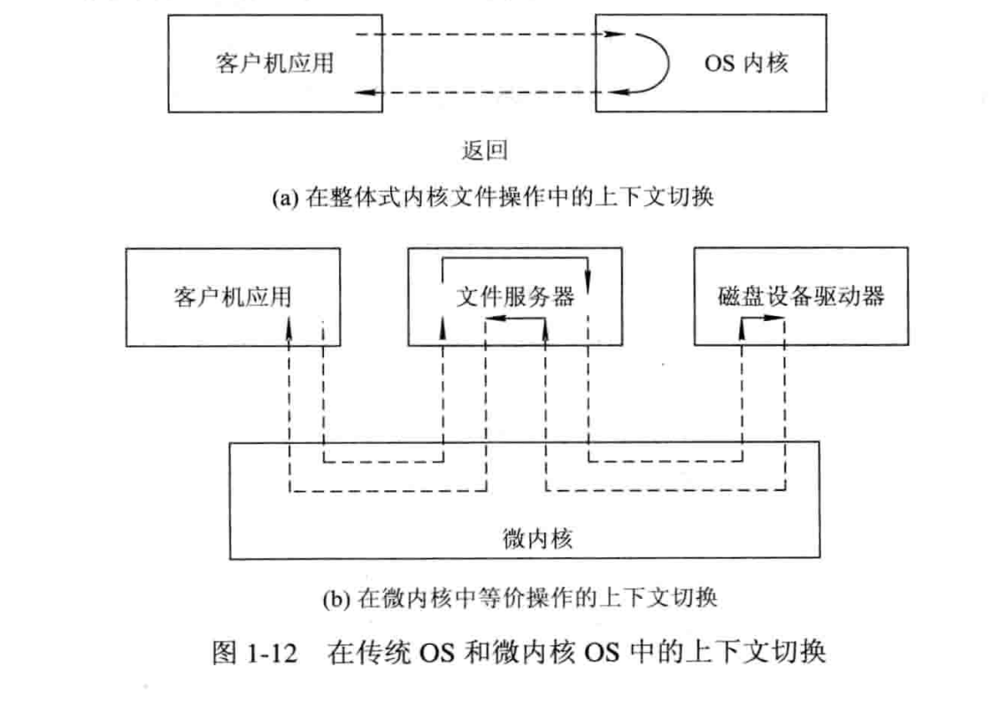

## 计算机操作系统 (第四版) - 汤小丹

## 

多道程序系统 , 多处理机

## 第一章 操作系统引论

### 操作系统的目标和功能

目标
方便性
有效性
		提高系统资源利用率
		提高系统吞吐量
可扩充性
开放性
作用
		OS作为用户与计算机硬件系统之间的接口
		命令方式
		系统调用方式
		图标–窗口方式
		OS实现了对计算机资源的抽象

一个未配置OS的计算机系统是极难使用的,如果用户想直接在计算机(裸机)上运行自己所编写的程序,就必须用机器语言书写程序.

### 操作系统的发展过程

未配置操作系统的计算机系统

人工操作方式

​		用户独占全机 CPU等待人工操作 严重降低了计算机资源的利用率

脱机输入/输出(Off–Line I/O)方式

​		减少了CPU的空闲时间 提高了I/O速度 效率仍然不理想

单道批处理系统

多道批处理系统
		1.资源利用率高
		2.系统吞吐量大
		3.平均周转时间长
		4.无交互能力
		(宏观并行，微观串行)

分时系统
		1.多路性
		2.独立性
		3.及时性
		4.交互性

实时系统

集群系统–超算~云计算

微机操作系统的发展

微软 DOS windows 

IBM UNIX 

类UNIX系统: Solaris OS ,Linux OS

### 操作系统的基本特征

#### 并发concurrence

​	区别并行和并发
​			并行性是指两个或多个事件在同一时刻发生→宏观并行，微观并行
​			并发性是指两个或多个事件在同一时间间隔内发生→宏观并行，微观串行

并发是进程宏观一起运行，微观上交替运行，而并行是指同时运行

1.**并行与并发**
		并行性和并发性是既相似又有区别的两个概念。并行性是指两个或多个事件在同一时刻发生。而并发性是指两个或多个事件在同--时间间隔内发生。在多道程序环境下，并发性是指在一段时间内宏观上有多个程序在同时运行，但在单处理机系统中，每一时刻却仅能有一道程序执行，故微观上这些程序只能是分时地交替执行。例如，在1秒钟时间内，0~15 ms 程序 A 运行：15~30ms 程序B运行：30~45ms 程序C运行：45~60 ms 程序D运行，因此可以说，在1秒钟时间间隔内，宏观上有四道程序在同时运行，但微观上，程序A、B、C、D是分时地交替执行的。倘若在计算机系统中有多个处理机，这些可以并发执行的程序便可被分配到多个处理机上，实现并行执行，即利用每个处理机来处理一个可并发执行的程序。这样，多个程序便可同时执行。

2.**引入进程**
		在一个末引入进程的系统中，在属于同一个应用程序的计算程序和 VO 程序之间只能是顺序执行，即只有在计算程序执行告一段落后，才允许 VO 程序执行；反之，在程序执行VO操作时，计算程序也不能执行。但在为计算程序和VO 程序分别建立一个进程(Process)后，这两个进程便可并发执行。若对内存中的多个程序都分别建立一个进程，它们就可以并发执行，这样便能极大地提高系统资源的利用率，增加系统的吞吐量•所谓进程，是指在系统中能独立运行并作为资源分配的基本单位，它是由一组机器指令、数据和堆栈等组成的，是一个能独立运行的活动实体。多个进程之间可以并发执行和交换信息。事实上，进程和并发是现代操作系统中最重要的基本概念，也是操作系统运行的基础.

引入进程
		进程是指在系统中能独立运行并作为资源分配的基本单位，它是由一组机器指令，数据和堆栈等组成的，是一个能独立运行的活动实体

共享sharing
1.互斥共享方式
2.同时访问方式
并发和共享是多用户(多任务)OS的两个最基本的特征。它们又是互为存在的条件

虚拟virtual
		时分复用技术
		空分复用技术

异步asynchronism
		多道程序环境下,系统允许多个进程并发执行. 在单处理机环境下,由于系统中只有一台处理机,因此每次只允许一直进程执行,其余进程只能等待

### 操作系统的主要功能:

#### 1 处理机管理功能

##### 	进程控制

##### 	进程同步

​		进程互斥方式

​		进程同步方式(协同)

##### 	进程通信

##### 	调度

​		作业调度  从后备队列中按照一定的算法选择出若干个作业,分别为他们建立进程.

​		进程调度  从进程的就绪队列中按照约定的算法选出一个进程,将处理机分配给它,并为它设置运行现场.

#### 2 存储器管理功能

##### 	内存分配

​		静态分配

​		动态分配

##### 	内存保护  

​		去报没到程序尽在自己的内存空间内运行,彼此互不干扰

##### 	地址映射

​		为每个程序提供逻辑地址与物理内存地址的映射

##### 	内存扩充

​		为进程扩充内存

#### 3 设备管理功能

##### 	缓冲管理

​		如果在I/O设备和CPU之间映入缓冲,则可以有效地缓和CPU和I/O设备速度不匹配的矛盾,提高CPU的利用率,劲儿提高系统吞吐量

##### 	设备分配

##### 	设备处理

​		设备处理程序又称设备驱动程序

#### 4 文件管理功能

##### 	文件存储空间的管理

##### 	目录管理

##### 	文件的读写管理和保护

#### 5 操作系统与用户之间的接口

##### 	用户接口

##### 	程序接口

#### 6.现代操作系统的新功能

##### 	系统安全

##### 	网络的功能和服务

##### 	支持多媒体

### OS结构设计

#### 传统操作系统结构:

​		无结构操作系统  在早期开发操作系统时,缺乏设计思想,是众多的过程的集合,无结构的

​		模块化OS

​		分层式结构OS

​			将OS系统分为若干层次,每个层次分若干模块,层次之间存在单项依赖关系,即高层仅依赖相邻的低层.

​		客户/服务器模式  Client / Server    CS模式

​		面对对象的程序设计

​			该技术是基于抽象和隐蔽来控制大型软件的复杂度

#### 微内核os结构:

  	为了提高操作系统的“正确性” “灵活性”、“易维护性”和“可扩充性”，在进行现代操作系统结构设计时，即使在单计算机环境下，大多也采用基于客户/服务器模式的微内核结构，将操作系统划分为两大部分：微内核和多个服务器。至于什么是微内核操作系统结构，现在尚无一致公认的定义，但我们可以从下面四个方面对微内核结构的操作系统进行描述。

1足够小的内核
在微内核操作系统中，内核是指精心设计的、能实现现代 OS 最基本核心功能的小型内核，微内核并非是一个完整的OS，而只是将操作系统中最基本的部分放入微内核，通常包含有：① 与硬件处理紧密相关的部分；②些较基本的功能；③ 客户和服务器之间的通信。这些OS 最基本的部分只是为构建通用 OS 提供一个重要基础，这样就可以确保把操作系统内核做得很小。

2）基于客户/服务器模式
由于客户/服务器模式具有非常多的优点，故在单机微内核操作系统中几乎无一例外地都采用客广/服务器模式，将操作系统中最基本的部分放入内核中，而把操作系统的绝大部分功能都放在微内核外面的一组服务器(进程)中实现，如用于提供对进程(线程)进行管理的进程（线程)服务器、提供虚拟存储器管理功能的虚拟存储器服务器、提供 VO 设备管理的 VO 设备管理服务器等，它们都是被作为进程来实现的，运行在用户态，客户与服务器之间是借助微内核提供的消息传递机制来实现信息交互的。图1-11 示出了在单机环境下的客户/服务器模式。

3） 应用“机制与策略分离”原理
在现在操作系统的结构设计中，经常利用“机制与策略分离”的原理来构造 OS 结构。所谓机制，是指实现某一功能的具体执行机构。而策略，则是在机制的基础上借助于某些参数和算法来实现该功能的优化，或达到不同的功能目标。通常，机制处于。个系统的基层，而策略则处于系统的高层。在传统的 ◎S 中，将机制放在OS 的内核的较低层，把策略放在内核的较高层次中。而在微内核操作系统中，通常将机制放在 oS 的微内核中。正因为如此，才有可能将内核做得很小。

4）采用面向对象技术
操作系统是一个极其复杂的大型软件系统，我们不仅可以通过结构设计来分解操作系统的复杂度，还可以基于面向对象技术中的“抽象” 和“隐蔽”原则控制系统的复杂性，再进一步利用“对象”、“封装”和“继承”等概念来确保操作系统的“正确性”、“可靠性”，“易修改性”、“易扩展性” 等，并提高操作系统的设计速度。正因为面向对象技术能带来如此多的好处，故面向对象技术被广泛应用手现代操作系统的设计中。

微内核的基本功能:
微内核应具有哪些功能，或者说哪些功能应放在微内核内，哪些应放在微内核外，目前尚无明确的规定。现在一般都采用 “机制与策略分离”的原理，将机制部分以及与硬件紧密相关的部分放入微内核中。由此可知微内核通常具有如下几方面的功能：

1进程(线程)管理
大多数的微内核OS，对于进程管理功能的实现，都采用“机制与策略分离”的原理，例如，为实现进程(线程)调度功能，须在进程管理中设置一个或多个进程(线程）优先级队列：能将指定优先级进程(线程)从所在队列中取出，并将其投入执行。由于这一部分属于调度功能的机制部分，应将它放入微内核中。布对于用户(进程)如何进行分类，以及其优先级的确认方式或原则，则都是属于策略问题。可将它们放入微内核外的进程(线程)管理服务器中。由于进程(线程)之间的通信功能是微内核 oS 最基本的功能，被频繁使用，因此几乎所有的微内核OS 都是将进程(线程)之间的通信功能放入微内核中。此外，还将进程的切换、线程的调度，以及名处理机之间的同步等功能也放入微内核中。

2）低级存储器管理
通常在微内核中，只配置最基本的低级存储器管理机制，如用于实现将用户空间的逻辑地址变换为内存空间的物理地址的页表机制和地址变换机制，这一部分是依赖于硬件的，因此放入微内核。而实现處拟存储器管理的策略，则包含应采取何种页面置换算法、采用何种分配内存与回收的策略等.

3）中断和陷入

4.微内核操作系统存在的问题
		应当指出，在微内核操作系统中，由于采用了非常小的内核，客户/服务器模式和消息传递机制虽给微内核操作系统带来了许多优点，但由此也使微内核 OS 存在着潜在缺点，其中最主要的是，较之早期的操作系统，微内核操作系统的运行效率有所降低。

​		效率降低最主要的原因是，在完成一次客户对操作系统提出的服务请求时，需要利用消息实现名次交互和进行用户/内核模式与上下文的多次切换。然而，在早期的oS 中，用户进程在请求取得 OS 服务时，一般只需进行两次上下文的切换：一次是在执行系统调用后由用户态转向系统态时；另一次是在系统完成用户请求的服务后，由系统态返回用户态时

​		在微内核 os 中，由于客户和服务器、服务器和服务器之间的通信都需通过微内核致使同样的服务请求至少需要进行四次上下文切换。第一次是发生在客户发送请求消息给内核，以请求取得某服务器特定的服务时：第二次是发生在由内核把客户的请求消息发往服务器时；第三次是当服务器完成客户请求后，把响应消息发送到内核时：第四次是在内核将响应消息发送给客户时。

​		实际情况是往往还会引起更多的上下文切换。例如，当某个服务器自身尚无能力完成客户请求而需要其它服务器的帮助时，如图1-12所示，其中的文件服务器还需要磁盘服务器的帮助，这时就需要进行8次上下文的切换。

​	 为了改善运行效率，可以重新把一些常用的操作系统基本功能由服务器移入微内核中。这样可使客户对常用操作系统功能的请求所发生的用户/内核模式和上下文的切换的次数由四次或八次降为两次。但这又会使微内核的容量明显地增大，在小型接口定义和适应性方面的优点也有所下降，并提高了微内核的设计代价。

## 第二章 进程的描述与控制

​		在传统的操作系统中，为了提高资源利用率和系统吞吐量，通常采用多道程序技术，将多个程序同时装入内存，并使之并发运行，传统意义上的程序不再能独立运行。此时，作为资源分配和独立运行的基本单位都是进程。操作系统所具有的四大特征也都是基于进程而形成的，并从进程的角度对操作系统进行研究。可见，在操作系统中，进程是一个极其重要的概念。因此，本章专门对进程进行详细阐述

​		在早期未配置 OS 的系统和单道批处理系统中，程序的执行方式是顺序执行，即在内存中仅装入一道用户程序，由它独占系统中的所有资源，只有在一个用户程序执行完成后，才允许装入另一个程序并执行。可见，这种方式浪费资源、系统运行效率低等缺点。而在多道程序系统中，由于内存中可以同时装入多个程序，使它们共享系统资源，并发执行，显然可以克服上述缺点。程序的这两种执行方式间有着显著的不同，尤其是考虑到程序并发执行时的特征，才导致了在操作系统中引入进程的概念。因此，这里有必要先对程序的顺序和并发执行方式做简单的描述。

### 程序并发执行

程序的并发执行

程序并发执行时的特征
	间断性
	失去封闭性
	不可再现性

### 进程的描述

进程的定义

- 进程是程序的一次执行
- 进程是一个程序及其数据在处理机上顺序执行时所发生的活动
- 进程是具有独立功能的程序在一个数据集合上运行的过程，它是系统进行资源分配和调度的一个独立单位

进程的特征

- 动态性
- 并发性
- 独立性
- 异步性

从操作系统角度分类

- 系统进程
- 用户进程

进程和程序的区别

- 进程是动态概念，而程序则是静态概念
- 程序是指令的有序集合，永远存在；进程强调是程序在数据集上的一次执行，有创建有撤销，存在是暂时的；
- 进程具有并发性，而程序没有
- 进程可创建其他进程，而程序并不能形成新的程序
- 进程是竞争计算机资源的基本单位，程序不是

进程和程序的联系

- 进程是程序在数据集上的一次执行

- 程序是构成进程的组成部分，一个程序可对应多个进程，一个进程可包括多个程序

- 进程的运行目标是执行所对应的程序

- 从静态看，进程由程序、数据和进程控制块（PCB）组成

  

### 进程的基本状态及转换

进程的三种基本状态

- 就绪状态ready
- 执行状态running
- 阻塞状态block

三种基本状态的转换

创建状态和终止状态

- 五状态进程模型

- 注意 阻塞态->运行态 和 就绪态->阻塞态这二种状态转换不可能发生

挂起操作和进程状态的转换

挂起和阻塞的区别

挂起操作的目的

- 终端用户的需要: 修改、检查进程
- 父进程的需要：修改、协调子进程
- 对换的需要：缓和内存
- 负荷调节的需要：保证实时任务的执行

### 进程管理中的数据结构

进程控制块PCB的作用

- 作为独立运行基本单位的标志
- 能实现间断性运行方式
- 提供进程管理所需要的信息
- 提供进程调度所需要的信息
- 实现与其他进程的同步与通信进程控制块的信息

进程标识符

- 外部标识符PID
- 内部标识符(端口)

处理机状态

- 通用寄存器
- 指令计数器
- 程序状态字PSW
- 用户栈指针

进程调度信息

- 进程状态
- 进程优先级
- 进程调度所需的其他信息
- 事件

进程控制信息

- 程序和数据的地址
- 进程同步和通信机制
- 资源清单
- 链接指针

进程控制块的组织方式

- 线性方式
- 链接方式
- 索引方式

### 进程控制

操作系统内核
	现代操作系统一般将OS 划分为若干层次，再将OS 的不同功能分别设置在不同的层次中。通常将一些与硬件紧密相关的模块(如中断处理程序等)、各种常用设备的驱动程序以及运行频率较高的模块(如时钟管理、进程调度和许多模块所公用的一些基本操作)，都安排在紧靠硬件的软件层次中，将它们常驻内存，即通常被称为的 OS 内核。这种安排方式的目的在于两方面：一是便于对这些软件进行保护，防止遭受其他应用程序的破坏：二是可以提高OS 的运行效率。相对应的是，为了防止 OS 本身及关键数据(如 PCB 等)遭受到应用程序有意或无意的破坏，通常也将处理机的执行状态分成系统态和用户态两种：
① 系统态：又称为管态，也称为内核态。它具有较高的特权，能执行-一切指令，访问所有寄存器和存储区，传统的 OS都在系统态运行。
② 用户态：又称为目态。它是具有较低特权的执行状态，仅能执行规定的指令，访问指定的寄存器和存储区。一般情况下，应用程序只能在用户态运行，不能去执行 OS 指令及访问 OS 区域，这样可以防止应用程序对 OS 的破坏。

两大功能:
**1.支撑功能**
该功能是提供给 OS 其它众多模块所需要的些基本功能，以便支撑这些模块工作。其中三种最基本的支撑功能是：中断处理、时钟管理和原语操作。
	(1）中断处理。中断处理是内核最基本的功能，是整个操作系统赖以活动的基础，OS中许多重要的活动，如各种类型的系统调用、键盘命令的输入、进程调度、设备驱动等，无不依赖于中断。通常，为减少处理机中断的时间，提高程序执行的并发性，内核在对中浙进行“有限处理” 后，便转入相关的进程，由这些进程继续完成后续的处理工作。
 （2） 时钟管理。时钟管理是内核的一项基本功能，在OS 中的许多活动都需要得到它的支撑，如在时间片轮转调度中，每当时间片用完时，便由时钟管理产生一个中断信号，促使调度程序重新进行调度。同样，在实时系统中的截止时间控制、批处理系统中的最长运行时间控制等，也无不依赖于时钟管理功能。
 （3） 原语操作。所谓原语(Primitive)，就是由若千条指令组成的，用于完成一定功能的个过程。它与一般过程的区别在于：它们是“原子操作(Action Operation)”。所谓原子操作是指，一个操作中的所有动作要么全做，要么全不做。换言之，它是一个不可分割的基本单位。因此，原语在执行过程中不允许被中断。原子操作在系统态下执行，常驻内存在内核中可能有许多原语，如用于对链表进行操作的原语、 用于实现进程同步的原语等。

​	进程的管理，由若干原语（primitive）来执行

**2.资源管理功能**
	(1)  进程管理。在进程管理中，或者由于各个功能模块的运行频率较高，如进程的调度与分派、进程的创建与撤消等：或者由于它们为多种功能模块所需要，如用于实现进程同步的原语、常用的进程通信原语等。通常都将它们放在内核中，以提高OS 的性能。
  （2）存储器管理。存储器管理软件的运行频率也比较高，如用于实现将用户空间的逻辑地址变换为内存空间的物理地址的地址转换机构、内存分配与回收的功能模块以及实现内存保护和对换功能的模块等。通常也将它们放在内核中，以保证存储器管理具有较高的运行速度。
	(3）设各管理。由于设各管理与硬件(设备)紧密相关，因此其中很大部分也都设置在内核中。如各类设备的驱动程序、用于缓和 CPU 与VO 速度不匹配矛盾的缓冲管理、用于实现设备分配和设备独立性功能的模块等.

#### 进程的创建

- 进程的层次结构
  - 父进程
  - 子进程
- 引起创建进程的事件
  - 用户登录
  - 作业调度
  - 提供服务
  - 应用请求
- 进程的创建过程
  - 1.申请空白PCB
  - 2.为新进程分配其运行所需的资源
  - 3.初始化进程块PCB
  - 4.如果进程就绪队列能够接纳新进程，便将新进程插入就绪队列
- 进程的终止
  - 引起进程终止的事件
    - 1.正常结束
    - 2.异常结束
    - 3.外界干预
  - 进程的终止过程
    - 1.根据被终止进程的标识符
- 进程的阻塞与唤醒
  - 引起进程阻塞和唤醒的事件
    - 请求系统服务而未满足
    - 启动某种操作而阻塞当前进程
    - 新数据尚未到达
    - 无新工作可做：系统进程
  - 进程阻塞过程(自己阻塞自己)
  - 进程唤醒过程(系统或其他进程唤醒自己)
- 进程的挂起与激活
  - suspend
  - active

- 进程同步
  - 基本概念
    - 两种形式的制约关系
      - 间接相互制约关系
        - 互斥——竞争
      - 直接相互制约关系
        - 同步——协作
    - 临界资源
    - 分区
      - 进入区enter section
      - 临界区critical section
      - 退出区exit section
      - 剩余区remainder section
    - 同步机制应遵循的规则
      - 1.空闲让进
      - 2.忙则等待
      - 3.有限等待
      - 4.让权等待
  - 进程同步机制
    - 软件同步机制:都没有解决让权等待，而且部分方法还会产生死锁的情况
    - 硬件同步机制
      - 关中断
      - 利用Test-and-Set指令实现互斥
      - 利用swap指令实现进程互斥
    - 信号量机制
      - 整型信号量
      - 记录型信号量
        - 由于整型信号量没有遵循让权等待原则，记录型允许负数，即阻塞链表
      - AND型信号量
      - 信号量集
        - 理解:AND型号量的wait和signal仅能对信号施以加1或减1操作，意味着每次只能对某类临界资源进行一个单位的申请或释放。当一次需要N个单位时，便要进行N次wait操作，这显然是低效的，甚至会增加死锁的概率。此外，在有些情况下，为确保系统的安全性，当所申请的资源数量低于某一下限值时，还必须进行管制，不予以分配。因此，当进程申请某类临界资源时，在每次分配前，都必须测试资源数量，判断是否大于可分配的下限值，决定是否予以分配
        - 操作
          - Swait(S1，t1，d1…Sn，tn，dn)
          - Ssignal(S1，d1…Sn，dn)
        - 特殊情况
  - 经典进程的同步问题
    - 生产者–消费者问题
    - 哲学家进餐问题
    - 读者–写者问题

### 进程通信

- 进程通信是指进程之间的信息交换，又称低级进程通信

- 进程通信的类型

  - 共享存储器系统

    基于共享数据结构的通信方式

    ​		生产者和消费者

    基于共享存储区的通信方式

    ​		高级通信

  - 管道通信系统(pipe)  (共享文件)

    高级通信

  - 消息传递系统

    高级通信

    方式分类

    ​		直接通信

    ​		间接通信

  - 客服机–服务器系统

- 消息传递通信的实现方式

  - 直接消息传递系统
  - 信箱通信

### 线程的基本概念

​	在多处理机系统中，对于传统的进程，即单线程进程，不管有多少处理机，该进程只能运行在一个处理机上。但对于多线程进程，就可以将-一个进程中的多个线程分配到多个处理机上，使它们并行执行，这无疑将加速进程的完成。因此，现代多处理机 oS 都无-例外地引入了多线程。

- 线程的引入

  - 线程的引入正是为了简化线程间的通信，以小的开销来提高进程内的并发程度

  - 多线程并发的不足

    - 进程的两个基本属性
      - 一个拥有资源的独立单位，可独立分配系统资源
      - 一个可独立调度和分派的基本单位，PCB
    - 程序并发执行所需付出的时空开销
      - 创建进程
      - 撤销进程
      - 进程切换
    - 进程间通信效率低
    - 将分配资源和调度两个属性分开

  - 线程——作为调度和分派的基本单位

    - 进程是系统资源分配的单位，线程是处理器调度的单位

    - 线程表示进程的一个控制点，可以执行一系列的指令。通常，和应用程序的一个函数相对应

    - 进程分解为线程还可以有效利用多处理器和多核计算机 

      

- 线程与进程的比较

  - 不同点
    - 调度的基本单位
    - 并发性
  - 相似点
    - 状态：运行、阻塞、就绪
    - 线程具有一定的生命期
    - 进程可创建线程，一个线程可创建另一个子线程
    - 多个线程并发执行时仍然存在互斥与同步

- 线程的实现

  - 线程的实现方式
    - 内核支持线程KST
    - 用户级线程ULT
    - 组合方式

多线程OS中的进程属性

通常在多线程oS 中的进程都包含了多个线程，并为它们提供资源。OS 支持在一个进
程中的多个线程能并发执行，但此时的进程就不再作为一个执行的实体。多线程 OS 中的
进程有以下属性：
	(1) 进程是一个可拥有资源的基本单位。在多线程 oS 中，进程仍是作为系统资源分配的基本单位，任一进程所拥有的资源都包括：用户的地址空间、实现进程(线程)间同步和通信的机制、己打开的文件和己申请到的 VO 设备，以及一张由核心进程维护的地址映射表，该表用手实现用户程序的逻辑地址到其内存物理地址的映射。
（2）多个线程可并发执行。通常一个进程都含有若干个相对独立的线程，其数目可多可少，但至少要有一个线程。由进程为这些(个)线程提供资源及运行环境，使它们能并发执行。在os 中的所有线程都只能属于某一个特定进程。实际上，现在把传统进程的执行方法称为单线程方法。如传统的 UNIX 系统能支持多用户进程，但只支持单线程方法。反之，将每个进程支持多个线程执行的方法称为多线程方法。**如Java 的运行环境是单进程多线程的， Windows 2000、Solaris、Mach 等采用的则是多进程多线程的方法。**
	(3）**进程己不是可执行的实体。在多线程OS 中，是把线程作为独立运行(或称调度)的基本单位**。此时的进程己不再是一个基本的可执行实体。虽然如此，进程仍具有与执行相关的状态。例如，所谓进程处于 “执行”状态，实际上是指该进程中的某线程正在执行。此外，对进程所施加的与进程状态有关的操作也对其线程起作用。例如，在把某个进程挂起时，该进程中的所有线程也都将被挂起：又如，在把某进程激活时，属于该进程的所有线程也都将被激活。

- 线程的状态和线程控制块
  - 线程运行的三个状态
    - 执行状态
    - 就绪状态
    - 阻塞状态
  - 线程控制块TCB

## 第三章 处理机调度与死锁

### 处理机调度算法的目标

1. 处理机调度算法的共同目标

   1. 资源利用率:CPU的利用率=CPU有效工作时间/(CPU有效工作时间+CPU空闲等待时间)
   2. 公平性
   3. 平衡性
   4. 策略强制执行

2. 批处理系统的目标

   1. 平均周转时间短
   2. 系统吞吐量高
   3. 处理机利用率高

3. 分时系统的目标

   - 响应时间快
   - 均衡性

4. 实时系统目标

   - 截止时间的保证
   - 可预测性

5. 处理机调度的层次

   - 高级调度（作业调度）

     - 分时系统无需作业调度，因为需要交互
     - 批处理系统需要作业调度

   - 中级调度（和挂起有关）

   - 低级调度（进程调度）

     - 进程调度是最基本的调度，任何操作系统都有进程调度。

     - 低级调度的三个基本机制

       - 排队器

       - 分派器

       - 上下文切换

         ​		上下文切换器。在对处理机进行切换时，会发生两对上下文的切换操作：①第-对上下文切换时，OS 将保存当前进程的上下文，即把当前进程的处理机寄存器内容保存到该进程的进程控制块内的相应单元，再装入分派程序的上下文，以便分派程序运行：②第二对上下文切换是移出分派程序的上下文，而把新选进程的 CPU 现场信息装入到处理机的各个相应寄存器中，以便新选进程运行。

         ​		在进行上下文切换时，需要执行大量的 load 和store 等操作指令，以保存寄存器的内容。即使是现代计算机，每一次上下文切换所花费的时间大约可执行上千条指令。为此，现在已有靠硬件实现的方法来减少上下文切换时问。一般采用两组(或多组)寄存器，其中的一组寄存器任外理机在系统杰时伟用，而另一组寄在聚任应用程序佳用，在这样冬件下的上下文切换，只需改变指针，使其指向当前寄存器组即可。

   进程调度方式

   - 非抢占方式

   - 抢占方式

     ​		在现代 OS 中广泛采用抢占方式，这是因为：对于批处理机系统，可以防止一个长进程长时间地占用处理机，以确保处理机能为所有进程提供更为公平的服务。在分时系统中，只有采用抢占方式才有可能实现人一机交互。

     ​	①优先权原则，指允许优先级高的新到进程抢占当前进程的处理机，即当有新进程到达时，如果它的优先级比正在执行进程的优先级高，则调度程序将剥夺当前进程的运行，将处理机分配给新到的优先权高的进程。
     ​	② 短进程优先原则，指允许新到的短进程可以抢占当前长进程的处理机，即当新到达的进程比正在执行的进程(尚须运行的时间)明显短时，将处理机分配给新到的短进程。
     ​	③ 时间片原则，即各进程按时间片轮转运行时，当正在执行的进程的一个时间片用完后，便停止该进程的执行而重新进行调度

   - 进程调度的任务

     - 保存处理机的现场信息
     - 按某种算法选取进程
     - 把处理器分配给进程

   - 进程调度的算法

     - 优先级调度算法
       - 优先级调度算法的类型
         - 非抢占式优先级调度算法
           - 等当前进程执行完以后，再执行另一个优先权最高的进程
           - 这种调度算法主要用于批处理系统中；也可用于某些对实时性要求不严的实时系统中。
         - 抢占式优先级调度算法
           - 不等当前进程结束，直接抢处理机
           - 常用于要求比较严格的实时系统中， 以及对性能要求较高的批处理和分时系统中。
       - 优先级的类型
         - 静态优先级
           - 优先权是在创建进程时确定的，且在进程的整个运行期间保持不变。一般地，优先权是利用某一范围内的一个整数来表示的，例如，07或0255中的某一整数， 又把该整数称为优先数。
           - 可以参考BIOS系统中设置boot的优先级
         - 动态优先级
           - 在创建进程时所赋予的优先权，是可以随进程的推进或随其等待时间的增加而改变的，以便获得更好的调度性能。
     - 轮转调度算法
       - 基本原理:在轮转(RR)法中，系统根据FCFS策略，将所有的就绪进程排成一个就绪队列，并可设置每隔一定时间间隔(如30ms)即产生一次中断，激活系统中的进程调度程序，完成一次调度，将CPU分配给队首进程，令其执行
       - 进程切换时机
         - 时间片未用完，进程完成
         - 时间片到，进程未完成
       - 时间片大小的确定
         - 太小利于短作业，增加系统切换开销
         - 太长就退化为FCFS算法
         - 一般选择: q略大于一次交互所需要的时间，使大多数进程在一个时间片内完成
       - 一般来说，平均周转时间将比SJF长，但是有较好的响应时间
     - 多队列调度算法
     - 多级反馈队列调度算法
       - 调度机制
         - 设置多个就绪队列
         - 每个队列都采用FCFS算法
         - 按照队列优先级调度，在第n队列中采取按时间片轮转的方式运行
       - 调度算法的性能
         - 对于终端型用户，由于作业小，感觉满意
         - 对于短批处理作业用户，周转时间也较小
         - 长批处理作业用户，也能够得到执行
     - 基于公平原则的调度算法
       - 保证调度算法
       - 公平分享调度算法

### 作业与作业调度

作业

- 作业不仅包含程序和数据，还配有一份作业说明书，系统根据说明书对程序的运行进行控制。批处理系统是以作业为单位从外存掉入内存的。

作业控制块JCB

- 为每个作业设置一个JCB，保存了对作业管理调度的全部信息。是作业存在的标志。

作业步

- 作业步，每个作业都必须经过若干相对独立，有相互关联的顺序步骤才能得到结果。每一个步骤就是一个作业步。

作业运行的三个阶段

- 收容阶段
- 运行阶段
- 完成阶段

作业运行的三个状态

- 后备状态
- 运行状态
- 完成状态

作业调度的主要任务

- 接纳多少个作业
- 接纳哪些作业

先来先服务(first–come first–served，FCFS)调度算法

- 比较有利于长作业，而不利于短作业。
- 有利于CPU繁忙的作业，而不利于I/O繁忙的作业。

短作业优先(short job first，SJF)的调度算法

- 优点
  - 比FCFS改善平均周转时间和平均带权周转时间，缩短作业的等待时间；
  - 提高系统的吞吐量；
- 缺点
  - 必须预知作业的运行时间
  - 对长作业非常不利，长作业的周转时间会明显地增长
  - 在采用SJF算法时，人–机无法实现交互
  - 该调度算法完全未考虑作业的紧迫程度，故不能保证紧迫性作业能得到及时处理

优先级调度算法(priority–scheduling algorithm，PSA)

高响应比优先调度算法(Highest Response Ratio Next,HRRN)

- 原理
  - 在每次选择作业投入运行时，先计算此时后备作业队列中每个作业的响应比RP然后选择其值最大的作业投入运行
  - 优先权=(等待时间+要求服务时间)/要求服务时间=响应时间/要求服务时间=1+等待时间/要求服务时间
- 特点
  - 如果作业的等待时间相同，则要求服务的时间愈短，其优先权愈高，因而类似于SJF算法，有利于短作业
  - 当要求服务的时间相同时，作业的优先权又决定于其等待时间，因而该算法又类似于FCFS算法
  - 对于长时间的优先级，可以为随等待时间的增加而提高，当等待时间足够长时，也可获得处理机

### 实时调度(HRT和SRT任务)

实现实时调度的基本条件 

- 提供必要信息
  - 就绪时间
  - 开始截止时间和完成截止时间
  - 处理时间
  - 资源要求
  - 优先级
- 系统处理能力强
  - ∑(Ci/Pi)≤1
  - N个处理机:∑(Ci/Pi)≤N
- 采用抢占式调度机制
- 具有快速切换机制
  - 对中断的快速响应能力
  - 快速的任务分派能力

实时调度算法的分类

- 非抢占式调度算法
  - 非抢占式轮转调度算法
  - 非抢占式优先调度算法
- 抢占式调度算法
  - 基于时钟中断的抢占式优先级调度算法
  - 立即抢占的优先级调度算法

最早截止时间优先EDF(Earliest Deadline First)算法

- 根据任务的开始截至时间来确定任务的优先级
  - 截至时间越早，优先级越高
- 非抢占式调度方式用于非周期实时任务
- 抢占式调度方式用于周期实时任务

最低松弛度优先LLF(Least Laxity First)算法

- 类似EDF
- 算法根据任务紧急(或松弛)的程度，来确定任务的优先级。任务的紧急程度愈高，为该任务所赋予的优先级就愈高， 以使之优先执行。
- 松弛度例子
  - 例如，一个任务在200ms时必须完成，而它本身所需的运行时间就有100ms，因此，调度程序必须在100 ms之前调度执行，该任务的紧急程度(松弛程度)为100 ms

优先级倒置(Priority inversion problem)

- 优先级倒置的形成
  - 高优先级进程被低优先级进程延迟或阻塞。
- 优先级倒置的解决方法
  - 简单的:假如进程P3在进入临界区后P3所占用的处理机就不允许被抢占
  - 实用的:建立在动态优先级继承基础上的

### 死锁概述

死锁的起因，通常是源于多个进程对资源的争夺，不仅对不可抢占资源进行争夺时会引起死锁，而且对可消耗资源进行争夺时，也会引起死锁。
1. 竞争不可抢占性资源引起死锁
通常系统中所拥有的不可抢占性资源其数量不足以满足多个进程运行的需要，使得进程在运行过程中，会因争布资源而陷入僵局。例如，系统中有两个进程P1和P2，它们都准备写两个文件 F1和F2，而这两者都属于可重用和不可抢占性资源。进程P1先打开F1然后再打开文件F2,进程P2先打开文件 F2,互相等待对方释放资源,而形成死锁。

- 资源问题

  - 可重用性资源
    - 计算机外设
  - 消耗性资源
    - 数据，消息
  - 可抢占性资源
    - 不引起死锁
    - CPU，内存
  - 不可抢占性资源
    - 光驱，打印机

- 计算机系统中的死锁

  - 竞争不可抢占性资源引起死锁
  - 竞争可消耗资源引起死锁
  - **进程推进顺序不当引起死锁**

- 死锁的定义，必要条件和处理方法

  定义:如果一组进程中的每一个进程都在等待仅由该进程中的其他进程才能引发的事件，那么该组进程是死锁的

  **产生死锁的必要条件 , 只要其中任一个条件不成立,死锁就不会发生:**

  - 互斥条件 (资源是互斥的)
  - 请求和保存条件 ((进程已经保持了至少一个资源,但又体处理新的资源请求,而该资源已被其他进程占有,此时请求进程被阻塞,但对自己已获得的资源保持不放))
  - 不可抢占条件 (资源在未使用完之前不能被抢占)
  - 循环等待条件
    - 如果每个资源只有一个实例，则环路等待条件是死锁存在的充分必要条件

  处理死锁的方法

  预防死锁

  - 静态方法，在进程执行前采取的措施，通过设置某些限制条件，去破坏产生死锁的四个条件之一，防止发生死锁。
  - 预防死锁的策略
    - 破坏"请求和保存"条件
      - 第一种协议
        - 所有进程在开始运行之前，必须一次性地申请其在整个运行过程中所需的全部资源
        - 优点:简单，易行，安全
        - 缺点
          - 资源被严重浪费，严重地恶化了资源的利用率
          - 使进程经常会发生饥饿现象
      - 第二种协议
        - 它允许一个进程只获得运行初期所需的资源后，便开始运行。进程运行过程中再逐步释放已分配给自己的，且已用毕的全部资源，然后再请求新的所需资源
    - 破坏"不可抢占"条件
      - 当一个已经保存了某些不可被抢占资源的进程，提出新的资源请求而不能得到满足时，它必须释放已经保持的所有资源，待以后需要时再重新申请
    - 破坏"循环等待"条件
      - 对系统所以资源类型进行线性排序，并赋予不同的序号
      - 例如令输入机的序号为1，打印机序号为2，磁盘机序号为3等。所有进程对资源的请求必须严格按资源序号递增的次序提出。

  避免死锁

  动态的方法，在进程执行过程中采取的措施，不需事先采取限制措施破坏产生死锁的必要条件，而是在进程申请资源时用某种方法去防止系统进入不安全状态，从而避免发生死锁。如银行家算法

  - 避免死锁的策略

    - 系统安全状态

      - 安全状态
        - 某时刻，对于并发执行的n个进程，若系统能够按照某种顺序如<p1,p2…pn>来为每个进程分配所需资源，直至最大需求，从而使每个进程都可顺利完成，则认为该时刻系统处于安全状态，这样的序列为安全序列
      - 安全状态之例
      - 由安全状态向不安全状态的转换

    - 利用银行家算法避免死锁

      含义:每一个新进程在进入系统时，它必须申明在运行过程中，可能需要每种资源类型的最大单元数目，其数目不应超过系统所拥有的资源总量。当进程请求一组资源时，系统必须首先确定是否有足够的资源分配给该进程。若有，再进一步计算在将这些资源分配给进程后，是否会使系统处于不安全状态。如果不会，才将资源分配给它，否则让进程等待

      - 银行家算法中的数据结构
        - 可用资源向量 Available[m]：m为系统中资源种类数，Available[j]=k表示系统中第j类资源数为k个。
        - 最大需求矩阵 Max[n,m]：n为系统中进程数，Max[i,j]=k表示进程i对j类资源的最大需求数为中k。
        - 分配矩阵 Allocation[n，m]:它定义了系统中每一类资源当前已分配给每一进程资源数， Allocation[i,j] = k表示进程i已分得j类资源的数目为k个。
        - 需求矩阵 Need[n,m]：它表示每个进程尚需的各类资源数，Need[i,j]=k 表示进程i 还需要j类资源k个。Need[i,j]=Max[i,j] - Allocation[i,j]
      - 银行家算法
      - 安全性算法
      - 银行家算法之例
      - 解题
        - 矩阵
        - 列表

  检测死锁

  - 死锁的检测与解除
    - 死锁的检测
      - 资源分配图
        - 简化步骤
          - 选择一个没有阻塞的进程p
          - 将p移走，包括它的所有请求边和分配边
          - 重复步骤1，2，直至不能继续下去
      - 死锁定理
        - 若一系列简化以后不能使所有的进程节点都成为孤立节点
      - 检测时机
        - 当进程等待时检测死锁 （其缺点是系统的开销大）
        - 定时检测
        - 系统资源利用率下降时检测死锁
      - 死锁检测中的数据结构
    - 死锁的解除
      - 抢占资源
      - 终止(或撤销)进程
      - 终止进程的方法
        - 终止所有死锁进程
        - 逐个终止进程
          - 代价最小
            - 进程的优先级的大小
            - 进程已执行了多少时间，还需时间
            - 进程在运行中已经使用资源的多少，还需多少资源
            - 进程的性质是交互式还是批处理的
      - 付出代价最小的死锁解除算法
        - 是使用一个有效的挂起和解除机构来挂起一些死锁的进程

  - 解除死锁

## 第四章 存储器管理

### 存储器的层次结构

多层结构的存储系统

- 存储器的多层结构

  - CPU寄存器
  - 主存
  - 辅存

  可执行存储器

  - 寄存器和主存的总称
  - 访问速度快，进程可以在很少的时钟周期内用一条load或store指令完成存取。

主存储器与寄存器

高速缓存和磁盘缓存

​	由于当前磁盘的I/O速度远低于对驻村的访问速度,为了缓和两者之间在速度上的不匹配,而设置了磁盘缓存

### 程序的装入和链接

步骤

- 编译
  - 源程序 ->目标模块（Object modules）--------Compiler
    - 由编译程序对用户源程序进行编译，形成若干个目标模块
- 链接
  - 一组目标模块 ->装入模块 （Load Module）----------Linker
    - 由链接程序将编译后形成的一组目标模板以及它们所需要的库函数链接在一起，形成一个完整的装入模块
- 装入
  - 装入模块 ->内存 --------Loader
    - 由装入程序将装入模块装入内存

程序的装入

- 绝对装入方式
  - 在编译时，如果知道程序将驻留在内存中指定的位置。编译程序将产生绝对地址的目标代码。
- 可重定位装入方式
  - 在可执行文件中，列出各个需要重定位的地址单元和相对地址值。当用户程序被装入内存时，一次性实现逻辑地址到物理地址的转换，以后不再转换(一般在装入内存时由软件完成)。
  - 优点：不需硬件支持，可以装入有限多道程序。
  - 缺点：一个程序通常需要占用连续的内存空间，程序装入内存后不能移动。不易实现共享。
- 动态运行时的装入方式
  - 动态运行时的装入程序在把装入模块装入内存后，并不立即把装入模块中的逻辑地址转换为物理地址，而是把这种地址转换推迟到程序真正要执行时才进行
  - 优点：
    - OS可以将一个程序分散存放于不连续的内存空间，可以移动程序，有利用实现共享。
    - 能够支持程序执行中产生的地址引用，如指针变量（而不仅是生成可执行文件时的地址引用）。
  - 缺点：需要硬件支持，OS实现较复杂。
  - 它是虚拟存储的基础。

程序的链接

- 静态链接方式(lib)
- 装入时动态链接
- 运行时动态链接(dll)

### 连续分配存储管理方式

连续分配

- 单一连续分配(DOS)
- 固定分区分配(浪费很多空间)
- 动态分区分配

地址映射和存储保护措施

- 基址寄存器：程序的最小物理地址
- 界限寄存器：程序的逻辑地址范围
- 物理地址 = 逻辑地址 + 基址

内碎片：占用分区之内未被利用的空间

外碎片：占用分区之间难以利用的空闲分区（通常是小空闲分区）

把内存划分为若干个固定大小的连续分区。固定式分区又称为静态分区。

- 分区大小相等：只适合于多个相同程序的并发执行（处理多个类型相同的对象）。
- 分区大小不等：多个小分区、适量的中等分区、少量的大分区。根据程序的大小，分配当前空闲的、适当大小的分区。
- 优点：无外碎片、易实现、开销小。
- 缺点：
  - 存在内碎片，造成浪费
  - 分区总数固定，限制了并发执行的程序数目。
  - 通用Os很少采用，部分控制系统中采用

动态创建分区：指在作业装入内存时，从可用的内存中划出一块连续的区域分配给它，且分区大小正好等于该作业的大小。可变式分区中分区的大小和分区的个数都是可变的，而且是根据作业的大小和多少动态地划分。

- 基于顺序搜索的动态分区分配算法
  - 首次适应算法（first fit,FF）
    - 顺序找，找到一个满足的就分配，但是可能存在浪费
    - 这种方法目的在于减少查找时间。
    - 空闲分区表（空闲区链）中的空闲分区要按地址由低到高进行排序
  - 循环首次适应算法（next fit，NF）
    - 相对上面那种，不是顺序，类似哈希算法中左右交叉排序
    - 空闲分区分布得更均匀，查找开销小
    - 从上次找到的空闲区的下一个空闲区开始查找，直到找到第一个能满足要求的的空闲区为止，并从中划出一块与请求大小相等的内存空间分配给作业。
  - 最佳适应算法（best fit，BF）
    - 找到最合适的，但是大区域的访问次数减少
    - 这种方法能使外碎片尽量小。
    - 空闲分区表（空闲区链）中的空闲分区要按大小从小到大进行排序，自表头开始查找到第一个满足要求的自由分区分配。
  - 最坏适应算法（worst fit，WF）
    - 相对于最好而言，找最大的区域下手，导致最大的区域可能很少，也造成许多碎片
    - 空闲分区按大小由大到小排序
- 基于索引搜索的动态分区分配算法
  - 快速适应算法（quick fit）
  - 伙伴系统（buddy system）
  - 哈希算法
- 动态可重定位分区分配
  - 紧凑
  - 动态重定位
    - 动态运行时装入，地址转化在指令执行时进行，需获得硬件地址变换机制的支持
    - 内存地址=相对地址+起始地址
  - 动态重定位分区分配算法
    - 1、在某个分区被释放后立即进行紧凑，系统总是只有一个连续的分区而无碎片，此法很花费机时。
    - 2、当“请求分配模块”找不到足够大的自由分区分给用户时再进行紧凑，这样紧缩的次数比上种方法少得多，但管理复杂。采用此法的动态重定位分区分配算法框图如下：
- 优点：没有内碎片。
- 缺点：外碎片。

### 对换（了解）

系统把所有的作业放在外存，每次只调用一个作业进入内存运行，当时间片用完时，将它调至外存后备队列上等待，在从后备队列调入另一个作业进入内存运行。

### 基本分页存储管理方式

分页存储管理的基本方式

页面    将一个进程的逻辑地址空间分成若干个大小相等的片

页框（frame） 内存空间分成与页面相同大小的存储块

由于进程的最后一页经常装不满一块而形成了不可利用的碎片，称之为“页内碎片”

地址结构   页号P+位移量W(0-31)

页表

- 在分页系统中，允许将进程的各个页离散地存储在内存在内存的任一物理块中，为保证进程仍然能够正确地运行，即能在内存中找到每一个页面所对应的物理块，系统又为每个进程建立了一张页面映像表，简称页表
- 页表的作用是实现从页面号到物理块号的地址映射

页号必须连续,否则CPU会多次访问页表并对比逻辑页号地址

地址变换机构

基本的地址变换机构

- 要访问两次内存
- 页表大都驻留在内存中
- 为了实现地址变换功能，在系统中设置页表寄存器（PTR），用来存放页表的始址和页表的长度。
- 在进程未执行时，每个进程对应的页表的始址和长度存放在进程的PCB中，当该进程被调度时，就将它们装入页表寄存器。

具有快表的地址变换机构

**快表** 实质上是在CPU寄存器中缓存了最近常使用的逻辑内存地址和内存物理地址的映射

- 提高了效率，此处会有计算题
- 如果页表存放在内存中，则每次访问内存时，都要先访问内存中的页表，然后根据所形成的物理地址再访问内存。这样CPU存一个数据必须访问两次内存，从而使计算机的处理速度降低了1/2。
- 为了提高地址变换的速度，在地址变换机构中增设了一个具有并行查询功能的特殊的高速缓冲存储器，称为“联想存储器”或“快表”，用以存放当前访问的那些页表项。
- 地址变换过程为：
  - 1、CPU给出有效地址
  - 2、地址变换机构自动地将页号送入高速缓存，确定所需要的页是否在快表中。
  - 3、若是，则直接读出该页所对应的物理块号，送入物理地址寄存器；
  - 4、若快表中未找到对应的页表项，则需再访问内存中的页表
  - 5、找到后，把从页表中读出的页表项存入快表中的一个寄存器单元中，以取代一个旧的页表项。

两级和多级页表

- 主要是有的时候页表太多了，要化简
- 格式：外层页号P1+外层页内地址P2+页内地址d
- 基本方法：将页表进行分页，每个页面的大小与内存物理块的大小相同，并为它们进行编号，可以离散地将各个页面分别存放在不同的物理块中。

反置页表

- 反置页表为每一个物理块（页框）设置一个页表项，并按物理块排序，其内容则是页号和其所属进程的标识。

优点：

- 没有外碎片，每个内碎片不超过页大小。
- 一个程序不必连续存放。
- 便于改变程序占用空间的大小。即随着程序运行而动态生成的数据增多，地址空间可相应增长。

缺点：程序全部装入内存。

### 分段存储管理方式

引入

​		方便编程

​		信息共享

​		动态增长

​		动态链接

​		在分段存储管理方式中，作业的地址空间被划分为若干个段，每个段是一组完整的逻辑信息，每个段都有自己的名字，都是从零开始编址的一段连续的地址空间，各段长度是不等的。

内存空间被动态的划分为若干个长度不相同的区域，称为物理段，每个物理段由起始地址和长度确定

分段系统的基本原理

​		分段
​				格式：段号+段内地址

​		段表
​				段表实现了从逻辑段到物理内存区的映射。

​		地址变换机构

和分页的区别

​		页是信息的物理单位

​		页的大小固定且由系统固定

​		分页的用户程序地址空间是一维的

​		通常段比页大，因而段表比页表短，可以缩短查找时间，提高访问速度。

​		分页是系统管理的需要，分段是用户应用的需要。一条指令或一个操作数可能会跨越两个页的分界处，而不会跨越两个段的分界处。

信息共享

​		这是分段最重要的优点

### 段页式存储管理方式

​		现将用户程序分成若干个段,再把每个段分成若干个页.

基本原理

​		格式：段号（S）+段内页号（P）+页内地址（W）

地址变换过程

​		需要三次访问过程

在段页式系统中，为了获得一条指令或数据，需三次访问内存：第一次访问内存中的段表，从中取得页表始址；第二次访问内存中的页表，从中取出该页所在的物理块号，并将该块号与页内地址一起形成指令或数据的物理地址；第三次访问才是真正根据所得的物理地址取出指令或数据。

​	

## 第五章 虚拟存储器

程序逻辑地址直接分段映射到虚拟内存, 然后由虚拟内存分页后映射到物理内存

### 常规存储管理方式的特征

一次性

驻留性

### 局部性原理

​	程序在执行时将呈现出局部性特征，即在一较短的时间内，程序的执行仅局限于某个部分，相应地，它所访问的存储空间也局限于某个区域

**时间局限性**

​		如果程序中的某条指令一旦执行， 则不久以后该指令可能再次执行；如果某数据被访问过， 则不久以后该数据可能再次被访问。产生时间局限性的典型原因，是由于在程序中存在着大量的循环操作

**空间局限性**

​		一旦程序访问了某个存储单元，在不久之后，其附近的存储单元也将被访问，即程序在一段时间内所访问的地址，可能集中在一定的范围之内，其典型情况便是程序的顺序执行。

### 定义

​	指具有请求调入功能和置换功能，能从逻辑上对内存容量加以扩充的一种存储器系统

### 优点

大程序：可在较小的可用内存中执行较大的用户程序；

大的用户空间：提供给用户可用的虚拟内存空间通常大于物理内存(real memory)

并发：可在内存中容纳更多程序并发执行；

易于开发：不必影响编程时的程序结构

以CPU时间和外存空间换取昂贵内存空间，这是操作系统中的资源转换技术

### 特征

离散性

​		指在内存分配时采用离散的分配方式，它是虚拟存储器的实现的基础

多次性

​		指一个作业被分成多次调入内存运行，即在作业运行时没有必要将其全部装入，只须将当前要运行的那部分程序和数据装入内存即可。多次性是虚拟存储器最重要的特征

对换性

​		指允许在作业的运行过程中在内存和外存的对换区之间换进、换出。

虚拟性

​		指能够从逻辑上扩充内存容量，使用户所看到的内存容量远大于实际内存容量。

### 虚拟存储器的实现方式

请求分页存储管理方式

​	硬件

​									

​	请求页表机制

​			格式：页号+物理块号+状态位P+访问字段A+修改位M+外存地址

​	缺页中断机构

​	地址变换机构（过程图很关键）

请求分页中的内存分配

​	最小物理块数

​			即能保证进程正常运行所需的最小物理块数

​	内存分配策略

​			固定分配局部置换（国王的大儿子） 固定数量的物理块

​			可变分配全局置换（国王的二儿子） 固定数量的物理块 + 申请新的物理块

​			可变分配局部置换（国王的小儿子） 固定数量的物理块 + 申请新的物理块 (根据情况由算法决定)

物理块分配算法

​		平均分配算法

​		按比例分配算法

​		考虑优先权的分配算法

页面调入策略

​		系统应在何时调入所需页面

​		预调页策略（不能实现）

​		请求调页策略（需要才给）

系统应该从何处调入这些页面

​		对换区

​		文件区

页面调入过程

​		每当程序所要访问的页面未在内存时(存在位为“0”），便向 CPU 发出一缺页中断，中断处理程序首先保留 CPU 环境，分析中析原因后转入缺页中断处理程序。该程序通过查找页表得到该页在外存的物理块后，如果此时内存能容纳新页，则启动磁盘 IO，将所缺之页调入内存，然后修改页表。如果内存已满，则须先按照某种置换算法，从内存中选出一页准备换出：如果该页未被修改过(修改位为“0”），可不必将该页写回磁盘；但如果此页已被修改(修改位为“1”），则必须将它写回磁盘，然后再把所缺的页调入内存，并修改页表中的相应表项，置其存在位为“1”，并将此页表项写入快表中。在缺页调入内存后，利用修改后的页表形成所要访问数据的物理地址，再去访问内存数据。掐个页面的调入过程对用户是透明的。

缺页率（出计算题）

​		假设一个进程的逻辑空间为n页，系统为其分配的内存物理块数为 m(m≤n）。如果在进程的运行过程中，访问页面成功(即所访问页面在内存中)的次数为 S，访问页面失败(即所访问页面不在内存中，需要从外存调入)的次数为F，则该进程总的页面访问次数为A=S+F，那么该进程在其运行过程中的**缺页率**即为 :
 f = F / A
通常，缺页率受到以下几个因素的影响：
(1)  页面大小。页面划分较大，则缺页率较低；反之，缺页率较高。
(2）进程所分配物理块的数目。所分配的物理块数目越多，缺页率越低；反之则越高。
(3）页面置换算法。算法的优劣决定了进程执行过程中缺页中桥的次数，因此缺页率是衡量页面置换算法的重要指标。
(4）程序固有特性。程序本身的编制方法对缺页中断次数有影响，根据程序执行的局部性原理，程序编制的局部化程度越高，相应执行时的缺页程度越低。事实上，在缺页中断处理时，当由手空间不足，需要置换部分页面到外存时，选择被置换页面还需要考虑到置换的代价，如页面是否被修改过。没有修改过的页面可以直接放弃，而修改过的页面则必须进行保存，所以处理这两种情况时的时间也是不同的。

### 页面置换算法

抖动的概念

​		即刚被换出的页很快又要被访问，需要将它重新调入，此时又需要再选一页调出

最佳置换算法(需要预知后面进程，所以不能实现)

先进先出页面置换算法（FIFO）

​		选择在内存中驻留时间最久的页面予以淘汰

最近最久未使用置换算法（LRU）Recently

​		寄存器支持

​		特殊的栈结构

最少使用置换算法（LFU）Frequently

clock置换算法（对访问位A的判断）

​		改进型——增加对修改位M思维判断

页面缓冲算法（PBA,page buffering algorithm）

​		空闲页面链表 
​				实际上该链表是一个空闲物理块链表,是系统掌握的空闲物理块,用于降低进程的缺页率

​		修改页面链表
​				他是由已修改的页面所形成的链表

### 请求分段储存管理方式

​		在分页基础上建立的请求分页式虚拟存储器系统，是以页面为单位进行换入、换出的。而在分段基础上所建立的请求分段式虛拟存储器系统，则是以分段为单位进行换入、换出的。它们在实现原理以及所需要的硬件支持上都是十分相似的。在请求分段系统中，程序运行之前，只需先调入少数几个分段(不必调入所有的分段)便可启动运行。当所访问的段不在内存中时，可请求 oS 将所缺的段调入内存。像请求分页系统一样，为实现请求分段存储管理方式，同样需要一定的硬件支持和相应的软件。

段表:

缺段中断机构
		在请求分段系统中采用的是请求调段策略。每当发现运行进程所要访问的段尚末调入内存时，便由缺段中断机构产生一缺段中断信号，进入 oS 后，由缺段中断处理程序将所需的段调入内存。与缺页中断机构类似，缺段中断机构同样需要在一条指令的执行期间产生和处理中断，以及在一条指令执行期间，可能产生多次缺段中断。但由于分段是信息的逻辑单位，因而不可能出现一条指令被分割在两个分段中，和一组信息被分割在两个分段中的情况。缺段中断的处理过程如图 5-12 所示。由于段不是定长的，这使对缺段中断的处理要比对缺页中断的处理复杂。

## 第六章 输入输出系统

### I/O系统的功能，模型和接口

I/O系统管理的对象是I/O设备和相应的设备控制器。

I/O系统的基本功能

- 隐藏物理设备的细节
- 与设备的无关性
- 提高处理机和I/O设备的利用率
- 对I/O设备进行控制
- 确保对设备的正确共享
- 错误处理

I/O软件的层次结构

- 用户层I/O软件
- 设备独立性软件
- 设备驱动程序（厂家开发）
- 中断处理程序
- 硬件

I/O系统的分层

- 中断处理程序
- 设备驱动程序
- 设备独立性软件

I/O系统接口

- 块设备接口
  - 指以数据块为单位来组织和传送数据信息的设备
  - 典型的块设备是磁盘、光盘
  - 块设备的基本特征
    - ①传输速率较高，通常每秒钟为几兆位；
    - ②它是可寻址的，即可随机地读/写任意一块；
    - ③磁盘设备的I/O采用DMA方式。
- 流设备接口
  - 又称字符设备指以单个字符为单位来传送数据信息的设备
  - 这类设备一般用于数据的输入和输出，有交互式终端、打印机
  - 字符设备的基本特征
    - ①传输速率较低；
    - ②不可寻址，即不能指定输入时的源地址或输出时的目标地址；
    - ③字符设备的I/O常采用中断驱动方式。
- 网络通信接口
  - 提供网络接入功能，使计算机能通过网络与其他计算机进行通信或上网浏览。

### I/O设备和设备控制器

分类

- 使用特性分
  - 存储设备
  - I/O设备
- 传输速率分
  - 低速设备（几字节——几百字节）
    - 典型的设备有键盘、鼠标、语音的输入
  - 中速设备（数千——数万字节）
    - 典型的设备有行式打印机、激光打印机
  - 高速设备（数十万——千兆字节）
    - 典型的设备有磁带机、磁盘机、光盘机

设备并不是直接与CPU进行通信，而是与设备控制器通信。在设备与设备控制器之间应该有一个接口。

- 数据信号：控制器 ← 设备 ← 控制器
  - 传送数据信号，输入、输出bit
- 控制信号: 控制器 → 设备
  - 执行读、写操作的信号
- 状态信号：设备当前使用状态

设备控制器

- 主要功能：控制一个或多个I/O设备，以实现I/O设备和计算机之间的数据交换
- 基本功能
  - 接收和识别命令
    - 控制寄存器、命令译码器
  - 数据交换
    - 实现CPU与控制器，控制器与设备间的数据交换
  - 标识和报告设备的状态
  - 地址识别
    - 配置地址译码器，识别不同的设备
  - 数据缓冲区
  - 差错控制
- 设备控制器的组成
  - 设备控制器与处理机（CPU）的接口
    - 实现CPU与设备控制器之间的通信
  - 设备控制器与设备的接口
    - 控制器可连接多个设备
  - I/O逻辑
    - 实现对设备的控制
    - CPU利用该逻辑向控制器发送I/O命令
    - 命令、地址译码

内存映像I/O

- 驱动程序将抽象I/O命令转换出的一系列具体的命令，参数等数据装入设备控制器的相应寄存器，由控制器来执行这些命令，具体实施对I/O设备的操作

I/O通道

- 目的：建立独立的I/O操作(组织, 管理和结束)，使由CPU处理的I/O工作转由通道完成（解放CPU，实现并行）
- 什么是I/O通道？
  - 是一种特殊的处理机，具有通过执行通道程序完成I/O操作的指令
  - 特点：指令单一(局限于与I/O操作相关的指令)，与CPU共享内存
- 基本过程：
  - CPU向通道发出I/O指令->通道接收指令->从内存取出通道程序处理I/O->向CPU发出中断
- 通道类型
  - 字节多路通道
    - 低中速连接子通道时间片轮转方式共享主通道
    - 字节多路通道不适于连接高速设备，这推动了按数组方式进行数据传送的数组选择通道的形成。
  - 数组选择通道
    - 这种通道可以连接多台高速设备，但只含有一个分配型子通道，在一段时间内只能执行一道通道程序， 控制一台设备进行数据传送， 直至该设备传送完毕释放该通道。这种通道的利用率很低。
  - 数组多路通道
    - 含有多个非分配型子通道，前两种通道的组合，通道利用率较好
- 瓶颈问题
  - 原因;通道不足
  - 解决办法：增加设备到主机间的通路，而不增加通道（结果类似RS触发器）

### 中断机构和中断处理程序

中断

- 分类
  - 中断（外部触发）
    - 对外部I/O设备发出的中断信号的响应
  - 陷入（内部原因：除0）
    - 由CPU内部事件引起的中断
- 中断向量表（类比51单片机）
  - 中断程序的入口地址表
- 中断优先级
  - 对紧急程度不同的中断处理方式
- 对多中断源的处理方式
  - 屏蔽中断
  - 嵌套中断

中断处理程序

- 测定是否有未响应的中断信号
- 保护被中断进程的CPU环境
- 转入相应的设备处理程序
- 中断处理
- 恢复CPU 的现场并退出中断

### 设备驱动程序

是I/O进程与设备控制器之间的通信程序，又由于它常以进程的形式存在，故以后就简称为设备驱动进程

主要任务是接受来自它上一层的与设备无关软件的抽象请求，并执行这个请求。

功能

- 1. 接收由I/O进程发来的命令和参数， 并将命令中的抽象要求转换为具体要求。例如，将磁盘块号转换为磁盘的盘面、 磁道号及扇区号。
- 1. 检查用户I/O请求的合法性，了解I/O设备的状态，传递有关参数，设置设备的工作方式。
- 1. 发出I/O命令，如果设备空闲，便立即启动I/O设备去完成指定的I/O操作；如果设备处于忙碌状态，则将请求者的请求块挂在设备队列上等待。
- 1. 及时响应由控制器或通道发来的中断请求，并根据其中断类型调用相应的中断处理程序进行处理。
- 1. 对于设置有通道的计算机系统，驱动程序还应能够根据用户的I/O请求，自动地构成通道程序。

设备驱动程序的处理过程

- 将用户和上层软件对设备控制的抽象要求转换成对设备的具体要求，如对抽象要求的盘块号转换为磁盘的盘面、磁道及扇区。
- 检查I/O请求的合理性。
- 读出和检查设备的状态，确保设备处于就绪态。
- 传送必要的参数，如传送的字节数，数据在主存的首址等。
- 工作方式的设置。
- 启动I/O设备，并检查启动是否成功，如成功则将控制返回给I/O控制系统，在I/O设备忙于传送数据时，该用户进程把自己阻塞，直至中断到来才将它唤醒，而CPU可干别的事。

对I/O设备的控制方式

- I/O控制的宗旨
  - 减少CPU对I/O控制的干预
  - 充分利用CPU完成数据处理工作
- I/O 控制方式
  - 轮询的可编程I/O方式
  - 中断驱动I/O方式
  - DMA控制方式
  - I/O通道控制方式

DMA控制器组成

- 主机与DMA控制器的接口
- DMA控制器与块设备的接口
- I/O控制逻辑

### 与设备无关的I/O软件

基本概念

- 含义： 应用程序独立于具体使用的物理设备。
- 驱动程序是一个与硬件(或设备)紧密相关的软件。为实现设备独立性，须在驱动程序上设置一层软件，称为设备独立性软件。
- 设备独立性(Device Independence)的优点
  - 以物理设备名使用设备
  - 引入了逻辑设备名
  - 逻辑设备名称到物理设备名称的转换（易于实现I/O重定向）

与设备无关的软件

- 设备驱动程序的统一接口
- 缓存管理
- 差错控制
- 对独立设备的分配与回收
- 独立于设备的逻辑数据块

设备分配中的数据结构

- 设备控制表DCT
- 控制器控制表COCT
- 通道控制表CHCT
- 显然，在有通道的系统中，一个进程只有获得了通道，控制器和所需设备三者之后，才具备了进行I/O操作的物理条件
- 系统设备表SDT
- 逻辑设备表LUT
- 分配的流程，从资源多的到资源紧张的:LUT->SDT->DCT->COCT->CHCT
- 在申请设备的过程中，根据用户请求的I/O设备的逻辑名，查找逻辑设备和物理设备的映射表；以物理设备为索引，查找SDT，找到该设备所连接的DCT；继续查找与该设备连接的COCT和CHCT，就找到了一条通路。

### 用户层的I/O软件

系统调用与库函数

- OS向用户提供的所有功能，用户进程都必须通过系统调用来获取
- 在C语言以及UNIX系统中，系统调用（如read）与各系统调用所使用的库函数（如read）之间几乎是一一对应的。而微软的叫Win32API

假脱机系统（spooling）

- spooling技术是对脱机输入/输出系统的模拟
- 主要组成
  - 输入/输出井
  - 输入/输出缓冲区
  - 输入/输出进程
  - 井管理程序
- 特点（体现操作系统的虚拟性）
  - 提高了I/O的速度
    - 对数据所进行的I/O操作，已从对低速设备演变为对输入井或输出井中的数据存取。
  - 将独占设备改造为共享设备
    - 实际分给用户进程的不是打印设备，而是共享输出井中的存储区域
  - 实现了虚拟设备功能
    - 将独占设备变成多台独占的虚拟设备。

### 缓冲区管理

缓冲的引入（原因）

- 缓和CPU与I/O设备间速度不匹配的矛盾
- 减少对CPU的中断频率，放宽对CPU中断响应时间的限制
- 提高CPU和I/O设备之间的并行性
- 解决数据粒度不匹配的问题

单缓冲区

- 即在CPU计算的时候，将数据数据输入到缓冲区(大小取决与T和C的大小)

双缓冲区

- 即允许CPU连续工作（T不断）

环形缓冲区（专为生产者和消费者打造）

- 组成
  - 多个缓冲区
  - 多个指针
- 使用
  - Getbuf过程
  - Releasebuf过程
- 同步问题

缓冲池(理解为更大的缓冲区)

- 组成
  - 空白缓冲队列（emq）
    - 由空缓冲区链接而成F(emq)，L(emq)分别指向该队列首尾缓冲区
  - 输入队列（inq）
    - 由装满输入数据的缓冲区链接而成F(inq)，L(inq)分别指向该队列首尾缓冲区
  - 输出队列（outq）
    - 由装满输出数据的缓冲区链接而成F(outq)， L(outq)分别指向该队列首尾缓冲
- Getbuf和Putbuf过程
  - 收容：缓冲池接收外界数据
  - 提取：外界从缓冲池获得数据
- 缓冲区工作方式（从缓冲区的角度来看）
  - 收容输入
  - 提取输入
  - 收容输出
  - 提取输出

### 磁盘存储器的性能和调度

数据的组织和格式

磁盘的类型

- 固定头磁盘（贵）
- 移动头磁盘

磁盘访问的时间（关键）

- 寻道时间Ts=m*n+s
- 旋转延迟时间Tr
- 传输时间Tt=b/rN
- 总时间Ta=Ts+1/2r+b/rN

磁盘的调度算法（掌握图表）

- 先来先服务（FCFS）
  - 优点：公平，简单
  - 缺点：可能导致某些进程的请求长期得不到满足
- 最短寻道时间优先（SSTF）
  - 说明：要求访问的磁道和当前磁头所在的磁道距离最近，以使每次的寻道时间最短
- 扫描算法（SCAN）
  - 扫描算法不仅考虑到欲访问的磁道与当前磁道间的距离，更优先考虑的是磁道当前的移动方向
  - 联想电梯的运行
  - 可防止低优先级进程出现“饥饿”的现象
- 循环扫描算法（CSCAN）
  - 算法规定磁头单向移动，例如，只是自里向外移动，当磁头移到最外的磁道并访问后，磁头立即返回到最里的欲访问磁道，亦即将最小磁道号紧接着最大磁道号构成循环，进行循环扫描
- NStepScan算法
  - N步SCAN算法是将磁盘请求队列分成若干个长度为N的子队列，磁盘调度将按FCFS算法依次这些子队列。
- FSCAN算法
  - 是Nstepscan算法的简化，将磁盘请求队列分成两个子队列

## 第七章 文件管理

### 数据项

基本数据项

组合数据项

### 记录

记录是一组相关数据项的集合，用于描述一个对象在某个方面的属性

### 文件

文件类型

文件长度

文件的物理位置

文件的建立时间

### 文件操作

- 创建文件
- 删除文件
- 读文
- 写文件
- 设置文件读写的位置

### 文件的逻辑结构

- 顺序文件
- 记录寻址
- 索引文件
- 索引顺序文件
- 直接文件和哈希文件

### 文件目录

文件控制块（FCB）

- 文件名+inode(属性)

简单的文件目录

- 单级文件目录
  - 查找慢
  - 不允许重名
  - 不便于实现文件共享
- 两级文件目录
  - 提高检索速度，从M*N到M+N

树形结构目录

- 路径名
  - “…”是父目录
  - “/”是根目录
  - 区别绝对路径和相对路径（…/…/…/1/2/3/）

### 文件共享

有向无循环图（DAG）

利用符号链接实现文件共享

- 实际上就是“快捷方式”

### 文件保护

## 磁盘存储器的管理

## 操作系统接口

## 多处理器操作系统

## 多媒体操作系统

## 保护和安全

