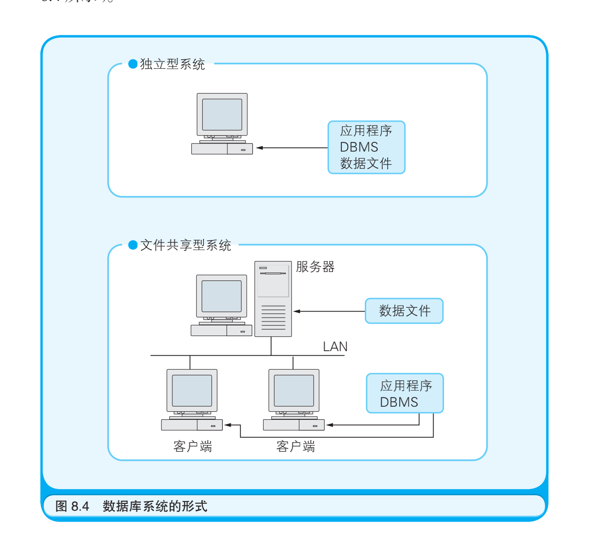
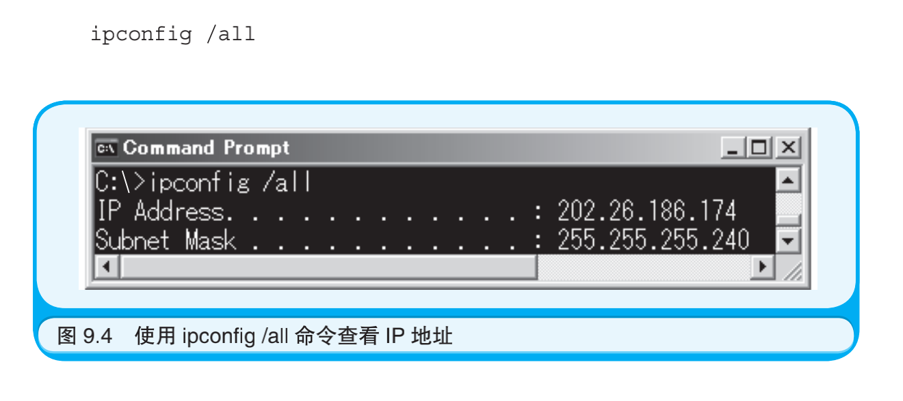
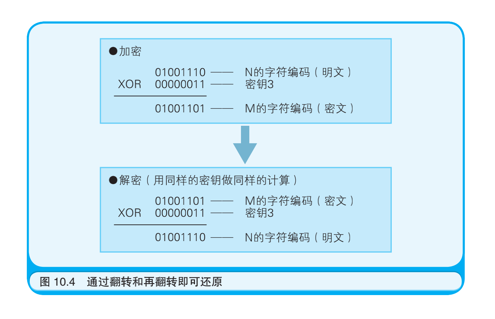
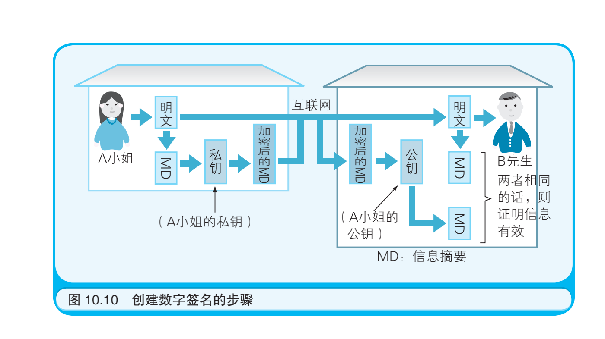

## 计算机是怎样跑起来的 -- 矢泽久雄

## notes:

中级问题：存储字符串“中国”需要几个字节？
		存储汉字时，字符编码不同，汉字所占用的字节数也 就不同。在 GBK 字符编码下，一个汉字占用 2 个字节。
而在 UTF-8 字符编码下，一个汉字占用 3 个字节。

软件是指令和数据的集合


字节的来由:
		最开始计算机只是处理数据运算，也就是0-9，加上运算符号，4bit足够了。举个例子(实际不是这样):用0000表示0，0001表示1，0010表示2，依次类推。
后来加入了字母，程序符号等，8bit也足够了，而这时诞生了ASCII编码的标准，大家就说把8bit表示出来的值叫做字节(byte)吧，于是就有了字节这个单位。
所以1byte等于8bit是计算机发展中的一个约定出来的规则。


程序像河水一样流动着
与河流的流动方式一样，程序的流程也分为三种。在程序中，

​		把犹如水流向着一个方向流淌的流程称作 “顺序执行”；

​		把犹如水流流着流着产生了支流的流程 称作“条件分支”；

​		把犹如水流卷成漩涡的流程称作 “循环”。


## 第1章 计算机的三个大原则

### 计算机的三个大原则:

1. 计算机是执行输入、运算、输出的机器

2. 程序是指令和数据的集合

3. 计算机的处理方式有时与人们的思维习惯不同

### 软件是指令和数据的集合


### 对计算机来说什么都是数字

​	笔者则认为,无论是刚入行的技术人员,还是有资历的老工程师,都应该由衷地欢迎技术的进化,坦率地接受新技术.


## 第2章 试着制造一台计算机吧

CPU: Central Processing Unit (中央处理器)

制作微型计算机所需的基础元件只有三个: CPU , 内存 和 I/O


​		为了驱动 CPU 运转，称为“时钟信号”的电信号必不可少。这种 电信号就好像带有一个时钟，滴答滴答地每隔一定时间就变换一次电 压的高低（如图 2.2 所示）。输出时钟信号的元件叫作“时钟发生器”。 时钟发生器中带有晶振，根据其自身的频率（振动的次数）产生时钟信 号。时钟信号的频率可以衡量 CPU 的运转速度。这里使用的是 2.5MHz（兆赫兹）的时钟发生器。


​		IC用于提高连接外部设备时的稳定性。 只要想成 0V 表示数字 0、+5V 表示数字 1， 那么数字 IC 就是在用二进制数的形式收发信息。通常将 1 个二进制数（也就是数字 IC 上 1 个引脚所能表示的 0 或者 1）所表示的信息称作“1 比特”，将 8 个二进制数（也就是 8 比特）称作“1 字节”。比特是信息的最小单位， 字节是信息的基本单位。这里制作的微型计算机是一台 8 比特微型计 算机，因此是以 8 比特为一个单位收发信息的。 


220v 交流电 连接到稳压电源上,转化成5v的直流电,在连接到时钟发生器,转换为0v,5v,0v,5v这样的波形


## 第3章 体验一次收工汇编


---

​		代码清单 3.1 中的机器语言可以转换成如代码清单 3.2 所示的汇编 语言。汇编语言的语法十分简单，以至于语法只有一个，即把“标 签”“操作码（指令）”和“操作数（指令的对象）”并排写在一行上，仅此而已


​		标签的作用是为该行代码对应的内存地址起一个名字。编程时如 果总要考虑“这一行的内存地址是什么来着？”就会很不方便，所以在 汇编语言中用标签来代替地址。用汇编语言编程时可以在任何需要标 签的地方“贴上”名称任意的标签。在代码清单 3.2 所示的程序中，使 用了名称为“LOOP:”的标签。

​		 操作码就是表示“做什么”的指令。因为用助记符表示的指令是 英语单词的缩写，比如 LD 是 Load（加载）的缩写，所以多多少少能 猜出其中的含义。汇编语言中提供了多少种助记符，CPU 就有多少种功能。Z80 CPU 的指令全部加起来有 70 条左右。这里先把主要的指 令列在表 3.1 中，请诸位粗略地浏览一下。在浏览的过程中请注意这 些指令的分类，按功能这些指令可以分成运算、与内存的输入输出和 与 I/O 的输入输出三类。这是因为计算机能做的事也只有输入、运 算、输出这三种了。 

​		操作数表示的是指令执行的对象。CPU 的寄存器、内存地址、I/O 地址或者直接给出的数字都可以作为操作数。如果某条指令需要多个3.2　机器语言和汇编语言操作数，那么它们之间就要用逗号分割。操作数的个数取决于指令的 种类。也有不需要操作数的指令，比如用于停止 CPU 运转的 HALT 指令。

### 追踪程序的运行过程


## 第4章 程序像河水一样流动着

### 流程图

### 中级问题：请说出自然界中河流的三种流动方式。

​		向着一个方向流淌；流着流着产生支流；卷成漩涡。

### 事件驱动


与河流的流动方式一样，程序的流程也分为三种。在程序中，

​		把犹如水流向着一个方向流淌的流程称作 “顺序执行”；

​		把犹如水流流着流着产生了支流的流程 称作“条件分支”；

​		把犹如水流卷成漩涡的流程称作 “循环”。


**结构化程序设计** 

​		是由学者戴克斯特拉提倡的一种编程风格。简单地说，所谓结构化程序设计就是“为了把程序编写得具备结构性，仅使用顺序执行、条件分 支和循环表示程序的流程即可，而不再使用跳转指令”。“仅用顺序执 行、条件分支和循环表示程序的流程”这一点是不言自明的，需要请诸 位注意的是“不使用跳转指令”这一点。


但是即使使用了结构化异常处理，在硬件上使用的也还是跳转指令，只是说在高 级语言中不用再写相当于跳转指令的语句了。如果把用高级语言所编 写的程序转换成机器语言，像结构化异常处理这样的语句还是会被转 换为跳转指令。


### 画流程图来思考算法


所谓算法（Algorithm），就是解决既定问题的步骤


### 特殊的程序流程 -- 中断处理

I/O设备的中断请求, 实在一次指令执行中被中断的,保护现场,处理完请求后,恢复现场继续执行之前被中断的指令.

而结构化程序是跳转到其他命令;


## 第5章 与算法成为好朋友的七个要点

高级问题:
	程序中的“哨兵”指的是什么？
字符串的末尾用 0 表示，链表的末尾用－1 表示，像这 种特殊的数据就是哨兵。在本章中，我们将展示如何 在“线性搜索”算法中灵活地应用哨兵。

只要理清在现实世界解决问题的步骤，再结合计算机的特性，就一定能想出算法。思考算法也可以是一件非常有趣的事。 

### 要点 1：算法中解决问题的步骤是明确且有限的

### 要点 2：计算机不靠直觉而是机械地解决问题

​	辗转相除法（又称欧几里得算法）就是一个机械地求解最大公约数问题的算法。在辗转相除法中分为使用除法运算和使用减法运算两种 方法。使用减法运算简单易懂，步骤如图 5.2 所示。用两个数中较大的 数减去较小的数（步骤），反复进行上述步骤，直到两个数的值相等 （步骤的终止）。如果最终这两个数相同，那么这个数就是最大公约数。 请诸位注意以下三点：1. 步骤是明确的、完全不依赖直觉的；2. 步骤是 机械的、不需要动脑筋就能完成的；3. 使步骤终止的原因是明确的。


### 要点 3：了解并应用典型算法


### 要点 4：利用计算机的处理速度

### 要点 5：使用编程技巧提升程序执行速度


为了消除这种不必要的处理，于是添加了一个 101 号箱子，其中预先放入的纸条上写有正要查找的数字。这种数据就被称为“哨兵”。 通过放入哨兵，就一定能找到要找的数据了。找到要找的数据后，如果该箱子的编号还没有到 101 就意味着找到了实际的数据；如果该箱子的编号是 101，则意味着找到的是哨兵，而没有找到实际的数据。使用了哨兵的流程图如图 5.7 所示。需要多次反复检查的就只剩下“第N个箱子中包含要找的数字吗？”这一点了，程序的执行时间也因此大幅度 地缩减了。


### 要点6:  找出数字间的规律

所有的信息都可以用数字表示——这是计算机的特性之一。

### 要点 7：先在纸上考虑算法


## 第6章 与数据结构成为好朋友的七个要点


初级问题:

​		程序中的变量是指什么？

​		变量是数据的容器。变量中所存储的数据是可以改变的。变量的实质是按照变量所存储数据的大小被分配到的一块内存空间。

中级问题:

​		把若干个数据沿直线排列起来的数据结构叫作什么？

​		叫作“数组”。使用了数组就可以高效地处理大量的数据。数组的实质是连续分配的一块特定大小的内存空间。 

高级问题:

​		栈和队列的区别是什么？

​		栈中数据的存取形式是 LIFO ；队列中数据的存取形式是 FIFO。LIFO（Last In First Out，后进先出）表示优先读取后存入的数据；FIFO（First In First Out，先进先出）表示优先读取先存入的数据。本章将会详细地讲解栈和队列的结构。

### 要点 1：了解内存和变量的关系

​		计算机所处理的数据都存储在了被称为内存的 IC（Integrated Circuit，集成电路）中。在一般的个人计算机中，内存内部被分割成了若干个数据存储单元，每个单元可以存储 8 比特的数据（8 比特 = 1 字节）。为了区分各个单元，每个单元都被分配了一个编号，这个编号被称为“地址”或是“门牌号码”。

​		如果是完全不了解数据结构的程序员，说不定会通过一个挨一个地定义出若干个离散的变量来编写程序吧。要是程序可以按照预期运 行，那么以这种方式编程倒也可以。但是若还要用这种方式实现对多 个数据排序的算法，那就有些困难了。 

代码清单 6.2　把存入到三个变量中的数值按照降序排列

```c
/* 定义变量 */ 
char a, b, c, tmp; 

/* 把数据存入变量 */ 
a = 123; 
b = 124; 
c = 125; 

/* 按降序排列 */ 
if (b > a){ 
  tmp = b; b = a; a = tmp; 
}

if (c > a){
  tmp = c; c = a; a = tmp; 
}

if (c > b){
  tmp = c; c = b; b = tmp; 
}
```

​		虽然代码清单 6.2 中的程序可以正常地运行 A，但是处理的过程（算法）实在是够啰嗦的。如果需要排序的数据有 1000 个，那么就需要定 义 1000 个变量。用于比较其中数值大小的 if 语句，更是需要约数十万个程序块。应该没有人想写这么麻烦的程序吧。也就是说，为了实现想要实现的算法，有时不能只依靠离散的变量。


### 要点 2：了解作为数据结构基础的数组

​		在实际应用的程序中经常需要处理大量的数据，比如那种用于统计 1000 名职员的工资之类的程序。在这类程序中存储数据时使用的是“数组”，而不是定义出 1000 个变量以供使用。通过使用数组，既可以同时定义出多个变量，又可以提高编写程序的效率。

代码清单 6.3　使用含有 3 个元素的数组

```c
char x[3]; /* 定义数组 */ 
x[0] = 123; /* 把数据存入数组的第 0 个元素中 */ 
x[1] = 124; /* 把数据存入数组的第 1 个元素中 */ 
x[2] = 125; /* 把数据存入数组的第 2 个元素中 */
```


数组实际上是为了存储多个数据而在内存上集中分配出的一块内存空间，并且为这块空间整体赋予了一个名字。

​		本例中通过“char x[3];”这条语句就分配出了数组整体所需的内存空间，其中每个元素的内存空间可以通过 x[0]、x[1]、x[2] 的方式进行访问。虽然本质上还是定义出了 x[0]、x[1]、x[2] 三个变量，但是比起单独使用 a、b、c，使用数组可以更加高效地编写出能够实现排序等算法的程序。具体的例子将在稍后展示。 

**数组是数据结构的基础，之所以这么说是因为数组反映了内存的物理结构本身。**

​		在内存中存储数据的空间是连续分布的。而在程序中，往往要从内存整体中分配出一块连续的空间以供使用。


### 要点 3：了解数组的应用——作为典型算法的数据结构


**数组是数据结构的基础，只要使用数组就能通过程序实现各种各样的算法以处理大量的数据。**

代码清单 6.4　使用线性搜索算法查找数据 ( 这段程序中没有使用“哨兵”。)

```c
for (i = 0; i < 1000; i++){ 
  if (x[i] == 777){ 
    printf(" 找到 777 了！ "); 
  } 
}
```


通常把像变量 i 这样的用于记录循环次数的变量称为循环计数器（Loop Counter）。数组之所以方便，就是因为可以把循环计数器的值与数组的索引对应起来使用


代码清单 6.5　通过冒泡排序算法排列数据

```c
for (i = 999; i > 0; i--){
  for (j = 0; j < i; j++){
    if (x[i] > x[j]){
      tmp = x[i];
      x[i] = x[j];
      x[j] = tmp; 
    } 
  } 
}
```

通过使用数组和 for 语句，就能编写出实现了线性搜索和冒泡排序算法的程序。

### 要点 4：了解并掌握典型数据结构的类型和概念

​	**数组是一种直接利用内存物理结构（计算机的特性）的最基本的数据结构**。

​		只需使用 for 语句，就可以连续地处理数组中所存储的数据，实现各种各样的算法。

​		但是在现实世界中也有一些数据结构，仅凭借 数组是无法实现的，比如有的数据结构可以把数据堆积得像小山一样，有的数据结构可以把数据排成一队，有的数据结构可以任意地改变数 据的排列顺序，还有的数据结构可以把数据分为两路排列，等等。为了用程序实现这些数据结构，就必须要设法改造数组，但是与之相应的内存的物理结构又是改变不了的。这可怎么办才好呢？


**“栈”（Stack）**的本意是干草堆（如图 6.4 所示）。在牧场中，把喂家畜吃的干草堆积在地上就会形成一座小山。为了把干草堆成山就要从下往上不断地堆积。在程序中干草就相当于数据。而在给家畜喂食的时候，则要按照从上往下的顺序把堆积起来的干草（数据）取下来。也就是说，数据的使用顺序与堆积顺序是相反的。通常把这种存取方 式称为 **LIFO（Last In First Out，后进先出）**，即最后被存入的数据是最先被处理的。在那些作为程序处理对象的实际业务中，可以用栈来模拟诸如堆积在桌子上的文件等场景。既然无法马上处理，就暂且先都 堆放在栈里吧。


**“队列”（Queue）**就是等待做某事而排成的队。笔者经常要在东京的西日暮里站从营团地铁换乘日本铁路。下了地铁就要去买日本铁路的车票，在购票窗口前买票的乘客会排成一队。这就是现实世界中的队列（如图 6.5 所示）。队列与栈正相反，排在队头的乘客可以最先买到车票。
通常把这种形式称为 **FIFO（First In First Out，先进先出）**，即最先被存入的数据也是最先被处理的。当无法一下子处理完数据的候，就可以暂且先把这些数据排成队。之后会介绍队列的数据结构，其实现方式一般是把数组的首尾相连，形成一个圆环。


**“链表”** 的概念就相当于几个人手拉着手排成一排（如图 6.6 所示）。某个人只要松开拉住的那只手，再去拉住另一只手，这一排人（相当于数据）的排列顺序就改变了。而只要先松开拉住的手，再让一个新人加入进来并拉住他的手，就相当于完成了数据的插入操作。


**“二叉树”** 的概念正如其名，就相当于一棵树。不过这棵树与自然界中的树稍有些不同，二叉树从树干开始分杈，树枝上又有分杈，但每次都只会分为两杈，在每个分杈点上有一片叶子（相当于数据）（如图 6.7 所示）。稍后诸位就会了解到二叉树其实是链表的特殊形态。

### 要点 5：了解栈和队列的实现方法

​		在实现栈这种数据结构时，首先要定义一个数组和一个变量。数组中所包含的元素个数就是栈的大小（栈中最多能存放多少个数据）。变量中则存储着一个索引，指向存储在栈中最顶端的数据，该变量被称为“栈顶指针”。

```c
char Stack[100]; /* 作为栈本质的数组 */ 
char StackPointer = 0; /* 栈顶指针 */ 

/* 入栈函数 */ 
void Push(char Data){ 
  /* 把数据存储到栈顶指针所指的位置上 */ 
  Stack[StackPointer] = Data; 
  /* 更新栈顶指针的值 */ 
  StackPointer++; 
}

/* 出栈函数 */ 
char Pop(){ 
  /* 更新栈顶指针的值 */
  StackPointer--; 
  /* 把数据从栈顶指针所指的位置中取出来 */ 
  return Stack[StackPointer];
}
```


为了实现队列这种数据结构，以下元素是必不可少的：1. 一个任意大小的数组；2. 一个用于存放排在队头的数据对应的索引的变量；3. 一个用于存放排在队尾的数据对应的索引的变量；4. 一对儿函数，分别用于把数据存入到队列中和从队列中把数据取出来。如果数据一直存放到了数组的末尾，那么下一个存储位置就会折回到数组的开头。这样就相当于数组的末尾就和它的开头连接上了，于是虽然数组的物理结构是“直线”，但是其逻辑结构已经变成“圆环”了（如代码清单 6.7 和图 6.9 )

```c
char Queue[100]; /* 作为队列本质的数组 */ 
char SetIndex = 0; /* 标识数据存储位置的索引 */ 
char GetIndex = 0; /* 标识数据读取位置的索引 */ 

/* 存储数据的函数 */ 
void Set(char Data){ 
  /* 存入数据 */ 
  Queue[SetIndex] = Data; 
  /* 更新标识数据存储位置的索引 */ 
  SetIndex++; 
  /* 如果已到达数组的末尾则折回到开头 */ 
  if (SetIndex >= 100){ 
    SetIndex = 0; 
  } 
}

/* 读取数据的函数 */ 
char Get(){
  char Data; 
  /* 读出数据 */ 
  Data = Queue[GetIndex]; 
  /* 更新标识数据读取位置的索引 */ 
  GetIndex++; 
  /* 如果已到达数组的末尾则折回到开头 */ 
  if (GetIndex >= 100){ 
    GetIndex = 0; 
  }
  /* 返回读出的数据 */ 
  return Data; 
}
```


### 要点 6：了解结构体的组成

​		要想理解用 C 语言程序实现链表和二叉树的方法，就必须先了解何谓“结构体”。所谓结构体，就是把若干个数据项汇集到一处并赋予其名字后所形成的一个整体。例如，可以把学生的语文、数学、英语的考试成绩汇集起来，做成一个叫作 TestResult 的结构体。
​		在代码清单 6.8 中，定义了一个叫作 TestResult 的结构体。C 语言中结构体的定义方法是：先在 struct 这个关键词后面接上结构体的名字（也被称作是结构体的标签），然后在名字后面接上用“{”和“}”括起来的程序块，并在程序块中列出若干个数据项。
​														代码清单 6.8　结构体汇集了若干个数据项

```c
struct TestResult{ 
  char Chinese; /* 语文成绩 */ 
  char Math; /* 数学成绩 */ 
  char English; /* 英语成绩 */ 
};

struct TestResult xiaoming; /* 把结构体作为数据类型定义变量 */ 
xiaoming.Chinese = 80; /* 为成员数据 Chinese 赋值 */ 
xiaoming.Math = 90; /* 为成员数据 Math 赋值 */ 
xiaoming.English = 100; /* 为成员数据 English 赋值 */
```

​		如果要编写一个用于处理 100 名学生考试成绩的程序，就需要定义一个以 TestResult 为数据类型、包含 100 个元素的数组。通过定义，在内存上就分配出了一块空间，能够存储 100 个数据的集合，每个数据的集合中都含有 Chinese、Math、English 三个数据项（如图 6.10所示）。接下来只要巧妙地运用结构体的数组就可以实现链表和二叉树了。


### 要点 7：了解链表和二叉树的实现方法

​		下面讲解如何使用结构体的数组实现链表。链表是一种类似数组的数据结构，这个“数组”中的每个元素和另一个元素都好像是手拉着手一样。在现有的以结构体 TestResult 为数据类型的数组 Student[100]中，为了让各个元素“把手拉起来”，就需要在结构体中再添加一个成员（如代码清单 6.10 所示）。

```c
struct TestResult{
  char Chinese; /* 语文成绩 */ 
  char Math; /* 数学成绩 */ 
  char English; /* 英语成绩 */ 
  struct TestResult* Ptr; /* 指向其他元素的指针 */ 
};
```

Ptr 就是以结构体 TestResult 的指针（struct TestResult*）为数据类型的成员。这种特殊的结构体可以称为“自我引用的结构体”。之所以叫这个名字，是因为在结构体 TestResult 的成员中，含有以 TestResult 的指针为数据类型的成员，这就相当于 TestResult 引用了与自身相同的数据类型。Ptr 中存储着本元素接下来该与哪一个元素相连的信息，即下一个元素的地址。


​		为什么说链表很方便呢？请思考一下不使用链表且还要对大量的数据进行排序时应该怎么处理。答案是那就必须要改变元素在内存上的物理排列顺序了。这不仅要改变大量数据的位置，而且程序的处理时间也会变长。如果是使用链表，对元素的排序就只需要变更 Ptr 的值，程序的处理时间也会缩短。这个特性也适用于对元素进行删除和插入。在实际的程序中，为了能够处理大量的数据，都会在各种各样的情景下灵活地运用链表。不使用链表的情况倒是很少见。 


**二叉树** , 在二叉树的实现中，用的还是自我引用的结构体，只不过要改为要带有两个连接信息的成员的自我引用结构体（如代码清单 6.11 所示）。
											代码清单 6.11　带有 2 个链表连接信息的自我引用结构体

```c
struct TestResult{ 
  char Chinese; /* 语文成绩 */ 
  char Math; /* 数学成绩 */ 
  char English; /* 英语成绩 */ 
  struct TestResult* Ptr1; /* 指向其他元素的指针 1 */ 
  struct TestResult* Ptr2; /* 指向其他元素的指针 2 */ 
};
```


二叉树多用于实现那些用于搜索数据的算法，比如“二分查找法”。比起只使用链表，使用二叉树能够更快地找到数据。因为搜索数据时并不是像在简单数组中那样沿一条线搜索，而是寻着二叉树不断生长出来的两根树杈中的某一枝搜索，这样就能更快地找到目标数据了（如图 6.13 所示）。


**无论是在哪种编程语言中，数据结构的基础都是 数组，因此设法灵活地运用数组才是关键。**

Java 隐藏了算法和数据结构
		让缺乏计算机构造和编程方面知识的新人学习Java会怎样呢？ Java 是一种在屏蔽了计算机构造的框架中使用的编程语言。虽然使用了 Java 就可以进行面向对象编程，但这却是一种不用考虑计算机底层状况的编程方法。只要使用了 Java 提供的类库（代码的集合），不需要考虑算法和数据结构就能解决问题。举例来说，Java 的程序员在使用栈这种数据结构时，只需要调用类名为 Stack的类就可以轻易地实现功能，因为该类为程序员提供了栈结构本身以及入栈（Push）和出栈（Pop）方法。程序员完全可以无视栈顶指针的存在。 


## 第7章 成为会使用面向对象编程的程序员吧

初级问题

​		Object 翻译成中文是什么？

中级问题

​		OOP 是什么的缩略语？

高级问题

​		哪种编程语言在 C 语言的基础上增加了对 OOP 的支持？

初级问题：对象（Object）是表示事物的抽象名词。 

中级问题：面向对象编程也可以简称为 OOP（Object Oriented Programming）。 

高级问题：++ 是表示自增（每次只将变量的值增加 1）的 C 语言 运算符。之所以被命名为 C++，是因为 **C++ 在 C 语言 的基础上增加了面向对象的机制**这一点。另外，**将 C++ 进一步改良的编程语言就是 Java 和 C# 语言**。

### 对 OOP 的多种理解方法

​	面向对象编程是一种基于以下思路的程序设计方法：将关注点置于对象（Object）本身，对象的构成要素包含对象的行为及操作，以此为基础进行编程。这种方法使程序易于复用，软件的生产效率因而得以提升。其中所使用的主要编程技巧有继承、封装、多态三种。

### 观点 1：面向对象编程通过把组件拼装到一起构建程序

​	在面向对象编程中，使用了一种称为“类”的要素，通过把若干个类组装到一起构建一个完整的程序。从这一点来看，可以说类就是程序的组件（Component）。面向对象编程的关键在于能否灵活地运用类。

​	无论使用哪种开发方法，编写出来的程序其内容最终都会表现为数值的罗列，其中的每个数值要么表示“指令”，要么表示作为指令操作对象的“数据”。程序最终就是指令与数据的集合。 

​	在使用古老的 C 语言或 BASIC 等语言编程时（它们不是面向对象的编程语言，即不是用于表达面向对象编程思想的语言），用“函数”表示指令，用“变量”表示数据。对于 C 语言或是 BASIC 的程序员而言，程序就是函数和数据的集合。在代码清单 7.1 中，用 FunctionX 的形式为函数命名，用 VariableX 的形式为变量命名。
​															代码清单 7.1　程序是函数和变量的集合（C 语言）

```c

int Variable1; 
int Variable2;
int Variable3; 
…
void Function1() { 处理过程 } 
void Function2() { 处理过程 } 
void Function3() { 处理过程 }
```

​		在大型程序中需要用到大量的函数和变量。假设要用非面向对象的编程方法编写一个由 10000 个函数和 20000 个变量构成的程序，那么结果就很容易是代码凌乱不堪，开发效率低到令人吃惊，维护起来也十分困难。

​		于是一种新的编程方法就被发明出来了，即把程序中有关联的函数和变量汇集到一起编成组。这里的组就是类。在 C++、Java、C# 等面向对象编程语言中，语法上是支持类的定义的。在代码清单 7.2 中，就定义了一个以 MyClass 为名称的类。因为程序的构成要素中只有函数和变量，所以把它们分门别类组织起来的类也理所当然地成了程序的组件。 通常把汇集到类中的函数和变量统称为类的“成员”（Member）。 

​		为了使 C 语言支持面向对象编程，人们扩充了它的语法，开发出了 C++ 语言。而通过改良 C++ 又开发出了 Java 和 C#。在本章中，将会分别介绍用 C 语言、C++、Java 和 C# 编写的示例程序。诸位在阅读时只需抓住其大意即可，不必深究每个程序的具体内容。
​													代码清单 7.2　定义类 MyClass，将函数和变量组织到一起（C++）

```c++
class MyClass
{ 
  	int Variable1; 
  	int Variable2; 
  	…
  	void Function1() { 处理过程 } 
  	void Function2() { 处理过程 } 
  	… 
};
```

### 观点 2：面向对象编程能够提升程序的开发效率和可维护性

​	在使用面向对象编程语言开发时，并不是所有的类都必须由程序员亲自编写。大部分的类都已内置于面向对象编程语言中了，这些类可以为来自各个领域的程序员所使用。通常将像这样的一组类（一组组件）称作“类库”。通过利用类库可以提升编程的效率。

​	所谓企业级的程序，指的是对可维护性有较高要求的程序。可维护性体现在当程序投入使用后对已有功能的修改和新功能的扩充上。如果所维护的程序是用一组类组装起来的话，那么维护工作就轻松了。之所以这样说，是因为作为维护对象的函数和变量，已经被汇聚到名为类的各个组中了。举例来说，假设我们已经编写出了一个用于员工薪资管理的程序。随着薪资计算规则的变更，程序也要进行修改，那么需要修改的函数和变量就应该已经集中在一个类中了，比如一个叫作 CalculationClass 的类（如图 7.2 所示）。也就是说，维护时没有必要去检查所有的类，只需修改类 CalculationClass 就可以了。


​	“我是创造类的人，你是使用类的人”——在实际应用面向对象编程时要带着这个感觉。开发小组中的全体成员没有必要都对程序中的方方面面有所了解，而是组中有些人只负责制作组件（类），有些人只负责使用组件。当然也会有需要同时做这两种工作的情况。


​	对于创造类的程序员，他们考虑的是程序的开发效率和可维护性，并决定应该将什么抽象为类。如果一个类的修改导致其他的类就也要跟着修改，这样的设计是不行的。必须把组件设计成即使是坏了（有缺陷了）也能轻松地替换，就像在汽车或家电等工业制品中所使用的组件那样。

​	在功能升级后，旧组件能够被新组件所替换的设计也是必不可少的。因此，创造者和使用者之间就需要事先商定类的使用规范。请诸位记住，对于类的使用者而言“类看起来是什么样子的”这种关于规范的描述通常被称为“接口”（Interface）。例如只要把接口告诉合作公司，就可以要求他们编写类，编写出的类也就自然能够与程序中的其他部分严丝合缝地拼装起来。在面向对象语言中，也提供了用于定义接口的语法。


### 观点 3：面向对象编程是适用于大型程序的开发方法

​	通过之前的介绍，诸位应该也理解了为什么说面向对象编程适用于编写大型程序。假设一个程序需要 10000 个函数和 20000 个变量，如果把这个程序用 100 个类组织起来，那么平均一个类里就只有 100个函数和 200 个变量了。程序的复杂度也就降到了原来的 1%。而如果使用了稍后将会讲解的封装这种编程技巧（即将函数和变量放入黑盒，使其对外界不可见），还可以更进一步降低复杂度。

​	为了拉近计算机和人的距离，使计算机成为更容易使用的机器，围绕着计算机的各种技术都在不断发展。在人的直觉中，大件物品都是由组件组装起来的。因此可以说面向对象编程方法把同样的直觉带给了计算机，创造了一种顺应人类思维习惯的先进的开发方法。


### 观点 4：面向对象编程就是在为现实世界建模

​	计算机本身并没有特定的用途，而是程序赋予了计算机各种各样的用途。在面向对象编程中，可以通过“这个是由什么样的对象构成的呢？”这样的观点来分析即将转换成程序的现实世界。这种分析过程叫作“建模”。可以说建模对于开发者而言，反映的是他们的世界观，也就是在他们的眼中现实世界看起来是什么样子的。

​	在实际建模的过程中，要进行“组件化”和“省略化”这两步。所谓组件化，就是将可看作是由若干种对象构成的集合的现实世界分割成组件。因为并不需要把现实世界 100% 地搬入到程序中，所以就可以忽略掉其中的一部分事物。举例来说，假设要为巨型喷射式客机建模，那么就可以从飞机上抽象归类出机身、主翼、尾翼、引擎、轮子和座席等组件（如图 7.3 所示）。而像是卫生间这样的组件，不需要的话就可以省略。“建模”这个词也可以理解为是制作塑料模型。虽然巨型喷射式客机的塑料模型有很多零件，但是其中应该会省略掉卫生间吧，因为这对于塑料模型来说不是必需的。


### 观点 5：面向对象编程可以借助 UML 设计程序

​	可以说建模就是在为面向对象编程做设计。为了把对现实世界建模的结果以图形的形式表示出来，还经常使用被称作 UML（UnifiedModeling Language，统一建模语言）的表记方法。UML 是通过统一历史上曾经出现的各种各样的表记方法而发明出来的，事实上 UML 已经成为了建模表记方法中的世界标准。

​	UML 中，规定了九种图（见表 7.1）。之所以有这么多种，是为了从各种各样的角度表示对现实世界建模的结果。例如用例图是从用户的角度，即用户使用程序的方式出发表示建模结果的一种图。而类图等出发的角度则是程序。


​	UML 仅仅规定了建模的表记方法，并不专门用于面向对象编程。因此公司的组织架构图和业务流程图等也可以使用 UML 表记。“这儿可有九种图呢，记忆起来很吃力啊”——也许会有人这么想吧。但是可以换一种积极的想法来看待它。既然 UML 被广泛地应用于绘制面向对象编程的设计图，那么只要了解了 UML 中仅有的这九种图的作用，就可以从宏观的角度把握并理解面向对象编程思想了。怎么样，如果这样想的话，就应该会对学习 UML 跃跃欲试了吧。 

​	在进行面向对象编程的设计时，要在一开始就把所需要的类确定下来，然后再在每个类中列举出该类应该具有的函数和变量，而不要到了后面才把零散的函数和变量组织到类中。也就是说，要一边观察作为程序参照物的现实世界，一边思考待解决的问题是由哪些事物（类）构成的。正因为在设计时要去关注对象，这种编程方法才被称为面向对象编程（Object Oriented Programming，其中的 Oriented 就是关注的意思）。而在那些传统的开发方法中，进行设计则是要先考虑程序应该由什么样的功能和数据来构成，然后立即确定与之相应的函数和变量。与此相对在面向对象编程的设计中，因为一上来就要确定有哪些类，从而构成程序的函数和变量就必然会被组织到类中。


### 观点 6：面向对象编程通过在对象间传递消息驱动程序

​																代码清单 7.3　未使用面向对象编程语言的情况（C 语言）

```c
/* 玩家 A 确定手势 */ 
a = GetHand(); 
/* 玩家 B 确定手势 */ 
b = GetHand(); 
/* 判定胜负 */ 
winner = GetWinner(a, b);
```

​																代码清单 7.4　使用了面向对象编程语言的情况（C++）

```c++
// 玩家 A 确定手势 
a = PlayerA.GetHand(); 
// 玩家 B 确定手势 
b = PlayerB.GetHand(); 
// 由裁判判定胜负 
winner = Judge.GetWinner(a, b);
```

​		也就是说用 C++ 等面向对象编程语言编写程序的话，程序可以通过由一个对象去调用另一个对象所拥有的函数这种方式运行起来。这种调用方式被称为对象间的“消息传递”。在面向对象语言中所说的消息传递指的就是调用某个对象所拥有的函数。即便是在现实世界中，我们也是通过对象间的消息传递来开展业务或度过余暇的。在面向对象编程中还可以对对象间的消息传递建立模型。


​		如果未使用面向对象编程语言，那么可以用流程图表示程序的运行过程。流程图表示的是处理过程的流程，因此通常把非面向对象语言称为“过程型语言”。


​	如果使用的是面向对象编程语言，那么可以使用 UML 中的“时序图”和“协作图”表示程序的运行过程。在图 7.5 中对比了流程图和时序图。关于流程图已经没有必要再进行介绍了吧。在时序图中，把用矩形表示的对象横向排列，从上往下表示时间的流逝，用箭头表示对象间的消息传递（即程序上的函数调用）。诸位在这里只需要抓住图中的大意即可。


​	沉浸在面向过程编程中的程序员们通常都习惯于用流程图思考程序的运行过程。可是为了实践面向对象编程，就有必要改用时序图来考虑程序的运行过程。

### 观点 7：在面向对象编程中使用继承、封装和多态

​	“继承”（Inheritance）、“封装”（Encapsulation）和“多态”（Polymorphism，也称为多样性或多义性）被称为面向对象编程的三个基本特性。在作为面向对象编程语言的 C++、Java、C# 等语言中，都已具备了能够用程序实现以上三个特性的语法结构。

​	继承指的是通过继承已存在的类所拥有的成员而生成新的类。封装指的是在类所拥有的成员中，隐藏掉那些没有必要展现给该类调用者的成员。多态指的是针对同一种消息，不同的对象可以进行不同的操作。

​	只要去继承已存在的类，就能高效地生成新的类。如果一个类被多个类所继承，那么只要修正了这个类，就相当于把继承了这个类的所有类都修正了。只要通过封装把外界不关心的成员隐藏起来，类就可以被当作是黑盒，变成了易于使用且便于维护的组件了。而且由于隐藏起来的成员不能被外界所访问，所以也就可以放心地随意修改些成员。只要利用了多态，生成对同一个消息可以执行多种操作的一组类，使用这组类的程序员所需要记忆的东西就减少了。总之，无论是哪一点，都是面向对象编程所带来的好处，都可以实现开发效率和可维护性的提升。

### 类和对象的区别

​	类是对象的定义，而对象是类的实例（Instance）。经常有教材这样说明二者之间的关系：类是做饼干的模具，而用这个模具做出来的饼干就是对象。


### 类有三种使用方法

​	而使用类的程序员可以通过三种方法使用类，关于这一点诸位要有所了解。这三种方法分别是：1. 仅调用类所持有的个别成员（函数和变量）；2. 在类的定义中包含其他的类（这种方法被称作组合）；3. 通过继承已存在的类定义出新的类。应该使用哪种方法是由目标类的性质以及程序员的目的决定的。 


### 在 Java 和 .NET 中有关 OOP 的知识不能少


​	面向对象编程就是通过把组件拼装到一起进行编程的方法

## 第8章 一用就会的数据库

市面上的 DBMS 有 SQL Server、Oracle、DB2 等。无 论是哪种 DBMS 都可以用基本相同的 SQL 语句操作。SQL 语言的标准是由 ISO（International Organization for Standardization，国际标准化组织）制订的。现在市面上几乎所有的 DBMS 都支持 SQL 语言。

键用于设定表和表之间的关系（Relationship），而索引是提升数据检索速度的机制。

​	像 DBMS、关系型数据库、SQL（ Structured Query Language，结构化查询语言）、事务（Transaction）之类的数据库术语，想必诸位都有所耳闻吧。

​	将这样的数据存储形式原封不动地移 植到计算机中，就形成了“卡片型数据库”。存储一条数据就好比把一 张账单或是名片上的信息记录到一个文件中。卡片型数据库适用于想 要实现小规模的数据库的情况。像是地址簿管理程序、存储 Web 电子 公告板上的评论等




### 设计数据库

主键存储的是能够唯一标识一条记录的 ID（Identification，识别码）。

### 索引能够提升数据的检索速度

​	可以在表的各个字段上设置索引（Index），这也是 DBMS 所具备的功能之一。一旦在字段上设置了索引，DBMS 就会自动为这个字段创建索引表

​		索引表是一种数据结构，存储着字段的值以及字段所对应记录的位置。例如，如果在顾客表的顾客姓名字段上设置了索引，DBMS 就会创建一张索引表（如图 8.13 所示），表中有两个字段，分别存储着顾客姓名和位置（所对应的记录在数据文件中的位置）。与原来的顾客表相比，索引表中的字段数更少，所以可以更快地进行数据的检索和排序。当查询数据时，DBMS 先在索引表中进行数据的检索和排序，然后再根据位置信息从原来的数据表中把完整的记录取出来。索引所起的就是“目录”的作用。与图书的目录一样，数据库的索引也是一种能够高效地查找目标数据的机制。


​		也许会有人这样想，既然索引能够提升检索和排序的速度，那么在所有表的所有字段上都加上索引不就好了吗？实际上并不能这样做。因为一旦设置了索引，每次向表中插入数据时，DBMS 都必须更新索引表。提升数据检索和排序速度的代价，就是插入或更新数据速度的降低。因此，只有对那些要频繁地进行检索和排序的字段，才需要设置索引。在酒铺数据库这个例子中，只需要在顾客表的顾客姓名字段和商品表的商品名称字段上设置索引就足够了。如果表中充其量也就只有几千条记录，那么即使完全不使用索引，也不会感到检索或排序速度有多慢。


### 事务控制也可以交给 DBMS 处理

​	最后介绍 DBMS 的一个高级功能——事务控制。事务由若干条SQL 语句构成，表示对数据库一系列相关操作的集合。有一个经典的银行账户间汇款的例子可以用于说明其概念。为了从顾客 A 的账户中给顾客 B 的账户汇入 1 万日元，就需要将以下两条 SQL 语句依次发送给 DBMS ：1. 把 A 的账户余额更新（UPDATE 语句）为现有余额减去1 万日元；2. 把 B 的账户余额更新（UPDATE 语句）为现有余额加上1 万日元。此时这两条 SQL 语句就构成了一个事务。


## 第9章 通过七个简单的实验理解TCP/IP 网络

初级问题

​		LAN 是什么的缩略语？
​		Local Area Network（局域网）的缩略语; 把互联网那样的大规模网络称作 WAN（Wide Area Network，广域网）

中级问题

​		TCP/IP 是什么的缩略语？
​		Transmission Control Protocol  / Internet Protocol （传输控制协议和网际协议）的缩略语。

高级问题

​		MAC 地址是什么？
​		MAC 地址就是能够标识网卡的编号 ,几乎所有的网卡都会在上市前被分配一个不可变更的MAC 地址


### 实验 1：查看网卡的 MAC 地址

​		以太网使用了一种略显粗糙的方法连接 LAN 内的计算机（如图 9.2所示）。以太网中的每台计算机都需要先确认一件事：在网线上有没有其他的计算机正在传输电信号，也就是说要先确保没有人在占用网络，然后才能发送自己想传输的电信号。谁先抢到了网线的使用权，谁就先发送。万一遇到了多台计算机同时都想发送电信号的情况，只需要让这些计算机等待一段长度随机的时间后再重新发送相同的电信号即可。这套机制叫作 CSMA/CD（Career Sense Multiple Access with Collision Detection，带冲突检测的载波监听多路访问）。所谓载波监听（Career Sense），指的是这套机制会去监听（Sense）表示网络是否正在使用的电信号（Career）。而多路复用（Multiple Access）指的是多个（Multiple）设备可以同时访问（Access）传输介质。带冲突检测（with Collision Detection）则表示这套机制会去检测（Detection）因同一时的传输而导致的电信号冲突（Collision）。在小规模的 LAN 中，像这样略显粗躁的 CSMA/CD 机制是可以正常运转的。因为 CSMA/CD 归根结底也只是一种适用于 LAN 的机制。


​		在每一块网卡所带有的 ROM（Read Only Memory，只读存储器）中，都预先烧录了一个唯一的 MAC 地址。网卡的制造厂商负责确定这个MAC 地址是什么。因为 MAC 地址是由制造厂商的编号和产品编号两部分组成的，所以世界上的每一个 MAC 地址都是独一无二的。

Windows 的版本打开命令提示符后，请试着输入如下命令。 

ipconfig /all 

​	在 Windows 中内置了各种各样的用于查看网络信息或网络连接状态的命令。Windows 有多个版本，在本实验中使用的是 Windows 2000 Professional。请注意，如果使用的是其他版本，命令的名称或输出的结果可能或多或少会有些差异。此外，还有一点需要大家注意的是，在我们的实验结果画面中显示的 MAC 地址和 IP 地址都是虚拟的。因为从安全的角度来说，网络的配置信息不应该随便暴露。 


### 实验 2：查看计算机的 IP 地址

​		MAC 地址虽然可以在硬件层面上标识网卡，可是如果只有 MAC地址也很不方便。因为企业或组织需要对计算机分组管理，但是他们却没有办法把 MAC 地址前面的若干位统一起来。而且在互联网那种把全世界的计算机都连接在一起的大型网络中，又必须要有一种机制能够把数据的发送目的地像邮政编码那样整理并标识出来。假如在互联网中只能使用 MAC 地址，那么会发生什么呢？在接入互联网的数量众多的计算机中，只有尚未进行任何分组处理的编号（MAC 地址）。这样的话，仅仅是寻找信息的发送目的地就要花费大量的时间。

​		因此，在 TCP/IP 网络中，除了硬件上的 MAC 地址，还需要为每台计算机设定一个软件上的编号。这个编号就是众所周知的 IP 地址。 

​		通常把设定了 IP 地址的计算机称为“主机”（Host）。因为路由器也算是计算机的一种，所以它们也有 IP 地址。在 TCP/IP 网络中，传输的数据都会携带 MAC 地址和 IP 地址两个地址。

​		IP 地址是一个 32 比特的整数，每 8 比特为一组，组间用“.”分隔，分成 4 段表示。8 比特所表示的整数换算成十进制后范围是 0～255，因此可用作 IP 地址的整数是 0.0.0.0～255.255.255.255，共计4294967296 个。

​		通过 IP 地址就可以轻松地对计算机进行分组管理了。比如用 IP 地址中第 1 段到第 3 段的数值代表公司，用第 4 段的数值代表公司内部的计算机。例如，在 AAA.BBB.CCC 这个公司内，如果有一台计算机的编号是 ×××，那么它的 IP 地址就是 AAA.BBB.CCC.XXX



​	如图 9.4 所示，显示在 IP Address 后面的 202.26.186.174 就是 IP 地址。请诸位再留意一下显示在 Subnet Mask 后面的 255.255.255.240。这一串数字是“子网掩码”。子网掩码的作用是标识出在 32 比特的 IP 地址中，从哪一位到哪一位是网络地址，从哪一位到哪一位是主机地址。 255.255.255.240 用二进制表示的话，结果如下所示。 

11111111.11111111.11111111.11110000

​	子网掩码中，值为 1 的那些位对应着 IP 地址中的网络地址，后面值为 0 的那些位则对应着主机地址。因此 255.255.255.240 这个子网掩码就表示，其所对应的 IP 地址前 28 比特是网络地址，后 4 比特是主机地址。

​	4 个二进制数可以表示的范围是从 0000 到 1111，共 16 个数。而因为最开始的 0000 和最后的 1111 具有特殊的用途，所以笔者的办公室内最多可以配置 14 台计算机，它们的主机地址范围是从 0001 到 1110。但是这其中又有一台路由器，所以实际上最多只能放置 13 台计算机。 与 MAC 地址一样，每个 IP 地址的值也都是独一无二的。

### 实验 3：了解 DHCP 服务器的作用


​	虽然在这个对话框中可以手动设置 IP 地址和子网掩码，但是大多数情况下选择的还是“自动获得 IP 地址”这个选项。这个选项使得计算机在启动时会去从 DHCP 服务器获取 IP 地址和子网掩码，并自动地配置它们。 

​	DHCP 的全称是 Dynamic Host Configuration Protocol（动态主机设置协议）。在笔者搭建的 LAN 中，使用了一台装有 Linux 的计算机充当 DHCP 服务器的角色。因为 Windows 的计算机也同样支持 DHCP 的协议，所以即使服务器上装的是 Linux，而客户端装的是 Windows，也没有关系。 

​	DHCP 服务器上记录着可以被分配到 LAN 内计算机的 IP 地址范围和子网掩码的值。作为 DHCP 客户端的计算机在启动时，就可以从中知道哪些 IP 地址还没有分配给其他计算机。 

​	请再看一次图 9.5。虽然文字是灰色的也许有些难以辨认，但是还是可以看到有一个叫作“默认网关”的配置项。通常会把路由器的 IP地址设置在这里。也就是说路由器就是从 LAN 通往互联网世界的入口（Gateway）。路由器的 IP 地址也可以从 DHCP 服务器获取。最后再请诸位注意一点，这里选择了“自动获得 DNS 服务器地址”这一选项。也就是说，DNS 服务器的 IP 地址也可以从 DHCP 服务器获取。DNS服务器的作用将在稍后的章节中介绍。


### 实验 4：路由器是数据传输过程中的指路人

​	在分组管理下，IP 地址中的网络地址部分可以代表一个组中的全部计算机，即一个 LAN 中的计算机全体。互联网就是用路由器把多个LAN 连接起来所形成的一张大网。从以上这两点，是不是就能慢慢看出路由器所扮演的角色了？ 

​	路由器正如其名，就是决定数据传输路径的设备。在本实验环境中，与 LAN 内的其他计算机一样，路由器也是连接在集线器上的。因为 LAN 内采用了 CSMA/CD 机制，所以所有发送出去的数据也都会发到路由器上。当从公司内的计算机向另一家公司的计算机发送数据时会发生什么呢？首先，一个不属于 LAN 内计算机的 IP 地址会被附加到数据的发送目的地字段上。这样的数据虽然会被 LAN 内的计算机所忽略，但是不会被路由器忽略。因为路由器的工作原理就是查看附加到数据上的 IP 地址中的网络地址部分，只要发现这个数据不是发送给 LAN 内计算机的，就把它发送到 LAN 外，即互联网的世界中。

​	路由器虽然看起来就是个小盒子，可实际上是一台神奇的计算机。分布在世界各地的 LAN 中的路由器相互交换着信息，互联网正是由于这种信息的交换才得以联通。这种信息被称作“路由表”，用来记录应该把数据转发到哪里。在像互联网这样的网络中，传输路径错综复杂，而路由器就是站在各个岔路口的指路人（如图 9.6 所示）。在一台路由器的路由表中，只会记录通往与之相邻的路由器的路径，而并不会记录世界范围内的所有传输路径。


route print


​		路由表由 5 列构成。Network Destination、Netmask、Gateway、Interface 这四列记录着数据发送的目的地和路由器的 IP 地址等信息。Metric 这一列记录着路径的权重，这个值由某种算法决定，比如数据传输过程中经过的路由器的数量。如果遇到有多条候选路径都可以通往目的地的情况，路由器就会选择 Metric 值较小的那条路径。在路由表中还有如下的规则：如果数据的发送目的地就在本 LAN 中，则可以直接发送数据而无需经过路由器转发；反之如果在 LAN 外（或发送目的地的 IP 地址不在路由表中），则需要经过路由器转发。细节虽然有些复杂，但是只要了解了大体上的规则就可以了。

### 实验 5：查看路由器的路由过程

​	假设诸位正在浏览笔者目前就职的公司 GrapeCity 的主页（http://www.grapecity.com/）。GrapeCity 的 Web 服务器中的数据，要经过若干个路由器的转发才能达到诸位的计算机上。通常把这种数据经过路由器转发的过程称为“路由”（Routing）。 

​	在命令提示符窗口中执行 tracert 命令后，就可以查看路由的过程了。执行时需要在 tracert 的后面指定一个主机名（或计算机名），作为数据的发送目的地。这样看到的转发路径其实是相反的，那我们就干 脆来看一下诸位的计算机到 GrapeCity 的 Web 服务器的路径吧。请在命令提示符窗口中执行如下命令（执行结果如图 9.8 所示）。 


​		诸位难道不认为这回的实验结果非常有意思吗？左侧按照 1～13 的顺序列出了数据前进道路上途经的 IP 地址。第 1 行的 202.26.186.171是作为实验对象的 LAN 内的路由器。第 2 行的 203.139.167.141 是笔者所租用的互联网服务提供商的路由器。从第 3 到第 11 行，是其他服务提供商的路由器。其中第 11 行的 210.145.239.82 是 GrapeCity 所租用的服务提供商的路由器。第 12 行的 210.160.205.254 是 GrapeCity 的路由器。最后，第 13 行的 210.160.205.80 是 Grape City 的 Web 服务器。可以看到，从笔者公司内的 LAN 出发，通过 13 次路由才终于到达了GrapeCity。

### 实验 6：DNS 服务器可以把主机名解析成 IP 地址

​	笔者希望诸位在刚刚的实验中注意到了这样一个问题：在互联网的世界中，本应使用 IP 地址这样的数字来标识计算机才是，而刚刚却能使用一串字符 www.grapecity.com 来标识 Grape City 的 Web 服务器。实际上，在互联网中还存在着一种叫作 DNS（Domain Name System，域名系统）的服务器。正是该服务器为我们把 www.grapecity.com 这样的域名解析为了 210.160.205.80 这样的 IP 地址 。 

​	诸位的计算机都有一个主机名，每个 LAN 也都有一个域名。举例来说，笔者所使用的计算机的主机名是 ma50j（源于这台计算机的型号），所在的 LAN 的域名是 yzw.co.jp。把主机名和域名组合起来所形成的 ma50j.yze.co.jp，就是能够标识笔者这台计算机的一个世界范围内独一无二的名字，这个名字与 IP 地址的作用是等价的。通常把这种由主机名和域名组合起来形成的名字称作 FQDN（Fully Qualified Domain Name，完整限定域名）。 

​	在互联网中，难以记忆的 IP 地址使用起来很麻烦。于是人们就发明出了 DNS 服务器，这样只需要使用 FQDN，DNS 服务器就可以自动地把它解析为 IP 地址了（这个过程叫作“域名解析”）。DNS 服务器通常被部署在各个 LAN 中，里面记录着 FQDN 和 IP 地址的对应关系表。世界范围内的 DNS 服务器是通过相互合作运转起来的。如果一台 DNS服务器无法解析域名，它就会去询问其他的 DNS 服务器。这套流程是自动进行的，诸位并不会意识到。 

下面我们就进入实验阶段吧。首先，查一查各自计算机的主机名。在命令提示符窗口执行 hostname 这条命令。结果中只会显示主机名，并没有 FQDN（如图 9.9 所示）。


### 实验 7：查看 IP 地址和 MAC 地址的对应关系

​		在互联网的世界中，到处传输的都是附带了 IP 地址的数据。但是能够标识作为数据最终接收者的网卡的，还是 MAC 地址。于是在计算机中就加入了一种程序，用于实现由 IP 地址到 MAC 地址的转换，这种功能被称作 ARP（Address Resolution Protocol，地址解析协议）。 

​		ARP 的工作方式很有意思。它会对 LAN 中的所有计算机提问： “有谁的 IP 地址是 210.160.205.80 吗？有的话请把你的 MAC 地址告诉我。”通常把这种同时向所有 LAN 内的计算机发送数据的过程称作“广播”（Broadcast）。通过广播询问，如果有某台计算机回复了 MAC 地址，那么这台计算机的 IP 地址和 MAC 地址的对应关系也就明确了。ARP 的工作流程也是自动进行的，诸位并不会意识到。如果为了查询 MAC 地址，每回都要进行广播询问，那么查询的效率就会降低。于是 ARP 还提供了缓存的功能，当向各个计算机都询问完一轮之后，就会把得到的 MAC 地址和 IP 地址的对应关系缓存起来（临时保存在内存中）。存起来的这些对应关系信息称作“ARP 缓存表”。只要在命令提示符窗口中执行 arp -a 命令，就可以查看当前 ARP缓存表中的内容。那么，作为最后的实验，我们就来查看一下 ARP 缓存表吧。


### TCP 的作用及 TCP/IP 网络的层级模型

​		最后请允许笔者补充说明一些内容。TCP/IP 这个词表示在网络上同时使用了 TCP 和 IP 这两种协议。正如前面所讲解的那样，IP 协议用于指定数据发送目的地的 IP 地址以及通过路由器转发数据。而TCP 协议则用于通过数据发送者和接收者相互回应对方发来的确认信号，可靠地传输数据。通常把像这样的数据传送方式称作“握手”（Handshake）（如图 9.13 所示）。TCP 协议中还规定，发送者要先把原始的大数据分割成以“包”（Packet）为单位的数据单元，然后再发送，而接收者要把收到的包拼装在一起还原出原始数据。


​		在之前的讲解中，一直把协议和约束等同起来，但恐怕还是会有人觉得协议这个词难以理解吧。正因为发送者和接收者都遵循了相同的约束，双方才能相互发送数据。为了能够在约束下收发数据，操作系统将实现了 TCP 和 IP 等协议的程序作为自身的一部分功能提供。遵循约束表现在统一数据的格式上。例如，诸位敲打键盘输入的电子邮件正文等数据，并不是原封不动地发送出去的，而是先通过实现了 TCP 协议的程序附加上遵守 TCP 约束所需的信息，然后再通过实现了 IP 协议的程序，进一步附加上遵守 IP 约束所需的信息。实际上计算机发送的是以包为单位的、附加了各种各样信息的数据（如图 9.14 所示）。 


​		硬件上发送数据的是网卡。在网卡之上是设备驱动程序（用于控制网卡这类硬件的程序），设备驱动程序之上是实现了 IP 协议的程序，IP程序之上则是实现了 TCP 协议的程序，而再往上才是应用程序，比如 Web 或电子邮件。这样就构成了一幅在硬件之上堆叠了若干个软件层的示意图（如图 9.15 所示）。TCP 协议使用被称作“TCP 端口号”的数字识别上层的应用程序。TCP 端口号中有一些是预先定义好的，比如Web 使用 80 端口，电子邮件使用 25 端口（用于发送）和 110 端口（用于接收）。


## 第10章 试着加密数据吧

在数字签名中使用的信息摘要是什么？

​		信息摘要是指从作为数字签名对象的文件整体中计算出的数值; 对比由文件整体计算出的信息摘要，可以证明文件的内容有没有被篡改。加密处理过的信息摘要就是数字签名。

​		虽然存在各种各样的加密技术，但是其中的基本手段无外乎还是字符编码的变换，即将构成明文的每个字符的编码分别变换成其他的数值。通过反转这种变换过程，加密后的文本数据就可以还原。通常把密文还原成明文的过程（即解读密码的过程）称为“解密”。

### 错开字符编码的加密方式

​	加密时使用的是将字符编码向后错三个的方法，所以只要再将字符编码向前挪三个就可以实现解密

​	下面再试着编写一个加密程序吧。这次让密钥的值也可以由用户指 定 吧。 该 程 序 通 过 把 每 一 个 字 符 的 编 码 与 密 钥 做 XOR 运 算（eXclusive OR，逻辑异或运算），将明文转换成密文（如代码清单 10.3所示）。XOR 运算的有趣之处在于，用 XOR 运算加密后的密文，可以通过相同的 XOR 运算解密。也就是说，一个程序既可用于加密又可用于解密，很方便（如图 10.3 所示）。


​	XOR 运算的法则是把两个数据先分别用二进制表示，然后当一个数据中的某一位与另一个数据中的 1 相对时，就将这一位反转（若这一位是 0 就变成 1，是 1 就变成 0）A。因为是靠翻转数字实现的加密，所以只要再翻转一次就可以解密。图 10.4 中展示了密钥 3（用二进制表示是 00000011）和字母 N（其字符编码用二进制表示是 01001110）做XOR 运算的结果，请诸位确认通过翻转和再翻转还原出字母 N 的过程：N 的字符编码先和 3 做 XOR 运算，结果是字母 M 的字符编码。M 的字符编码再和 3 做 XOR 运算，结果就又回到了 N 的字符编码。





### 密钥越长，解密越困难

​	如果仅用一位数作为密钥，那么只需要从 0 到 9 尝试十次就能破解密文。但是如果是用三位数的密钥，那么就有从 000 到 999 的 1000种可能。如果更进一步把密钥的位数增长到十位，结果会怎样呢？那样的话，破解者就需要尝试 10 的 10 次方 = 100 亿次。就算使用了一秒钟可以进行 100 万次尝试的计算机，破解密文也还是需要花费 100 亿÷100 万次 / 秒 = 10000 秒≈ 2.78 小时，坏人说不定就会因此放弃破解。密钥每增长一位，破解所花费的时间就会翻 10 倍。密钥再进一步增长到 16 位的话，破解时间就是 2.78 小时 ×1000000 ≈ 317 年，从所需的时间上来看，可以说破解是不可能的。


### 适用于互联网的公开密钥加密技术

​	前面几节所讲解的加密技术都属于“对称密钥加密技术”，也称作“秘密密钥加密技术”（如图 10.7 所示）。这种加密技术的特征是在加密和解密的过程中使用数值相同的密钥。因此，要使用这种技术，就必须事先把密钥的值作为只有发送者和接收者才知道的秘密保护好（如图10.7-(1) 所示）。虽然随着密钥位数的增加，破解难度也会增大，但是事先仍不得不考虑一个问题：发送者如何才能把密钥悄悄地告诉接收者呢？用挂号信吗？要是那样的话，假设有 100 名接收者，那么发送者就要寄出 100 封挂号信，非常麻烦，而且这样也无法防止通信双方以外的其他人知道密钥。再说寄送密钥也要花费时间。互联网的存在应该意味着用户可以实时地与世界各地的人们交换信息。因此对称密钥加密技术不适合在互联网中使用。

​	在公开密钥加密技术中，用于加密的密钥可以公开给全世界，因此称为“公钥”，而用于解密的密钥是只有自己才知道的秘密，因此称为“私钥”。举例来说，假设笔者的公钥是 3，私钥是 5（实际中会把位数更多的两个数作为一对儿密钥使用）。笔者会通过互联网向全世界宣布“矢泽久雄的公钥是 3 哦”。这之后当诸位要向笔者发送数据的时候，就可以用这个公钥 3 加密数据了。这样就算加密后的密文被人盗取了，只要他还不知道笔者的私钥就不可能对其解密，从而保证了数据的安全性。而收到了密文的笔者，则可以使用只有笔者自己才知道的私钥 5对其解密（如图 10.7(2) 所示）。怎么样？这个技术很棒吧！


​		由图 10.8 的步骤可以得出：323 和 11 是公钥，323 和 131 是私钥，的确是两个值都不相同的密钥。在使用这对儿密钥进行加密和解密时，需要对每个字符执行如图 10.9 所示的运算。这里参与运算的对象是字母 N（字符编码为 78）。用公钥对 N 进行加密得到 224，用私钥对 224进行解密可使其还原为 78。乍一看会以为只要了解了 RSA 算法，就可以通过公钥 c = 323、e = 11 推算出私钥 c = 323，f = 131 了。但是为了求解私钥中的 f，就不得不对 c 进行因子分解，分解为两个素数 a、b。在本例中 c 的位数很短，而在实际应用公开密钥加密时，建议将 c 的位数（用二进制数表示时）扩充为 1024 位（相当于 128 字节）。要把这样的天文数字分解为两个素数，就算计算机的速度再快，也还是要花费不可估量的时间，时间可能长到不得不放弃解密的程度。


### 数字签名可以证明数据的发送者是谁


​	在本章的最后，先来介绍一种公开密钥加密技术的实际应用——数字签名。在日本的商界有盖章的习惯，而在欧美则是签字。印章和签名都可以证明一个事实，那就是某个人承认了文件的内容是完整有效的。而在通过网络传输的文件中，数字签名可以发挥出与印章和签名同样的证明效果。通常可以按照下面的步骤生成数据签名。步骤中所提及的“信息摘要”（Message Digest）可以理解为就是一个数值，通过对构成明文的所有字符的编码进行某种运算就能得出该数值。





​		也许诸位会认为把文件发送者的名字，比如“矢泽久雄”这个字符串用私钥加密，然后让对方用公钥解密也能代替印章或签字。但是如果这样做就不算是数字签名了，因为印章或签字有两层约束。其一是发送者承认文件的内容是完整有效的；其二是文件确实是由发送者本人发送的。发送者用构成文件的所有字符的编码生成了信息摘要，就证明发送者从头到尾检查了文件并承认其内容完整有效。如果接收者重新算出的信息摘要和经过发送者加密的信息摘要匹配，就证明文件在传输过程中没有被篡改，并且的确是发送者本人发送的。正因为数据是用发送者的私钥加密的，接收者才能用发送者的公钥进行解密。 

​		其实，绝对无法破解的加密技术也是存在的。首先密钥的位数要与文件数据中的字符个数相同，其次每次发送文件时都需要先更换密钥，最后为了防止密钥被盗，发送者还要亲手把密钥交给接收者。诸位明白为什么说这样做就绝对无法破解了吗？原因在于这样做等同于发送完全随机并且没有任何意义的数据。可是这种加密技术是不切实际的。合理的密钥应该满足如下条件：长短适中、可以反复使用、可以通过某种通信手段交给接收者，并且通信双方以外的其他人难以用它来解密。公开密钥加密技术就完全满足上述条件，笔者在这里要对发明了这项技术的工程师们表达由衷的敬意。

## 第11章 XML 究竟是什么

​		HTML 是用于编写网页的标记语言。XML 是用于定义任意标记语言的元语言。可 以 看 到 XML 文 件 也 使 用 了 标 签。 在 iuhist.xml 中 就 有<publisherName> 和 <processorArchitecture> 等标签，而且很有可能这两个标签表示的就是“发行者的名字”和“处理器的架构”。那么是 XML 规定了这些标签吗？答案是否定的。XML 本身并不会限定标签的种类，反倒是允许 XML 的使用者随心所欲地创建标签。也就是说，在“<”和“>”中的单词可以是任意的。这就是所谓的“可扩展”。在 HTML 中，我们只能使用由 HTML 定义出的那若干种标签，因此 HTML 是固定的标记语言。与此相对，XML 是可扩展的标记语言。也许诸位会感到有些混乱，但是只要回顾之前的讲解，就应该能清楚地区分 HTML 和 XML 了。

​		XML 并没有限定标签的使用方式，使用什么样的标签都可以。可以说 XML 仅仅限定了进行标记时标签的书写格式（书写风格）。也就是说通过定义要使用的标签种类，就可以创造出一门新的标记语言。通常把这种用于创造语言的语言称作“元语言”。例如，我们可以使用<dog> 和 <cat> 等标签，创造一种属于自己的标记语言——宠物语言。不过，就算新语言是自己创造的，也毕竟属于 XML 格式的标记语言，所以不遵循一定的规范是不行的。如果只是在文档中胡乱地堆积标签，则无法称之为符合 XML 格式的语言。表 11.1 中列出了作为元语言的XML 中的约束。因为这些约束都很简单，所以请诸位先来粗略地浏览一下。

### XML 是元语言


​	在互联网的世界中，有一个叫作 W3C（World Wide Web Consortium，万维网联盟）的机构。该机构以“W3C 推荐标准”的形式制定了一系列标准。XML 于 1996 年成为了 W3C 的推荐标准（XML 1.0）。


### XML 是通用的数据交换格式

​		可以为 XML 标签设定命名空间于是就诞生了一个 W3C 推荐标准——XML 命名空间（Namespace in XML），旨在防止这种同形异义带来的混乱。所谓命名空间，通常是一个能代表企业或个人的字符串，用于修饰限定标签的名字。在 XML文档中，通过把“xmlns=" 命名空间的名字 "”作为标签的一个属性记述，就可以为标签设定命名空间。xmlns 即 XML NameSpace（命名空间）的缩写。通常用全世界唯一的标识符作为命名空间的名称。说到互联网世界中的唯一标识符，公司的 URI 就再好不过了吧。例如，在XML 文件中，GrapeCity 公司的矢泽创建的标签 <cat> 就可以写成如下这种格式。 <cat xmlns="http://www.grapecity.com/yazawa"> 小玉 </cat> 这样的话，就可以与使用了其他命名空间的 <cat> 标签相区分了。在本例中，作为 <cat> 标签的命名空间设置的 http://www.grapecity.com/yazawa，仅作为一个全世界唯一的标识符来使用。就算把这个URI 输入到 Web 浏览器的地址栏中，也并不会显示出相应的网页A。

### 可以严格地定义 XML 的文档结构

​		除了之前讲解过的“格式良好的 XML 文档”，还有有一个词叫作“有效的 XML 文档”（Valid XML document）。所谓有效的 XML 文档是指在 XML 文档中写有 DTD（Document Type Definition，文档类型描述）信息。前面笔者没有说明，其实完整的 XML 文档包括 XML 声明、XML 实例和 DTD 三个部分。所谓 XML 声明，就是写在 XML 文档开头的、形如 <?xml version="1.0" encoding="Shift_JIS"?> 的部分。XML实例是文档中通过标签被标记的部分。而 DTD 的作用是定义 XML 实例的结构。虽然也可以省略 DTD，但是通过 DTD 可以严格地检查XML 实例的内容是否有效。 

​		图 11.14 展示了一个写有 DTD 的 XML 文档。请把它想成是一个描述公司名称、地址和员工数量的 XML 文档。用“<!DOCTYPE>”和“]>”括起来的部分就是 DTD。DTD 定义了在 <mydata> 标签中可以有一个以上的 <company> 标签；在 <company> 标签中可以包含 <name>、 <address> 和 <employee> 标签。只要定义了这样的 DTD，当遇到那些虽然记录了公司名称和地址，但还没有记录员工数量的数据时，就可以判断出这不是一个有效的 XML 实例。 


### 用于解析 XML 的组件

​	XML 可用于各种各样的领域SOAP（Simple Object Access Protocol，简单对象访问协议）可用于分布式计算。所谓分布式计算，就是把程序分散部署在用网络连接起来的多台计算机上，使这些计算机相互协作，充分发挥计算机整体的计算能力。简单地说，SOAP 就是使运行在 A 公司计算机中的 A 程序，可以调用运行在 B 公司计算机中的 B 程序。


## 第12章 SE 负责监管计算机系统的构建

### 瀑布模型


### 所谓设计，就是拆解

### 面向对象法简化了系统维护工作

### 大幅提升设备利用率的多机备份


