计算机科学速成课程

课程链接：[https://www.bilibili.com/video/av2](https://www.bilibili.com/video/av21376839?p=3)[1](https://www.bilibili.com/video/av21376839?p=3)[376839?p=3](https://www.bilibili.com/video/av21376839?p=3)

# 第一课：计算机早期历史

## 0、课程目标：从高层次总览一系列计算机话题，快速入门计算机科学。

## 1、计算机技术的影响——进入信息时代

- 出现自动化农业设备与医疗设备

- 全球通信和全球教育机会变得普遍

- 出现意想不到的虚拟现实/无人驾驶/人工智能等新领域

## 2、计算机的实质：

极其简单的组件，通过一层层的抽象，来做出复杂的操作。

计算机中的很多东西，底层其实都很简单，让人难以理解的，是一层层精妙的抽象。像一个越来越小的俄罗斯套娃。

## 3、关于计算的历史：

1. 公元前2500年，算盘出现，为十进制，功能类似一个计数器。

1. 公元前2500年-公元1500年：星盘、计算尺等依靠机械运动的计算设备出现

1. 公元1613年：computer的概念出现，当时指的是专门做计算的职业，

1. 1694年：步进计算器出现，是世界上第一台能自动完成加减乘除的计算器。

1. 1694-1900年：计算表兴起，类似于字典，可用于查找各种庞大的计算值。

1. 1823年：差分机的设想出现，可以做函数计算，但计划最后失败。

1. 19世纪中期：分析机的设想出现，设想存在可计算一切的通用计算机。

1. 1890年：打孔卡片制表机。原理：在纸上打孔→孔穿过针→针泡入汞→电路连通→齿轮使计数+1。

# 第二课：电子计算机的发展史

## 1、电子计算机元器件变化：

继电器→真空管→晶体管

## 2、计算机的出现背景：

20世纪人口暴增，科学与工程进步迅速，航天计划成形。以上导致数据的复杂度急剧上升、计算量暴增，对于计算的自动化、高速有迫切的需求。

## 3、电子计算机的发展：

1945年 哈佛马克1：使用继电器，用电磁效应，控制机械开关，缺点为有磨损和延迟。

*最早还因为有虫子飞进去导致故障，引申出bug=故障的意思。

1943年 巨人1号：使用真空管（三极管），制造出世界上第一个可编程的计算机。

1946年 ENIAC：第一个电子数值积分计算机，为第一台通用计算机。

1947年 晶体管出现，使用的是固态的半导体材料，相对真空管更可靠。

1950s 空军ANFSQ-7： 真空管到达计算极限。

1957年 IBM 608： 第一个消费者可购买的晶体管计算机出现。

# 第三课：布尔逻辑与逻辑门

## 1、计算机为什么使用二进制：

1. 计算机的元器件晶体管只有2种状态，通电（1）&断电（0），用二进制可直接根据元器件的状态来设计计算机。

1. 而且，数学中的“布尔代数”分支，可以用True和False（可用1代表True，0代表False）进行逻辑运算，代替实数进行计算。

1. 计算的状态越多，信号越容易混淆，影响计算。对于当时每秒运算百万次以上的晶体管，信号混淆是特别让人头疼的的。

## 2、布尔代数&布尔代数在计算机中的实现

1. 变量：没有常数，仅True和False这两个变量。

1. 三个基本操作：

- NOT/AND/OR。

### 1）NOT操作：

1命名：称为NOT门/非门。

2作用：将输入布尔值反转。输入的True或False，输出为False或True。

3晶体管的实现方式：

- 半导体通电True，则线路接地，无输出电流，为False。

- 半导体不通电False，则输出电流从右边输出，为True。

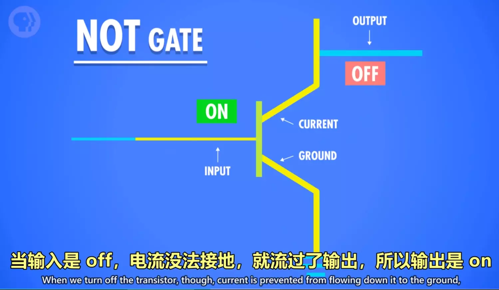

### 2）AND操作

1命名：AND门/与门

2作用：由2个输入控制输出，仅当2个输入input1和input2都为True时，输出才为True，2个输入的其余情况，输出均为False。*可以理解为，2句话（输入）完全没有假的，整件事（输出）才是真的。



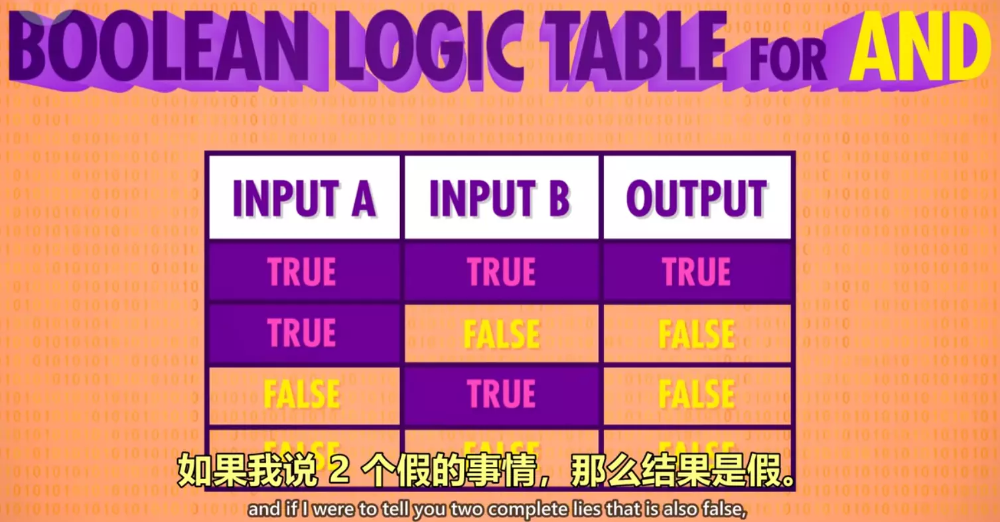

3用晶体管实现的方式：

串联两个晶体管，仅当2个晶体管都通电，输出才有电流（True）



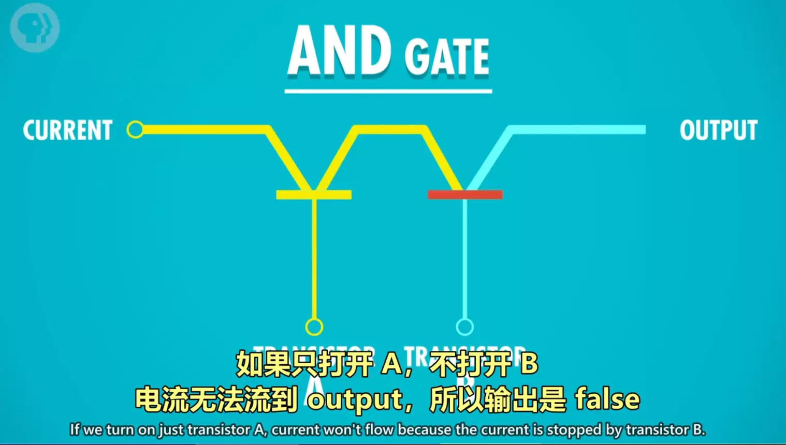

### 3）OR操作

1命名：OR门/或门

2作用：由2个输入控制输出，只要其中一个输入为True，则输出True。



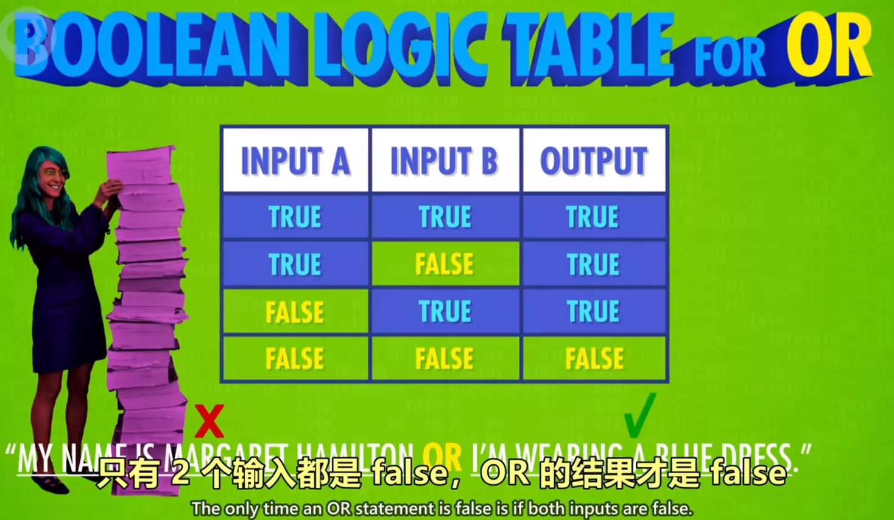

3用晶体管实现的方式：

使用2个晶体管，将它们并联到电路中，只要有一个晶体管通电，则输出有电流（True）。



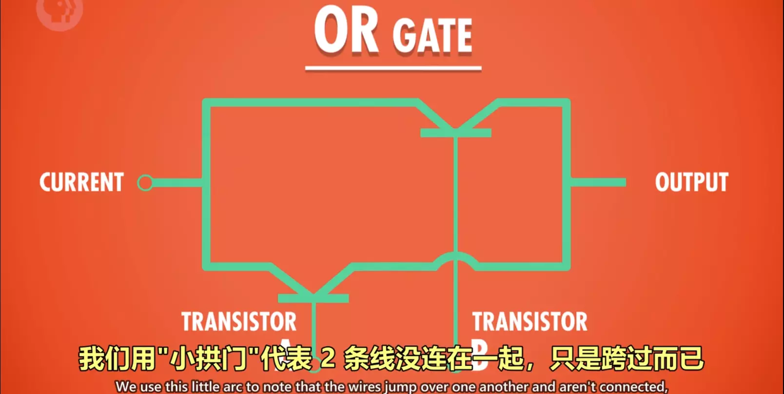

## 3、特殊的逻辑运算——异或

1命名：XOR门/异或门

2作用：2个输入控制一个输出。当2个输入均为True时，输出False，其余情况与OR门相同。



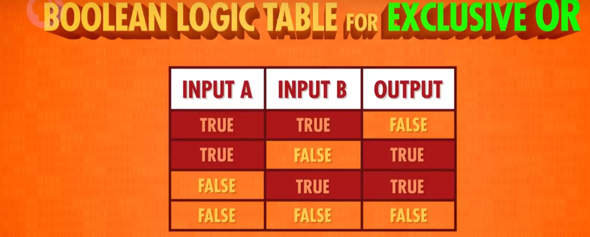

3图示：

先用一个OR门，将其与AND门并联，AND门与NOT门串联，最后让NOT与AND门并联，获得输出。



## 4、逻辑门的符号表示

1作用：将逻辑门简化，将逻辑门用于构建更大的组件，而不至于太复杂。

2图示：

- 非门：用三角形+圆圈表示

- 与门：用D型图案表示

- 或门：用类似D向右弯曲的图案表示

- 异或门：用或门+一个圆弧表示





## 5、抽象的好处

使得分工明确，不同职业的工程师各司其职,而不用担心其他细节。

# 第四课：二进制

## 1、二进制的原理，存储单元MB/GB/TB解释

0计算机中的二进制表示：

单个数字1或0，1位二进制数字命名为位(bit),也称1比特。

1字节（byte）的概念：

1byte=8bit，即1byte代表8位数字。最早期的电脑为八位的，即以八位为单位处理数据。为了方便，将八位数字命名为1字节（1byte）.

2十进制与二进制的区别：

- 十进制有10个数字，0-9，逢10进1（不存在10这个数字），则每向左进一位，数字大10倍。

- 二进制有2个数字，0-1，逢2进1,（不存在2这个数字），则每向左进一位，数字大2倍。

2如何进行二进制与十进制联系起来：

- 将十进制与二进制的位数提取出来，编上单位：

eg.二进制的1011=1*2^0 + 1*2^1 + 0*2^2 + 1*2^3= 11（从右往左数）

eg.十进制的1045= 1*10^3 + 0*10^2 + 4*10^1 + 5*10^0

3十进制与二进制的图示：

十进制的263

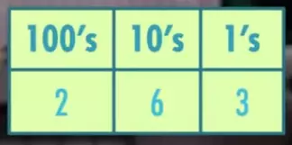

二进制的10110111

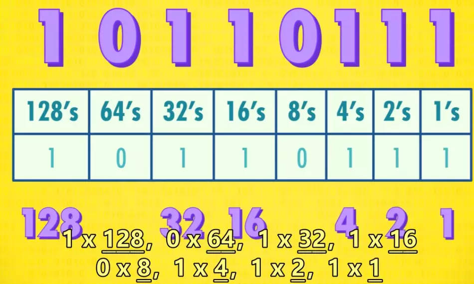

4二进制的运算：

相同的位数相加，逢2进1



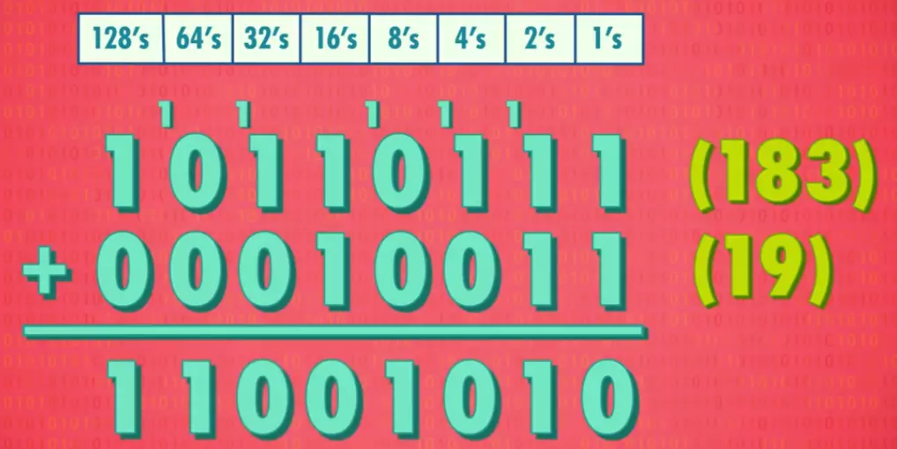

5 byte在电脑中的单位换算：

1kb=2^10bit = 1024byte =1000b

1TB=1000GB

1GB=十亿字节=1000MB=10^6KB

6 32位与64位电脑的区别

32位的最大数为43亿左右

64位的最大数为9.2*10^18

## 2、正数、负数、正数、浮点数的表示

1）计算机中表示数字的方法

1整数：

表示方法:

- 第1位：表示正负 1是负，0是正（补码）

- 其余31位/63位： 表示实数

2浮点数（Floating Point Numbers）：

定义：小数点可在数字间浮动的数（非整数）

表示方法：IEEE 754标准下

用类似科学计数法的方式，存储十进制数值

- 浮点数=有效位数*指数

- 32位数字中：第1位表示正负，第2-9位存指数。剩下23位存有效位数

eg.625.9=0.6259（有效位数）*10^3（指数）

## 3、美国信息交换标准代码-ASCⅡ，用来表示字符

1全称：美国信息交换标准代码

2作用：用数字给英文字母及符号编号

3内容：7位代码，可存放128个不同的值。

4图示：



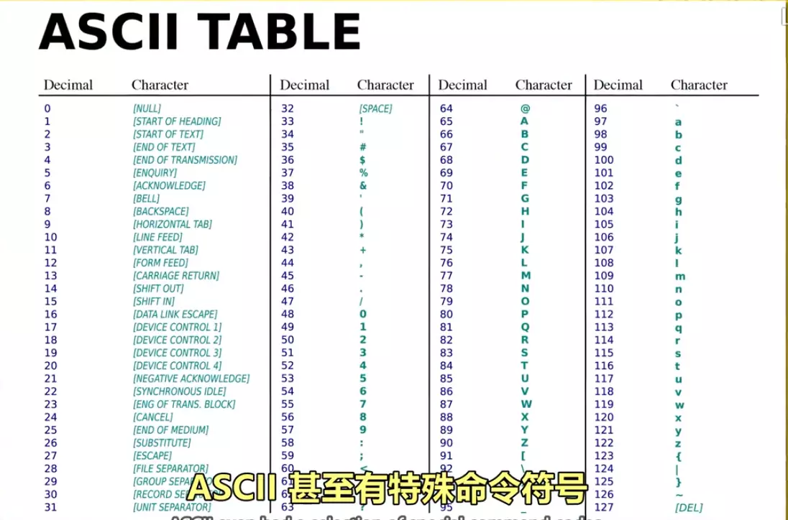

## 4、UNICODE，统一所有字符编码的标准

1诞生背景：1992诞生，随着计算机在亚洲兴起，需要解决ASCⅡ不够表达所有语言的问题。

为提高代码的互用性，而诞生的编码标准。

2内容：UNICODE为17组的16位数字，有超过100万个位置，可满足所有语言的字符需求。

# 第五课：算术逻辑单元

## 1、什么是算术逻辑单元

1命名：简称ALU，Arithmetic&Logic Unit

2组成：ALU有2个单元，1个算术单元和1个逻辑单元（Arithmetic Unit和Logic Unit）

3作用：计算机中负责运算的组件，处理数字/逻辑运算的最基本单元。

## 2、算术单元

1）基本组件：

- 由半加器、全加器组成

- 半加器、全加器由AND、OR、NOT、XOR门组成

2）加法运算

1组件：AND、OR、NOT、XOR门

2元素：输入A，输入B，输出（均为1个bit，即0或1）

3半加器：

- 作用：用于计算个位的数字加减。

- 输入：A，B

- 输出：总和，进位

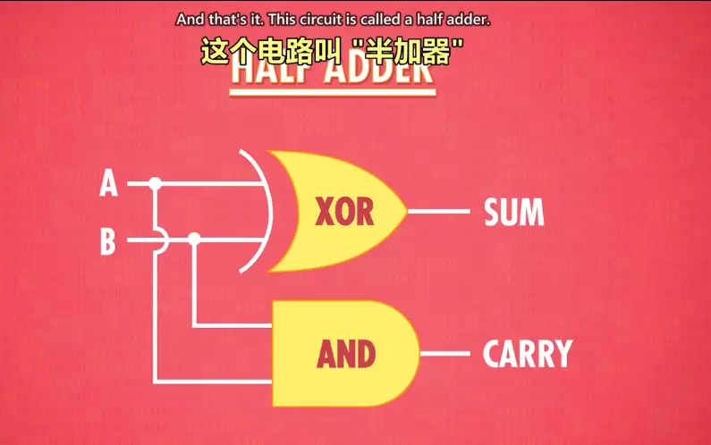

- 抽象：

4全加器：

作用：用于计算超过1位的加法，由于涉及进位，因此有3个输入（C充当进位）。

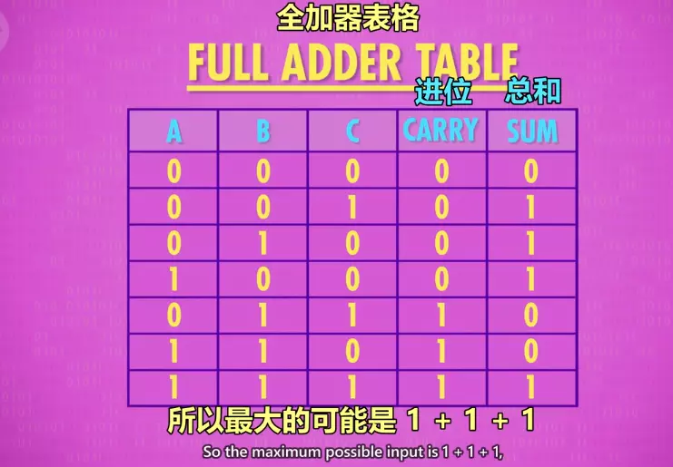

原理图示：

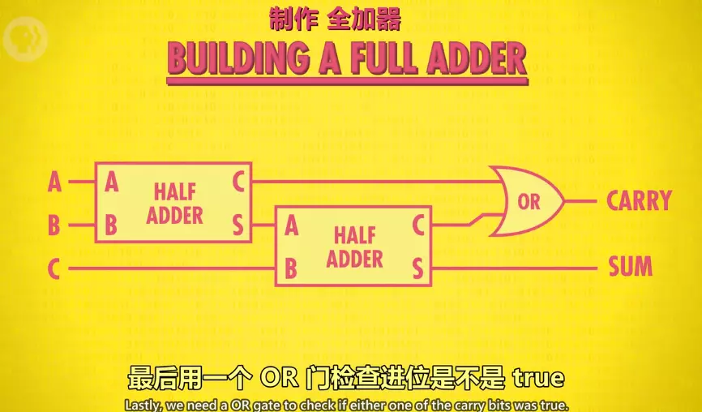

3）如何用半加器与全加器做8位数的加法

1说明：以8位行波加法器为例

1. 用半加器处理第1位数（个位）的加法，得到的和为结果的第1位。

1. 将输出的进位，输入到第2位用的全加器的输入C中。

1. 将第2位的2个数用全加器计算，得到的和为结果的第2位（sum）。

1. 将第2位计算的进位连接到百位的全加器输入C中。

1. 在第3-8位上，循环第3-4步的操作。

*现在电脑使用的加法器叫“超前进位加法器”

4）算术单元支持的其他运算

## 3、溢出的概念

内容：在有限的空间内，无法存储位数过大的数，则称为溢出。

说明：第8位的进位如果为1，则无法存储，此时容易引发错误，所以应该尽量避免溢出。

## 4、逻辑单元

作用：执行逻辑操作，如NOT、AND、OR等操作，以及做简单的数值测试。

## 5、ALU的抽象

1）作用：ALU的抽象让工程师不再考虑逻辑门层面的组成，简化工作。

2）图示：

像一个大“V”。

3）说明：

图示内容包括：

- 输入A，B

- 输出

- 标志：溢出、零、负数



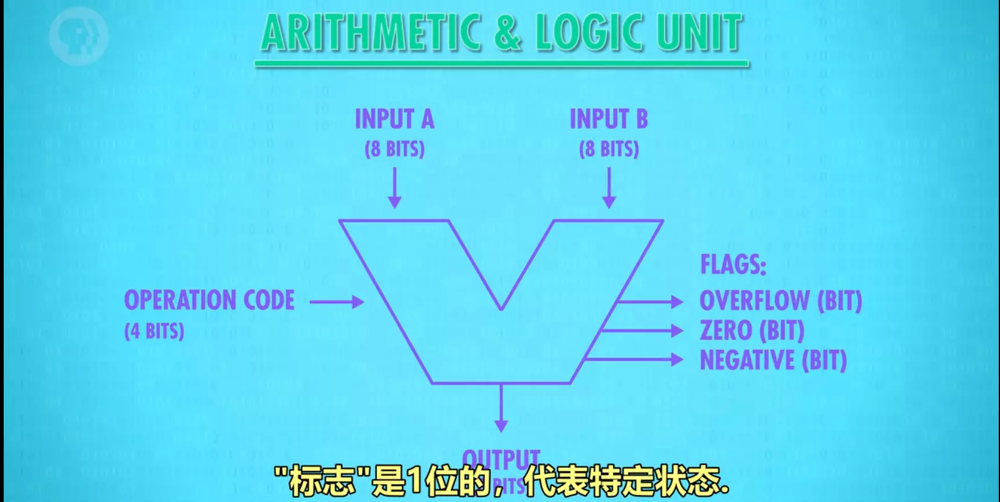

# 第六课 寄存器与内存

## 0、课程导入

当玩游戏、写文档时如果断电，进度会丢失，这是为什么？

- 原因是这是电脑使用的是RAM（随机存取存储器），俗称内存，内存只能在通电情况下存储数据。

- 本节课程将讲述内存的工作原理。

## 1、概念梳理

锁存器：锁存器是利用AND、OR、NOT逻辑门，实现存储1位数字的器件。

寄存器：1组并排的锁存器

矩阵：以矩阵的方式来存放锁存器的组合件，n*n门锁矩阵可存放n^2个锁存器，但同一时间只能写入/读取1个数字。（早期为16*16矩阵）

位址：锁存器在矩阵中的行数与列数。eg.12行 8列

多路复用器：一组电线，输入2进制的行址&列址，可启用矩阵中某个锁存器

内存（RAM）：随机存取存储器，由一系列矩阵以及电路组成的器件，可根据地址来写入、读取数据。类似于人类的短期记忆，记录当前在做什么事情。

## 2、锁存器

作用：存储1位数字。

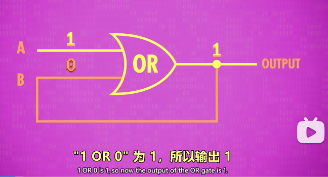

图示：

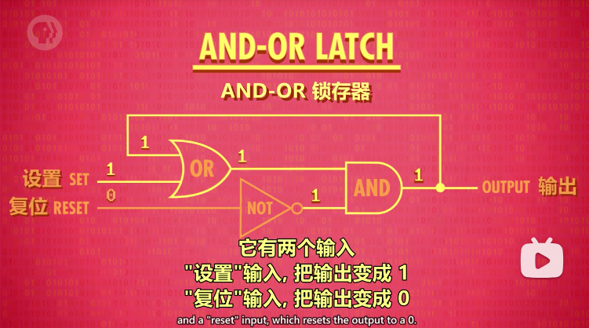

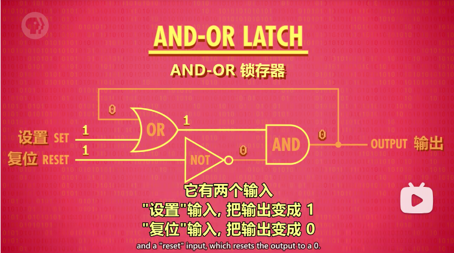

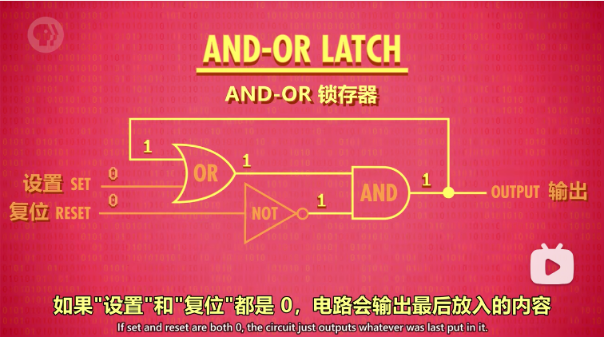

## 2.5、门锁：

锁存器需要同时输入2个数字，不太方便。

为了使用更方便，只用1根电线控制数据输入，发展了门锁这个器件。另外，用另一根电线来控制整个结构的开关。（和复位作用不同）

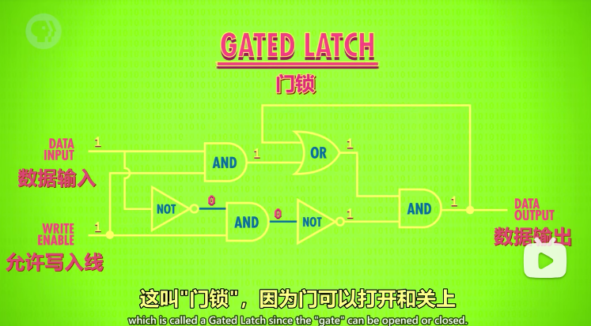

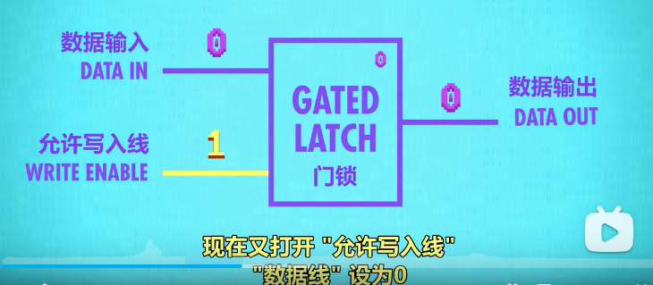

## 3、寄存器

作用：并排使用门锁，存储多位数字

图示：



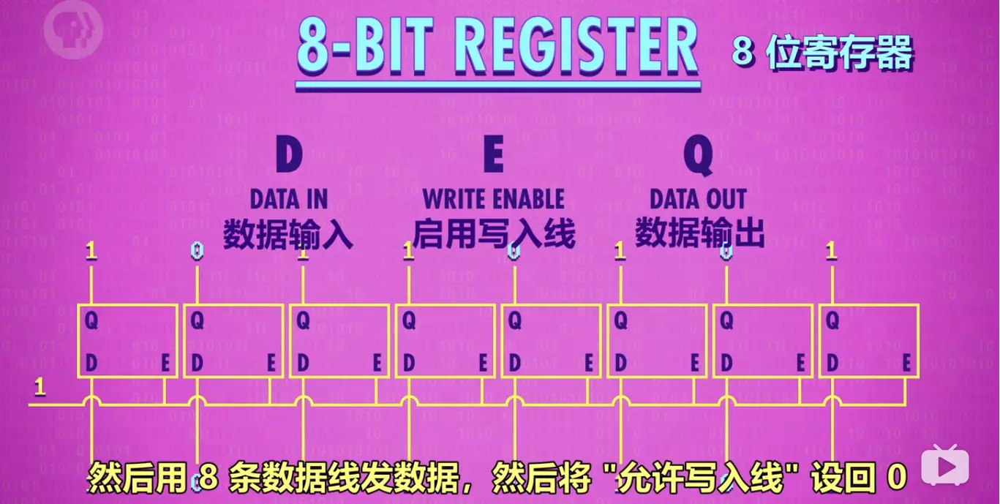

## 4、门锁矩阵

作用：

n*n的矩阵有n^2个位址，则可以存储n^2个数。但1个矩阵只可记录1位数字，n个矩阵组合在一起，才可记录n位数。如1个8位数，会按位数分成8个数，分别存储在8个矩阵的同一个位址中。

8个矩阵，则可以记录256个8位数字。

通俗理解：

16*16的门锁矩阵，可理解为1个公寓，1个公寓256个房间。

8个门锁矩阵并排放，则有了8个公寓。

规定每一个公寓同一个编号的房间，都有一样的标记（地址），共同组成8位数字。

那么8个公寓就能存 （8*256 / 8）个数字。

原因：

16*16的门锁矩阵虽然有256个位置，但每次只能存/取其中1个位置的数字。因此，要表示8位数字，就需要同时调用8个门锁矩阵。

图示：





使用方法：在多路复用器中输入位址，x行x列（2进制），即可点亮x行x列的锁存器。

举例：

| 行列数 | 矩阵1 | 矩阵2 | 矩阵3 | 矩阵4 | 矩阵5 | 矩阵6 | 矩阵7 | 矩阵8 |
| ------ | ----- | ----- | ----- | ----- | ----- | ----- | ----- | ----- |
| 1行5列 | 1     | 0     | 1     | 1     | 0     | 0     | 1     | 0     |
| 2行3列 | 0     | 1     | 0     | 0     | 1     | 1     | 0     | 1     |

## 5、内存

粗略定义：将一堆独立的存储模块和电路看做1个单元，组成内存方块，n个内存方块组成内存模块。在一个电路板上所有的内存方块统称为内存(RAM)。

图示：



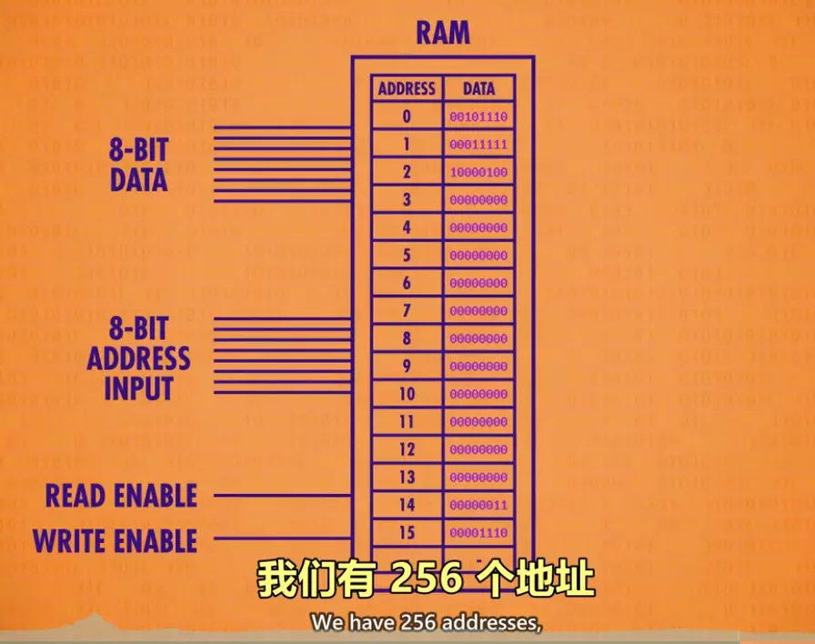

# 第七课 中央处理器（CPU）

## 1、概念梳理

- CPU（Central Processing Unit）：中央处理单元，负责执行程序。通常由寄存器/控制单元/ALU/时钟组成。与RAM配合，执行计算机程序。CPU和RAM之间用“地址线”、“数据线”和“允许读/写线”进行通信。

- 指令：指示计算机要做什么，多条指令共同组成程序。如数学指令，内存指令。

- 时钟：负责管理CPU运行的节奏，以精确地间隔，触发电信号，控制单元用这个信号，推动CPU的内部操作。

- 时钟速度：CPU执行“取指令→解码→执行”中每一步的速度叫做“时钟速度”，单位赫兹Hz，表示频率。

- 超频/降频：

- 超频，修改时钟速度，加快CPU的速度，超频过多会让CPU过热或产生乱码。

- 降频，降低时钟速度，达到省电的效果，对笔记本/手机很重要。

- 微体系框架：以高层次视角看计算机，如当我们用一条线链接2个组件时，这条线只是所有必须线路的抽象。

## 2、CPU工作原理

### 1）必要组件：

- 指令表：给CPU支持的所有指令分配ID

- 控制单元：像指挥部，有序的控制指令的读取、运行与写入。

- 指令地址寄存器：类似于银行取号。该器件只按顺序通报地址，让RAM按顺序将指令交给指令寄存器。

- 指令寄存器：存储具体的指令代码。



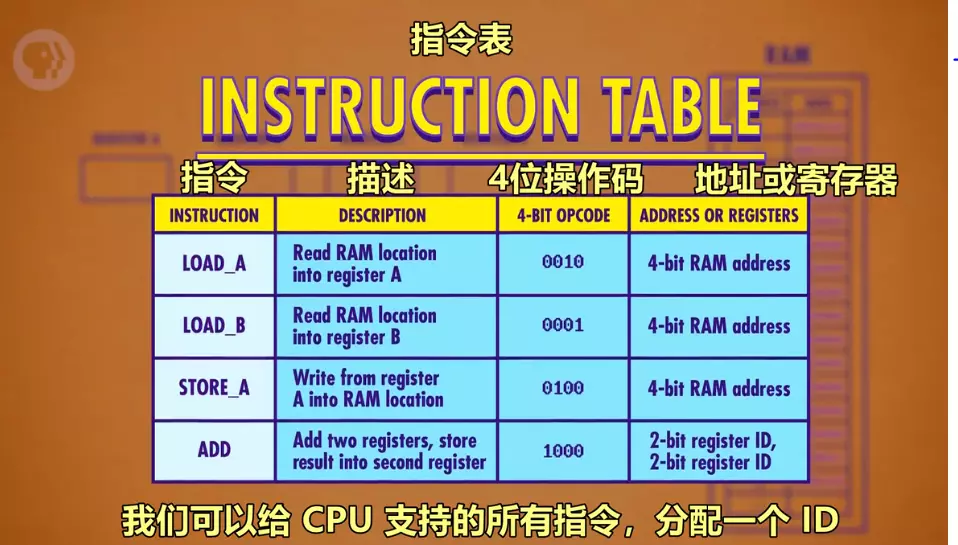

### 2）过程

- 取指令：指令地址寄存器发地址给RAM→RAM发该地址内的数据给指令寄存器→指令寄存器接受数据

- 解码：指令寄存器根据数据发送指令给控制单元 →控制单元解码（逻辑门确认操作码）

- 执行阶段：控制单元执行指令(→涉及计算时→调用所需寄存器→传输入&操作码给ALU执行）→调用RAM特定地址的数据→RAM将结果传入寄存器→指令地址寄存器+1

### 3）图示：

第一个CPU



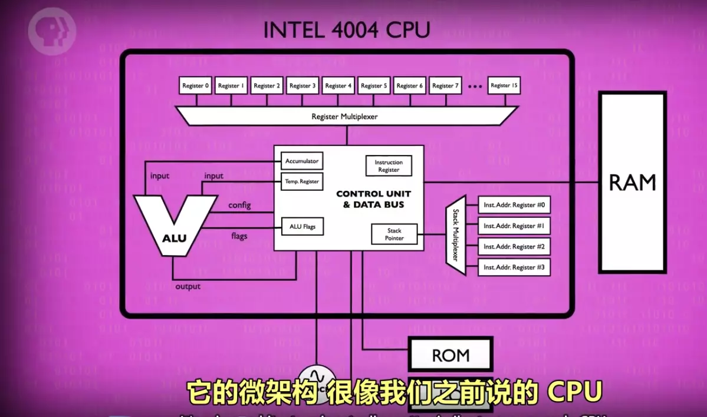

# 第八课 指令和程序

## 1、概念梳理

- 指令：指示计算机要做什么的代码（机器码），多条指令共同组成程序。如数学指令，内存指令。

- 注:指令和数据都是存在同一个内存里的。

- 指令集：记录指令名称、用法、操作码以及所需RAM地址位数的表格。



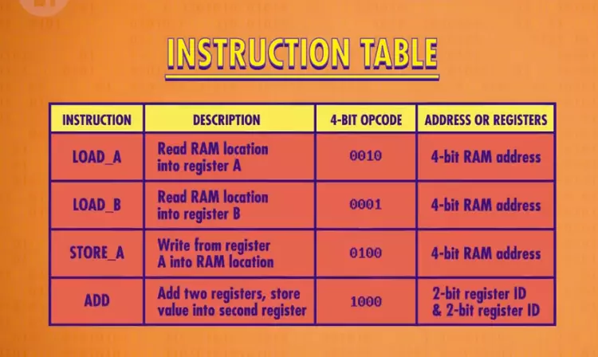

程序

## 2、指令的执行

- 原则：

- RAM每一个地址中，都存放0或1个数据。

- 特定的数字组合，就表示为一个指令，否则表示一个值。

- LOAD指令：

- 计算机会按地址的顺序，读取RAM中所记录的指令/数据。

- 计算机接受到指令后，如LOAD_A，则通过数据线将数据传至寄存器A。



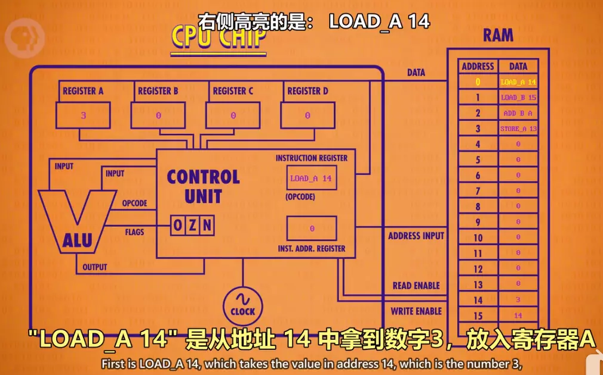

- ADD指令：

- ADD B A指令告诉ALU，把寄存器B和寄存器中的数字加起来，存到寄存器A中。

- JUMP指令：

- 遇到JUMP指令，程序会跳转至对应的RAM地址读取数据。

- JUMP指令可以有条件跳转（如JUMP-negative），也可以无条件跳转。

## 3、计算机指令长度

由于早期计算机每个字只有8位，指令只占4位，意味着只能有16个指令，这远远不够。

现代计算机有两种方式解决指令不够用的问题：

最直接的是用更多位来表示指令，如32位或64位。

采用“可变指令长度”，令不同的指令的长度不同，尽量节约位数。

假设1个字为16位，如果某指令不需要操作内存，则可以省去寻址的位数。

该情况下，部分指令后面需要跟数据，如JUMP，称为立即值。

# 第九课 高级CPU设计

## 0、概念梳理

- 缓存：在CPU中的小块RAM，用于存储批量指令。

- 缓存命中：想要的数据已经在缓存里

- 缓存未命中：想要的数据不在缓存里

- 脏位：缓存里每块空间，有个特殊标记，叫脏位，用于检测缓存内的数据是否与RAM一致。

- 多核处理器：一个CPU芯片中，有多个独立处理单元。

## 1、现代CPU如何提升性能：

早期通过加快晶体管速度，来提升CPU速度。但很快该方法到达了极限。

后来给CPU设计了专门除法电路+其他电路来做复杂操作：如游戏，视频解码

## 2、缓存：

为了不让CPU空等数据，在CPU内部设置了一小块内存，称为缓存，让RAM可以一次传输一批数据到CPU中。（不加缓存，CPU没位置放大量数据）

缓存也可以当临时空间，存一些中间值，适合长/复杂的运算。

空等原因：从RAM到CPU的数据传输有延迟（要通过总线，RAM还要时间找地址、取数据、配置、输出数据）。

## 3、缓存同步：

缓存同步一般发生在CPU缓存已满，但CPU仍需往缓存内输入数据。此时，被标记为脏位的数据会优先传输回RAM,腾出位置以防被覆盖，导致计算结果有误。

## 4、指令流水线：

作用：让取址→解码→执行三个步骤同时进行。并行执行指令，提升CPU性能。

原本需要3个时钟周期执行1个指令，现在只需要1个时钟周期。

设计难点：数据具有依赖性。

数据依赖性解决方法：

动态排序、乱序运行、预测分支（高端CPU）



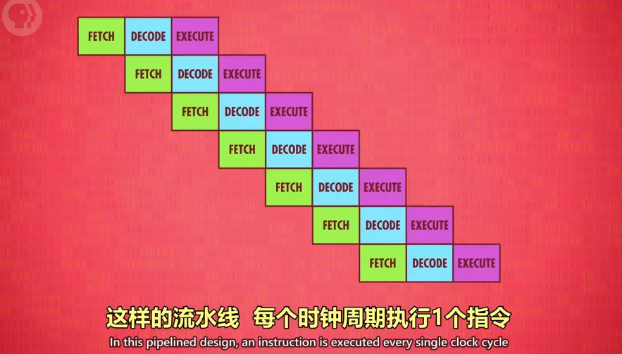

## 5、一次性处理多条指令



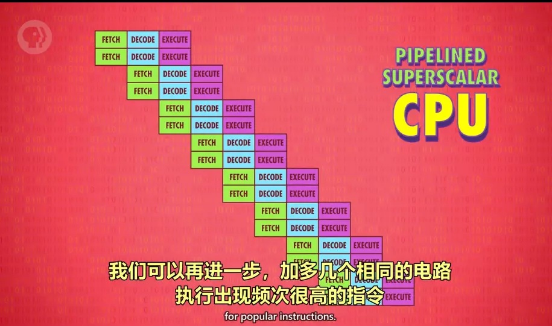

## 6、同时运行多个指令流（多核CPU）

多核处理器：一个CPU芯片中，有多个独立处理单元。但因为它们整合紧密，可以共享一些资源。

## 7、超级计算机（多个CPU）

在一台计算机中，用无数个CPU，做怪兽级的复杂运算，如模拟宇宙形成。

# 第十课 早期的编程方式

## 1、早期，程序如何进入计算机

程序必须人为地输入计算机。早期，电脑无内存的概念，人们通过打孔纸卡等物理手段，输入数据（数字），进入计算机。

## 2、早期计算机的编程

- 打孔纸卡/纸带：在纸卡上打孔，用读卡器读取连通电路，进行编程。原因，穿孔纸卡便宜、可靠也易懂。62500张纸卡=5MB数据

- 插线板：通过插拔线路的方式，改变器件之间的连接方式，进行编程。

- 面板拨开关（1980s前）：通过拨动面板上的开关，进行编程。输入二进制操作码，按存储按钮，推进至下一个内存位，直至操作完内存，按运行键执行程序。（内存式电脑）

## 3、现代计算机基础结构——冯诺依曼计算机

冯诺依曼计算机的标志是，一个处理器(有算术逻辑单元)+数据寄存器+指令寄存器+指令地址寄存器+内存

# 第十一课 编程语言发展史

## 0、概念梳理

伪代码：用自然语言（中文、英语等）对程序的高层次描述，称为“伪代码”

汇编器：用于将汇编语言装换成机器语言。一条汇编语句对应一条机器指令。

助记符（汇编器）：

软件

## 1、早期二进制写代码

先前都是硬件层面的编程，硬件编程非常麻烦，所以程序员想要一种更通用的编程方法，就是软件。

早期，人们先在纸上写伪代码，用"操作码表"把伪代码转成二进制机器码，翻译完成后，程序可以喂入计算机并运行。

## 2、汇编器&助记符

背景：1940~1950s，程序员开发出一种新语言， 更可读 更高层次。每个操作码分配一个简单名字，叫"助记符"。但计算机不能读懂“助记符”，因此人们写了二进制程序“汇编器来帮忙”

作用：汇编器读取用"汇编语言"写的程序，然后转成"机器码"。

## 3、最早高级编程语言“A-0”

汇编只是修饰了一下机器码，一般来说，一条汇编指令对应一条机器指令，所以汇编码和底层硬件的连接很紧密，汇编器仍然强迫程序员思考底层逻辑。

1950s，为释放超算潜力，葛丽丝·霍普博士，设计了一个高级编程语言，叫 "Arithmetic Language Version 0"，一行高级编程语言 可以转成几十条二进制指令。但由于当时人们认为，计算机只能做计算，而不能做程序，A-0未被广泛使用。

过程：高级编程语言→编译器→汇编码/机器码

## 4、开始广泛应用的高级编程语言FORTRAN

1957年由IBM1957年发布，平均来说，FORTRAN 写的程序，比等同的手写汇编代码短 20 倍， FORTRAN 编译器会把代码转成机器码。

## 5、通用编程语言——COBOL

1959年，研发可以在不同机器上通用编程语言。

最后研发出一门高级语言："普通面向商业语言"，简称 COBOL

每个计算架构需要一个 COBOL 编译器，不管是什么电脑都可以运行相同的代码，得到相同结果。

## 6、现代编程语言:1960s-2000

1960s起，编程语言设计进入黄金时代。

1960 ：LGOL, LISP 和 BASIC 等语言

70年代有：Pascal，C 和 Smalltalk

80年代有：C++，Objective-C 和 Perl

90年代有：Python，Ruby 和 Java

2000: Swift ,  C# , Go,

## *7、安全漏洞&补丁由来：

在1940年代，是用打孔纸带进行的，但程序出现了问题（也就是漏洞），为了节约时间，只能贴上胶带也就是打补丁来填补空隙，漏洞和补丁因此得名。

# 算法

算法的复杂度用O来表示,越大计算越复杂

排序算法

图搜索算法 , 导航计算最短路线

# 数据结构

数组 

链表

队列: 先进先出,FIFO

栈: 先进后出

二叉树: binary tree

没有子节点的节点称为叶节点,表示处于最末端

红黑树:

堆:

# 软件工程

函数 封装

面向对象

API 

文档和注释

版本控制

质量控制QA

Beta,Alpha 公开测试版本

# 集成电路&摩尔定律

分立原件,一个一个拼接在一起 (原始且体积庞大)

集成电路,将晶体管集成到一个电路板上(仅能做到有限密度的集成)

光刻晶圆 (现代CPU)

**制作流程:**

晶圆 + 氧化层(保护层) + 光刻胶 + 光掩膜 => 光刻  + 化学清洗 ( 循环流程 )
晶圆 + 氧化层(保护层) + 光刻胶 + 金属层 + 光掩膜 => 光刻  + 化学清洗 ( 循环流程 )

晶体管越小,要移动的电荷量就越少,能更快切换状态,耗电更少;信号延迟更低,可以使得时钟速度更快

Intergrated Electronics = intel

**摩尔定律的终结快要接近了:**

 1, 光掩膜把图案投射到晶圆上,因为光的波长,精度已达极限,所以需要研制波长更短的光源,投射更高的精度;

2,当晶体管非常小,电极之间可能只距离几个原子,电子会跳过间隙,这叫量子隧道穿越效应,导致门电路的失效

#  操作系统

OS

动态内存分配

 内存地址虚拟化

内存保护

多任务

# 内存&储存介质

纸卡

延迟线存储器

磁芯

磁带

磁鼓

硬盘

内存层次结构

软盘

光盘

固态硬盘 SSD

**SSD固态硬盘是把磁存储改为集成电路存储**

固态硬盘存储数据的基本单元叫**浮栅晶体管**，基本结构有：**存储电子的浮栅****层，控制极G、衬底P、源极D与漏极S。

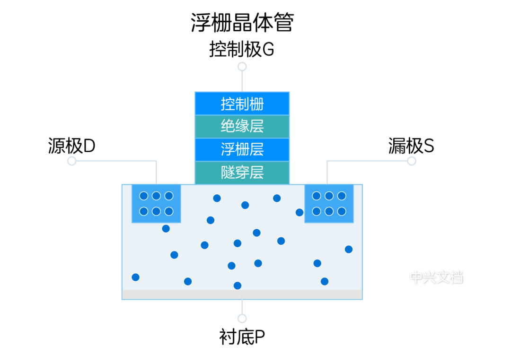**

我们将浮栅层中的电子数量高于一定值计为0，低于一定值计为1。

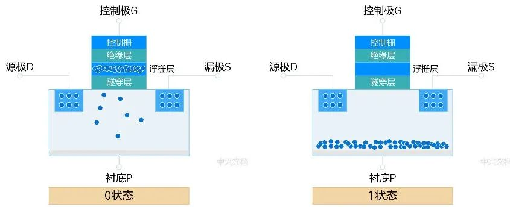

# 文件系统

TXT

wav

bmp

文件系统:很早起时空间小,整个存储器就像一整个文件,后来随容量增长,多文件非常必要

目录文件

多层文件目录系统

# 压缩

先扫描图片的重复频率,得到从最高频到最低频的二叉树形结构,然后按照树形结构赋予编码,这样编码不会重复,不会前缀嵌套;

压缩文件包含整个临时生成的编码字典,和压缩后的字节码;解压时按照编码字典解压缩字节码,得到无损原文件

jpeg , wav 采用的是有损压缩, 抹去了人类肉眼不易察觉的变化, 听觉无法感知的超声波等 

# 命令行界面 keyboard & command

人机交互

电传打字机

命令行界面    ls 命令  cd 命令

# 屏幕&2D图形显示

# 冷战和消费主义

# 个人计算机革命

1970年代,计算机成本下降,个人计算机变得可行

比尔盖茨和保罗艾伦写BASIC解释器
乔布斯组装APPLE-1 

#  图形用户界面

施乐 创造了用户图形界面, mac window 紧随其后

# 3D图形

正交投影

透视投射

纹理映射

图形处理单元 GPU

# 计算机网络

局域网 Local Area Networks - LAN

MAC 媒体访问控制地址 Media Access Control address

指数退避

冲突域

电路交换  报文交换  分组交换

# 互联网

IP  Internet Protocol 互联网协议

UDP 用户数据报协议 User Datagram Protocol

检验和 - Checksum

TCP - 传输控制协议  Transmission Control Protocol

DNS - 域名系统 Domain Names System

OSI - 开放式系统互联通信参考模型 Open System Interconnection

# 计算机安全

# 黑客&攻击

# 加密

密码学,偏移量,矩阵偏移
AES
RSA

# 机器学习&人工智能

# 计算机视觉

# 自然语言处理

# 机器人

# 计算机心理学

# 教育科技

# 奇点,天网,计算机的未来

