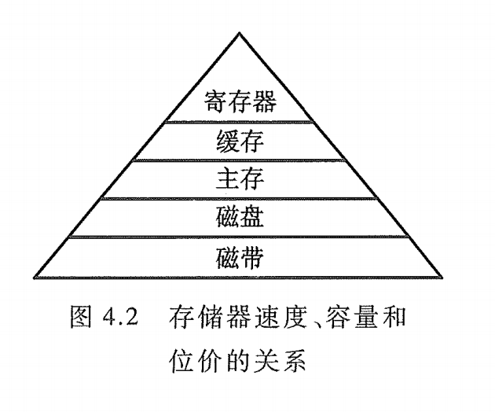
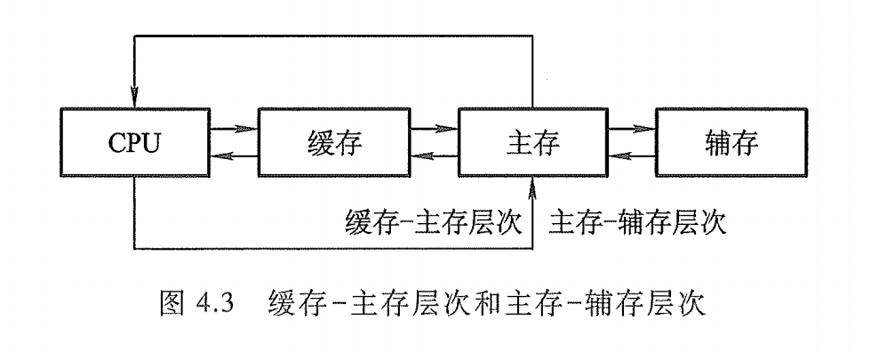
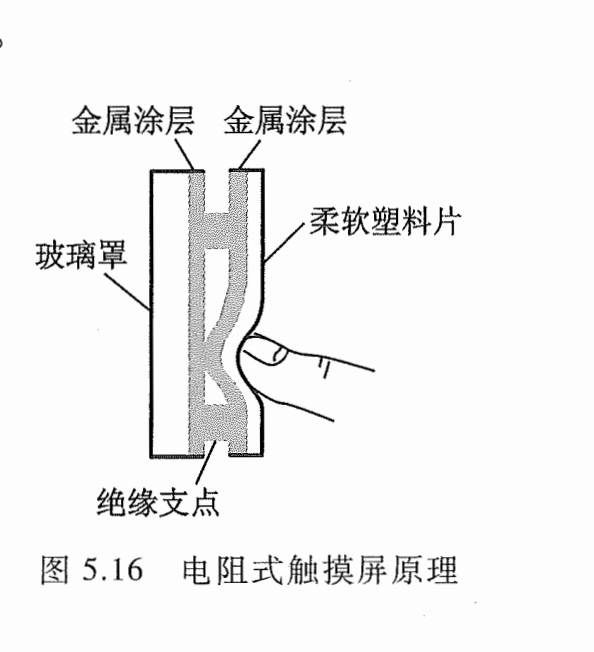
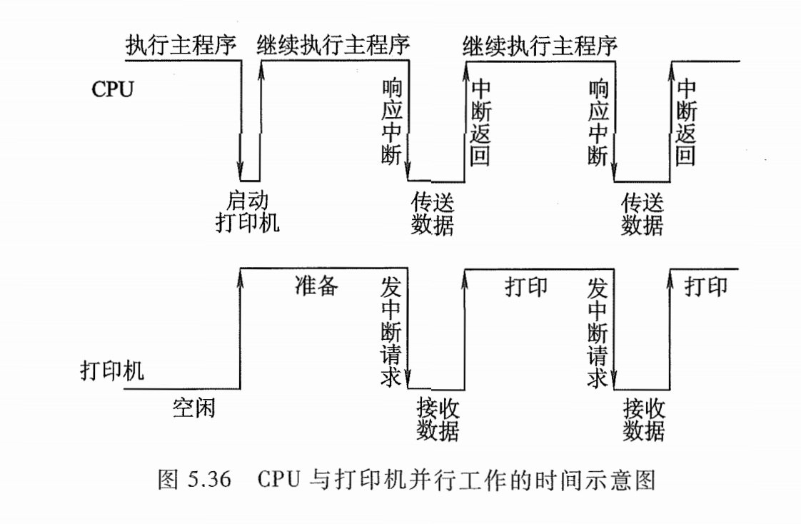
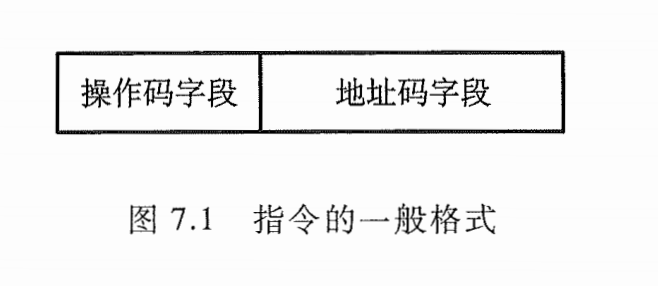
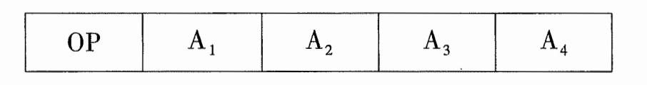
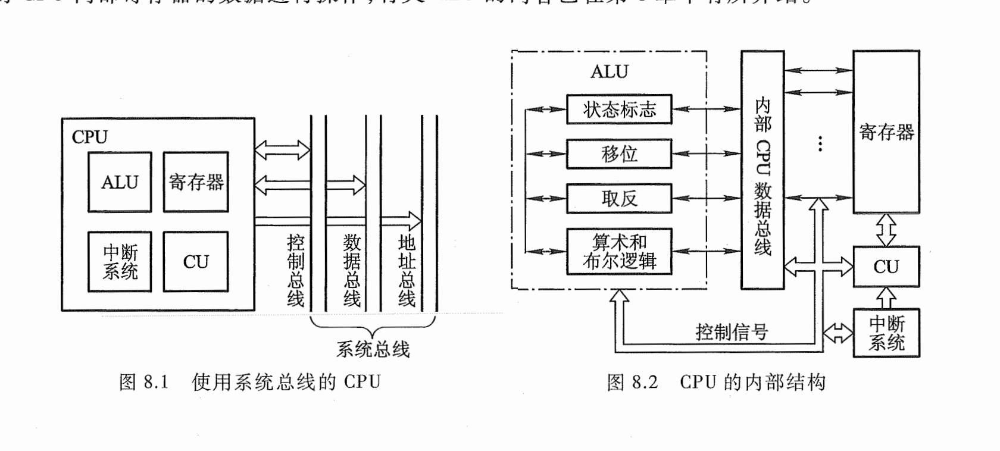
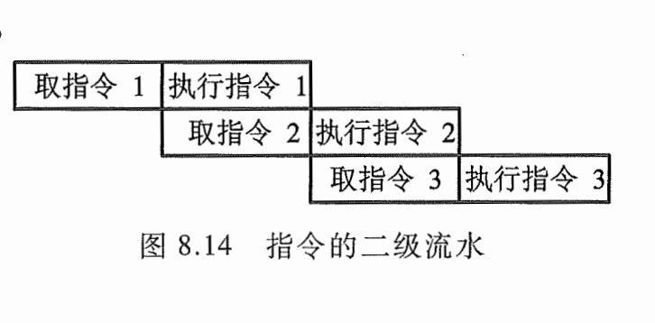
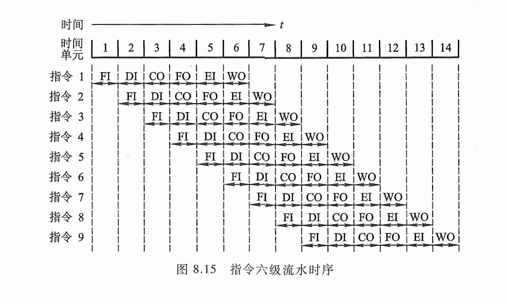
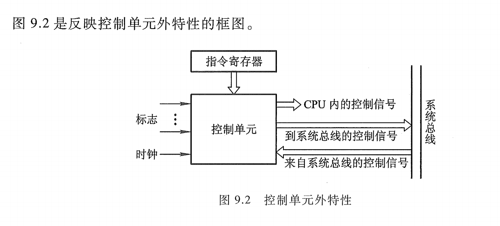

**计算机组成原理(第三版) - 唐朔飞**

# 概论

---

## 计算机系统概论

现代计算机的解题过程如下。
通常由用户用高级语言编写程序（称为源程序），然后将它和数据一起送入计算机内，再由计算机将其翻译成机器能识别的机器语言程序（称为目标程序），
机器自动运行该机器语序，并将计算结果输出。

实际上，早期的计算机只有机器语言（用 代码表示的语言），用户必须用二进制代码 (0 1 来编写程序（即机器语言程序）。这就要求程序员对他们所使用的计算机硬件及其指令系统十分熟悉，编写程序难度很大，操作过程也极容易出错。但用户编写的机器语言程序可以机器上执行。

20 世纪 50 年代开始出现了符号式的程序设计语言，即汇编语言。必须先将汇编语言程序翻译成机器语言程序，然后才能被机器接受并自动运行。这个翻译过程是由机器系统软件中的汇编程序来完成的。

### **翻译程序**

通常，将高级语言程序翻译成机器语言程序的软件称为翻译程序。翻译程序有两种：一种是编译程序，另一种是解释程序。

**编译程序 **是将用户编写的高级语言程序（源程序）的全部语句一次性全部翻译成机器语言程序，而后再执行机器语言程序。因此，只要源程序不变，就无须再次进行翻译。

(Go 通过 go build 编译 , C语言 通过 gcc test.c -o test 编译)

**解释程序** 是将源程序的一条语旬翻译成对应于机器语言的一条语旬，并且立即执行这条语旬，接着翻译源程序的下一，并执行这条语旬，如此重复直至完成源程序的全部翻译任务。它的特点是翻译一次执行一次，即使下一次重复执行该语旬时，也必须重新翻译。

(JAVA虚拟机,java半编译语言,编译后的字节码仍然需要通过jvm虚拟机解释执行; 
PHP PHP解释器会将PHP代码解释为opcode之后再交由Zend引擎执行;
Node.js 通过node解释器解释执行;
当我们编写Python代码时，我们得到的是一个包含Python代码的以`.py`为扩展名的文本文件。要运行代码，就需要Python解释器去执行`.py`文件。在计算机内部，Python解释器把源代码转换成称为字节码的中间形式，然后再把它翻译成计算机使用的机器语言并运行。)

### 计算机的基本组成

1945 年数学家冯·诺依曼提出了“存储程序”的概念。以此概念为基础的各类计算机通称为冯·诺依曼机。它的特点可归结如下：
计算机由**运算器、存储器、控制器、输入设备和输出设备**五大部件组成又称五大子系统。
指令和数据以同等地位存放于存储器内，并可按地址寻访。
指令和数据均用二进制数表示。
指令由操作码和地址码组成，操作码用来表示操作的性质，地址码用来表示操作数在存储器中的位置。
指令在存储器内按顺序存放。通常，指令是顺序执行的，在特定条件下，可根据运算结果或根据设定的条件改变执行顺序。
机器以运算器为中心，输入输出设备与存储器间的数据传送通过运算器完成。

由于**运算器**和**控制器**在逻辑关系和电路结构上联系十分紧密，尤其在大规模集成电路制作工艺出现后，这两大部件往往集成在同一芯片上，因此，通常将它们合起来统称为中央处理器(Central Processing Unit, CPU) 。

**算术逻辑单元** (Arithmetic Logic Unit, **ALU**) 简称算逻部件，用来完成算术逻辑运算。
**控制单元**(Control Unit, **CU**) 用来解释存储器中的指令，并发出各种操作命令来执行指令。 ALU CU 是CPU 的核心部件。
I/O 设备也受 CU 控制，用来完成相应的输入、输出操作。可见，计算机有条不紊地自动工作都是在控制器统一指挥下完成的。

设某机的指令字长为 16 位，其中操作码占 位，地址码占 10 位.
**操作码 **表示机器所执行的各种操作，如取数、存数、加、减、乘、除、停机、打印等。
**地址码 **表示参加运算的数在存储器内的位置。 
机器指令的操作码和地址码都采用代码的组合来表示。

**主存储器**（简称主存或内存）包括存储体 、各种逻辑部件及控制电路等.
存储体由许多存储单元组成，每个存储单元又包含若干个存储元件（或称存储基元、存储元），每个存储元件能寄存一位二进制代码 “0” “1” 。
如果把一个存储体看作一幢大楼，那么每个存储单元可看作大楼中的每个房间，每个存储元可看作每个房间中的一张床位，床位有人相当于 “1” ，无人相当于 “0” 。床位数相当于存储字长。显然，每个房间都需要有一个房间编号，同样可以赋予每个存储单元一个编号，称为存储单元的地址号。

主存的工作方式就是按存储单元的地址号来实现对存储字各位的存（写入）、取（读出）。这种存取方式称为按地址存取方式，即按地址访间存储器（简称访存）

**运算器** 最少包括 个寄存器（现代计算机内部往往设有通用寄存器组）和一个算术逻辑单(ALU) 。其中 ACC (Accumulator) 为累加器， MQ (Multiplier-Quotient Register) 为乘商寄存器，为操作数寄存器。这 个寄存器在完成不同运算时，所存放的操作数类别也各不相同。

**控制器** 是计算机的神经中枢，由它指挥各部件自动、协调地工作。具体而言，它首先要命令存储器读出一条指令，称为取指过程（也称取指阶段）。接着，它要对这条指令进行分析，指出该指令要完成什么样的操作，并按寻址特征指明操作数的地址，称为分析过程（也称分析阶段）。最后根据操作数所在的地址以及指令的操作码完成某种操作，称为执行过程（也称执行阶段）。

**I/O** 子系统包括各种 I/0 设备及其相应的接口。每一种 I/0 设备都由 I/0 接口与主机联系，它接收 CU 发出的各种控制命令，并完成相应的操作。例如，键盘（输入设备）由键盘接口电路与主机联系；打印机（输出设备）由打印机接口电路与主机联系。

### 计算机硬件的主要技术指标

**机器字长**
机器字长是指 CPU 一次能处理数据的位数，通常与 CPU 的寄存器位数有关。字长越长，数的表示范围越大，精度也越高。机器的字长也会影响机器的运算速度。倘若 CPU 字长较短，又要运算位数较多的数据，那么需要经过两次或多次的运算才能完成，这样势必影响机器的运算速度。

**存储容量**
存储器的容量应该包括主存容量和辅存容量。主存容量是指主存中存放二进制代码的总位数。即存储容量＝存储单元个数 存储字长

**运算速度**
计算机的运算速度与许多因素有关，如机器的主频、执行什么样的操作、主存本身的速度（主存速度快，取指、取数就快）等都有关. 现在机器的运算速度普遍采用单位时间内执行指令的平均条数来衡量，并用 MIPS (Million Instruction Per Second ，百万条指令每秒）作为计量单位。例如，某机每秒能执行 200 万条指令，则记作2 MIPS 。

## 计算机的发展及应用

---

### 计算机的产生和发展

#### 第一代 电子管计算机

谁也不曾想到，当初只是当作军事计算工具应用的电子计算机，在半个世纪中竟然会成为改变社会结构，乃至促使人们的工作和生活方式发生惊人变化的宠儿，真可谓 20 世纪下半世纪科技发展最有影响的发明，并且它还将继续影响着未来世界的变化，使数千年人类文明史中曾有过的各种神话般的幻想逐渐变为现实。

1943 年，第二次世界大战进入后期，因战争的需要，美国国防部批准了工程师提出的建造一台用电子管组成的电子数字积分机和计算机 ENIAC 的计划，用它来解决当时国防部弹道研究实验室 (BRL) 开发新武器的射程和检测模拟运算表的难题。当时，由于运算能力不足，该实验室无法在规定的时间内拿出准确的运算表，严重影响了新武器的制作。ENIAC 1946 年交付使用，其首要任务就是完成了一系列测定氢弹可靠性的复杂运算。

20 世纪 50 年代，美国出现了 Sperry 和 IBM 两大制造计算机的公司，后来又从 SpenT 公司分离出了 UNIVAC 子公司，他们控制着计算机市场。IBM 公司在 1953 年推出了首台存储程序的计算机 701 机，后来形成了 700/7000 系列，使 IBM 成为计算机制造商的绝对权威。

在 20 世纪 50 年代初，除美国外，英、法、苏联、日本、意大利等国都相继研制出本国的第一台电子计算机，我国也于1958 年研制成自己的第一台电子计算机。

#### 第二代 晶体管计算机

1947 年在贝尔实验室成功地用半导体硅作为基片，制成了第一个晶体管，它的小体积、低耗电以及载流子高速运行的特点，使真空管望尘莫及。进入 20 世纪 50 年代后，全球出现了一场以晶体管替代电子管的革命，计算机的性能有了很大的提高。

#### 第三代 集成电路计算机

仔细分析就会发现，计算机的数据存储、数据处理、数据传送以及各类控制功能基本上都是由具有布尔逻辑功能的各类门电路完成的，而大量的门电路又都是由晶体管、电阻、电容等搭接而成，因此，当集成电路制造技术出现后，可以利用光刻技术把晶体管、电阻、电容等构成的单个电路制作在一块极小（如几个平方微米）的硅片上。进一步发展，实现了将成百上千个这样的门电路全部制作在一块极小（如几个平方毫米）的硅片上，并引出与外部连接的引线，这样，一次便能制作成成百上千个相同的门电路，又一次大大地缩小了计算机的体积，大幅度下降了耗电量，极大地提高了计算机的可靠性。

### 微型计算机的出现和发展

集成电路技术把计算机的控制单元和算逻单元集成到一个芯片上，制成了微处理器芯片。1971 年，美国 Intel 公司 31 岁的工程师霍夫研制成世界上第一个 位的微处理器芯片 4004 ，集成300 个晶体管。随后，微处理器经历了 4位、 8位、 16 位、 32 位和 64 位几个阶段的发展，芯片的集成度和速度都有很大的提高。

从 21 世纪初来看，当前通用微处理器的发展重点将在以下几方面。

1. 进一步提高复杂度来提高处理器性能。
2. 通过线程／进程级并行性的开发提高处理器的性能，即通过开发线程级并行性 (Thread Level Parallelism, TLP) 或进程级并行性 (Process-Level Parallelism, PLP) 来提高性能，简化硬件设计。
3. 将存储器集成到处理器芯片内来提高处理器性能。
4. 发展嵌入式处理器。(如 手持、掌上、移动和网络 PC 要求具备虚存管理和标准的外围设备；手机和个人移动通信设备要求在具有高性能和数字信号处理能力的同时具有超低功耗；调制解调器、传真机和打印机要求低成本的处理器；机顶盒和 DVD 则要求高度的集成性；数字相机要求既有通用性又有图像处理力。

### 软件技术的兴起和发展

**机器语言**
在早期的计算机中，使用者必须根据机器自身能识别的语言 机器语言（机器指令）按解题要求编写出机器可直接运行的程序。

**汇编语言**
20 世纪 50代后，逐渐形成了符号语言和汇编语言，这种语言虽然可以不用 0/1 代码编程，改善了程序的可读性，但它们仍是面向机器的，即不同的机器各自有不同的汇编语言。为了使这种符号语言转变成机器能识别的语言，人们又创造了汇编程序，用于把汇编语言翻译成机器语言。

**高级语言**
为了摆脱对具体机器的依赖，在汇编语言之后又出现了面向问题的高级语言。使用高级语言编程可以不了解机器的结构，高级语言的语旬通常是一个或一组英语词汇，词义本身反映出命令的功能，它比较接近人们习惯用的自然语言和数学语言，使程序具有很强的可读性。

为了使高级语言描述的算法在机器上执行，同样需要有一个翻译系统，于是产生了编译程序和解释程序，它们能把高级语言翻译成机器语言。可见，随着各种语言的出现，汇编程序、编译程序、解释程序的产生，逐渐形成了软件系统。

随着计算机应用领域的不断扩大，外部设备的增多，为了使计算机资源让更多用户共享，又出现了操作系统。例如， DOS UNIXWindows 等。

软件
要求大量处理某些数据，建立和检索大量的表格。这些数据和表格按一定的规律组织起来，使用户使用更方便，千是出现了数据库。数据库和数据管理软件一起便组成了数据库管理系统。而且随着网络的发展，又产生了网络软件等。以上所述的各种软件均属千系统软件，而软件发展的另一个主要内容就是应用软件。应用软件种类繁多，它是用户在各自的行业中开发和使用的各种程序。如各种财务软件、办公用的文字处理和排版软件、帮助管理日常业务工作和图文报表的“电子表格”和“数据库“软件、帮助工程设计的 CAD 软件以及各种实用的网络通信软件等。

## 计算机的应用

### 科学计算和数据处理

科学计算
科学计算一直是计算机的重要应用领域之一。现代的航空、航天技术，如超音速飞行器的设计、人造卫星和运载火箭轨道的计算，也都离不开高速运算的计算机。此外，计算机在其他学科和工程设计方面，诸如数学、力学、晶体结构分析、石油勘探

数据处理
数据处理也是计算机的重要应用领域之一。如政府机关公文、报表和档案。大银行、大公司、大企业的财务、人事、物料，包括市场预测、情报检索、经营决策、生产管理等大量的数据信息，都由计算机收集、存储、整理、检索、统计、修改、增删等，并由此获得某种决策数据或趋势，供各级决策指挥者参考。

### 工业控制和实时控制

通过各种传感器获得的各种物理信号经转换为可测可控的数字信号后，再经计算机运算，根据偏差，驱动执行机构来调整，便可达到控制的目的。这种应用已被广泛用于冶金、机械、纺织、化工、电力、造纸等行业中。

### 网络技术的应用

电子商务, 网络教育, 敏捷制造

### 虚拟现实

虚拟现实是利用计算机生成的一种模拟环境，通过多种传感设备使用户“投入”到该环境中，达到用户与环境直接进行交互的目的

### 办公自动化和管理信息系统

### CAD / CAM / CIMS

**CAD** **计算机辅助设计 (Computer Aided Design, CAD)**按设计任务书的要求，可进行各种设计方案的比较，确定产品结构、外形尺寸、材料选择、模拟组装;
**CAM** **计算机辅助制造 (Computer Aided Manufacturing, CAM)** 是以数控机床为主体，利用存有全部加工资料的数据库（如刀具、夹具和各种零件的加工程序，以及在加工过程中的自动换刀及加工数据的控制），实现对产品加工的自动化。
**CIMS 计算机集成制造系统 (Computer Integrated Manufacturing System, CIMS)** 是利用信息技术和现代管理技术改造传统制造业、加强新兴制造业、提高企业市场竞争能力的一种生产模式。

### 多媒体技术

### 人工智能

人工智能是专门研究如何使计算机来模拟人的智能的技术。尽管经过了近半个世纪的努力，被人们称为“电脑”的计算机与人脑相比，仍无法相提并论。
文字／语音识别、语言翻译是人工智能的又一重要应用领域。专家系统是人工智能的另一重要应用领域。

## 计算机的展望

**量子计算机 **是利用原子所具有的量子特性进行信息处理的一种全新概念的计算机。原子会旋转，而且不是向上就是向下，正好与数位科技的 “0” “1“ 完全吻合。既然原子可以同时向上并向下旋转，如果把一群原子聚在一起，它们不会像现在的计算机进行线性运算，而是可以同时进行所有可能的运算。只要有 40 个原子一起计算，就可达到相当于现在一部超级计算机的同等性能。

# 计算机系统的硬件结构

---

## 系统总线

### 总线的基本概念

​      计算机系统的五大部件之间的互连方式有两种，一种是各部件之间使用单独的连线，称为分散连接；另一种是将各部件连到一组公共信息传输线上，称为总线连接。
​      总线是连接多个部件的信息传输线，是各部件共享的传输介质。当多个部件与总线相连时，如果出现两个或两个以上部件同时向总线发送信息，势必导致信号冲突，传输无效。因此，在某一时刻，只允许有一个部件向总线发送信息，而多个部件可以同时从总线上接收相同的信息。总线实际上是由许多传输线或通路组成，每条线可一位一位地传输二进制代码，一串二进制代码可在一段时间内逐一传输完成。
​      总线实际上是由许多传输线或通路组成，每条线可一位一位地传输二进制代码，一串二进制代码可在一段时间内逐一传输完成。若干条传输线可以同时传输若干位二进制代码，例如，16条传输线组成的总线可同时传输 16 位二进制代码。

**片内总线** 是指芯片内部的总线，如在 CPU 芯片内部，寄存器与寄存器之间、寄存器与算逻单元ALU 之间都由片内总线连接。

按系统总线传输信息的不同，又可分为三类：数据总线、地址总线和控制总线。

通信总线

并行通信是指数据在多条并行 位宽的传输线上，同时由源传送到目的地。如 字节的数据，在并行传送中，要通过 条并行传输线同时由源传送到目的地。

并行通信适宜于近距离的数据传输，通常小于 30 ；串行通信适宜于远距离传送，可以从几米到数千千米。而且，串行和并行通信的数据传送速率都与距离成反比。在短距离内，并行数据传送速率比串行数据传送速率高得多。随着大规模和超大规模集成电路的发展，逻辑器件的价格趋低，而通信线路费用趋高，因此对远距离通信而言，采用串行通信费用远比并行通信费用低得多。此外串行通信还可利用现有的电话网络来实现远程通信，降低了通信费用。

CPU 、主存、 I/0 这些插板（又称插卡）通过插头与水平方向总线插槽（按总线标准用印刷电路板或一束电缆连接而成的多头插座）连接。为了保证机械上的可靠连接，必须规定其机械特性；为了确保电气上正确连接，必须规定其电气特性；

## 存储器

存储器是计算机系统中的记忆设备，用来存放程序和数据。随着计算机发展，存储器在系统中的地位越来越重要。由千超大规模集成电路的制作技术，使 CPU 的速度变得惊人的高，而存储器的取数和存数的速度与它很难适配，这使计算机系统的运行速度在很大程度上受存储器速度的制约。此外，由于 I/0 设备不断增多，如果它们与存储器交换信息都通过 CPU 来实现，这将大大降低 CPU 的工作效率。

一）内存与外存的含义
内存指的就是主板上的存储部件，CPU直接与之沟通，并用其存储数据的部件，存放当前正在使用的（即执行中的）数据和程序，它的物理实质就是一组或多组具备数据输入输出和数据存储功能的集成电路，内存只用于暂时存放程序和数据，一旦关闭电源或发生断电，其中的程序和数据就会丢失。

外存包括软盘、硬盘和光盘，存放在其中的数据靠磁来维持，因此可永久保存数据。

二）内存与外存的特点
特点： 内存处理速度快、存储容量小、断电后信息丢失；外存处理速度慢、存储容量大、信息永久保存。

三）内存与外存的区别:
易失性不同：内存，例如随机存取内存（RAM），是具有易失性的。这意味着当系统断电时，数据就会丢失。与之相反，外部存储是非易失性的，因此即使没有电源，它也能保存数据。
性能不同：在大多数情况下，外存比内存的速度慢得多。而与外存不同的是，RAM直接通过更宽更快的总线连接到CPU。
存储时长不同：内存断电后不保留，外存能长期保留。
访问权限不同：CPU只能直接访问内存，外存的东西要先到内存CPU才能处理。

1. ### 按存储介质分类

存储介质是指能寄存 “0" "1” 两种代码并能区别两种状态的物质或元器件。存储介质主要有半导体器件、磁性材料和光盘等。

#### 半导体存储器

存储元件由半导体器件组成的存储器称为半导体存储器。现代半导体存储器都用超大规模集成电路工艺制成芯片，其优点是体积小、功耗低、存取时间短。其缺点是当电源消失时，所存信息也随即丢失，它是一种易失性存储器。近年来已研制出用非挥发性材料制成的半导体存储器，克服了信息易失的弊病。

#### 磁表面存储器

磁表面存储器是在金属或塑料基体的表面上涂一层磁性材料作为记录介质，工作时磁层随载磁体高速运转，用磁头在磁层上进行读／写操作，故称为磁表面存储器。按载磁体形状的不同，可分为磁盘、磁带和磁鼓。现代计算机已很少采用磁鼓。由千用具有矩形磁滞回线特性的材料作磁表面物质，它们按其剩磁状态的不同而区分“0” “1” ，而且剩磁状态不会轻易丢失，故这类存储器具有非易失性的特点。

#### 光盘存储器

光盘存储器是应用激光在记录介质（磁光材料）上进行读／写的存储器，具有非易失性的特点。

2. ### 按存取方式分类

按存取方式可把存储器分为随机存储器、只读存储器、顺序存取存储器和直接存取存储器。

#### 随机存储器 ( Random Access Memory , RAM)

RAM是易总可读写存储器

#### 只读存储器(Read Only Memory , ROM)

只读存储器是对其储存的内容读出,而不能写入的存储器; 后来派生出EPROM以及EEPROM(可查擦除可编程只读存储器) ; 近年来出现了闪速存储器Flash Memory速度比EEPROM快得多.

#### 串行访问存储器

如果对储存单元进行读写操作时,需按照其物理位置的前后顺序寻找地址,则这种存储器成为串行访问储存器, 显然这种存储器由千信息所在位置不同，使得读／写时间均不相同。例如，磁带存储器，不论信息处在哪个位置，读／写时必须从其介质的始端开始按顺序寻找，故这类串行访间的存储器又称为顺序存取存储器。还有一种属千部分串行访问的存储器，如 **磁盘**。在对磁盘读／写时，首先直接指出该存储器中的某个小区域（磁道），然后再顺序寻访，直至找到位置。故其前段是直接访间，后段是串行访问，称为直接存取存储器。

3. ### 按在计算机中的作用分类

按在计算机系统中的作用不同，存储器主要分为主存储器、辅助存储器、缓冲存储器。
主存储器（简称主存）的主要特点是它可以和 CPU 直接交换信息。辅助存储器（简称辅存）是主存储器的后援存储器，用来存放当前暂时不用的程序和数据，它不能与 CPU 直接交换信息。两者相比，主存速度快、容量小、每位价格高；辅存速度慢、容量大、每位价格低。缓冲存储器（简称缓存）用在两个速度不同的部件之中，例如， CPU 与主存之间可设置一个快速缓存（有关内容将在 4.3 节中讲述），起到缓冲作用。

缓存－主存层次主要解决 CPU 和主存速度不匹配的间题。由千缓存的速度比主存的速度高，只要将 CPU 近期要用的信息调入缓存， CPU 便可以直接从缓存中获取信息，从而提高访存速度。但由千缓存的容量小，因此需不断地将主存的内容调入缓存，使缓存中原来的信息被替换掉。主存和缓存之间的数据调动是由硬件自动完成的，对程序员是透明的。

## 输入输出系统

1/0 指令是机器指令的一类，其指令格式与其他指令既有相似之处，又有所不同。 1/0 指令可以和其他机器指令的字长相等，但它还应该能反映 CPU I/0 设备交换信息的各种特点，如它必须反映出对多台 I/0 设备的选 操作码 命令码 设备码择，以及在完成信息交换过程中，对不同设备应做哪些具体操作 等。

1. I/O 设备编址方式

通常将 I/0 设备码看作地址码，对 I/0 地址码的编址可采用两种方式：统一编址或不统一编址。统一编址就是将 I/0 地址看作存储器地址的一部分。

2.设备寻址

由千每台设备都赋予一个设备号，因此，当要启动某一设备时，可由 I/0 指令的设备码字段直接指出该设备的设备号。通过接口电路中的设备选择电路，便可选中要交换信息的设备。

3. 传送方式

在同一瞬间， 位信息同时从 CPU 输出至 I/0 设备，或由 I/0 设备输入 CPU ，这种传送方式称为并行传送。其特点是传送速度较快，但要求数据线多。例如， 16 位信息并行传送需要 16 数据线。

4. 联络方式

不论是串行传送还是并行传送， I/0 设备与主机之间必须互相了解彼此当时所处的状态，如是否可以传送、传送是否已结束等。这就是 I/0 设备与主机之间的联络问题。按 I/0 设备工作速度的不同，可分为三种联络方式。

### I/O 设备大致可分为三类。

#### (1) 人机交互设备

它是实现操作者与计算机之间互相交流信息的设备，能将人体五官可识别的信息转换成机器可识别的信息，如键盘、鼠标、手写板、扫描仪、摄像机、语音识别器等。反之，另一类是将计算机的处理结果信息转换为人们可识别的信息，如打印机、显示器、绘图仪、语音合成器等。

#### (2) 计算机信息的存储设备

系统软件和各种计算机的有用信息，其信息量极大，需存储保留起来。存储设备多数可作为计算机系统的辅助存储器，如磁盘、光盘、磁带等。

#### (3) 机－机通信设备

它是用来实现一台计算机与其他计算机或与其他系统之间完成通信任务的设备。例如，两台计算机之间可利用电话线进行通信，它们可以通过调制解调器 (Modem) 完成。用计算机实现实时工业控制，可通过 DIA AID 转换设备来完成。计算机与计算机及其他系统还可通过各种设备实现远距离的信息交换。

#### 输入设备

输入设备完成输入程序、数据和操作命令等功能。当实现人工输入时，往往与显示器联用，以便检查和修正输入时的错误。也可以利用软盘、磁带等脱机录入的介质进行输入。目前已可以实现语音直接输入。

1. 键盘

2. 鼠标

3. 触摸屏

4. 其他输入设备

#### 输出设备

1.显示设备
2.打印设备

### I/0 接口

接口可以看作两个系统或两个部件之间的交接部分，它既可以是两种硬设备之间的连接电路，也可以是两个软件之间的共同逻辑边界。 I/0 接口通常是指主机与 I/0 设备之间设置的一个硬件电路及其相应的软件控制。由图 5.13 可知，不同的 I/0 设备都有其相应的设备控制器，而它们往往都是通过 I/0 接口与主机取得联系的。主机与 I/0 设备之间设置接口的理由如下：

- 一台机器通常配有多台 I/0 设备，它们各自有其设备号（地址），通过接口可实现 I/0备的选择。
- I/0 设备种类繁多，速度不一，与 CPU 速度相差可能很大，通过接口可实现数据缓冲，达到速度匹配。
- 有些 I/0 设备可能串行传送数据，而 CPU 一般为并行传送，通过接口可实现数据串－并格式的转换。
- I/0 设备的输入输出电平可能与 CPU 的输入输出电平不同，通过接口可实现电平转换。
- CPU 启动 I/0 设备工作，要向 I/0 设备发各种控制信号，通过接口可传送控制命令。
- I/0 设备需将其工作状态（如“忙＂”就绪”“错误”“中断请求”等）及时向 CPU 报告，通过接口可监视设备的工作状态，并可保存状态信息，供 CPU 查询。

值得注意的是，接口 (Interface) 和端口 (Port) 是两个不同的概念。端口是指接口电路中的一些寄存器，这些寄存器分别用来存放数据信息、控制信息和状态信息，相应的端口分别称为数据端口、控制端口和状态端口。若干个端口加上相应的控制逻辑才能组成接口。 CPU 通过输入指令，从端口读入信息，通过输出指令，可将信息写入端口中。

### 程序中断方式

#### 中断的概念

计算机在执行程序的过程中，当出现异常情况或特殊请求时，计算机停止现行程序的运行，转向对这些异常情况或特殊请求的处理，处理结束后再返回到现行程序的间断处，继续执行原程序，这就是“中断＂（参见图 5.10) 。中断是现代计算机能有效合理地发挥效能和提高效率的一个十分重要的功能。通常又把实现这种功能所需的软硬件技术统称为中断技术。

I/O中断的产生

在I/O 设备与主机交换信息时，由于设备本身机电特性的影响，其工作速度较低，与 CPU无法匹配，因此， CPU 启动设备后，往往需要等待一段时间才能实现主机与 I/O 设备之间的信息交换。如果在设备准备的同时， CPU 不做无谓的等待，而继续执行现行程序，只有当 I/O设备准备就绪向 CPU 提出请求后，再暂时中断 CPU 现行程序转入 I/O 服务程序，这便产生了 I/O中断。

​															图5.36 所示为由打印机引起的 I/0 中断时， CPU 与打印机并行工作的时间示意图。

# 中央处理器 (CPU)

## 计算机的运算方法

移位运算称为移位操作，对计算机来说，有很大的实用价值。例如，当某计算机没有乘（除）法运算线路时，可以采用移位和加法相结合，实现乘（除）运算。

## 指令系统

 计算机能解题是由于机器本身存在一种语言，它既能理解人的意图，又能被机器自身识别。机器语言是由一条条语旬构成的，每一条语旬又能准确表达某种语义。例如，它可以命令机器做某种操作，指出参与操作的数或其他信息在什么地方等。计算机就是连续执行每一条机器语旬而实现全自动工作的。人们习惯把每一条机器语言的语旬称为机器指令，而又将全部机器指令的集合称为机器的指令系统。因此机器的指令系统集中反映了机器的功能。

**指令** 是由操作码和地址码两部分组成的

1. 操作码 操作码用来指明该指令所要完成的操作，如加法、减法、 传送、移位、转移等。通常，其位数反映了机器的操作种类，也即机器允许的指令条数，如操作码占 7 位，则该机器最多包含 2的7次方 = 128 条指令。

2. 地址码

   地址码用来指出该指令的源操作数的地址（一个或两个）、结果的地址以及下一条指令的地址。这里的“地址”可以是主存的地址，也可以是寄存器的地址，甚至可以是 I/0 设备的地址。

下面以主存地址为例，分析指令的地址码字段。

(1) 四地址指令

这种指令的地址字段有 个，其格式如下：

其中， OP 为操作码； Al 为第一操作数地址；儿为第二操作数地址；凡为结果地址；儿为下一条指令的地址。

#### **指令字长**

取决于操作码的长度、操作数地址的长度和操作数地址的个数。不同机器的指令字长是不相同的。

图7.3 中所示的存储器存储字长为 32 位，可按字节、半字、字、双字访问。在对准边界的 32位字长的计算机中（如图 7.3 (a) 所示），半字地址是 的整数倍，字地址是 的整数倍，双字地址的整数倍。当所存数据不能满足此要求时，可填充一个至多个空臼字节。而字节的次序有两种，如图 7.4 所示，其中 7.4(a) 表示低字节为低地址，图 7.4(b) 表示高字节为低地址。在数据不对准边界的计算机中，数据（例如一个字）可能在两个存储单元中，此时需要访问两次存储器，并对高低字节的位置进行调整后才能取得一个字，图 7.3 (b) 的阴影部分即属于这种情况。

#### 操作类型

不同的机器，操作类型也是不同的，但几乎所有的机器都有以下几类通用的操作。

1. 数据传送

数据传送包括寄存器与寄存器、寄存器与存储单元、存储单元与存储单元之间的传送。如从源到目的之间的传送、对存储器读 (LOAD) 和写 (STORE) 、交换源和目的的内容、置 、清零、进栈、出栈等。

2. 算术逻辑操作

这类操作可实现算术运算（加、减、乘胎汇增 、减 、取负数即求补）和逻辑运算（与、或、非、异或）。对于低档机而言，一般算术运算只支持最基本的二进制加减、比较、求补等，高档机还能支持浮点运算和十进制运算。有些机器还具有位操作功能，如位测试（测试指定位的值）、位清除（清除指定位）、位求反（对指定位求反）等。

3. 移位

移位可分为算术移位、逻辑移位和循环移位三种。算术移位和逻辑移位分别可实现对有符号数和无符号数乘以 飞左移）或整除以 飞右移）的运算，并且移位操作所需时间远比乘除操作执行时间短，因此，移位操作经常被用来代替简单的乘法和除法运算。

4. 转移

在多数情况下，计算机是按顺序执行程序的每条指令的，但有时需要改变这种顺序，此刻可采用转移类指令来完成。转移指令按其转移特征又可分为无条件转移、条件转移、跳转、过程调用与返回、陷阱 (Trap) 等几种。

(1) 无条件转移

无条件转移不受任何条件约束，可直接把程序转移到下一条需执行指令的地址。例如 “JMP X", 其功能是将指令地址无条件转至X

(由此可见编程语言中的, go to X 就是源于此 )

(2) 条件转移

条件转移是根据当前指令的执行结果来决定是否需要转移。若条件满足，则转移；若条件不满足，则继续按顺序执行。一般机器都能提供一些条件码，这些条件码是某些操作的结果。

(3) 调用与返回

在编写程序时，有些具有特定功能的程序段会被反复使用。为避免重复编写，可将这些程序段设定为独立子程序，当需要执行某子程序时，只需用子程序调用指令即可。此外，计算机系统还提供了通用子程序，如申请资源、读写文件、控制外设等。需要时均可由用户直接调用，不必重新编写。调用指令 (CALL) 一般与返回指令 (RETURN) 配合使用。 CALL 用千从当前的程序位置转至子程序的入口； RETURN 用于子程序执行完后重新返回到原程序的断点。
(此为调用函数的原型)

(4) 陷阱 (Trap) 与陷阱指令
陷阱其实是一种意外事故的中断。例如，机器在运行中，可能会出现电源电压不稳定、存储器校验出差错、输入输出设备出现了故障、用户使用未被定义的指令、除数出现为 、运算结果溢出以及特权指令等种种意外事件，致使计算机不能正常工作。此刻必须及时采取措施，否则将影响整个系统的正常运行。因此，一旦出现意外故障，计算机就发出陷阱信号，暂停当前程序的执行，转入故障处理程序进行相应的故障处理。

5. 输入输出

对于 I/0 单独编址的计算机而言，通常设有输入输出指令，它完成从外设中的寄存器读入一个数据到 CPU 的寄存器内，或将数据从 CPU 的寄存器输出至某外设的寄存器中。

6. 其他

其他包括等待指令、停机指令、空操作指令、开中断指令、关中断指令、置条件码指令等。为了适应计算机的信息管理、数据处理及办公自动化等领域的应用，有的计算机还设有非数值处理指令。如字符串传送、字符串比较、字符串查询及字符串转换等。在多用户、多任务的计算机系统中，还设有特权指令，这类指令只能用于操作系统或其他系统软件，用户是不能使用的。在有些大型或巨型机中，还设有向量指令，可对整个向量或矩阵进行求和、求积运算。在多处理器系统中还配有专门的多处理机指令。

#### 寻址方式

寻址方式是指确定本条指令的数据地址以及下一条将要执行的指令地址的方法，它与硬件结构紧密相关，而且直接影响指令格式和指令功能。寻址方式分为指令寻址和数据寻址两大类。

**指令寻址**
指令寻址比较简单，它分为顺序寻址和跳跃寻址两种。顺序寻址可通过程序计数器 PC ，自动形成下一条指令的地址；跳跃寻址则通过转移类指令实现。图 7.6 示意了指令寻址过程。

**数据寻址**
数据寻址方式种类较多，在指令字中必须设一字段来指明属千哪一种寻址方式。指令的地址码字段通常都不代表操作数的真实地址，故把它称为形式地址，记作 。操作数的真实地址称为有效地址，记作 EA ，它是由寻址方式和形式地址共同来确定的。

## CPU的机构和功能

对千冯·诺依曼结构的计算机而言，一旦程序进入存储器后，就可由计算机自动完成取指令和执行指令的任务，控制器就是专用千完成此项工作的，它负责协调并控制计算机各部件执行程序的指令序列，其基本功能是取指令、分析指令和执行指令。

#### \1. 取指令

​	控制器必须具备能自动地从存储器中取出指令的功能。为此，要求控制器能自动形成指令的地址，并能发出取指令的命令，将对应此地址的指令取到控制器中。第一条指令的地址可以人为指定，也可由系统设定。

#### \2. 分析指令

​	分析指令包括两部分内容：其一，分析此指令要完成什么操作，即控制器需发出什么操作命令；其二，分析参与这次操作的操作数地址，即操作数的有效地址。

#### \3. 执行指令

​	执行指令就是根据分析指令产生的＂操作命令”和＂操作数地址”的要求，形成操作控制信号序列（不同的指令有不同的操作控制信号序列），通过对运算器、存储器以及 I/0 设备的操作，执行每条指令。此外，控制器还必须能控制程序的输入和运算结果的输出（即控制主机与 I/0 设备交换信息）以及对总线的管理，甚至能处理机器运行过程中出现的异常情况（如掉电）和特殊请求（如打印机请求打印一行字符），即处理中断的能力。
​	总之， CPU 必须具有控制程序的顺序执行（称指令控制）、产生完成每条指令所需的控制命令（称操作控制）、对各种操作加以时间上的控制（称时间控制）、对数据进行算术运算和逻辑运算（数据加工）以及处理中断等功能。

根据 CPU 的功能不难设想:

要取指令，必须有一个寄存器专用于存放当前指令的地址；
要分析指令，必须有存放当前指令的寄存器和对指令操作码进行译码的部件；
要执行指令，必须有一个能发出各种操作命令序列的控制部件 CU ；
要完成算术运算和逻辑运算，必须有存放操作数的寄存器和实现算逻运算的部件 ALU ；
为了处理异常情况和特殊请求，还必须有中断系统。
可见，CPU 可由四大部分组成，  **ALU / 寄存器 / CU / 中断系统**

### CPU的寄存器

CPU 中的寄存器大致可分两类：一类属于用户可见寄存器，用户可对这类寄存器编程，以及通过优化使 CPU 因使用这类寄存器而减少对主存的访问次数；另一类属于控制和状态寄存器，用户不可对这类寄存器编程，它们被控制部件使用，以控制 CPU的操作，也可被带有特权的操作系统程序使用，从而控制程序的执行。

\1. 用户可见寄存器

(1) 通用寄存器
通用寄存器可由程序设计者指定许多功能，可用于存放操作数，也可作为满足某种寻址方式所需的寄存器。例如，基址寻址所需的基址寄存器、变址寻址所需的变址寄存器和堆栈寻址所需的栈指针，都可用通用寄存器代替。

(2) 数据寄存器
数据寄存器用于存放操作数，其位数应满足多数数据类型的数值范围，有些机器允许使用两个连读的寄存器存放双倍字长的值。还有些机器的数据寄存器只能用于保存数据，不能用于操作数地址的计算。

(3) 地址寄存器
地址寄存器用千存放地址，其本身可以具有通用性，也可用千特殊的寻址方式，如用千基址寻址的段指针（存放基地址）、用于变址寻址的变址寄存器和用于堆栈寻址的栈指针。地址寄存器的位数必须足够长，以满足最大的地址范围。

(4) 条件码寄存器
这类寄存器中存放条件码，它们对用户来说是部分透明的。条件码是 CPU 根据运算结果由硬件设置的位，例如，算术运算会产生正、负、零或溢出等结果。条件码可被测试，作为分支运算的依据。此外，有些条件码也可被设置，例如，对于最高位进位标志 ，可用指令对它置位和复位。将条件码放到一个或多个寄存器中，就构成了条件码寄存器。

\2. 控制和状态寄存器

CPU 中还有一类寄存器用于控制 CPU 的操作或运算。在一些机器里，大部分这类寄存器对用户是透明的。如以下四种寄存器在指令执行过程中起重要作用。

MAR ：存储器地址寄存器，用千存放将被访问的存储单元的地址。

MDR ：存储器数据寄存器，用于存放欲存入存储器中的数据或最近从存储器中读出的数据。

PC ：程序计数器，存放现行指令的地址，通常具有计数功能。当遇到转移类指令时， PC值可被修改。

IR ：指令寄存器，存放当前欲执行的指令。通过这 个寄存器， CPU 和主存可交换信息。

#### 指令流水

为简单起见，把指令的处理过程分为取指令和执行指令两个阶段，在不采用流水技术的计算机里，取指令和执行指令是周而复始地重复出现，各条指令按顺序串行执行的，如图 8.13 所示。

图中取指令的操作可由指令部件完成，执行指令的操作可由执行部件完成。进一步分析发现，这种顺序执行虽然控制简单，但执行中各部件的利用率不高，如指令部件工作时，执行部件基本空闲，而执行部件工作时，指令部件基本空闲。如果指令执行阶段不访问主存，则完全可以利用这段时间取下一条指令，这样就使取下一条指令的操作和执行当前指令的操作同时进行，如图8.14 所示，这就是两条指令的重叠，即指令的二级流水。

。如果取指和执行阶段在时间上完全重

叠，相当千将指令周期减半。然而进一步分析流水线，就会发现存在两个原因使得执行效率加倍

是不可能的。

心指令的执行时间一般大于取指时间，因此，取指阶段可能要等待一段时间，也即存放在指

令部件缓冲区的指令还不能立即传给执行部件，缓冲区不能空出。

＠当遇到条件转移指令时，下一条指令是不可知的，因为必须等到执行阶段结束后，才能获

知条件是否成立，从而决定下条指令的地址，造成时间损失。

通常为了减少时间损失，采用猜测法，即当条件转移指令从取指阶段进入执行阶段时，指令

部件仍按顺序预取下一条指令。这样，如果条件不成立，转移没有发生，则没有时间损失；若条件

成立，转移发生，则所取的指令必须丢掉，并再取新的指令。

尽管这些因素降低了两级流水线的潜在效率，但还是可以获得一定程度的加速。为了进一

步提高处理速度，可将指令的处理过程分解为更细的几个阶段。
取指 (FI) ：从存储器取出一条指令并暂时存入指令部件的缓冲区。
指令译码 (DI) ：确定操作性质和操作数地址的形成方式。
计算操作数地址 (CO) ：计算操作数的有效地址，涉及寄存器间接寻址、间接寻址、变址寻址、基址寻址、相对寻址等各种地址计算方式。
取操作数 (FO) ：从存储器中取操作数（若操作数在寄存器中，则无须此阶段）。
执行指令（ EI) ：执行指令所需的操作，并将结果存于目的位置（寄存器中）。
写操作数 (WO) ：将结果存入存储器。

​	为了说明方便起见，假设上述各段的时间都是相等的（即每段都为一个时间单元），于是可得图 8.15 所示的指令六级流水时序。在这个流水线中，处理器有 个操作部件，同时对 条指令进行加工，加快了程序的执行速度。

#### CPU指令周期

​	CPU 每取出并执行一条指令所需的全部时间称为指令周期，也即 CPU 完成一条指令的时间，如图 8.5 所示。图中的取指阶段完成取指令和分析指令的操作，又称取指周期；执行阶段完成执行指令的操作，又称执行周期。在大多数情况下， CPU 就是按”取指—执行—再取指—再执行…＂的顺序自动工作的。

- **编译器对指令进行编码，CPU对指令解码**
- 石英晶体的脉冲转为时钟信号，每次信号转换就是个周期，就是时钟周期

- 指令类型

  - IO 指令类型
  - 计算 指令类型
  - 跳转 指令类型
  - 信号量 指令
  - 闲置类型 指令

- 寄存器 -> L1cache -> L2cache -> L3cache -> 内存 -> 硬盘/ssd

  - **CPU预读**
  - L1缓存分成：指令区和数据区，需要协助处理指令预读的问题

  

### 中断系统

为了处理各种中断， CPU 内通常设有处理中断的机构——中断系统，以解决各种中断的共性问题。

\1. 中断请求标记

​	为了判断是哪个中断源提出请求，在中断系统中必须设置中断请求标记触发器，简称中断请求触发器，记作 INTR 。当其状态为 “1” 时，表示中断源有请求。

\2. 中断判优逻辑

​	任何一个中断系统，在任一时刻，只能响应一个中断源的请求。但许多中断源提出请求都是随机的，当某一时刻有多个中断源提出中断请求时，中断系统必须按其优先顺序予以响应，这称为中断判优。各中断源的优先顺序是根据该中断源若得不到及时响应，致使机器工作出错的严重程度而定的。例如，电源掉电对计算机工作影响程度最大，优先等级为最高。又如“定点溢出“对机器正常工作影响也很大，若不及时响应，将使计算机一切运行均无效，故它的优先等级也较高。对千 I/0 设备，则可按其速度高低安排优先等级，速度高的设备优先级比速度低的设备高。

#### 中断响应

\1. 响应中断的条件
	CPU 响应 I/0 中断的条件是允许中断触发器必须为 “1" ，这一结论同样适合于其他中断源。在中断系统中有一个允许中断触发器 EINT ，它可被开中断指令置 ”1" ，也可被关中断指令置 “0” 。当允许中断触发器为 “1” 时，意味着 CPU 允许响应中断源的请求；当其为"O” 时，意味着 CPU 禁止响应中断。故当 EINT= ，且有中断请求（即中断请求标记触发器 INTR=l) 时， CPU 可以响应中断。

\2. 响应中断的时间
	与响应 I/0 中断一样， CPU 总是在指令执行周期结束后，响应任何中断源的请求，如图 8.8所示。在指令执行周期结束后，若有中断， CPU 则进入中断周期；若无中断，则进入下一条指令的取指周期。之所以 CPU 在指令的执行周期后进入中断周期，是因为 CPU 在执行周期的结束时刻统一向所有中断源发中断查询信号，只有此时， CPU 才能获知哪个中断源有请求。

\3. 中断隐指令
	CPU 响应中断后，即进入中断周期。在中断周期内， CPU 要自动完成一系列操作，具体如下：

(1) 保护程序断点
	保护程序断点就是要将当前程序计数器 PC 的内容（程序断点）保存到存储器中。它可以存在存储器的特定单元（如 号地址）内，也可以存入堆栈。

(2) 寻找中断服务程序的入口地址
	由千中断周期结束后进入下条指令（即中断服务程序的第一条指令）的取指周期，因此在中断周期内必须设法找到中断服务程序的入口地址。

(3) 关中断
	CPU 进入中断周期，意味着 CPU 响应了某个中断源的请求，为了确保 CPU 响应后所需做的一系列操作不至千又受到新的中断请求的干扰，在中断周期内必须自动关中断，以禁止 CPU 再次响应新的中断请求。

#### 保护现场和恢复现场

​	保护现场应该包括保护程序断点和保护 CPU 内部各寄存器内容的现场两个方面。程序断点的现场由中断隐指令完成，各寄存器内的现场可在中断服务程序中由用户（或系统）用机器指令编程实现，参见 5.5.5 节及图 5.43
​	恢复现场是指在中断返回前，必须将寄存器的内容恢复到中断处理前的状态，这部分工作也由中断服务程序完成，如图 5.43 所示。

#### 中断屏蔽技术

中断屏蔽技术主要用千多重中断。当CPU 正在执行某个中断服务程序时，另一个中断源又提出了新的中断请求，而 CPU 又响应了这个新的请求，暂时停止正在运行的服务程序，转去执行新的中断服务程序，这称为多重中断，又称中断嵌套.

# 控制单元 (CU)

计算机之所以能自动协调地工作，是由于控制单元 (CU) 的统一指挥。

## 控制单元的功能

1. 输入信号

(1) 时钟
上述各种操作有以下两点应特别注意。
 [1] 完成每个操作都需占用一定的时间。
 [2] 各个操作是有先后顺序的。例如，存储器读操作要用到 MAR 中的地址，故 PC-+MAR先于 M(MAR)-+MDR\
	为了使控制单元按一定的先后顺序、一定的节奏发出各个控制信号，控制单元必须受时钟控制，即每一个时钟脉冲使控制单元发送一个操作命令，或发送一组需要同时执行的操作命令。

(2) 指令寄存器
现行指令的操作码决定了不同指令在执行周期所需完成的不同操作，故指令的操作码字段是控制单元的输入信号，它与时钟配合可产生不同的控制信号。

(3) 标志
控制单元有时需依赖 CPU 当前所处的状态（如 ALU 操作的结果）产生控制信号，如 BAN令，控制单元要根据上条指令的结果是否为负而产生不同的控制信号。因此“标志”也是控制单的输入信号。

(4) 来自系统总线（控制总线）的控制信号
例如，中断请求、 DMA 请求。

2. 输出信号

(1) CPU 内的控制信号
主要用于 CPU 内的寄存器之间的传送和控制 ALU 实现不同的操作。

(2) 送至系统总线（控制总线）的信号
例如，命令主存或 I/0 读／写、中断响应等。

### 控制单元的设计